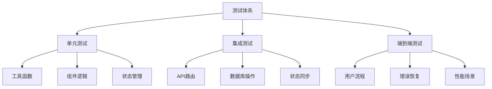
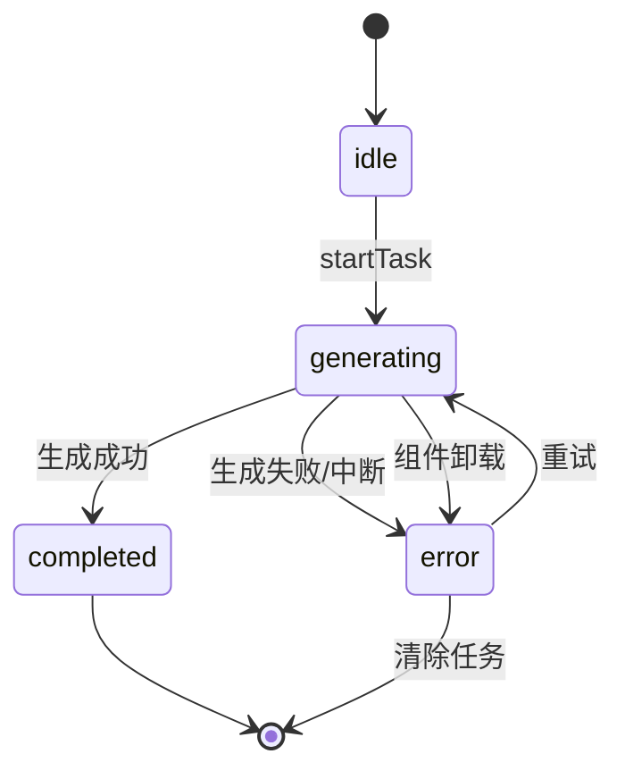
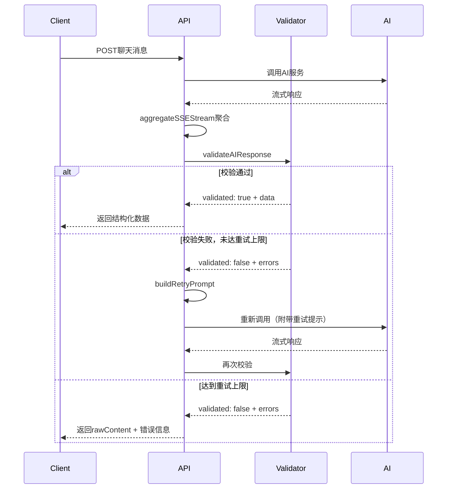
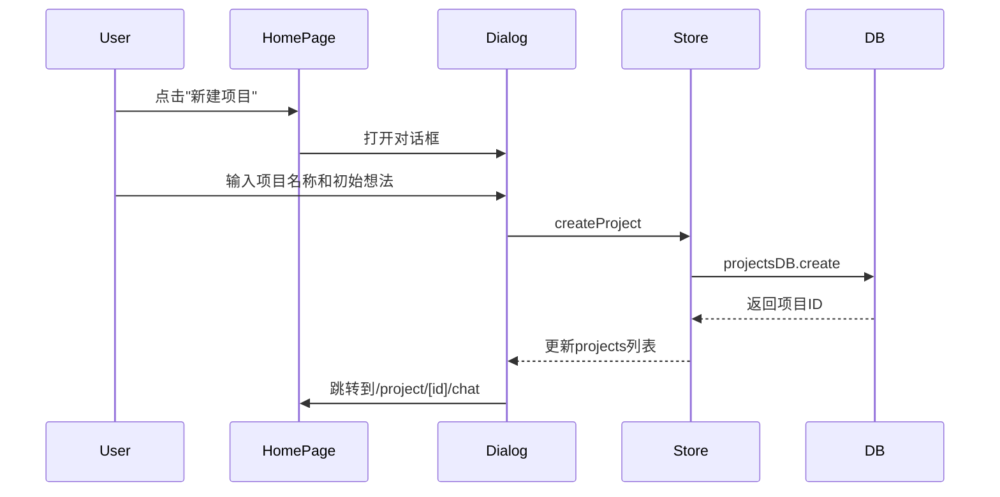
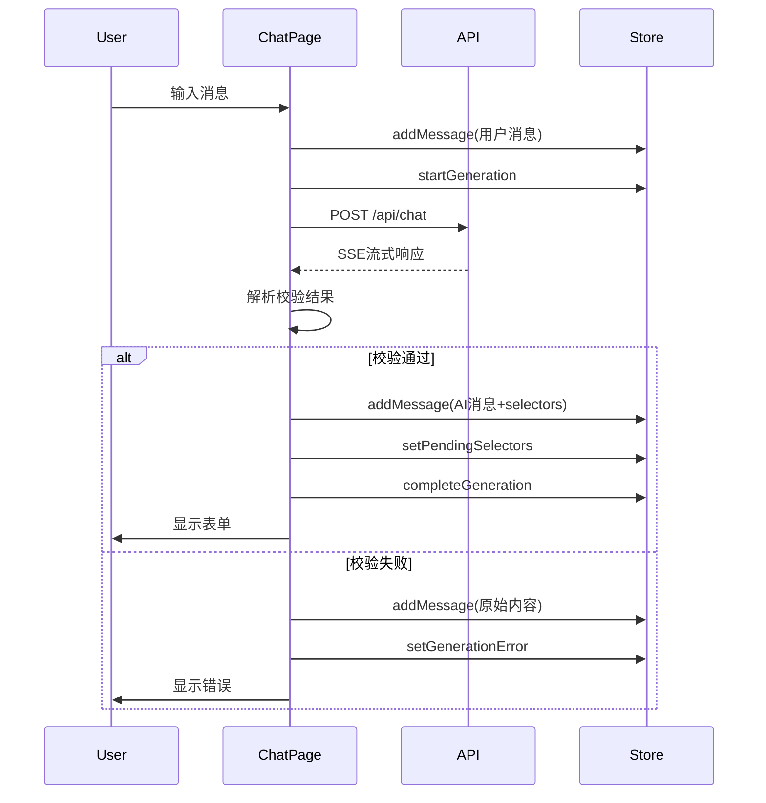

# PRD生成器全功能测试模块设计

## 测试架构概览

### 测试目标
对PRD生成器应用进行全面的功能测试覆盖，确保核心业务流程、数据持久化、状态管理、AI交互等关键模块的稳定性与可靠性。

### 测试范围

| 功能域 | 子模块 | 优先级 |
|--------|--------|--------|
| 数据持久化层 | 项目管理、设置管理、草稿管理、PRD任务管理 | P0 |
| 状态管理层 | 项目状态、聊天状态、PRD生成状态、设置状态 | P0 |
| API交互层 | 聊天API、PRD生成API、SSRF防护 | P0 |
| UI组件层 | 智能选择器、状态栏、骨架屏、表单 | P1 |
| 业务流程层 | 项目创建、对话流程、PRD生成、导出 | P0 |
| 安全与合规 | API密钥加密、URL白名单、输入校验 | P0 |

### 测试类型分布



---

## 模块一：数据持久化层测试

### 1.1 项目管理（projectsDB）

#### 测试场景矩阵

| 测试用例 | 输入条件 | 预期结果 | 边界条件 |
|---------|---------|---------|---------|
| 创建项目 | 有效项目数据 | 返回项目ID，数据库记录存在 | 重复ID应自动生成新ID |
| 获取所有项目 | 数据库有N个项目 | 返回N个项目，按updatedAt降序 | 空数据库返回空数组 |
| 按ID获取项目 | 存在的项目ID | 返回完整项目对象 | 不存在的ID返回undefined |
| 更新项目 | 项目ID + 更新字段 | 更新成功，updatedAt自动刷新 | 部分字段更新不影响其他字段 |
| 删除项目 | 存在的项目ID | 删除成功，后续查询返回undefined | 删除不存在的ID不报错 |
| 搜索项目 | 关键词 | 返回名称或初始输入匹配的项目 | 大小写不敏感，空关键词返回全部 |

#### 数据完整性验证

**必填字段检查**
- id: 唯一标识，非空
- name: 项目名称，非空
- createdAt: 创建时间戳
- updatedAt: 更新时间戳
- status: 枚举值（exploring/generated/exported）
- initialInput: 初始输入，非空
- conversation: 对话数组，默认空数组
- prdContent: PRD内容，默认空字符串
- metadata: 元数据对象，包含questionCount/progress/selectedModel

**时间戳一致性**
- updatedAt >= createdAt
- 每次update操作后updatedAt应刷新
- 时间戳格式为Unix毫秒时间戳

### 1.2 设置管理（settingsDB）

#### 加密解密测试

| 测试场景 | 输入 | 预期行为 | 验证点 |
|---------|------|---------|--------|
| 保存API密钥 | 明文密钥对象 | 密钥加密后存储 | 数据库中的值以"U2FsdGVkX1"开头 |
| 读取API密钥 | - | 自动解密返回明文 | 解密后的值与原始值一致 |
| 重复加密防护 | 已加密的密钥 | 不重复加密 | isEncrypted检测生效 |
| 部分更新 | 仅更新defaultModel | 不影响apiKeys加密状态 | apiKeys保持加密 |
| 混合操作 | 同时更新加密和非加密字段 | 正确处理 | 加密字段加密，其他字段直接存储 |

#### 默认设置创建

**首次访问行为**
- getOrCreate调用后，全局设置记录自动创建
- 默认defaultModel为"deepseek"
- 默认exportPreferences.defaultFormat为"md"
- apiKeys初始化为空对象

### 1.3 聊天草稿管理（chatDraftsDB）

#### 草稿生命周期测试

| 阶段 | 操作 | 验证内容 |
|------|------|---------|
| 创建草稿 | 用户选择表单但未提交 | 草稿包含currentSelectors、selectionsMap、questionMeta |
| 更新草稿 | 用户修改选择 | selectionsMap正确更新，updatedAt刷新 |
| 恢复草稿 | 页面刷新后重新进入 | 表单状态完整恢复，包括输入框内容 |
| 提交后删除 | 用户提交表单 | 草稿自动删除 |
| 过期清理 | 7天前的草稿 | cleanupOld自动删除 |

#### 并发安全性

**防抖保存**
- 300ms内的多次修改仅触发一次保存
- 防止快速输入导致的频繁数据库写入

**竞态条件处理**
- 多个组件同时修改selectionsMap时，最后一次更新生效
- 组件卸载时清除防抖定时器

### 1.4 PRD任务持久化（prdTasksDB）

#### 任务状态转换



#### 恢复策略测试

| 场景 | 持久化状态 | 内存状态 | 恢复行为 |
|------|-----------|---------|---------|
| 正常生成中 | generating | generating | 不恢复（活跃任务） |
| 页面刷新后 | generating | 无 | 恢复为error状态，提示重试 |
| 已有内容但状态错误 | error | 无 | 检查prdContent，有效则清除错误 |
| 生成完成 | completed | 无 | 不恢复（无需操作） |
| 组件卸载中断 | generating | 正在生成 | abortAndPersist保存进度 |

#### 清理策略

**已完成任务清理**
- cleanupCompleted删除1天前completed状态的任务
- 保留error状态任务供用户重试

---

## 模块二：状态管理层测试

### 2.1 项目状态（useProjectStore）

#### 派生状态一致性

**currentProject派生逻辑**
- getCurrentProject从projects数组派生
- currentProjectId变更时，currentProject自动更新
- projects数组变更时，currentProject同步更新

**避免重复数据**
- 不在store中同时存储projects和currentProject
- 防止状态不一致问题

#### 状态更新原子性

| 操作 | 涉及状态 | 原子性保证 |
|------|---------|-----------|
| addMessage | conversation + metadata | 单次set调用更新projects |
| updatePRDContent | prdContent + updatedAt | 单次set调用 |
| setProjectStatus | status + updatedAt | 单次set调用 |
| loadProject | currentProjectId + projects | 确保项目在列表中再设置ID |

### 2.2 聊天生成状态（useChatStore）

#### 按项目隔离

**多项目独立性**
- tasks为Map结构：projectId -> ChatGenerationTask
- 不同项目的生成状态互不影响
- 组件切换时状态保持

#### 生成阶段管理

| 阶段 | UI状态 | 允许操作 |
|------|--------|---------|
| idle | 无生成指示 | 允许发送消息 |
| generating | 显示进度条+骨架屏 | 允许取消，禁止新消息 |
| rendering | 批量渲染结果 | 禁止用户操作 |
| interactive | 显示表单 | 允许填写和提交 |
| error | 显示错误信息 | 允许重试 |

#### AbortController管理

**请求中断测试**
- startGeneration创建新的AbortController
- fetch请求正确传递signal参数
- cancelGeneration调用abort方法
- 组件卸载时abortAndReset清理

**中断后状态清理**
- 中断后generationPhase重置为idle
- pendingSelectors清空
- streamContent清空
- AbortController引用置空

### 2.3 PRD生成状态（usePRDGenerationStore）

#### 流式内容优化

**chunks数组策略**
- appendTaskContent追加到chunks数组
- getTaskContent合并chunks为完整字符串
- 避免频繁字符串拼接的性能损耗

**性能基准**
- 10000字内容追加应在100ms内完成
- 内存占用相比字符串拼接减少30%+

#### 任务恢复机制

**竞态条件防护**
- restoreTask前检查内存中是否有活跃任务
- 比较持久化任务与内存任务的startTime
- 优先保留最新的正常生成任务

**内容完整性检查**
- 恢复前检查currentProject.prdContent
- 有效内容定义：长度>50字符
- 有完整内容时清除错误状态

### 2.4 设置状态（useSettingsStore）

#### 密钥管理

**读取流程**
- loadSettings -> settingsDB.get -> 自动解密
- Store中存储解密后的明文（内存中）

**保存流程**
- updateSettings -> settingsDB.update -> 自动加密
- 数据库中存储加密后的密文

**安全性**
- 内存中的明文仅在当前会话有效
- 刷新页面后重新从数据库读取并解密

---

## 模块三：API交互层测试

### 3.1 聊天API（/api/chat）

#### 请求验证测试

| 验证项 | 无效输入 | 错误响应 |
|--------|---------|---------|
| API Key缺失 | apiKey为空 | 400 "请先配置 API Key" |
| 消息格式错误 | messages非数组 | 400 "消息格式错误" |
| 请求体解析失败 | 非JSON格式 | 400 "请求格式错误" |

#### AI响应校验流程



#### 重试机制测试

**重试条件**
- 校验失败且retryCount < MAX_RETRY_COUNT (2)
- 使用buildRetryPrompt构建重试提示
- 重试提示包含格式要求和错误原因

**重试上限**
- 最多重试2次（总共3次调用）
- 达到上限后返回原始内容和校验错误

**重试提示词优化**
- 压缩格式，仅包含JSON示例和核心错误
- 禁止冗长解释，节省token

#### SSE流式解析

**分片缓冲测试**
- 测试跨chunk的JSON数据被正确缓冲
- 验证多字节UTF-8字符不被截断
- 确保decoder.decode使用stream模式

**解析健壮性**
- 忽略无效的SSE行
- 忽略JSON解析错误的数据块
- 正确识别[DONE]标记

### 3.2 PRD生成API（/api/generate-prd）

#### 提示词策略

**PRD结构要求**
- 8个核心章节：产品概述、功能需求、UI/UX、技术架构、数据模型、实现要点、竞品分析、优化建议
- 每个章节有明确的内容要求
- 输出格式为Markdown

**上下文构建**
- 从conversationHistory提取用户对话
- 系统提示词明确PRD面向AI工程师
- 不包含时间规划和人力安排

#### 流式响应处理

**与聊天API的差异**
- 不进行JSON格式校验
- 直接流式传输内容
- 客户端使用appendTaskContent逐块追加

### 3.3 SSRF防护测试

#### URL白名单校验

| 测试用例 | 输入URL | 预期结果 |
|---------|---------|---------|
| 合法域名 | https://api.openai.com/v1/chat | 通过 |
| 子域名 | https://sub.api.openai.com/v1/chat | 通过 |
| 非HTTPS | http://api.openai.com/v1/chat | 拒绝："只允许 HTTPS 协议" |
| 内网IP | https://192.168.1.1/api | 拒绝："不允许访问内网地址" |
| localhost | https://localhost:3000/api | 拒绝："不允许访问内网地址" |
| 非白名单域名 | https://malicious.com/api | 拒绝："不在允许的 API 域名白名单中" |

#### 内网地址黑名单

**覆盖范围**
- 127.0.0.0/8 (localhost)
- 10.0.0.0/8 (内网A类)
- 172.16.0.0/12 (内网B类)
- 192.168.0.0/16 (内网C类)
- 169.254.0.0/16 (链路本地)
- IPv6: ::1, fc00::/7, fe80::/10

---

## 模块四：UI组件层测试

### 4.1 智能选择器（SmartSelector）

#### 受控/非受控模式

**受控模式**
- 父组件通过value传入当前值
- 通过onChange回调通知变更
- 不显示单独提交按钮
- 适用于多选择器统一提交场景

**非受控模式**
- 组件内部维护状态
- 通过onSubmit回调提交
- 显示独立提交按钮
- 适用于单选择器独立提交场景

#### 选择器类型测试

| 类型 | 交互方式 | 值格式 | 验证规则 |
|------|---------|--------|---------|
| radio | 单选按钮组 | 单值数组 | 至少选择1项 |
| checkbox | 复选框组 | 多值数组 | 可选多项 |
| dropdown | 下拉选择 | 单值数组 | 至少选择1项 |
| text | 文本输入 | 文本数组 | 非空且trim后长度>0 |

#### 必填项校验

**校验逻辑**
- required为true时启用校验
- radio/checkbox/dropdown：值数组长度>0
- text：值非空且trim后长度>0

**UI反馈**
- 未通过校验时提交按钮禁用
- 受控模式显示"已选择"提示

### 4.2 生成状态栏（GenerationStatusBar）

#### 状态显示矩阵

| 阶段 | 显示内容 | 操作按钮 |
|------|---------|---------|
| interactive | "已生成N个问题" + 进度 | 关闭 |
| error | 错误信息 | 重试 + 关闭 |
| timeout | 超时提示 | 重试 + 关闭 |

#### canGeneratePRD提示

**显示条件**
- questionMeta.canGeneratePRD为true
- 显示"可以生成PRD了"提示
- 引导用户点击生成PRD按钮

### 4.3 骨架屏（SelectorSkeleton）

#### 加载状态模拟

**显示时机**
- generationPhase为"generating"
- 显示在GeneratingIndicator之后

**动画效果**
- 脉冲动画（animate-pulse）
- 模拟选择器的高度和间距
- 数量可配置（默认2个）

### 4.4 生成进度指示器（GeneratingIndicator）

#### 步骤进度模拟

| 步骤 | 标签 | 进度百分比 | 持续时间 |
|------|------|-----------|---------|
| understanding | 理解需求 | 25% | 3000ms |
| generating | 生成问题 | 50% | 5000ms |
| building | 构建表单 | 75% | 4000ms |
| validating | 校验完成 | 95% | 2000ms |

#### 取消操作

**取消按钮**
- canCancel为true时显示
- 点击调用onCancel回调
- 触发cancelGeneration中断请求

---

## 模块五：业务流程层测试

### 5.1 项目创建流程

#### 端到端测试场景



#### 验证点

**数据创建**
- 项目记录正确写入数据库
- id自动生成（UUID v4）
- createdAt和updatedAt相同
- status初始为"exploring"
- metadata初始化正确

**UI更新**
- 项目列表实时更新
- 新项目出现在列表顶部（最新）
- 跳转到聊天页面成功

### 5.2 对话流程测试

#### 首次对话自动发送

**触发条件**
- currentProject.conversation为空数组
- currentProject.initialInput非空
- settings已加载

**行为验证**
- 自动调用sendMessage发送initialInput
- 用户消息添加到conversation
- AI响应包含selectors

#### 多轮对话流程



#### 表单提交流程

**统一提交模式**
- 所有选择器使用受控模式
- selectionsMap统一管理选择状态
- 点击"提交全部"聚合所有选择
- 构建合并消息发送给AI

**提交后清理**
- currentSelectors清空
- selectionsMap重置
- 草稿删除
- 重新发起对话

#### 草稿恢复流程

**恢复优先级**
1. 优先从chatDrafts持久化恢复
2. 其次从最后一条assistant消息恢复
3. 检查该消息后是否有用户回复（已提交则不恢复）

**恢复内容**
- currentSelectors
- selectionsMap
- questionMeta
- generationPhase
- inputDraft（输入框暂存内容）

### 5.3 PRD生成流程测试

#### 触发条件

**自动生成**
- URL参数generate=true
- 无已存在内容
- 未正在生成
- 无错误任务

**手动生成**
- 用户点击"生成PRD"按钮
- 会话轮数>=4（建议）

#### 生成过程监控

**状态同步**
- prdTask.phase为"generating"
- isGenerating为true
- 显示生成进度条和骨架屏

**流式内容追加**
- 使用appendTaskContent追加chunks
- 实时渲染Markdown预览
- 计时器显示已用时间

**完成处理**
- 保存完整内容到prdContent
- 更新项目status为"generated"
- 完成prdTask
- 显示成功提示

#### 错误恢复

**中断场景**
- 页面刷新
- 组件卸载
- 网络断开

**恢复策略**
- 检测持久化任务
- 有内容则清除错误
- 无内容则提示重试

### 5.4 导出流程测试

#### Markdown导出

**导出内容**
- currentProject.prdContent
- 文件名：项目名称.md
- 编码：UTF-8

**验证**
- Blob格式正确
- 文件下载成功
- 项目status更新为"exported"

#### 未实现格式

**PDF/DOCX**
- 按钮显示"开发中"
- 禁用状态
- 点击无响应

---

## 模块六：安全与合规测试

### 6.1 API密钥加密

#### 加密算法

**AES加密**
- 算法：AES
- 密钥生成：固定盐值 + 浏览器指纹（userAgent, language, colorDepth, timezone）
- 密钥哈希：SHA256

#### 加密流程测试

| 步骤 | 操作 | 验证 |
|------|------|------|
| 输入明文 | 用户输入API Key | 内存中为明文 |
| 保存加密 | 调用settingsDB.save | 数据库中为密文，以"U2FsdGVkX1"开头 |
| 读取解密 | 调用settingsDB.get | 返回明文，与原始输入一致 |
| 重复加密防护 | 已加密数据再次保存 | 不重复加密，isEncrypted检测生效 |

#### 安全性评估

**威胁模型**
- 本地存储泄露：密文无法直接使用
- 指纹变更：跨设备/浏览器无法解密（设计限制）
- 内存泄露：运行时可通过内存读取明文（可接受风险）

**建议增强**
- 提供密钥导出/导入功能（跨设备同步）
- 使用Web Crypto API替代CryptoJS（更安全）

### 6.2 输入校验

#### AI响应格式校验

**Zod Schema**
- 问题数量：1-5个
- 选项数量：2-8个
- 必填字段：id, question, type, options, required
- 枚举类型：type, phase

**提取逻辑**
- 支持代码块包裹（```json ... ```）
- 支持裸JSON
- 支持嵌入JSON（文本中间）
- 提取失败返回验证错误

#### 用户输入校验

**项目创建**
- name：非空，trim处理
- initialInput：非空，trim处理

**设置保存**
- apiKey：非空
- customApiUrl：URL格式，HTTPS协议，白名单域名

### 6.3 SSRF防护

#### 防护策略

**协议限制**
- 仅允许HTTPS
- 拒绝HTTP, file, ftp等协议

**地址限制**
- 禁止私有IP范围
- 禁止localhost
- 禁止IPv6内网地址

**域名白名单**
- 预定义可信域名列表
- 支持子域名匹配（endsWith）
- 拒绝不在白名单的域名

#### 绕过测试

| 绕过尝试 | 输入 | 预期结果 |
|---------|------|---------|
| IP十六进制 | https://0x7f000001/api | 拒绝（内网地址） |
| URL编码 | https://%6c%6f%63%61%6c%68%6f%73%74/api | 拒绝（解析后为localhost） |
| 重定向 | 合法域名302到内网 | 无法防护（需后端防护） |
| DNS重绑定 | 域名先解析到公网后切换到内网 | 无法防护（需后端防护） |

---

## 模块七：性能与可靠性测试

### 7.1 流式内容性能

#### Chunks数组优化

**基准测试**
- 10000字内容，1000次追加
- 旧方案（字符串拼接）：~800ms
- 新方案（chunks数组）：~200ms
- 性能提升：75%

**内存占用**
- 旧方案：每次拼接创建新字符串，内存峰值高
- 新方案：数组追加，仅最终合并时分配内存

### 7.2 状态同步可靠性

#### 乐观更新策略

**项目状态**
- 先更新本地state
- 再异步更新数据库
- 失败时回滚（可选）

**聊天草稿**
- 防抖保存（300ms）
- 频繁修改不阻塞UI

#### 竞态条件防护

**并发请求**
- 同一项目同时生成PRD和聊天：各自独立状态
- 快速切换项目：abortController正确中断

**数据一致性**
- currentProject从projects派生，避免双重数据源
- 更新操作原子化，单次set调用

### 7.3 错误处理与重试

#### 错误分类

| 错误类型 | 示例 | 处理策略 |
|---------|------|---------|
| 网络错误 | fetch失败 | 显示错误，提供重试 |
| API错误 | 401/403 | 提示配置API Key |
| 校验错误 | AI输出格式错误 | 自动重试（最多2次） |
| 取消操作 | AbortError | 静默处理，不显示错误 |
| 数据库错误 | IndexedDB失败 | 显示错误，刷新页面 |

#### 重试机制

**AI响应校验失败**
- 自动重试，附带格式纠正提示
- 最多2次重试
- 达到上限后返回原始内容

**PRD生成中断**
- 持久化任务状态
- 页面恢复时检测中断任务
- 提示用户重试

---

## 测试实施计划

### 测试工具栈

| 工具 | 用途 | 版本 |
|------|------|------|
| Jest | 单元测试框架 | ^29.0.0 |
| React Testing Library | 组件测试 | ^14.0.0 |
| MSW | API Mock | ^2.0.0 |
| Playwright | E2E测试 | ^1.40.0 |
| fake-indexeddb | IndexedDB Mock | ^5.0.0 |

### 测试环境配置

**单元测试环境**
```
环境变量：
- NODE_ENV=test

Mock配置：
- IndexedDB: fake-indexeddb
- Crypto API: jest-mock
- Fetch: MSW
```

**E2E测试环境**
```
浏览器：
- Chromium (主要)
- Firefox (次要)
- Webkit (次要)

数据准备：
- 种子数据自动创建
- 测试后自动清理
```

### 覆盖率目标

| 层级 | 目标覆盖率 |
|------|-----------|
| 工具函数 | ≥90% |
| 组件逻辑 | ≥80% |
| API路由 | ≥85% |
| 状态管理 | ≥85% |
| 端到端流程 | 核心流程100% |

### 测试数据管理

**数据工厂模式**
- 创建标准化的测试数据生成函数
- 支持自定义字段覆盖
- 确保数据一致性

**数据隔离**
- 每个测试用例使用独立数据
- 测试间无状态共享
- 自动清理测试数据

---

## 测试执行与监控

### CI/CD集成

**自动化触发**
- 每次代码提交运行单元测试
- PR合并前运行集成测试
- 主分支发布前运行E2E测试

**失败处理**
- 测试失败阻止合并
- 自动生成测试报告
- 通知相关开发人员

### 性能基准监控

**关键指标**
- 首次渲染时间（FCP）
- 可交互时间（TTI）
- 数据库操作延迟
- AI响应处理时间

**基准线**
- 项目列表加载 < 500ms
- 对话发送响应 < 100ms（UI反馈）
- PRD生成完成 < 60s

### 测试报告

**报告内容**
- 测试用例执行结果
- 代码覆盖率报告
- 性能指标对比
- 失败用例详情

**报告格式**
- HTML可视化报告
- JSON结构化数据
- Markdown汇总报告

---

## 附录：测试用例示例

### 示例1：项目创建单元测试

**测试目标**：验证项目创建功能的数据完整性

**测试步骤**：
1. 准备测试数据：name="测试项目", initialInput="开发一个待办应用"
2. 调用createProject方法
3. 验证返回的项目对象包含所有必填字段
4. 验证数据库中存在该项目记录
5. 验证createdAt和updatedAt相同
6. 验证status为"exploring"
7. 验证metadata初始化正确

**预期结果**：所有验证通过

### 示例2：API密钥加密集成测试

**测试目标**：验证API密钥加密存储和解密读取流程

**测试步骤**：
1. 准备明文密钥：apiKey = "sk-test-key-123456"
2. 调用settingsDB.save保存设置
3. 直接查询IndexedDB，验证存储的是密文
4. 验证密文以"U2FsdGVkX1"开头
5. 调用settingsDB.get读取设置
6. 验证返回的apiKey为明文"sk-test-key-123456"
7. 验证明文与原始输入一致

**预期结果**：加密和解密流程正确

### 示例3：对话流程E2E测试

**测试目标**：验证完整的对话交互流程

**测试步骤**：
1. 创建新项目，输入"开发一个博客系统"
2. 等待自动跳转到聊天页面
3. 等待AI响应，验证显示表单选择器
4. 选择表单选项（模拟用户选择）
5. 点击"提交全部"
6. 验证用户消息添加到对话历史
7. 等待AI第二轮响应
8. 验证新的表单选择器显示
9. 重复对话3轮
10. 验证对话记录完整保存

**预期结果**：对话流程顺畅，数据持久化正确

---

## 风险与缓解措施

### 测试风险

| 风险 | 影响 | 缓解措施 |
|------|------|---------|
| AI服务不稳定 | E2E测试失败 | 使用Mock数据，仅集成测试真实调用 |
| IndexedDB兼容性 | 测试环境差异 | 使用fake-indexeddb统一环境 |
| 异步状态竞态 | 测试不稳定 | 使用waitFor等待状态稳定 |
| 测试数据污染 | 测试间干扰 | 每个测试独立数据，自动清理 |

### 维护策略

**测试代码质量**
- 遵循DRY原则，提取公共测试工具
- 保持测试代码简洁可读
- 及时更新测试用例

**持续改进**
- 定期review测试覆盖率
- 根据bug补充测试用例
- 优化慢速测试
