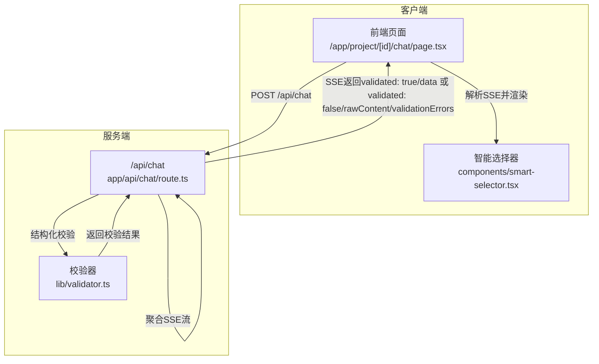
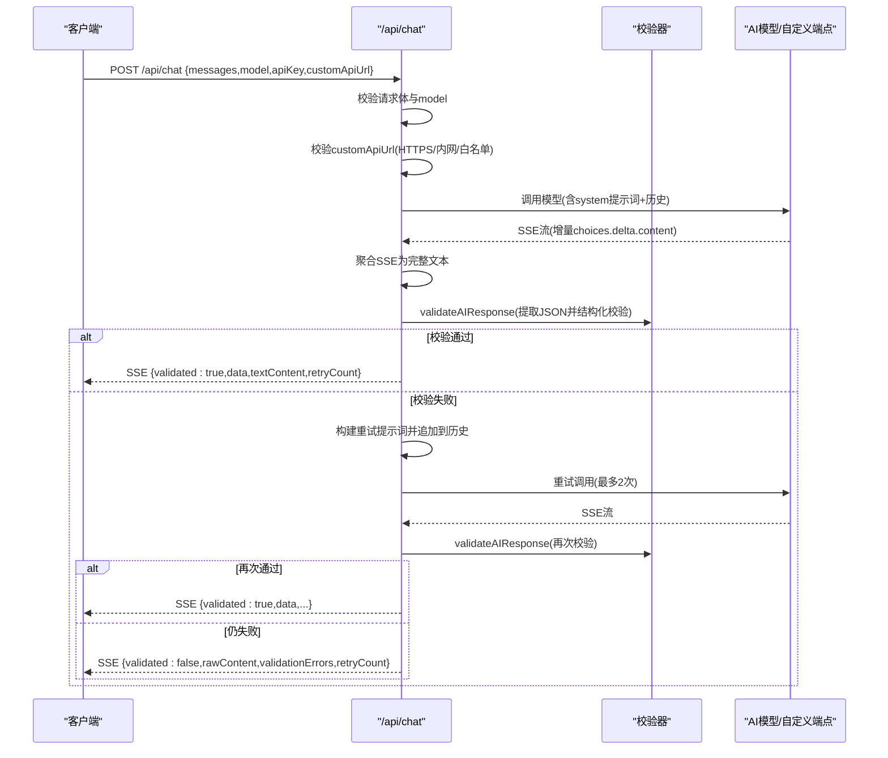
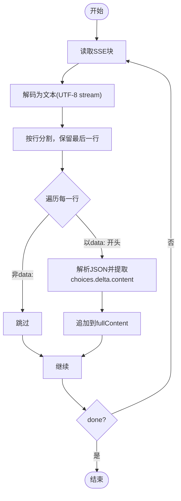
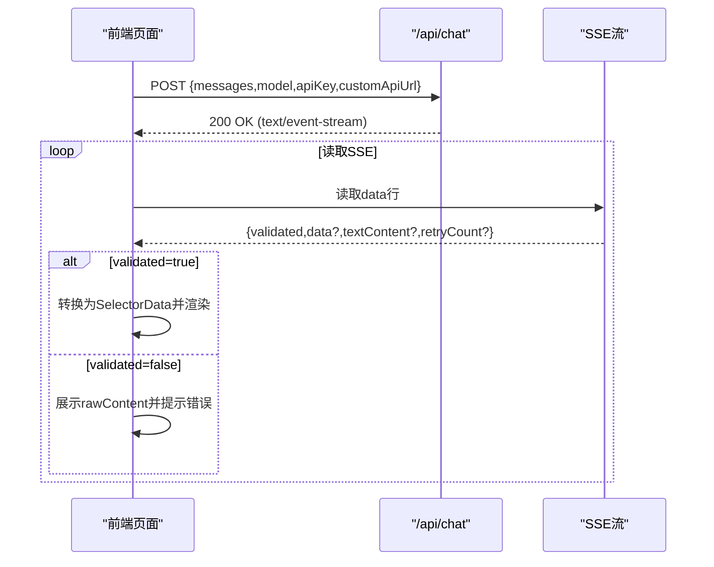
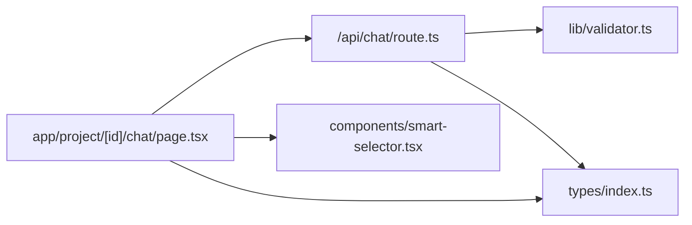

# AI对话API (/api/chat)

<cite>
**本文引用的文件**
- [route.ts](file://prd-generator/src/app/api/chat/route.ts)
- [validator.ts](file://prd-generator/src/lib/validator.ts)
- [page.tsx](file://prd-generator/src/app/project/[id]/chat/page.tsx)
- [smart-selector.tsx](file://prd-generator/src/components/smart-selector.tsx)
- [index.ts](file://prd-generator/src/types/index.ts)
</cite>

## 更新摘要
**变更内容**
- 更新了 `/api/chat` 端点的系统提示词（SYSTEM_PROMPT），强化了纯JSON输出模式
- 明确了AI回复必须仅包含一个JSON代码块，禁止任何开场白或解释性文字
- 细化了对话阶段控制规则和完成判断条件
- 更新了相关文档部分以反映最新的系统提示词和生成规则

## 目录
1. [简介](#简介)
2. [项目结构](#项目结构)
3. [核心组件](#核心组件)
4. [架构总览](#架构总览)
5. [详细组件分析](#详细组件分析)
6. [依赖分析](#依赖分析)
7. [性能考虑](#性能考虑)
8. [故障排查指南](#故障排查指南)
9. [结论](#结论)
10. [附录](#附录)

## 简介
本文件为 /api/chat 端点的详细API文档，涵盖请求与响应格式、SSE流式返回、系统提示词强制纯JSON输出、自动校验与最多2次重试机制、安全策略（HTTPS校验、内网拦截、域名白名单）、以及前端解析SSE并驱动智能选择器（smart-selector）的实践。

## 项目结构
/api/chat 位于服务端Next.js应用中，负责接收客户端POST请求，调用第三方AI模型（或自定义URL），聚合SSE流，校验AI输出为结构化JSON，再通过SSE返回给前端。前端页面订阅SSE，解析后端校验结果，驱动UI组件（智能选择器）渲染与交互。

**图表来源**
- [route.ts](file://prd-generator/src/app/api/chat/route.ts#L257-L425)
- [validator.ts](file://prd-generator/src/lib/validator.ts#L94-L147)
- [page.tsx](file://prd-generator/src/app/project/[id]/chat/page.tsx#L226-L387)
- [smart-selector.tsx](file://prd-generator/src/components/smart-selector.tsx#L1-L255)

**章节来源**
- [route.ts](file://prd-generator/src/app/api/chat/route.ts#L1-L426)
- [validator.ts](file://prd-generator/src/lib/validator.ts#L1-L274)
- [page.tsx](file://prd-generator/src/app/project/[id]/chat/page.tsx#L1-L762)
- [smart-selector.tsx](file://prd-generator/src/components/smart-selector.tsx#L1-L255)

## 核心组件
- 请求端点：/api/chat（POST）
- 请求体字段：
  - messages：数组，元素为 { role, content }，表示对话历史
  - model：字符串，支持 deepseek/qwen/doubao/custom
  - apiKey：字符串，用于鉴权
  - customApiUrl：字符串（当 model=custom 时使用），用于指定自定义AI服务端点
- 响应格式：SSE（text/event-stream）
  - 成功：validated: true，data: 结构化JSON，textContent: 原始文本片段，retryCount: 重试次数
  - 失败：validated: false，rawContent: 原始内容，validationErrors: 校验错误列表，retryCount: 重试次数
- 校验规则：后端通过系统提示词强制AI输出纯JSON；前端收到SSE后，若validated为true则解析data并渲染智能选择器；否则展示rawContent并提示错误

**章节来源**
- [route.ts](file://prd-generator/src/app/api/chat/route.ts#L257-L425)
- [validator.ts](file://prd-generator/src/lib/validator.ts#L94-L147)
- [index.ts](file://prd-generator/src/types/index.ts#L110-L123)

## 架构总览
后端流程概览：
- 解析请求体，校验必填字段
- 根据model选择AI端点或自定义URL
- 自定义URL安全校验（HTTPS、内网拦截、域名白名单）
- 构造系统提示词+历史消息，调用AI并聚合SSE流
- 校验AI输出为结构化JSON，支持最多2次重试
- 通过SSE返回validated结果，前端解析并渲染

**图表来源**
- [route.ts](file://prd-generator/src/app/api/chat/route.ts#L257-L425)
- [validator.ts](file://prd-generator/src/lib/validator.ts#L94-L147)

## 详细组件分析

### 请求与响应规范
- 请求方法：POST
- 路径：/api/chat
- Content-Type：application/json
- 请求体字段
  - messages：必填，数组，元素为 { role, content }
  - model：必填，枚举值 deepseek/qwen/doubao/custom
  - apiKey：必填，字符串
  - customApiUrl：当 model=custom 时必填，否则可选
- 响应
  - 成功：SSE，事件行以"data: "开头，最后一行为"data: [DONE]"
  - 失败：SSE，事件行以"data: "开头，包含validated=false与validationErrors/rawContent/retryCount
  - 错误：HTTP 400/500，JSON { error }

**章节来源**
- [route.ts](file://prd-generator/src/app/api/chat/route.ts#L257-L425)
- [index.ts](file://prd-generator/src/types/index.ts#L110-L123)

### 系统提示词与纯JSON输出
- 后端注入system消息，强制AI输出纯JSON，禁止任何解释性文字
- 要求每次回复只能是一个JSON代码块，不能出现JSON之外的字符
- JSON结构包含 questions 数组与 meta 元信息
- 前端收到validated=true后，将data转换为选择器数据并渲染
- 生成规则细化：
  - 每轮生成1-3个问题，描述简洁、避免双重否定
  - 优先使用radio/checkbox/dropdown；文本题仅用于收集少量开放信息
  - 选项文案务必具体可执行，尽量<30字
  - meta.phase按进度推进：basic(0-30%)关注背景/目标；feature(30-60%)关注功能/交互；technical(60-85%)关注实现方式/架构倾向；confirmation(85-100%)收尾确认
  - progress根据完成度单调递增
  - 当核心功能≥3、目标用户明确、技术/实现路径已有倾向时，设置canGeneratePRD: true，并加入一个收尾确认问题

**章节来源**
- [route.ts](file://prd-generator/src/app/api/chat/route.ts#L91-L214)
- [page.tsx](file://prd-generator/src/app/project/[id]/chat/page.tsx#L34-L55)

### SSE流式聚合与解析
- 后端聚合SSE流，提取choices.delta.content拼接为完整文本
- 前端同样聚合SSE，解析data为ValidatedChatResponse
- 前端仅在validated=true时使用data渲染智能选择器

**图表来源**
- [validator.ts](file://prd-generator/src/lib/validator.ts#L221-L273)
- [page.tsx](file://prd-generator/src/app/project/[id]/chat/page.tsx#L269-L311)

**章节来源**
- [validator.ts](file://prd-generator/src/lib/validator.ts#L221-L273)
- [page.tsx](file://prd-generator/src/app/project/[id]/chat/page.tsx#L269-L311)

### 自动校验与最多2次重试
- 校验逻辑：extractJSON提取JSON，zod结构化校验，额外检查“由AI推荐”选项
- 若校验失败，后端追加重试提示词到消息历史，最多重试2次
- 前端收到validated=true时，若retryCount>0，提示自动纠正

**章节来源**
- [validator.ts](file://prd-generator/src/lib/validator.ts#L94-L147)
- [validator.ts](file://prd-generator/src/lib/validator.ts#L189-L215)
- [route.ts](file://prd-generator/src/app/api/chat/route.ts#L315-L387)
- [page.tsx](file://prd-generator/src/app/project/[id]/chat/page.tsx#L318-L347)

### 安全机制
- 自定义API URL校验
  - 仅允许HTTPS协议
  - 禁止内网地址（localhost/127.x/10.x/172.16-31.x/192.168.x/0.x/169.254.x/IPv6私有前缀等）
  - 域名白名单（允许的第三方API域名）
- 前端发送时携带apiKey与model，后端仅在必要时转发至AI端点

**章节来源**
- [route.ts](file://prd-generator/src/app/api/chat/route.ts#L31-L82)

### 前端fetch调用与SSE解析
- 前端向 /api/chat 发送POST，携带messages、model、apiKey、customApiUrl
- 读取response.body的ReadableStream，按SSE规则解析
- validated=true：解析data为ValidatedAIResponse，转换为SelectorData并渲染智能选择器
- validated=false：展示rawContent并提示validationErrors

**图表来源**
- [page.tsx](file://prd-generator/src/app/project/[id]/chat/page.tsx#L226-L387)
- [smart-selector.tsx](file://prd-generator/src/components/smart-selector.tsx#L1-L255)

**章节来源**
- [page.tsx](file://prd-generator/src/app/project/[id]/chat/page.tsx#L226-L387)
- [smart-selector.tsx](file://prd-generator/src/components/smart-selector.tsx#L1-L255)

## 依赖分析
- /api/chat 依赖
  - 校验器：validateAIResponse、buildRetryPrompt、aggregateSSEStream
  - 类型：ChatRequest/ChatResponse、SelectorData、QuestionMeta
- 前端依赖
  - 页面：发起fetch、解析SSE、渲染智能选择器
  - 组件：SmartSelector（受控模式统一渲染）

**图表来源**
- [route.ts](file://prd-generator/src/app/api/chat/route.ts#L1-L426)
- [validator.ts](file://prd-generator/src/lib/validator.ts#L1-L274)
- [page.tsx](file://prd-generator/src/app/project/[id]/chat/page.tsx#L1-L762)
- [smart-selector.tsx](file://prd-generator/src/components/smart-selector.tsx#L1-L255)
- [index.ts](file://prd-generator/src/types/index.ts#L110-L123)

**章节来源**
- [route.ts](file://prd-generator/src/app/api/chat/route.ts#L1-L426)
- [validator.ts](file://prd-generator/src/lib/validator.ts#L1-L274)
- [page.tsx](file://prd-generator/src/app/project/[id]/chat/page.tsx#L1-L762)
- [smart-selector.tsx](file://prd-generator/src/components/smart-selector.tsx#L1-L255)
- [index.ts](file://prd-generator/src/types/index.ts#L110-L123)

## 性能考虑
- 流式SSE聚合：后端与前端均采用流式解码，避免一次性加载大文本
- 重试策略：最多2次，减少无效请求与网络开销
- 前端渲染：validated=true时一次性渲染选择器，避免频繁DOM更新
- 建议
  - 控制messages长度，避免超长上下文导致token溢出
  - 合理设置temperature与max_tokens，平衡质量与速度

## 故障排查指南
- 常见错误
  - 请求格式错误：请求体非JSON或字段缺失
  - API密钥缺失：返回400，提示配置API Key
  - 模型配置无效：返回400，提示无效的model
  - 自定义URL不合法：返回400，提示HTTPS/内网/白名单问题
  - AI服务调用失败：返回500，包含AI服务状态码
  - 校验失败：validated=false，返回validationErrors与rawContent
- 前端处理
  - SSE解析失败：打印警告并提示AI输出异常
  - 重试提示：validated=true且retryCount>0时提示自动纠正
  - 取消请求：使用AbortController，避免资源泄漏

**章节来源**
- [route.ts](file://prd-generator/src/app/api/chat/route.ts#L257-L425)
- [page.tsx](file://prd-generator/src/app/project/[id]/chat/page.tsx#L313-L375)

## 结论
/api/chat 通过系统提示词强制AI输出纯JSON，结合后端结构化校验与最多2次重试，确保前端稳定获得结构化选择器数据。SSE流式传输与前端受控渲染，使UI交互流畅、可取消、可重试。安全策略有效防止SSRF风险，域名白名单进一步保障接入可信服务。

## 附录

### curl请求示例
- 示例1：使用内置模型
  - curl -X POST http://localhost:3000/api/chat -H "Content-Type: application/json" -d '{"messages":[{"role":"user","content":"你好"}],"model":"deepseek","apiKey":"sk-..."}'
- 示例2：使用自定义URL
  - curl -X POST http://localhost:3000/api/chat -H "Content-Type: application/json" -d '{"messages":[{"role":"user","content":"你好"}],"model":"custom","apiKey":"sk-...","customApiUrl":"https://api.openai.com/v1/chat/completions"}'

### 前端fetch调用代码片段路径
- 发送消息与解析SSE
  - [page.tsx](file://prd-generator/src/app/project/[id]/chat/page.tsx#L226-L387)

### SSE响应格式说明
- 成功
  - validated: true
  - data: 结构化JSON（questions数组与meta）
  - textContent: 原始文本片段（用于显示）
  - retryCount: 重试次数
- 失败
  - validated: false
  - rawContent: 原始内容
  - validationErrors: 校验错误列表
  - retryCount: 重试次数

**章节来源**
- [route.ts](file://prd-generator/src/app/api/chat/route.ts#L336-L416)
- [validator.ts](file://prd-generator/src/lib/validator.ts#L94-L147)