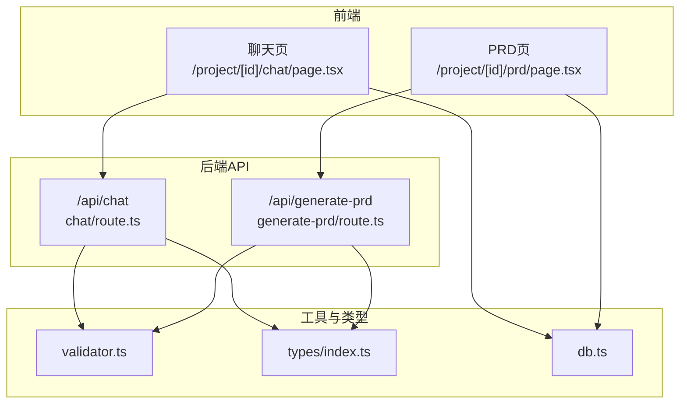
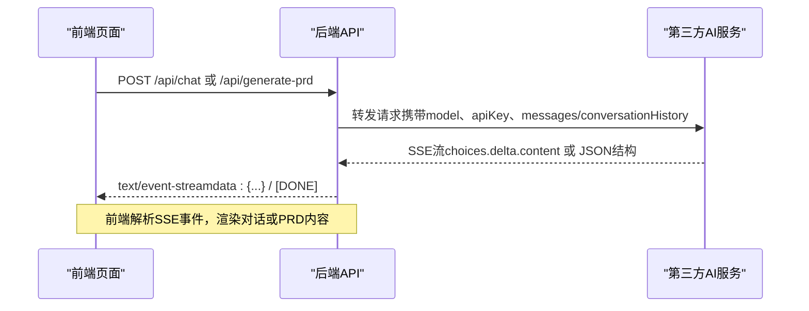
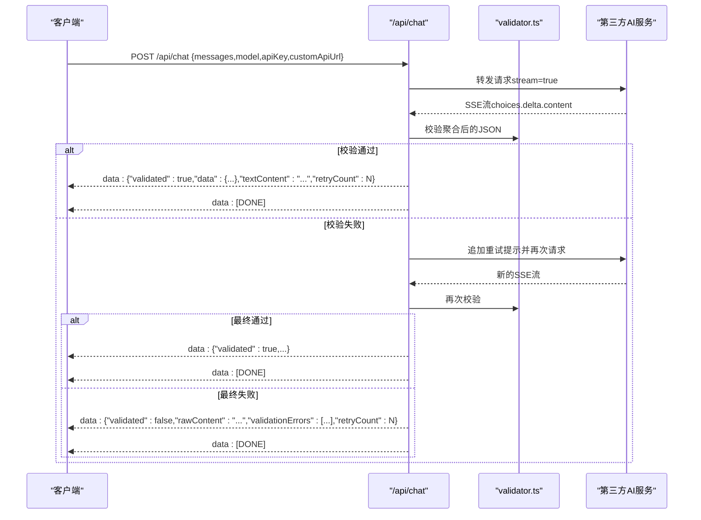
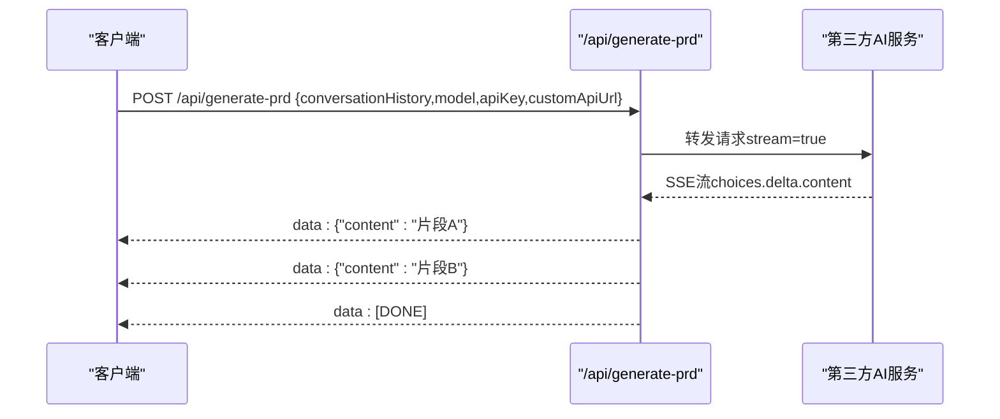
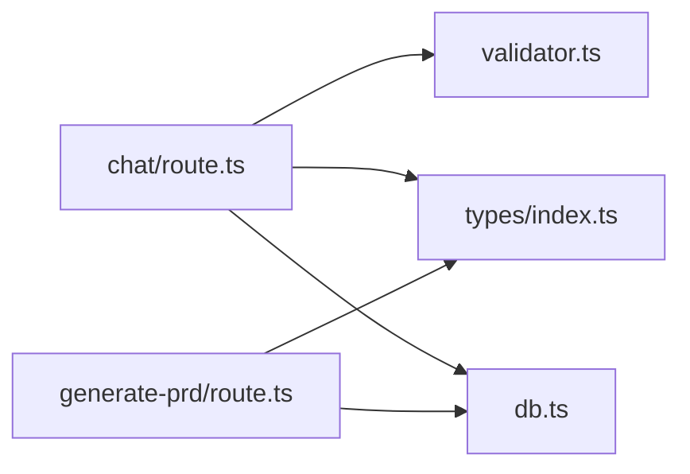

# API参考

<cite>
**本文引用的文件**
- [chat/route.ts](file://prd-generator/src/app/api/chat/route.ts)
- [generate-prd/route.ts](file://prd-generator/src/app/api/generate-prd/route.ts)
- [validator.ts](file://prd-generator/src/lib/validator.ts)
- [types/index.ts](file://prd-generator/src/types/index.ts)
- [db.ts](file://prd-generator/src/lib/db.ts)
- [chat/page.tsx](file://prd-generator/src/app/project/[id]/chat/page.tsx)
- [prd/page.tsx](file://prd-generator/src/app/project/[id]/prd/page.tsx)
</cite>

## 目录
1. [简介](#简介)
2. [项目结构](#项目结构)
3. [核心组件](#核心组件)
4. [架构总览](#架构总览)
5. [详细组件分析](#详细组件分析)
6. [依赖分析](#依赖分析)
7. [性能考虑](#性能考虑)
8. [故障排查指南](#故障排查指南)
9. [结论](#结论)

## 简介
本文件为后端API参考，聚焦两个核心端点：
- POST /api/chat：接收用户输入与对话上下文，通过流式SSE返回AI回复（包含结构化选择器JSON与文本内容），并内置AI输出格式校验与自动重试。
- POST /api/generate-prd：接收完整对话历史，流式生成PRD Markdown内容。

文档涵盖HTTP方法、URL、请求/响应格式（含SSE事件流结构）、错误码与示例，帮助开发者集成或调试后端服务。

## 项目结构
- 后端API位于 Next.js App Router 路由目录下，分别实现聊天与PRD生成逻辑。
- 前端页面通过 fetch 调用上述端点，使用SSE流式消费响应。

图表来源
- [chat/route.ts](file://prd-generator/src/app/api/chat/route.ts#L1-L426)
- [generate-prd/route.ts](file://prd-generator/src/app/api/generate-prd/route.ts#L1-L254)
- [validator.ts](file://prd-generator/src/lib/validator.ts#L1-L274)
- [types/index.ts](file://prd-generator/src/types/index.ts#L1-L243)
- [db.ts](file://prd-generator/src/lib/db.ts#L1-L210)
- [chat/page.tsx](file://prd-generator/src/app/project/[id]/chat/page.tsx#L225-L388)
- [prd/page.tsx](file://prd-generator/src/app/project/[id]/prd/page.tsx#L200-L312)

章节来源
- [chat/route.ts](file://prd-generator/src/app/api/chat/route.ts#L1-L426)
- [generate-prd/route.ts](file://prd-generator/src/app/api/generate-prd/route.ts#L1-L254)
- [chat/page.tsx](file://prd-generator/src/app/project/[id]/chat/page.tsx#L225-L388)
- [prd/page.tsx](file://prd-generator/src/app/project/[id]/prd/page.tsx#L200-L312)

## 核心组件
- /api/chat
  - 方法：POST
  - URL：/api/chat
  - 请求体字段：messages（数组，元素为{role,content}）、model（字符串，如deepseek/qwen/doubao/custom）、apiKey（字符串）、customApiUrl（字符串，当model=custom时必填）
  - 响应：text/event-stream；事件流包含一次结构化校验后的完整数据，随后发送[DONE]标记
  - 校验与重试：后端对AI输出进行结构化校验，失败时自动追加重试提示并最多重试N次
- /api/generate-prd
  - 方法：POST
  - URL：/api/generate-prd
  - 请求体字段：conversationHistory（字符串，完整对话历史文本）、model、apiKey、customApiUrl
  - 响应：text/event-stream；事件流逐条推送choices.delta.content片段，最后发送[DONE]标记

章节来源
- [chat/route.ts](file://prd-generator/src/app/api/chat/route.ts#L257-L426)
- [generate-prd/route.ts](file://prd-generator/src/app/api/generate-prd/route.ts#L109-L254)

## 架构总览
后端API采用Next.js Server Route，直接转发请求至第三方AI服务（支持多家模型厂商与自定义URL），并在服务端聚合SSE流，最终以SSE形式返回给前端。前端页面负责建立SSE连接、解析事件、渲染UI。

图表来源
- [chat/route.ts](file://prd-generator/src/app/api/chat/route.ts#L221-L367)
- [generate-prd/route.ts](file://prd-generator/src/app/api/generate-prd/route.ts#L161-L244)
- [chat/page.tsx](file://prd-generator/src/app/project/[id]/chat/page.tsx#L225-L388)
- [prd/page.tsx](file://prd-generator/src/app/project/[id]/prd/page.tsx#L200-L312)

## 详细组件分析

### /api/chat 端点
- 请求
  - Content-Type: application/json
  - Body字段
    - messages: 数组，元素为{role: string, content: string}
    - model: 字符串，支持 deepseek/qwen/doubao/custom
    - apiKey: 字符串，必填
    - customApiUrl: 字符串，当model=custom时必填
  - 安全校验
    - 自定义URL白名单与SSRF防护
    - 默认模型映射
- 处理流程
  - 构造系统提示词+用户消息
  - 调用第三方AI服务（开启stream=true）
  - 聚合SSE流为完整文本
  - 使用Zod Schema校验JSON结构，必要时自动重试
  - 返回SSE事件：一次结构化校验后的完整数据，随后[DONE]
- 响应（SSE）
  - 事件格式：data: {...}
  - 结束事件：data: [DONE]
  - 结构化数据字段
    - validated: boolean
    - data?: 校验通过的结构化数据（questions[], meta）
    - textContent?: 原始文本片段（若校验通过）
    - rawContent?: 原始内容（若校验失败）
    - validationErrors?: 校验错误列表（若校验失败）
    - retryCount?: 重试次数（若发生重试）
- 错误码
  - 400：请求格式错误、缺少API Key、messages格式错误、无效模型配置、自定义URL校验失败
  - 500：AI服务调用失败、内部错误
- 示例
  - 成功响应（结构化数据）
    - data: {"validated":true,"data":{"questions":[],"meta":{}},"textContent":"...","retryCount":0}
    - data: [DONE]
  - 失败响应（原始内容+错误）
    - data: {"validated":false,"rawContent":"...","validationErrors":["..."],"retryCount":N}
    - data: [DONE]

图表来源
- [chat/route.ts](file://prd-generator/src/app/api/chat/route.ts#L257-L426)
- [validator.ts](file://prd-generator/src/lib/validator.ts#L91-L147)

章节来源
- [chat/route.ts](file://prd-generator/src/app/api/chat/route.ts#L257-L426)
- [validator.ts](file://prd-generator/src/lib/validator.ts#L91-L147)
- [types/index.ts](file://prd-generator/src/types/index.ts#L110-L123)

### /api/generate-prd 端点
- 请求
  - Content-Type: application/json
  - Body字段
    - conversationHistory: 字符串，完整对话历史
    - model: 字符串，支持 deepseek/qwen/doubao/custom
    - apiKey: 字符串，必填
    - customApiUrl: 字符串，当model=custom时必填
- 处理流程
  - 构造系统提示词+用户提供的对话历史
  - 调用第三方AI服务（开启stream=true）
  - 前端逐行解析SSE事件，提取choices.delta.content并拼接
- 响应（SSE）
  - 事件格式：data: {"content":"片段"}
  - 结束事件：data: [DONE]
- 错误码
  - 400：缺少API Key、缺少对话历史、无效模型配置、自定义URL校验失败
  - 500：AI服务调用失败、内部错误
- 示例
  - 流式片段
    - data: {"content":"片段A"}
    - data: {"content":"片段B"}
    - data: [DONE]

图表来源
- [generate-prd/route.ts](file://prd-generator/src/app/api/generate-prd/route.ts#L109-L254)

章节来源
- [generate-prd/route.ts](file://prd-generator/src/app/api/generate-prd/route.ts#L109-L254)

### SSE事件流结构说明
- /api/chat
  - 事件类型：text/event-stream
  - 事件行格式：data: <JSON字符串>
  - 结束标记：data: [DONE]
  - 结构化数据字段（validated=true）
    - questions: 选择器问题数组
    - meta: 阶段与进度信息
    - textContent: 原始文本片段
    - retryCount: 重试次数
  - 结构化数据字段（validated=false）
    - rawContent: 原始内容
    - validationErrors: 校验错误列表
    - retryCount: 重试次数
- /api/generate-prd
  - 事件类型：text/event-stream
  - 事件行格式：data: {"content":"片段"}
  - 结束标记：data: [DONE]

章节来源
- [chat/route.ts](file://prd-generator/src/app/api/chat/route.ts#L338-L367)
- [generate-prd/route.ts](file://prd-generator/src/app/api/generate-prd/route.ts#L209-L236)

### 请求/响应格式与类型
- /api/chat 请求体
  - messages: {role: string, content: string}[]
  - model: string
  - apiKey: string
  - customApiUrl?: string
- /api/generate-prd 请求体
  - conversationHistory: string
  - model: string
  - apiKey: string
  - customApiUrl?: string
- 响应类型
  - /api/chat：SSE事件流，包含结构化数据或原始内容
  - /api/generate-prd：SSE事件流，包含content片段

章节来源
- [types/index.ts](file://prd-generator/src/types/index.ts#L110-L123)
- [chat/route.ts](file://prd-generator/src/app/api/chat/route.ts#L257-L426)
- [generate-prd/route.ts](file://prd-generator/src/app/api/generate-prd/route.ts#L109-L254)

## 依赖分析
- /api/chat
  - 依赖 validator.ts 的JSON提取与校验、SSE聚合
  - 依赖 types/index.ts 的消息与选择器类型
  - 依赖 db.ts 的聊天草稿持久化（前端页面使用）
- /api/generate-prd
  - 依赖 validator.ts 的SSE聚合（内部未直接使用，但与流式处理一致）
  - 依赖 types/index.ts 的消息与PRD任务类型
  - 依赖 db.ts 的PRD任务持久化（前端页面使用）

图表来源
- [chat/route.ts](file://prd-generator/src/app/api/chat/route.ts#L1-L426)
- [generate-prd/route.ts](file://prd-generator/src/app/api/generate-prd/route.ts#L1-L254)
- [validator.ts](file://prd-generator/src/lib/validator.ts#L1-L274)
- [types/index.ts](file://prd-generator/src/types/index.ts#L1-L243)
- [db.ts](file://prd-generator/src/lib/db.ts#L1-L210)

章节来源
- [chat/route.ts](file://prd-generator/src/app/api/chat/route.ts#L1-L426)
- [generate-prd/route.ts](file://prd-generator/src/app/api/generate-prd/route.ts#L1-L254)
- [validator.ts](file://prd-generator/src/lib/validator.ts#L1-L274)
- [types/index.ts](file://prd-generator/src/types/index.ts#L1-L243)
- [db.ts](file://prd-generator/src/lib/db.ts#L1-L210)

## 性能考虑
- 流式SSE：后端与前端均以流式方式处理，避免一次性加载大量内容，提升实时性与内存效率。
- 自动重试：当AI输出不符合结构化要求时，后端会自动追加重试提示并再次请求，减少前端多次交互。
- 前端解析：前端使用TextDecoder与缓冲区按行解析SSE，避免跨chunk截断导致的解析错误。
- 任务中断与恢复：前端支持AbortController中断请求，同时页面可持久化草稿与PRD任务，便于中断后恢复。

章节来源
- [chat/route.ts](file://prd-generator/src/app/api/chat/route.ts#L319-L387)
- [generate-prd/route.ts](file://prd-generator/src/app/api/generate-prd/route.ts#L161-L244)
- [chat/page.tsx](file://prd-generator/src/app/project/[id]/chat/page.tsx#L225-L388)
- [prd/page.tsx](file://prd-generator/src/app/project/[id]/prd/page.tsx#L200-L312)

## 故障排查指南
- 常见错误与处理
  - 400：请求格式错误/缺少API Key/消息格式错误/无效模型配置/自定义URL校验失败
    - 检查请求体字段是否齐全，model与apiKey是否正确
    - 自定义URL需HTTPS且在白名单内
  - 500：AI服务调用失败/内部错误
    - 检查第三方AI服务可用性与配额
    - 查看后端日志中的错误详情
- 校验失败
  - /api/chat 返回validated=false时，会附带validationErrors与rawContent
  - 前端可根据retryCount与validationErrors提示用户或自动重试
- 中断与恢复
  - 前端可通过AbortController中断请求
  - 页面支持草稿与PRD任务持久化，重启后可恢复

章节来源
- [chat/route.ts](file://prd-generator/src/app/api/chat/route.ts#L274-L307)
- [generate-prd/route.ts](file://prd-generator/src/app/api/generate-prd/route.ts#L116-L149)
- [validator.ts](file://prd-generator/src/lib/validator.ts#L91-L147)
- [db.ts](file://prd-generator/src/lib/db.ts#L140-L207)

## 结论
本文档提供了 /api/chat 与 /api/generate-prd 两个端点的完整API参考，包括请求/响应格式、SSE事件流结构、错误码与示例。结合前端页面的SSE解析与任务管理，开发者可快速集成并稳定地使用该服务生成高质量PRD与智能问答体验。