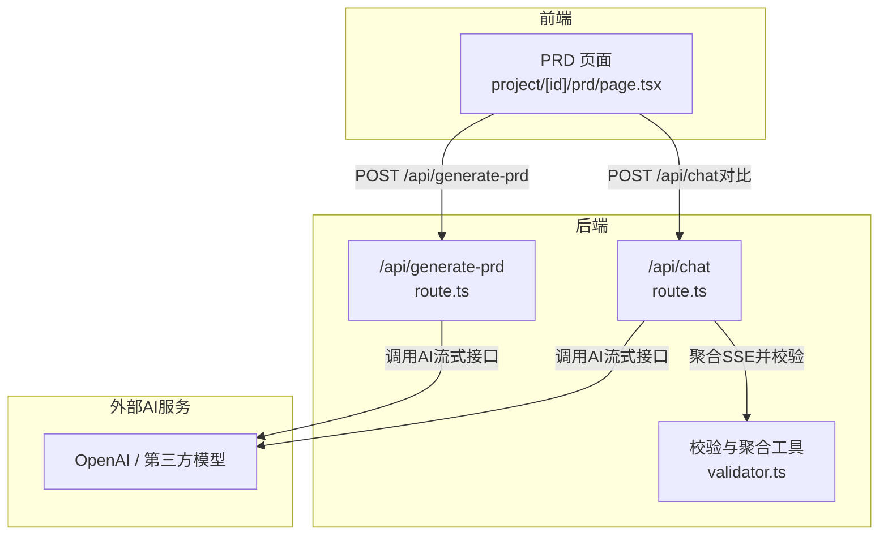
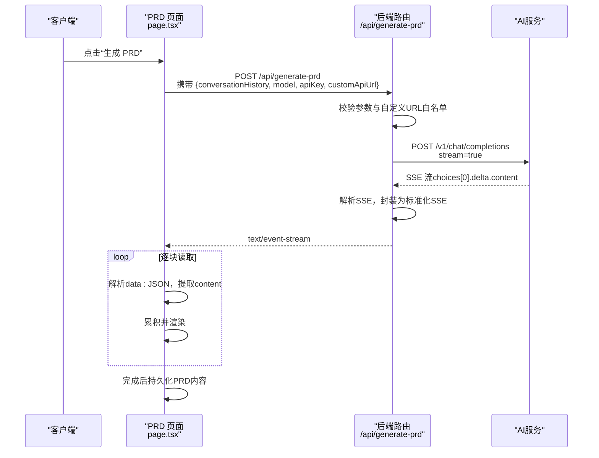

# PRD生成API (/api/generate-prd)

<cite>
**本文引用的文件**
- [route.ts](file://prd-generator/src/app/api/generate-prd/route.ts)
- [route.ts](file://prd-generator/src/app/api/chat/route.ts)
- [page.tsx](file://prd-generator/src/app/project/[id]/prd/page.tsx)
- [validator.ts](file://prd-generator/src/lib/validator.ts)
- [types/index.ts](file://prd-generator/src/types/index.ts)
- [PRD.md](file://PRD.md)
</cite>

## 目录
1. [简介](#简介)
2. [项目结构](#项目结构)
3. [核心组件](#核心组件)
4. [架构总览](#架构总览)
5. [详细组件分析](#详细组件分析)
6. [依赖分析](#依赖分析)
7. [性能考虑](#性能考虑)
8. [故障排查指南](#故障排查指南)
9. [结论](#结论)
10. [附录](#附录)

## 简介
本文件为 PRD 生成 API（/api/generate-prd）的详细技术文档，聚焦于：
- 如何接收完整的对话历史（conversationHistory），并触发 PRD 文档的流式生成；
- POST 请求参数说明：conversationHistory、model、apiKey、customApiUrl；
- 服务端如何使用专用的 PRD_SYSTEM_PROMPT 指导 AI 生成符合 8 大模块（产品概述、功能需求、技术架构等）的 Markdown 格式文档；
- 流式响应机制：通过 fetch 调用 AI 服务的流式接口，实时解析 SSE 数据块，提取 choices[0].delta.content 并重新封装为标准化的 SSE 流返回给前端；
- 错误处理策略：对话历史缺失、API 调用失败、SSRF 白名单校验、流解析异常；
- 响应头配置：text/event-stream、Cache-Control、Connection；
- 前端接收流数据并动态渲染到页面的流程与关键实现路径；
- 与 /api/chat 的差异：本端点不进行响应校验，直接透传 AI 输出，以保证生成内容的完整性。

## 项目结构
- 后端路由位于 prd-generator/src/app/api/generate-prd/route.ts，负责接收请求、校验参数、调用第三方 AI 服务并返回 SSE 流；
- 前端页面位于 prd-generator/src/app/project/[id]/prd/page.tsx，负责触发 /api/generate-prd、接收并解析 SSE、累积内容、持久化 PRD；
- 通用校验与聚合逻辑位于 prd-generator/src/lib/validator.ts，供 /api/chat 使用；
- 类型定义位于 prd-generator/src/types/index.ts，包括 ConversationMessage、Settings、PRDGenerationTask 等；
- PRD 文档模板与提示词设计位于 PRD.md。



图表来源
- [route.ts](file://prd-generator/src/app/api/generate-prd/route.ts#L1-L254)
- [route.ts](file://prd-generator/src/app/api/chat/route.ts#L1-L426)
- [validator.ts](file://prd-generator/src/lib/validator.ts#L213-L273)
- [page.tsx](file://prd-generator/src/app/project/[id]/prd/page.tsx#L200-L399)

章节来源
- [route.ts](file://prd-generator/src/app/api/generate-prd/route.ts#L1-L254)
- [page.tsx](file://prd-generator/src/app/project/[id]/prd/page.tsx#L200-L399)

## 核心组件
- 后端路由（/api/generate-prd）
  - 参数校验：apiKey、conversationHistory、model、customApiUrl；
  - 安全校验：validateCustomApiUrl（HTTPS、白名单、内网限制）；
  - 构造消息：system + user（整合后的对话历史）；
  - 调用第三方 AI 服务（流式）；
  - 透传 AI 输出为 SSE：choices[0].delta.content -> data: { content }；
  - 响应头：Content-Type: text/event-stream；Cache-Control: no-cache；Connection: keep-alive。
- 前端页面（/project/[id]/prd/page.tsx）
  - 触发 /api/generate-prd，读取 response.body.getReader()；
  - 解析 SSE：按行拆分，过滤 data: 前缀，解析 JSON，提取 content；
  - 累积内容并更新 PRD 内容，完成后持久化并标记状态。

章节来源
- [route.ts](file://prd-generator/src/app/api/generate-prd/route.ts#L110-L253)
- [page.tsx](file://prd-generator/src/app/project/[id]/prd/page.tsx#L200-L399)

## 架构总览
下面的序列图展示了从前端发起 PRD 生成请求，到后端转发 AI 流式响应并回传给前端的完整过程。



图表来源
- [route.ts](file://prd-generator/src/app/api/generate-prd/route.ts#L110-L253)
- [page.tsx](file://prd-generator/src/app/project/[id]/prd/page.tsx#L200-L399)

## 详细组件分析

### 后端路由：/api/generate-prd
- 请求参数
  - conversationHistory: string（整合后的对话文本）
  - model: string（deepseek/qwen/doubao/custom）
  - apiKey: string（必填）
  - customApiUrl: string（当 model=custom 时生效）
- 安全与校验
  - apiKey 缺失：返回 400；
  - conversationHistory 缺失：返回 400；
  - model=custom 时，validateCustomApiUrl 校验：
    - 必须为 HTTPS；
    - 不允许内网地址；
    - 必须在白名单域名集合中。
- 消息构造
  - system: PRD_SYSTEM_PROMPT（指导生成 8 大模块的 Markdown 文档）；
  - user: “以下是用户的对话历史：\n\n{conversationHistory}\n\n请根据以上信息生成完整的 PRD 文档。”
- AI 调用
  - stream: true；
  - temperature: 0.7；
  - max_tokens: 4000；
  - model: 若为自定义模型，使用 DEFAULT_MODELS[model] 或原值。
- 流式响应
  - 读取 AI 响应的 reader；
  - 按行解析 SSE，提取 choices[0].delta.content；
  - 将内容封装为 data: JSON（仅含 content 字段）并写入；
  - 以 text/event-stream 返回，设置 Cache-Control 与 Connection。
- 错误处理
  - AI 响应非 ok：返回对应状态码与错误信息；
  - 其他异常：捕获并返回 500。

章节来源
- [route.ts](file://prd-generator/src/app/api/generate-prd/route.ts#L1-L254)

### 前端页面：PRD 页面（/project/[id]/prd/page.tsx）
- 触发 PRD 生成
  - 从当前项目提取 conversationHistory（将角色与内容拼接为文本）；
  - 调用 /api/generate-prd，携带 model、apiKey、customApiUrl。
- 接收与解析 SSE
  - 读取 response.body.getReader()；
  - 使用 TextDecoder(stream=true) 解码，按行分割，保留最后一行；
  - 过滤以 data: 开头的行，解析 JSON，提取 content；
  - 累积 content 并通过 appendTaskContent 更新全局状态；
  - 完成后调用 updatePRDContent 持久化，setProjectStatus 标记为 generated。
- 错误处理
  - 非 ok 响应：抛错并提示；
  - AbortError：视为取消，清理任务；
  - 其他错误：记录并提示。

章节来源
- [page.tsx](file://prd-generator/src/app/project/[id]/prd/page.tsx#L200-L399)

### 与 /api/chat 的对比
- /api/chat
  - 使用 validateAIResponse 对 AI 输出进行结构化校验；
  - 若校验失败，自动重试并返回结构化数据或原始内容+错误；
  - 返回的 SSE 包含 validated、data、textContent 等字段。
- /api/generate-prd
  - 不进行响应校验，直接透传 AI 输出；
  - 返回的 SSE 仅包含 { content } 字段；
  - 保证生成内容的完整性与原始性。

章节来源
- [route.ts](file://prd-generator/src/app/api/chat/route.ts#L1-L426)
- [validator.ts](file://prd-generator/src/lib/validator.ts#L213-L273)
- [route.ts](file://prd-generator/src/app/api/generate-prd/route.ts#L110-L253)

### 流式解析算法（后端）
```mermaid
flowchart TD
Start(["进入流式处理"]) --> ReadChunk["读取AI响应块"]
ReadChunk --> Decode["TextDecoder(stream=true) 解码"]
Decode --> Buffer["追加到缓冲区"]
Buffer --> Split["按\\n分割，保留最后一行"]
Split --> Loop{"遍历每一行"}
Loop --> |不是"data: "*| Next["继续下一行"]
Loop --> |是"data: "*| Parse["解析JSON，提取choices[0].delta.content"]
Parse --> HasContent{"content存在？"}
HasContent --> |是| Enqueue["封装为data: {content}并写入"]
HasContent --> |否| Next
Enqueue --> Next
Next --> Done{"done？"}
Done --> |否| ReadChunk
Done --> |是| Close["关闭流"]
```

图表来源
- [route.ts](file://prd-generator/src/app/api/generate-prd/route.ts#L186-L236)

### 流式解析算法（前端）
```mermaid
flowchart TD
Start(["开始接收SSE"]) --> Read["读取响应块"]
Read --> Decode["TextDecoder(stream=true) 解码"]
Decode --> Buffer["追加到缓冲区"]
Buffer --> Split["按\\n分割，保留最后一行"]
Split --> Loop{"遍历每一行"}
Loop --> |不以"data: "*| Next["继续下一行"]
Loop --> |以"data: "*| Parse["解析JSON，提取content"]
Parse --> HasContent{"content存在？"}
HasContent --> |是| Append["累积content并渲染"]
HasContent --> |否| Next
Append --> Next
Next --> Done{"done？"}
Done --> |否| Read
Done --> |是| Persist["持久化PRD内容并标记完成"]
```

图表来源
- [page.tsx](file://prd-generator/src/app/project/[id]/prd/page.tsx#L200-L399)

## 依赖分析
- 外部依赖
  - OpenAI/DashScope/火山方舟等第三方 AI 服务；
  - 前端 React + Next.js + Zustand 状态管理；
  - IndexedDB（由 PRD.md 描述，用于本地持久化项目与 PRD 内容）。
- 内部依赖
  - /api/generate-prd 依赖：
    - PRD_SYSTEM_PROMPT（提示词）；
    - validateCustomApiUrl（SSRF 白名单校验）；
    - DEFAULT_MODELS（模型别名映射）。
  - /api/chat 依赖：
    - validateAIResponse（结构化校验）；
    - aggregateSSEStream（SSE 聚合）。

章节来源
- [route.ts](file://prd-generator/src/app/api/generate-prd/route.ts#L1-L254)
- [route.ts](file://prd-generator/src/app/api/chat/route.ts#L1-L426)
- [validator.ts](file://prd-generator/src/lib/validator.ts#L213-L273)
- [PRD.md](file://PRD.md#L436-L473)

## 性能考虑
- 流式传输
  - 后端与前端均采用流式读取与解码，避免一次性加载全部内容；
  - 前端使用 SSE 分片缓冲，按行处理，减少内存占用。
- 文本累积
  - 前端使用 appendTaskContent 累积增量内容，避免频繁字符串拼接；
  - 后端按 delta.content 写入，最小化中间对象创建。
- 超时与取消
  - 前端通过 AbortController 支持取消生成任务；
  - 后端未显式设置超时，建议在上游网关或代理层配置超时策略。

[本节为通用性能讨论，无需列出具体文件来源]

## 故障排查指南
- 常见错误与处理
  - 缺少 API Key：返回 400，提示“请先配置 API Key”；
  - 缺少对话历史：返回 400，提示“缺少对话历史数据”；
  - 自定义 URL 校验失败：返回 400，提示 URL 格式、协议或域名不在白名单；
  - AI 服务调用失败：返回对应状态码与错误信息；
  - 流解析异常：忽略解析错误，继续处理后续块。
- 前端常见问题
  - 无法读取响应：检查 response.body 是否存在；
  - SSE 解析失败：确认 data: 行格式与 JSON 结构；
  - 生成被取消：检查 AbortController 信号与错误类型。
- 建议
  - 在网关层设置合理的超时与重试策略；
  - 记录关键日志（请求体摘要、AI 响应状态、解析异常）；
  - 对外暴露健康检查端点，便于运维监控。

章节来源
- [route.ts](file://prd-generator/src/app/api/generate-prd/route.ts#L110-L253)
- [page.tsx](file://prd-generator/src/app/project/[id]/prd/page.tsx#L200-L399)

## 结论
/api/generate-prd 通过整合对话历史与专用 PRD_SYSTEM_PROMPT，直接透传 AI 流式输出，为前端提供完整的 PRD 文档生成体验。相较 /api/chat 的结构化校验与重试机制，本端点更注重生成内容的完整性与一致性，适合最终 PRD 的一次性生成场景。配合前端流式解析与本地持久化，整体链路具备良好的实时性与可靠性。

[本节为总结性内容，无需列出具体文件来源]

## 附录

### API 定义
- 端点：POST /api/generate-prd
- 请求头：Content-Type: application/json
- 请求体字段
  - conversationHistory: string（必填）
  - model: string（必填，支持 deepseek/qwen/doubao/custom）
  - apiKey: string（必填）
  - customApiUrl: string（当 model=custom 时必填）
- 成功响应
  - Content-Type: text/event-stream
  - Cache-Control: no-cache
  - Connection: keep-alive
  - 数据流：逐块 data: JSON（仅包含 content 字段），以 [DONE] 结束
- 错误响应
  - 400：缺少参数或自定义 URL 校验失败
  - 500：服务器内部错误
  - 其他：AI 服务返回的状态码

章节来源
- [route.ts](file://prd-generator/src/app/api/generate-prd/route.ts#L110-L253)

### 前端接收与渲染流程（关键实现路径）
- 触发生成与发送请求
  - [PRD 页面 generatePRD 函数](file://prd-generator/src/app/project/[id]/prd/page.tsx#L200-L311)
- 接收与解析 SSE
  - [SSE 读取与解析循环](file://prd-generator/src/app/project/[id]/prd/page.tsx#L239-L288)
- 累积内容与持久化
  - [appendTaskContent 与 updatePRDContent](file://prd-generator/src/app/project/[id]/prd/page.tsx#L260-L296)

### 关键类型定义（与 PRD 生成相关）
- ConversationMessage：对话消息结构
- Settings：包含 apiKeys、defaultModel、customApiUrl
- PRDGenerationTask：PRD 生成任务状态（内存版）

章节来源
- [types/index.ts](file://prd-generator/src/types/index.ts#L45-L73)
- [types/index.ts](file://prd-generator/src/types/index.ts#L85-L92)
- [types/index.ts](file://prd-generator/src/types/index.ts#L194-L223)

### PRD 提示词与结构要求
- PRD_SYSTEM_PROMPT 要求生成 8 大模块（产品概述、功能需求、UI/UX、技术架构建议、数据模型、技术实现要点、竞品分析、优化建议），并使用 Markdown 格式输出。

章节来源
- [route.ts](file://prd-generator/src/app/api/generate-prd/route.ts#L90-L108)
- [PRD.md](file://PRD.md#L632-L656)