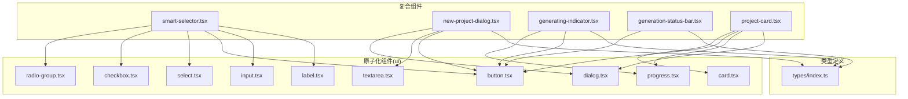
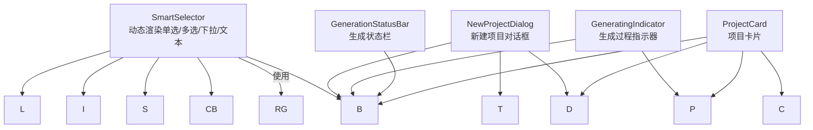
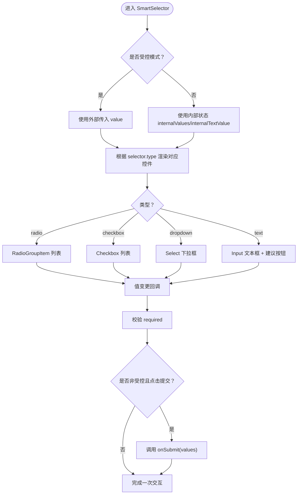
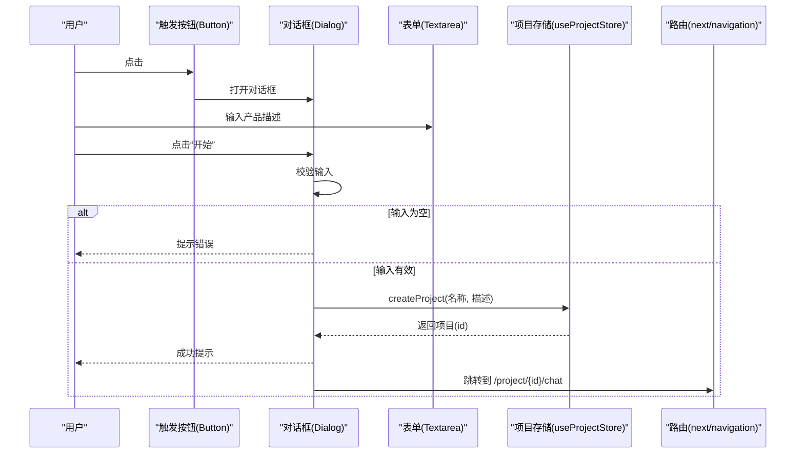
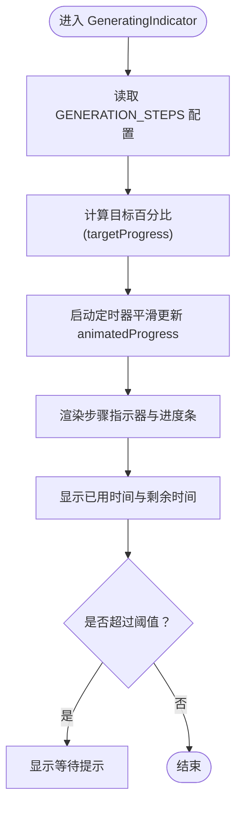
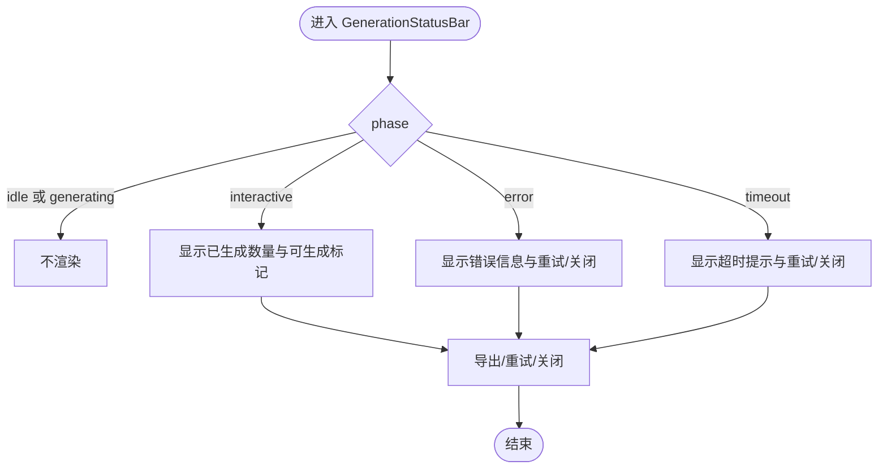
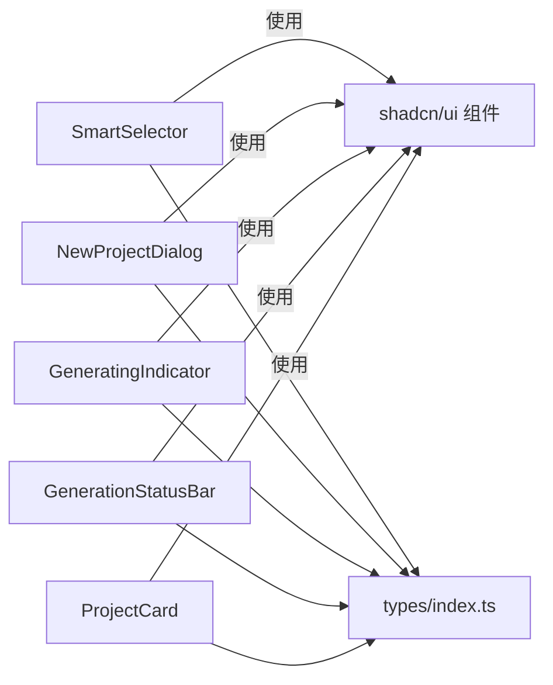

# UI组件库

<cite>
**本文引用的文件**
- [button.tsx](file://prd-generator/src/components/ui/button.tsx)
- [input.tsx](file://prd-generator/src/components/ui/input.tsx)
- [card.tsx](file://prd-generator/src/components/ui/card.tsx)
- [radio-group.tsx](file://prd-generator/src/components/ui/radio-group.tsx)
- [checkbox.tsx](file://prd-generator/src/components/ui/checkbox.tsx)
- [select.tsx](file://prd-generator/src/components/ui/select.tsx)
- [dialog.tsx](file://prd-generator/src/components/ui/dialog.tsx)
- [textarea.tsx](file://prd-generator/src/components/ui/textarea.tsx)
- [label.tsx](file://prd-generator/src/components/ui/label.tsx)
- [progress.tsx](file://prd-generator/src/components/ui/progress.tsx)
- [smart-selector.tsx](file://prd-generator/src/components/smart-selector.tsx)
- [new-project-dialog.tsx](file://prd-generator/src/components/new-project-dialog.tsx)
- [generating-indicator.tsx](file://prd-generator/src/components/generating-indicator.tsx)
- [generation-status-bar.tsx](file://prd-generator/src/components/generation-status-bar.tsx)
- [project-card.tsx](file://prd-generator/src/components/project-card.tsx)
- [index.ts](file://prd-generator/src/types/index.ts)
</cite>

## 目录
1. [简介](#简介)
2. [项目结构](#项目结构)
3. [核心组件](#核心组件)
4. [架构总览](#架构总览)
5. [详细组件分析](#详细组件分析)
6. [依赖关系分析](#依赖关系分析)
7. [性能考量](#性能考量)
8. [故障排查指南](#故障排查指南)
9. [结论](#结论)
10. [附录](#附录)

## 简介
本文件系统性梳理 PRDbot 项目中的 UI 组件体系，分为两部分：
- 基于 shadcn/ui 的原子化组件库（如 button、input、card 等），作为通用基础构建块，提供一致的样式与交互语义。
- 自定义复合组件（如 SmartSelector、NewProjectDialog、GeneratingIndicator、GenerationStatusBar），用于支撑“AI 问答驱动的 PRD 生成流程”，提供动态表单渲染、生成过程可视化与状态反馈。

目标是帮助开发者快速理解各组件的职责、接口与使用场景，并为后续复用与扩展提供清晰指引。

## 项目结构
UI 组件主要位于以下路径：
- 原子化组件：prd-generator/src/components/ui/
- 复合组件：prd-generator/src/components/（含 SmartSelector、NewProjectDialog、GeneratingIndicator、GenerationStatusBar 等）
- 类型定义：prd-generator/src/types/index.ts

图表来源
- [button.tsx](file://prd-generator/src/components/ui/button.tsx#L1-L61)
- [input.tsx](file://prd-generator/src/components/ui/input.tsx#L1-L22)
- [card.tsx](file://prd-generator/src/components/ui/card.tsx#L1-L93)
- [radio-group.tsx](file://prd-generator/src/components/ui/radio-group.tsx#L1-L46)
- [checkbox.tsx](file://prd-generator/src/components/ui/checkbox.tsx#L1-L33)
- [select.tsx](file://prd-generator/src/components/ui/select.tsx#L1-L188)
- [dialog.tsx](file://prd-generator/src/components/ui/dialog.tsx#L1-L144)
- [textarea.tsx](file://prd-generator/src/components/ui/textarea.tsx#L1-L19)
- [label.tsx](file://prd-generator/src/components/ui/label.tsx#L1-L25)
- [progress.tsx](file://prd-generator/src/components/ui/progress.tsx#L1-L32)
- [smart-selector.tsx](file://prd-generator/src/components/smart-selector.tsx#L1-L255)
- [new-project-dialog.tsx](file://prd-generator/src/components/new-project-dialog.tsx#L1-L107)
- [generating-indicator.tsx](file://prd-generator/src/components/generating-indicator.tsx#L1-L130)
- [generation-status-bar.tsx](file://prd-generator/src/components/generation-status-bar.tsx#L1-L125)
- [project-card.tsx](file://prd-generator/src/components/project-card.tsx#L1-L128)
- [index.ts](file://prd-generator/src/types/index.ts#L1-L243)

章节来源
- [button.tsx](file://prd-generator/src/components/ui/button.tsx#L1-L61)
- [input.tsx](file://prd-generator/src/components/ui/input.tsx#L1-L22)
- [card.tsx](file://prd-generator/src/components/ui/card.tsx#L1-L93)
- [smart-selector.tsx](file://prd-generator/src/components/smart-selector.tsx#L1-L255)
- [new-project-dialog.tsx](file://prd-generator/src/components/new-project-dialog.tsx#L1-L107)
- [generating-indicator.tsx](file://prd-generator/src/components/generating-indicator.tsx#L1-L130)
- [generation-status-bar.tsx](file://prd-generator/src/components/generation-status-bar.tsx#L1-L125)
- [index.ts](file://prd-generator/src/types/index.ts#L1-L243)

## 核心组件
本节聚焦原子化组件，说明其作为基础构建块的作用与典型用法。

- Button：提供多种变体与尺寸，支持 asChild 插槽包装，适配图标按钮与链接按钮等场景。
- Input：提供基础输入框样式与焦点态高亮、无效态样式，适用于文本输入。
- Card：组合卡片容器与其子模块（头、标题、描述、内容、底部、操作），便于统一布局。
- RadioGroup/RadioGroupItem：单选组及其项，提供可访问性与视觉指示。
- Checkbox：复选框，支持选中态样式与指示器。
- Select/SelectTrigger/SelectContent/SelectItem：下拉选择器，支持滚动按钮与占位符。
- Dialog/DialogContent/DialogHeader/DialogTitle/DialogDescription/DialogFooter：模态对话框框架，支持触发器、遮罩、关闭按钮。
- Textarea：多行文本输入，支持最小高度与禁用态。
- Label：标签组件，配合表单控件使用。
- Progress：进度指示器，用于展示百分比进度。

章节来源
- [button.tsx](file://prd-generator/src/components/ui/button.tsx#L1-L61)
- [input.tsx](file://prd-generator/src/components/ui/input.tsx#L1-L22)
- [card.tsx](file://prd-generator/src/components/ui/card.tsx#L1-L93)
- [radio-group.tsx](file://prd-generator/src/components/ui/radio-group.tsx#L1-L46)
- [checkbox.tsx](file://prd-generator/src/components/ui/checkbox.tsx#L1-L33)
- [select.tsx](file://prd-generator/src/components/ui/select.tsx#L1-L188)
- [dialog.tsx](file://prd-generator/src/components/ui/dialog.tsx#L1-L144)
- [textarea.tsx](file://prd-generator/src/components/ui/textarea.tsx#L1-L19)
- [label.tsx](file://prd-generator/src/components/ui/label.tsx#L1-L25)
- [progress.tsx](file://prd-generator/src/components/ui/progress.tsx#L1-L32)

## 架构总览
复合组件围绕“AI 问答 + 表单构建 + 生成反馈”的主流程工作，原子化组件提供一致的视觉与交互基元。

图表来源
- [smart-selector.tsx](file://prd-generator/src/components/smart-selector.tsx#L1-L255)
- [radio-group.tsx](file://prd-generator/src/components/ui/radio-group.tsx#L1-L46)
- [checkbox.tsx](file://prd-generator/src/components/ui/checkbox.tsx#L1-L33)
- [select.tsx](file://prd-generator/src/components/ui/select.tsx#L1-L188)
- [button.tsx](file://prd-generator/src/components/ui/button.tsx#L1-L61)
- [input.tsx](file://prd-generator/src/components/ui/input.tsx#L1-L22)
- [label.tsx](file://prd-generator/src/components/ui/label.tsx#L1-L25)
- [new-project-dialog.tsx](file://prd-generator/src/components/new-project-dialog.tsx#L1-L107)
- [dialog.tsx](file://prd-generator/src/components/ui/dialog.tsx#L1-L144)
- [textarea.tsx](file://prd-generator/src/components/ui/textarea.tsx#L1-L19)
- [generating-indicator.tsx](file://prd-generator/src/components/generating-indicator.tsx#L1-L130)
- [generation-status-bar.tsx](file://prd-generator/src/components/generation-status-bar.tsx#L1-L125)
- [project-card.tsx](file://prd-generator/src/components/project-card.tsx#L1-L128)
- [progress.tsx](file://prd-generator/src/components/ui/progress.tsx#L1-L32)

## 详细组件分析

### SmartSelector：根据 AI 返回 JSON 动态渲染表单
- 作用：接收来自 AI 的选择器数据（问题、类型、选项、是否必填），在运行时动态渲染单选、多选、下拉框或文本输入，并支持受控与非受控两种模式。
- 关键能力
  - 受控模式：由父组件维护值与变更回调，适合统一提交场景。
  - 非受控模式：内部维护状态，支持独立提交按钮。
  - 校验：根据 required 字段对文本与多选进行简单校验。
  - 文本建议：当存在建议选项时，提供一键填充按钮。
  - 已选展示：提供 SelectedAnswer 组件以展示用户已选答案。
- Props 接口
  - 受控模式：selector、value(string[])、onChange((values: string[]) => void)、disabled、showSubmitButton=false
  - 非受控模式：selector、onSubmit((values: string[]) => void)、disabled、showSubmitButton=true、value/onChange 不可用
  - 通用：selector 必须满足 SelectorData 类型（见类型定义）
- 使用示例（路径）
  - 在聊天页面中，当收到 AI 的问题列表后，逐个渲染 SmartSelector 并收集用户选择。
  - 在统一提交页，使用受控模式将所有选择一次性提交。
- 典型场景
  - 需求探索阶段：按顺序渲染多个选择器，逐步完善 PRD 所需信息。
  - 交互式表单：允许用户随时修改已选答案，实时更新状态。
- 代码片段路径
  - 受控/非受控判断与值管理：[smart-selector.tsx](file://prd-generator/src/components/smart-selector.tsx#L41-L95)
  - 单选渲染与变更：[smart-selector.tsx](file://prd-generator/src/components/smart-selector.tsx#L100-L123)
  - 多选渲染与变更：[smart-selector.tsx](file://prd-generator/src/components/smart-selector.tsx#L125-L151)
  - 下拉渲染与变更：[smart-selector.tsx](file://prd-generator/src/components/smart-selector.tsx#L153-L169)
  - 文本输入与建议：[smart-selector.tsx](file://prd-generator/src/components/smart-selector.tsx#L172-L199)
  - 提交按钮与校验：[smart-selector.tsx](file://prd-generator/src/components/smart-selector.tsx#L77-L95)
  - 已选展示：[smart-selector.tsx](file://prd-generator/src/components/smart-selector.tsx#L227-L255)

图表来源
- [smart-selector.tsx](file://prd-generator/src/components/smart-selector.tsx#L41-L226)
- [radio-group.tsx](file://prd-generator/src/components/ui/radio-group.tsx#L1-L46)
- [checkbox.tsx](file://prd-generator/src/components/ui/checkbox.tsx#L1-L33)
- [select.tsx](file://prd-generator/src/components/ui/select.tsx#L1-L188)
- [input.tsx](file://prd-generator/src/components/ui/input.tsx#L1-L22)
- [label.tsx](file://prd-generator/src/components/ui/label.tsx#L1-L25)
- [button.tsx](file://prd-generator/src/components/ui/button.tsx#L1-L61)

章节来源
- [smart-selector.tsx](file://prd-generator/src/components/smart-selector.tsx#L1-L255)
- [index.ts](file://prd-generator/src/types/index.ts#L1-L80)

### NewProjectDialog：新建项目对话框的表单逻辑
- 作用：弹出对话框，收集用户输入的产品描述，创建新项目并跳转到聊天页。
- 关键逻辑
  - 输入校验：禁止空输入。
  - 名称提取：从输入中提取项目名（首句或前20字符）。
  - 创建流程：调用 store 中的 createProject，成功后提示并关闭对话框，随后路由跳转。
  - 加载状态：创建过程中禁用按钮并显示加载文案。
- Props 接口：无（无外部属性）
- 使用示例（路径）
  - 在首页或项目列表页顶部放置触发按钮，点击打开对话框。
  - 在对话框内输入产品描述后点击“开始”。
- 典型场景
  - 首次使用或新增项目时的入口。
- 代码片段路径
  - 触发器与对话框结构：[new-project-dialog.tsx](file://prd-generator/src/components/new-project-dialog.tsx#L53-L104)
  - 提交处理与路由跳转：[new-project-dialog.tsx](file://prd-generator/src/components/new-project-dialog.tsx#L29-L51)
  - 输入校验与错误提示：[new-project-dialog.tsx](file://prd-generator/src/components/new-project-dialog.tsx#L30-L33)

图表来源
- [new-project-dialog.tsx](file://prd-generator/src/components/new-project-dialog.tsx#L22-L104)
- [dialog.tsx](file://prd-generator/src/components/ui/dialog.tsx#L1-L144)
- [textarea.tsx](file://prd-generator/src/components/ui/textarea.tsx#L1-L19)
- [button.tsx](file://prd-generator/src/components/ui/button.tsx#L1-L61)

章节来源
- [new-project-dialog.tsx](file://prd-generator/src/components/new-project-dialog.tsx#L1-L107)
- [index.ts](file://prd-generator/src/types/index.ts#L63-L92)

### GeneratingIndicator：生成过程中的视觉反馈
- 作用：在 PRD 生成过程中提供步骤指示、进度动画、耗时统计与可选取消按钮。
- 关键特性
  - 步骤指示：按 GENERATION_STEPS 显示步骤序号与状态。
  - 进度动画：使用定时器平滑过渡到目标百分比。
  - 时间估算：基于预设总时长与已用时间计算剩余时间。
  - 可取消：可配置是否显示取消按钮及回调。
- Props 接口
  - currentStep：当前步骤（GenerationStep）
  - stepIndex：当前步骤索引
  - elapsedTime：已用时间（秒）
  - onCancel：取消回调
  - canCancel：是否允许取消（默认 true）
- 使用示例（路径）
  - 在聊天页或生成页，当进入“生成中”阶段时显示该组件。
  - 结合 store 中的生成状态与计时器更新 props。
- 典型场景
  - 需要向用户直观展示生成进度与阶段。
- 代码片段路径
  - 步骤配置与动画进度：[generating-indicator.tsx](file://prd-generator/src/components/generating-indicator.tsx#L27-L46)
  - 步骤指示与进度条：[generating-indicator.tsx](file://prd-generator/src/components/generating-indicator.tsx#L73-L102)
  - 底部信息与剩余时间：[generating-indicator.tsx](file://prd-generator/src/components/generating-indicator.tsx#L105-L118)
  - 超时提示：[generating-indicator.tsx](file://prd-generator/src/components/generating-indicator.tsx#L121-L126)

图表来源
- [generating-indicator.tsx](file://prd-generator/src/components/generating-indicator.tsx#L27-L126)
- [progress.tsx](file://prd-generator/src/components/ui/progress.tsx#L1-L32)
- [index.ts](file://prd-generator/src/types/index.ts#L126-L171)

章节来源
- [generating-indicator.tsx](file://prd-generator/src/components/generating-indicator.tsx#L1-L130)
- [index.ts](file://prd-generator/src/types/index.ts#L126-L171)

### GenerationStatusBar：生成状态栏
- 作用：在生成完成后或异常时，提供状态提示、可选导出、重试与关闭操作。
- 状态分支
  - interactive：当有已生成的问题数时，显示“可生成 PRD”标记与导出/重试/关闭按钮。
  - error：显示错误信息与重试/关闭按钮。
  - timeout：显示超时提示与重试/关闭按钮。
  - idle/generating：不渲染。
- Props 接口
  - phase：当前阶段（GenerationPhase）
  - selectorCount：已生成的选择器数量
  - error：错误信息
  - onRetry：重试回调
  - onDismiss：关闭回调
  - onExport：导出回调
  - canGeneratePRD：是否可生成 PRD（默认 false）
- 使用示例（路径）
  - 在聊天页或 PRD 预览页，根据生成状态切换显示。
- 典型场景
  - 生成完成后引导用户导出或重新生成。
- 代码片段路径
  - interactive 分支：[generation-status-bar.tsx](file://prd-generator/src/components/generation-status-bar.tsx#L31-L67)
  - error 分支：[generation-status-bar.tsx](file://prd-generator/src/components/generation-status-bar.tsx#L69-L94)
  - timeout 分支：[generation-status-bar.tsx](file://prd-generator/src/components/generation-status-bar.tsx#L97-L121)

图表来源
- [generation-status-bar.tsx](file://prd-generator/src/components/generation-status-bar.tsx#L17-L124)
- [button.tsx](file://prd-generator/src/components/ui/button.tsx#L1-L61)
- [index.ts](file://prd-generator/src/types/index.ts#L126-L141)

章节来源
- [generation-status-bar.tsx](file://prd-generator/src/components/generation-status-bar.tsx#L1-L125)
- [index.ts](file://prd-generator/src/types/index.ts#L126-L141)

### 项目卡片 ProjectCard（补充说明）
- 作用：展示项目列表项，包含名称、状态徽章、进度条、操作菜单与跳转行为。
- 关键点
  - 状态映射：exploring/generated/exported 三态不同徽章与操作。
  - 进度展示：当处于探索态时显示问题数量与进度条。
  - 操作菜单：更多操作包括继续编辑/查看PRD、导出、删除。
- 使用示例（路径）
  - 在项目列表页循环渲染多个 ProjectCard。
- 代码片段路径
  - 状态徽章与进度：[project-card.tsx](file://prd-generator/src/components/project-card.tsx#L26-L31)
  - 探索态进度条：[project-card.tsx](file://prd-generator/src/components/project-card.tsx#L104-L112)
  - 操作菜单与跳转：[project-card.tsx](file://prd-generator/src/components/project-card.tsx#L63-L94)

章节来源
- [project-card.tsx](file://prd-generator/src/components/project-card.tsx#L1-L128)

## 依赖关系分析
- 组件耦合
  - SmartSelector 依赖 shadcn/ui 的表单组件（RadioGroup、Checkbox、Select、Input、Label、Button）。
  - NewProjectDialog 依赖 Dialog、Textarea、Button、Label。
  - GeneratingIndicator 依赖 Progress、Button。
  - GenerationStatusBar 依赖 Button。
  - ProjectCard 依赖 Card、Button、Progress、DropdownMenu、Dialog。
- 类型依赖
  - 所有复合组件均依赖 types/index.ts 中的 SelectorData、GenerationPhase、GenerationStep、GENERATION_STEPS 等类型。
- 外部依赖
  - 使用 date-fns 进行日期格式化（ProjectCard）。
  - 使用 sonner 进行全局提示（NewProjectDialog）。
  - 使用 next/navigation 进行路由跳转（NewProjectDialog、ProjectCard）。

图表来源
- [smart-selector.tsx](file://prd-generator/src/components/smart-selector.tsx#L1-L255)
- [new-project-dialog.tsx](file://prd-generator/src/components/new-project-dialog.tsx#L1-L107)
- [generating-indicator.tsx](file://prd-generator/src/components/generating-indicator.tsx#L1-L130)
- [generation-status-bar.tsx](file://prd-generator/src/components/generation-status-bar.tsx#L1-L125)
- [project-card.tsx](file://prd-generator/src/components/project-card.tsx#L1-L128)
- [index.ts](file://prd-generator/src/types/index.ts#L1-L243)

章节来源
- [index.ts](file://prd-generator/src/types/index.ts#L1-L243)

## 性能考量
- 动画与重绘
  - GeneratingIndicator 的进度动画通过定时器平滑过渡，建议在组件卸载时清理定时器，避免内存泄漏。
- 渲染优化
  - SmartSelector 在受控模式下无需内部状态，减少不必要的重渲染。
  - ProjectCard 中的日期格式化仅在需要时执行，避免频繁计算。
- 交互反馈
  - NewProjectDialog 在创建过程中禁用按钮，防止重复提交。
  - GenerationStatusBar 在 idle/generating 阶段不渲染，减少 DOM 开销。

## 故障排查指南
- SmartSelector
  - 症状：非受控模式无法提交
    - 检查是否正确传入 onSubmit 且 showSubmitButton=true
    - 参考路径：[smart-selector.tsx](file://prd-generator/src/components/smart-selector.tsx#L77-L95)
  - 症状：受控模式显示“已选择”但值未同步
    - 检查父组件是否正确传递 value 与 onChange
    - 参考路径：[smart-selector.tsx](file://prd-generator/src/components/smart-selector.tsx#L41-L95)
- NewProjectDialog
  - 症状：输入为空仍可点击“开始”
    - 检查输入校验逻辑与按钮禁用条件
    - 参考路径：[new-project-dialog.tsx](file://prd-generator/src/components/new-project-dialog.tsx#L30-L33)
  - 症状：创建失败未提示
    - 检查错误捕获与 toast 提示
    - 参考路径：[new-project-dialog.tsx](file://prd-generator/src/components/new-project-dialog.tsx#L45-L48)
- GeneratingIndicator
  - 症状：进度条不更新
    - 检查 stepIndex 与 targetProgress 计算
    - 参考路径：[generating-indicator.tsx](file://prd-generator/src/components/generating-indicator.tsx#L27-L46)
- GenerationStatusBar
  - 症状：错误状态未显示
    - 检查 phase 与 error 参数
    - 参考路径：[generation-status-bar.tsx](file://prd-generator/src/components/generation-status-bar.tsx#L69-L94)

章节来源
- [smart-selector.tsx](file://prd-generator/src/components/smart-selector.tsx#L41-L226)
- [new-project-dialog.tsx](file://prd-generator/src/components/new-project-dialog.tsx#L29-L51)
- [generating-indicator.tsx](file://prd-generator/src/components/generating-indicator.tsx#L27-L46)
- [generation-status-bar.tsx](file://prd-generator/src/components/generation-status-bar.tsx#L69-L94)

## 结论
本 UI 组件库以 shadcn/ui 原子化组件为基础，结合 SmartSelector、NewProjectDialog、GeneratingIndicator、GenerationStatusBar 等复合组件，完整覆盖了“AI 驱动的 PRD 生成流程”的交互与反馈需求。通过清晰的 Props 接口与类型约束，开发者可以快速复用并扩展这些组件，同时保持一致的视觉与交互体验。

## 附录
- 类型参考
  - 选择器类型与数据结构：SelectorType、SelectorData、SelectorOption
  - 生成阶段与步骤：GenerationPhase、GenerationStep、GENERATION_STEPS
  - 项目与对话消息：Project、ConversationMessage、UserChoice
  - 代码片段路径：[index.ts](file://prd-generator/src/types/index.ts#L1-L243)