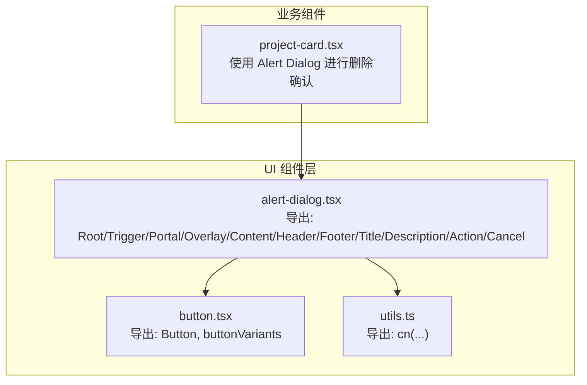
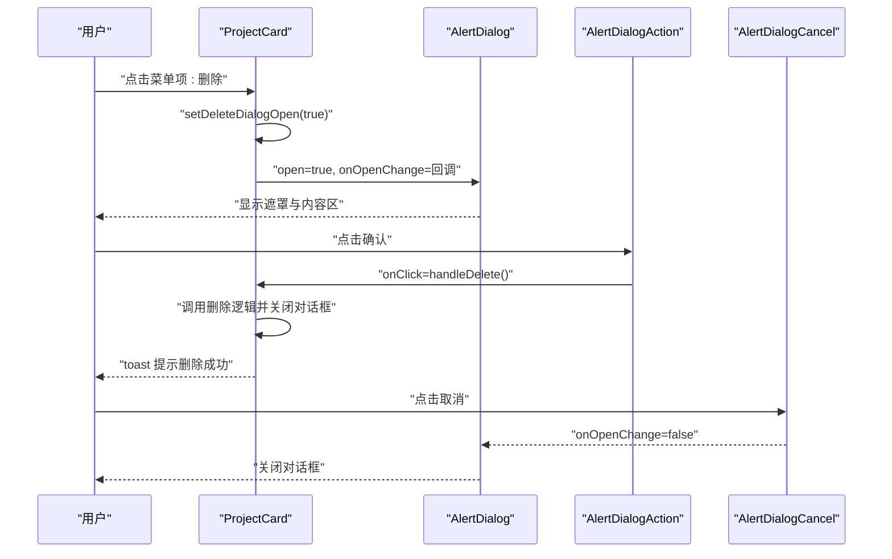
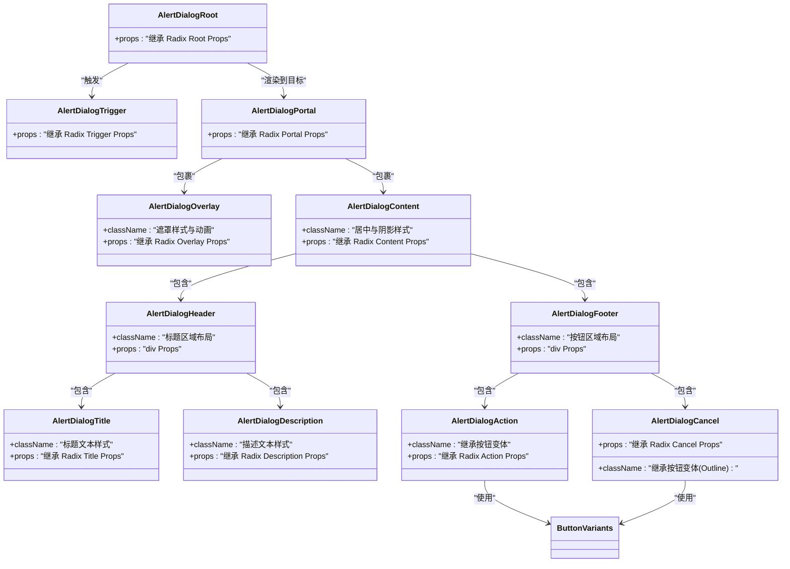
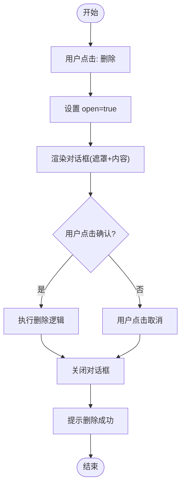
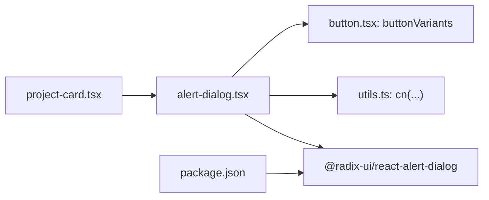

# Radix UI Alert Dialog组件

<cite>
**本文引用的文件**
- [alert-dialog.tsx](file://prd-generator/src/components/ui/alert-dialog.tsx)
- [button.tsx](file://prd-generator/src/components/ui/button.tsx)
- [utils.ts](file://prd-generator/src/lib/utils.ts)
- [project-card.tsx](file://prd-generator/src/components/project-card.tsx)
- [package.json](file://prd-generator/package.json)
</cite>

## 目录
1. [简介](#简介)
2. [项目结构](#项目结构)
3. [核心组件](#核心组件)
4. [架构总览](#架构总览)
5. [详细组件分析](#详细组件分析)
6. [依赖分析](#依赖分析)
7. [性能考虑](#性能考虑)
8. [故障排查指南](#故障排查指南)
9. [结论](#结论)
10. [附录](#附录)

## 简介
本文件系统性梳理并文档化项目中基于 Radix UI 的 Alert Dialog 组件实现与使用方式。该组件用于在用户执行高风险操作（如删除）前进行二次确认，提供一致、可访问且语义清晰的对话框体验。文档从架构、数据流、处理逻辑、集成点、错误处理与性能特性等维度展开，并通过可视化图示帮助读者快速理解组件关系与调用流程。

## 项目结构
- 组件位于 UI 基础库目录，采用按功能分层组织：基础 UI 组件集中于 src/components/ui。
- Alert Dialog 由一组语义化子组件构成，分别负责根容器、触发器、遮罩、内容区、标题、描述、操作按钮与取消按钮。
- 样式与变体通过工具函数与按钮变体组合，确保一致的视觉与交互风格。
- 在业务组件中（例如项目卡片），Alert Dialog 被用于“删除”场景的二次确认。

图表来源
- [alert-dialog.tsx](file://prd-generator/src/components/ui/alert-dialog.tsx#L1-L158)
- [button.tsx](file://prd-generator/src/components/ui/button.tsx#L1-L61)
- [utils.ts](file://prd-generator/src/lib/utils.ts#L1-L7)
- [project-card.tsx](file://prd-generator/src/components/project-card.tsx#L1-L183)

章节来源
- [alert-dialog.tsx](file://prd-generator/src/components/ui/alert-dialog.tsx#L1-L158)
- [button.tsx](file://prd-generator/src/components/ui/button.tsx#L1-L61)
- [utils.ts](file://prd-generator/src/lib/utils.ts#L1-L7)
- [project-card.tsx](file://prd-generator/src/components/project-card.tsx#L1-L183)

## 核心组件
- 根容器与触发器：提供可访问的根节点与触发入口，便于键盘导航与屏幕阅读器识别。
- 遮罩与内容区：遮罩负责背景覆盖与动画过渡；内容区居中展示标题、描述与操作区。
- 头部与底部：头部承载标题与描述；底部承载操作按钮与取消按钮，支持响应式布局。
- 按钮：操作按钮继承按钮变体，强调危险操作；取消按钮使用描边变体，突出可逆性。
- 数据槽属性：为测试与调试提供稳定的查询选择器（data-slot）。

章节来源
- [alert-dialog.tsx](file://prd-generator/src/components/ui/alert-dialog.tsx#L1-L158)
- [button.tsx](file://prd-generator/src/components/ui/button.tsx#L1-L61)

## 架构总览
下图展示了 Alert Dialog 在业务组件中的典型调用链路：用户点击菜单项触发打开，业务逻辑决定是否执行删除，最终关闭对话框并提示结果。

图表来源
- [project-card.tsx](file://prd-generator/src/components/project-card.tsx#L120-L179)
- [alert-dialog.tsx](file://prd-generator/src/components/ui/alert-dialog.tsx#L1-L158)

## 详细组件分析

### 组件关系与职责
- Root/Trigger/Portal/Overlay/Content/Header/Footer/Title/Description/Action/Cancel：每个子组件仅承担单一职责，便于组合与复用。
- 动画与定位：内容区固定居中并带缩放与淡入淡出动画；遮罩提供背景覆盖与过渡效果。
- 样式合并：通过工具函数合并类名，确保默认样式与自定义样式的正确叠加。

图表来源
- [alert-dialog.tsx](file://prd-generator/src/components/ui/alert-dialog.tsx#L1-L158)
- [button.tsx](file://prd-generator/src/components/ui/button.tsx#L1-L61)

章节来源
- [alert-dialog.tsx](file://prd-generator/src/components/ui/alert-dialog.tsx#L1-L158)
- [button.tsx](file://prd-generator/src/components/ui/button.tsx#L1-L61)

### 使用流程与状态管理
- 打开与关闭：业务组件通过受控属性控制 open 与 onOpenChange，实现对话框的显隐与状态同步。
- 危险操作：Action 按钮用于执行高风险操作；Cancel 按钮用于安全退出。
- 用户反馈：删除完成后通过通知组件提示结果，提升可用性。

图表来源
- [project-card.tsx](file://prd-generator/src/components/project-card.tsx#L120-L179)

章节来源
- [project-card.tsx](file://prd-generator/src/components/project-card.tsx#L1-L183)

## 依赖分析
- 外部依赖：组件基于 Radix UI 的 Alert Dialog 原生实现，保证可访问性与跨浏览器一致性。
- 内部依赖：
  - 样式工具：cn(...) 用于类名合并与冲突修复。
  - 按钮变体：Action 与 Cancel 共用按钮变体，Action 默认危险色，Cancel 使用描边变体。
- 包管理：项目在依赖中声明了 Radix UI 的 Alert Dialog 版本，确保版本兼容性。

图表来源
- [alert-dialog.tsx](file://prd-generator/src/components/ui/alert-dialog.tsx#L1-L158)
- [utils.ts](file://prd-generator/src/lib/utils.ts#L1-L7)
- [button.tsx](file://prd-generator/src/components/ui/button.tsx#L1-L61)
- [project-card.tsx](file://prd-generator/src/components/project-card.tsx#L1-L183)
- [package.json](file://prd-generator/package.json#L1-L81)

章节来源
- [package.json](file://prd-generator/package.json#L1-L81)
- [alert-dialog.tsx](file://prd-generator/src/components/ui/alert-dialog.tsx#L1-L158)
- [utils.ts](file://prd-generator/src/lib/utils.ts#L1-L7)
- [button.tsx](file://prd-generator/src/components/ui/button.tsx#L1-L61)
- [project-card.tsx](file://prd-generator/src/components/project-card.tsx#L1-L183)

## 性能考虑
- 渲染策略：内容区通过 Portal 渲染至目标挂载点，避免层级嵌套导致的重排与重绘。
- 动画与过渡：使用轻量级 CSS 动画实现淡入淡出与缩放，建议保持默认时长以兼顾流畅与性能。
- 事件冒泡：在内容区与按钮上阻止事件冒泡，减少不必要的父级处理开销。
- 受控模式：通过 open 与 onOpenChange 控制显隐，避免不必要的状态更新。

## 故障排查指南
- 对话框不显示或无法关闭
  - 检查业务组件是否正确传递 open 与 onOpenChange。
  - 确认未在内容区或按钮上意外阻止了 onOpenChange 的触发。
- 样式异常
  - 检查 cn(...) 是否正确合并类名，避免被后续样式覆盖。
  - 确认按钮变体参数与预期一致（Action 默认危险色，Cancel 描边）。
- 可访问性问题
  - 确保标题与描述存在且语义清晰，便于屏幕阅读器读取。
  - 按钮顺序与焦点管理应符合键盘导航习惯。

章节来源
- [alert-dialog.tsx](file://prd-generator/src/components/ui/alert-dialog.tsx#L1-L158)
- [project-card.tsx](file://prd-generator/src/components/project-card.tsx#L1-L183)

## 结论
本项目对 Radix UI Alert Dialog 的封装遵循单一职责与可组合原则，结合内部样式工具与按钮变体，形成一致、可访问且易于扩展的确认对话框组件。在业务组件中，通过受控模式与明确的状态流转，实现了“删除”等高风险操作的安全确认流程。建议在新增类似场景时复用该组件，统一用户体验与交互规范。

## 附录
- 组件导出清单
  - Root、Trigger、Portal、Overlay、Content、Header、Footer、Title、Description、Action、Cancel
- 使用建议
  - 明确区分 Action 与 Cancel 的语义与视觉差异。
  - 在内容区避免复杂的交互，聚焦确认信息与操作按钮。
  - 为关键操作提供明确的文案与上下文说明。