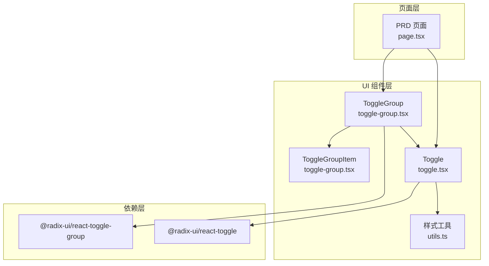
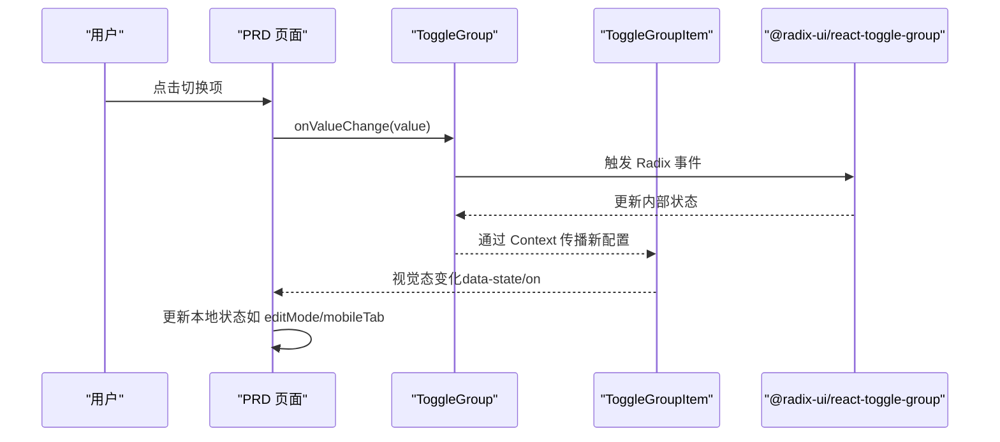
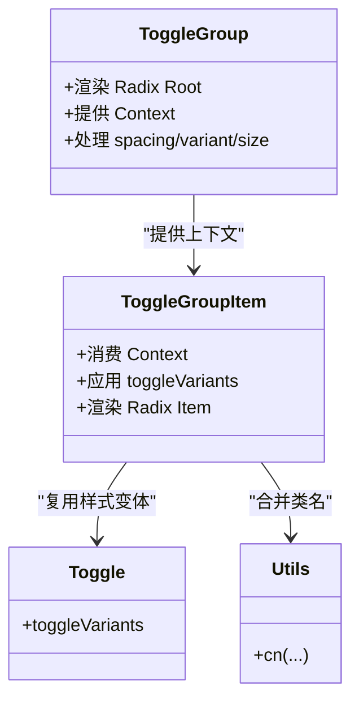
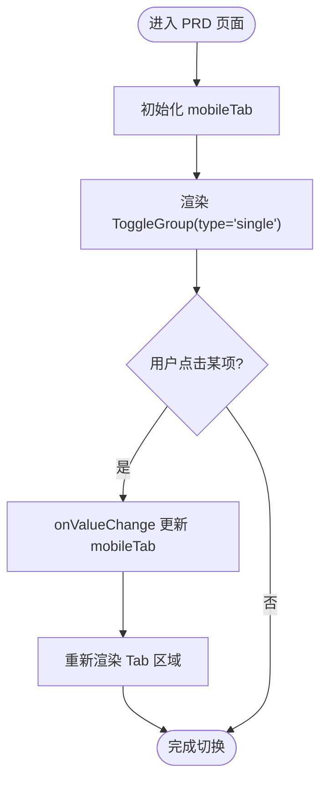
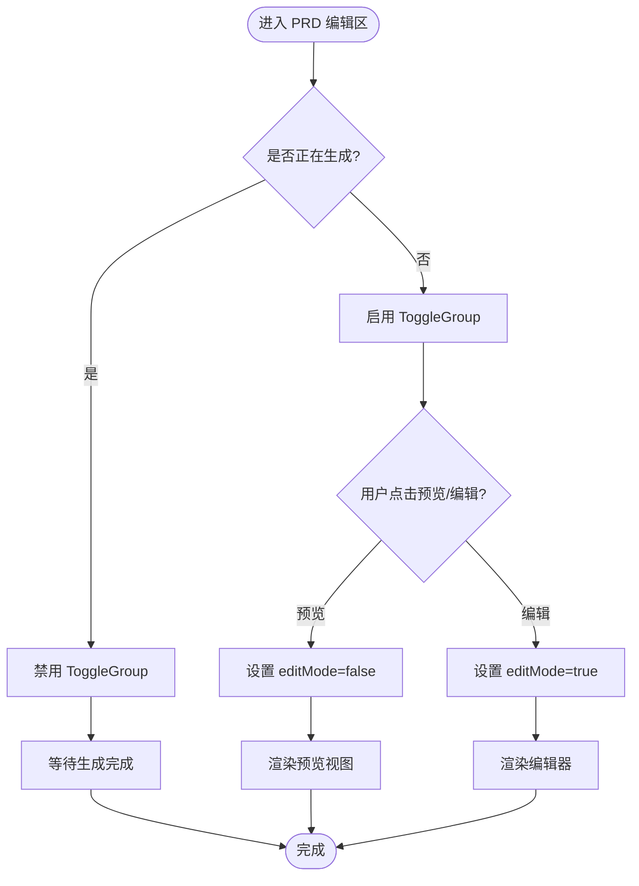
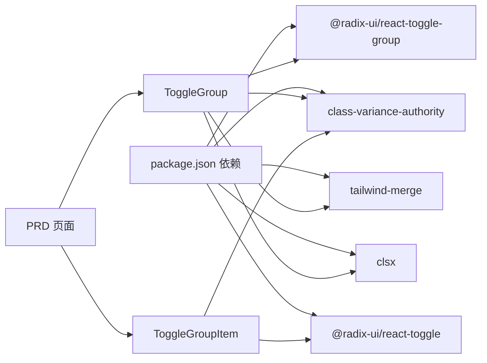

# Radix UI Toggle Group组件

<cite>
**本文引用的文件**
- [toggle-group.tsx](file://prd-generator/src/components/ui/toggle-group.tsx)
- [toggle.tsx](file://prd-generator/src/components/ui/toggle.tsx)
- [page.tsx（PRD 页面）](file://prd-generator/src/app/project/[id]/prd/page.tsx)
- [package.json](file://prd-generator/package.json)
- [utils.ts](file://prd-generator/src/lib/utils.ts)
</cite>

## 目录
1. [简介](#简介)
2. [项目结构](#项目结构)
3. [核心组件](#核心组件)
4. [架构总览](#架构总览)
5. [详细组件分析](#详细组件分析)
6. [依赖关系分析](#依赖关系分析)
7. [性能考量](#性能考量)
8. [故障排查指南](#故障排查指南)
9. [结论](#结论)
10. [附录](#附录)

## 简介
本文件系统性梳理了项目中基于 Radix UI 的 Toggle Group 组件实现与使用方式，重点覆盖以下方面：
- 组件封装与样式变体继承
- 在移动端与桌面端的典型交互场景
- 数据流与状态管理在页面中的体现
- 可扩展性与最佳实践建议

该组件用于在一组互斥或非互斥的开关项之间进行选择，支持尺寸、外观与间距等风格化配置，并通过上下文在子项中自动继承父级配置。

## 项目结构
Toggle Group 相关代码位于 UI 组件层，配合页面逻辑完成实际业务功能：
- 组件层：toggle-group.tsx 定义 ToggleGroup 与 ToggleGroupItem，并复用 toggle.tsx 的样式变体
- 页面层：PRD 页面在移动端与编辑/预览模式中分别使用 ToggleGroup 实现 Tab 切换与视图切换
- 依赖层：package.json 中声明 @radix-ui/react-toggle-group 与 @radix-ui/react-toggle

图表来源
- [toggle-group.tsx](file://prd-generator/src/components/ui/toggle-group.tsx#L1-L83)
- [toggle.tsx](file://prd-generator/src/components/ui/toggle.tsx#L1-L48)
- [page.tsx（PRD 页面）](file://prd-generator/src/app/project/[id]/prd/page.tsx#L580-L779)
- [package.json](file://prd-generator/package.json#L15-L54)

章节来源
- [toggle-group.tsx](file://prd-generator/src/components/ui/toggle-group.tsx#L1-L83)
- [toggle.tsx](file://prd-generator/src/components/ui/toggle.tsx#L1-L48)
- [page.tsx（PRD 页面）](file://prd-generator/src/app/project/[id]/prd/page.tsx#L580-L779)
- [package.json](file://prd-generator/package.json#L15-L54)

## 核心组件
- ToggleGroup
  - 功能：作为容器提供上下文，传递 variant、size、spacing 等配置给子项；渲染 Radix UI 的 ToggleGroup Root
  - 关键点：
    - 通过 React Context 将父级配置注入子项
    - 支持 data-* 属性透传与 CSS 变量控制间距
    - 使用 cn 合并类名，结合 Tailwind 与 Radix 的数据属性实现视觉态
- ToggleGroupItem
  - 功能：作为可选的子项，继承父级样式变体并渲染 Radix UI 的 Item
  - 关键点：
    - 读取上下文中的 variant/size/spacing，若子项未显式传入则回退到父级
    - 基于 toggleVariants 提供统一的尺寸与外观
    - 通过 data-spacing 控制边框圆角与边框合并效果

章节来源
- [toggle-group.tsx](file://prd-generator/src/components/ui/toggle-group.tsx#L1-L83)
- [toggle.tsx](file://prd-generator/src/components/ui/toggle.tsx#L1-L48)
- [utils.ts](file://prd-generator/src/lib/utils.ts#L1-L7)

## 架构总览
Toggle Group 的运行时交互流程如下：

图表来源
- [toggle-group.tsx](file://prd-generator/src/components/ui/toggle-group.tsx#L1-L83)
- [page.tsx（PRD 页面）](file://prd-generator/src/app/project/[id]/prd/page.tsx#L580-L779)

## 详细组件分析

### 组件关系与职责
- ToggleGroup
  - 负责：提供上下文、透传属性、计算间距样式
  - 外观：基于父级 variant/size/spacing 与 Tailwind 类名组合
- ToggleGroupItem
  - 负责：消费上下文、应用样式变体、渲染子元素
  - 外观：继承父级样式，支持 data-spacing 的边框与圆角微调
- Toggle（辅助）
  - 负责：定义 toggleVariants，被 ToggleGroupItem 复用
- utils.cn
  - 负责：合并类名，避免冲突

图表来源
- [toggle-group.tsx](file://prd-generator/src/components/ui/toggle-group.tsx#L1-L83)
- [toggle.tsx](file://prd-generator/src/components/ui/toggle.tsx#L1-L48)
- [utils.ts](file://prd-generator/src/lib/utils.ts#L1-L7)

章节来源
- [toggle-group.tsx](file://prd-generator/src/components/ui/toggle-group.tsx#L1-L83)
- [toggle.tsx](file://prd-generator/src/components/ui/toggle.tsx#L1-L48)
- [utils.ts](file://prd-generator/src/lib/utils.ts#L1-L7)

### 使用场景与数据流

#### 场景一：移动端 Tab 切换
- 位置：PRD 页面顶部的移动端 Tab
- 行为：
  - type="single" 保证互斥选择
  - value 与 onValueChange 双向绑定 mobileTab
  - 子项通过 data-state-on 应用激活态样式
- 价值：在小屏设备上提供清晰的视图切换入口

图表来源
- [page.tsx（PRD 页面）](file://prd-generator/src/app/project/[id]/prd/page.tsx#L580-L601)

章节来源
- [page.tsx（PRD 页面）](file://prd-generator/src/app/project/[id]/prd/page.tsx#L580-L601)

#### 场景二：编辑/预览视图切换
- 位置：PRD 页面右侧面板顶部
- 行为：
  - type="single" 互斥切换 editMode
  - disabled={isGenerating} 在生成期间禁用切换
  - 子项包含图标与文本，便于识别
- 价值：在编辑与预览之间快速切换，提升操作效率

图表来源
- [page.tsx（PRD 页面）](file://prd-generator/src/app/project/[id]/prd/page.tsx#L718-L741)

章节来源
- [page.tsx（PRD 页面）](file://prd-generator/src/app/project/[id]/prd/page.tsx#L718-L741)

### 样式与间距策略
- spacing 参数
  - 父级通过 spacing 控制子项之间的间隙
  - 通过 CSS 变量与 data-spacing 属性实现细粒度控制
  - spacing=0 时移除圆角与阴影，实现紧凑拼接效果
- variant/size
  - 通过 toggleVariants 提供 default/outline 与 default/sm/lg 尺寸
  - 子项可覆盖父级传入的 variant/size，否则回退到父级
- 类名合并
  - 使用 cn 合并 Tailwind 与 Radix 的数据属性类名，避免冲突

章节来源
- [toggle-group.tsx](file://prd-generator/src/components/ui/toggle-group.tsx#L1-L83)
- [toggle.tsx](file://prd-generator/src/components/ui/toggle.tsx#L1-L48)
- [utils.ts](file://prd-generator/src/lib/utils.ts#L1-L7)

## 依赖关系分析
- 组件依赖
  - @radix-ui/react-toggle-group：提供 ToggleGroup 的原生能力
  - @radix-ui/react-toggle：提供 Toggle 的原生能力（样式复用）
  - class-variance-authority：定义与复用样式变体
  - tailwind-merge/clsx：合并类名，避免冲突
- 页面集成
  - PRD 页面在两个关键位置使用 ToggleGroup：
    - 移动端 Tab：切换对话区与 PRD 文档
    - 编辑/预览：切换 PRD 内容视图

图表来源
- [package.json](file://prd-generator/package.json#L15-L54)
- [toggle-group.tsx](file://prd-generator/src/components/ui/toggle-group.tsx#L1-L83)
- [toggle.tsx](file://prd-generator/src/components/ui/toggle.tsx#L1-L48)
- [page.tsx（PRD 页面）](file://prd-generator/src/app/project/[id]/prd/page.tsx#L580-L779)

章节来源
- [package.json](file://prd-generator/package.json#L15-L54)
- [toggle-group.tsx](file://prd-generator/src/components/ui/toggle-group.tsx#L1-L83)
- [toggle.tsx](file://prd-generator/src/components/ui/toggle.tsx#L1-L48)
- [page.tsx（PRD 页面）](file://prd-generator/src/app/project/[id]/prd/page.tsx#L580-L779)

## 性能考量
- 渲染开销
  - ToggleGroup 与 ToggleGroupItem 为轻量包装，主要开销来自 Radix 原生组件与样式计算
  - 建议在频繁切换的场景下避免过度嵌套与重复渲染
- 样式合并
  - 使用 cn 合并类名，减少无效样式叠加
- 事件处理
  - onValueChange 应尽量避免在短时间内触发大量状态更新
- 移动端体验
  - 移动端 Tab 切换频繁，建议保持子项数量适中，避免过长列表导致卡顿

## 故障排查指南
- 问题：子项未继承父级样式
  - 排查：确认 ToggleGroupItem 是否在 ToggleGroup 内部；检查 variant/size 是否被显式覆盖
  - 参考路径：[toggle-group.tsx](file://prd-generator/src/components/ui/toggle-group.tsx#L51-L81)
- 问题：间距不生效或样式错乱
  - 排查：确认 spacing 传值与 data-spacing 是否一致；检查 CSS 变量与 Tailwind 类名合并
  - 参考路径：[toggle-group.tsx](file://prd-generator/src/components/ui/toggle-group.tsx#L20-L48)
- 问题：移动端 Tab 不切换
  - 排查：确认 type="single"、value 与 onValueChange 是否正确绑定；检查 mobileTab 状态更新
  - 参考路径：[page.tsx（PRD 页面）](file://prd-generator/src/app/project/[id]/prd/page.tsx#L580-L601)
- 问题：编辑/预览切换不可用
  - 排查：确认 isGenerating 状态是否为 true 导致 disabled；检查 editMode 状态
  - 参考路径：[page.tsx（PRD 页面）](file://prd-generator/src/app/project/[id]/prd/page.tsx#L718-L741)
- 问题：样式冲突或闪烁
  - 排查：使用 cn 合并类名；避免重复覆盖同一类名；检查 Tailwind 配置
  - 参考路径：[utils.ts](file://prd-generator/src/lib/utils.ts#L1-L7)

章节来源
- [toggle-group.tsx](file://prd-generator/src/components/ui/toggle-group.tsx#L20-L81)
- [page.tsx（PRD 页面）](file://prd-generator/src/app/project/[id]/prd/page.tsx#L580-L741)
- [utils.ts](file://prd-generator/src/lib/utils.ts#L1-L7)

## 结论
- Toggle Group 组件通过上下文与样式变体复用，实现了统一且灵活的开关组样式体系
- 在 PRD 页面中，Toggle Group 分别承担移动端 Tab 切换与编辑/预览视图切换两大核心交互
- 通过合理的参数传递与状态管理，可在不同场景下获得一致的用户体验
- 建议在复杂页面中保持 Toggle Group 的简洁使用，避免过度嵌套与频繁重渲染

## 附录
- 相关实现参考路径
  - ToggleGroup 容器与上下文：[toggle-group.tsx](file://prd-generator/src/components/ui/toggle-group.tsx#L1-L48)
  - ToggleGroupItem 子项与样式继承：[toggle-group.tsx](file://prd-generator/src/components/ui/toggle-group.tsx#L51-L81)
  - 样式变体定义与复用：[toggle.tsx](file://prd-generator/src/components/ui/toggle.tsx#L1-L48)
  - 移动端 Tab 切换示例：[page.tsx（PRD 页面）](file://prd-generator/src/app/project/[id]/prd/page.tsx#L580-L601)
  - 编辑/预览切换示例：[page.tsx（PRD 页面）](file://prd-generator/src/app/project/[id]/prd/page.tsx#L718-L741)
  - 依赖声明：[package.json](file://prd-generator/package.json#L15-L54)
  - 类名合并工具：[utils.ts](file://prd-generator/src/lib/utils.ts#L1-L7)