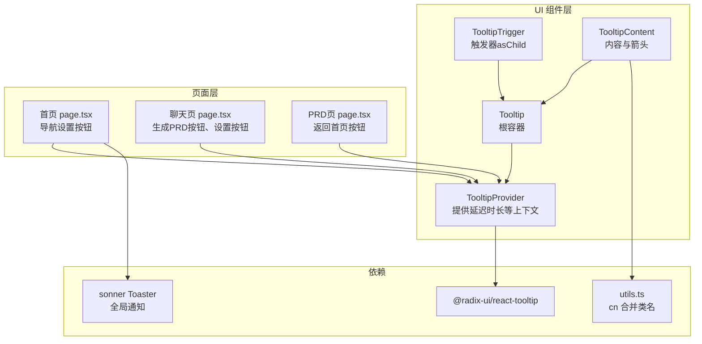
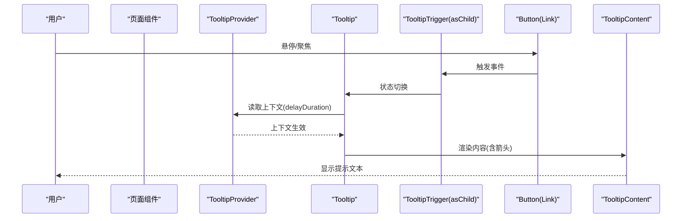
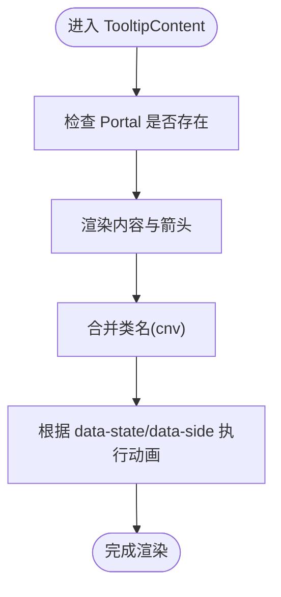
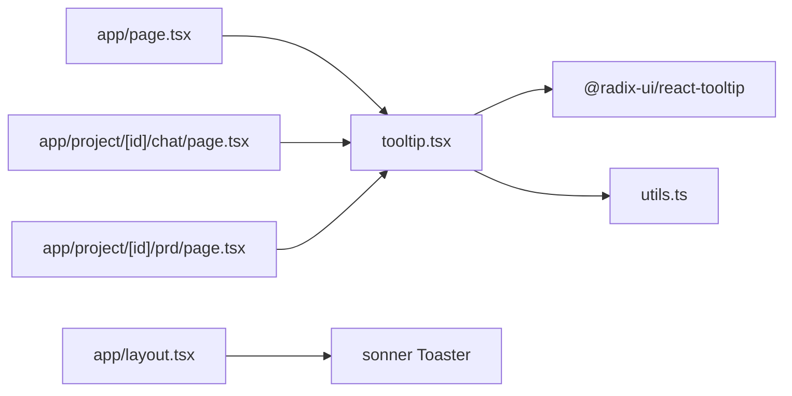

# Radix UI Tooltip组件

<cite>
**本文引用的文件**
- [tooltip.tsx](file://prd-generator/src/components/ui/tooltip.tsx)
- [page.tsx](file://prd-generator/src/app/page.tsx)
- [page.tsx](file://prd-generator/src/app/project/[id]/chat/page.tsx)
- [page.tsx](file://prd-generator/src/app/project/[id]/prd/page.tsx)
- [package.json](file://prd-generator/package.json)
- [utils.ts](file://prd-generator/src/lib/utils.ts)
- [layout.tsx](file://prd-generator/src/app/layout.tsx)
</cite>

## 目录
1. [简介](#简介)
2. [项目结构](#项目结构)
3. [核心组件](#核心组件)
4. [架构总览](#架构总览)
5. [详细组件分析](#详细组件分析)
6. [依赖关系分析](#依赖关系分析)
7. [性能考量](#性能考量)
8. [故障排查指南](#故障排查指南)
9. [结论](#结论)

## 简介
本文件系统性梳理了项目中对 Radix UI Tooltip 组件的封装与使用，包括：
- TooltipProvider、Tooltip、TooltipTrigger、TooltipContent 四个核心子组件的职责与实现要点
- 在不同页面中的典型用法与交互模式
- 样式与动画集成方式
- 与其他 UI 组件的组合实践
- 性能与可访问性建议

该文档既面向开发者，也适合非技术读者快速理解 Tooltip 的设计与使用。

## 项目结构
- 组件封装位于 src/components/ui/tooltip.tsx，提供对 @radix-ui/react-tooltip 的轻量封装与样式集成。
- 页面层在多个路由中使用 Tooltip，如首页、聊天页、PRD 页等，用于为图标按钮、链接等元素提供简短说明。
- 全局布局中包含 Toaster（来自 sonner），用于全局通知，与 Tooltip 形成互补的用户反馈体系。

图表来源
- [tooltip.tsx](file://prd-generator/src/components/ui/tooltip.tsx#L1-L62)
- [page.tsx](file://prd-generator/src/app/page.tsx#L34-L56)
- [page.tsx](file://prd-generator/src/app/project/[id]/chat/page.tsx#L598-L622)
- [page.tsx](file://prd-generator/src/app/project/[id]/prd/page.tsx#L519-L544)
- [utils.ts](file://prd-generator/src/lib/utils.ts#L1-L7)
- [layout.tsx](file://prd-generator/src/app/layout.tsx#L21-L33)

章节来源
- [tooltip.tsx](file://prd-generator/src/components/ui/tooltip.tsx#L1-L62)
- [page.tsx](file://prd-generator/src/app/page.tsx#L34-L56)
- [page.tsx](file://prd-generator/src/app/project/[id]/chat/page.tsx#L598-L622)
- [page.tsx](file://prd-generator/src/app/project/[id]/prd/page.tsx#L519-L544)
- [utils.ts](file://prd-generator/src/lib/utils.ts#L1-L7)
- [layout.tsx](file://prd-generator/src/app/layout.tsx#L21-L33)

## 核心组件
- TooltipProvider：为整个 Tooltip 生态提供上下文，支持 delayDuration 等参数，默认延迟时长为 0，以提升交互即时性。
- Tooltip：根容器，内部自动包裹 TooltipProvider，简化调用方写法。
- TooltipTrigger：触发器，通常配合 asChild 使用，将 Button、Link 等元素作为触发源。
- TooltipContent：内容容器，内置 Portal，确保内容渲染到 DOM 根节点附近；支持 sideOffset 控制偏移；内置箭头元素；使用 cn 合并 Tailwind 类名，实现主题色与动画效果。

章节来源
- [tooltip.tsx](file://prd-generator/src/components/ui/tooltip.tsx#L8-L61)

## 架构总览
Tooltip 在项目中的使用遵循“Provider + Trigger + Content”的标准模式，并在页面级通过 TooltipProvider 包裹，保证全局一致的行为与样式。

图表来源
- [tooltip.tsx](file://prd-generator/src/components/ui/tooltip.tsx#L8-L61)
- [page.tsx](file://prd-generator/src/app/page.tsx#L34-L56)

## 详细组件分析

### TooltipProvider 分析
- 职责：提供 Tooltip 的全局上下文，支持 delayDuration 等配置。
- 设计要点：通过 data-slot 属性标记，便于调试与样式覆盖；默认 delayDuration=0，减少感知延迟。
- 使用位置：页面级包裹，确保整页内 Tooltip 行为一致。

章节来源
- [tooltip.tsx](file://prd-generator/src/components/ui/tooltip.tsx#L8-L19)

### Tooltip 分析
- 职责：作为根容器，内部自动注入 TooltipProvider，简化调用方写法。
- 设计要点：保持与 Radix Root 的属性透传，保留扩展性。

章节来源
- [tooltip.tsx](file://prd-generator/src/components/ui/tooltip.tsx#L21-L29)

### TooltipTrigger 分析
- 职责：触发 Tooltip 的显示/隐藏。
- 设计要点：推荐使用 asChild 将 Button、Link 等元素作为触发源，避免额外包装标签带来的语义与无障碍问题。

章节来源
- [tooltip.tsx](file://prd-generator/src/components/ui/tooltip.tsx#L31-L35)

### TooltipContent 分析
- 职责：承载提示文本与箭头，控制定位与动画。
- 设计要点：
  - 使用 Portal 将内容挂载至 DOM 根节点附近，避免被父级 overflow 等样式裁剪。
  - 支持 sideOffset 控制距离。
  - 使用 cn 合并 Tailwind 类名，统一前景/背景色、圆角、内边距、动画等。
  - 内置箭头元素，使用旋转与填充实现三角形指示。
- 动画与过渡：通过 data-state 与 data-side 属性驱动进入/退出动画与滑入方向。

图表来源
- [tooltip.tsx](file://prd-generator/src/components/ui/tooltip.tsx#L37-L61)
- [utils.ts](file://prd-generator/src/lib/utils.ts#L1-L7)

章节来源
- [tooltip.tsx](file://prd-generator/src/components/ui/tooltip.tsx#L37-L61)
- [utils.ts](file://prd-generator/src/lib/utils.ts#L1-L7)

### 在页面中的典型用法

#### 首页导航设置按钮
- 位置：首页页面的导航栏中，设置按钮使用 Tooltip 提供“设置”说明。
- 关键点：Tooltip 包裹 TooltipTrigger 与 Button，Trigger 使用 asChild；TooltipContent 中放置提示文本。

章节来源
- [page.tsx](file://prd-generator/src/app/page.tsx#L34-L56)

#### 聊天页生成 PRD 与设置按钮
- 位置：聊天页头部工具区，包含“生成 PRD”按钮与“设置”按钮，均配有 Tooltip。
- 关键点：TooltipTrigger 使用 asChild 包裹 Button 或 Link；TooltipContent 提供简短说明。

章节来源
- [page.tsx](file://prd-generator/src/app/project/[id]/chat/page.tsx#L598-L622)

#### PRD 页返回首页按钮
- 位置：PRD 页头部左侧，返回首页按钮配有 Tooltip。
- 关键点：与首页类似，使用 TooltipProvider 包裹，Trigger 为 Button，Content 为提示文本。

章节来源
- [page.tsx](file://prd-generator/src/app/project/[id]/prd/page.tsx#L519-L544)

## 依赖关系分析
- 直接依赖：@radix-ui/react-tooltip（提供 Provider、Root、Trigger、Content、Portal、Arrow）
- 工具函数：utils.ts 中的 cn 用于类名合并，确保 Tailwind 与条件类名正确合并。
- 页面级依赖：各页面通过 TooltipProvider 统一启用 Tooltip 生态；全局布局包含 Toaster，形成“提示 + 通知”的双通道反馈。

图表来源
- [tooltip.tsx](file://prd-generator/src/components/ui/tooltip.tsx#L1-L62)
- [utils.ts](file://prd-generator/src/lib/utils.ts#L1-L7)
- [page.tsx](file://prd-generator/src/app/page.tsx#L34-L56)
- [page.tsx](file://prd-generator/src/app/project/[id]/chat/page.tsx#L598-L622)
- [page.tsx](file://prd-generator/src/app/project/[id]/prd/page.tsx#L519-L544)
- [layout.tsx](file://prd-generator/src/app/layout.tsx#L21-L33)

章节来源
- [package.json](file://prd-generator/package.json#L15-L54)
- [tooltip.tsx](file://prd-generator/src/components/ui/tooltip.tsx#L1-L62)
- [utils.ts](file://prd-generator/src/lib/utils.ts#L1-L7)
- [layout.tsx](file://prd-generator/src/app/layout.tsx#L21-L33)

## 性能考量
- 延迟时长：TooltipProvider 默认 delayDuration=0，减少感知延迟，适合图标按钮等高频触发场景。
- Portal 渲染：TooltipContent 使用 Portal，避免层级嵌套导致的重绘与溢出裁剪问题，同时减少不必要的 DOM 层级。
- 动画与过渡：通过 data-state 与 data-side 驱动的动画，仅在状态变化时执行，开销较低。
- 样式合并：使用 cn 合并类名，避免重复样式与冲突，提升渲染效率。

章节来源
- [tooltip.tsx](file://prd-generator/src/components/ui/tooltip.tsx#L8-L61)

## 故障排查指南
- Tooltip 不显示
  - 检查是否在页面级使用了 TooltipProvider 包裹；若仅局部使用，需确保其处于 Provider 上下文中。
  - 确认 TooltipTrigger 使用 asChild 包裹目标元素，避免事件未正确传递。
- 内容被遮挡或错位
  - 检查父级容器是否存在 overflow 或 transform 导致裁剪；TooltipContent 使用 Portal 可缓解此问题。
  - 调整 sideOffset 以避免与目标元素或视口边缘碰撞。
- 动画不生效
  - 确认 Tailwind 动画类未被覆盖；检查 data-state 与 data-side 属性是否按预期更新。
- 无障碍与键盘交互
  - 确保触发元素具备可访问的标签或 aria-label；Tooltip 本身不替代语义化标签，应与之配合使用。

章节来源
- [tooltip.tsx](file://prd-generator/src/components/ui/tooltip.tsx#L37-L61)
- [page.tsx](file://prd-generator/src/app/page.tsx#L34-L56)

## 结论
该项目对 Radix UI Tooltip 的封装简洁清晰，通过 Provider 统一上下文、Trigger 与 Content 分离职责、Portal 优化渲染，形成了稳定且易用的 Tooltip 生态。在多个页面中，Tooltip 与 Button、Link 等元素结合，提供了直观的辅助说明，提升了用户体验。建议在新增交互时遵循现有模式：页面级包裹 Provider、使用 asChild 的 Trigger、在 Content 中提供简洁明确的提示文本，并合理设置 sideOffset 与 delayDuration。