# UI布局优化

<cite>
**本文档引用的文件**   
- [layout.tsx](file://prd-generator/src/app/layout.tsx)
- [globals.css](file://prd-generator/src/app/globals.css)
- [page.tsx](file://prd-generator/src/app/page.tsx)
- [settings/page.tsx](file://prd-generator/src/app/settings/page.tsx)
- [components/ui/button.tsx](file://prd-generator/src/components/ui/button.tsx)
- [components/ui/card.tsx](file://prd-generator/src/components/ui/card.tsx)
- [components/ui/input.tsx](file://prd-generator/src/components/ui/input.tsx)
- [components/ui/dialog.tsx](file://prd-generator/src/components/ui/dialog.tsx)
- [components/ui/tabs.tsx](file://prd-generator/src/components/ui/tabs.tsx)
- [components/ui/sheet.tsx](file://prd-generator/src/components/ui/sheet.tsx)
- [components/project-card.tsx](file://prd-generator/src/components/project-card.tsx)
- [components/new-project-dialog.tsx](file://prd-generator/src/components/new-project-dialog.tsx)
- [lib/utils.ts](file://prd-generator/src/lib/utils.ts)
- [components.json](file://prd-generator/components.json)
</cite>

## 目录
1. [项目结构](#项目结构)
2. [全局布局与样式](#全局布局与样式)
3. [核心UI组件分析](#核心ui组件分析)
4. [页面布局实现](#页面布局实现)
5. [响应式设计策略](#响应式设计策略)
6. [交互体验优化](#交互体验优化)
7. [主题与配色系统](#主题与配色系统)
8. [结论](#结论)

## 项目结构

PRDbot项目采用Next.js App Router架构，具有清晰的组件分层结构。项目主要分为以下几个部分：

- `app/` 目录包含所有页面路由和布局组件
- `components/` 目录存放可复用的UI组件，包括基础UI组件和业务组件
- `lib/` 目录包含工具函数和辅助代码
- `store/` 目录管理应用状态
- `types/` 目录定义类型接口

项目使用了现代化的前端技术栈，包括Next.js 16、React 19、Tailwind CSS、Radix UI和ShadCN UI组件库，构建了一个高性能、可访问性强的Web应用。

**Section sources**
- [layout.tsx](file://prd-generator/src/app/layout.tsx#L1-L37)
- [components.json](file://prd-generator/components.json#L1-L23)

## 全局布局与样式

### 根布局配置

项目通过`layout.tsx`文件定义了全局根布局，采用了现代化的Web布局技术：

```mermaid
graph TD
A[RootLayout] --> B[html lang="zh-CN"]
B --> C[body]
C --> D[应用内容]
C --> E[Toaster通知组件]
F[Geist字体] --> C
G[全局CSS] --> C
```

**Diagram sources**
- [layout.tsx](file://prd-generator/src/app/layout.tsx#L1-L37)

### 全局样式系统

项目使用Tailwind CSS作为CSS框架，并通过`globals.css`实现了完整的样式系统：

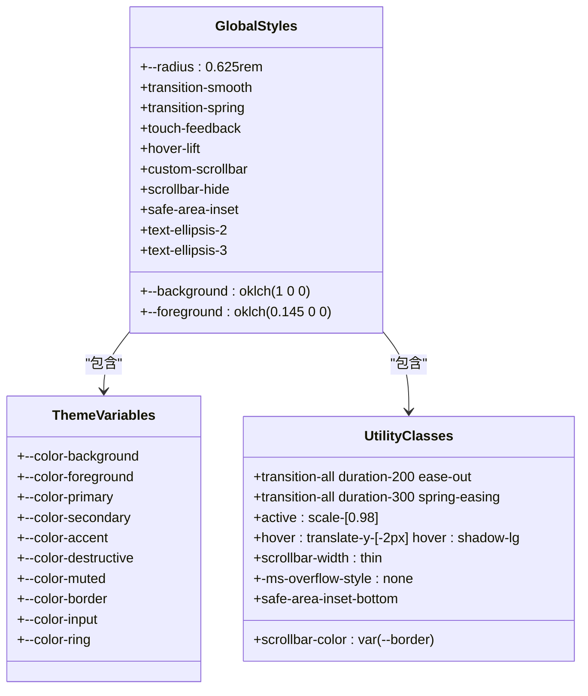

**Diagram sources**
- [globals.css](file://prd-generator/src/app/globals.css#L1-L216)

**Section sources**
- [globals.css](file://prd-generator/src/app/globals.css#L1-L216)
- [layout.tsx](file://prd-generator/src/app/layout.tsx#L1-L37)

## 核心UI组件分析

### 按钮组件

按钮组件`button.tsx`使用`class-variance-authority`实现了灵活的变体系统：

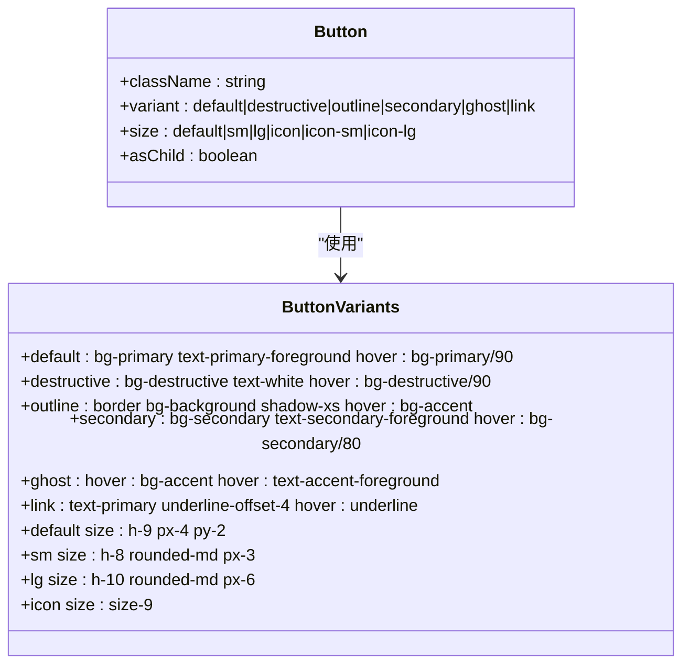

**Diagram sources**
- [components/ui/button.tsx](file://prd-generator/src/components/ui/button.tsx#L1-L61)

### 卡片组件

卡片组件`card.tsx`提供了完整的卡片布局系统：

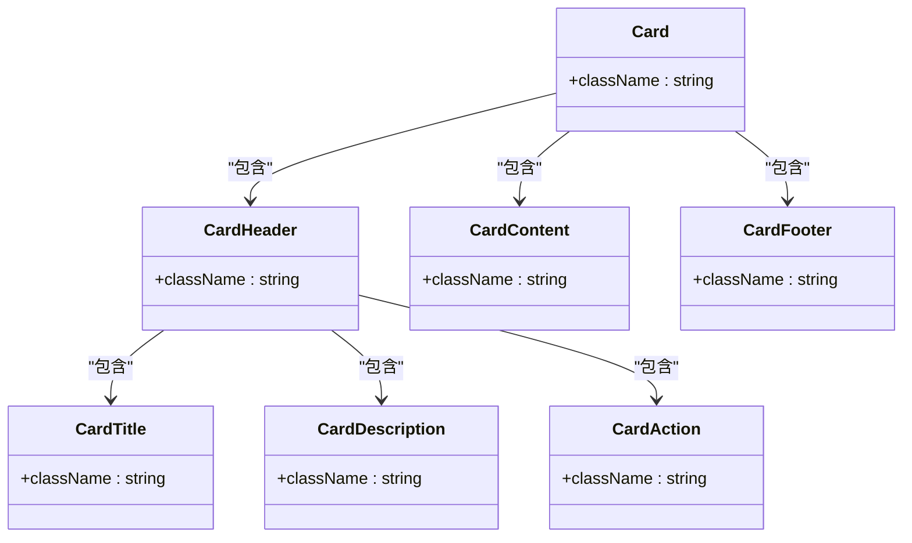

**Diagram sources**
- [components/ui/card.tsx](file://prd-generator/src/components/ui/card.tsx#L1-L93)

### 输入框组件

输入框组件`input.tsx`实现了现代化的表单输入体验：

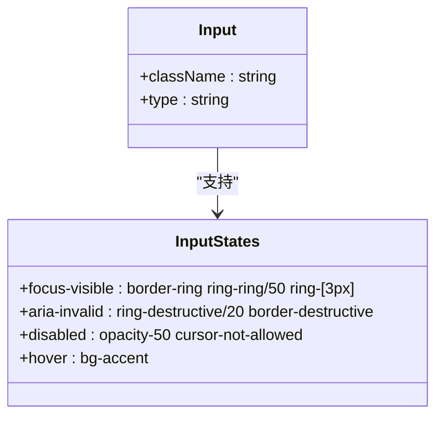

**Diagram sources**
- [components/ui/input.tsx](file://prd-generator/src/components/ui/input.tsx#L1-L22)

## 页面布局实现

### 首页布局

首页`page.tsx`采用了现代化的布局结构：

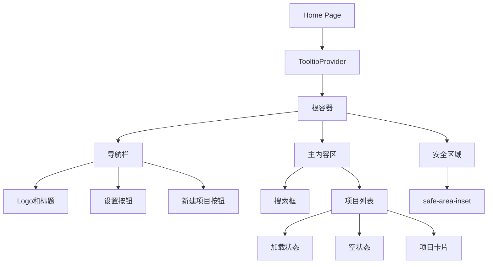

**Diagram sources**
- [page.tsx](file://prd-generator/src/app/page.tsx#L1-L118)

### 项目卡片组件

`project-card.tsx`组件实现了功能丰富的项目卡片：

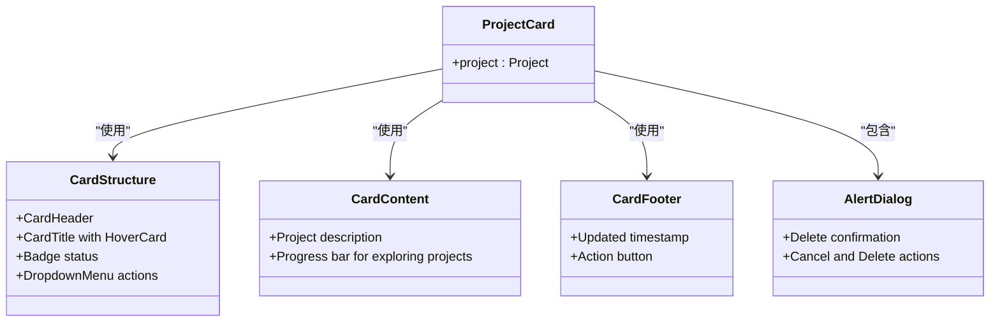

**Diagram sources**
- [components/project-card.tsx](file://prd-generator/src/components/project-card.tsx#L1-L183)

### 新建项目对话框

`new-project-dialog.tsx`组件提供了用户友好的项目创建体验：

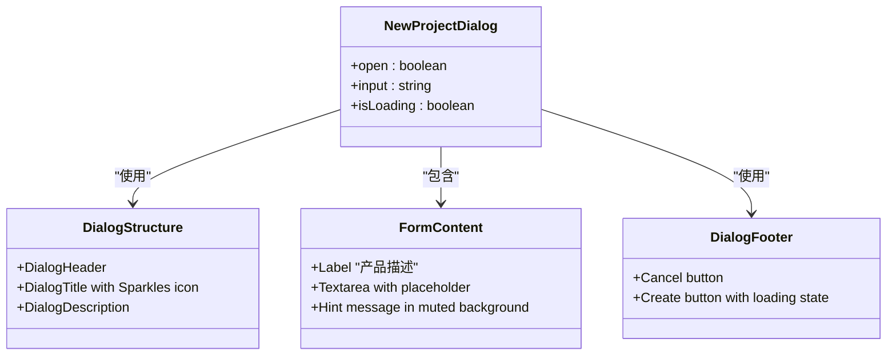

**Diagram sources**
- [components/new-project-dialog.tsx](file://prd-generator/src/components/new-project-dialog.tsx#L1-L107)

### 设置页面布局

`settings/page.tsx`实现了复杂的设置界面：

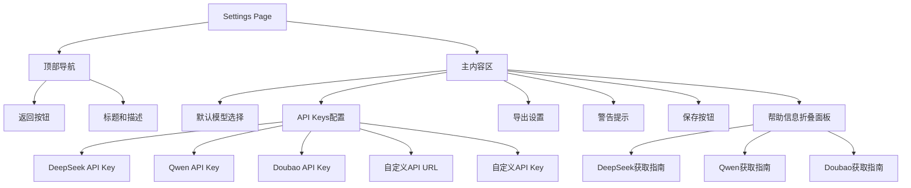

**Diagram sources**
- [settings/page.tsx](file://prd-generator/src/app/settings/page.tsx#L1-L319)

## 响应式设计策略

项目采用了全面的响应式设计策略，确保在不同设备上都有良好的用户体验：

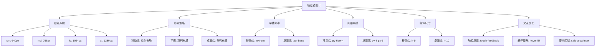

**Section sources**
- [page.tsx](file://prd-generator/src/app/page.tsx#L1-L118)
- [settings/page.tsx](file://prd-generator/src/app/settings/page.tsx#L1-L319)
- [globals.css](file://prd-generator/src/app/globals.css#L1-L216)

## 交互体验优化

### 触摸反馈

项目实现了全面的触摸反馈机制：

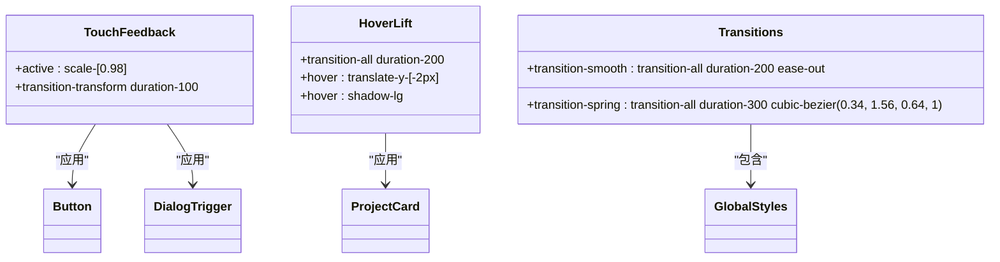

**Diagram sources**
- [globals.css](file://prd-generator/src/app/globals.css#L143-L160)

### 动画与过渡

项目使用了多种动画和过渡效果提升用户体验：

```mermaid
flowchart TD
A[动画系统] --> B[Dialog动画]
B --> B1[data-[state=open]:animate-in]
B --> B2[data-[state=closed]:animate-out]
B --> B3[data-[state=closed]:fade-out-0]
B --> B4[data-[state=open]:fade-in-0]
B --> B5[data-[state=closed]:zoom-out-95]
B --> B6[data-[state=open]:zoom-in-95]
A --> C[Sheet动画]
C --> C1[data-[state=closed]:slide-out-to-right]
C --> C2[data-[state=open]:slide-in-from-right]
C --> C3[data-[state=closed]:slide-out-to-left]
C --> C4[data-[state=open]:slide-in-from-left]
A --> D[滚动行为]
D --> D1[scroll-behavior: smooth]
A --> E[焦点样式]
E --> E1[focus-visible: outline-2 outline-offset-2 outline-ring]
```

**Section sources**
- [components/ui/dialog.tsx](file://prd-generator/src/components/ui/dialog.tsx#L1-L144)
- [components/ui/sheet.tsx](file://prd-generator/src/components/ui/sheet.tsx#L1-L140)
- [globals.css](file://prd-generator/src/app/globals.css#L124-L138)

## 主题与配色系统

### 色彩系统

项目使用了先进的OKLCH色彩模型，提供了高质量的明暗主题：

```mermaid
erDiagram
COLOR_THEME {
string background PK
string foreground
string card
string popover
string primary
string secondary
string muted
string accent
string destructive
string border
string input
string ring
string chart-1
string chart-2
string chart-3
string chart-4
string chart-5
}
LIGHT_THEME {
string background: oklch(1 0 0)
string foreground: oklch(0.145 0 0)
string primary: oklch(0.205 0 0)
string secondary: oklch(0.97 0 0)
string accent: oklch(0.97 0 0)
string destructive: oklch(0.577 0.245 27.325)
}
DARK_THEME {
string background: oklch(0.145 0 0)
string foreground: oklch(0.985 0 0)
string primary: oklch(0.922 0 0)
string secondary: oklch(0.269 0 0)
string accent: oklch(0.269 0 0)
string destructive: oklch(0.704 0.191 22.216)
}
COLOR_THEME ||--o{ LIGHT_THEME : "包含"
COLOR_THEME ||--o{ DARK_THEME : "包含"
```

**Diagram sources**
- [globals.css](file://prd-generator/src/app/globals.css#L46-L113)

### 字体系统

项目使用了Geist字体家族，提供了优秀的可读性：

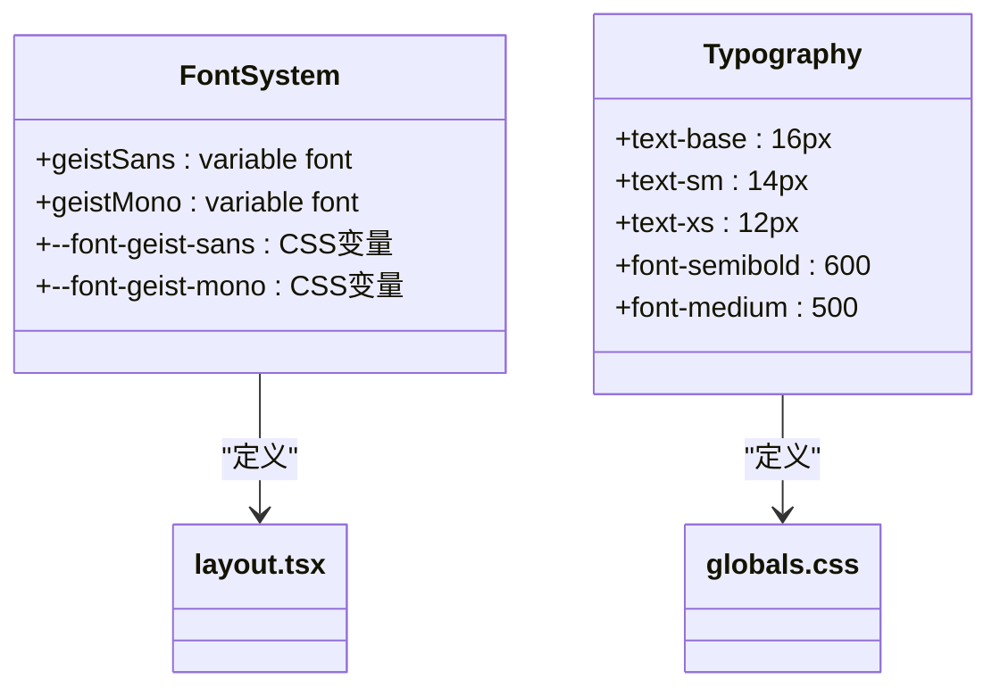

**Section sources**
- [layout.tsx](file://prd-generator/src/app/layout.tsx#L6-L14)
- [globals.css](file://prd-generator/src/app/globals.css#L9-L10)

## 结论

PRDbot项目的UI布局优化体现了现代化Web应用的最佳实践。通过采用Next.js App Router、Tailwind CSS和ShadCN UI组件库，项目实现了高性能、可访问性强且美观的用户界面。

关键优化点包括：
- 使用OKLCH色彩模型实现高质量的明暗主题
- 采用响应式设计确保跨设备兼容性
- 实现丰富的交互反馈提升用户体验
- 使用现代化的CSS变量和工具类系统
- 通过组件化架构提高代码复用性和可维护性

这些优化共同创造了一个直观、高效且愉悦的用户体验，使用户能够专注于PRD文档的创建和管理。