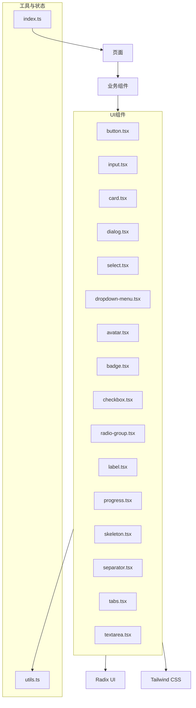
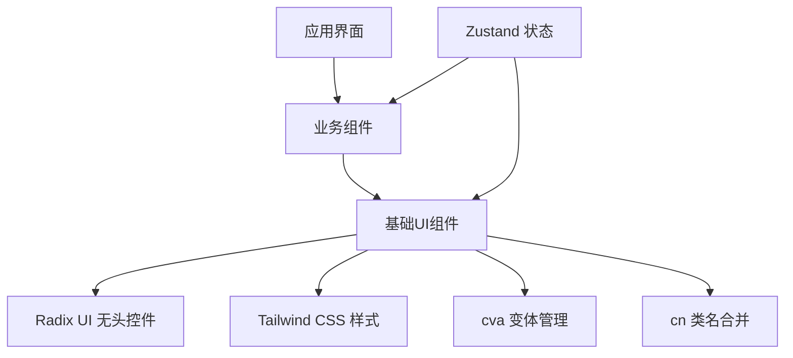
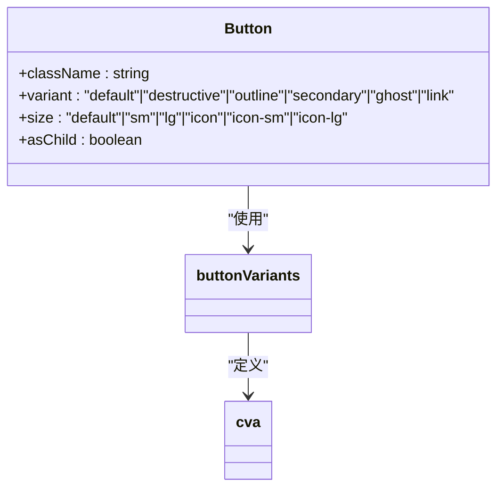
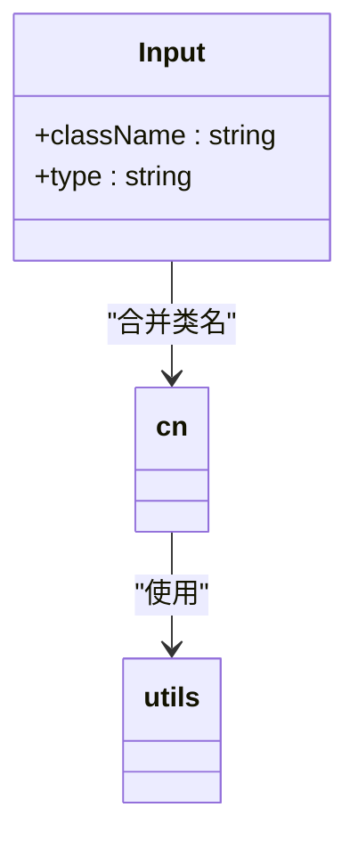
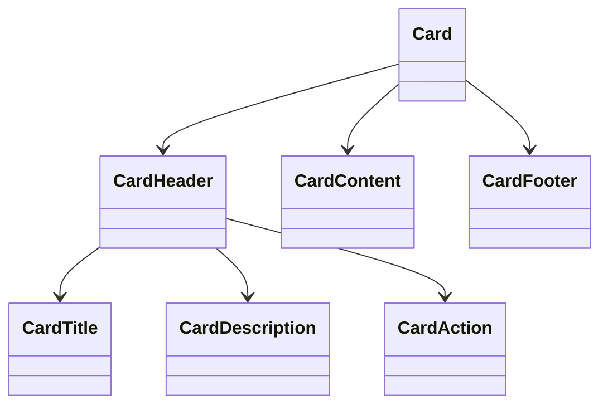
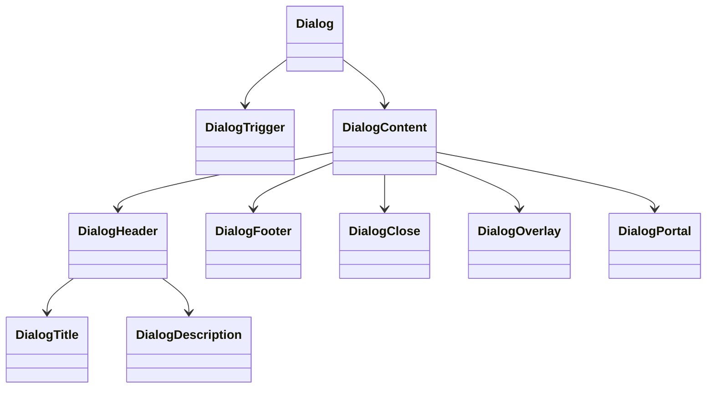
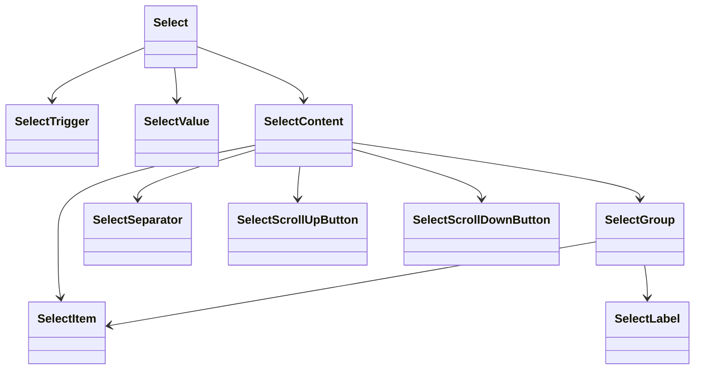
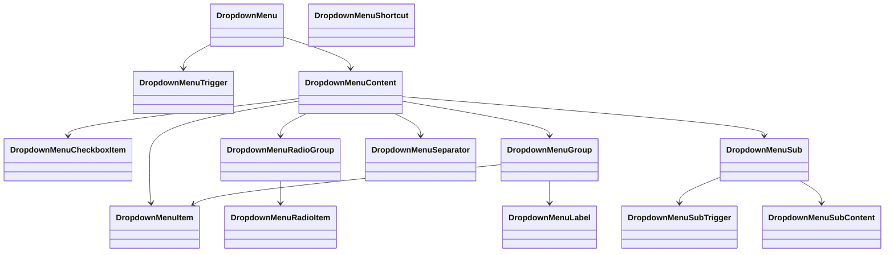
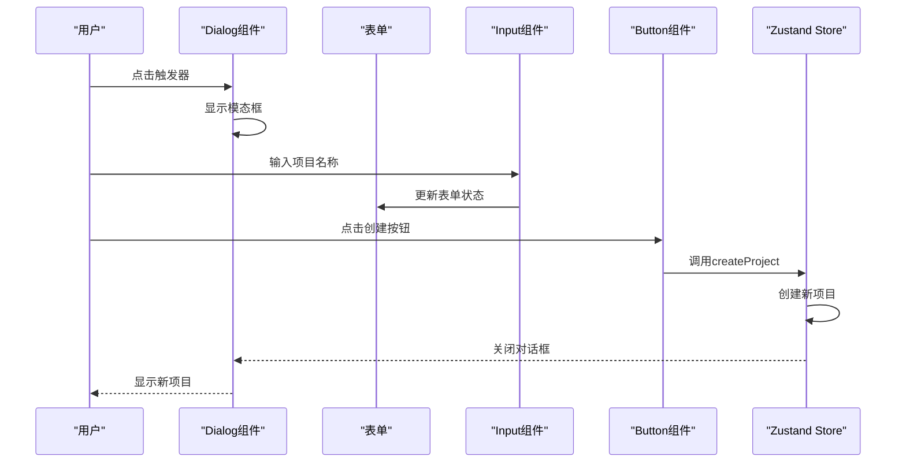
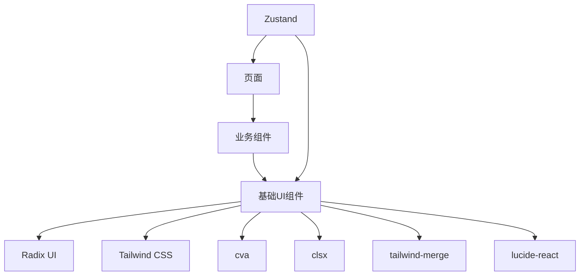

# 基础UI组件

<cite>
**本文档引用文件**  
- [button.tsx](file://prd-generator/src/components/ui/button.tsx)
- [input.tsx](file://prd-generator/src/components/ui/input.tsx)
- [card.tsx](file://prd-generator/src/components/ui/card.tsx)
- [dialog.tsx](file://prd-generator/src/components/ui/dialog.tsx)
- [select.tsx](file://prd-generator/src/components/ui/select.tsx)
- [dropdown-menu.tsx](file://prd-generator/src/components/ui/dropdown-menu.tsx)
- [avatar.tsx](file://prd-generator/src/components/ui/avatar.tsx)
- [badge.tsx](file://prd-generator/src/components/ui/badge.tsx)
- [checkbox.tsx](file://prd-generator/src/components/ui/checkbox.tsx)
- [radio-group.tsx](file://prd-generator/src/components/ui/radio-group.tsx)
- [label.tsx](file://prd-generator/src/components/ui/label.tsx)
- [progress.tsx](file://prd-generator/src/components/ui/progress.tsx)
- [skeleton.tsx](file://prd-generator/src/components/ui/skeleton.tsx)
- [separator.tsx](file://prd-generator/src/components/ui/separator.tsx)
- [tabs.tsx](file://prd-generator/src/components/ui/tabs.tsx)
- [textarea.tsx](file://prd-generator/src/components/ui/textarea.tsx)
- [utils.ts](file://prd-generator/src/lib/utils.ts)
- [index.ts](file://prd-generator/src/store/index.ts)
- [new-project-dialog.tsx](file://prd-generator/src/components/new-project-dialog.tsx)
- [project-card.tsx](file://prd-generator/src/components/project-card.tsx)
- [smart-selector.tsx](file://prd-generator/src/components/smart-selector.tsx)
</cite>

## 目录
1. [简介](#简介)
2. [项目结构](#项目结构)
3. [核心组件](#核心组件)
4. [架构概述](#架构概述)
5. [详细组件分析](#详细组件分析)
6. [依赖分析](#依赖分析)
7. [性能考虑](#性能考虑)
8. [故障排除指南](#故障排除指南)
9. [结论](#结论)

## 简介
本项目基于shadcn/ui构建了一套原子化UI组件库，作为整个应用的视觉和交互基石。这些基础组件通过统一的设计语言确保了界面的一致性，并与Tailwind CSS深度集成，实现了高度可定制的样式系统。所有组件均采用Radix UI实现无头控件逻辑，确保了无障碍访问（a11y）支持和可访问性。组件库与Zustand状态管理协同工作，为表单、对话框、选择器等复杂界面提供了组合使用模式。

## 项目结构
项目采用标准的Next.js应用结构，UI组件集中存放在`src/components/ui`目录下，每个组件以独立的TSX文件实现。组件库基于shadcn/ui模式，通过`cva`（Class Variant Authority）实现样式变体管理，并使用`clsx`和`tailwind-merge`工具函数进行类名合并。应用状态通过Zustand存储在`src/store`目录中，与UI组件紧密协作。

**图源**
- [button.tsx](file://prd-generator/src/components/ui/button.tsx)
- [utils.ts](file://prd-generator/src/lib/utils.ts)

**节源**
- [button.tsx](file://prd-generator/src/components/ui/button.tsx)
- [input.tsx](file://prd-generator/src/components/ui/input.tsx)
- [card.tsx](file://prd-generator/src/components/ui/card.tsx)

## 核心组件
项目中的基础UI组件作为原子化设计系统的核心，提供了Button、Input、Card、Dialog等常用界面元素。这些组件通过标准化的Props接口定义和统一的样式体系，确保了跨页面的一致性体验。每个组件都经过精心设计，支持无障碍访问，并与应用状态管理无缝集成。

**节源**
- [button.tsx](file://prd-generator/src/components/ui/button.tsx)
- [input.tsx](file://prd-generator/src/components/ui/input.tsx)
- [card.tsx](file://prd-generator/src/components/ui/card.tsx)
- [dialog.tsx](file://prd-generator/src/components/ui/dialog.tsx)

## 架构概述
该UI组件库采用分层架构设计，底层依赖Radix UI提供无头控件的交互逻辑，中层通过Tailwind CSS实现样式定义，上层使用cva管理组件变体。所有组件通过`cn`工具函数合并类名，确保样式优先级正确。组件库与Zustand状态管理集成，实现了状态驱动的UI更新。

**图源**
- [button.tsx](file://prd-generator/src/components/ui/button.tsx)
- [utils.ts](file://prd-generator/src/lib/utils.ts)
- [index.ts](file://prd-generator/src/store/index.ts)

## 详细组件分析

### 按钮组件分析
按钮组件是应用中最常用的交互元素之一，提供了多种样式变体和尺寸选项。通过`cva`定义的`buttonVariants`，组件支持default、destructive、outline、secondary、ghost和link等六种变体，以及default、sm、lg、icon等尺寸。

**图源**
- [button.tsx](file://prd-generator/src/components/ui/button.tsx#L7-L37)

**节源**
- [button.tsx](file://prd-generator/src/components/ui/button.tsx)

### 输入框组件分析
输入框组件提供了标准化的文本输入体验，支持无障碍访问和错误状态提示。组件通过`data-slot="input"`属性标识，确保样式应用的一致性。样式定义中包含了焦点状态、无效状态和禁用状态的处理。

**图源**
- [input.tsx](file://prd-generator/src/components/ui/input.tsx#L5-L14)

**节源**
- [input.tsx](file://prd-generator/src/components/ui/input.tsx)

### 卡片组件分析
卡片组件采用组合式设计，由Card、CardHeader、CardTitle、CardDescription、CardAction、CardContent和CardFooter等多个子组件构成。这种设计模式提高了组件的灵活性和可复用性，允许开发者根据需要组合不同的部分。

**图源**
- [card.tsx](file://prd-generator/src/components/ui/card.tsx#L5-L92)

**节源**
- [card.tsx](file://prd-generator/src/components/ui/card.tsx)

### 对话框组件分析
对话框组件基于Radix UI的Dialog原语构建，提供了完整的模态对话框功能。组件包含Dialog、DialogTrigger、DialogContent、DialogHeader、DialogTitle、DialogDescription、DialogFooter和DialogClose等部分，支持显示关闭按钮的可配置性。

**图源**
- [dialog.tsx](file://prd-generator/src/components/ui/dialog.tsx#L9-L143)

**节源**
- [dialog.tsx](file://prd-generator/src/components/ui/dialog.tsx)

### 选择器组件分析
选择器组件封装了Radix UI的Select功能，提供了下拉选择的完整解决方案。组件支持触发器、内容、选项、分组、标签和滚动按钮等元素，实现了复杂的下拉交互逻辑。通过`data-size`属性支持不同尺寸的触发器。

**图源**
- [select.tsx](file://prd-generator/src/components/ui/select.tsx#L9-L187)

**节源**
- [select.tsx](file://prd-generator/src/components/ui/select.tsx)

### 下拉菜单组件分析
下拉菜单组件提供了丰富的菜单功能，支持普通项、复选框项、单选框项、分组、标签、分隔符和快捷键等特性。组件还实现了子菜单功能，支持嵌套的下拉菜单结构。

**图源**
- [dropdown-menu.tsx](file://prd-generator/src/components/ui/dropdown-menu.tsx#L9-L257)

**节源**
- [dropdown-menu.tsx](file://prd-generator/src/components/ui/dropdown-menu.tsx)

### 组合使用模式
基础组件在实际应用中通过组合方式构建复杂的用户界面。例如，在新建项目对话框中，Button、Input、Dialog等组件协同工作，创建了一个完整的表单交互流程。

**图源**
- [new-project-dialog.tsx](file://prd-generator/src/components/new-project-dialog.tsx)
- [index.ts](file://prd-generator/src/store/index.ts)

**节源**
- [new-project-dialog.tsx](file://prd-generator/src/components/new-project-dialog.tsx)
- [index.ts](file://prd-generator/src/store/index.ts)

## 依赖分析
UI组件库依赖多个关键库来实现其功能。Radix UI提供无头控件的交互逻辑，确保了无障碍访问支持。Tailwind CSS负责样式定义，通过实用类系统实现快速UI开发。cva库管理组件的样式变体，而clsx和tailwind-merge则处理类名的条件合并。

**图源**
- [package.json](file://prd-generator/package.json)
- [button.tsx](file://prd-generator/src/components/ui/button.tsx)

**节源**
- [button.tsx](file://prd-generator/src/components/ui/button.tsx)
- [utils.ts](file://prd-generator/src/lib/utils.ts)

## 性能考虑
组件库在性能方面进行了多项优化。通过使用`React.memo`和`useCallback`等React优化技术，减少了不必要的重新渲染。`cn`工具函数使用`tailwind-merge`确保类名合并的高效性。对于复杂的下拉菜单和选择器，采用虚拟滚动和懒加载技术提升性能。

## 故障排除指南
当UI组件出现显示或交互问题时，应首先检查组件的Props是否正确传递。对于样式问题，确认`tailwind-merge`是否正确处理了类名冲突。对于交互问题，检查Radix UI相关属性是否正确设置。状态相关问题应检查Zustand store的更新逻辑。

**节源**
- [utils.ts](file://prd-generator/src/lib/utils.ts)
- [index.ts](file://prd-generator/src/store/index.ts)

## 结论
该项目的原子化UI组件库通过shadcn/ui模式构建，实现了高度一致和可复用的界面元素。组件库与Radix UI、Tailwind CSS和Zustand的深度集成，确保了良好的可访问性、样式灵活性和状态管理能力。通过组合这些基础组件，可以快速构建复杂的用户界面，同时保持设计语言的统一性。