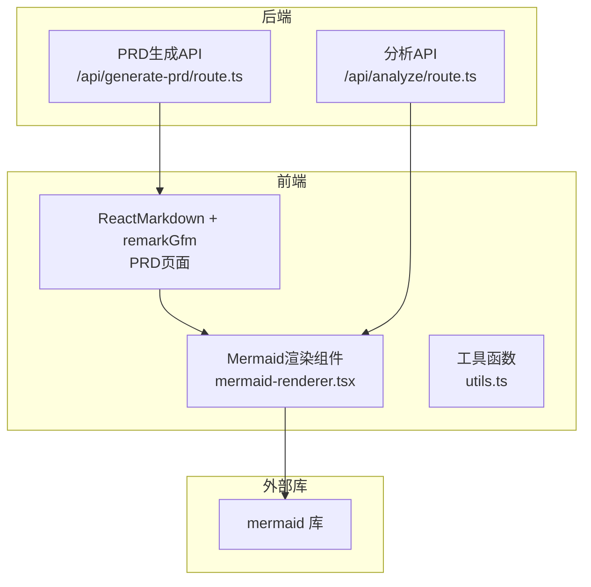
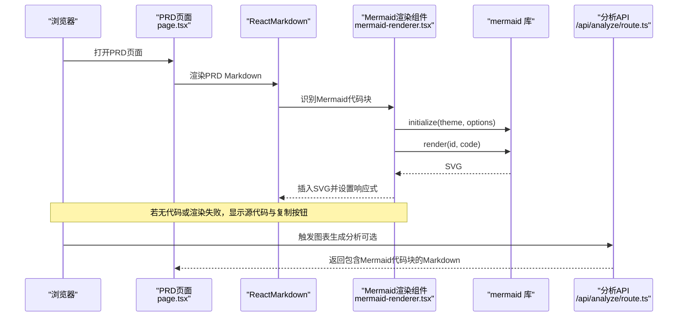
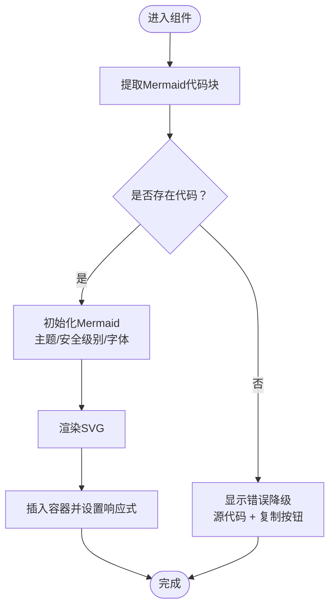
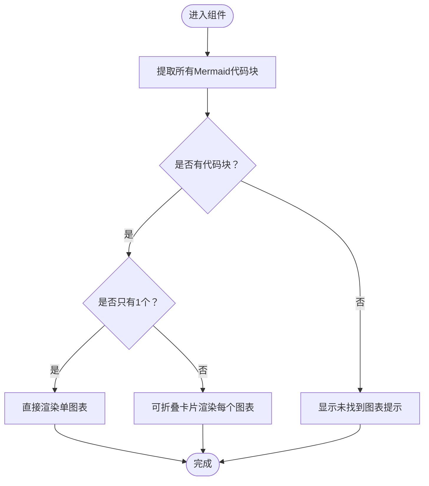
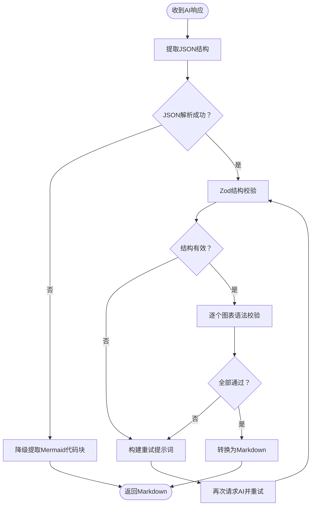
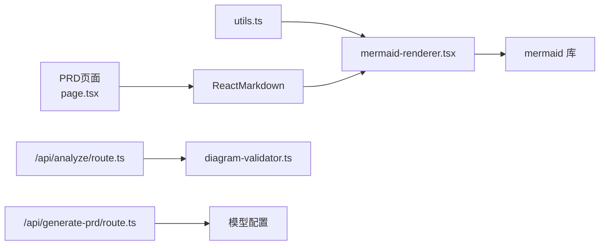

# Mermaid渲染器

<cite>
**本文引用的文件**
- [mermaid-renderer.tsx](file://prd-generator/src/components/mermaid-renderer.tsx)
- [diagram-validator.ts](file://prd-generator/src/lib/diagram-validator.ts)
- [utils.ts](file://prd-generator/src/lib/utils.ts)
- [route.ts](file://prd-generator/src/app/api/analyze/route.ts)
- [route.ts](file://prd-generator/src/app/api/generate-prd/route.ts)
- [page.tsx](file://prd-generator/src/app/project/[id]/prd/page.tsx)
- [package.json](file://prd-generator/package.json)
</cite>

## 目录
1. [简介](#简介)
2. [项目结构](#项目结构)
3. [核心组件](#核心组件)
4. [架构总览](#架构总览)
5. [组件详解](#组件详解)
6. [依赖关系分析](#依赖关系分析)
7. [性能考量](#性能考量)
8. [故障排查指南](#故障排查指南)
9. [结论](#结论)

## 简介
本文件聚焦于项目中的Mermaid渲染器能力，涵盖前端Mermaid渲染组件、后端图表生成与校验流程、以及在PRD页面中的Markdown渲染与Mermaid图表展示。Mermaid渲染器负责：
- 从Markdown中提取Mermaid代码块并渲染为SVG
- 支持多图表渲染与可折叠展示
- 主题适配（浅色/深色）
- 错误降级：语法错误时显示源代码与复制按钮
- 与AI生成的PRD内容无缝集成，支持一键复制图表源码

## 项目结构
Mermaid渲染器位于前端组件层，配合后端图表生成与校验逻辑，最终在PRD页面中以ReactMarkdown渲染Mermaid图表。

**图表来源**
- [mermaid-renderer.tsx](file://prd-generator/src/components/mermaid-renderer.tsx#L1-L248)
- [page.tsx](file://prd-generator/src/app/project/[id]/prd/page.tsx#L981-L990)
- [route.ts](file://prd-generator/src/app/api/analyze/route.ts#L278-L441)
- [route.ts](file://prd-generator/src/app/api/generate-prd/route.ts#L107-L264)

**章节来源**
- [mermaid-renderer.tsx](file://prd-generator/src/components/mermaid-renderer.tsx#L1-L248)
- [page.tsx](file://prd-generator/src/app/project/[id]/prd/page.tsx#L981-L990)
- [route.ts](file://prd-generator/src/app/api/analyze/route.ts#L278-L441)
- [route.ts](file://prd-generator/src/app/api/generate-prd/route.ts#L107-L264)

## 核心组件
- MermaidRenderer：单图表渲染组件，负责初始化Mermaid、渲染SVG、主题适配、错误降级与复制源码。
- MultiDiagramRenderer：多图表渲染组件，支持提取多个Mermaid代码块并逐个渲染，提供可折叠卡片。
- SingleDiagramRenderer：内部子组件，用于多图表模式下的单个图表渲染。
- 图表校验器：后端图表生成与校验，包含JSON结构校验、Mermaid语法基础校验、重试与降级提取。
- PRD页面：使用ReactMarkdown渲染PRD内容，Mermaid图表随PRD内容一起渲染。

**章节来源**
- [mermaid-renderer.tsx](file://prd-generator/src/components/mermaid-renderer.tsx#L91-L248)
- [mermaid-renderer.tsx](file://prd-generator/src/components/mermaid-renderer.tsx#L258-L464)
- [diagram-validator.ts](file://prd-generator/src/lib/diagram-validator.ts#L1-L284)
- [page.tsx](file://prd-generator/src/app/project/[id]/prd/page.tsx#L981-L990)

## 架构总览
Mermaid渲染器的端到端流程如下：
- 后端AI生成PRD时，可触发图表生成分析，返回包含Mermaid代码块的Markdown
- PRD页面通过ReactMarkdown渲染PRD内容，其中Mermaid代码块被识别并交给Mermaid渲染组件
- 前端Mermaid渲染组件解析代码块、初始化Mermaid、渲染SVG并提供复制源码能力
- 若无Mermaid代码块或渲染失败，组件提供错误降级与复制源码入口

**图表来源**
- [page.tsx](file://prd-generator/src/app/project/[id]/prd/page.tsx#L981-L990)
- [mermaid-renderer.tsx](file://prd-generator/src/components/mermaid-renderer.tsx#L91-L248)
- [route.ts](file://prd-generator/src/app/api/analyze/route.ts#L278-L441)

## 组件详解

### MermaidRenderer（单图表渲染）
- 功能要点
  - 从Markdown中提取Mermaid代码块
  - 初始化Mermaid（主题、安全级别、字体、主题变量）
  - 渲染SVG并设置最大宽度为容器宽度
  - 主题适配：根据next-themes的当前主题选择Mermaid主题
  - 错误降级：渲染失败时显示源代码与复制按钮
  - 复制源码：一键复制Mermaid代码到剪贴板
- 关键行为
  - 提取图表类型与标题，映射图标与类型名称
  - 使用唯一ID渲染，避免冲突
  - 对SVG元素设置响应式样式

**图表来源**
- [mermaid-renderer.tsx](file://prd-generator/src/components/mermaid-renderer.tsx#L91-L248)

**章节来源**
- [mermaid-renderer.tsx](file://prd-generator/src/components/mermaid-renderer.tsx#L91-L248)

### MultiDiagramRenderer（多图表渲染）
- 功能要点
  - 从Markdown中提取多个Mermaid代码块
  - 为每个代码块推断图表类型与标题
  - 提供可折叠卡片，逐个渲染单图表
  - 当仅有一个图表时，直接渲染
  - 错误提示：未找到图表时显示提示
- 关键行为
  - 使用useState维护展开/收起状态
  - 通过SingleDiagramRenderer渲染每个图表

**图表来源**
- [mermaid-renderer.tsx](file://prd-generator/src/components/mermaid-renderer.tsx#L258-L464)

**章节来源**
- [mermaid-renderer.tsx](file://prd-generator/src/components/mermaid-renderer.tsx#L258-L464)

### SingleDiagramRenderer（单图表渲染子组件）
- 功能要点
  - 仅接收单段Mermaid代码
  - 与MermaidRenderer相同的初始化与渲染流程
  - 错误降级与复制源码
- 关键行为
  - 通过useEffect监听代码变化并重新渲染
  - 主题适配与SVG响应式设置

**章节来源**
- [mermaid-renderer.tsx](file://prd-generator/src/components/mermaid-renderer.tsx#L347-L464)

### 图表校验器（后端）
- 功能要点
  - 从AI响应中提取JSON结构，校验结构合法性
  - 对每个图表进行Mermaid语法基础校验（类型声明、节点定义、禁止样式等）
  - 生成重试提示词，支持多次重试
  - 降级提取：若JSON结构失败，尝试从原始文本中提取Mermaid代码块
  - 将图表数据转换为Markdown格式返回
- 关键行为
  - validateDiagramResponse：整体校验与错误收集
  - validateMermaidSyntax：基础语法校验
  - buildDiagramRetryPrompt：生成重试提示词
  - convertDiagramsToMarkdown：转换为Markdown
  - extractMermaidBlocksFromText：降级提取

**图表来源**
- [diagram-validator.ts](file://prd-generator/src/lib/diagram-validator.ts#L1-L284)

**章节来源**
- [diagram-validator.ts](file://prd-generator/src/lib/diagram-validator.ts#L1-L284)

### PRD页面中的Mermaid渲染
- 功能要点
  - 使用ReactMarkdown渲染PRD内容
  - remarkGfm启用表格、删除线等扩展
  - Mermaid代码块随PRD内容一起渲染
- 关键行为
  - PRD页面在渲染完成后，Mermaid代码块由Mermaid渲染组件接管

**章节来源**
- [page.tsx](file://prd-generator/src/app/project/[id]/prd/page.tsx#L981-L990)

## 依赖关系分析
- 组件依赖
  - MermaidRenderer依赖mermaid库、next-themes、sonner、lucide-react、Tailwind CSS工具函数
  - MultiDiagramRenderer依赖MermaidRenderer与utils
  - PRD页面依赖ReactMarkdown与remarkGfm
- 后端依赖
  - 分析API依赖图表校验器与模型配置
  - PRD生成API依赖模型配置与安全校验

**图表来源**
- [mermaid-renderer.tsx](file://prd-generator/src/components/mermaid-renderer.tsx#L1-L248)
- [utils.ts](file://prd-generator/src/lib/utils.ts#L1-L7)
- [page.tsx](file://prd-generator/src/app/project/[id]/prd/page.tsx#L981-L990)
- [route.ts](file://prd-generator/src/app/api/analyze/route.ts#L278-L441)
- [route.ts](file://prd-generator/src/app/api/generate-prd/route.ts#L107-L264)

**章节来源**
- [mermaid-renderer.tsx](file://prd-generator/src/components/mermaid-renderer.tsx#L1-L248)
- [utils.ts](file://prd-generator/src/lib/utils.ts#L1-L7)
- [page.tsx](file://prd-generator/src/app/project/[id]/prd/page.tsx#L981-L990)
- [route.ts](file://prd-generator/src/app/api/analyze/route.ts#L278-L441)
- [route.ts](file://prd-generator/src/app/api/generate-prd/route.ts#L107-L264)

## 性能考量
- 渲染性能
  - 单图表渲染：每次渲染都会调用mermaid.render，建议在代码变化时再触发渲染
  - 多图表渲染：使用可折叠卡片减少一次性渲染压力
- 主题切换
  - 主题切换时重新初始化Mermaid，避免重复初始化导致的性能浪费
- 错误降级
  - 渲染失败时仅显示源代码与复制按钮，避免额外的DOM操作
- 复制源码
  - 复制操作使用navigator.clipboard，避免频繁的DOM复制

[本节为通用指导，不涉及具体文件分析]

## 故障排查指南
- 未找到Mermaid代码块
  - 现象：渲染组件显示“未找到Mermaid代码块”
  - 排查：确认PRD内容中是否包含Mermaid代码块
  - 位置：[mermaid-renderer.tsx](file://prd-generator/src/components/mermaid-renderer.tsx#L91-L110)
- 渲染失败
  - 现象：显示“图表渲染失败: …”
  - 排查：检查Mermaid语法、节点定义、禁止样式；尝试复制源码到Mermaid编辑器验证
  - 位置：[mermaid-renderer.tsx](file://prd-generator/src/components/mermaid-renderer.tsx#L122-L149)
- 主题不生效
  - 现象：主题与系统主题不一致
  - 排查：确认next-themes配置与Mermaid主题映射
  - 位置：[mermaid-renderer.tsx](file://prd-generator/src/components/mermaid-renderer.tsx#L108-L121)
- 多图表渲染无内容
  - 现象：显示“未找到Mermaid图表内容”
  - 排查：确认PRD中存在多个Mermaid代码块
  - 位置：[mermaid-renderer.tsx](file://prd-generator/src/components/mermaid-renderer.tsx#L262-L269)
- 后端图表生成失败
  - 现象：分析API返回原始内容或错误
  - 排查：查看校验器错误列表，使用重试提示词；必要时降级提取Mermaid代码块
  - 位置：[route.ts](file://prd-generator/src/app/api/analyze/route.ts#L278-L441)，[diagram-validator.ts](file://prd-generator/src/lib/diagram-validator.ts#L135-L201)

**章节来源**
- [mermaid-renderer.tsx](file://prd-generator/src/components/mermaid-renderer.tsx#L91-L149)
- [route.ts](file://prd-generator/src/app/api/analyze/route.ts#L278-L441)
- [diagram-validator.ts](file://prd-generator/src/lib/diagram-validator.ts#L135-L201)

## 结论
Mermaid渲染器在本项目中承担了从PRD内容中识别并渲染Mermaid图表的关键职责。前端组件提供了完善的主题适配、错误降级与复制源码能力；后端图表生成与校验流程保证了图表输出的稳定性与一致性。通过MultiDiagramRenderer与SingleDiagramRenderer的组合，系统能够灵活地处理单图或多图场景，并在PRD页面中与Markdown内容无缝集成。