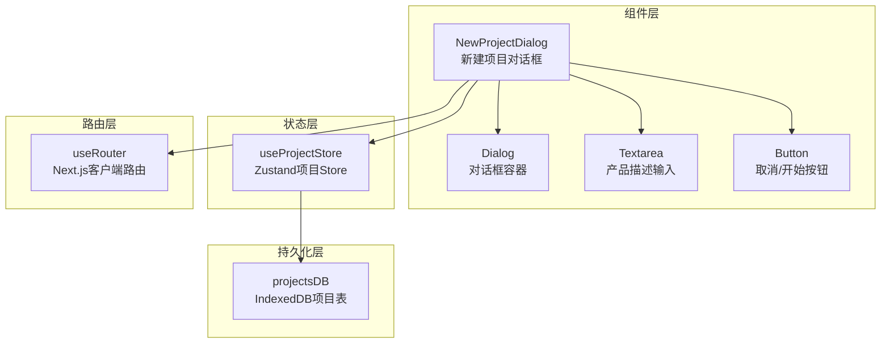
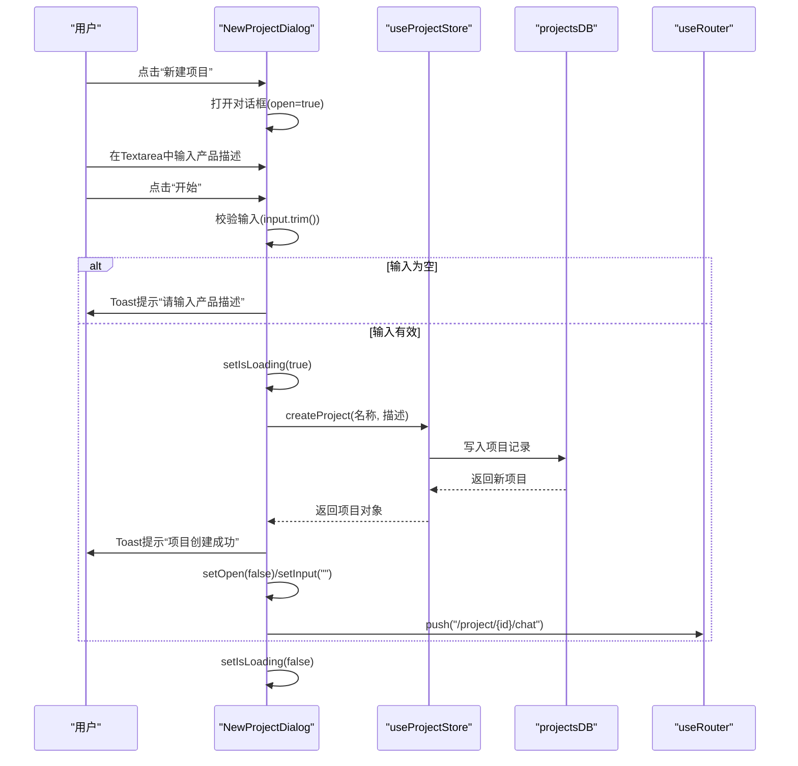
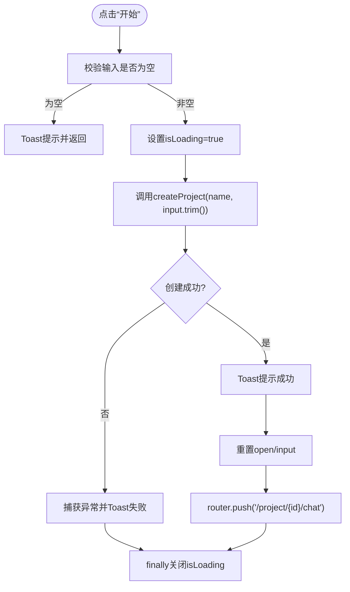
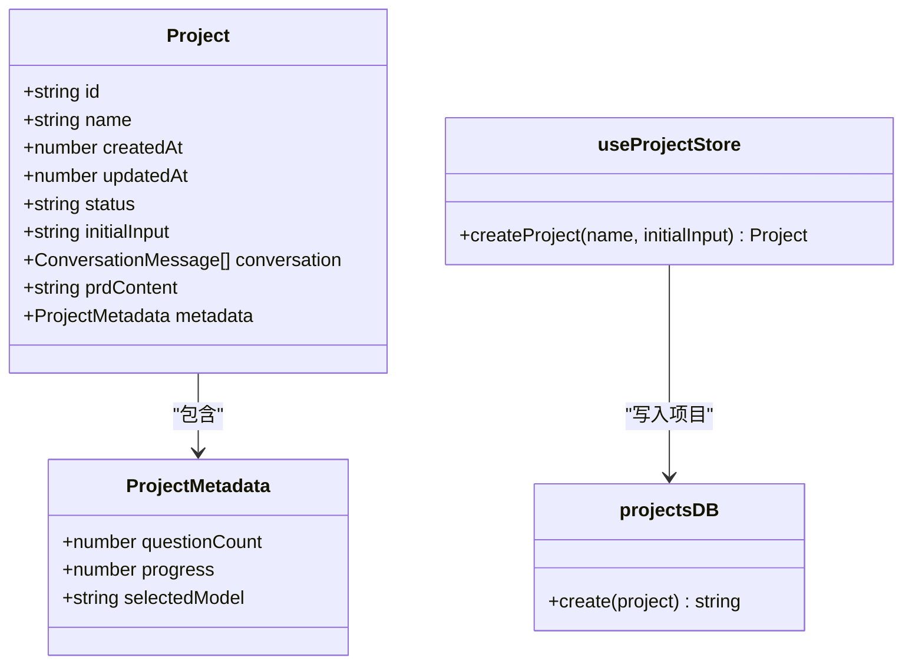
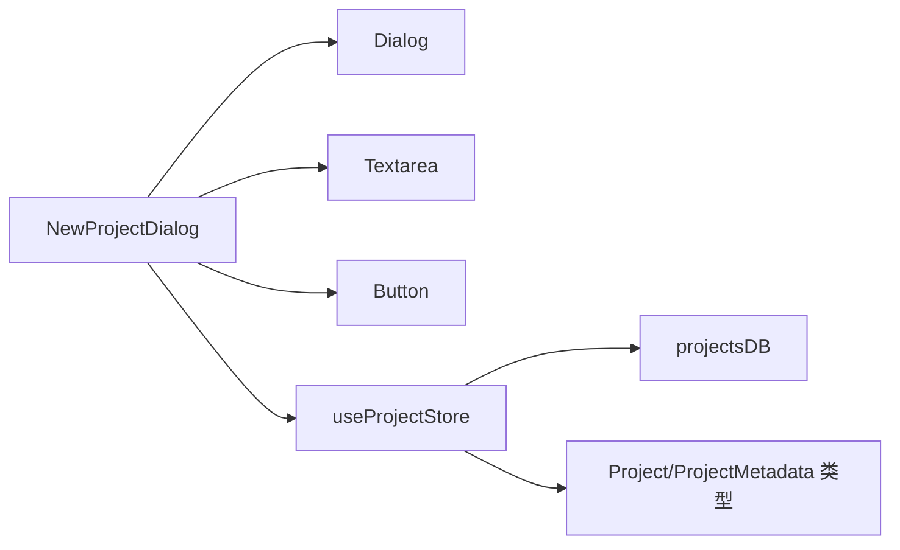

# 新建项目对话框

<cite>
**本文引用的文件**
- [new-project-dialog.tsx](file://prd-generator/src/components/new-project-dialog.tsx)
- [store/index.ts](file://prd-generator/src/store/index.ts)
- [dialog.tsx](file://prd-generator/src/components/ui/dialog.tsx)
- [textarea.tsx](file://prd-generator/src/components/ui/textarea.tsx)
- [button.tsx](file://prd-generator/src/components/ui/button.tsx)
- [page.tsx](file://prd-generator/src/app/project/[id]/chat/page.tsx)
- [types/index.ts](file://prd-generator/src/types/index.ts)
- [db.ts](file://prd-generator/src/lib/db.ts)
- [globals.css](file://prd-generator/src/app/globals.css)
</cite>

## 目录
1. [简介](#简介)
2. [项目结构](#项目结构)
3. [核心组件](#核心组件)
4. [架构总览](#架构总览)
5. [详细组件分析](#详细组件分析)
6. [依赖关系分析](#依赖关系分析)
7. [性能考量](#性能考量)
8. [故障排查指南](#故障排查指南)
9. [结论](#结论)
10. [附录](#附录)

## 简介
本文件对“新建项目对话框”组件进行全面解析，重点覆盖以下方面：
- 作为项目创建入口的完整流程：从用户点击触发对话框，到在Textarea中输入产品描述，再到点击“开始”按钮后调用全局状态管理中的createProject方法创建新项目。
- 组件内部状态（input、isLoading）的管理策略与交互反馈。
- 成功创建后通过next/navigation的useRouter跳转至对应的聊天页面“/project/[id]/chat”的实现路径。
- 与全局状态管理（Zustand）的集成方式，包括createProject异步操作的成功与错误处理逻辑。
- 使用sonner库展示Toast通知的策略与时机。
- UI结构（Dialog、Textarea、Button等）的布局与样式，响应式设计的实现，以及用户体验优化细节（输入校验、加载状态反馈、提示信息）。
- 实际调用示例与扩展点建议（如支持更多项目元数据的输入）。

## 项目结构
该组件位于组件层，采用原子化UI组件组合，配合Zustand状态管理与IndexedDB本地持久化，形成“对话框触发—输入校验—创建项目—路由跳转—聊天页初始化”的闭环。

图表来源
- [new-project-dialog.tsx](file://prd-generator/src/components/new-project-dialog.tsx#L1-L107)
- [dialog.tsx](file://prd-generator/src/components/ui/dialog.tsx#L1-L144)
- [textarea.tsx](file://prd-generator/src/components/ui/textarea.tsx#L1-L19)
- [button.tsx](file://prd-generator/src/components/ui/button.tsx#L1-L61)
- [store/index.ts](file://prd-generator/src/store/index.ts#L62-L83)
- [db.ts](file://prd-generator/src/lib/db.ts#L35-L72)

章节来源
- [new-project-dialog.tsx](file://prd-generator/src/components/new-project-dialog.tsx#L1-L107)
- [store/index.ts](file://prd-generator/src/store/index.ts#L62-L83)
- [db.ts](file://prd-generator/src/lib/db.ts#L35-L72)

## 核心组件
- NewProjectDialog：负责弹出对话框、收集用户输入、执行创建逻辑、处理加载状态与错误提示，并在成功后跳转到聊天页。
- useProjectStore.createProject：封装项目创建的业务逻辑，写入IndexedDB并更新内存状态。
- Dialog/Textarea/Button：基础UI原子组件，提供一致的视觉与交互体验。
- useRouter：用于在创建成功后进行页面跳转。

章节来源
- [new-project-dialog.tsx](file://prd-generator/src/components/new-project-dialog.tsx#L1-L107)
- [store/index.ts](file://prd-generator/src/store/index.ts#L62-L83)
- [dialog.tsx](file://prd-generator/src/components/ui/dialog.tsx#L1-L144)
- [textarea.tsx](file://prd-generator/src/components/ui/textarea.tsx#L1-L19)
- [button.tsx](file://prd-generator/src/components/ui/button.tsx#L1-L61)

## 架构总览
下图展示了从用户触发到创建完成并跳转的端到端流程：

图表来源
- [new-project-dialog.tsx](file://prd-generator/src/components/new-project-dialog.tsx#L29-L51)
- [store/index.ts](file://prd-generator/src/store/index.ts#L62-L83)
- [db.ts](file://prd-generator/src/lib/db.ts#L47-L57)

## 详细组件分析

### NewProjectDialog 组件
- 触发与状态
  - 通过Dialog包裹，使用DialogTrigger暴露按钮入口；内部维护open、input、isLoading三个状态。
  - 点击“开始”按钮触发handleCreate，内部进行输入校验与异步创建。
- 输入校验与提示
  - 若input为空，立即通过sonner抛出错误提示并终止流程。
- 创建逻辑
  - 从输入中提取项目名称（取首句或前20字符），随后调用useProjectStore.createProject(name, input.trim())。
  - 成功后Toast提示“项目创建成功”，重置输入与对话框状态，并通过useRouter跳转到“/project/{id}/chat”。
- 错误处理
  - try/catch捕获异常，控制台打印错误并Toast提示“创建项目失败”，finally中关闭加载状态。
- 禁用与反馈
  - “开始”按钮在isLoading或无输入时禁用；加载时显示“创建中...”。

图表来源
- [new-project-dialog.tsx](file://prd-generator/src/components/new-project-dialog.tsx#L29-L51)

章节来源
- [new-project-dialog.tsx](file://prd-generator/src/components/new-project-dialog.tsx#L1-L107)

### useProjectStore.createProject
- 参数与返回
  - 接收name与initialInput两个参数，返回Promise<Project>。
- 数据模型
  - 项目包含id、name、createdAt/updatedAt、status、initialInput、conversation、prdContent、metadata等字段。
  - metadata包含questionCount、progress、selectedModel等。
- 持久化与状态更新
  - 调用projectsDB.create写入数据库，再通过Zustand更新内存中的projects列表。
- 与聊天页的关系
  - 创建完成后，聊天页会基于initialInput自动发起第一条消息，驱动后续对话流程。

图表来源
- [store/index.ts](file://prd-generator/src/store/index.ts#L62-L83)
- [db.ts](file://prd-generator/src/lib/db.ts#L47-L57)
- [types/index.ts](file://prd-generator/src/types/index.ts#L56-L73)

章节来源
- [store/index.ts](file://prd-generator/src/store/index.ts#L62-L83)
- [types/index.ts](file://prd-generator/src/types/index.ts#L56-L73)
- [db.ts](file://prd-generator/src/lib/db.ts#L47-L57)

### UI与样式（Dialog/Textarea/Button）
- Dialog
  - 提供根节点、触发器、内容区、标题、描述、页脚等语义化结构，支持Portal与Overlay。
  - 内容区默认居中、固定定位、最大宽度与圆角，移动端通过max-w类控制宽度。
- Textarea
  - 提供基础边框、占位符、聚焦态、禁用态等通用样式，支持最小高度与行数控制。
- Button
  - 通过cva定义变体与尺寸，支持asChild包装，提供触摸反馈与禁用态。
- 响应式设计
  - 使用sm:、xs:等Tailwind变体类实现不同屏幕下的尺寸与间距调整。
  - 触摸反馈类.touch-feedback提供按下缩放反馈，提升移动端交互体验。
  - 全局样式中定义了滚动条、焦点可见性、暗色主题变量等通用规则。

章节来源
- [dialog.tsx](file://prd-generator/src/components/ui/dialog.tsx#L1-L144)
- [textarea.tsx](file://prd-generator/src/components/ui/textarea.tsx#L1-L19)
- [button.tsx](file://prd-generator/src/components/ui/button.tsx#L1-L61)
- [globals.css](file://prd-generator/src/app/globals.css#L1-L215)

### 路由跳转与聊天页初始化
- 路由跳转
  - 创建成功后，NewProjectDialog通过useRouter.push跳转到“/project/{id}/chat”。
- 聊天页行为
  - ChatPage在挂载时加载项目与设置，并在存在initialInput且有设置时自动发送第一条消息，驱动对话流程。
  - 该行为与新建项目流程形成自然衔接，无需额外操作即可进入对话阶段。

章节来源
- [new-project-dialog.tsx](file://prd-generator/src/components/new-project-dialog.tsx#L41-L44)
- [page.tsx](file://prd-generator/src/app/project/[id]/chat/page.tsx#L176-L181)

## 依赖关系分析
- 组件依赖
  - NewProjectDialog依赖Dialog、Textarea、Button等UI组件，依赖useProjectStore进行状态与持久化操作，依赖useRouter进行页面跳转。
- 状态与持久化
  - useProjectStore.createProject依赖projectsDB.create写入IndexedDB，同时更新内存状态。
- 类型与约束
  - Project与ProjectMetadata等类型定义了项目结构与元数据，确保createProject返回值与后续聊天页消费的数据一致。

图表来源
- [new-project-dialog.tsx](file://prd-generator/src/components/new-project-dialog.tsx#L1-L107)
- [store/index.ts](file://prd-generator/src/store/index.ts#L62-L83)
- [db.ts](file://prd-generator/src/lib/db.ts#L35-L72)
- [types/index.ts](file://prd-generator/src/types/index.ts#L56-L73)

章节来源
- [new-project-dialog.tsx](file://prd-generator/src/components/new-project-dialog.tsx#L1-L107)
- [store/index.ts](file://prd-generator/src/store/index.ts#L62-L83)
- [db.ts](file://prd-generator/src/lib/db.ts#L35-L72)
- [types/index.ts](file://prd-generator/src/types/index.ts#L56-L73)

## 性能考量
- 状态更新粒度
  - createProject仅写入数据库并更新projects列表，避免冗余计算，保持状态更新轻量。
- UI反馈及时性
  - isLoading在点击“开始”后立即开启，避免用户重复提交；finally确保最终关闭，防止卡死。
- 输入处理
  - 名称提取采用简单分隔与截断策略，复杂度低，适合首屏快速体验。
- 持久化与内存一致性
  - 通过Zustand集中管理内存状态，避免重复查询；DB写入后立即更新内存，保证一致性。

[本节为通用性能建议，不直接分析具体文件]

## 故障排查指南
- 输入为空导致无法创建
  - 现象：点击“开始”无反应或出现错误提示。
  - 处理：确认Textarea中至少包含非空白字符；组件会在空输入时Toast提示。
- 创建失败
  - 现象：Toast提示“创建项目失败”，控制台打印错误。
  - 处理：检查网络与IndexedDB可用性；查看控制台错误堆栈；重试或刷新页面。
- 跳转失败
  - 现象：创建成功但未跳转。
  - 处理：确认router.push调用路径正确；检查路由配置；确保项目id有效。
- 聊天页无初始消息
  - 现象：创建后进入聊天页但无自动消息。
  - 处理：确认ChatPage在挂载时会根据initialInput自动发送第一条消息；检查设置与项目数据是否加载成功。

章节来源
- [new-project-dialog.tsx](file://prd-generator/src/components/new-project-dialog.tsx#L29-L51)
- [page.tsx](file://prd-generator/src/app/project/[id]/chat/page.tsx#L176-L181)

## 结论
NewProjectDialog以简洁的UI与明确的状态管理实现了“从输入到创建再到跳转”的完整闭环。通过Zustand与IndexedDB的结合，既保证了状态的一致性，又提供了良好的离线体验。Toast通知与加载状态反馈提升了用户体验。后续可在输入校验、名称提取策略、以及支持更多项目元数据输入等方面进一步扩展。

[本节为总结性内容，不直接分析具体文件]

## 附录

### 实际调用示例（路径参考）
- 打开对话框并输入描述
  - 触发路径：[new-project-dialog.tsx](file://prd-generator/src/components/new-project-dialog.tsx#L54-L60)
  - 输入绑定：[new-project-dialog.tsx](file://prd-generator/src/components/new-project-dialog.tsx#L74-L81)
- 点击“开始”创建项目
  - 校验与创建：[new-project-dialog.tsx](file://prd-generator/src/components/new-project-dialog.tsx#L29-L51)
  - 调用store：[new-project-dialog.tsx](file://prd-generator/src/components/new-project-dialog.tsx#L23-L24)
  - 调用createProject：[store/index.ts](file://prd-generator/src/store/index.ts#L62-L83)
- 成功后跳转聊天页
  - 路由跳转：[new-project-dialog.tsx](file://prd-generator/src/components/new-project-dialog.tsx#L41-L44)
  - 聊天页自动消息：[page.tsx](file://prd-generator/src/app/project/[id]/chat/page.tsx#L176-L181)

### 扩展点建议
- 输入校验增强
  - 增加最小长度限制、敏感词过滤、格式校验（如要求包含特定关键词）。
- 名称提取策略
  - 支持更复杂的首句提取、正则清洗、自动去重与唯一性保障。
- 项目元数据扩展
  - 在对话框中增加“项目类型”、“目标平台”、“优先级”等字段，写入Project.metadata或新增字段。
- 多语言与国际化
  - 将提示文案与按钮文案国际化，便于多地区用户使用。
- 模板与快捷入口
  - 提供常见模板或快捷入口，帮助用户快速生成项目描述。

[本节为概念性扩展建议，不直接分析具体文件]