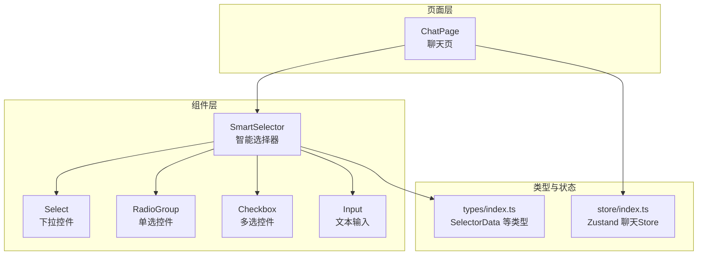
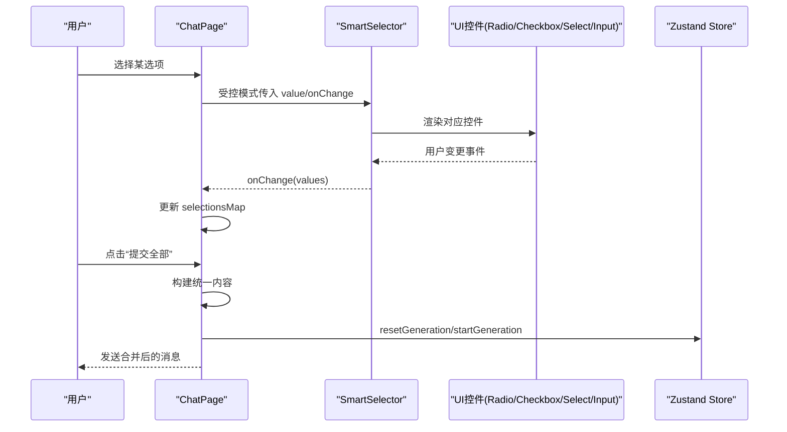
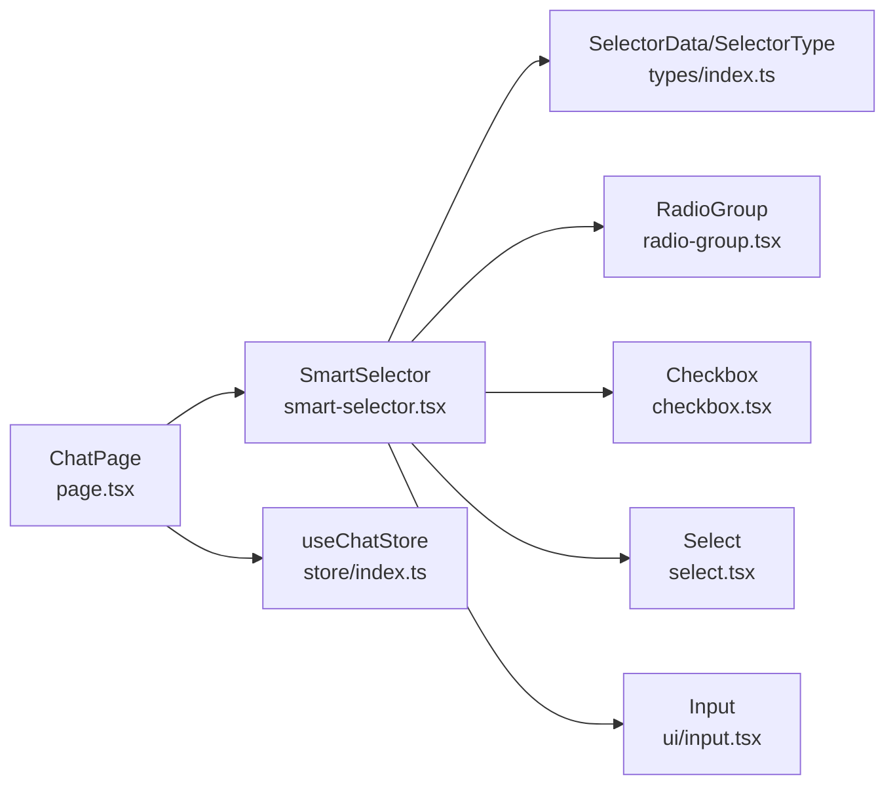
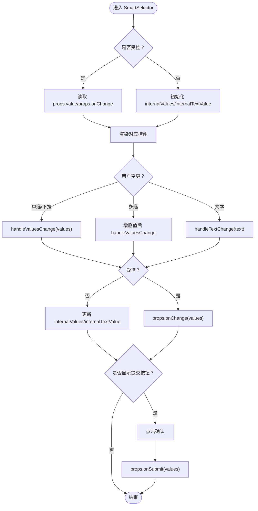

# 智能选择器组件

<cite>
**本文引用的文件**
- [smart-selector.tsx](file://prd-generator/src/components/smart-selector.tsx)
- [page.tsx](file://prd-generator/src/app/project/[id]/chat/page.tsx)
- [index.ts](file://prd-generator/src/types/index.ts)
- [index.ts](file://prd-generator/src/store/index.ts)
- [radio-group.tsx](file://prd-generator/src/components/ui/radio-group.tsx)
- [checkbox.tsx](file://prd-generator/src/components/ui/checkbox.tsx)
- [select.tsx](file://prd-generator/src/components/ui/select.tsx)
</cite>

## 目录
1. [引言](#引言)
2. [项目结构](#项目结构)
3. [核心组件](#核心组件)
4. [架构总览](#架构总览)
5. [详细组件分析](#详细组件分析)
6. [依赖分析](#依赖分析)
7. [性能考量](#性能考量)
8. [故障排查指南](#故障排查指南)
9. [结论](#结论)
10. [附录](#附录)

## 引言
本文件深入解析 SmartSelector 组件的设计与实现，重点说明其如何基于 AI 返回的 SelectorData 结构动态渲染不同类型的交互控件（单选、多选、下拉、文本输入），并支持“受控”与“非受控”两种模式。文档将阐述 isControlled 类型谓词在状态管理中的关键作用，分析组件内部状态与外部状态的同步逻辑；结合 /project/[id]/chat/page.tsx 的集成方式，展示在多轮对话中如何统一处理用户输入。此外，文档还提供 Props 接口定义、渲染逻辑、值变更处理流程、提交机制、与 Zustand Store 的交互方式、最佳实践、常见问题与解决方案，以及在响应式设计与无障碍访问方面的考虑。

## 项目结构
SmartSelector 位于组件层，依赖 UI 基础控件（单选、多选、下拉、输入等），并与聊天页 page.tsx 通过受控模式集成，配合 Zustand Store 管理聊天任务状态与草稿持久化。

图表来源
- [smart-selector.tsx](file://prd-generator/src/components/smart-selector.tsx#L1-L225)
- [page.tsx](file://prd-generator/src/app/project/[id]/chat/page.tsx#L675-L712)
- [index.ts](file://prd-generator/src/types/index.ts#L1-L44)
- [index.ts](file://prd-generator/src/store/index.ts#L296-L530)

章节来源
- [smart-selector.tsx](file://prd-generator/src/components/smart-selector.tsx#L1-L225)
- [page.tsx](file://prd-generator/src/app/project/[id]/chat/page.tsx#L675-L712)
- [index.ts](file://prd-generator/src/types/index.ts#L1-L44)
- [index.ts](file://prd-generator/src/store/index.ts#L296-L530)

## 核心组件
- SmartSelector：根据 SelectorData 动态渲染单选、多选、下拉、文本输入控件，支持受控与非受控两种模式，内置必填校验与提交按钮（非受控模式）。
- SelectedAnswer：用于展示已选答案的只读视图。
- UI 基础控件：RadioGroup、Checkbox、Select、Input。
- ChatPage：在多轮对话中统一渲染多个 SmartSelector，并提供“提交全部”的统一提交机制。

章节来源
- [smart-selector.tsx](file://prd-generator/src/components/smart-selector.tsx#L1-L225)
- [page.tsx](file://prd-generator/src/app/project/[id]/chat/page.tsx#L675-L712)

## 架构总览
SmartSelector 在受控模式下由父组件（如 ChatPage）提供 value 与 onChange，内部不维护额外状态；在非受控模式下，SmartSelector 自身维护内部状态并在需要时通过 onSubmit 回传。ChatPage 使用 selectionsMap 统一管理多个选择器的状态，并在交互完成后统一提交。

图表来源
- [smart-selector.tsx](file://prd-generator/src/components/smart-selector.tsx#L46-L225)
- [page.tsx](file://prd-generator/src/app/project/[id]/chat/page.tsx#L418-L504)
- [index.ts](file://prd-generator/src/store/index.ts#L296-L530)

## 详细组件分析

### Props 接口定义
- 受控模式 ControlledSelectorProps
  - selector: SelectorData
  - value: string[]（当前值）
  - onChange: (values: string[]) => void（外部回调）
  - disabled?: boolean
  - showSubmitButton?: false（受控模式不显示单独提交按钮）

- 非受控模式 UncontrolledSelectorProps
  - selector: SelectorData
  - onSubmit: (values: string[]) => void（提交回调）
  - disabled?: boolean
  - showSubmitButton?: true（非受控模式默认显示提交按钮）
  - value?: never（排除）
  - onChange?: never（排除）

- SmartSelectorProps：两者的联合类型

- isControlled 类型谓词
  - 依据是否存在 onChange 字段判断是否为受控模式
  - 用于在运行时区分两种模式下的状态来源与变更路径

章节来源
- [smart-selector.tsx](file://prd-generator/src/components/smart-selector.tsx#L20-L44)

### 渲染逻辑与交互控件
- 单选（radio）
  - 使用 RadioGroup 与 RadioGroupItem 渲染选项列表
  - value/currentValues[0] 作为当前值
  - onValueChange 触发 handleValuesChange

- 多选（checkbox）
  - 使用 Checkbox 渲染每个选项
  - checked 由 currentValues 是否包含该值决定
  - onCheckedChange 根据勾选状态增删值，再调用 handleValuesChange

- 下拉（dropdown）
  - 使用 Select/SelectTrigger/SelectContent/SelectItem
  - value/currentValues[0] 作为当前值
  - onValueChange 触发 handleValuesChange

- 文本输入（text）
  - 使用 Input 渲染文本框
  - value/currentTextValue 作为当前值
  - onChange 触发 handleTextChange
  - 若存在 options，提供“建议选项”按钮，点击后通过 handleTextChange 设置值

章节来源
- [smart-selector.tsx](file://prd-generator/src/components/smart-selector.tsx#L100-L214)
- [radio-group.tsx](file://prd-generator/src/components/ui/radio-group.tsx#L1-L46)
- [checkbox.tsx](file://prd-generator/src/components/ui/checkbox.tsx#L1-L33)
- [select.tsx](file://prd-generator/src/components/ui/select.tsx#L1-L188)

### 值变更处理流程
- 受控模式
  - handleValuesChange 与 handleTextChange 直接调用 props.onChange
  - SmartSelector 不维护内部状态

- 非受控模式
  - handleValuesChange 更新 internalValues
  - handleTextChange 更新 internalTextValue
  - handleSubmit 在点击确认时调用 props.onSubmit

- 必填校验
  - isValid 根据 selector.required 与当前值类型（text 需非空，其他类型需长度大于 0）判断

章节来源
- [smart-selector.tsx](file://prd-generator/src/components/smart-selector.tsx#L59-L119)
- [smart-selector.tsx](file://prd-generator/src/components/smart-selector.tsx#L125-L170)
- [smart-selector.tsx](file://prd-generator/src/components/smart-selector.tsx#L172-L214)
- [smart-selector.tsx](file://prd-generator/src/components/smart-selector.tsx#L87-L91)

### 提交机制
- 受控模式
  - 不显示单独提交按钮
  - 由父组件统一收集 selectionsMap 并提交

- 非受控模式
  - 显示“确认”按钮
  - handleSubmit 根据 selector.type 决定提交数组（text 使用 internalTextValue，其他使用 internalValues）

章节来源
- [smart-selector.tsx](file://prd-generator/src/components/smart-selector.tsx#L93-L119)
- [smart-selector.tsx](file://prd-generator/src/components/smart-selector.tsx#L76-L86)

### 与 Zustand Store 的交互
- ChatPage 使用 useChatStore 管理聊天任务状态（generationPhase、pendingSelectors、currentStep 等）
- 通过 setPendingSelectors/pendingSelectorsFromStore 控制选择器的显示与隐藏
- 通过 completeGeneration 将生成阶段切换到 interactive，从而触发 SmartSelector 渲染
- 通过 resetGeneration 清理状态并准备下一轮对话

章节来源
- [page.tsx](file://prd-generator/src/app/project/[id]/chat/page.tsx#L69-L96)
- [page.tsx](file://prd-generator/src/app/project/[id]/chat/page.tsx#L338-L351)
- [index.ts](file://prd-generator/src/store/index.ts#L296-L530)

### 在 ChatPage 中的集成与最佳实践
- 受控模式集成
  - ChatPage 将 selectionsMap 作为 value 传入 SmartSelector
  - 通过 handleSelectorChange 更新 selectionsMap
  - 通过 handleSubmitAll 统一提交所有选择器的答案

- 非受控模式（兼容旧方案）
  - 通过 showSubmitButton 控制是否显示单独提交按钮
  - 通过 handleSelectorSubmit 处理单个选择器的提交

- 最佳实践
  - 多轮对话中优先使用受控模式，统一收集与提交，提升一致性与可维护性
  - 使用 allRequiredFilled 与 hasAnySelection 控制“提交全部”按钮可用性
  - 使用草稿持久化（chatDraftsDB）在用户未提交时恢复 selectionsMap 与 currentSelectors

章节来源
- [page.tsx](file://prd-generator/src/app/project/[id]/chat/page.tsx#L418-L504)
- [page.tsx](file://prd-generator/src/app/project/[id]/chat/page.tsx#L675-L712)

### 状态管理与 isControlled 的关键作用
- isControlled 用于在运行时区分两种模式：
  - 受控：props.value/props.onChange 来源外部
  - 非受控：内部状态 internalValues/internalTextValue 来源组件自身
- 通过 currentValues/currentTextValue 统一读取当前值，避免分支散落各处
- 保证外部 selectionsMap 与内部状态不会互相污染，避免状态不同步

章节来源
- [smart-selector.tsx](file://prd-generator/src/components/smart-selector.tsx#L41-L58)

### 数据模型与类型约束
- SelectorData：包含 id、type、question、options、required
- SelectorType：'radio' | 'checkbox' | 'dropdown' | 'text'
- ChatPage 使用 selectionsMap: Record<string, string[]> 统一管理多选择器状态

章节来源
- [index.ts](file://prd-generator/src/types/index.ts#L1-L44)
- [page.tsx](file://prd-generator/src/app/project/[id]/chat/page.tsx#L101-L102)

## 依赖分析
SmartSelector 的依赖关系如下：

图表来源
- [smart-selector.tsx](file://prd-generator/src/components/smart-selector.tsx#L1-L225)
- [index.ts](file://prd-generator/src/types/index.ts#L1-L44)
- [radio-group.tsx](file://prd-generator/src/components/ui/radio-group.tsx#L1-L46)
- [checkbox.tsx](file://prd-generator/src/components/ui/checkbox.tsx#L1-L33)
- [select.tsx](file://prd-generator/src/components/ui/select.tsx#L1-L188)
- [page.tsx](file://prd-generator/src/app/project/[id]/chat/page.tsx#L675-L712)
- [index.ts](file://prd-generator/src/store/index.ts#L296-L530)

## 性能考量
- 受控模式避免重复渲染：外部 selectionsMap 变更时，SmartSelector 仅根据 props 渲染，无需内部状态切换
- 非受控模式内部状态最小化：仅维护 internalValues 与 internalTextValue，避免冗余状态
- 提交按钮禁用逻辑：根据 isValid 与 isStreaming/disable 控制，减少无效交互
- 大量选择器时，统一提交可降低多次网络请求与状态更新成本

[本节为通用指导，不直接分析具体文件]

## 故障排查指南
- 症状：受控模式下 onChange 未触发
  - 检查父组件是否正确传入 value 与 onChange
  - 确认 selectionsMap 的更新是否通过 handleSelectorChange 完成

- 症状：非受控模式点击“确认”无反应
  - 检查 showSubmitButton 是否为 true
  - 确认 props.onSubmit 是否传入
  - 检查 isValid 校验是否通过（必填项未填写）

- 症状：状态不同步
  - 受控模式下不要在 SmartSelector 内部使用内部状态
  - 确保 selectionsMap 与 currentSelectors 同步更新
  - 使用草稿持久化恢复时，确保 selectionsMap 与 currentSelectors 一致

- 症状：键盘回车无法提交
  - ChatPage 中需监听回车键并调用 sendMessage 或统一提交

章节来源
- [smart-selector.tsx](file://prd-generator/src/components/smart-selector.tsx#L76-L119)
- [page.tsx](file://prd-generator/src/app/project/[id]/chat/page.tsx#L418-L504)

## 结论
SmartSelector 通过 isControlled 类型谓词实现了清晰的受控/非受控模式分离，结合 ChatPage 的 selectionsMap 统一管理，使得多轮对话中的用户输入处理具备高内聚、低耦合的特点。其渲染逻辑简洁、可扩展性强，配合 Zustand Store 的任务状态管理与草稿持久化，能够稳定支撑复杂的交互流程。建议在多选择器场景中优先采用受控模式与统一提交策略，以获得更好的一致性与可维护性。

[本节为总结，不直接分析具体文件]

## 附录

### Props 接口定义（摘要）
- 受控模式 ControlledSelectorProps
  - selector: SelectorData
  - value: string[]
  - onChange: (values: string[]) => void
  - disabled?: boolean
  - showSubmitButton?: false

- 非受控模式 UncontrolledSelectorProps
  - selector: SelectorData
  - onSubmit: (values: string[]) => void
  - disabled?: boolean
  - showSubmitButton?: true
  - value?: never
  - onChange?: never

- SmartSelectorProps：两者的联合类型

章节来源
- [smart-selector.tsx](file://prd-generator/src/components/smart-selector.tsx#L20-L44)

### 值变更与提交流程（流程图）

图表来源
- [smart-selector.tsx](file://prd-generator/src/components/smart-selector.tsx#L46-L119)
- [smart-selector.tsx](file://prd-generator/src/components/smart-selector.tsx#L172-L214)