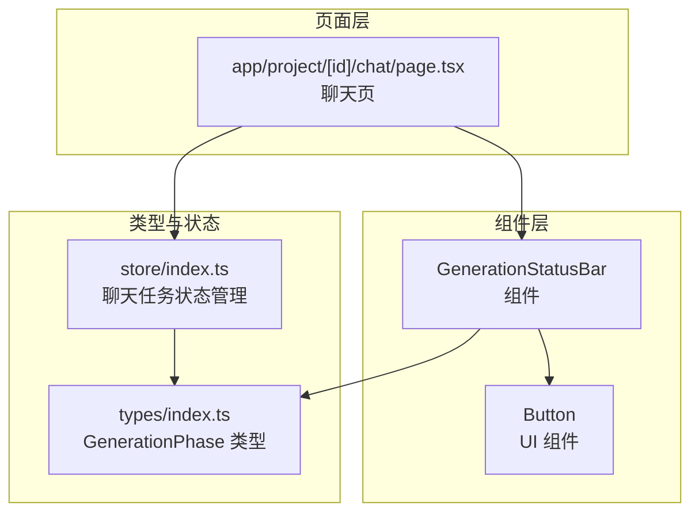
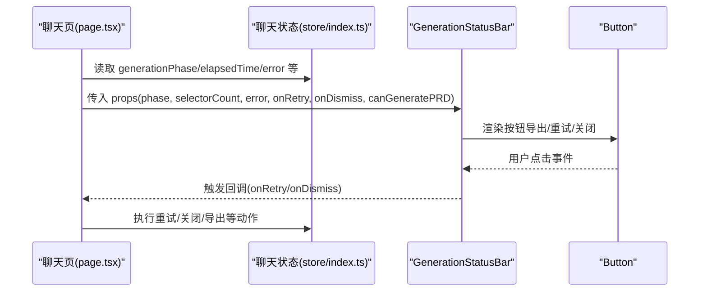
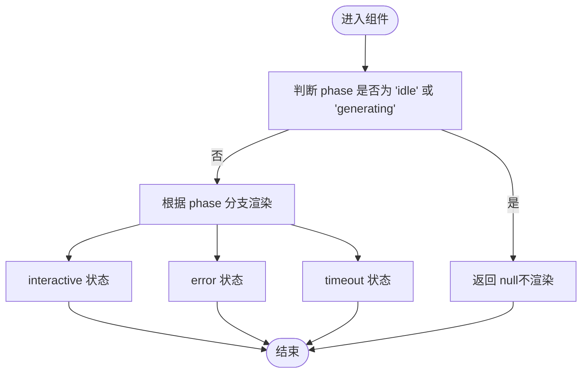
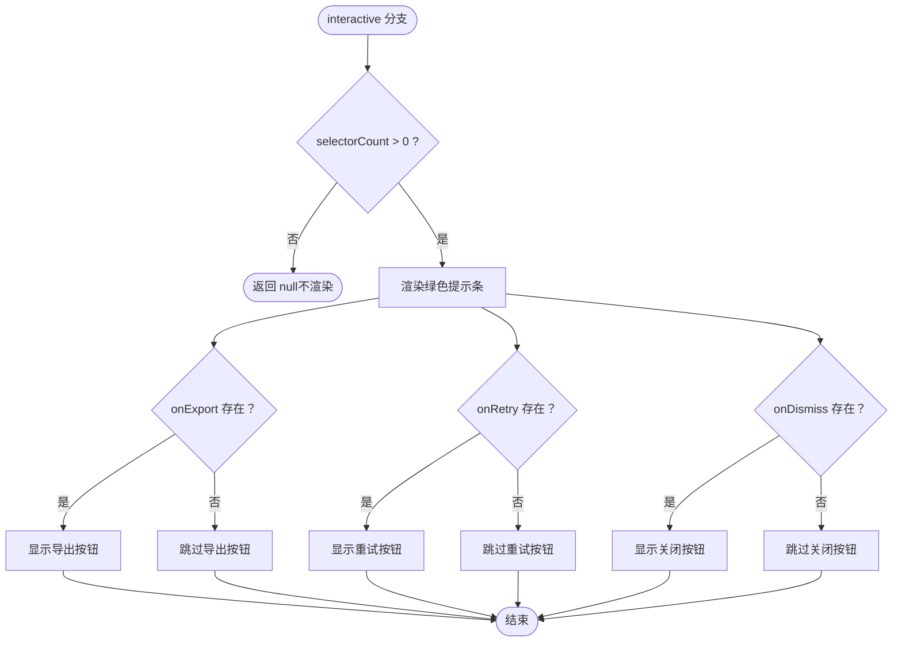
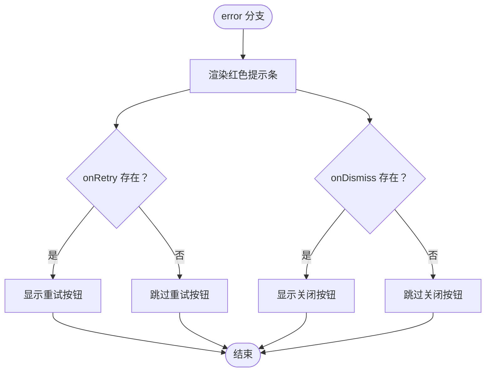
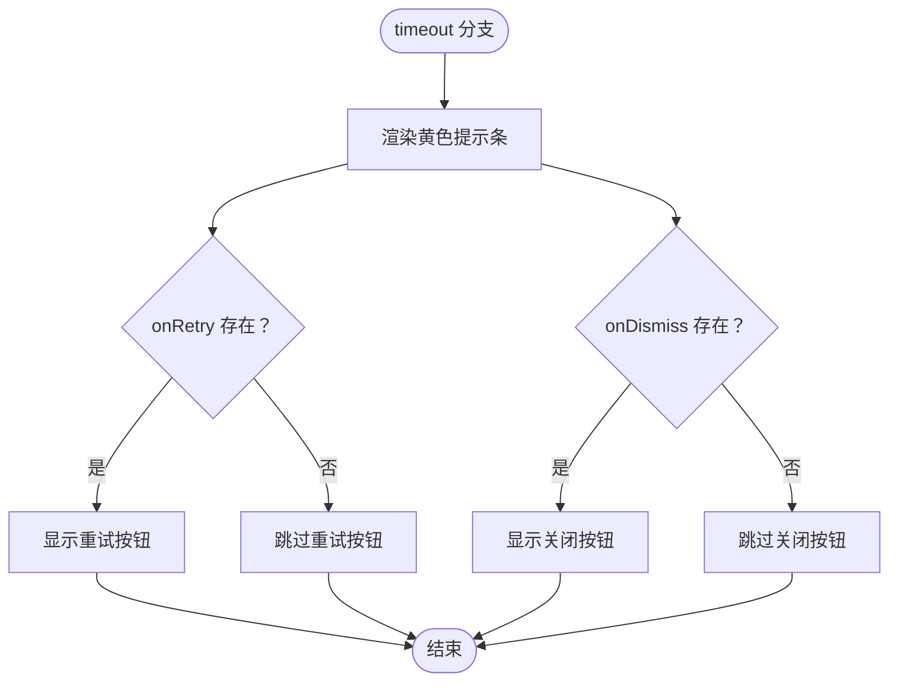
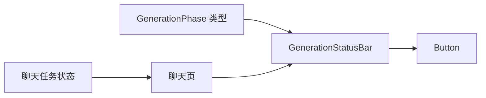

# 生成状态提示条

<cite>
**本文引用的文件**
- [generation-status-bar.tsx](file://prd-generator/src/components/generation-status-bar.tsx)
- [index.ts](file://prd-generator/src/types/index.ts)
- [index.ts](file://prd-generator/src/store/index.ts)
- [page.tsx](file://prd-generator/src/app/project/[id]/chat/page.tsx)
- [button.tsx](file://prd-generator/src/components/ui/button.tsx)
</cite>

## 目录
1. [简介](#简介)
2. [项目结构](#项目结构)
3. [核心组件](#核心组件)
4. [架构总览](#架构总览)
5. [详细组件分析](#详细组件分析)
6. [依赖关系分析](#依赖关系分析)
7. [性能考量](#性能考量)
8. [故障排查指南](#故障排查指南)
9. [结论](#结论)
10. [附录](#附录)

## 简介
本文件围绕 GenerationStatusBar 组件的设计与实现进行系统性说明，重点阐述其根据 GenerationPhase 状态（成功、错误、超时）呈现上下文感知的用户反馈机制。组件遵循“仅在非 idle 与 generating 状态下显示”的条件渲染策略，并针对不同状态提供差异化 UI 表现与交互能力：
- interactive 状态（绿色提示条）：展示已生成问题数量与“可生成 PRD”标签，集成导出、重试、关闭按钮；
- error 状态（红色提示条）：展示错误信息并提供重试与关闭选项；
- timeout 状态（黄色提示条）：提示超时并允许用户重试。

同时，本文将深入解析组件 Props（phase、error、onRetry 等）、canGeneratePRD 标志位的业务含义、按钮回调集成方式、响应式布局（移动端堆叠、桌面端行内）与无障碍设计要点，并总结在父组件中正确使用该状态条的最佳实践。

## 项目结构
GenerationStatusBar 位于组件层，类型定义与状态管理位于类型与状态模块，父页面在聊天页中消费该组件并传递状态与回调。

图表来源
- [generation-status-bar.tsx](file://prd-generator/src/components/generation-status-bar.tsx#L1-L125)
- [index.ts](file://prd-generator/src/types/index.ts#L126-L134)
- [index.ts](file://prd-generator/src/store/index.ts#L301-L317)
- [page.tsx](file://prd-generator/src/app/project/[id]/chat/page.tsx#L660-L673)

章节来源
- [generation-status-bar.tsx](file://prd-generator/src/components/generation-status-bar.tsx#L1-L125)
- [index.ts](file://prd-generator/src/types/index.ts#L126-L134)
- [index.ts](file://prd-generator/src/store/index.ts#L301-L317)
- [page.tsx](file://prd-generator/src/app/project/[id]/chat/page.tsx#L660-L673)

## 核心组件
GenerationStatusBar 是一个纯展示型组件，负责在聊天流程的关键节点向用户提供即时反馈与操作入口。其核心特性包括：
- 条件渲染：仅在 phase 不为 'idle' 且不为 'generating' 时显示；
- 多状态 UI：根据 phase 分别渲染 success（interactive）、error、timeout 三类提示条；
- 交互按钮：根据可用性动态渲染导出、重试、关闭按钮；
- 响应式布局：移动端堆叠、桌面端行内对齐；
- 无障碍友好：按钮具备语义化变体与尺寸，配合图标与文本。

章节来源
- [generation-status-bar.tsx](file://prd-generator/src/components/generation-status-bar.tsx#L1-L125)

## 架构总览
GenerationStatusBar 的使用贯穿“页面 -> 组件 -> UI 控件”的链路，状态由 store 中的聊天任务提供，父页面在渲染时根据当前 generationPhase 与辅助状态决定是否显示与如何传参。

图表来源
- [page.tsx](file://prd-generator/src/app/project/[id]/chat/page.tsx#L660-L673)
- [generation-status-bar.tsx](file://prd-generator/src/components/generation-status-bar.tsx#L1-L125)
- [button.tsx](file://prd-generator/src/components/ui/button.tsx#L1-L61)
- [index.ts](file://prd-generator/src/store/index.ts#L301-L317)

## 详细组件分析

### 组件 Props 与职责
- phase: GenerationPhase，决定渲染哪一类状态条与按钮组合；
- selectorCount?: number，默认 0，用于 interactive 状态下的问题计数展示；
- error?: string | null，错误状态下的错误信息；
- onRetry?: () => void，重试回调；
- onDismiss?: () => void，关闭状态条回调；
- onExport?: () => void，导出回调（在 interactive 状态下有条件渲染）；
- canGeneratePRD?: boolean，默认 false，控制“可生成 PRD”标签的显示。

章节来源
- [generation-status-bar.tsx](file://prd-generator/src/components/generation-status-bar.tsx#L7-L15)

### 条件渲染逻辑
- 仅当 phase 为 'interactive'、'error' 或 'timeout' 时显示组件；
- 当 phase 为 'idle' 或 'generating' 时直接返回空，避免无意义的 UI 占位。

图表来源
- [generation-status-bar.tsx](file://prd-generator/src/components/generation-status-bar.tsx#L26-L30)

章节来源
- [generation-status-bar.tsx](file://prd-generator/src/components/generation-status-bar.tsx#L26-L30)

### 三种状态的 UI 表现与交互

#### interactive 状态（绿色提示条）
- 展示“已生成问题数量 + 可生成 PRD”标签；
- 条件渲染导出、重试、关闭按钮；
- 交互：点击导出会触发 onExport；点击重试触发 onRetry；点击关闭触发 onDismiss。

图表来源
- [generation-status-bar.tsx](file://prd-generator/src/components/generation-status-bar.tsx#L31-L67)

章节来源
- [generation-status-bar.tsx](file://prd-generator/src/components/generation-status-bar.tsx#L31-L67)

#### error 状态（红色提示条）
- 展示“生成失败 + 错误详情（可选）”；
- 渲染重试与关闭按钮；
- 交互：点击重试触发 onRetry；点击关闭触发 onDismiss。

图表来源
- [generation-status-bar.tsx](file://prd-generator/src/components/generation-status-bar.tsx#L69-L94)

章节来源
- [generation-status-bar.tsx](file://prd-generator/src/components/generation-status-bar.tsx#L69-L94)

#### timeout 状态（黄色提示条）
- 展示“生成超时，请重试或稍后再试”；
- 渲染重试与关闭按钮；
- 交互：点击重试触发 onRetry；点击关闭触发 onDismiss。

图表来源
- [generation-status-bar.tsx](file://prd-generator/src/components/generation-status-bar.tsx#L96-L121)

章节来源
- [generation-status-bar.tsx](file://prd-generator/src/components/generation-status-bar.tsx#L96-L121)

### canGeneratePRD 标志位的业务意义
- 该标志位来自问题元数据（QuestionMeta），用于判断当前对话阶段是否满足“可生成 PRD”的前置条件；
- 在 interactive 状态下，当 canGeneratePRD 为真时，组件会在提示条右侧显示“可生成 PRD”标签，作为用户下一步行动的引导；
- 父页面通过 questionMeta?.canGeneratePRD 将该标志位传递给组件。

章节来源
- [index.ts](file://prd-generator/src/types/index.ts#L158-L164)
- [page.tsx](file://prd-generator/src/app/project/[id]/chat/page.tsx#L660-L673)

### 按钮回调集成方式
- 导出（onExport）：仅在 interactive 且 selectorCount > 0 时渲染，点击后触发父页面的导出逻辑；
- 重试（onRetry）：在 error 与 timeout 下均可用，点击后触发父页面的重试逻辑（如重新发起请求或恢复草稿）；
- 关闭（onDismiss）：在 error 与 timeout 下可用，点击后隐藏状态条（父页面通过 showStatusBar 控制）。

章节来源
- [generation-status-bar.tsx](file://prd-generator/src/components/generation-status-bar.tsx#L31-L121)
- [page.tsx](file://prd-generator/src/app/project/[id]/chat/page.tsx#L500-L523)

### 响应式布局与无障碍设计
- 响应式布局：组件采用 flex 堆叠（移动端）与 sm:flex-row 行内（桌面端）的组合，确保在不同屏幕宽度下保持良好可读性与紧凑性；
- 无障碍设计：按钮使用 UI 库提供的语义化变体与尺寸，配合图标与文本，增强可识别性；按钮具备 hover、focus 等状态样式，符合通用无障碍规范。

章节来源
- [generation-status-bar.tsx](file://prd-generator/src/components/generation-status-bar.tsx#L31-L121)
- [button.tsx](file://prd-generator/src/components/ui/button.tsx#L1-L61)

### 在父组件中的正确使用方式
- 传参策略：根据当前 generationPhase 与辅助状态（如 pendingSelectorsFromStore.length、questionMeta?.canGeneratePRD、error）决定是否显示与如何传参；
- 显示控制：父页面通过 showStatusBar 与 generationPhase 的组合条件共同控制状态条的可见性；
- 回调绑定：将 handleRetry、handleDismissStatusBar 等回调函数传递给组件，确保用户操作能驱动状态流转；
- 时机把握：在 interactive 状态下，仅当存在待回答的选择器时才显示状态条，避免空提示带来的困惑。

章节来源
- [page.tsx](file://prd-generator/src/app/project/[id]/chat/page.tsx#L660-L673)
- [index.ts](file://prd-generator/src/store/index.ts#L301-L317)

## 依赖关系分析
- 类型依赖：GenerationPhase 定义于 types/index.ts，GenerationStatusBar 通过类型约束 phase；
- 状态依赖：父页面从 store 中订阅 generationPhase、error、questionMeta 等状态，作为组件 Props 的数据源；
- UI 依赖：Button 组件提供统一的视觉与交互体验，GenerationStatusBar 通过 Button 的 variant/size 控制不同状态下的外观与行为。

图表来源
- [index.ts](file://prd-generator/src/types/index.ts#L126-L134)
- [generation-status-bar.tsx](file://prd-generator/src/components/generation-status-bar.tsx#L1-L125)
- [index.ts](file://prd-generator/src/store/index.ts#L301-L317)
- [page.tsx](file://prd-generator/src/app/project/[id]/chat/page.tsx#L660-L673)

章节来源
- [index.ts](file://prd-generator/src/types/index.ts#L126-L134)
- [generation-status-bar.tsx](file://prd-generator/src/components/generation-status-bar.tsx#L1-L125)
- [index.ts](file://prd-generator/src/store/index.ts#L301-L317)
- [page.tsx](file://prd-generator/src/app/project/[id]/chat/page.tsx#L660-L673)

## 性能考量
- 渲染开销：组件为轻量级纯展示组件，仅在非 idle/generating 状态下渲染，避免了无效 DOM；
- 条件渲染：通过早期 return 与分支判断，减少不必要的子树渲染；
- 事件绑定：按钮回调在父页面集中处理，组件内部仅负责渲染与触发，降低复杂度；
- 响应式：使用 Tailwind 的 sm:flex-row 等类名，避免额外计算，保持布局性能稳定。

[本节为通用指导，无需列出章节来源]

## 故障排查指南
- 状态条不显示
  - 检查 generationPhase 是否为 'idle' 或 'generating'，这两个状态会被组件主动隐藏；
  - 确认父页面的 showStatusBar 与 generationPhase 的组合条件是否满足；
  - 确保 selectorCount 在 interactive 状态下大于 0（否则不会渲染）。
- 交互无效
  - 确认 onRetry/onDismiss/onExport 是否传入有效函数；
  - 检查父页面回调逻辑是否正确执行（如重试时是否重新发起请求或恢复草稿）。
- 错误信息未显示
  - 确认 error 字段是否传入，error 状态下会显示“生成失败 + 错误详情（可选）”。

章节来源
- [generation-status-bar.tsx](file://prd-generator/src/components/generation-status-bar.tsx#L26-L30)
- [page.tsx](file://prd-generator/src/app/project/[id]/chat/page.tsx#L660-L673)

## 结论
GenerationStatusBar 通过简洁的条件渲染与明确的状态分支，为用户在不同生成阶段提供了清晰、及时的反馈与操作入口。其 Props 设计与父页面状态管理紧密耦合，既能保证 UI 的一致性，又能在交互层面提供良好的用户体验。结合响应式布局与无障碍设计，组件在多端环境下均能稳定运行。在实际使用中，建议严格遵循“仅在非 idle/generating 状态下显示”的原则，并在父页面中合理组织状态与回调，以发挥组件的最大价值。

[本节为总结性内容，无需列出章节来源]

## 附录

### GenerationPhase 类型定义
- idle：空闲
- generating：生成中
- rendering：渲染结果
- interactive：可交互
- error：错误
- timeout：超时

章节来源
- [index.ts](file://prd-generator/src/types/index.ts#L126-L134)