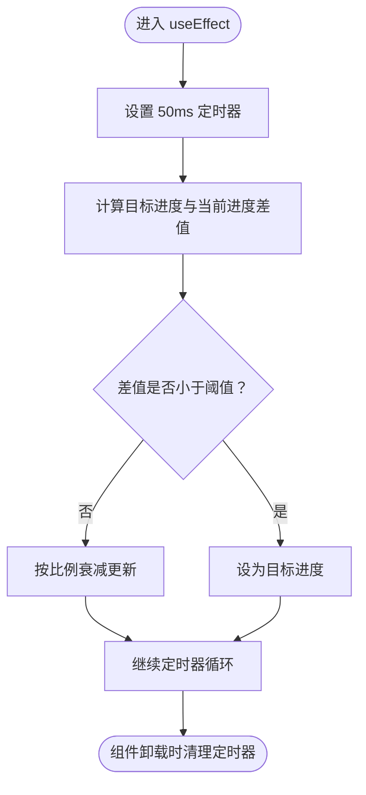

# 生成过程指示器

<cite>
**本文引用的文件**
- [generating-indicator.tsx](file://prd-generator/src/components/generating-indicator.tsx)
- [progress.tsx](file://prd-generator/src/components/ui/progress.tsx)
- [types/index.ts](file://prd-generator/src/types/index.ts)
- [store/index.ts](file://prd-generator/src/store/index.ts)
- [project/[id]/prd/page.tsx](file://prd-generator/src/app/project/[id]/prd/page.tsx)
</cite>

## 目录
1. [简介](#简介)
2. [项目结构](#项目结构)
3. [核心组件](#核心组件)
4. [架构总览](#架构总览)
5. [详细组件分析](#详细组件分析)
6. [依赖关系分析](#依赖关系分析)
7. [性能考量](#性能考量)
8. [故障排查指南](#故障排查指南)
9. [结论](#结论)

## 简介
本文件围绕“生成过程指示器”组件（GeneratingIndicator）进行深入剖析，重点说明其在PRD生成流程中的作用：为用户提供多步骤进度反馈，包括当前所处阶段（需求分析、生成问题、构建表单、校验完成）、步骤图标与标签、颜色状态管理、基于 Radix Progress 的平滑进度动画、预计剩余时间计算、取消生成的回调机制，以及在长时间生成时的用户提示。同时结合 PRD 页面（/project/[id]/prd/page.tsx）中的使用场景，说明其如何提升用户等待体验。

## 项目结构
GeneratingIndicator 位于组件层，依赖 UI 进度条组件与全局状态管理；PRD 页面负责驱动生成流程并传递当前步骤、索引与耗时等 props。

图表来源
- [generating-indicator.tsx](file://prd-generator/src/components/generating-indicator.tsx#L1-L129)
- [progress.tsx](file://prd-generator/src/components/ui/progress.tsx#L1-L32)
- [types/index.ts](file://prd-generator/src/types/index.ts#L124-L157)
- [store/index.ts](file://prd-generator/src/store/index.ts#L560-L853)
- [project/[id]/prd/page.tsx](file://prd-generator/src/app/project/[id]/prd/page.tsx#L1-L792)

章节来源
- [generating-indicator.tsx](file://prd-generator/src/components/generating-indicator.tsx#L1-L129)
- [progress.tsx](file://prd-generator/src/components/ui/progress.tsx#L1-L32)
- [types/index.ts](file://prd-generator/src/types/index.ts#L124-L157)
- [store/index.ts](file://prd-generator/src/store/index.ts#L560-L853)
- [project/[id]/prd/page.tsx](file://prd-generator/src/app/project/[id]/prd/page.tsx#L1-L792)

## 核心组件
- GeneratingIndicator：接收 currentStep、stepIndex、elapsedTime、onCancel、canCancel 等 props，渲染步骤指示器、进度条、耗时与剩余时间提示，并在超时情况下给出用户提示。
- Progress：基于 Radix Progress 实现的进度条，负责动画指示器的位移与过渡。
- 类型与配置：GENERATION_STEPS 定义了四个阶段及对应百分比，用于计算目标进度与剩余时间。
- 状态管理：usePRDGenerationStore 提供生成任务的生命周期管理、耗时更新、取消与持久化能力。

章节来源
- [generating-indicator.tsx](file://prd-generator/src/components/generating-indicator.tsx#L1-L129)
- [progress.tsx](file://prd-generator/src/components/ui/progress.tsx#L1-L32)
- [types/index.ts](file://prd-generator/src/types/index.ts#L124-L157)
- [store/index.ts](file://prd-generator/src/store/index.ts#L560-L853)

## 架构总览
下图展示了 PRD 页面如何驱动生成流程，并将当前生成状态传递给 GeneratingIndicator：

图表来源
- [project/[id]/prd/page.tsx](file://prd-generator/src/app/project/[id]/prd/page.tsx#L200-L311)
- [store/index.ts](file://prd-generator/src/store/index.ts#L569-L727)
- [generating-indicator.tsx](file://prd-generator/src/components/generating-indicator.tsx#L1-L129)

## 详细组件分析

### GeneratingIndicator 组件
- Props 接收
  - currentStep：当前生成阶段（GenerationStep）
  - stepIndex：当前阶段索引（用于定位 GENERATION_STEPS）
  - elapsedTime：已用时间（秒）
  - onCancel：取消生成回调
  - canCancel：是否允许取消（默认 true）

- 步骤指示器渲染逻辑
  - 基于 GENERATION_STEPS 渲染步骤序列，每个步骤包含：
    - 图标：已完成阶段显示对勾，当前阶段显示蓝色边框与文字，未到达阶段显示灰色边框
    - 标签：隐藏小屏时的文本标签
    - 颜色状态：已完成阶段使用强调色，未到达阶段使用浅色
  - 当前步骤配置通过 stepIndex 从 GENERATION_STEPS 中取值，用于确定目标进度百分比

- 进度条动画实现
  - animatedProgress 通过 useEffect + setInterval 平滑过渡到目标进度
  - 目标进度 targetProgress 来自当前步骤配置的 percent 字段
  - 每 50ms 更新一次，采用 0.1 的衰减系数，接近目标值时收敛停止

- 预计剩余时间计算
  - estimatedTotal 固定为 15 秒（用于估算）
  - remainingTime = max(0, estimatedTotal - elapsedTime)，仅在剩余时间大于 0 时显示

- 取消生成回调机制
  - 仅当 canCancel 为真且存在 onCancel 时渲染取消按钮
  - 点击取消按钮触发 onCancel，通常由上层调用 usePRDGenerationStore 的 cancelTask 或 abortAndPersist

- 长时间生成提示
  - 当 elapsedTime > 10 时显示提示语，提醒用户耐心等待或取消重试

- 视觉层次与响应式
  - 头部包含 AI 助手图标与标题
  - 步骤指示器在小屏隐藏标签，在大屏显示标签
  - 底部信息包含当前阶段标签与已用/剩余时间
  - 整体采用渐变背景与边框，适配明暗主题

章节来源
- [generating-indicator.tsx](file://prd-generator/src/components/generating-indicator.tsx#L1-L129)
- [types/index.ts](file://prd-generator/src/types/index.ts#L124-L157)

#### 步骤指示器与颜色状态流程

图表来源
- [generating-indicator.tsx](file://prd-generator/src/components/generating-indicator.tsx#L72-L98)
- [types/index.ts](file://prd-generator/src/types/index.ts#L151-L156)

#### 进度动画实现流程

图表来源
- [generating-indicator.tsx](file://prd-generator/src/components/generating-indicator.tsx#L34-L45)

### Progress 组件
- 基于 Radix Progress 实现，Indicator 通过 transform 实现从右侧向左的填充动画
- 根据传入 value 动态调整进度条宽度，过渡自然

章节来源
- [progress.tsx](file://prd-generator/src/components/ui/progress.tsx#L1-L32)

### 生成步骤配置（GENERATION_STEPS）
- 定义四个阶段：理解需求、生成问题、构建表单、校验完成
- 每个阶段包含 key、label、percent、duration（毫秒）
- 用于计算目标进度与阶段持续时间（注：duration 未在 GeneratingIndicator 中直接使用）

章节来源
- [types/index.ts](file://prd-generator/src/types/index.ts#L124-L157)

### PRD 页面中的使用场景
- PRD 页面通过 usePRDGenerationStore 管理生成任务，维护 elapsedTime 并在生成中每秒更新
- 将当前任务的 phase、streamContent、elapsedTime 等状态传递给 PRD 区域，用于流式内容与生成中提示
- 生成过程指示器（GeneratingIndicator）在 PRD 区域内显示，接收 currentStep、stepIndex、elapsedTime 等 props，帮助用户感知生成进度与阶段

章节来源
- [project/[id]/prd/page.tsx](file://prd-generator/src/app/project/[id]/prd/page.tsx#L147-L167)
- [project/[id]/prd/page.tsx](file://prd-generator/src/app/project/[id]/prd/page.tsx#L698-L741)

## 依赖关系分析
- GeneratingIndicator 依赖：
  - UI 进度条组件 Progress（Radix）
  - 类型与配置 GENERATION_STEPS
  - 上层传入的 props（currentStep、stepIndex、elapsedTime、onCancel、canCancel）
- PRD 页面依赖：
  - usePRDGenerationStore 提供 startTask、appendTaskContent、completeTask、errorTask、updateElapsedTime、clearTask、restoreTask、abortAndPersist 等方法
  - 将任务状态与耗时传递给 PRD 区域与 GeneratingIndicator

图表来源
- [project/[id]/prd/page.tsx](file://prd-generator/src/app/project/[id]/prd/page.tsx#L1-L792)
- [store/index.ts](file://prd-generator/src/store/index.ts#L560-L853)
- [generating-indicator.tsx](file://prd-generator/src/components/generating-indicator.tsx#L1-L129)
- [progress.tsx](file://prd-generator/src/components/ui/progress.tsx#L1-L32)
- [types/index.ts](file://prd-generator/src/types/index.ts#L124-L157)

## 性能考量
- 动画平滑性：useEffect + setInterval 的 50ms 更新周期与 0.1 衰减系数在大多数设备上表现良好；若出现卡顿，可考虑降低更新频率或使用 requestAnimationFrame 替代。
- 计算复杂度：步骤指示器为线性渲染，时间复杂度 O(n)，n 为步骤数（固定为 4），空间复杂度 O(n)。
- 进度条渲染：Progress 组件通过 transform 控制 Indicator 位置，避免重排，性能稳定。
- 状态更新：PRD 页面每秒更新 elapsedTime，避免频繁重渲染；GeneratingIndicator 仅在 targetProgress 变化时启动动画，减少无效更新。

## 故障排查指南
- 取消按钮不可见
  - 检查 canCancel 是否为 true 且传入 onCancel
  - 确认上层调用 usePRDGenerationStore 的 cancelTask 或 abortAndPersist 是否正确绑定
- 进度条不动
  - 检查 stepIndex 是否有效，确保 GENERATION_STEPS 存在对应配置
  - 确认 targetProgress 是否随 stepIndex 变化
- 剩余时间不显示
  - 确认 elapsedTime 是否递增（PRD 页面每秒更新）
  - 确认 estimatedTotal 是否合理
- 长时间提示未出现
  - 检查 elapsedTime 是否超过阈值（10 秒）
- 生成中断或错误
  - 检查 usePRDGenerationStore 的 errorTask 与 abortAndPersist 是否正确持久化与恢复
  - 确认 PRD 页面捕获 AbortError 并提示用户

章节来源
- [generating-indicator.tsx](file://prd-generator/src/components/generating-indicator.tsx#L30-L45)
- [generating-indicator.tsx](file://prd-generator/src/components/generating-indicator.tsx#L120-L126)
- [store/index.ts](file://prd-generator/src/store/index.ts#L697-L727)
- [store/index.ts](file://prd-generator/src/store/index.ts#L820-L853)
- [project/[id]/prd/page.tsx](file://prd-generator/src/app/project/[id]/prd/page.tsx#L298-L311)

## 结论
GeneratingIndicator 通过步骤指示器、平滑进度动画、剩余时间估算与取消机制，显著提升了 PRD 生成过程中的用户体验。配合 PRD 页面的状态管理与流式内容渲染，用户能够清晰感知生成阶段与进度，及时采取取消或重试操作，从而获得更可控、更透明的生成体验。建议在后续迭代中：
- 将 estimatedTotal 与 GENERATION_STEPS 的 duration 结合，动态计算更准确的剩余时间
- 优化动画策略，减少不必要的定时器开销
- 增强错误与中断的可视化提示，提升可发现性