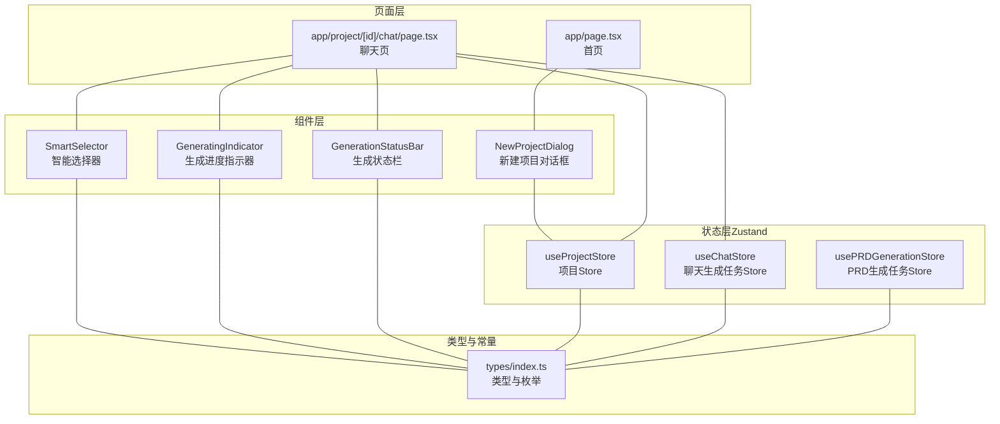
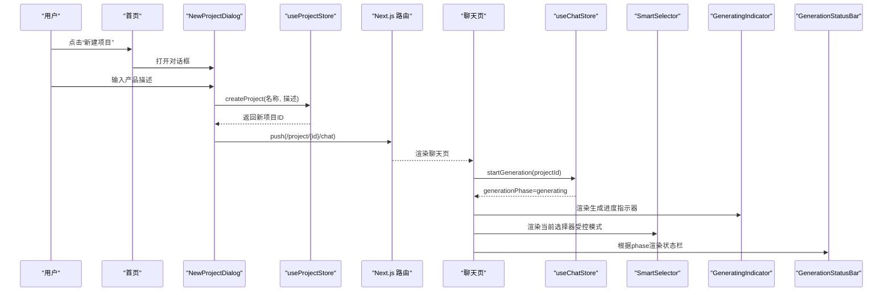
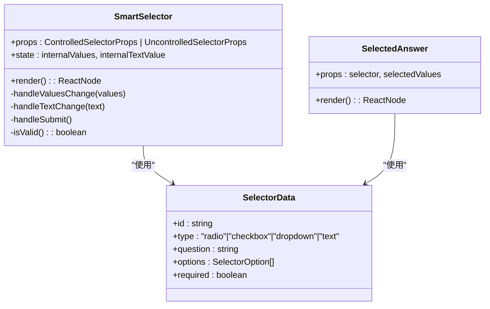
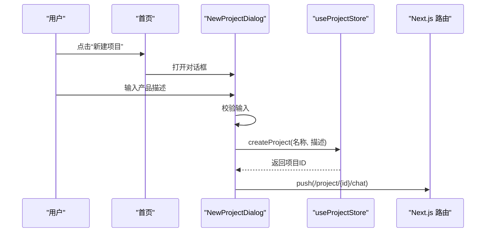
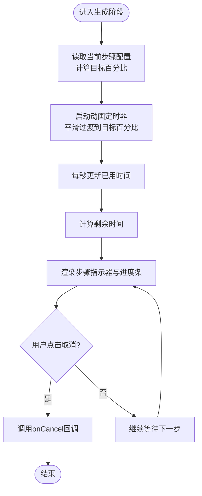
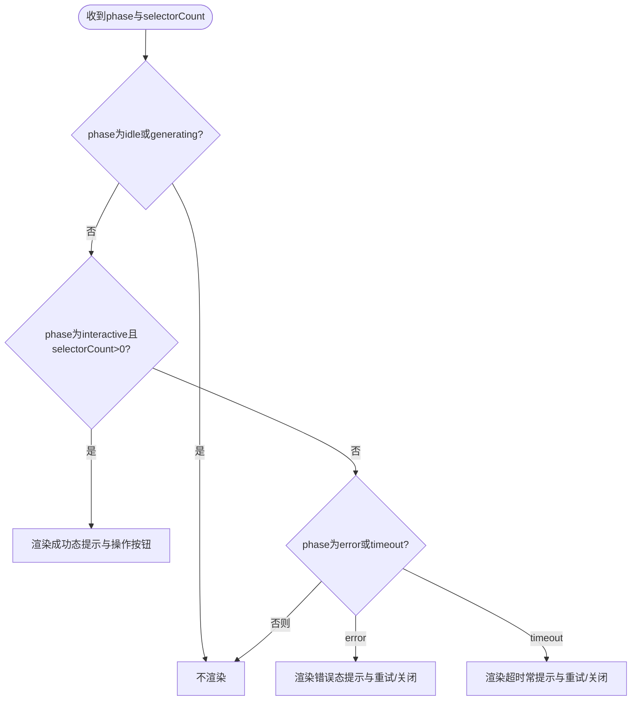
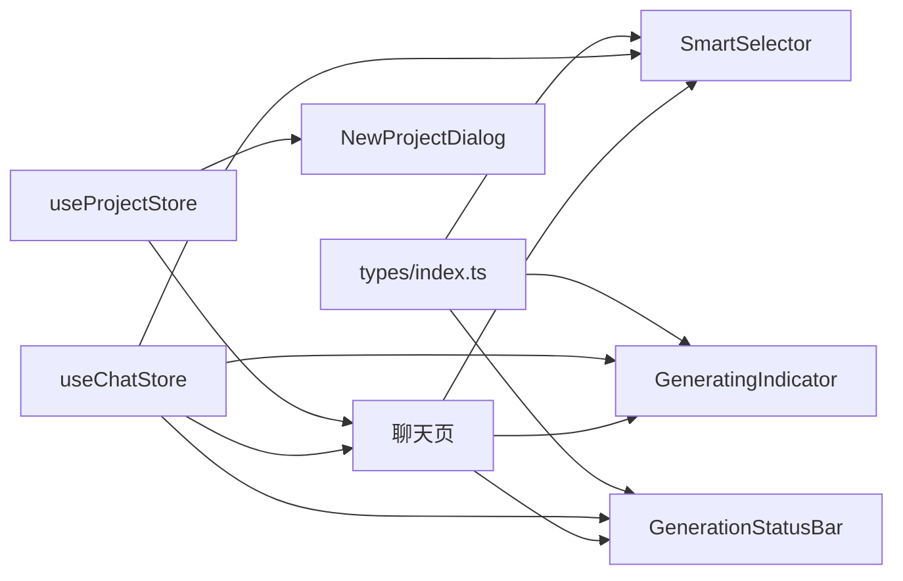

# 自定义业务组件

<cite>
**本文引用的文件**
- [smart-selector.tsx](file://prd-generator/src/components/smart-selector.tsx)
- [new-project-dialog.tsx](file://prd-generator/src/components/new-project-dialog.tsx)
- [generating-indicator.tsx](file://prd-generator/src/components/generating-indicator.tsx)
- [generation-status-bar.tsx](file://prd-generator/src/components/generation-status-bar.tsx)
- [index.ts（store）](file://prd-generator/src/store/index.ts)
- [index.ts（types）](file://prd-generator/src/types/index.ts)
- [page.tsx（聊天页）](file://prd-generator/src/app/project/[id]/chat/page.tsx)
- [page.tsx（首页）](file://prd-generator/src/app/page.tsx)
</cite>

## 目录
1. [引言](#引言)
2. [项目结构](#项目结构)
3. [核心组件](#核心组件)
4. [架构总览](#架构总览)
5. [详细组件分析](#详细组件分析)
6. [依赖关系分析](#依赖关系分析)
7. [性能考量](#性能考量)
8. [故障排查指南](#故障排查指南)
9. [结论](#结论)

## 引言
本文件围绕项目中的四大核心业务组件进行系统性解析，目标包括：
- SmartSelector：根据AI返回的JSON结构动态渲染不同类型的交互控件（单选、多选、下拉、文本输入），支持受控与非受控两种模式，处理用户选择逻辑并提供实时反馈。
- NewProjectDialog：作为项目创建入口，集成表单输入、状态管理与路由跳转，处理用户产品描述输入并触发项目创建流程。
- GeneratingIndicator：在PRD生成过程中展示多步骤进度动画、预计耗时及取消操作，提供流畅的等待体验。
- GenerationStatusBar：根据不同生成阶段（成功、错误、超时）显示状态提示条，集成重试、导出、关闭等功能按钮，实现上下文感知的用户反馈机制。

文档将从架构、数据流、处理逻辑、与Zustand Store的交互、Props接口、状态流转、实际调用场景与最佳实践等维度展开，并辅以可视化图表帮助理解。

## 项目结构
四大组件位于组件目录，配合Zustand Store与类型定义共同工作；页面层通过订阅Store状态驱动UI渲染与交互。

**图表来源**
- [smart-selector.tsx](file://prd-generator/src/components/smart-selector.tsx#L1-L255)
- [new-project-dialog.tsx](file://prd-generator/src/components/new-project-dialog.tsx#L1-L107)
- [generating-indicator.tsx](file://prd-generator/src/components/generating-indicator.tsx#L1-L130)
- [generation-status-bar.tsx](file://prd-generator/src/components/generation-status-bar.tsx#L1-L125)
- [index.ts（store）](file://prd-generator/src/store/index.ts#L1-L208)
- [index.ts（types）](file://prd-generator/src/types/index.ts#L1-L243)
- [page.tsx（聊天页）](file://prd-generator/src/app/project/[id]/chat/page.tsx#L1-L200)
- [page.tsx（首页）](file://prd-generator/src/app/page.tsx#L1-L109)

**章节来源**
- [index.ts（store）](file://prd-generator/src/store/index.ts#L1-L208)
- [index.ts（types）](file://prd-generator/src/types/index.ts#L1-L243)
- [page.tsx（聊天页）](file://prd-generator/src/app/project/[id]/chat/page.tsx#L1-L200)
- [page.tsx（首页）](file://prd-generator/src/app/page.tsx#L1-L109)

## 核心组件
本节对四大组件进行高阶概览，后续章节将逐个深入。

- SmartSelector：根据SelectorData动态渲染多种控件，支持受控/非受控模式，内部维护选择状态并在提交时提供校验与反馈。
- NewProjectDialog：负责收集用户输入的产品描述，调用项目Store创建项目并跳转至聊天页。
- GeneratingIndicator：展示生成阶段步骤、进度动画、已用/剩余时间以及取消按钮，提升等待体验。
- GenerationStatusBar：在交互、错误、超时等阶段显示上下文提示与操作按钮，便于用户继续流程或重试。

**章节来源**
- [smart-selector.tsx](file://prd-generator/src/components/smart-selector.tsx#L1-L255)
- [new-project-dialog.tsx](file://prd-generator/src/components/new-project-dialog.tsx#L1-L107)
- [generating-indicator.tsx](file://prd-generator/src/components/generating-indicator.tsx#L1-L130)
- [generation-status-bar.tsx](file://prd-generator/src/components/generation-status-bar.tsx#L1-L125)

## 架构总览
组件与Store之间的交互遵循“页面订阅状态、组件触发动作、Store更新状态”的模式。聊天页作为中枢，同时消费项目Store与聊天生成任务Store，驱动SmartSelector、GeneratingIndicator与GenerationStatusBar的渲染与行为。

**图表来源**
- [new-project-dialog.tsx](file://prd-generator/src/components/new-project-dialog.tsx#L1-L107)
- [index.ts（store）](file://prd-generator/src/store/index.ts#L319-L377)
- [page.tsx（聊天页）](file://prd-generator/src/app/project/[id]/chat/page.tsx#L650-L762)
- [smart-selector.tsx](file://prd-generator/src/components/smart-selector.tsx#L1-L255)
- [generating-indicator.tsx](file://prd-generator/src/components/generating-indicator.tsx#L1-L130)
- [generation-status-bar.tsx](file://prd-generator/src/components/generation-status-bar.tsx#L1-L125)

## 详细组件分析

### SmartSelector 组件
- 功能概述
  - 根据SelectorData的type字段动态渲染单选、多选、下拉、文本输入控件。
  - 支持受控与非受控两种模式：受控模式通过value/onChange由父组件统一管理；非受控模式通过onSubmit回调提交。
  - 提供必填校验与提交按钮（非受控模式），并在受控模式下显示“已选择”提示。
  - 文本输入支持“建议选项”按钮快速填充。
- Props接口
  - 受控模式：selector、value(string[])、onChange((values)=>void)、disabled(boolean)、showSubmitButton=false
  - 非受控模式：selector、onSubmit((values)=>void)、disabled(boolean)、showSubmitButton=true、value/onChange不可用
  - 通用：selector（包含id、type、question、options、required）
- 状态与逻辑
  - 内部状态：非受控模式下维护internalValues与internalTextValue。
  - 值变更：根据模式调用props.onChange或更新内部状态。
  - 提交：非受控模式在点击确认按钮时调用onSubmit；受控模式不显示单独提交按钮。
  - 校验：当selector.required为true时，文本类型需非空，其他类型需至少选择一项。
  - 已选展示：受控模式且存在已选值时显示“已选择”提示。
- 与Zustand Store交互
  - 在聊天页中以受控模式使用：value来自selectionsMap，onChange通过handleSelectorChange更新。
  - 与聊天Store协同：通过setPendingSelectors与completeGeneration等方法控制生成阶段与选择器集合。
- 实际调用场景
  - 聊天页在generationPhase为interactive时渲染当前选择器列表，统一提交按钮触发handleSubmitAll。
- 最佳实践
  - 推荐使用受控模式统一管理多个选择器的提交，便于批量校验与状态同步。
  - 文本输入建议提供options作为“建议选项”，提升用户体验。
  - 对必填项及时校验并给出明确提示。

**图表来源**
- [smart-selector.tsx](file://prd-generator/src/components/smart-selector.tsx#L1-L255)
- [index.ts（types）](file://prd-generator/src/types/index.ts#L16-L23)

**章节来源**
- [smart-selector.tsx](file://prd-generator/src/components/smart-selector.tsx#L1-L255)
- [page.tsx（聊天页）](file://prd-generator/src/app/project/[id]/chat/page.tsx#L675-L712)

### NewProjectDialog 组件
- 功能概述
  - 作为项目创建入口，收集用户输入的产品描述，调用项目Store创建项目，并跳转到聊天页。
  - 包含基础表单校验与Toast反馈。
- Props接口
  - 无显式外部Props，内部持有open、input、isLoading状态。
- 状态与逻辑
  - 打开/关闭：通过Dialog的open/onOpenChange控制。
  - 输入校验：若输入为空，弹出错误提示并阻止提交。
  - 创建流程：提取项目名称（取首句或前20字符），调用createProject(name, input.trim())。
  - 路由跳转：创建成功后清空输入并push到/chat路径。
- 与Zustand Store交互
  - 依赖useProjectStore的createProject方法。
- 实际调用场景
  - 首页顶部导航栏中直接触发，或空白页引导处触发。
- 最佳实践
  - 对空输入进行即时校验与提示，提升可用性。
  - 创建成功后立即跳转，减少用户等待与操作成本。

**图表来源**
- [new-project-dialog.tsx](file://prd-generator/src/components/new-project-dialog.tsx#L1-L107)
- [page.tsx（首页）](file://prd-generator/src/app/page.tsx#L1-L109)
- [index.ts（store）](file://prd-generator/src/store/index.ts#L62-L83)

**章节来源**
- [new-project-dialog.tsx](file://prd-generator/src/components/new-project-dialog.tsx#L1-L107)
- [page.tsx（首页）](file://prd-generator/src/app/page.tsx#L1-L109)
- [index.ts（store）](file://prd-generator/src/store/index.ts#L62-L83)

### GeneratingIndicator 组件
- 功能概述
  - 展示生成阶段步骤（理解需求、生成问题、构建表单、校验完成），并以动画进度条呈现当前步骤百分比。
  - 显示已用时间与预估剩余时间，提供取消按钮（可配置）。
- Props接口
  - currentStep: GenerationStep
  - stepIndex: number
  - elapsedTime: number
  - onCancel?: () => void
  - canCancel?: boolean
- 状态与逻辑
  - 动画进度：基于目标百分比计算平滑过渡动画，避免进度条突变。
  - 预估剩余：固定预估总时长15秒，根据已用时间计算剩余时间。
  - 步骤指示：按索引高亮当前步骤，已完成步骤显示完成态。
  - 提示信息：超过一定阈值（如10秒）显示“耐心等待”提示。
- 与Zustand Store交互
  - 聊天页在generationPhase为generating时渲染该组件，并周期性更新elapsedTime与stepIndex。
- 实际调用场景
  - 聊天页生成阶段显示，用户可取消生成并重试。
- 最佳实践
  - 保持预估总时长与实际一致，避免误导用户。
  - 取消按钮仅在canCancel为true时显示，防止误操作。

**图表来源**
- [generating-indicator.tsx](file://prd-generator/src/components/generating-indicator.tsx#L1-L130)
- [index.ts（types）](file://prd-generator/src/types/index.ts#L142-L156)
- [page.tsx（聊天页）](file://prd-generator/src/app/project/[id]/chat/page.tsx#L647-L661)

**章节来源**
- [generating-indicator.tsx](file://prd-generator/src/components/generating-indicator.tsx#L1-L130)
- [page.tsx（聊天页）](file://prd-generator/src/app/project/[id]/chat/page.tsx#L647-L661)

### GenerationStatusBar 组件
- 功能概述
  - 根据生成阶段显示不同状态提示与操作按钮：
    - interactive且存在待回答选择器：显示“问题已生成，请依次回答”，并提供导出与重试、关闭按钮。
    - error：显示错误原因，提供重试与关闭按钮。
    - timeout：提示超时，提供重试与关闭按钮。
  - idle/generating阶段不渲染。
- Props接口
  - phase: GenerationPhase
  - selectorCount?: number
  - error?: string | null
  - onRetry?: () => void
  - onDismiss?: () => void
  - onExport?: () => void
  - canGeneratePRD?: boolean
- 状态与逻辑
  - 条件渲染：仅在非idle与非generating时显示。
  - 成功态：当selectorCount>0时显示交互提示，并根据canGeneratePRD显示“可生成PRD”徽标。
  - 错误态与超时常态：分别渲染对应图标与文案，并提供重试与关闭按钮。
- 与Zustand Store交互
  - 聊天页根据chatTask的generationPhase与pendingSelectors等状态决定是否显示与如何渲染。
- 实际调用场景
  - 生成完成后或出现错误/超时时，向用户提供明确的操作指引。
- 最佳实践
  - 错误信息尽量简洁明确，必要时附带重试与关闭操作，避免用户困惑。

**图表来源**
- [generation-status-bar.tsx](file://prd-generator/src/components/generation-status-bar.tsx#L1-L125)
- [page.tsx（聊天页）](file://prd-generator/src/app/project/[id]/chat/page.tsx#L663-L673)

**章节来源**
- [generation-status-bar.tsx](file://prd-generator/src/components/generation-status-bar.tsx#L1-L125)
- [page.tsx（聊天页）](file://prd-generator/src/app/project/[id]/chat/page.tsx#L663-L673)

## 依赖关系分析
- 类型与常量
  - SelectorData、GenerationPhase、GenerationStep、GENERATION_STEPS等类型与枚举由types/index.ts提供，被组件与Store广泛使用。
- Store与组件耦合
  - SmartSelector在聊天页以受控模式使用，依赖selectionsMap与handleSelectorChange等上下文。
  - GeneratingIndicator与GenerationStatusBar依赖聊天Store提供的generationPhase、currentStep、stepIndex、elapsedTime、pendingSelectors等状态。
  - NewProjectDialog依赖项目Store的createProject方法。
- 页面与组件协作
  - 聊天页在生成阶段渲染GeneratingIndicator与SelectorSkeleton，在交互阶段渲染GenerationStatusBar与SmartSelector。
  - 首页通过NewProjectDialog触发项目创建流程。

**图表来源**
- [index.ts（types）](file://prd-generator/src/types/index.ts#L1-L243)
- [smart-selector.tsx](file://prd-generator/src/components/smart-selector.tsx#L1-L255)
- [generating-indicator.tsx](file://prd-generator/src/components/generating-indicator.tsx#L1-L130)
- [generation-status-bar.tsx](file://prd-generator/src/components/generation-status-bar.tsx#L1-L125)
- [index.ts（store）](file://prd-generator/src/store/index.ts#L319-L530)
- [page.tsx（聊天页）](file://prd-generator/src/app/project/[id]/chat/page.tsx#L647-L712)
- [page.tsx（首页）](file://prd-generator/src/app/page.tsx#L1-L109)

**章节来源**
- [index.ts（types）](file://prd-generator/src/types/index.ts#L1-L243)
- [index.ts（store）](file://prd-generator/src/store/index.ts#L319-L530)
- [page.tsx（聊天页）](file://prd-generator/src/app/project/[id]/chat/page.tsx#L647-L712)

## 性能考量
- SmartSelector
  - 受控模式下避免重复渲染：通过统一value/onChange减少子组件重渲染次数。
  - 文本输入建议选项：通过按钮快速填充，降低用户输入成本。
- GeneratingIndicator
  - 动画进度采用定时器平滑过渡，避免频繁重绘导致卡顿。
  - 预估剩余时间固定计算，避免复杂运算。
- GenerationStatusBar
  - 条件渲染：仅在非idle与非generating时显示，减少不必要DOM节点。
- Store层面
  - Chat Store按projectId隔离任务，避免全局状态风暴。
  - PRD生成Store使用chunks数组拼接流式内容，减少字符串拼接开销。

[本节为通用性能讨论，无需具体文件引用]

## 故障排查指南
- NewProjectDialog
  - 现象：点击“开始”无反应
  - 排查：确认输入非空；检查createProject调用是否抛错；查看路由跳转是否执行。
- SmartSelector
  - 现象：受控模式无法提交
  - 排查：确认父组件传入value与onChange；检查selectionsMap是否正确更新；确认isStreaming未禁用。
  - 现象：必填项校验不生效
  - 排查：确认selector.required为true；文本类型需非空；多选/下拉需至少一项。
- GeneratingIndicator
  - 现象：进度条不动
  - 排查：确认generationPhase为generating；elapsedTime是否递增；stepIndex是否推进。
  - 现象：剩余时间异常
  - 排查：确认elapsedTime计算逻辑；预估总时长是否合理。
- GenerationStatusBar
  - 现象：状态栏不显示
  - 排查：确认phase不是idle/generating；interactive时selectorCount>0；error/timeout时相应分支是否触发。
- Store相关
  - 现象：聊天页状态不更新
  - 排查：确认useChatStore订阅的projectId正确；startGeneration/advanceStep/updateElapsedTime等方法是否被调用；任务是否被clear或reset。

**章节来源**
- [new-project-dialog.tsx](file://prd-generator/src/components/new-project-dialog.tsx#L1-L107)
- [smart-selector.tsx](file://prd-generator/src/components/smart-selector.tsx#L1-L255)
- [generating-indicator.tsx](file://prd-generator/src/components/generating-indicator.tsx#L1-L130)
- [generation-status-bar.tsx](file://prd-generator/src/components/generation-status-bar.tsx#L1-L125)
- [index.ts（store）](file://prd-generator/src/store/index.ts#L319-L530)
- [page.tsx（聊天页）](file://prd-generator/src/app/project/[id]/chat/page.tsx#L647-L712)

## 结论
四大组件围绕“智能选择器、项目创建、生成进度与状态反馈”形成完整闭环：SmartSelector负责交互与数据收集，NewProjectDialog负责入口与初始化，GeneratingIndicator与GenerationStatusBar负责过程与结果反馈。它们通过Zustand Store实现清晰的状态分离与高效的数据流，既满足复杂业务场景，又保持良好的可维护性与扩展性。建议在实际使用中优先采用受控模式统一管理选择器状态，并结合Store的生命周期方法实现稳定的生成流程。