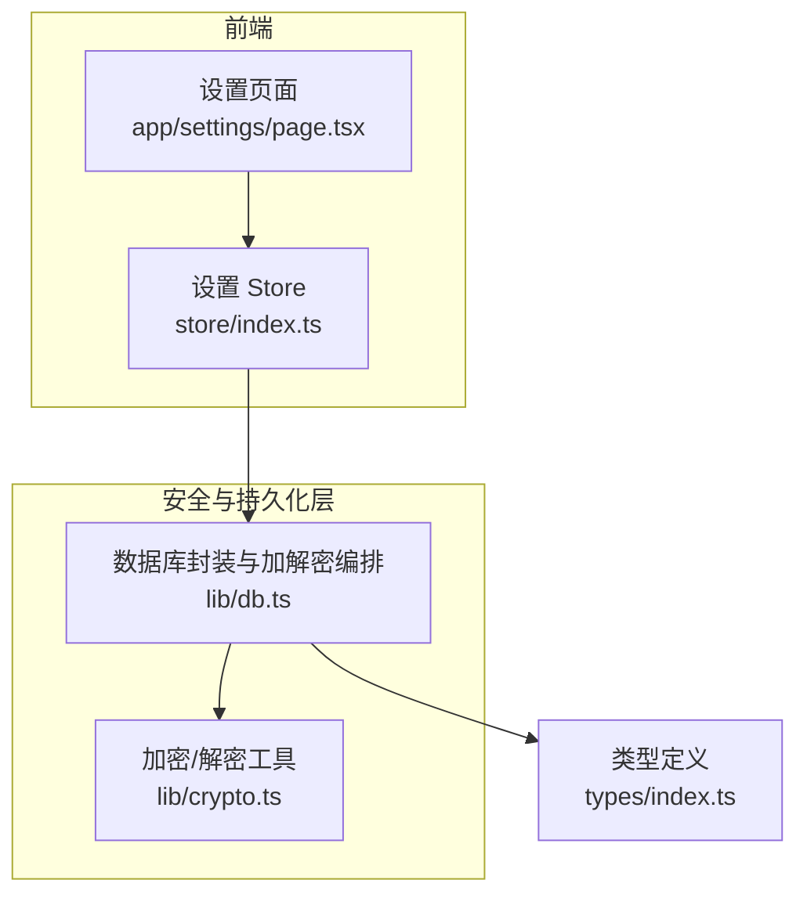
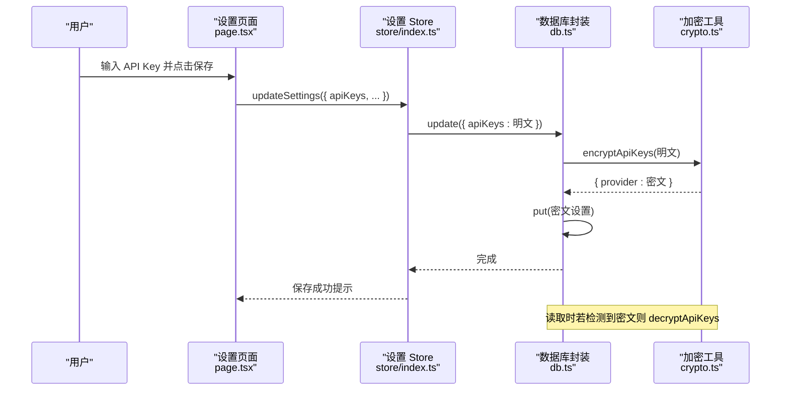
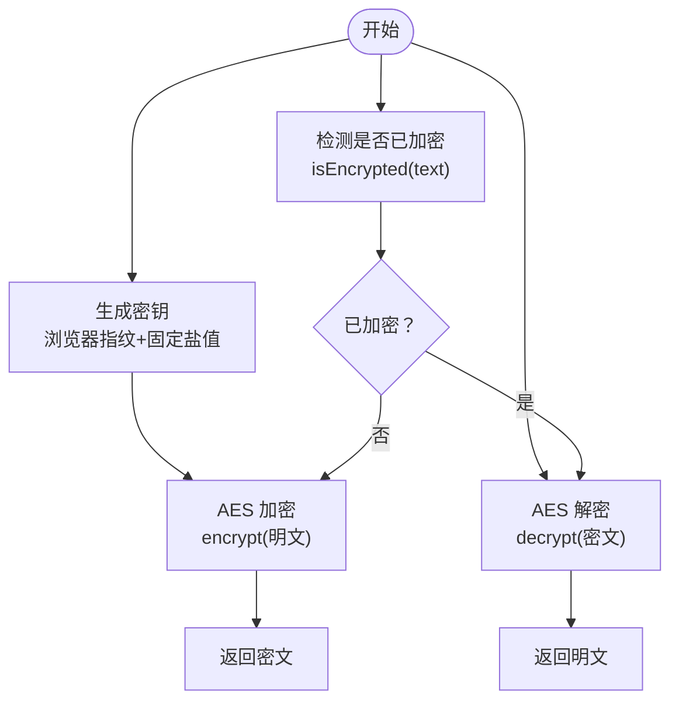
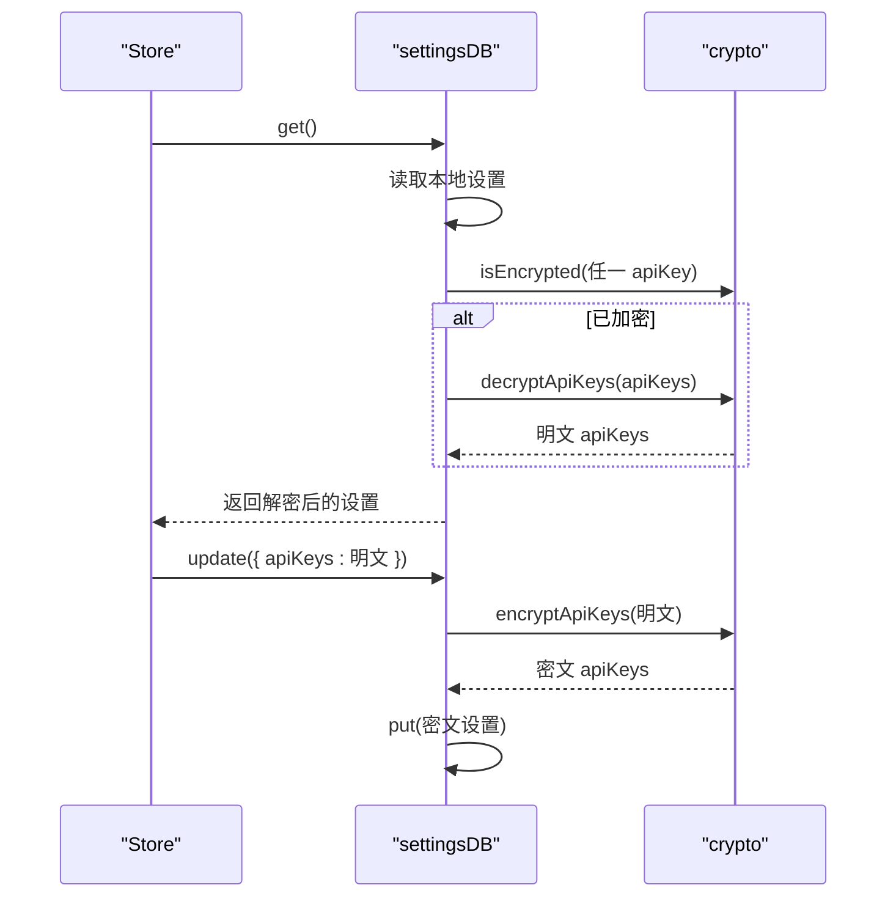
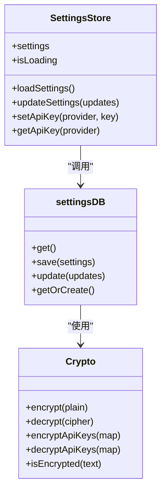
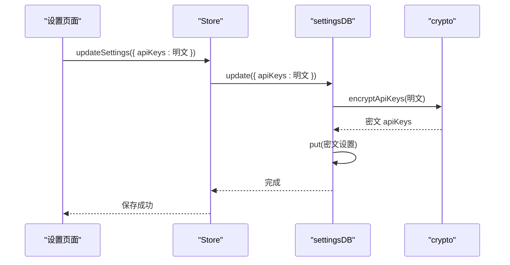
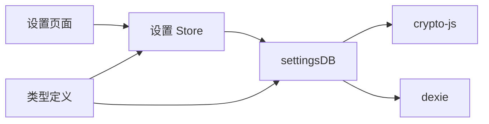

# 安全与加密

<cite>
**本文引用的文件**
- [crypto.ts](file://prd-generator/src/lib/crypto.ts)
- [db.ts](file://prd-generator/src/lib/db.ts)
- [index.ts](file://prd-generator/src/store/index.ts)
- [page.tsx](file://prd-generator/src/app/settings/page.tsx)
- [index.ts](file://prd-generator/src/types/index.ts)
</cite>

## 目录
1. [简介](#简介)
2. [项目结构](#项目结构)
3. [核心组件](#核心组件)
4. [架构总览](#架构总览)
5. [详细组件分析](#详细组件分析)
6. [依赖关系分析](#依赖关系分析)
7. [性能考量](#性能考量)
8. [故障排查指南](#故障排查指南)
9. [结论](#结论)

## 简介
本文件聚焦于应用的安全与加密机制，重点说明如何通过 crypto-js 对用户的 AI 服务 API Key 进行加密，防止其以明文形式存储在浏览器本地数据库中。文档将系统性解析加密与解密函数的实现、在设置页面保存与从 store 中读取 API Key 的调用时机，并阐述该设计如何构成应用安全的关键一环。

## 项目结构
围绕“安全与加密”的关键路径如下：
- 加密/解密逻辑：lib/crypto.ts
- 数据持久化与加解密编排：lib/db.ts
- 设置页面与 store：app/settings/page.tsx、store/index.ts
- 类型定义：types/index.ts

图表来源
- [page.tsx](file://prd-generator/src/app/settings/page.tsx#L1-L304)
- [index.ts](file://prd-generator/src/store/index.ts#L210-L257)
- [db.ts](file://prd-generator/src/lib/db.ts#L1-L210)
- [crypto.ts](file://prd-generator/src/lib/crypto.ts#L1-L107)
- [index.ts](file://prd-generator/src/types/index.ts#L75-L93)

章节来源
- [page.tsx](file://prd-generator/src/app/settings/page.tsx#L1-L304)
- [index.ts](file://prd-generator/src/store/index.ts#L210-L257)
- [db.ts](file://prd-generator/src/lib/db.ts#L1-L210)
- [crypto.ts](file://prd-generator/src/lib/crypto.ts#L1-L107)
- [index.ts](file://prd-generator/src/types/index.ts#L75-L93)

## 核心组件
- 加密/解密工具：提供基于浏览器指纹的对称加密密钥生成、AES 加密/解密、API Key 对象批量加解密、以及简单的“是否已加密”检测。
- 数据库封装：在读取/写入设置时自动执行 API Key 的加/解密，保证本地存储始终为密文。
- 设置 Store：负责加载设置、更新设置、按提供商设置/获取 API Key；与数据库封装配合完成端到端的加解密流程。
- 设置页面：用户输入 API Key 的界面，保存时将明文传递给 Store，再由 Store 通过数据库封装进行加密存储。

章节来源
- [crypto.ts](file://prd-generator/src/lib/crypto.ts#L1-L107)
- [db.ts](file://prd-generator/src/lib/db.ts#L74-L137)
- [index.ts](file://prd-generator/src/store/index.ts#L210-L257)
- [page.tsx](file://prd-generator/src/app/settings/page.tsx#L1-L304)

## 架构总览
下图展示了“设置页面—Store—数据库封装—加密工具”的完整调用链路，以及 API Key 在各环节的形态变化。

图表来源
- [page.tsx](file://prd-generator/src/app/settings/page.tsx#L45-L62)
- [index.ts](file://prd-generator/src/store/index.ts#L236-L242)
- [db.ts](file://prd-generator/src/lib/db.ts#L90-L119)
- [crypto.ts](file://prd-generator/src/lib/crypto.ts#L73-L96)

## 详细组件分析

### 加密/解密工具（lib/crypto.ts）
- 密钥生成策略
  - 在浏览器环境，结合用户代理、语言、颜色深度、时区偏移等特征与固定盐值，经哈希生成固定长度的对称密钥。
  - 在非浏览器环境（如服务端或无窗口环境），直接使用固定盐值作为密钥。
- 加密函数
  - 接收明文字符串，使用生成的密钥进行 AES 加密，返回密文字符串。
  - 对空输入返回空字符串；异常时记录错误并返回空字符串。
- 解密函数
  - 接收密文字符串，使用相同密钥进行 AES 解密，返回明文字符串。
  - 对空输入返回空字符串；异常时记录错误并返回空字符串。
- API Key 对象加/解密
  - 遍历对象键值对，仅对存在值的键进行加密/解密，返回新对象。
- “是否已加密”检测
  - 基于 CryptoJS 输出的特征前缀进行简单判断，用于读取时决定是否需要解密。

图表来源
- [crypto.ts](file://prd-generator/src/lib/crypto.ts#L12-L29)
- [crypto.ts](file://prd-generator/src/lib/crypto.ts#L36-L66)
- [crypto.ts](file://prd-generator/src/lib/crypto.ts#L73-L96)
- [crypto.ts](file://prd-generator/src/lib/crypto.ts#L102-L106)

章节来源
- [crypto.ts](file://prd-generator/src/lib/crypto.ts#L12-L29)
- [crypto.ts](file://prd-generator/src/lib/crypto.ts#L36-L66)
- [crypto.ts](file://prd-generator/src/lib/crypto.ts#L73-L96)
- [crypto.ts](file://prd-generator/src/lib/crypto.ts#L102-L106)

### 数据库封装与加解密编排（lib/db.ts）
- 读取设置（get）
  - 从本地数据库获取设置对象；若存在 apiKeys 且检测到首个值为密文，则对整个对象执行批量解密。
- 保存设置（save）
  - 将传入的设置对象包装为密文设置，对 apiKeys 执行批量加密后写入数据库。
- 更新设置（update）
  - 若传入包含 apiKeys，则先加密后再更新；若数据库中不存在记录则走保存流程。
- 获取或创建默认设置（getOrCreate）
  - 通过 get() 返回解密后的设置；若不存在则创建默认设置并写入数据库。

图表来源
- [db.ts](file://prd-generator/src/lib/db.ts#L74-L137)
- [crypto.ts](file://prd-generator/src/lib/crypto.ts#L73-L96)

章节来源
- [db.ts](file://prd-generator/src/lib/db.ts#L74-L137)

### 设置 Store（store/index.ts）
- 加载设置
  - 调用 settingsDB.getOrCreate()，内部通过 get() 实现解密，最终将解密后的设置注入到内存状态。
- 更新设置
  - 将传入的设置部分更新写入数据库；若包含 apiKeys，则由数据库封装负责加密。
- 设置/获取 API Key
  - setApiKey：合并新的 apiKeys 并调用数据库封装更新；getApiKey：从内存状态读取。
- 注意
  - Store 本身不直接处理加密/解密，而是委托给数据库封装；Store 内存中的 apiKeys 为明文，数据库持久化为密文。

图表来源
- [index.ts](file://prd-generator/src/store/index.ts#L210-L257)
- [db.ts](file://prd-generator/src/lib/db.ts#L74-L137)
- [crypto.ts](file://prd-generator/src/lib/crypto.ts#L36-L96)

章节来源
- [index.ts](file://prd-generator/src/store/index.ts#L210-L257)

### 设置页面（app/settings/page.tsx）
- 用户输入 API Key
  - 页面渲染多个模型的输入框，支持切换明文/密码显示；保存时将明文 apiKeys 传给 Store。
- 保存流程
  - 调用 updateSettings 合并设置（含 apiKeys），随后通过数据库封装进行加密存储。
- 读取与展示
  - 页面首次挂载时加载设置；由于 Store 内部已通过数据库封装解密，页面展示的是明文（仅用于 UI 展示）。

图表来源
- [page.tsx](file://prd-generator/src/app/settings/page.tsx#L45-L62)
- [index.ts](file://prd-generator/src/store/index.ts#L236-L242)
- [db.ts](file://prd-generator/src/lib/db.ts#L90-L119)
- [crypto.ts](file://prd-generator/src/lib/crypto.ts#L73-L96)

章节来源
- [page.tsx](file://prd-generator/src/app/settings/page.tsx#L1-L304)

### 类型定义（types/index.ts）
- Settings
  - 包含 id、apiKeys、defaultModel、customApiUrl、exportPreferences 等字段；其中 apiKeys 为键值对，键为提供商标识，值为 API Key 字符串。
- AIModelConfig
  - 定义可用模型列表及是否需要 API Key 的要求，用于页面渲染与业务逻辑判断。

章节来源
- [index.ts](file://prd-generator/src/types/index.ts#L75-L93)
- [index.ts](file://prd-generator/src/types/index.ts#L103-L108)

## 依赖关系分析
- 组件耦合
  - Store 与 DB 封装之间为清晰的调用关系；DB 封装与加密工具之间为纯函数依赖，耦合度低。
  - 页面与 Store 之间为 UI 与状态管理的关系，不直接参与加密逻辑。
- 外部依赖
  - 使用 crypto-js 进行 AES 加密/解密与 SHA256 哈希；使用 dexie 进行 IndexedDB 封装。
- 潜在风险点
  - 密钥生成依赖浏览器指纹，若指纹变化可能导致同一设备上无法解密旧数据。
  - 异常处理统一返回空字符串，需在上层做好容错与提示。

图表来源
- [page.tsx](file://prd-generator/src/app/settings/page.tsx#L1-L304)
- [index.ts](file://prd-generator/src/store/index.ts#L210-L257)
- [db.ts](file://prd-generator/src/lib/db.ts#L1-L210)
- [crypto.ts](file://prd-generator/src/lib/crypto.ts#L1-L107)
- [index.ts](file://prd-generator/src/types/index.ts#L75-L93)

## 性能考量
- 加密/解密成本
  - AES 加解密为 CPU 密集型操作；批量加解密 API Key 对象时，建议避免频繁触发（例如合并多次更新为一次原子操作）。
- 存储与网络
  - IndexedDB 读写为异步操作，整体延迟主要受 I/O 影响；加密/解密开销相对较小。
- 建议
  - 在设置页面保存时，尽量一次性提交全部更新，减少多次数据库写入。
  - 对于高频读取场景，可在内存中缓存解密后的明文（仅限内存，不落盘），并在会话结束时清理。

## 故障排查指南
- 保存失败或为空
  - 检查加密/解密函数是否抛出异常；确认输入非空且格式正确。
  - 查看数据库封装的更新流程是否正确执行加密。
- 无法读取或显示为空
  - 确认数据库中确实存储了密文；检查“是否已加密”检测逻辑是否被触发。
  - 若更换了浏览器指纹或环境，可能导致无法解密旧数据，需重新录入。
- 控制台错误
  - 加密/解密异常会输出错误日志；根据日志定位具体环节（生成密钥、加/解密、数据库写入）。

章节来源
- [crypto.ts](file://prd-generator/src/lib/crypto.ts#L36-L66)
- [db.ts](file://prd-generator/src/lib/db.ts#L90-L119)

## 结论
通过对 API Key 的端到端加密与解密设计，应用在本地持久化层面有效降低了敏感凭证泄露的风险。加密工具基于浏览器指纹生成密钥，数据库封装在读取/写入时自动加解密，设置页面与 Store 仅负责数据流转，形成清晰的安全边界。建议在后续版本中进一步完善密钥管理策略（如引入更稳健的密钥派生方案）与错误处理体验，持续提升安全性与可靠性。