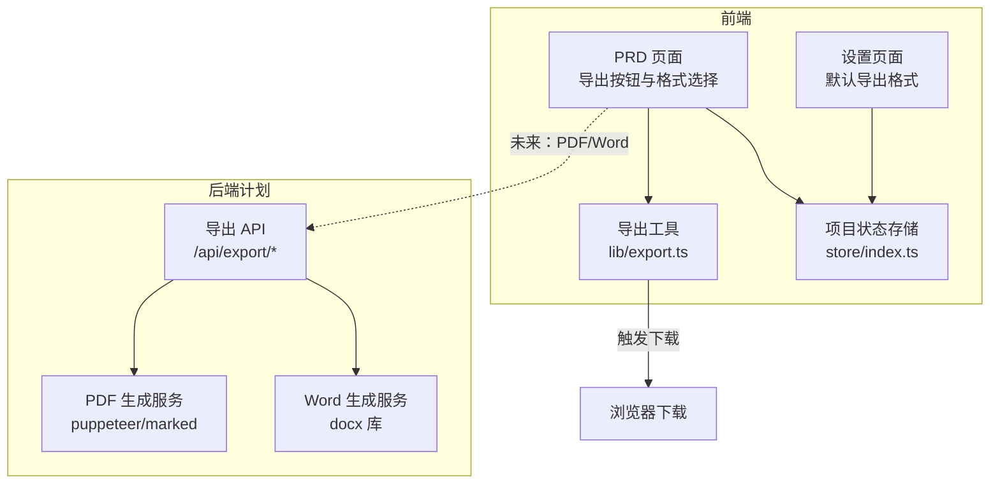
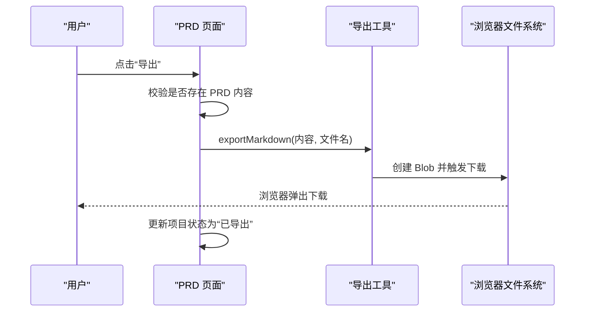
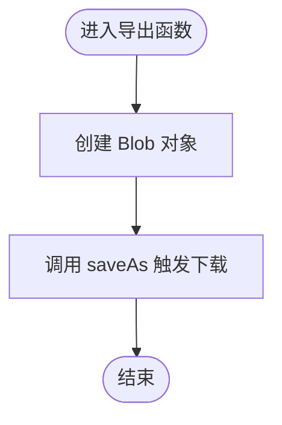
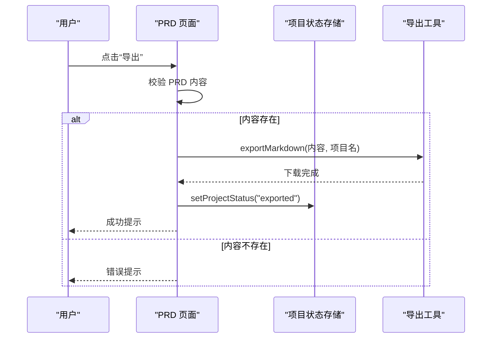
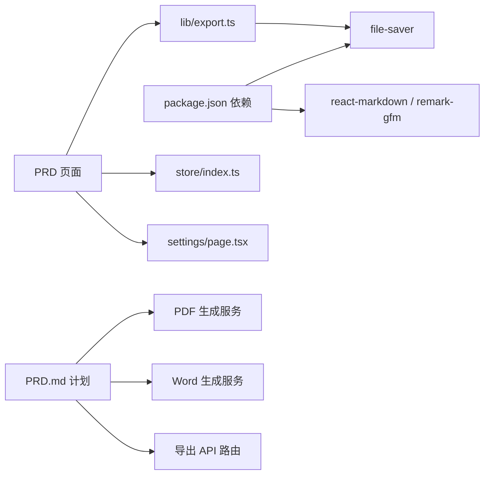

# 导出功能

<cite>
**本文引用的文件**
- [export.ts](file://prd-generator/src/lib/export.ts)
- [PRD 页面](file://prd-generator/src/app/project/[id]/prd/page.tsx)
- [设置页面](file://prd-generator/src/app/settings/page.tsx)
- [项目存储](file://prd-generator/src/store/index.ts)
- [PRD.md 计划文档](file://PRD.md)
- [package.json](file://prd-generator/package.json)
</cite>

## 目录
1. [简介](#简介)
2. [项目结构](#项目结构)
3. [核心组件](#核心组件)
4. [架构总览](#架构总览)
5. [详细组件分析](#详细组件分析)
6. [依赖分析](#依赖分析)
7. [性能考虑](#性能考虑)
8. [故障排查指南](#故障排查指南)
9. [结论](#结论)
10. [附录：扩展导出格式指引](#附录扩展导出格式指引)

## 简介
本文件聚焦于“文档导出功能”，系统性说明前端如何将生成的 PRD Markdown 内容导出为文件，以及当前版本对 PDF 和 Word 导出的后端实现思路与扩展指引。PRD.md 明确了导出能力的演进路径：当前支持 Markdown 前端直出，PDF 与 Word 由后端生成；未来将通过后端 API 提供 PDF/Word 下载能力，并在前端提供统一的导出入口与格式选择。

## 项目结构
导出功能涉及三个层面：
- 前端导出工具：lib/export.ts 提供 exportMarkdown 与 exportJSON 方法，使用 Blob 与 file-saver 触发浏览器下载。
- 页面调用：PRD 页面在用户点击导出时，读取当前项目 PRD 内容并调用导出工具。
- 设置与状态：设置页面允许用户配置默认导出格式；项目状态用于标记“已导出”。

图表来源
- [PRD 页面](file://prd-generator/src/app/project/[id]/prd/page.tsx#L440-L511)
- [导出工具](file://prd-generator/src/lib/export.ts#L1-L17)
- [项目存储](file://prd-generator/src/store/index.ts#L1-L200)
- [设置页面](file://prd-generator/src/app/settings/page.tsx#L216-L238)
- [PRD.md 计划文档](file://PRD.md#L193-L209)

章节来源
- [PRD 页面](file://prd-generator/src/app/project/[id]/prd/page.tsx#L440-L511)
- [导出工具](file://prd-generator/src/lib/export.ts#L1-L17)
- [项目存储](file://prd-generator/src/store/index.ts#L1-L200)
- [设置页面](file://prd-generator/src/app/settings/page.tsx#L216-L238)
- [PRD.md 计划文档](file://PRD.md#L193-L209)

## 核心组件
- 导出工具 export.ts
  - 提供 exportMarkdown(content, filename)：将 Markdown 内容转为 Blob 并触发下载。
  - 提供 exportJSON(data, filename)：将对象序列化为 JSON 并触发下载。
- PRD 页面 PRD 页面
  - 导出入口：顶部“导出”下拉菜单，当前仅启用 Markdown。
  - 导出逻辑：校验存在 PRD 内容后调用 exportMarkdown，并更新项目状态为“已导出”。
- 设置页面
  - 默认导出格式选择：支持 md/pdf/docx，用于未来扩展。
- 项目状态存储
  - getCurrentProject 获取当前项目；setProjectStatus 更新项目状态（含 exported）。

章节来源
- [导出工具](file://prd-generator/src/lib/export.ts#L1-L17)
- [PRD 页面](file://prd-generator/src/app/project/[id]/prd/page.tsx#L440-L511)
- [设置页面](file://prd-generator/src/app/settings/page.tsx#L216-L238)
- [项目存储](file://prd-generator/src/store/index.ts#L1-L200)

## 架构总览
当前版本的导出流程如下：
- 前端直出（Markdown）：PRD 页面读取当前项目 PRD 内容，调用导出工具生成 Blob 并触发浏览器下载。
- 后端生成（PDF/Word，计划）：用户选择 PDF/Word 后，前端将 PRD Markdown 内容提交至后端，后端转换为对应格式并返回文件流，前端触发下载。

图表来源
- [PRD 页面](file://prd-generator/src/app/project/[id]/prd/page.tsx#L440-L511)
- [导出工具](file://prd-generator/src/lib/export.ts#L1-L17)

章节来源
- [PRD 页面](file://prd-generator/src/app/project/[id]/prd/page.tsx#L440-L511)
- [导出工具](file://prd-generator/src/lib/export.ts#L1-L17)

## 详细组件分析

### 组件A：导出工具 export.ts
- 职责
  - 将字符串或对象转换为 Blob，并通过 file-saver 触发浏览器下载。
- 关键点
  - Markdown 导出：指定 MIME 类型为 text/markdown，文件扩展名为 .md。
  - JSON 导出：将对象 JSON 序列化并指定 application/json。
- 复杂度
  - 时间复杂度 O(n)，n 为内容长度；空间复杂度 O(n)。
- 错误处理
  - 当前未显式捕获异常；建议在调用处增加 try/catch 并提示用户。
- 性能
  - 大文本导出会占用内存，建议对超大内容进行分块或提示用户。

图表来源
- [导出工具](file://prd-generator/src/lib/export.ts#L1-L17)

章节来源
- [导出工具](file://prd-generator/src/lib/export.ts#L1-L17)

### 组件B：PRD 页面导出入口与流程
- 职责
  - 提供导出按钮与格式选择；当前仅启用 Markdown。
  - 校验 PRD 内容存在性；调用导出工具；更新项目状态为 exported；提示成功。
- 关键点
  - 导出入口位于顶部导航的“导出”下拉菜单。
  - handleExport(format) 仅处理 md 格式；pdf/docx 项目前处于禁用状态，标注“开发中”。
  - 导出成功后调用 setProjectStatus('exported')。

图表来源
- [PRD 页面](file://prd-generator/src/app/project/[id]/prd/page.tsx#L440-L511)
- [项目存储](file://prd-generator/src/store/index.ts#L1-L200)
- [导出工具](file://prd-generator/src/lib/export.ts#L1-L17)

章节来源
- [PRD 页面](file://prd-generator/src/app/project/[id]/prd/page.tsx#L440-L511)
- [项目存储](file://prd-generator/src/store/index.ts#L1-L200)
- [导出工具](file://prd-generator/src/lib/export.ts#L1-L17)

### 组件C：设置页面与默认导出格式
- 职责
  - 提供默认导出格式选择（md/pdf/docx），用于未来扩展。
- 关键点
  - Select 组件绑定 settings.exportPreferences.defaultFormat。
  - 该值可用于前端导出时的默认文件名后缀或后续后端导出的默认格式。

章节来源
- [设置页面](file://prd-generator/src/app/settings/page.tsx#L216-L238)

### 组件D：项目状态存储
- 职责
  - 管理项目列表、当前项目、状态变更（含 exported）。
- 关键点
  - getCurrentProject 派生当前项目；setProjectStatus 更新状态并持久化。
  - 导出成功后设置状态为 exported，便于 UI 展示与后续流程。

章节来源
- [项目存储](file://prd-generator/src/store/index.ts#L1-L200)

## 依赖分析
- 前端依赖
  - file-saver：用于触发浏览器下载。
  - react-markdown/remark-gfm：用于 PRD 内容渲染与编辑。
- 导出工具依赖
  - Blob：构造二进制数据对象。
  - file-saver.saveAs：触发下载。
- 设置与状态
  - Zustand：项目状态管理。
- 后端实现（计划）
  - PDF：marked + puppeteer。
  - Word：docx 库。
  - Express 路由：/api/export/pdf 与 /api/export/word。

图表来源
- [package.json](file://prd-generator/package.json#L1-L58)
- [导出工具](file://prd-generator/src/lib/export.ts#L1-L17)
- [PRD 页面](file://prd-generator/src/app/project/[id]/prd/page.tsx#L440-L511)
- [项目存储](file://prd-generator/src/store/index.ts#L1-L200)
- [设置页面](file://prd-generator/src/app/settings/page.tsx#L216-L238)
- [PRD.md 计划文档](file://PRD.md#L193-L209)

章节来源
- [package.json](file://prd-generator/package.json#L1-L58)
- [PRD.md 计划文档](file://PRD.md#L193-L209)

## 性能考虑
- 大内容导出
  - Markdown 导出为 Blob 会占用内存，建议对超长 PRD 进行分块或提示用户。
- 下载触发
  - saveAs 由浏览器执行，避免阻塞主线程。
- 后端生成（计划）
  - PDF/Word 生成涉及渲染与序列化，应限制并发与缓存结果，避免重复生成。

[本节为通用建议，不直接分析具体文件]

## 故障排查指南
- 无法下载
  - 检查 PRD 页面是否检测到有效内容；若为空则不会触发导出。
  - 确认浏览器允许弹窗与下载。
- 下载文件名异常
  - 确认传入的文件名参数是否包含非法字符。
- 导出格式不可用
  - 当前仅启用 Markdown；PDF/Word 为“开发中”，需等待后端实现上线。

章节来源
- [PRD 页面](file://prd-generator/src/app/project/[id]/prd/page.tsx#L440-L511)

## 结论
- 当前版本：前端直出 Markdown，使用 Blob 与 file-saver 实现一键下载；UI 上已预留 PDF/Word 选项，标注“开发中”。
- 未来版本：后端将提供 PDF/Word 生成服务与 API，前端统一导出入口，用户可按需选择格式。

[本节为总结，不直接分析具体文件]

## 附录：扩展导出格式指引
- 前端扩展（Markdown/JSON）
  - 在导出工具中新增导出函数，使用 Blob 与 saveAs 触发下载。
  - 在 PRD 页面的导出菜单中添加对应选项，并调用相应导出函数。
- 后端扩展（PDF/Word）
  - PRD.md 提供了后端实现思路：
    - PDF：使用 marked 将 Markdown 转 HTML，再用 puppeteer 渲染为 PDF。
    - Word：使用 docx 库解析 Markdown 并生成 .docx。
  - API 端点：/api/export/pdf 与 /api/export/word，接收 Markdown 内容并返回文件流。
- 集成步骤建议
  - 前端：在导出菜单中启用 PDF/Word 选项，向后端发送 PRD Markdown 内容。
  - 后端：实现 PDF/Word 服务与路由，设置正确的 Content-Type 与 Content-Disposition。
  - UI：导出完成后提示用户并更新项目状态。

章节来源
- [PRD.md 计划文档](file://PRD.md#L193-L209)
- [PRD.md 计划文档](file://PRD.md#L681-L799)