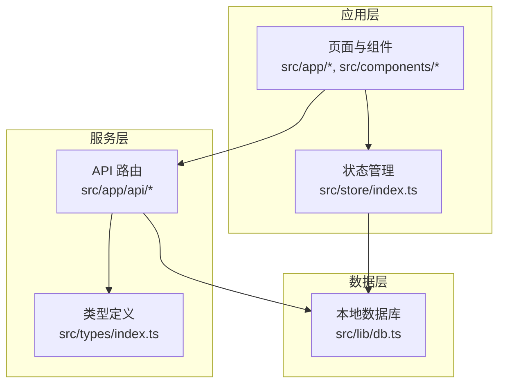
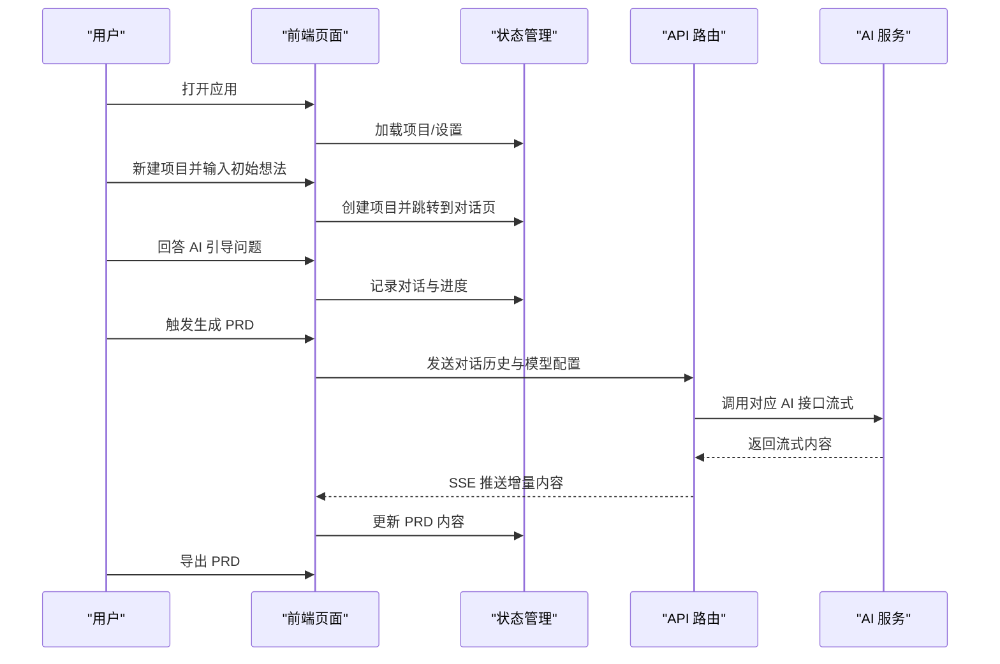
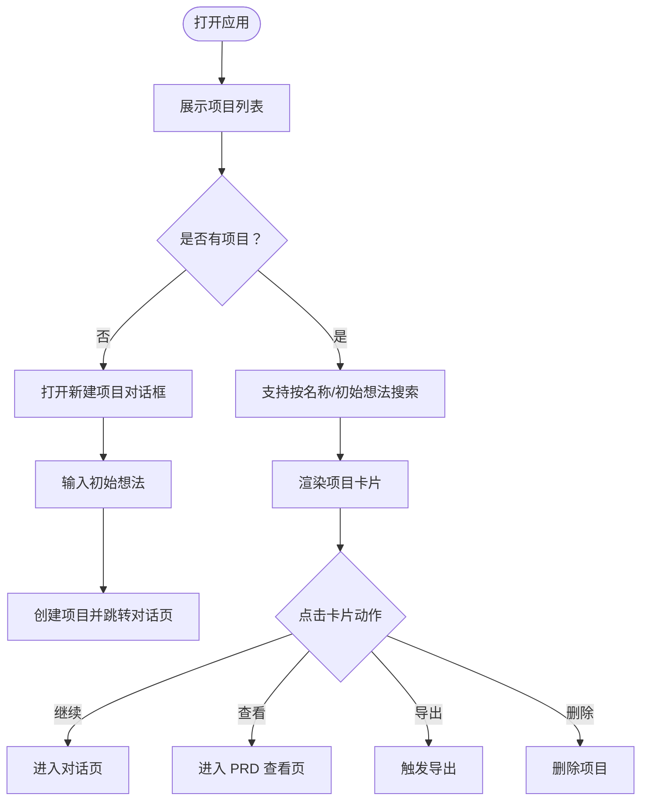

# 快速开始

<cite>
**本文引用的文件**
- [README.md](file://prd-generator/README.md)
- [package.json](file://prd-generator/package.json)
- [tsconfig.json](file://prd-generator/tsconfig.json)
- [src/app/page.tsx](file://prd-generator/src/app/page.tsx)
- [src/app/settings/page.tsx](file://prd-generator/src/app/settings/page.tsx)
- [src/app/api/generate-prd/route.ts](file://prd-generator/src/app/api/generate-prd/route.ts)
- [src/types/index.ts](file://prd-generator/src/types/index.ts)
- [src/lib/db.ts](file://prd-generator/src/lib/db.ts)
- [src/store/index.ts](file://prd-generator/src/store/index.ts)
- [src/components/new-project-dialog.tsx](file://prd-generator/src/components/new-project-dialog.tsx)
- [src/components/project-card.tsx](file://prd-generator/src/components/project-card.tsx)
</cite>

## 目录
1. [简介](#简介)
2. [项目结构](#项目结构)
3. [核心组件](#核心组件)
4. [架构总览](#架构总览)
5. [详细组件分析](#详细组件分析)
6. [依赖分析](#依赖分析)
7. [性能与可用性建议](#性能与可用性建议)
8. [故障排查指南](#故障排查指南)
9. [结论](#结论)
10. [附录：5分钟上手清单](#附录5分钟上手清单)

## 简介
本指南面向首次接触 PRD 生成工具的新用户，帮助你在 5 分钟内完成环境准备、启动本地开发服务器，并完成“从打开应用到生成第一个 PRD 文档”的最小可行流程。你将学会：
- 克隆仓库与安装依赖
- 配置 AI 服务 API Key
- 启动本地开发服务器并访问应用
- 创建项目、输入初始想法、回答 AI 引导问题、生成并导出 PRD

## 项目结构
该工程采用 Next.js App Router 架构，核心目录与职责如下：
- prd-generator/src/app：页面与 API 路由
- prd-generator/src/components：UI 组件与业务组件
- prd-generator/src/store：全局状态管理（Zustand）
- prd-generator/src/lib：数据库（Dexie）与工具
- prd-generator/src/types：类型定义

图表来源
- [src/app/page.tsx](file://prd-generator/src/app/page.tsx#L1-L110)
- [src/store/index.ts](file://prd-generator/src/store/index.ts#L1-L208)
- [src/lib/db.ts](file://prd-generator/src/lib/db.ts#L1-L210)
- [src/app/api/generate-prd/route.ts](file://prd-generator/src/app/api/generate-prd/route.ts#L1-L254)
- [src/types/index.ts](file://prd-generator/src/types/index.ts#L1-L243)

章节来源
- [README.md](file://prd-generator/README.md#L1-L37)
- [package.json](file://prd-generator/package.json#L1-L58)

## 核心组件
- 页面入口与项目列表：首页负责展示项目卡片、搜索与新建项目入口。
- 设置页：配置默认 AI 模型、API Key、自定义 API URL 与导出偏好。
- API 路由：接收前端发起的 PRD 生成请求，转发至对应 AI 服务并返回流式响应。
- 状态管理：统一维护项目、设置、生成任务等状态。
- 数据库：使用 Dexie 在浏览器端持久化项目、设置、聊天草稿与 PRD 生成任务。

章节来源
- [src/app/page.tsx](file://prd-generator/src/app/page.tsx#L1-L110)
- [src/app/settings/page.tsx](file://prd-generator/src/app/settings/page.tsx#L1-L304)
- [src/app/api/generate-prd/route.ts](file://prd-generator/src/app/api/generate-prd/route.ts#L1-L254)
- [src/store/index.ts](file://prd-generator/src/store/index.ts#L1-L208)
- [src/lib/db.ts](file://prd-generator/src/lib/db.ts#L1-L210)

## 架构总览
下图展示了从用户操作到 PRD 生成的关键交互路径。

图表来源
- [src/app/page.tsx](file://prd-generator/src/app/page.tsx#L1-L110)
- [src/components/new-project-dialog.tsx](file://prd-generator/src/components/new-project-dialog.tsx#L1-L107)
- [src/components/project-card.tsx](file://prd-generator/src/components/project-card.tsx#L1-L128)
- [src/store/index.ts](file://prd-generator/src/store/index.ts#L1-L208)
- [src/app/api/generate-prd/route.ts](file://prd-generator/src/app/api/generate-prd/route.ts#L1-L254)

## 详细组件分析

### 页面与交互流程
- 首页负责展示项目列表、搜索与新建入口；当无项目时提示新建。
- 新建项目对话框接收初始想法，自动提取项目名并创建项目，随后跳转到对话页。
- 项目卡片显示状态、进度与操作（继续/查看/导出/删除）。

图表来源
- [src/app/page.tsx](file://prd-generator/src/app/page.tsx#L1-L110)
- [src/components/new-project-dialog.tsx](file://prd-generator/src/components/new-project-dialog.tsx#L1-L107)
- [src/components/project-card.tsx](file://prd-generator/src/components/project-card.tsx#L1-L128)

章节来源
- [src/app/page.tsx](file://prd-generator/src/app/page.tsx#L1-L110)
- [src/components/new-project-dialog.tsx](file://prd-generator/src/components/new-project-dialog.tsx#L1-L107)
- [src/components/project-card.tsx](file://prd-generator/src/components/project-card.tsx#L1-L128)

### 设置与 API Key 配置
- 设置页支持选择默认模型、配置各服务商 API Key、自定义 API URL 与导出格式。
- API Key 会在本地加密存储，避免明文泄露。
- 支持多种模型（DeepSeek、Qwen、Doubao、自定义），并提供获取 API Key 的指引链接。

章节来源
- [src/app/settings/page.tsx](file://prd-generator/src/app/settings/page.tsx#L1-L304)
- [src/lib/db.ts](file://prd-generator/src/lib/db.ts#L75-L137)
- [src/types/index.ts](file://prd-generator/src/types/index.ts#L102-L108)

### PRD 生成 API
- API 路由接收对话历史、模型与 API Key，校验自定义 API URL 的安全性（仅允许 HTTPS、禁止内网与非白名单域名）。
- 将系统提示词与用户对话历史组合，调用对应 AI 服务接口，返回流式响应（SSE）。
- 若缺少必要参数或调用失败，返回相应错误码与错误信息。

章节来源
- [src/app/api/generate-prd/route.ts](file://prd-generator/src/app/api/generate-prd/route.ts#L1-L254)

### 状态管理与数据持久化
- 项目状态：包括名称、初始输入、对话历史、PRD 内容、进度与状态。
- 设置状态：默认模型、API Key、自定义 API URL、导出偏好。
- 生成任务状态：PRD 生成阶段、耗时、流式内容、错误信息等。
- 数据持久化：使用 Dexie 在浏览器端存储项目、设置、聊天草稿与 PRD 生成任务。

章节来源
- [src/store/index.ts](file://prd-generator/src/store/index.ts#L1-L208)
- [src/lib/db.ts](file://prd-generator/src/lib/db.ts#L1-L210)

## 依赖分析
- 运行时依赖：Next.js、React、Radix UI 组件库、Zustand 状态管理、Dexie 本地数据库、日期处理、UUID、文件导出等。
- 开发依赖：TypeScript、TailwindCSS、ESLint、PostCSS 等。
- 类型定义：统一管理项目、设置、对话消息、生成阶段与任务等类型。

章节来源
- [package.json](file://prd-generator/package.json#L1-L58)
- [src/types/index.ts](file://prd-generator/src/types/index.ts#L1-L243)

## 性能与可用性建议
- 首屏加载：首页使用骨架屏与懒加载策略，提升弱网体验。
- 生成性能：PRD 生成采用流式返回，前端逐步渲染，避免长时间阻塞。
- 数据持久化：本地数据库按需清理过期草稿与已完成任务，保持良好性能。
- 网络安全：自定义 API URL 校验严格限制协议与域名，防止 SSRF。

章节来源
- [src/app/page.tsx](file://prd-generator/src/app/page.tsx#L1-L110)
- [src/lib/db.ts](file://prd-generator/src/lib/db.ts#L168-L207)
- [src/app/api/generate-prd/route.ts](file://prd-generator/src/app/api/generate-prd/route.ts#L30-L81)

## 故障排查指南
- 无法启动开发服务器
  - 确认 Node.js 版本满足项目要求（见下一节“前提条件”）。
  - 确认已安装依赖（执行安装命令）。
  - 确认端口未被占用，默认访问地址为 http://localhost:3000。
- 生成 PRD 失败
  - 检查设置页是否已配置对应模型的 API Key。
  - 检查网络连通性与自定义 API URL 是否符合白名单与协议要求。
  - 查看浏览器控制台与服务端日志，确认错误信息。
- 本地数据异常
  - 清理浏览器缓存与 IndexedDB 数据（如需），重新登录设置页保存配置。

章节来源
- [README.md](file://prd-generator/README.md#L5-L20)
- [src/app/settings/page.tsx](file://prd-generator/src/app/settings/page.tsx#L1-L304)
- [src/app/api/generate-prd/route.ts](file://prd-generator/src/app/api/generate-prd/route.ts#L110-L175)

## 结论
本指南提供了从零到一的完整上手路径：安装依赖、配置 API Key、启动开发服务器、创建项目、回答引导问题、生成并导出 PRD。建议在 5 分钟内完成上述步骤，即可体验 AI 驱动的 PRD 生成工作流。

## 附录：5分钟上手清单
- 前提条件
  - Node.js 版本：项目使用 TypeScript 与 Next.js，建议使用 LTS 版本以获得最佳兼容性。
  - 包管理器：npm、yarn、pnpm 或 bun 均可。
- 步骤
  1) 克隆仓库并安装依赖
     - 在项目根目录执行安装命令（如 npm install）。
  2) 配置环境变量与 API Key
     - 打开设置页，选择默认模型并填写对应服务商的 API Key。
     - 如需自定义 API，请在设置页配置自定义 API URL（HTTPS 且在白名单内）。
  3) 启动本地开发服务器
     - 在项目根目录执行启动命令（如 npm run dev）。
     - 默认访问地址为 http://localhost:3000。
  4) 生成第一个 PRD
     - 点击“新建项目”，输入初始想法，点击“开始”。
     - 在对话页回答 AI 引导问题，直至生成完成。
     - 在项目卡片中选择“导出”，选择导出格式并下载 PRD。

章节来源
- [README.md](file://prd-generator/README.md#L5-L20)
- [src/app/settings/page.tsx](file://prd-generator/src/app/settings/page.tsx#L1-L304)
- [src/components/new-project-dialog.tsx](file://prd-generator/src/components/new-project-dialog.tsx#L1-L107)
- [src/app/api/generate-prd/route.ts](file://prd-generator/src/app/api/generate-prd/route.ts#L1-L254)