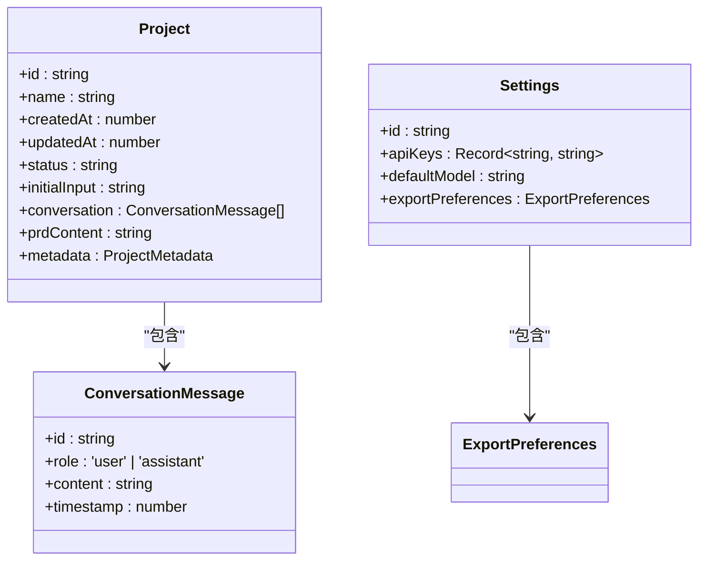
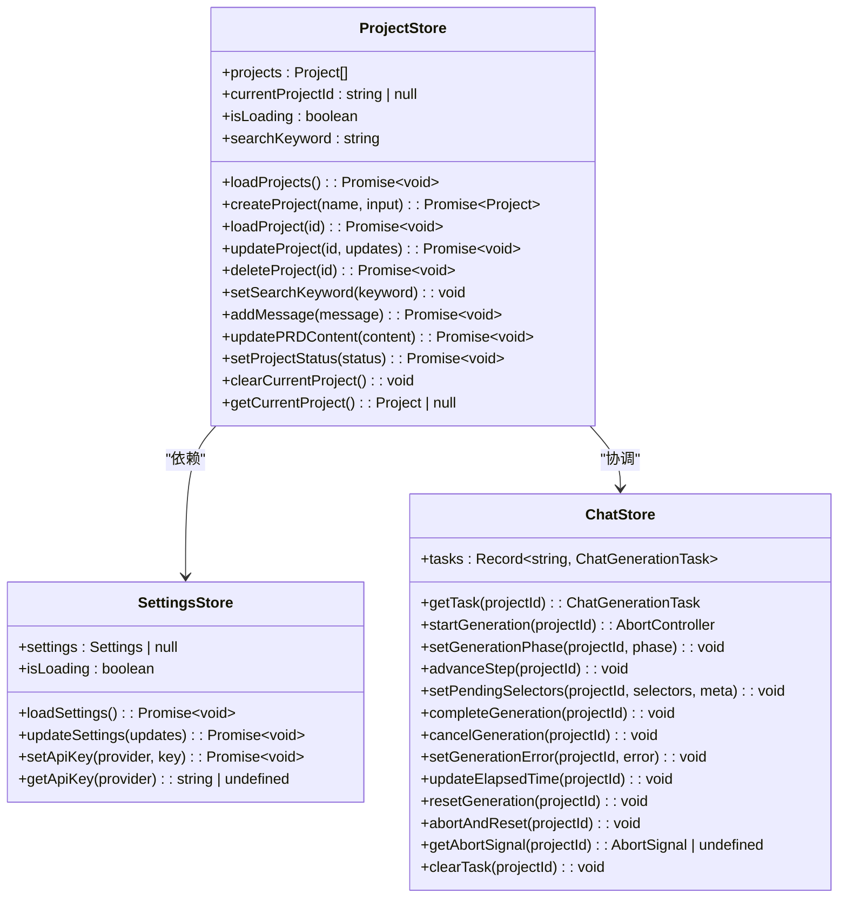
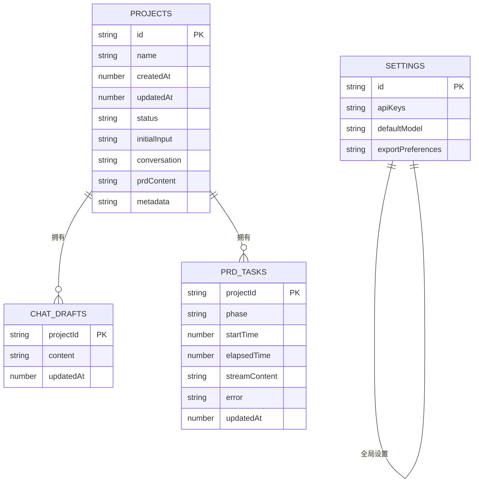
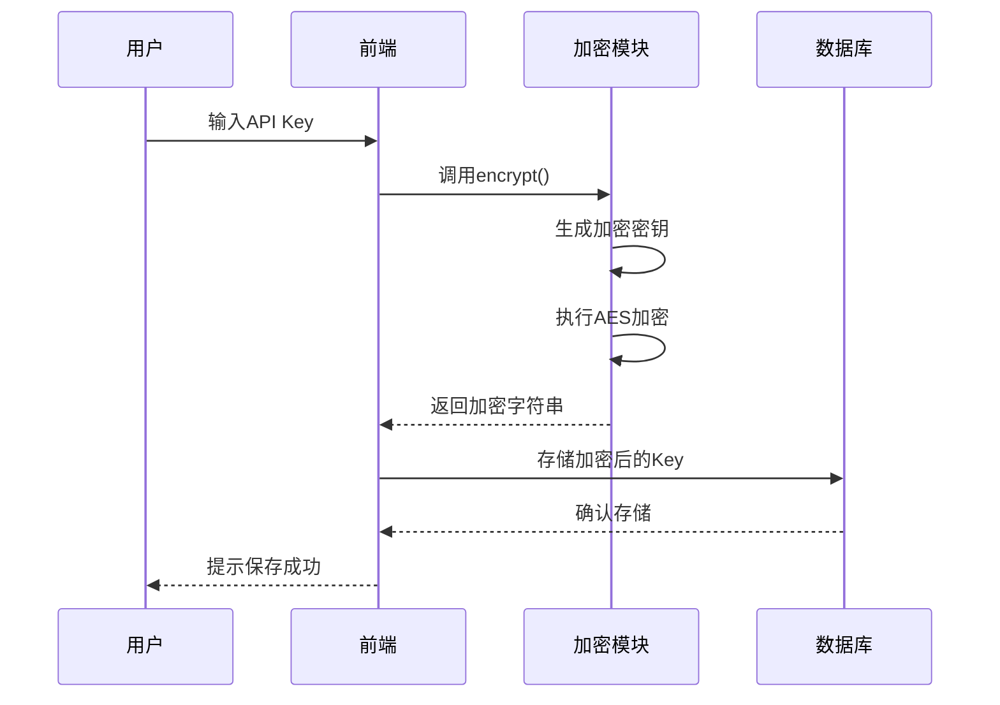

# 技术栈

<cite>
**本文档中引用的文件**  
- [package.json](file://prd-generator/package.json)
- [tsconfig.json](file://prd-generator/tsconfig.json)
- [next.config.ts](file://prd-generator/next.config.ts)
- [components.json](file://prd-generator/components.json)
- [crypto.ts](file://prd-generator/src/lib/crypto.ts)
- [db.ts](file://prd-generator/src/lib/db.ts)
- [export.ts](file://prd-generator/src/lib/export.ts)
- [store/index.ts](file://prd-generator/src/store/index.ts)
- [globals.css](file://prd-generator/src/app/globals.css)
- [postcss.config.mjs](file://prd-generator/postcss.config.mjs)
- [button.tsx](file://prd-generator/src/components/ui/button.tsx)
- [dialog.tsx](file://prd-generator/src/components/ui/dialog.tsx)
- [layout.tsx](file://prd-generator/src/app/layout.tsx)
- [page.tsx](file://prd-generator/src/app/page.tsx)
</cite>

## 目录
1. [项目概述](#项目概述)
2. [前端技术栈](#前端技术栈)
3. [状态管理](#状态管理)
4. [数据持久化](#数据持久化)
5. [关键开发依赖](#关键开发依赖)
6. [技术选型原因](#技术选型原因)
7. [开发者入门指南](#开发者入门指南)

## 项目概述

PRDbot项目是一个基于AI驱动的智能PRD文档生成工具，采用现代化的前端技术栈构建。该项目利用Next.js 16的App Router架构，结合React 19的最新特性，为用户提供流畅的交互体验。项目结构清晰，采用TypeScript进行类型安全的开发，确保代码质量和可维护性。

**Section sources**
- [package.json](file://prd-generator/package.json#L32-L35)
- [tsconfig.json](file://prd-generator/tsconfig.json#L1-L35)

## 前端技术栈

PRDbot项目采用了当前最前沿的前端技术组合，确保了高性能、良好的开发体验和优秀的用户体验。

### Next.js 16 (App Router)

项目基于Next.js 16构建，充分利用了App Router的现代化路由系统。App Router提供了更灵活的路由配置、嵌套路由支持和更好的数据获取模式。通过服务器组件和客户端组件的混合使用，实现了最佳的性能平衡。

```mermaid
graph TD
A[Next.js 16] --> B[App Router]
A --> C[Server Components]
A --> D[Client Components]
A --> E[API Routes]
B --> F[/api/chat/route.ts]
B --> G[/api/generate-prd/route.ts]
B --> H[/project/[id]/chat/page.tsx]
B --> I[/project/[id]/prd/page.tsx]
```

**Diagram sources**
- [next.config.ts](file://prd-generator/next.config.ts#L1-L8)
- [package.json](file://prd-generator/package.json#L32)

### React 19

项目采用React 19作为核心UI库，利用其最新的并发渲染特性，确保了复杂交互下的流畅性能。React 19的改进使得状态更新更加高效，减少了不必要的重渲染，提升了整体应用性能。

**Section sources**
- [package.json](file://prd-generator/package.json#L34-L35)
- [layout.tsx](file://prd-generator/src/app/layout.tsx#L1-L37)

### TypeScript

TypeScript为项目提供了完整的类型系统，增强了代码的可读性和可维护性。通过定义清晰的类型接口，减少了运行时错误，提高了开发效率。



**Diagram sources**
- [types/index.ts](file://prd-generator/src/types/index.ts)
- [store/index.ts](file://prd-generator/src/store/index.ts#L4-L14)

### Tailwind CSS

项目采用Tailwind CSS作为CSS框架，通过实用类的方式快速构建UI界面。Tailwind的原子化CSS方法使得样式编写更加高效，同时保证了样式的可复用性和一致性。

**Section sources**
- [globals.css](file://prd-generator/src/app/globals.css#L1-L216)
- [postcss.config.mjs](file://prd-generator/postcss.config.mjs#L1-L8)

### shadcn/ui组件库

shadcn/ui为项目提供了高质量的可定制化UI组件。这些组件基于Radix UI构建，具有良好的可访问性和可扩展性。通过shadcn/ui，项目实现了统一的设计语言和交互模式。

**Section sources**
- [components.json](file://prd-generator/components.json#L1-L23)
- [button.tsx](file://prd-generator/src/components/ui/button.tsx#L1-L61)
- [dialog.tsx](file://prd-generator/src/components/ui/dialog.tsx#L1-L144)

### Radix UI原生组件

Radix UI提供了无样式的原生组件，作为shadcn/ui的基础。这些组件专注于可访问性和功能完整性，确保了所有用户都能正常使用应用。

```mermaid
graph TD
A[Radix UI] --> B[@radix-ui/react-dialog]
A --> C[@radix-ui/react-dropdown-menu]
A --> D[@radix-ui/react-checkbox]
A --> E[@radix-ui/react-radio-group]
A --> F[@radix-ui/react-tabs]
B --> G[shadcn/ui Dialog]
C --> H[shadcn/ui Dropdown]
D --> I[shadcn/ui Checkbox]
E --> J[shadcn/ui Radio Group]
F --> K[shadcn/ui Tabs]
```

**Diagram sources**
- [package.json](file://prd-generator/package.json#L12-L23)
- [components.json](file://prd-generator/components.json#L1-L23)

## 状态管理

项目采用Zustand作为状态管理解决方案，提供了简洁而强大的状态管理能力。

### Zustand状态管理

Zustand以其轻量级和简单性著称，避免了Redux的复杂性。通过create函数创建store，实现了全局状态的集中管理。



**Diagram sources**
- [store/index.ts](file://prd-generator/src/store/index.ts#L1-L853)
- [types/index.ts](file://prd-generator/src/types/index.ts)

**Section sources**
- [store/index.ts](file://prd-generator/src/store/index.ts#L1-L853)
- [page.tsx](file://prd-generator/src/app/page.tsx#L12)

## 数据持久化

项目采用Dexie.js封装IndexedDB实现本地数据持久化，确保用户数据的安全存储。

### Dexie.js与IndexedDB

Dexie.js作为IndexedDB的现代化封装，提供了更友好的API和TypeScript支持。通过Dexie，项目实现了结构化的本地数据存储。



**Diagram sources**
- [db.ts](file://prd-generator/src/lib/db.ts#L1-L210)
- [package.json](file://prd-generator/package.json#L29)

**Section sources**
- [db.ts](file://prd-generator/src/lib/db.ts#L1-L210)
- [store/index.ts](file://prd-generator/src/store/index.ts#L3-L4)

## 关键开发依赖

项目包含多个关键的开发依赖，支持核心功能的实现。

### crypto-js

crypto-js用于API Key的加密存储，确保敏感信息的安全性。通过AES加密算法，对用户的API密钥进行加密处理。



**Diagram sources**
- [crypto.ts](file://prd-generator/src/lib/crypto.ts#L1-L107)
- [package.json](file://prd-generator/package.json#L27)

### file-saver

file-saver用于实现文件导出功能，支持将PRD文档导出为Markdown或JSON格式。

```mermaid
flowchart TD
A[用户点击导出] --> B{选择导出格式}
B --> |Markdown| C[调用exportMarkdown()]
B --> |JSON| D[调用exportJSON()]
C --> E[创建Blob对象]
D --> E
E --> F[调用saveAs()]
F --> G[浏览器下载文件]
```

**Diagram sources**
- [export.ts](file://prd-generator/src/lib/export.ts#L1-L18)
- [package.json](file://prd-generator/package.json#L30)

**Section sources**
- [crypto.ts](file://prd-generator/src/lib/crypto.ts#L1-L107)
- [export.ts](file://prd-generator/src/lib/export.ts#L1-L18)
- [db.ts](file://prd-generator/src/lib/db.ts#L3)

## 技术选型原因

### Next.js的SSR/SSG能力

Next.js提供了强大的服务器端渲染(SSR)和静态站点生成(SSG)能力，确保了应用的SEO友好性和快速首屏加载。通过App Router，项目能够实现更精细的数据获取和渲染控制。

### shadcn/ui的可定制化UI组件

shadcn/ui提供了高度可定制的UI组件，允许开发者根据项目需求调整组件样式和行为。通过配置文件components.json，项目实现了统一的组件别名和样式配置。

**Section sources**
- [components.json](file://prd-generator/components.json#L1-L23)
- [next.config.ts](file://prd-generator/next.config.ts#L1-L8)

## 开发者入门指南

### 环境准备

1. 确保Node.js版本>=18
2. 安装pnpm: `npm install -g pnpm`
3. 安装依赖: `pnpm install`

### 项目结构

项目采用标准的Next.js App Router结构：
- `src/app` - 页面和路由
- `src/components` - 组件库
- `src/lib` - 工具函数和数据库
- `src/store` - Zustand状态管理
- `src/types` - TypeScript类型定义

### 启动开发服务器

```bash
pnpm dev
```

### 主要开发文件

- 状态管理: `src/store/index.ts`
- 数据库操作: `src/lib/db.ts`
- 加密功能: `src/lib/crypto.ts`
- 文件导出: `src/lib/export.ts`
- 全局样式: `src/app/globals.css`

**Section sources**
- [package.json](file://prd-generator/package.json#L6-L8)
- [next.config.ts](file://prd-generator/next.config.ts#L1-L8)
- [tsconfig.json](file://prd-generator/tsconfig.json#L1-L35)