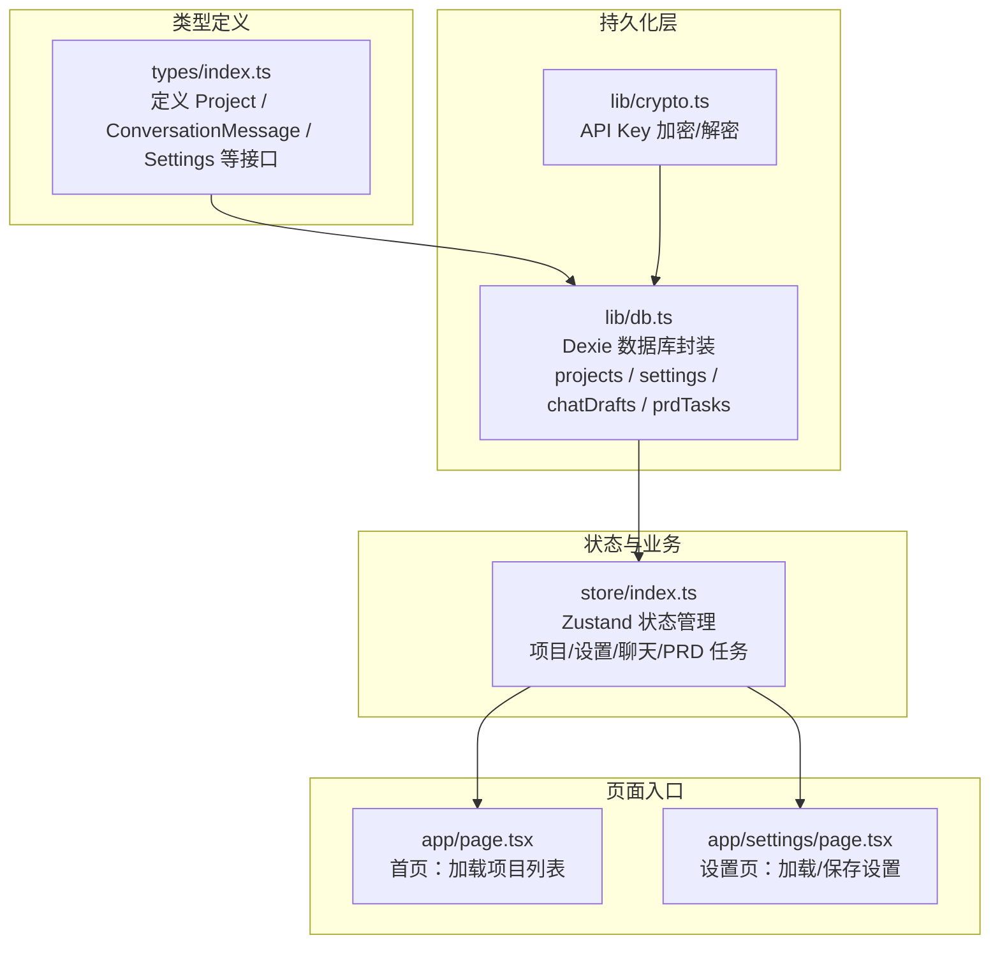
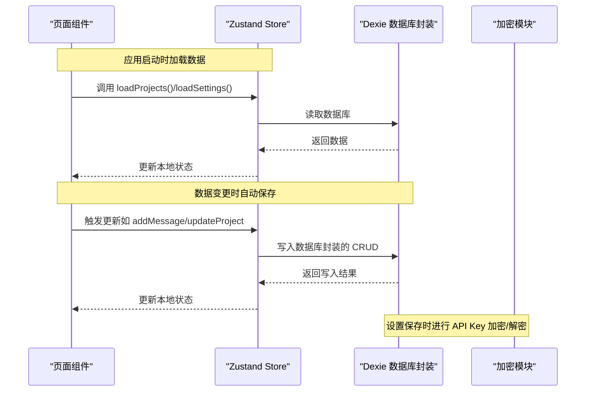
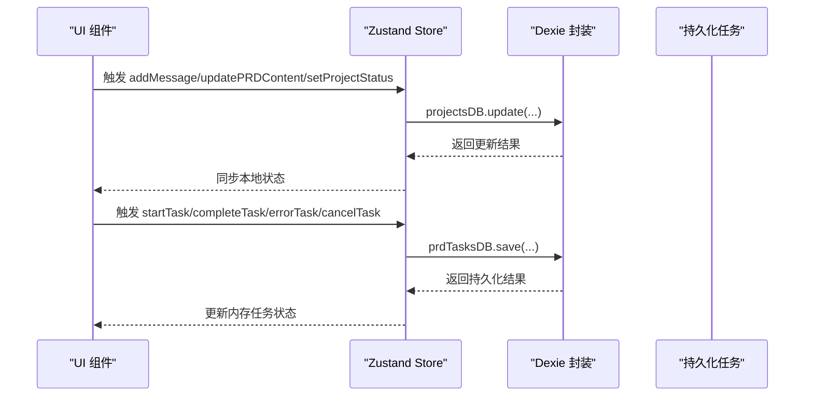
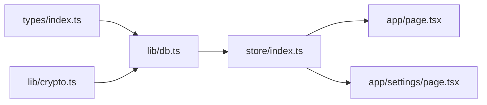

# 数据持久化

<cite>
**本文引用的文件**
- [types/index.ts](file://prd-generator/src/types/index.ts)
- [db.ts](file://prd-generator/src/lib/db.ts)
- [crypto.ts](file://prd-generator/src/lib/crypto.ts)
- [store/index.ts](file://prd-generator/src/store/index.ts)
- [page.tsx（首页）](file://prd-generator/src/app/page.tsx)
- [page.tsx（设置页）](file://prd-generator/src/app/settings/page.tsx)
</cite>

## 目录
1. [简介](#简介)
2. [项目结构](#项目结构)
3. [核心数据模型](#核心数据模型)
4. [架构总览](#架构总览)
5. [组件与数据流详解](#组件与数据流详解)
6. [依赖关系分析](#依赖关系分析)
7. [性能与可靠性考量](#性能与可靠性考量)
8. [故障排查指南](#故障排查指南)
9. [结论](#结论)

## 简介
本文件围绕项目中的数据模型与持久化实现展开，重点基于以下两个方面：
- 数据模型：基于 types/index.ts 中定义的 Project、ConversationMessage、Settings 接口，逐项说明字段、数据类型与业务含义。
- 持久化实现：结合 lib/db.ts 中的 Dexie.js 封装，解释如何创建 projects 与 settings 两个 Object Store，如何定义主键与索引；并说明 CRUD 操作封装、应用启动时的加载流程以及数据变更时的自动保存策略。同时强调本地存储对离线使用与数据隐私的重要性。

## 项目结构
与数据持久化直接相关的文件组织如下：
- 类型定义：types/index.ts
- 数据库与加密：lib/db.ts、lib/crypto.ts
- 状态与业务逻辑：store/index.ts
- 页面入口：app/page.tsx（首页）、app/settings/page.tsx（设置页）

图表来源
- [types/index.ts](file://prd-generator/src/types/index.ts#L46-L92)
- [db.ts](file://prd-generator/src/lib/db.ts#L1-L33)
- [crypto.ts](file://prd-generator/src/lib/crypto.ts#L1-L107)
- [store/index.ts](file://prd-generator/src/store/index.ts#L1-L208)
- [page.tsx（首页）](file://prd-generator/src/app/page.tsx#L1-L110)
- [page.tsx（设置页）](file://prd-generator/src/app/settings/page.tsx#L1-L304)

章节来源
- [types/index.ts](file://prd-generator/src/types/index.ts#L46-L92)
- [db.ts](file://prd-generator/src/lib/db.ts#L1-L33)
- [store/index.ts](file://prd-generator/src/store/index.ts#L1-L208)
- [page.tsx（首页）](file://prd-generator/src/app/page.tsx#L1-L110)
- [page.tsx（设置页）](file://prd-generator/src/app/settings/page.tsx#L1-L304)

## 核心数据模型
本节依据 types/index.ts 中的接口定义，逐项说明字段、数据类型与业务含义。

- ConversationMessage（对话消息）
  - 字段与类型
    - id: string
    - role: 'user' | 'assistant'
    - timestamp: number
    - content: string
    - selectors?: SelectorData[]
    - userChoice?: UserChoice
  - 业务含义
    - 记录一次对话交互，包含消息内容、发送者角色、时间戳，以及可选的选择器与用户选择，便于后续 PRD 生成流程的上下文追踪。

- Project（项目）
  - 字段与类型
    - id: string
    - name: string
    - createdAt: number
    - updatedAt: number
    - status: 'exploring' | 'generated' | 'exported'
    - initialInput: string
    - conversation: ConversationMessage[]
    - prdContent: string
    - metadata: ProjectMetadata
  - 业务含义
    - 代表一次 PRD 生成任务的完整生命周期，包含项目基本信息、对话历史、最终 PRD 内容与进度元数据。

- Settings（全局设置）
  - 字段与类型
    - id: string
    - apiKeys: Record<string, string>
    - defaultModel: string
    - customApiUrl?: string
    - exportPreferences: ExportPreferences
  - 业务含义
    - 存储用户偏好，包括各提供商的 API Key、默认模型、自定义 API 地址与导出格式偏好。

- ProjectMetadata（项目元数据）
  - 字段与类型
    - questionCount: number
    - progress: number
    - selectedModel: string
  - 业务含义
    - 记录对话轮次、生成进度百分比与所选模型，用于界面展示与流程控制。

章节来源
- [types/index.ts](file://prd-generator/src/types/index.ts#L46-L92)
- [types/index.ts](file://prd-generator/src/types/index.ts#L56-L73)

## 架构总览
下图展示了从页面到状态管理再到数据库的调用链路，以及加密层在设置保存时的作用。

图表来源
- [page.tsx（首页）](file://prd-generator/src/app/page.tsx#L1-L110)
- [page.tsx（设置页）](file://prd-generator/src/app/settings/page.tsx#L1-L304)
- [store/index.ts](file://prd-generator/src/store/index.ts#L1-L208)
- [db.ts](file://prd-generator/src/lib/db.ts#L1-L33)
- [crypto.ts](file://prd-generator/src/lib/crypto.ts#L1-L107)

## 组件与数据流详解

### Dexie 数据库与 Object Store 定义
- 数据库类与版本迁移
  - 数据库类继承 Dexie，定义了 projects、settings、chatDrafts、prdTasks 四个 Object Store。
  - 版本 1：初始结构，包含 projects 与 settings 的基础索引。
  - 版本 2：新增 chatDrafts 与 prdTasks，并为其建立复合索引。
- 主键与索引
  - projects：主键 id，索引 name、createdAt、updatedAt、status。
  - settings：主键 id（固定为 'global'）。
  - chatDrafts：主键 projectId，索引 updatedAt。
  - prdTasks：主键 projectId，索引 phase、updatedAt。
- 说明
  - 通过 stores 配置声明主键与索引，Dexie 会据此建立数据库结构并在查询时使用索引加速。

章节来源
- [db.ts](file://prd-generator/src/lib/db.ts#L1-L33)

### CRUD 封装与业务调用
- 项目（projects）CRD
  - getAll：按 updatedAt 倒序返回全部项目，便于“最近修改”排序。
  - getById：按 id 查询单个项目。
  - create：插入新项目，返回新增 id。
  - update：按 id 更新，自动更新 updatedAt。
  - delete：按 id 删除。
  - search：基于名称与初始输入进行模糊匹配。
- 设置（settings）CRUD
  - get：获取设置，若 apiKeys 存在且被加密，则解密后再返回。
  - save：保存设置，将 apiKeys 加密后写入固定 id 'global'。
  - update：更新设置，若包含 apiKeys 则先加密再写入；若不存在则回退到 save 的默认值。
  - getOrCreate：获取或创建默认设置（含默认模型与导出偏好），内部调用 get 以确保解密。
- 聊天草稿（chatDrafts）
  - get/save/delete/cleanupOld：按 projectId 读写草稿，提供清理 7 天前过期草稿的能力。
- PRD 任务持久化（prdTasks）
  - get/save/delete/getIncomplete/cleanupCompleted：按 projectId 读写任务，提供筛选“未完成”与清理“已完成”超过 1 天的任务。

章节来源
- [db.ts](file://prd-generator/src/lib/db.ts#L34-L209)

### 加密与隐私保护
- API Key 加密策略
  - 使用设备指纹（浏览器特征）+ 固定盐值生成对称密钥，采用 AES 加密。
  - settingsDB.save/update 在写入前对 apiKeys 进行加密；get/getOrCreate 在读取后对 apiKeys 进行解密。
  - isEncrypted 用于判断密文特征，避免重复加密。
- 隐私与离线
  - 敏感信息仅在本地存储，不上传至服务器；通过加密进一步降低泄露风险。
  - 即使网络异常，本地 IndexedDB 仍可保证数据可用性，提升离线体验。

章节来源
- [crypto.ts](file://prd-generator/src/lib/crypto.ts#L1-L107)
- [db.ts](file://prd-generator/src/lib/db.ts#L75-L137)

### 应用启动与数据加载
- 首页（Home）
  - 组件挂载后触发 loadProjects，Store 调用 projectsDB.getAll，按 updatedAt 倒序渲染项目卡片。
- 设置页（Settings）
  - 组件挂载后触发 loadSettings，Store 调用 settingsDB.getOrCreate，初始化或读取设置并解密 API Key。
- 说明
  - 两处均采用客户端侧懒加载，避免阻塞首屏渲染。

章节来源
- [page.tsx（首页）](file://prd-generator/src/app/page.tsx#L1-L110)
- [page.tsx（设置页）](file://prd-generator/src/app/settings/page.tsx#L1-L304)
- [store/index.ts](file://prd-generator/src/store/index.ts#L1-L208)

### 数据变更与自动保存机制
- 项目变更
  - 新增消息：addMessage 会更新 conversation 与 metadata，并调用 projectsDB.update，Store 同步更新本地 projects 列表。
  - 更新 PRD 内容：updatePRDContent 调用 projectsDB.update 并同步更新本地状态。
  - 更新状态：setProjectStatus 调用 projectsDB.update 并同步更新本地状态。
- 设置变更
  - updateSettings/setApiKey：调用 settingsDB.update，Store 同步更新本地 settings。
- PRD 任务持久化
  - startTask：异步调用 prdTasksDB.save，将“生成中”状态持久化，避免刷新丢失。
  - completeTask/errorTask/cancelTask/clearTask：分别持久化“完成/错误/删除”状态。
  - restoreTask/loadPersistedTask：从持久化恢复任务，处理中断场景。
  - abortAndPersist：组件卸载时安全中断并保存错误状态，避免数据丢失。

图表来源
- [store/index.ts](file://prd-generator/src/store/index.ts#L142-L208)
- [store/index.ts](file://prd-generator/src/store/index.ts#L561-L853)
- [db.ts](file://prd-generator/src/lib/db.ts#L169-L209)

章节来源
- [store/index.ts](file://prd-generator/src/store/index.ts#L142-L208)
- [store/index.ts](file://prd-generator/src/store/index.ts#L561-L853)
- [db.ts](file://prd-generator/src/lib/db.ts#L169-L209)

## 依赖关系分析
- 类型依赖
  - types/index.ts 定义了 Project、ConversationMessage、Settings 等接口，供 db.ts 与 store/index.ts 使用。
- 数据库依赖
  - db.ts 依赖 Dexie 与 crypto.ts，负责数据库结构、CRUD 封装与敏感数据加解密。
- 状态依赖
  - store/index.ts 依赖 db.ts 与 types/index.ts，负责业务逻辑与 UI 状态同步。
- 页面依赖
  - app/page.tsx 与 app/settings/page.tsx 依赖 store/index.ts，负责首次加载与用户交互。

图表来源
- [types/index.ts](file://prd-generator/src/types/index.ts#L46-L92)
- [db.ts](file://prd-generator/src/lib/db.ts#L1-L33)
- [crypto.ts](file://prd-generator/src/lib/crypto.ts#L1-L107)
- [store/index.ts](file://prd-generator/src/store/index.ts#L1-L208)
- [page.tsx（首页）](file://prd-generator/src/app/page.tsx#L1-L110)
- [page.tsx（设置页）](file://prd-generator/src/app/settings/page.tsx#L1-L304)

章节来源
- [types/index.ts](file://prd-generator/src/types/index.ts#L46-L92)
- [db.ts](file://prd-generator/src/lib/db.ts#L1-L33)
- [store/index.ts](file://prd-generator/src/store/index.ts#L1-L208)
- [page.tsx（首页）](file://prd-generator/src/app/page.tsx#L1-L110)
- [page.tsx（设置页）](file://prd-generator/src/app/settings/page.tsx#L1-L304)

## 性能与可靠性考量
- 查询性能
  - projects 的 updatedAt 倒序查询与多字段索引（name、createdAt、updatedAt、status）有助于快速筛选与排序。
  - prdTasks 的 phase 与 updatedAt 索引便于筛选未完成任务与清理过期任务。
- 写入一致性
  - 所有更新均在 Store 层统一调用 db 封装，确保写入前后状态一致。
  - PRD 任务在 startTask 时即持久化“生成中”，避免刷新丢失。
- 数据清理
  - chatDrafts 提供清理 7 天前草稿，避免无用数据膨胀。
  - prdTasks 提供清理 1 天前已完成任务，保持数据库整洁。
- 离线与隐私
  - 本地 IndexedDB 支持离线使用，无需网络即可浏览与编辑项目。
  - API Key 本地加密，降低泄露风险；isEncrypted 保障重复加密防护。

[本节为通用建议，不直接分析具体文件]

## 故障排查指南
- 无法加载项目/设置
  - 检查 Store 的 loadProjects/loadSettings 是否被调用，确认页面挂载后执行。
  - 查看控制台错误日志，定位 db.ts 的读取异常。
- 设置保存失败
  - 确认 settingsDB.update 调用路径，检查 apiKeys 是否正确加密。
  - 若出现重复加密，检查 isEncrypted 判断逻辑。
- PRD 任务中断
  - 使用 abortAndPersist 或 restoreTask 恢复状态，确认 prdTasksDB.get/save 的调用链。
- 草稿过多导致卡顿
  - 调用 chatDraftsDB.cleanupOld 清理过期草稿，释放空间。

章节来源
- [store/index.ts](file://prd-generator/src/store/index.ts#L1-L208)
- [store/index.ts](file://prd-generator/src/store/index.ts#L561-L853)
- [db.ts](file://prd-generator/src/lib/db.ts#L75-L137)
- [db.ts](file://prd-generator/src/lib/db.ts#L140-L209)
- [crypto.ts](file://prd-generator/src/lib/crypto.ts#L1-L107)

## 结论
本项目通过 Dexie.js 实现了轻量、可靠的本地数据持久化，结合加密模块保障敏感信息的安全。类型系统清晰定义了数据模型，Store 层统一封装了 CRUD 与业务逻辑，页面入口在挂载时完成数据加载，业务变更时自动持久化，既满足离线使用的需求，也兼顾了数据隐私与可靠性。建议在后续迭代中持续关注索引命中率与清理策略，以维持长期运行的稳定性与性能。