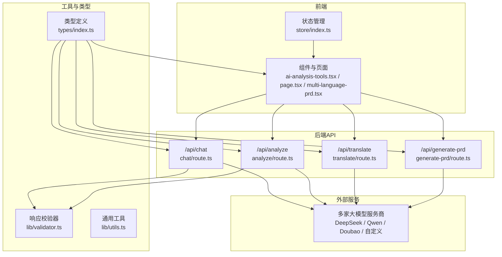
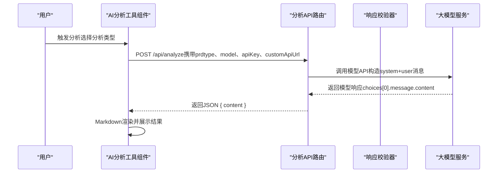
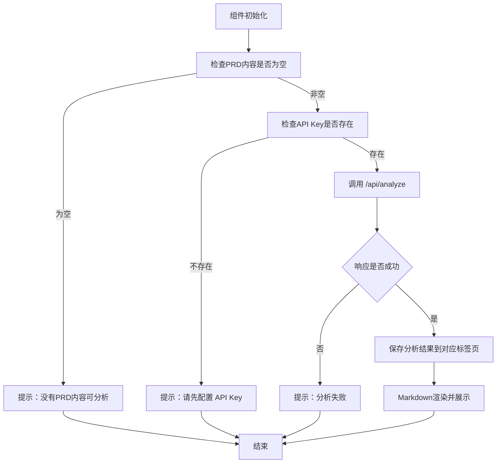
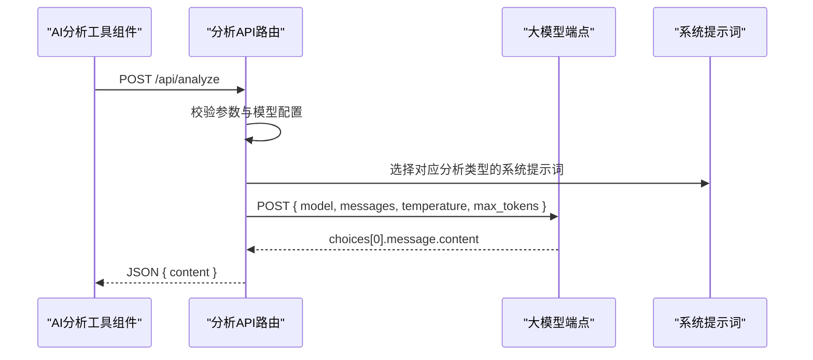
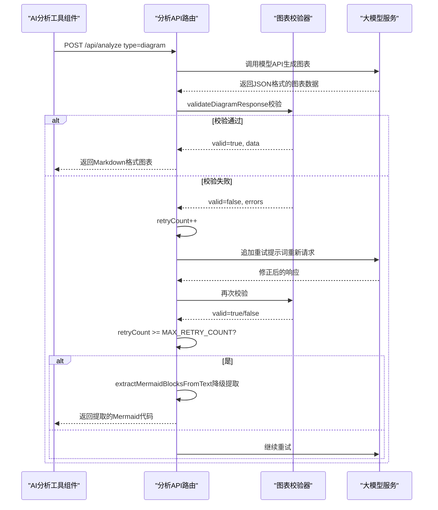
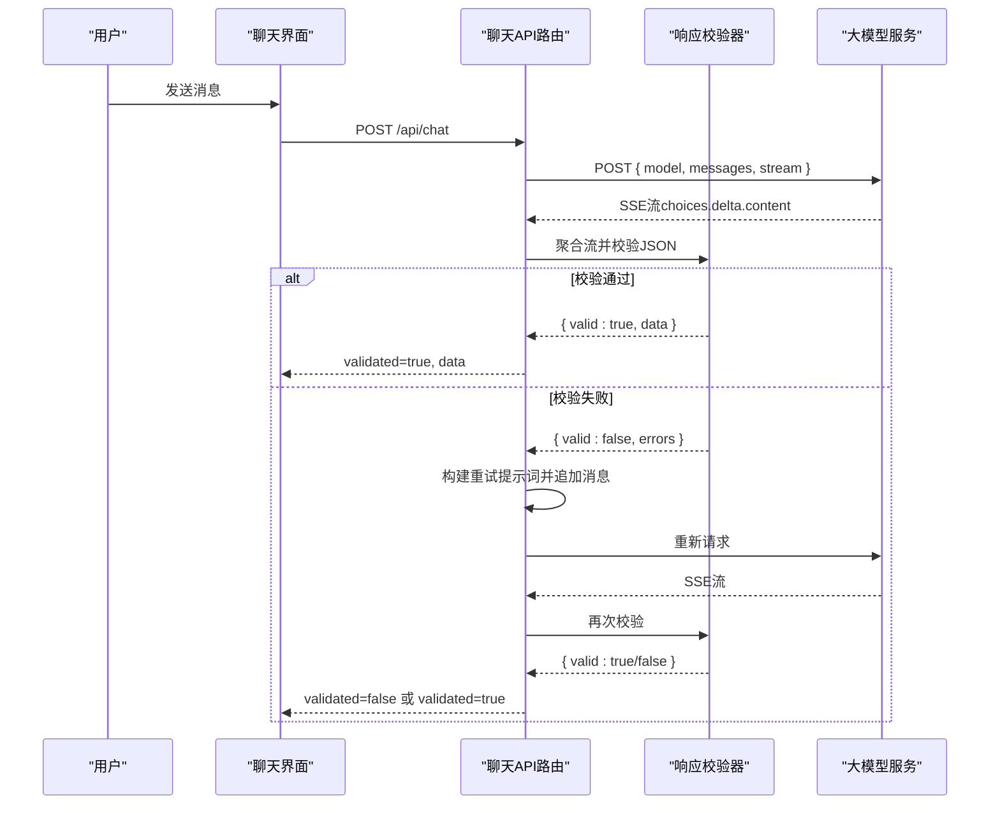
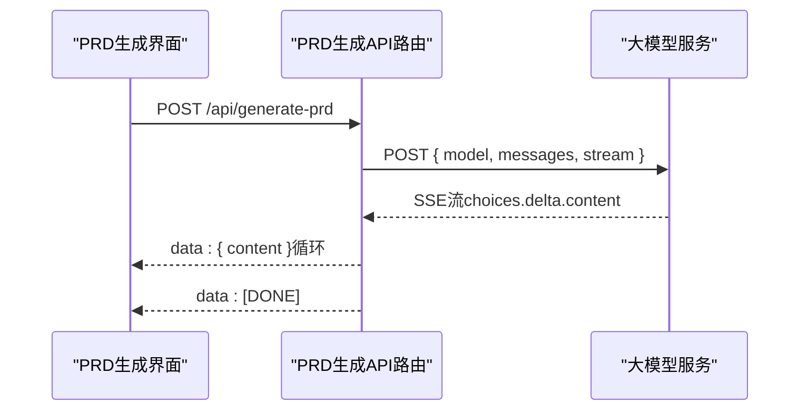
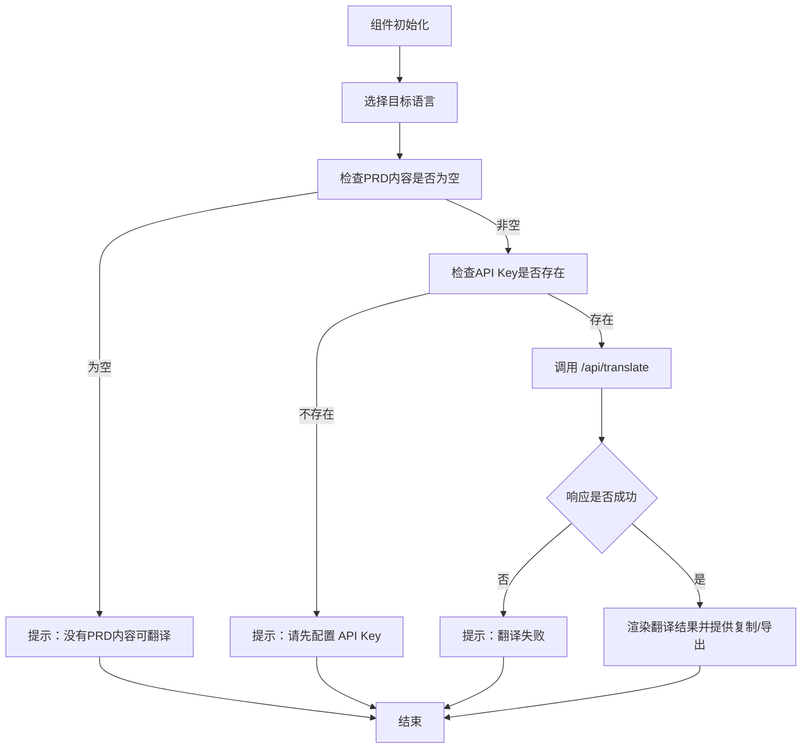
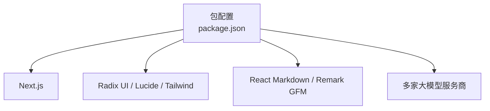

# AI分析工具

<cite>
**本文引用的文件**
- [AI分析工具组件](file://prd-generator/src/components/ai-analysis-tools.tsx)
- [分析API路由](file://prd-generator/src/app/api/analyze/route.ts)
- [图表校验器](file://prd-generator/src/lib/diagram-validator.ts)
- [类型定义](file://prd-generator/src/types/index.ts)
</cite>

## 更新摘要
**变更内容**
- 为图表生成功能新增了校验、重试机制和降级提取功能
- 增强了状态管理和用户反馈机制
- 更新了AI分析工具组件以支持重试次数跟踪和加载状态显示
- 新增了图表校验和降级处理逻辑

## 目录
1. [简介](#简介)
2. [项目结构](#项目结构)
3. [核心组件](#核心组件)
4. [架构总览](#架构总览)
5. [详细组件分析](#详细组件分析)
6. [依赖分析](#依赖分析)
7. [性能考量](#性能考量)
8. [故障排查指南](#故障排查指南)
9. [结论](#结论)
10. [附录](#附录)

## 简介
本项目提供一套围绕PRD（产品需求文档）的AI辅助工具链，包括：
- AI分析工具：对PRD内容进行优化建议、质量评分、竞品分析、图表生成等多维分析。
- 聊天式需求探索：以结构化对话的方式逐步收集需求，确保输出可直接生成PRD。
- PRD生成：基于对话历史一次性生成完整PRD文档。
- 多语言翻译：将PRD翻译为多种语言，便于国际化协作。
- 项目管理与展示：首页展示项目列表、搜索与筛选、主题切换等基础能力。

该工具链采用Next.js 16应用架构，前端组件通过Next.js App Router组织，后端API通过App Router的API路由实现，统一接入多家大模型服务商（DeepSeek、通义千问、豆包等），并通过严格的输入校验与安全策略保障调用安全。

## 项目结构
项目采用“按功能域划分”的目录组织方式，核心集中在 prd-generator/src 下：
- app/api：后端API路由，按功能拆分为 analyze、chat、generate-prd、translate 四个子路由。
- components：UI组件库，包含分析工具、聊天摘要、多语言PRD、对话表单等。
- lib：通用工具与校验逻辑，如响应校验、SSE流聚合、通用样式工具等。
- types：全局类型定义，涵盖项目、对话、生成状态、模型配置等。
- app：页面入口与布局，首页展示项目列表，设置页等。
- 其他：样式、配置、测试等。

**图表来源**
- [AI分析工具组件](file://prd-generator/src/components/ai-analysis-tools.tsx#L1-L246)
- [分析API路由](file://prd-generator/src/app/api/analyze/route.ts#L1-L216)
- [聊天API路由](file://prd-generator/src/app/api/chat/route.ts#L1-L360)
- [PRD生成API路由](file://prd-generator/src/app/api/generate-prd/route.ts#L1-L258)
- [翻译API路由](file://prd-generator/src/app/api/translate/route.ts#L1-L93)
- [聊天响应校验器](file://prd-generator/src/lib/validator.ts#L94-L147)
- [类型定义](file://prd-generator/src/types/index.ts#L1-L272)

**章节来源**
- [首页页面](file://prd-generator/src/app/page.tsx#L1-L136)
- [包配置](file://prd-generator/package.json#L1-L85)

## 核心组件
- AI分析工具组件：提供下拉菜单触发分析，支持四种分析类型（优化建议、质量评分、竞品分析、图表生成），通过弹窗标签页展示结果，支持Markdown渲染与加载态。
- 聊天式需求探索：通过结构化对话逐步收集需求，内置系统提示词与JSON输出约束，支持多次重试与校验，最终输出结构化数据供PRD生成使用。
- PRD生成：接收对话历史，构造系统提示词，调用大模型生成完整PRD，以SSE流式返回，前端实时渲染。
- 多语言PRD：将PRD内容翻译为目标语言，支持复制与导出。
- 类型系统：统一定义项目、对话、生成状态、模型配置等类型，保证前后端契约一致。

**章节来源**
- [AI分析工具组件](file://prd-generator/src/components/ai-analysis-tools.tsx#L1-L246)
- [聊天API路由](file://prd-generator/src/app/api/chat/route.ts#L1-L360)
- [PRD生成API路由](file://prd-generator/src/app/api/generate-prd/route.ts#L1-L258)
- [多语言PRD组件](file://prd-generator/src/components/multi-language-prd.tsx#L1-L189)
- [类型定义](file://prd-generator/src/types/index.ts#L1-L272)

## 架构总览
整体架构遵循“前端组件 -> Next.js API路由 -> 大模型服务”的调用链路。前端组件负责用户交互与状态管理，API路由负责参数校验、安全策略、消息构造与流式响应处理，大模型服务提供推理能力。

**图表来源**
- [AI分析工具组件](file://prd-generator/src/components/ai-analysis-tools.tsx#L96-L137)
- [分析API路由](file://prd-generator/src/app/api/analyze/route.ts#L153-L208)
- [聊天响应校验器](file://prd-generator/src/lib/validator.ts#L94-L147)

## 详细组件分析

### AI分析工具组件
- 功能概览
  - 提供四种分析类型：优化建议、质量评分、竞品分析、图表生成。
  - 通过下拉菜单触发，弹窗以标签页展示不同类型的分析结果。
  - 支持加载态、错误提示、Markdown渲染。
- 关键流程
  - 参数校验：PRD内容为空、API Key缺失时阻断请求。
  - 请求转发：向 /api/analyze 发送POST请求，携带类型、内容、模型、API Key与自定义URL。
  - 结果处理：解析响应，更新对应标签页的结果缓存，支持滚动查看。
- 安全与健壮性
  - 前端禁用无内容时的触发按钮。
  - 异常捕获与Toast提示，避免崩溃。
- 可扩展性
  - 新增分析类型只需在组件中扩展选项与后端路由中新增提示词模板即可。

**图表来源**
- [AI分析工具组件](file://prd-generator/src/components/ai-analysis-tools.tsx#L96-L137)
- [分析API路由](file://prd-generator/src/app/api/analyze/route.ts#L153-L208)

**章节来源**
- [AI分析工具组件](file://prd-generator/src/components/ai-analysis-tools.tsx#L1-L246)

### 分析API路由（analyze/route.ts）
- 功能概览
  - 接收前端请求，根据分析类型拼装系统提示词与用户消息。
  - 依据模型ID选择对应的API端点与默认模型名。
  - 调用大模型API，返回模型输出的content。
- 安全与校验
  - 校验PRD内容、API Key、分析类型与模型配置。
  - 对自定义URL进行白名单与内网限制检查。
- 错误处理
  - 对HTTP错误与异常进行捕获与标准化返回。
- 输出格式
  - 返回JSON { content }，供前端渲染。

**图表来源**
- [分析API路由](file://prd-generator/src/app/api/analyze/route.ts#L153-L208)

**章节来源**
- [分析API路由](file://prd-generator/src/app/api/analyze/route.ts#L1-L216)

### 图表校验与重试机制
- 功能概览
  - 新增了对图表生成结果的严格校验机制，确保输出符合预定义的JSON格式。
  - 实现了自动重试机制，当图表生成失败时最多重试2次。
  - 提供了降级提取功能，当所有重试均失败时，尝试从原始内容中提取Mermaid代码块。
- 核心流程
  - **校验阶段**：使用Zod Schema校验JSON结构，验证Mermaid语法，检查禁止的样式定义。
  - **重试阶段**：构建重试提示词，包含错误原因和正确格式示例，引导AI模型修正输出。
  - **降级阶段**：从原始响应中提取Mermaid代码块作为备用方案，确保用户仍能获得部分结果。
- 状态管理
  - 前端组件跟踪重试次数并在加载状态中显示。
  - 成功时显示"图表生成完成（重试X次后成功）"的提示。
  - 失败时提供详细的错误信息和建议。

**图表来源**
- [分析API路由](file://prd-generator/src/app/api/analyze/route.ts#L278-L349)
- [图表校验器](file://prd-generator/src/lib/diagram-validator.ts#L132-L248)

**章节来源**
- [分析API路由](file://prd-generator/src/app/api/analyze/route.ts#L278-L349)
- [图表校验器](file://prd-generator/src/lib/diagram-validator.ts#L132-L248)

### 聊天API路由（chat/route.ts）
- 功能概览
  - 以SSE流式返回的方式，逐步输出AI生成的结构化JSON。
  - 内置系统提示词，要求严格JSON输出，禁止多余文字。
- 校验与重试
  - 使用Zod Schema对JSON结构进行强校验，失败时自动构建重试提示词并追加到消息历史，最多重试两次。
  - 对SSE流进行聚合，提取增量内容。
- 安全策略
  - 自定义URL白名单与内网限制，防止SSRF。
- 输出格式
  - 成功时返回结构化数据（validated=true，包含data与textContent），失败时返回rawContent与validationErrors。

**图表来源**
- [聊天API路由](file://prd-generator/src/app/api/chat/route.ts#L191-L359)
- [聊天响应校验器](file://prd-generator/src/lib/validator.ts#L94-L147)

**章节来源**
- [聊天API路由](file://prd-generator/src/app/api/chat/route.ts#L1-L360)
- [聊天响应校验器](file://prd-generator/src/lib/validator.ts#L1-L274)

### PRD生成API路由（generate-prd/route.ts）
- 功能概览
  - 接收对话历史，构造系统提示词，调用大模型生成完整PRD。
  - 以SSE流式返回，前端逐段渲染。
- 安全与校验
  - 自定义URL白名单与内网限制。
  - 对响应流进行逐行解析，过滤非数据行。
- 输出格式
  - data: { content }，直到 [DONE] 结束。

**图表来源**
- [PRD生成API路由](file://prd-generator/src/app/api/generate-prd/route.ts#L113-L249)

**章节来源**
- [PRD生成API路由](file://prd-generator/src/app/api/generate-prd/route.ts#L1-L258)

### 多语言PRD组件（multi-language-prd.tsx）
- 功能概览
  - 提供语言选择下拉菜单，调用 /api/translate 将PRD翻译为目标语言。
  - 支持复制与导出为Markdown。
- 关键流程
  - 参数校验：PRD内容为空、API Key缺失时阻断请求。
  - 调用 /api/translate，解析响应并渲染结果。
- 可扩展性
  - 新增语言只需在语言列表中添加条目。

**图表来源**
- [多语言PRD组件](file://prd-generator/src/components/multi-language-prd.tsx#L55-L97)
- [翻译API路由](file://prd-generator/src/app/api/translate/route.ts#L24-L84)

**章节来源**
- [多语言PRD组件](file://prd-generator/src/components/multi-language-prd.tsx#L1-L189)
- [翻译API路由](file://prd-generator/src/app/api/translate/route.ts#L1-L93)

### 类型系统（types/index.ts）
- 职责
  - 定义项目、对话、生成状态、模型配置、表单选择器等核心类型。
  - 统一前后端契约，减少耦合。
- 关键类型
  - 项目状态、标签、消息角色、选择器类型与数据结构。
  - 生成阶段与步骤配置，便于状态机管理。
  - PRD生成任务状态与版本历史。

**章节来源**
- [类型定义](file://prd-generator/src/types/index.ts#L1-L272)

### 首页与对话摘要（page.tsx、conversation-summary.tsx）
- 首页（page.tsx）
  - 展示项目列表，支持关键词搜索与标签筛选。
  - 提供新建项目、主题切换、设置入口。
- 对话摘要（conversation-summary.tsx）
  - 基于对话历史提取问答摘要，支持折叠展开与快速摘要。
  - 便于在PRD生成前回顾已确认信息。

**章节来源**
- [首页页面](file://prd-generator/src/app/page.tsx#L1-L136)
- [对话摘要组件](file://prd-generator/src/components/conversation-summary.tsx#L1-L155)

## 依赖分析
- 外部依赖
  - Next.js 16、Radix UI组件库、Lucide图标、React Markdown、Tailwind CSS等。
  - 大模型服务：DeepSeek、通义千问、豆包等。
- 内部依赖
  - 组件依赖类型定义与工具函数。
  - API路由依赖校验器与类型系统。
- 安全依赖
  - 自定义URL白名单与内网限制，防止SSRF。
  - Zod Schema用于结构化输出校验。

**图表来源**
- [包配置](file://prd-generator/package.json#L1-L85)

**章节来源**
- [包配置](file://prd-generator/package.json#L1-L85)

## 性能考量
- 流式响应
  - 聊天与PRD生成均采用SSE流式传输，前端可边接收边渲染，降低首屏等待时间。
- 响应聚合
  - 使用SSE流聚合器逐行解析，避免一次性缓冲大量数据。
- 校验与重试
  - 结构化输出校验失败时自动重试，减少人工干预成本。
- 前端渲染
  - Markdown渲染采用轻量库，配合滚动区域组件，保证长文档的可读性与性能。

[本节为通用指导，不涉及具体文件分析]

## 故障排查指南
- 常见错误与定位
  - “请先配置 API Key”：前端/后端均会校验API Key，确保已在设置中配置并传递。
  - “无效的模型配置”：检查模型ID是否在后端映射表中。
  - “API请求失败”：检查网络连通性、服务商状态与自定义URL白名单。
  - “未能从响应中提取到有效的JSON结构”：聊天路由的JSON输出不符合约束，需调整系统提示词或重试。
  - “图表生成失败”：检查AI输出是否符合JSON格式要求，查看重试提示中的具体错误。
- 建议排查步骤
  - 在浏览器开发者工具中查看Network面板，确认请求与响应状态码。
  - 检查后端日志输出，关注错误堆栈与参数打印。
  - 对于翻译与分析类问题，先单独验证 /api/translate 与 /api/analyze 的返回内容。
  - 若使用自定义URL，确认域名在白名单中且为HTTPS。
  - 对于图表生成问题，检查响应内容是否包含正确的JSON结构或Mermaid代码块。

**章节来源**
- [聊天API路由](file://prd-generator/src/app/api/chat/route.ts#L222-L359)
- [PRD生成API路由](file://prd-generator/src/app/api/generate-prd/route.ts#L134-L249)
- [分析API路由](file://prd-generator/src/app/api/analyze/route.ts#L171-L208)
- [翻译API路由](file://prd-generator/src/app/api/translate/route.ts#L37-L84)

## 结论
本项目通过模块化的前端组件与严谨的后端API路由，构建了一条从需求探索到PRD生成再到多语言翻译的完整工作流。其核心优势在于：
- 明确的类型系统与结构化输出约束，确保生成质量与一致性。
- 严格的输入校验与安全策略，降低调用风险。
- 流式响应与Markdown渲染，提升用户体验。
- 易扩展的分析类型与语言列表，满足多样化需求。

建议在生产环境中进一步完善：
- 增加限流与配额控制，避免大模型API费用过高。
- 加强错误恢复与重试策略，提升稳定性。
- 提供更丰富的图表生成模板与导出格式。

[本节为总结性内容，不涉及具体文件分析]

## 附录
- 快速开始
  - 启动开发服务器后访问本地端口，进入首页创建项目并开始使用AI分析工具。
- 相关文件
  - 项目说明与依赖清单可参考根目录下的说明与配置文件。

**章节来源**
- [项目说明](file://prd-generator/README.md#L1-L37)
- [包配置](file://prd-generator/package.json#L1-L85)