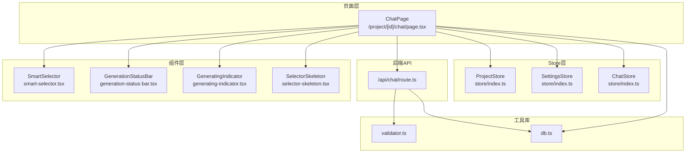
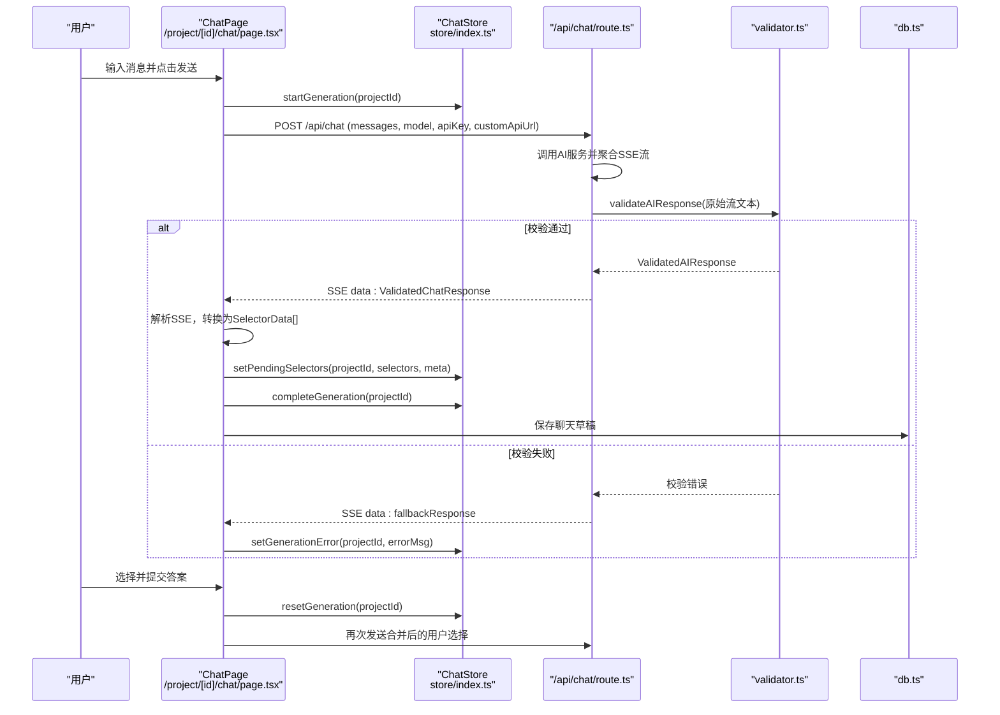
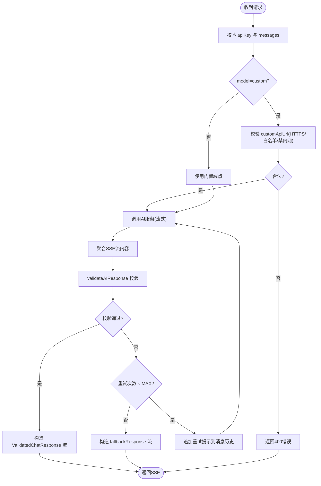
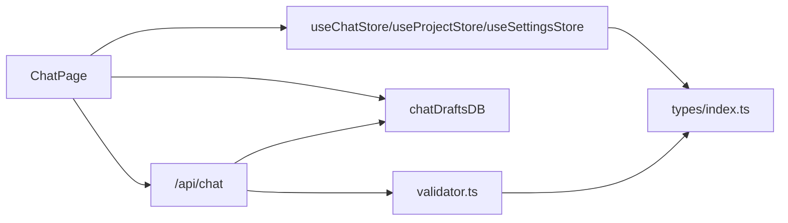
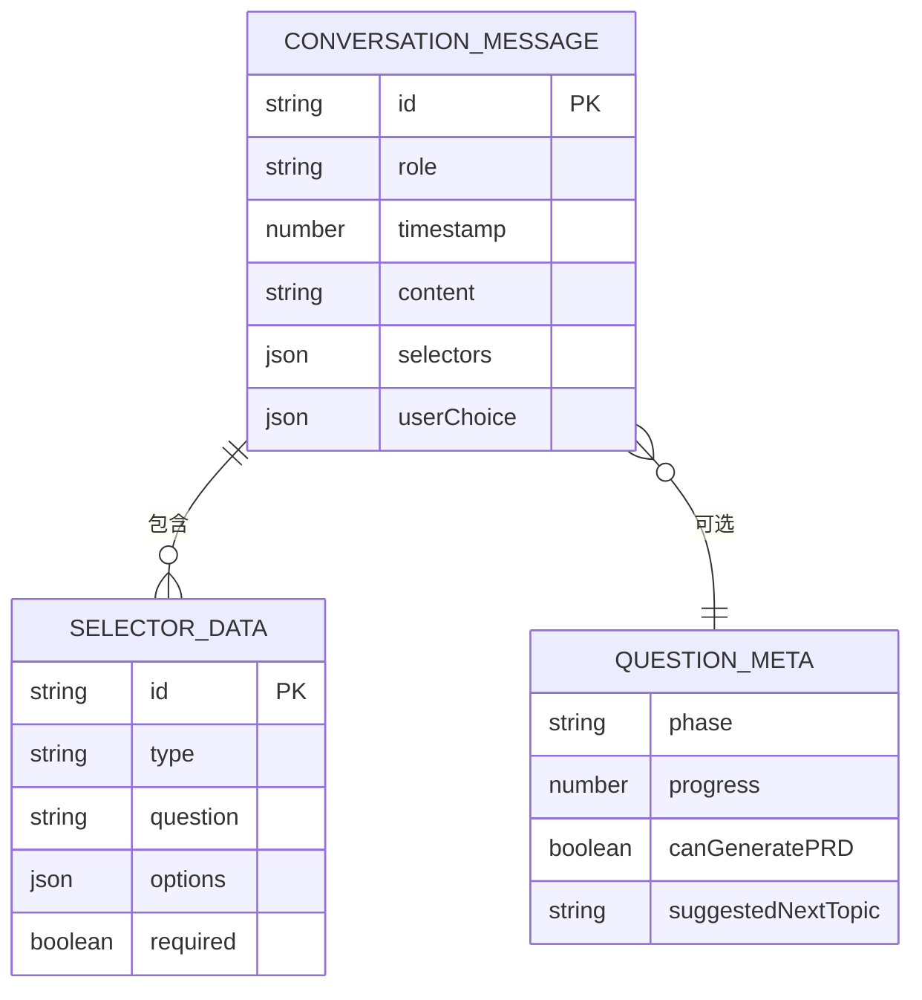

# AI对话系统

<cite>
**本文引用的文件**
- [chat/page.tsx](file://prd-generator/src/app/project/[id]/chat/page.tsx)
- [api/chat/route.ts](file://prd-generator/src/app/api/chat/route.ts)
- [store/index.ts](file://prd-generator/src/store/index.ts)
- [types/index.ts](file://prd-generator/src/types/index.ts)
- [lib/validator.ts](file://prd-generator/src/lib/validator.ts)
- [lib/db.ts](file://prd-generator/src/lib/db.ts)
- [components/smart-selector.tsx](file://prd-generator/src/components/smart-selector.tsx)
- [components/generation-status-bar.tsx](file://prd-generator/src/components/generation-status-bar.tsx)
- [components/generating-indicator.tsx](file://prd-generator/src/components/generating-indicator.tsx)
- [components/selector-skeleton.tsx](file://prd-generator/src/components/selector-skeleton.tsx)
</cite>

## 目录
1. [简介](#简介)
2. [项目结构](#项目结构)
3. [核心组件](#核心组件)
4. [架构总览](#架构总览)
5. [详细组件分析](#详细组件分析)
6. [依赖关系分析](#依赖关系分析)
7. [性能考量](#性能考量)
8. [故障排查指南](#故障排查指南)
9. [结论](#结论)
10. [附录](#附录)

## 简介
本文件深入解析基于 Next.js 的 AI 引导式对话系统，围绕 `/project/[id]/chat` 页面与 `/api/chat` 后端路由展开，重点说明：
- 前端如何通过 useChatStore 管理生成状态、处理 SSE 流式响应并渲染动态选择器（单选、多选、下拉、文本输入）
- 后端如何与多家 AI 服务通信，聚合流式响应并返回结构化问题列表
- 结合 AIQuestion、SelectorData 和 ConversationMessage 类型，阐明对话历史的存储格式与交互逻辑
- 提供用户回答问题后数据流转的完整示例，涵盖前端状态更新、本地持久化与错误恢复机制

## 项目结构
该系统采用“页面层 + Store + 类型 + 工具库 + 组件”的分层组织方式：
- 页面层：负责用户交互、状态订阅与事件处理
- Store 层：集中管理项目、设置与聊天生成任务状态
- 类型层：定义消息、选择器、问题元数据等核心类型
- 工具库：校验器、数据库封装、加密与 SSE 聚合
- 组件层：智能选择器、状态栏、生成指示器、骨架屏等



图表来源
- [chat/page.tsx](file://prd-generator/src/app/project/[id]/chat/page.tsx#L1-L762)
- [store/index.ts](file://prd-generator/src/store/index.ts#L1-L530)
- [api/chat/route.ts](file://prd-generator/src/app/api/chat/route.ts#L1-L426)
- [lib/validator.ts](file://prd-generator/src/lib/validator.ts#L1-L274)
- [lib/db.ts](file://prd-generator/src/lib/db.ts#L1-L210)
- [components/smart-selector.tsx](file://prd-generator/src/components/smart-selector.tsx#L1-L255)
- [components/generation-status-bar.tsx](file://prd-generator/src/components/generation-status-bar.tsx#L1-L125)
- [components/generating-indicator.tsx](file://prd-generator/src/components/generating-indicator.tsx#L1-L130)
- [components/selector-skeleton.tsx](file://prd-generator/src/components/selector-skeleton.tsx#L1-L64)

章节来源
- [chat/page.tsx](file://prd-generator/src/app/project/[id]/chat/page.tsx#L1-L762)
- [store/index.ts](file://prd-generator/src/store/index.ts#L1-L530)
- [types/index.ts](file://prd-generator/src/types/index.ts#L1-L243)

## 核心组件
- ChatPage（页面）：负责发起对话、接收并解析后端 SSE 响应、渲染对话气泡与动态选择器、管理草稿与错误状态
- ChatStore（状态）：按 projectId 隔离的聊天生成任务状态机，支持启动/推进/完成/取消/重试/错误设置/计时等
- ProjectStore（状态）：维护项目对话历史、更新元数据（问题数、进度）、持久化到 IndexedDB
- SettingsStore（状态）：维护全局设置（API Key、默认模型、自定义 API URL）
- 后端路由 /api/chat：校验并聚合 AI 服务流式响应，返回结构化问题列表与元数据
- 校验器 validator：提取并校验 JSON，构建重试提示，聚合 SSE 流
- 数据库封装 db：封装 Dexie CRUD，提供聊天草稿、PRD 任务持久化
- 组件 SmartSelector：统一渲染单选、多选、下拉、文本输入，支持受控/非受控两种模式
- GenerationStatusBar：交互态状态栏，展示可生成 PRD 提示、重试与关闭
- GeneratingIndicator：生成中进度指示器，模拟步骤推进与耗时
- SelectorSkeleton：生成中骨架屏占位

章节来源
- [chat/page.tsx](file://prd-generator/src/app/project/[id]/chat/page.tsx#L1-L762)
- [store/index.ts](file://prd-generator/src/store/index.ts#L259-L530)
- [api/chat/route.ts](file://prd-generator/src/app/api/chat/route.ts#L1-L426)
- [lib/validator.ts](file://prd-generator/src/lib/validator.ts#L1-L274)
- [lib/db.ts](file://prd-generator/src/lib/db.ts#L1-L210)
- [components/smart-selector.tsx](file://prd-generator/src/components/smart-selector.tsx#L1-L255)
- [components/generation-status-bar.tsx](file://prd-generator/src/components/generation-status-bar.tsx#L1-L125)
- [components/generating-indicator.tsx](file://prd-generator/src/components/generating-indicator.tsx#L1-L130)
- [components/selector-skeleton.tsx](file://prd-generator/src/components/selector-skeleton.tsx#L1-L64)

## 架构总览
系统采用“前端发起请求 → 后端聚合流式响应 → 校验并返回结构化数据 → 前端渲染选择器”的闭环流程。前端通过 AbortController 实现取消与安全中断；后端通过 zod 校验 JSON 结构，必要时自动重试并返回统一的 ValidatedChatResponse。



图表来源
- [chat/page.tsx](file://prd-generator/src/app/project/[id]/chat/page.tsx#L225-L387)
- [store/index.ts](file://prd-generator/src/store/index.ts#L295-L530)
- [api/chat/route.ts](file://prd-generator/src/app/api/chat/route.ts#L257-L426)
- [lib/validator.ts](file://prd-generator/src/lib/validator.ts#L91-L216)
- [lib/db.ts](file://prd-generator/src/lib/db.ts#L140-L166)

## 详细组件分析

### 前端页面：ChatPage
- 状态订阅与初始化
  - 订阅 useProjectStore 与 useSettingsStore，加载项目与设置
  - 按 projectId 隔离 useChatStore 任务状态，读取 isStreaming、generationPhase、currentStep、elapsedTime、pendingSelectors、questionMeta、error、retryParams
- 草稿恢复与会话恢复
  - 优先从 chatDraftsDB 恢复未提交的表单状态；若无草稿，从最后一条 assistant 消息恢复（前提是其后无用户回复）
- 发送消息与流式处理
  - 校验设置中是否存在默认模型 API Key
  - addMessage 添加用户消息
  - startGeneration 启动生成，返回 AbortController
  - fetch('/api/chat') 并读取 response.body 的 ReadableStream
  - TextDecoder 流式解码，按行切分 SSE，解析 data: JSON
  - 校验通过：转换为 SelectorData[]，addMessage 添加 AI 消息，setPendingSelectors，completeGeneration
  - 校验失败：以原始文本作为 assistant 文本消息，setGenerationError
  - 捕获 AbortError：用户取消，不报错
- 选择器交互
  - 受控模式：统一渲染 currentSelectors，handleSelectorChange 更新 selectionsMap
  - handleSubmitAll：合并所有选择为一段文本，resetGeneration，删除草稿，再次 sendMessage
  - 单选兼容：handleSelectorSubmit（旧模式），逐个提交
- 草稿持久化
  - 仅在存在选择器时保存草稿，防抖 300ms
- 生成中与交互态
  - 生成中：GeneratingIndicator + SelectorSkeleton
  - 交互态：GenerationStatusBar + SmartSelector + 提交按钮
- 生成 PRD
  - 构建对话历史文本，setProjectStatus('generated')，跳转至 PRD 页面

章节来源
- [chat/page.tsx](file://prd-generator/src/app/project/[id]/chat/page.tsx#L1-L762)
- [lib/db.ts](file://prd-generator/src/lib/db.ts#L140-L166)
- [components/smart-selector.tsx](file://prd-generator/src/components/smart-selector.tsx#L1-L255)
- [components/generation-status-bar.tsx](file://prd-generator/src/components/generation-status-bar.tsx#L1-L125)
- [components/generating-indicator.tsx](file://prd-generator/src/components/generating-indicator.tsx#L1-L130)
- [components/selector-skeleton.tsx](file://prd-generator/src/components/selector-skeleton.tsx#L1-L64)

### 前端状态：useChatStore（按 projectId 隔离）
- 任务状态字段
  - isStreaming、generationPhase、currentStep、stepIndex、startTime、elapsedTime、pendingSelectors、questionMeta、canCancel、abortController、retryParams
- 关键方法
  - startGeneration：创建 AbortController，初始化任务，标记 isStreaming
  - setGenerationPhase：切换阶段（idle/generating/interactive/error/timeout）
  - advanceStep：推进生成步骤（understanding → generating → building → validating）
  - setPendingSelectors：设置待渲染的选择器与 meta
  - completeGeneration：完成生成，进入 interactive，停止流
  - cancelGeneration/abortAndReset：安全中断并重置
  - setGenerationError/updateElapsedTime/resetGeneration/getAbortSignal/clearTask

```mermaid
classDiagram
class ChatStore {
+tasks : Record<string, ChatGenerationTask>
+getTask(projectId) : ChatGenerationTask
+startGeneration(projectId, retryParams?)
+setGenerationPhase(projectId, phase)
+advanceStep(projectId)
+setStepByIndex(projectId, index)
+setPendingSelectors(projectId, selectors, meta?)
+completeGeneration(projectId)
+cancelGeneration(projectId)
+setGenerationError(projectId, error)
+updateElapsedTime(projectId)
+resetGeneration(projectId)
+abortAndReset(projectId)
+getAbortSignal(projectId) : AbortSignal|undefined
+clearTask(projectId)
}
class ChatGenerationTask {
+projectId : string
+isStreaming : boolean
+streamContent : string
+error : string|null
+generationPhase : GenerationPhase
+currentStep : GenerationStep
+stepIndex : number
+startTime : number
+elapsedTime : number
+pendingSelectors : SelectorData[]
+questionMeta : QuestionMeta|null
+canCancel : boolean
+abortController : AbortController|null
+retryParams : {content}|null
}
ChatStore --> ChatGenerationTask : "按projectId隔离"
```

图表来源
- [store/index.ts](file://prd-generator/src/store/index.ts#L259-L530)
- [types/index.ts](file://prd-generator/src/types/index.ts#L124-L193)

章节来源
- [store/index.ts](file://prd-generator/src/store/index.ts#L259-L530)
- [types/index.ts](file://prd-generator/src/types/index.ts#L124-L193)

### 后端路由：/api/chat
- 请求校验
  - 校验 apiKey、messages 格式
  - 根据 model 选择端点或校验 customApiUrl（HTTPS、域名白名单、禁止内网）
- 调用 AI 服务
  - 调用对应模型端点，开启流式响应
  - 使用 validator.aggregateSSEStream 聚合流式 delta 内容
- 校验与重试
  - validateAIResponse 校验 JSON 结构，提取 textContent
  - 若失败，buildRetryPrompt 构造重试提示，最多 MAX_RETRY_COUNT 次
- 响应格式
  - 校验通过：返回 ValidatedChatResponse（validated: true, data, textContent, retryCount）
  - 校验失败：返回 fallbackResponse（validated: false, rawContent, validationErrors, retryCount）



图表来源
- [api/chat/route.ts](file://prd-generator/src/app/api/chat/route.ts#L1-L426)
- [lib/validator.ts](file://prd-generator/src/lib/validator.ts#L91-L216)

章节来源
- [api/chat/route.ts](file://prd-generator/src/app/api/chat/route.ts#L1-L426)
- [lib/validator.ts](file://prd-generator/src/lib/validator.ts#L1-L274)

### 类型系统：AIQuestion、SelectorData、ConversationMessage
- SelectorData：选择器数据，包含 id、type、question、options、required
- AIQuestion：与 SelectorData 结构一致，用于后端响应的“问题列表”
- ConversationMessage：对话消息，包含 id、role、timestamp、content、可选 selectors 与 userChoice
- QuestionMeta：问题元数据，包含 phase、progress、canGeneratePRD、suggestedNextTopic
- GenerationPhase/GenerationStep：生成阶段与步骤枚举，配合 GeneratingIndicator 使用

章节来源
- [types/index.ts](file://prd-generator/src/types/index.ts#L1-L243)

### 组件：SmartSelector（动态选择器）
- 支持四种类型：radio、checkbox、dropdown、text
- 受控模式：统一渲染，handleSelectorChange 更新 selectionsMap
- 非受控模式：内部状态，支持 showSubmitButton
- 文本输入支持建议选项一键填充
- 必填校验与提交按钮可用性联动

章节来源
- [components/smart-selector.tsx](file://prd-generator/src/components/smart-selector.tsx#L1-L255)

### 组件：GenerationStatusBar（状态栏）
- 交互态：显示“已生成 N 个问题”与“可生成 PRD”徽章
- 错误态：显示错误信息与重试/关闭按钮
- 超时态：提示超时并提供重试/关闭

章节来源
- [components/generation-status-bar.tsx](file://prd-generator/src/components/generation-status-bar.tsx#L1-L125)

### 组件：GeneratingIndicator（生成指示器）
- 显示当前步骤、预计总时长与剩余时间
- 动画进度条与取消按钮

章节来源
- [components/generating-indicator.tsx](file://prd-generator/src/components/generating-indicator.tsx#L1-L130)

### 组件：SelectorSkeleton（骨架屏）
- 生成中占位，提升感知速度

章节来源
- [components/selector-skeleton.tsx](file://prd-generator/src/components/selector-skeleton.tsx#L1-L64)

## 依赖关系分析
- ChatPage 依赖
  - useProjectStore/useSettingsStore/useChatStore：状态管理
  - chatDraftsDB：本地草稿持久化
  - /api/chat：后端接口
  - SmartSelector/GenerationStatusBar/GeneratingIndicator/SelectorSkeleton：UI 组件
- ChatStore 依赖
  - 仅管理内存状态与任务映射，不直接依赖后端
- /api/chat 依赖
  - validator：校验与重试
  - db：可选的日志与持久化（本路由主要返回流）
- validator 依赖
  - zod：结构校验
  - aggregateSSEStream：SSE 聚合
- db 依赖
  - Dexie：IndexedDB 封装



图表来源
- [chat/page.tsx](file://prd-generator/src/app/project/[id]/chat/page.tsx#L1-L762)
- [store/index.ts](file://prd-generator/src/store/index.ts#L1-L530)
- [api/chat/route.ts](file://prd-generator/src/app/api/chat/route.ts#L1-L426)
- [lib/validator.ts](file://prd-generator/src/lib/validator.ts#L1-L274)
- [lib/db.ts](file://prd-generator/src/lib/db.ts#L1-L210)
- [types/index.ts](file://prd-generator/src/types/index.ts#L1-L243)

章节来源
- [chat/page.tsx](file://prd-generator/src/app/project/[id]/chat/page.tsx#L1-L762)
- [store/index.ts](file://prd-generator/src/store/index.ts#L1-L530)
- [api/chat/route.ts](file://prd-generator/src/app/api/chat/route.ts#L1-L426)
- [lib/validator.ts](file://prd-generator/src/lib/validator.ts#L1-L274)
- [lib/db.ts](file://prd-generator/src/lib/db.ts#L1-L210)
- [types/index.ts](file://prd-generator/src/types/index.ts#L1-L243)

## 性能考量
- 流式解码与 SSE 分片
  - 前端与后端均使用 TextDecoder 的 stream 模式，正确处理 UTF-8 多字节字符
  - 采用按行切分 + 缓冲区处理，避免粘包与半行丢失
- 生成进度模拟
  - 生成中阶段定时器推进 stepIndex，动画进度条平滑过渡
- 防抖草稿保存
  - 300ms 防抖，减少 IndexedDB 写入频率
- 字符串拼接优化
  - PRD 生成 Store 中使用数组缓存 chunks，减少频繁字符串拼接
- 取消与中断
  - AbortController 传递给 fetch 与 AI 服务调用，确保请求可取消，释放资源

章节来源
- [chat/page.tsx](file://prd-generator/src/app/project/[id]/chat/page.tsx#L192-L223)
- [api/chat/route.ts](file://prd-generator/src/app/api/chat/route.ts#L221-L256)
- [lib/validator.ts](file://prd-generator/src/lib/validator.ts#L218-L274)
- [store/index.ts](file://prd-generator/src/store/index.ts#L532-L853)

## 故障排查指南
- 常见错误与恢复
  - API Key 缺失：前端提示“请先在设置中配置 API Key”，后端返回 400
  - 模型配置无效：后端返回 400
  - 自定义 API URL 不合法：校验 HTTPS、域名白名单、禁内网
  - AI 服务调用失败：返回 500，包含错误信息
  - 校验失败：自动重试最多两次；最终仍失败时返回 fallbackResponse，前端 setGenerationError
  - 用户取消：捕获 AbortError，不显示错误
- 本地持久化
  - 草稿保存：chatDraftsDB.save，包含 currentSelectors、selectionsMap、questionMeta、generationPhase、inputDraft
  - 草稿清理：cleanupOld（7天）
  - 会话恢复：优先从草稿恢复；否则从最后一条 assistant 消息恢复（需满足“其后无用户回复”）
- 生成 PRD 条件
  - 当 questionMeta.canGeneratePRD 为真时，状态栏显示“可生成 PRD”徽章
- 网络与超时
  - 生成中超过一定时间给出提示；可取消重试

章节来源
- [chat/page.tsx](file://prd-generator/src/app/project/[id]/chat/page.tsx#L225-L387)
- [api/chat/route.ts](file://prd-generator/src/app/api/chat/route.ts#L257-L426)
- [lib/validator.ts](file://prd-generator/src/lib/validator.ts#L91-L216)
- [lib/db.ts](file://prd-generator/src/lib/db.ts#L140-L166)

## 结论
该系统通过“前端状态机 + 后端结构化校验 + 组件化渲染”的设计，实现了稳定、可恢复、可扩展的 AI 引导式对话体验。前端以 useChatStore 为中心协调生成生命周期，后端以 validator 为核心保障输出质量，二者配合 SSE 流式传输，既保证了实时性，又提升了健壮性。本地持久化与草稿恢复进一步增强了用户体验。

## 附录
- 数据模型图（ConversationMessage、SelectorData、QuestionMeta）



图表来源
- [types/index.ts](file://prd-generator/src/types/index.ts#L46-L164)