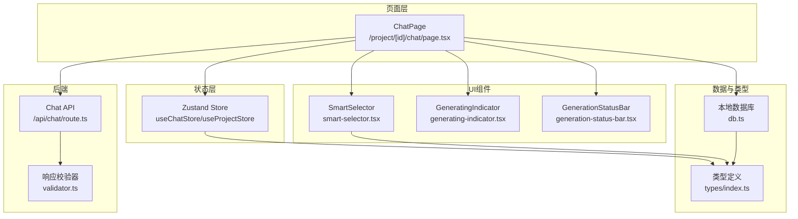
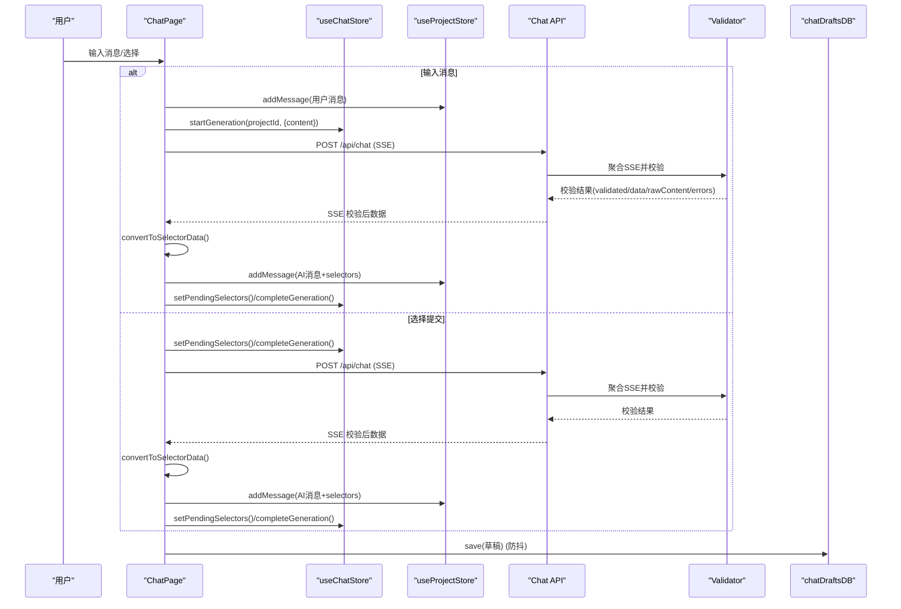
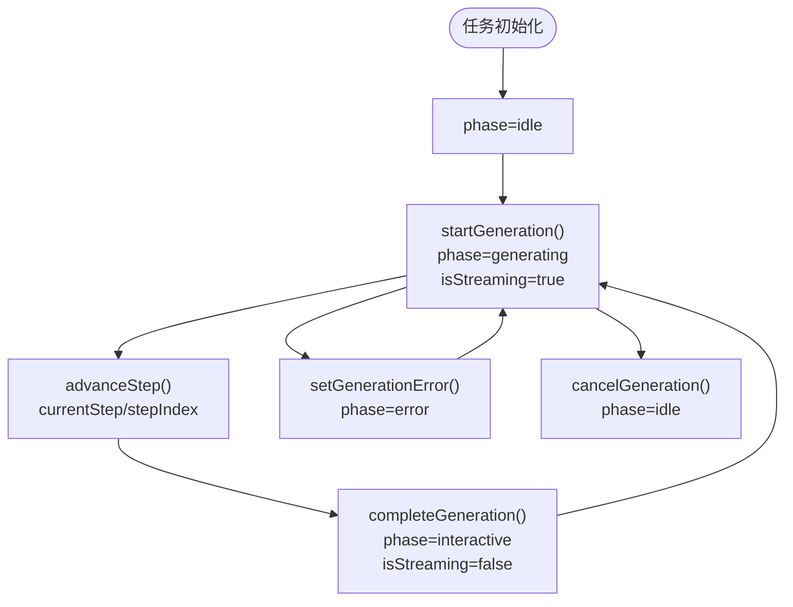
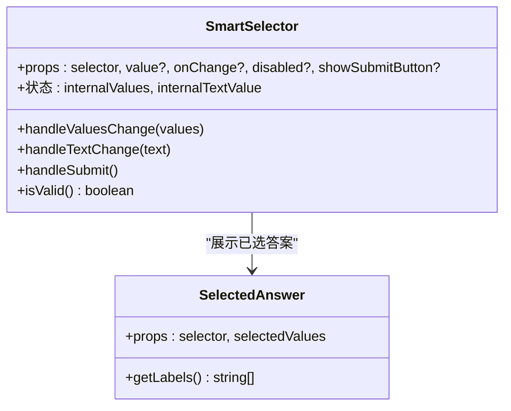
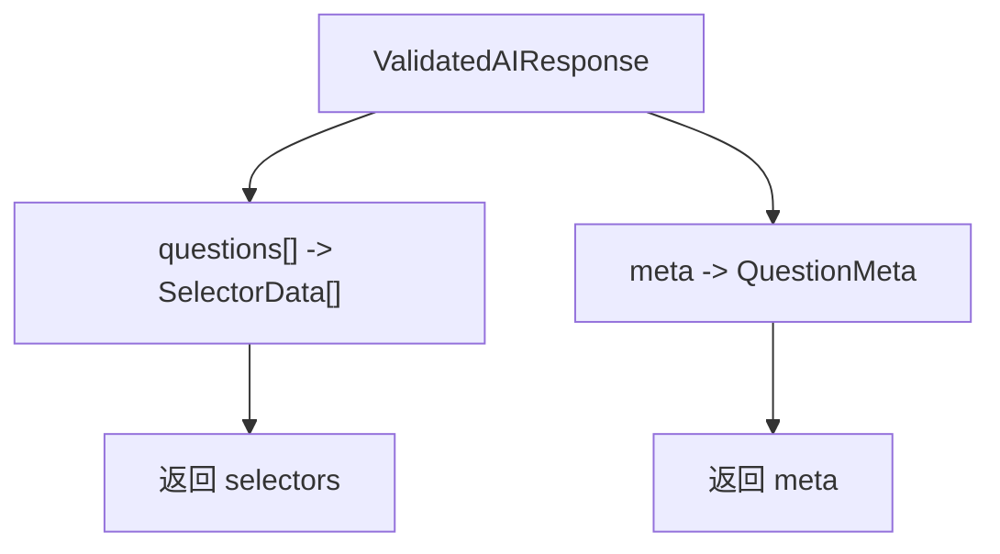
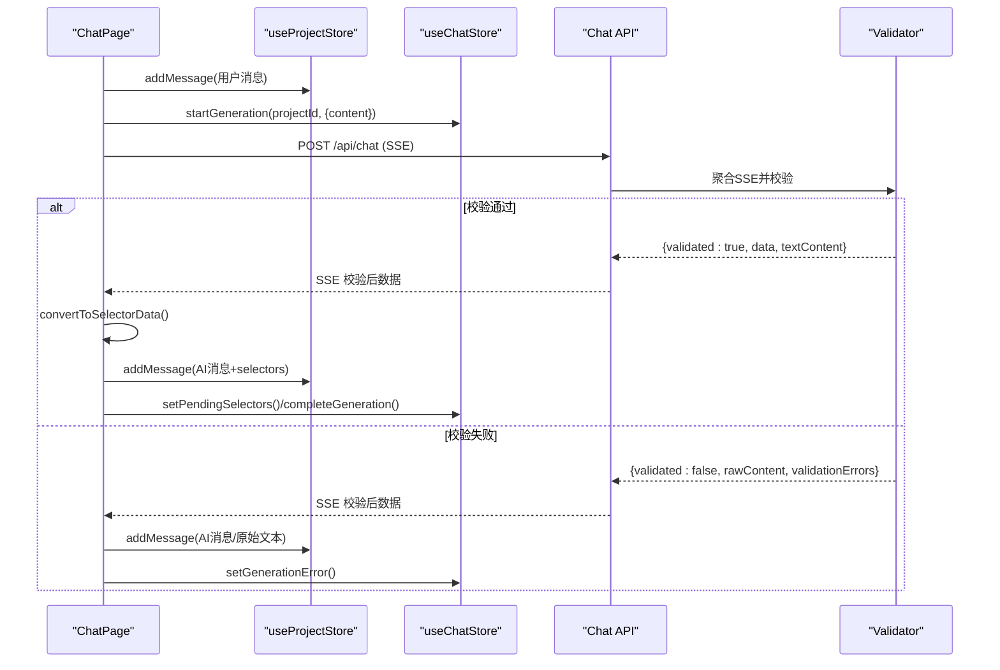
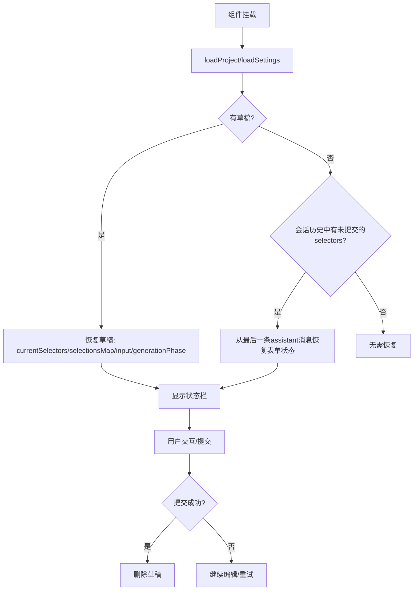
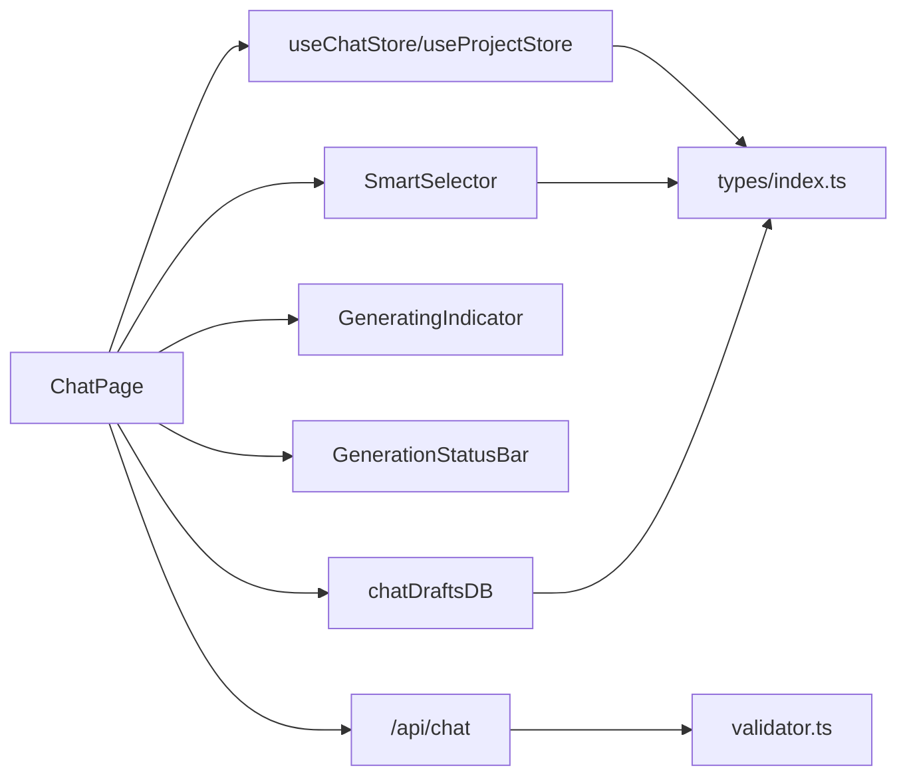

# 前端对话界面

<cite>
**本文引用的文件**
- [chat/page.tsx](file://prd-generator/src/app/project/[id]/chat/page.tsx)
- [store/index.ts](file://prd-generator/src/store/index.ts)
- [smart-selector.tsx](file://prd-generator/src/components/smart-selector.tsx)
- [db.ts](file://prd-generator/src/lib/db.ts)
- [types/index.ts](file://prd-generator/src/types/index.ts)
- [api/chat/route.ts](file://prd-generator/src/app/api/chat/route.ts)
- [validator.ts](file://prd-generator/src/lib/validator.ts)
- [generating-indicator.tsx](file://prd-generator/src/components/generating-indicator.tsx)
- [generation-status-bar.tsx](file://prd-generator/src/components/generation-status-bar.tsx)
</cite>

## 目录
1. [简介](#简介)
2. [项目结构](#项目结构)
3. [核心组件](#核心组件)
4. [架构总览](#架构总览)
5. [详细组件分析](#详细组件分析)
6. [依赖关系分析](#依赖关系分析)
7. [性能考量](#性能考量)
8. [故障排查指南](#故障排查指南)
9. [结论](#结论)

## 简介
本文件深入解析“项目对话”页面（/project/[id]/chat）的实现机制，围绕以下目标展开：
- 如何通过 useChatStore 订阅项目特定的生成任务状态（chatTask），并基于 generationPhase 动态渲染不同 UI 状态（生成中、交互式选择、错误恢复）。
- SmartSelector 组件如何根据 SelectorData 类型（单选/多选/下拉/文本）渲染相应输入控件，并通过 handleSelectorChange 实现受控组件模式下的选择状态管理。
- convertToSelectorData 函数如何将 AI 返回的校验后 JSON 数据转换为前端可用的选择器数据结构。
- 结合 sendMessage 函数，阐述用户输入或选择提交后，消息如何通过 addMessage 存入项目会话历史，并触发新的 AI 请求。
- 防抖草稿保存机制（chatDraftsDB.save）如何在组件卸载或状态变更时自动持久化未提交的表单数据，以及 restoreFormState 如何从本地数据库恢复中断的对话状态。

## 项目结构
该页面位于 Next.js App Router 的约定式路由中，采用客户端组件模式，配合 Zustand store、Dexie 本地数据库与后端 API，形成“前端对话 + 后端校验 + 本地持久化”的闭环。

图表来源
- [chat/page.tsx](file://prd-generator/src/app/project/[id]/chat/page.tsx#L1-L762)
- [store/index.ts](file://prd-generator/src/store/index.ts#L259-L530)
- [smart-selector.tsx](file://prd-generator/src/components/smart-selector.tsx#L1-L226)
- [generating-indicator.tsx](file://prd-generator/src/components/generating-indicator.tsx#L1-L130)
- [generation-status-bar.tsx](file://prd-generator/src/components/generation-status-bar.tsx#L1-L125)
- [db.ts](file://prd-generator/src/lib/db.ts#L140-L166)
- [api/chat/route.ts](file://prd-generator/src/app/api/chat/route.ts#L257-L426)
- [validator.ts](file://prd-generator/src/lib/validator.ts#L1-L274)
- [types/index.ts](file://prd-generator/src/types/index.ts#L1-L243)

章节来源
- [chat/page.tsx](file://prd-generator/src/app/project/[id]/chat/page.tsx#L1-L762)

## 核心组件
- useChatStore：按项目 ID 隔离的聊天生成任务状态机，负责管理 generationPhase、currentStep、pendingSelectors、错误与取消等。
- SmartSelector：受控/非受控双模式的选择器渲染器，支持 radio、checkbox、dropdown、text 四种类型。
- GeneratingIndicator：生成中进度指示器，展示步骤与预计剩余时间。
- GenerationStatusBar：交互/错误/超时状态栏，提供重试与关闭等操作。
- chatDraftsDB：本地数据库封装，用于草稿持久化与恢复。
- convertToSelectorData：将后端校验后的结构化数据转换为前端 SelectorData。
- sendMessage：统一的消息发送流程，负责 addMessage、触发生成、消费后端 SSE 并更新 UI。

章节来源
- [store/index.ts](file://prd-generator/src/store/index.ts#L259-L530)
- [smart-selector.tsx](file://prd-generator/src/components/smart-selector.tsx#L1-L226)
- [generating-indicator.tsx](file://prd-generator/src/components/generating-indicator.tsx#L1-L130)
- [generation-status-bar.tsx](file://prd-generator/src/components/generation-status-bar.tsx#L1-L125)
- [db.ts](file://prd-generator/src/lib/db.ts#L140-L166)
- [types/index.ts](file://prd-generator/src/types/index.ts#L1-L243)
- [chat/page.tsx](file://prd-generator/src/app/project/[id]/chat/page.tsx#L34-L55)
- [chat/page.tsx](file://prd-generator/src/app/project/[id]/chat/page.tsx#L226-L387)

## 架构总览
前端对话界面的运行时流程如下：
- 页面挂载后，加载项目与设置；组件卸载时安全中断并重置生成任务。
- 从本地草稿或会话历史恢复表单状态；若无草稿则从最后一条未被提交的 assistant 消息恢复。
- 用户输入或选择提交后，sendMessage 将用户消息写入会话历史，启动生成流程，向 /api/chat 发起请求。
- 后端 API 对 AI 响应进行流式聚合与结构化校验，返回校验后的结构化数据或原始内容+错误。
- 前端收到校验通过的数据后，转换为 SelectorData，渲染交互式选择器；否则进入错误状态。
- 选择器采用受控模式，统一收集选择状态；提交时将所有选择合并为一条用户消息再次发起请求。
- 期间通过防抖草稿保存机制持久化当前表单状态，支持中断恢复。

图表来源
- [chat/page.tsx](file://prd-generator/src/app/project/[id]/chat/page.tsx#L226-L387)
- [api/chat/route.ts](file://prd-generator/src/app/api/chat/route.ts#L257-L426)
- [validator.ts](file://prd-generator/src/lib/validator.ts#L1-L274)
- [store/index.ts](file://prd-generator/src/store/index.ts#L259-L530)
- [db.ts](file://prd-generator/src/lib/db.ts#L140-L166)

## 详细组件分析

### useChatStore 与 generationPhase 状态机
- 任务隔离：按 projectId 维护 tasks 映射，getTask 不存在时返回默认任务状态。
- 生命周期管理：startGeneration、advanceStep、setStepByIndex、completeGeneration、cancelGeneration、setGenerationError、updateElapsedTime、resetGeneration、abortAndReset、clearTask。
- 关键字段：generationPhase（idle/generating/rendering/interactive/error/timeout）、currentStep、stepIndex、pendingSelectors、questionMeta、error、isStreaming、canCancel、abortController、retryParams。
- 订阅方式：ChatPage 通过 useChatStore(state => state.tasks[projectId]) 订阅当前项目任务，解构 generationPhase、currentStep、elapsedTime、pendingSelectors 等。

图表来源
- [store/index.ts](file://prd-generator/src/store/index.ts#L259-L530)

章节来源
- [store/index.ts](file://prd-generator/src/store/index.ts#L259-L530)
- [chat/page.tsx](file://prd-generator/src/app/project/[id]/chat/page.tsx#L84-L96)

### SmartSelector 组件与受控模式
- 受控模式：通过 value 与 onChange 接收外部状态，适合统一提交场景。
- 非受控模式：通过 onSubmit 在内部维护状态，适合单个选择器独立提交。
- 类型渲染：radio、checkbox、dropdown、text 分别渲染对应 UI。
- 提交按钮：非受控模式显示确认按钮；受控模式不显示，由父组件统一提交。
- 已选提示：受控模式显示“已选择”徽标，增强反馈。

图表来源
- [smart-selector.tsx](file://prd-generator/src/components/smart-selector.tsx#L1-L226)

章节来源
- [smart-selector.tsx](file://prd-generator/src/components/smart-selector.tsx#L1-L226)
- [types/index.ts](file://prd-generator/src/types/index.ts#L1-L60)

### convertToSelectorData：结构化数据转换
- 输入：后端校验后的结构化响应 ValidatedAIResponse。
- 输出：selectors（SelectorData[]）、meta（QuestionMeta）。
- 转换逻辑：遍历 questions，映射 id、type、question、options、required；同时提取 meta 中的 phase、progress、canGeneratePRD、suggestedNextTopic。

图表来源
- [chat/page.tsx](file://prd-generator/src/app/project/[id]/chat/page.tsx#L34-L55)
- [types/index.ts](file://prd-generator/src/types/index.ts#L1-L60)
- [types/index.ts](file://prd-generator/src/types/index.ts#L159-L171)

章节来源
- [chat/page.tsx](file://prd-generator/src/app/project/[id]/chat/page.tsx#L34-L55)
- [types/index.ts](file://prd-generator/src/types/index.ts#L1-L60)
- [types/index.ts](file://prd-generator/src/types/index.ts#L159-L171)

### sendMessage：消息发送与请求链路
- 校验 API Key：若未配置则提示并终止。
- addMessage：将用户消息写入当前项目会话历史。
- startGeneration：启动生成状态，清空待渲染选择器，显示状态栏。
- fetch /api/chat：携带 AbortSignal，读取 SSE 流，聚合后端响应。
- 校验通过：convertToSelectorData 转换为前端结构，addMessage 写入 AI 消息（含 selectors），setPendingSelectors/currentSelectors 初始化选择状态，completeGeneration 进入交互态。
- 校验失败：addMessage 写入原始文本，setGenerationError 进入错误态。
- 异常处理：AbortError 不视为错误；其他错误统一 toast 并设置错误状态。

图表来源
- [chat/page.tsx](file://prd-generator/src/app/project/[id]/chat/page.tsx#L226-L387)
- [api/chat/route.ts](file://prd-generator/src/app/api/chat/route.ts#L257-L426)
- [validator.ts](file://prd-generator/src/lib/validator.ts#L1-L274)

章节来源
- [chat/page.tsx](file://prd-generator/src/app/project/[id]/chat/page.tsx#L226-L387)
- [api/chat/route.ts](file://prd-generator/src/app/api/chat/route.ts#L257-L426)
- [validator.ts](file://prd-generator/src/lib/validator.ts#L1-L274)

### 草稿保存与恢复：防抖与本地持久化
- 防抖保存：监听 currentSelectors、selectionsMap、questionMeta、generationPhase、input，300ms 防抖后调用 chatDraftsDB.save，持久化当前待交互的选择器、已选值、问题元数据、生成阶段与输入草稿。
- 组件卸载：在 useEffect 返回的清理函数中调用 abortAndReset，安全中断并重置任务。
- 恢复策略：
  - 优先从 chatDraftsDB.get(projectId) 恢复：若存在 currentSelectors 则恢复表单状态、设置 generationPhase 为交互态并显示状态栏。
  - 若无草稿，从当前项目会话历史倒序查找最后一条带 selectors 的 assistant 消息，若其后无用户回复则恢复表单状态并进入交互态。
- 提交成功：删除草稿，避免重复恢复。

图表来源
- [chat/page.tsx](file://prd-generator/src/app/project/[id]/chat/page.tsx#L122-L167)
- [chat/page.tsx](file://prd-generator/src/app/project/[id]/chat/page.tsx#L389-L417)
- [db.ts](file://prd-generator/src/lib/db.ts#L140-L166)

章节来源
- [chat/page.tsx](file://prd-generator/src/app/project/[id]/chat/page.tsx#L122-L167)
- [chat/page.tsx](file://prd-generator/src/app/project/[id]/chat/page.tsx#L389-L417)
- [db.ts](file://prd-generator/src/lib/db.ts#L140-L166)

### UI 状态渲染：generationPhase 驱动
- 生成中（generating）：显示 GeneratingIndicator 与若干 SelectorSkeleton 占位。
- 交互式（interactive）：渲染当前 selectors，统一提交按钮，必填项校验与提示。
- 错误（error）：显示错误状态栏与提示信息。
- 超时（timeout）：显示超时状态栏与重试入口。

章节来源
- [chat/page.tsx](file://prd-generator/src/app/project/[id]/chat/page.tsx#L646-L724)
- [generating-indicator.tsx](file://prd-generator/src/components/generating-indicator.tsx#L1-L130)
- [generation-status-bar.tsx](file://prd-generator/src/components/generation-status-bar.tsx#L1-L125)
- [types/index.ts](file://prd-generator/src/types/index.ts#L126-L134)

## 依赖关系分析
- 页面依赖 store：useChatStore、useProjectStore、useSettingsStore。
- 页面依赖 UI 组件：SmartSelector、GeneratingIndicator、GenerationStatusBar。
- 页面依赖本地数据库：chatDraftsDB。
- 页面依赖后端 API：/api/chat，依赖 validator 进行结构化校验。
- 类型定义：SelectorData、QuestionMeta、GenerationPhase、GenerationStep 等。

图表来源
- [chat/page.tsx](file://prd-generator/src/app/project/[id]/chat/page.tsx#L1-L762)
- [store/index.ts](file://prd-generator/src/store/index.ts#L259-L530)
- [smart-selector.tsx](file://prd-generator/src/components/smart-selector.tsx#L1-L226)
- [generating-indicator.tsx](file://prd-generator/src/components/generating-indicator.tsx#L1-L130)
- [generation-status-bar.tsx](file://prd-generator/src/components/generation-status-bar.tsx#L1-L125)
- [db.ts](file://prd-generator/src/lib/db.ts#L140-L166)
- [api/chat/route.ts](file://prd-generator/src/app/api/chat/route.ts#L257-L426)
- [validator.ts](file://prd-generator/src/lib/validator.ts#L1-L274)
- [types/index.ts](file://prd-generator/src/types/index.ts#L1-L243)

章节来源
- [chat/page.tsx](file://prd-generator/src/app/project/[id]/chat/page.tsx#L1-L762)
- [store/index.ts](file://prd-generator/src/store/index.ts#L259-L530)
- [types/index.ts](file://prd-generator/src/types/index.ts#L1-L243)

## 性能考量
- 流式读取与解码：后端聚合 SSE 流，前端按行解码，避免一次性拼接大字符串带来的内存压力。
- 防抖草稿保存：300ms 防抖减少频繁写库，降低 I/O 压力。
- 生成进度模拟：前端定时器推进 stepIndex 与 elapsed 时间，避免与后端强耦合。
- 选择器受控模式：统一收集状态，减少重复渲染与事件风暴。
- 本地数据库：Dexie 基于 IndexedDB，适合小体量草稿持久化；注意清理过期草稿与完成任务的策略。

[本节为通用指导，不直接分析具体文件]

## 故障排查指南
- API Key 未配置：sendMessage 会在未配置时提示并终止，检查设置页。
- 生成失败：查看 GenerationStatusBar 错误提示，点击重试；必要时检查网络与后端日志。
- 选择器不可用：isStreaming 为真时禁用输入与选择器，等待生成完成。
- 草稿未恢复：确认 chatDraftsDB 中是否存在对应 projectId 的草稿；若无则需从会话历史恢复。
- 取消生成：cancelGeneration 会重置任务并停止流式请求，注意 AbortError 不作为错误处理。

章节来源
- [chat/page.tsx](file://prd-generator/src/app/project/[id]/chat/page.tsx#L226-L387)
- [generation-status-bar.tsx](file://prd-generator/src/components/generation-status-bar.tsx#L1-L125)
- [store/index.ts](file://prd-generator/src/store/index.ts#L433-L456)

## 结论
该项目对话界面通过“前端受控选择器 + 后端结构化校验 + 本地草稿持久化”的组合，实现了稳定、可恢复、可交互的对话体验。useChatStore 的 generationPhase 驱动 UI 状态切换，SmartSelector 提供一致的选择器体验，convertToSelectorData 保证了前后端数据契约的一致性。sendMessage 将用户输入与 AI 生成串联起来，形成完整的对话闭环；防抖草稿保存与恢复机制提升了中断场景下的用户体验。