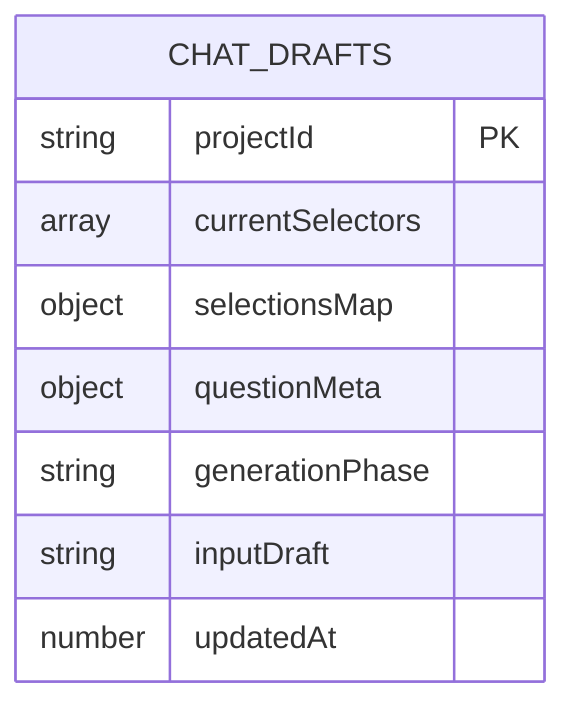
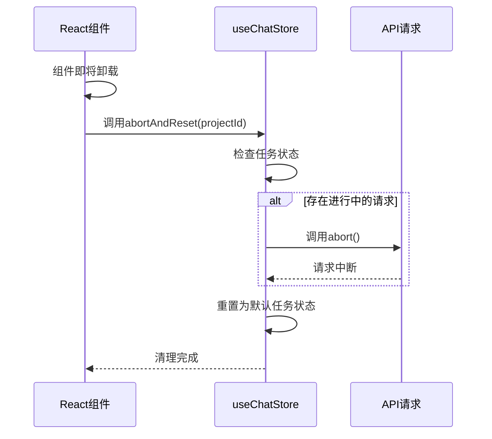
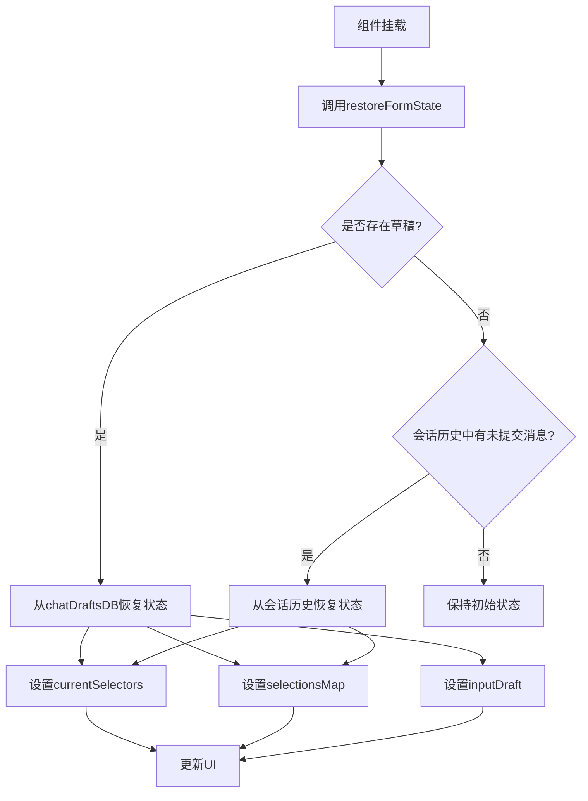
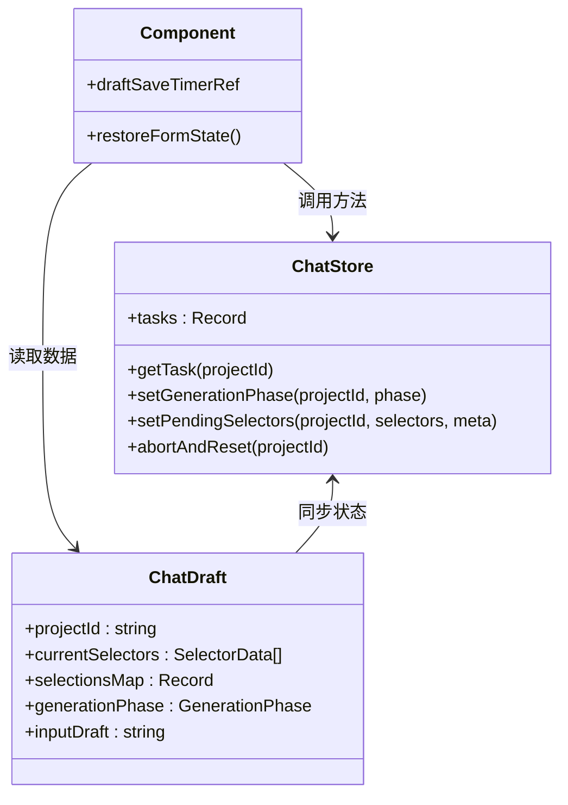

# 数据持久化与恢复

<cite>
**本文档引用的文件**
- [db.ts](file://prd-generator\src\lib\db.ts)
- [page.tsx](file://prd-generator\src\app\project\[id]\chat\page.tsx)
- [index.ts](file://prd-generator\src\store\index.ts)
- [types/index.ts](file://prd-generator\src\types\index.ts)
</cite>

## 目录
1. [简介](#简介)
2. [本地数据持久化机制](#本地数据持久化机制)
3. [自动保存与防抖策略](#自动保存与防抖策略)
4. [组件卸载时的安全清理](#组件卸载时的安全清理)
5. [表单状态恢复流程](#表单状态恢复流程)
6. [内存状态同步机制](#内存状态同步机制)

## 简介
本系统通过IndexedDB实现对话界面的本地数据持久化与恢复功能，确保用户在中断操作后能够无缝继续。系统利用`chatDraftsDB`存储未提交的表单草稿，并通过`useEffect`和防抖定时器实现自动保存。当组件挂载时，优先从持久化存储恢复中断的对话状态，若无草稿则从会话历史中重建表单状态。

## 本地数据持久化机制

系统使用Dexie.js封装IndexedDB，创建名为`PRDDatabase`的数据库实例，其中包含`chatDrafts`对象仓库用于存储聊天草稿。`chatDraftsDB`提供了一组操作函数，包括`get`、`save`和`delete`，用于管理项目相关的草稿数据。

`ChatDraft`接口定义了需要持久化的表单状态，包括：
- `currentSelectors`：当前待交互的选择器
- `selectionsMap`：用户已选择但未提交的值映射
- `questionMeta`：问题元数据
- `generationPhase`：生成阶段
- `inputDraft`：输入框暂存内容
- `updatedAt`：更新时间戳



**图表来源**
- [db.ts](file://prd-generator\src\lib\db.ts#L9)
- [types/index.ts](file://prd-generator\src\types\index.ts#L228-L242)

**本节来源**
- [db.ts](file://prd-generator\src\lib\db.ts#L139-L166)
- [types/index.ts](file://prd-generator\src\types\index.ts#L228-L242)

## 自动保存与防抖策略

系统采用`useEffect`结合防抖定时器的策略，在用户输入时自动保存草稿。`draftSaveTimerRef`作为`useRef`引用的定时器句柄，用于管理防抖逻辑。

当表单状态发生变化时（`currentSelectors`、`selectionsMap`、`input`等），`useEffect`监听这些依赖项的变化，清除之前的定时器并启动新的300ms延迟定时器。这种防抖机制避免了频繁的数据库写入操作，提高了性能。

草稿保存仅在存在待处理选择器时触发，确保不会保存空状态。保存操作通过`chatDraftsDB.save()`方法执行，将当前表单状态连同项目ID和更新时间一起存入IndexedDB。

```mermaid
flowchart TD
A[表单状态变化] --> B{是否有选择器?}
B --> |否| C[不保存]
B --> |是| D[清除之前的定时器]
D --> E[启动300ms防抖定时器]
E --> F[定时器到期]
F --> G[调用chatDraftsDB.save()]
G --> H[保存草稿到IndexedDB]
```

**图表来源**
- [page.tsx](file://prd-generator\src\app\project\[id]\chat\page.tsx#L400-L408)
- [db.ts](file://prd-generator\src\lib\db.ts#L147-L154)

**本节来源**
- [page.tsx](file://prd-generator\src\app\project\[id]\chat\page.tsx#L108-L110)
- [page.tsx](file://prd-generator\src\app\project\[id]\chat\page.tsx#L390-L416)

## 组件卸载时的安全清理

组件卸载时，通过`useEffect`的清理函数调用`abortAndReset(projectId)`方法，确保进行中的请求被安全中断并清理相关状态。

`abortAndReset`函数首先检查是否存在与当前项目关联的`AbortController`，如果存在且生成阶段为"generating"，则调用`abort()`方法中断正在进行的请求。随后，该函数将内存中的任务状态重置为默认值，清除所有临时数据，防止内存泄漏。

这种按`projectId`隔离的清理机制确保了多项目环境下的状态独立性，避免了不同项目间的状态污染。



**图表来源**
- [page.tsx](file://prd-generator\src\app\project\[id]\chat\page.tsx#L117-L118)
- [index.ts](file://prd-generator\src\store\index.ts#L506-L517)

**本节来源**
- [page.tsx](file://prd-generator\src\app\project\[id]\chat\page.tsx#L116-L119)
- [index.ts](file://prd-generator\src\store\index.ts#L506-L517)

## 表单状态恢复流程

组件挂载后，通过`useEffect`执行`restoreFormState`函数，优先从`chatDraftsDB`恢复中断的对话状态。恢复流程采用优先级策略：

1. 首先尝试从`chatDraftsDB`获取项目对应的草稿数据
2. 如果存在有效草稿（`currentSelectors`长度大于0），则使用草稿中的数据恢复表单状态
3. 如果无有效草稿，则从会话历史中查找最后一条包含选择器的助手消息
4. 检查该消息后是否有用户回复，若无回复则认为是未提交的状态，从中恢复表单

这种双重恢复机制确保了即使用户关闭了浏览器或系统崩溃，也能最大程度地恢复工作进度。



**图表来源**
- [page.tsx](file://prd-generator\src\app\project\[id]\chat\page.tsx#L126-L164)
- [db.ts](file://prd-generator\src\lib\db.ts#L142-L144)

**本节来源**
- [page.tsx](file://prd-generator\src\app\project\[id]\chat\page.tsx#L122-L165)

## 内存状态同步机制

状态恢复后，系统通过`useChatStore`的`setGenerationPhase`等方法同步更新内存中的生成任务状态。`useChatStore`是一个Zustand状态管理store，按`projectId`隔离不同项目的任务状态。

当从草稿恢复`generationPhase`时，调用`setGenerationPhase(projectId, draft.generationPhase)`更新内存中的状态。同时，`setPendingSelectors`方法用于恢复待处理的选择器和问题元数据。

这种状态同步机制确保了UI组件与全局状态的一致性，避免了状态不一致导致的UI错乱。所有状态更新都通过store的setter方法进行，保证了状态变更的可追踪性和可预测性。



**图表来源**
- [index.ts](file://prd-generator\src\store\index.ts#L300-L358)
- [page.tsx](file://prd-generator\src\app\project\[id]\chat\page.tsx#L133-L134)
- [types/index.ts](file://prd-generator\src\types\index.ts#L228-L242)

**本节来源**
- [page.tsx](file://prd-generator\src\app\project\[id]\chat\page.tsx#L71-L82)
- [index.ts](file://prd-generator\src\store\index.ts#L300-L358)