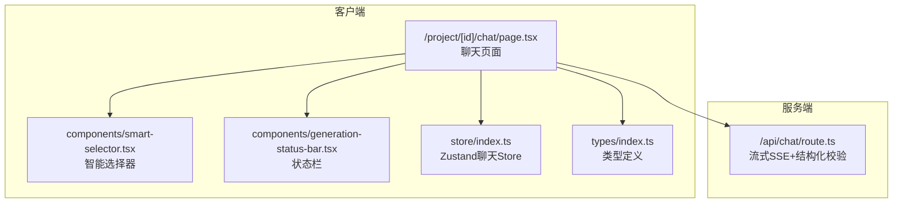
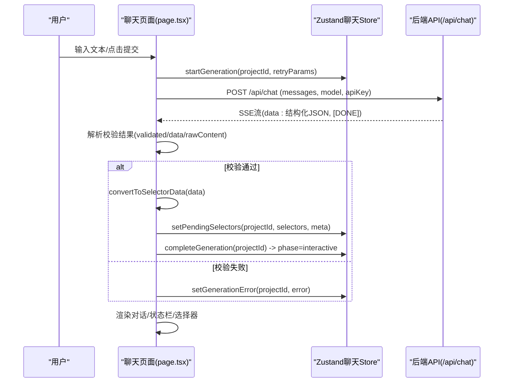
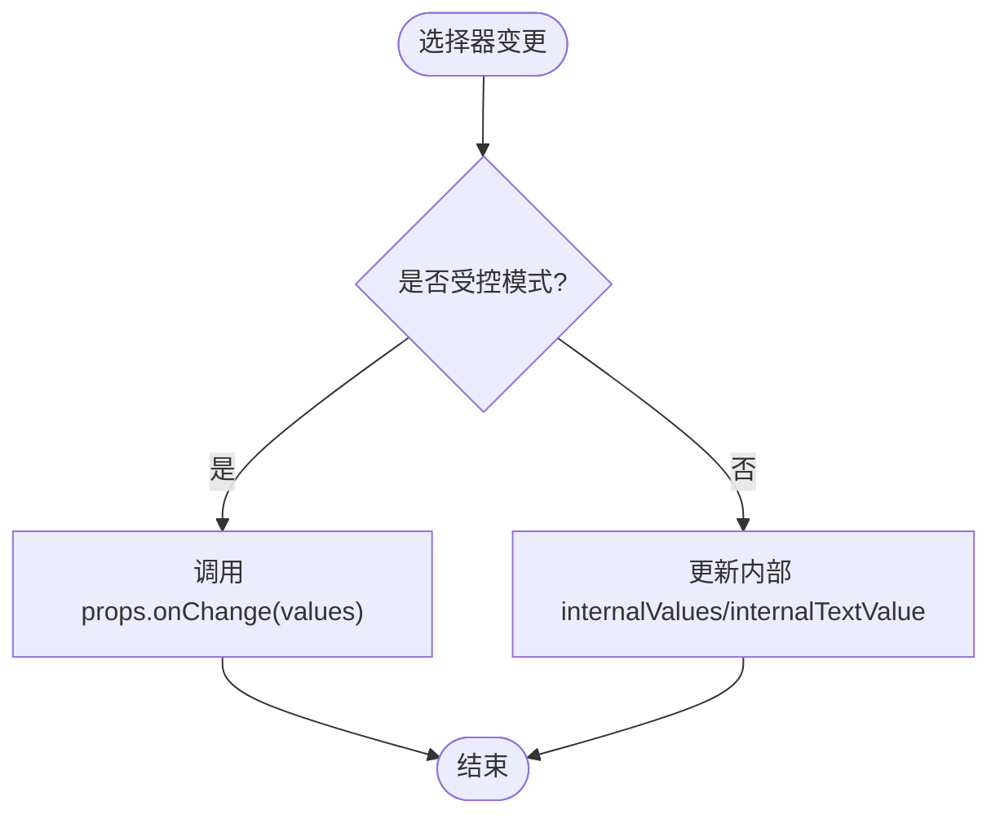
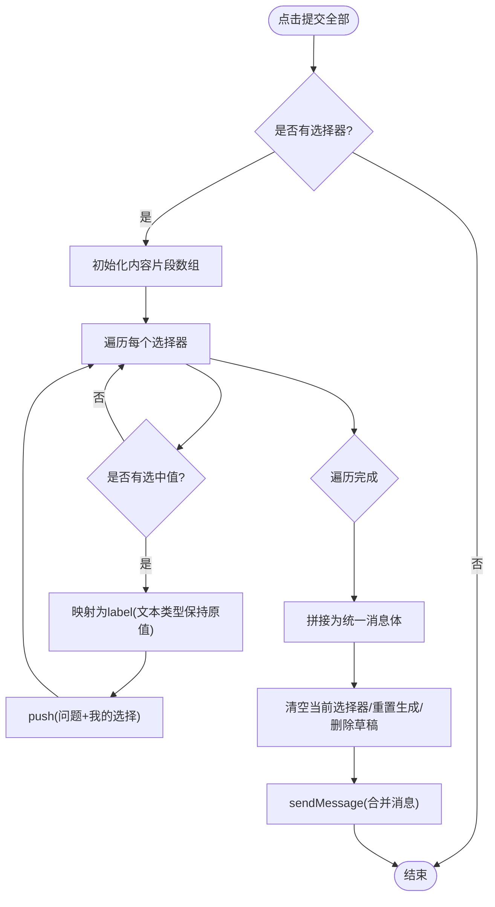
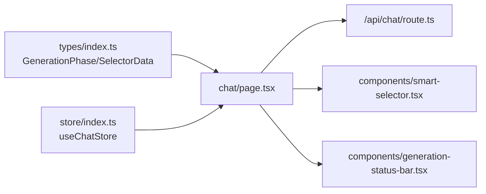

# UI渲染与事件处理

<cite>
**本文引用的文件**
- [chat/page.tsx](file://prd-generator/src/app/project/[id]/chat/page.tsx)
- [smart-selector.tsx](file://prd-generator/src/components/smart-selector.tsx)
- [store/index.ts](file://prd-generator/src/store/index.ts)
- [types/index.ts](file://prd-generator/src/types/index.ts)
- [generation-status-bar.tsx](file://prd-generator/src/components/generation-status-bar.tsx)
- [api/chat/route.ts](file://prd-generator/src/app/api/chat/route.ts)
</cite>

## 目录
1. [引言](#引言)
2. [项目结构](#项目结构)
3. [核心组件](#核心组件)
4. [架构总览](#架构总览)
5. [详细组件分析](#详细组件分析)
6. [依赖分析](#依赖分析)
7. [性能考虑](#性能考虑)
8. [故障排查指南](#故障排查指南)
9. [结论](#结论)

## 引言
本文件围绕 `/project/[id]/chat` 页面的UI渲染与事件处理展开，重点说明：
- 如何根据 generationPhase 动态渲染不同UI状态（生成中、交互式选择、错误恢复）
- SmartSelector 组件如何基于 selector.type 渲染单选、多选、下拉或文本输入，并通过受控模式 handleSelectorChange 实现状态同步
- handleSubmitAll 如何聚合所有选择器的值并构建统一消息内容，再通过 sendMessage 触发新的AI请求
- handleSend 和 handleKeyDown 如何处理用户文本输入
- handleCancelGeneration 如何通过 cancelGeneration 中断流式请求
- 结合 scrollRef 和 useEffect 的自动滚动到底部机制

## 项目结构
该页面位于 Next.js App Router 的动态路由下，采用客户端组件模式，配合 Zustand store 管理生成任务状态，后端通过 /api/chat 提供流式SSE响应并进行结构化校验。

图表来源
- [chat/page.tsx](file://prd-generator/src/app/project/[id]/chat/page.tsx#L574-L761)
- [smart-selector.tsx](file://prd-generator/src/components/smart-selector.tsx#L1-L225)
- [generation-status-bar.tsx](file://prd-generator/src/components/generation-status-bar.tsx#L1-L96)
- [store/index.ts](file://prd-generator/src/store/index.ts#L295-L530)
- [types/index.ts](file://prd-generator/src/types/index.ts#L126-L171)
- [api/chat/route.ts](file://prd-generator/src/app/api/chat/route.ts#L257-L426)

章节来源
- [chat/page.tsx](file://prd-generator/src/app/project/[id]/chat/page.tsx#L574-L761)
- [store/index.ts](file://prd-generator/src/store/index.ts#L295-L530)
- [types/index.ts](file://prd-generator/src/types/index.ts#L126-L171)

## 核心组件
- generationPhase 控制UI状态机：idle、generating、rendering、interactive、error、timeout
- SmartSelector：受控模式渲染多种选择器控件，统一 onChange 回调
- 选择器聚合提交：handleSubmitAll 将 selectionsMap 聚合为统一消息体
- 文本输入与快捷键：handleSend 与 handleKeyDown
- 取消生成：handleCancelGeneration 调用 cancelGeneration 中断流式请求
- 自动滚动：useEffect + scrollRef 将容器滚动到底部

章节来源
- [types/index.ts](file://prd-generator/src/types/index.ts#L126-L171)
- [chat/page.tsx](file://prd-generator/src/app/project/[id]/chat/page.tsx#L169-L174)
- [smart-selector.tsx](file://prd-generator/src/components/smart-selector.tsx#L1-L225)
- [store/index.ts](file://prd-generator/src/store/index.ts#L433-L456)

## 架构总览
聊天页面通过 fetch('/api/chat') 发起请求，后端以SSE流返回结构化数据；前端收到后端校验通过的数据后，统一渲染AI消息与待交互的选择器，并切换到 interactive 状态。期间 generationPhase 驱动UI状态切换，Zustand store 管理生成任务生命周期。

图表来源
- [chat/page.tsx](file://prd-generator/src/app/project/[id]/chat/page.tsx#L226-L387)
- [store/index.ts](file://prd-generator/src/store/index.ts#L326-L431)
- [api/chat/route.ts](file://prd-generator/src/app/api/chat/route.ts#L257-L426)

## 详细组件分析

### generationPhase 驱动的UI状态渲染
- 生成中（generating）：显示 GeneratingIndicator 与若干 SelectorSkeleton 占位
- 可交互（interactive）：渲染当前选择器列表，提供“提交全部”按钮与必填项提示
- 错误（error）：显示错误提示气泡
- 状态栏（GenerationStatusBar）：在 interactive/error/timeout 时展示，提供重试/关闭等操作

章节来源
- [chat/page.tsx](file://prd-generator/src/app/project/[id]/chat/page.tsx#L646-L723)
- [generation-status-bar.tsx](file://prd-generator/src/components/generation-status-bar.tsx#L1-L96)
- [store/index.ts](file://prd-generator/src/store/index.ts#L414-L475)

### SmartSelector 组件：受控渲染与状态同步
- 受控模式：通过 props.value 与 onChange 接收外部状态，内部不维护本地状态
- 非受控模式：内部维护 internalValues/internalTextValue，提供 onSubmit 提交
- 类型渲染：
  - radio：单选
  - checkbox：多选
  - dropdown：下拉
  - text：文本输入，支持选项建议按钮快速填充
- 受控模式下，handleSelectorChange 将变更写入父组件 selectionsMap，实现统一状态同步

图表来源
- [smart-selector.tsx](file://prd-generator/src/components/smart-selector.tsx#L46-L110)
- [smart-selector.tsx](file://prd-generator/src/components/smart-selector.tsx#L110-L225)

章节来源
- [smart-selector.tsx](file://prd-generator/src/components/smart-selector.tsx#L1-L225)

### handleSubmitAll：聚合选择器值并触发新请求
- 遍历 currentSelectors，依据 selectionsMap 获取每个选择器的值
- 将 values 转换为对应选项 label（text 类型保持原值）
- 拼接为统一内容片段，清空当前选择器与 selectionsMap，删除草稿
- 调用 sendMessage(contentParts.join('\n\n')) 发送合并后的用户选择

图表来源
- [chat/page.tsx](file://prd-generator/src/app/project/[id]/chat/page.tsx#L444-L480)

章节来源
- [chat/page.tsx](file://prd-generator/src/app/project/[id]/chat/page.tsx#L444-L480)

### handleSend 与 handleKeyDown：文本输入处理
- handleSend：在输入非空且非流式状态时，调用 sendMessage 并清空输入
- handleKeyDown：监听 Enter（不带 Shift）触发 handleSend，防止默认换行

章节来源
- [chat/page.tsx](file://prd-generator/src/app/project/[id]/chat/page.tsx#L524-L537)

### handleCancelGeneration：中断流式请求
- 调用 cancelGeneration(projectId)，内部通过 AbortController.abort() 中断请求
- 将任务状态重置为 idle，isStreaming=false，pendingSelectors 清空，禁用取消

章节来源
- [chat/page.tsx](file://prd-generator/src/app/project/[id]/chat/page.tsx#L505-L509)
- [store/index.ts](file://prd-generator/src/store/index.ts#L433-L456)

### 自动滚动到底部：scrollRef 与 useEffect
- 在 generationPhase 变化、对话消息变化、待选择器集合变化时，useEffect 将 scrollRef.current.scrollTop 设为 scrollHeight
- 保证新增消息或状态切换后，界面始终滚动至底部

章节来源
- [chat/page.tsx](file://prd-generator/src/app/project/[id]/chat/page.tsx#L169-L174)

## 依赖分析
- 类型依赖：GenerationPhase、GenerationStep、SelectorData、ConversationMessage 等
- 状态依赖：useChatStore 提供 startGeneration、completeGeneration、setGenerationError、cancelGeneration、setPendingSelectors、updateElapsedTime 等
- 组件依赖：SmartSelector 依赖 UI 组件库（radio-group、checkbox、select、input、button 等），GenerationStatusBar 展示状态栏
- 后端依赖：/api/chat 提供结构化SSE流，前端解析 validated/data/rawContent

图表来源
- [types/index.ts](file://prd-generator/src/types/index.ts#L126-L171)
- [store/index.ts](file://prd-generator/src/store/index.ts#L295-L530)
- [chat/page.tsx](file://prd-generator/src/app/project/[id]/chat/page.tsx#L574-L761)
- [api/chat/route.ts](file://prd-generator/src/app/api/chat/route.ts#L257-L426)
- [smart-selector.tsx](file://prd-generator/src/components/smart-selector.tsx#L1-L225)
- [generation-status-bar.tsx](file://prd-generator/src/components/generation-status-bar.tsx#L1-L96)

章节来源
- [types/index.ts](file://prd-generator/src/types/index.ts#L126-L171)
- [store/index.ts](file://prd-generator/src/store/index.ts#L295-L530)

## 性能考虑
- 选择器聚合提交：handleSubmitAll 将多次交互合并为一次消息发送，减少后端往返与对话碎片化
- 受控模式：SmartSelector 在受控模式下不维护内部状态，避免重复渲染与状态漂移
- 自动滚动：useEffect 仅在关键依赖变化时触发滚动，避免频繁 DOM 访问
- 流式处理：后端以SSE流返回结构化数据，前端按行解析，减少一次性大对象处理

## 故障排查指南
- 生成失败（error）：查看 GenerationStatusBar 的错误提示，点击重试；若仍失败，检查 API Key 配置与网络连通性
- 取消生成：点击状态栏取消按钮或生成进度条上的取消，确认 isStreaming=false、phase=idle
- 文本输入无效：确认输入非空且非流式状态；Shift+Enter 可换行，Enter 触发提交
- 选择器不可用：在 isStreaming 或 generationPhase 不是 interactive 时会被禁用

章节来源
- [generation-status-bar.tsx](file://prd-generator/src/components/generation-status-bar.tsx#L1-L96)
- [chat/page.tsx](file://prd-generator/src/app/project/[id]/chat/page.tsx#L505-L537)
- [store/index.ts](file://prd-generator/src/store/index.ts#L433-L456)

## 结论
该页面通过 generationPhase 驱动UI状态机，结合受控选择器与统一提交策略，实现了从“生成中—交互式选择—错误恢复”的完整闭环。SmartSelector 以受控模式实现跨选择器状态同步，handleSubmitAll 将多轮交互聚合为一次请求，提升效率与一致性。handleCancelGeneration 与 scrollRef 的组合确保了良好的交互体验与可追溯性。