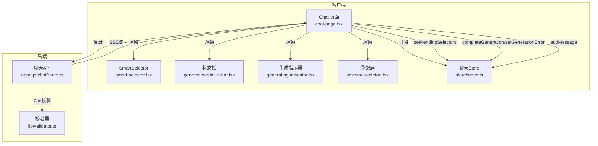
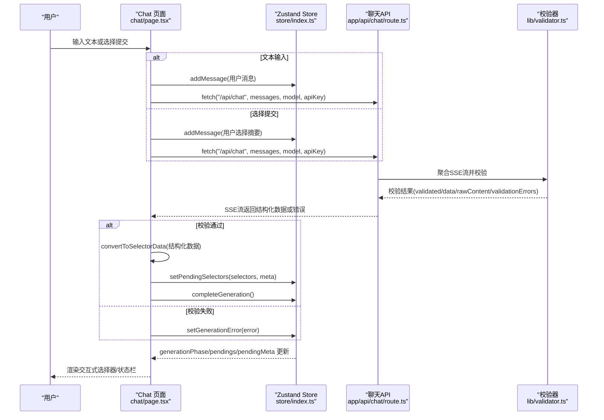
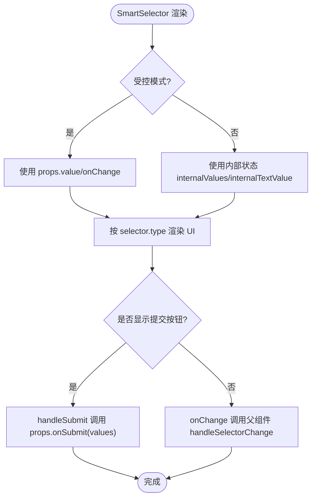
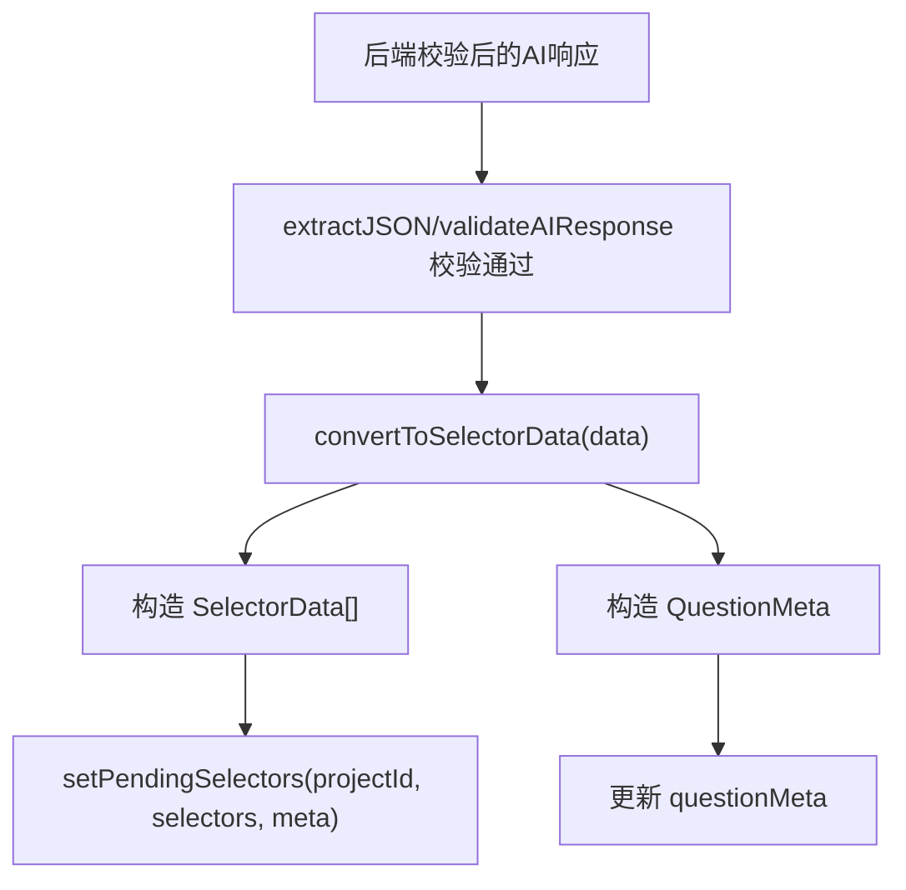
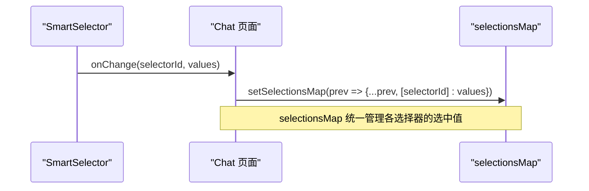
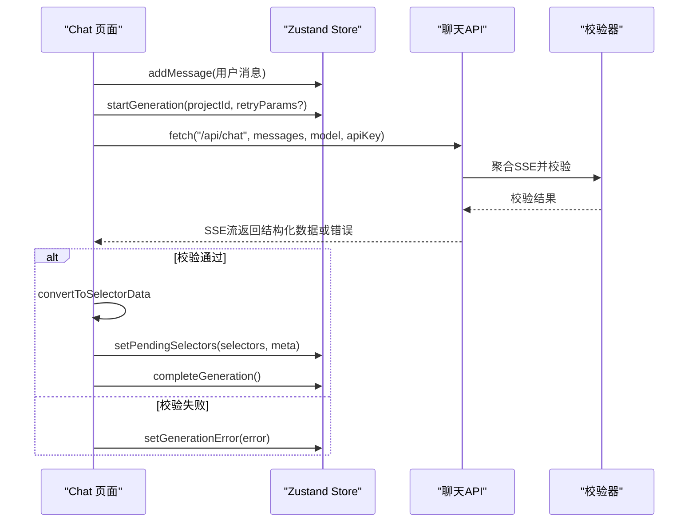
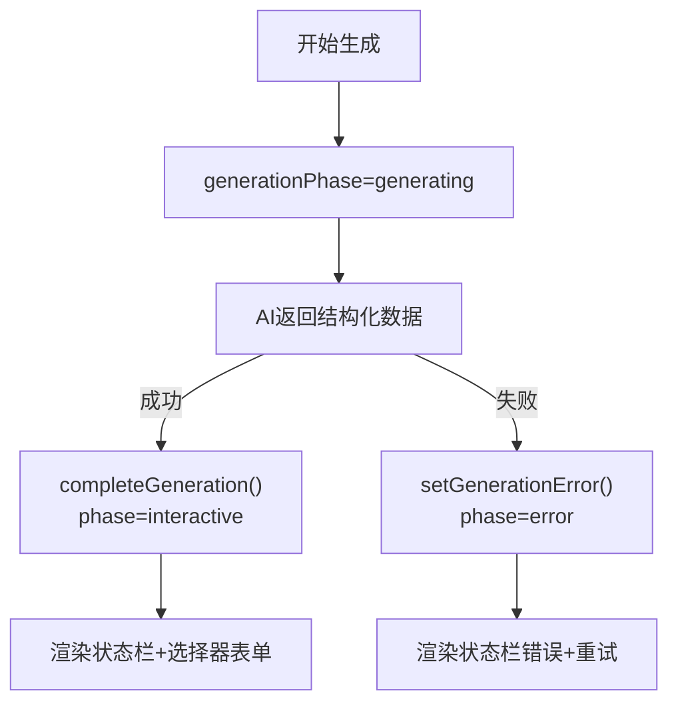
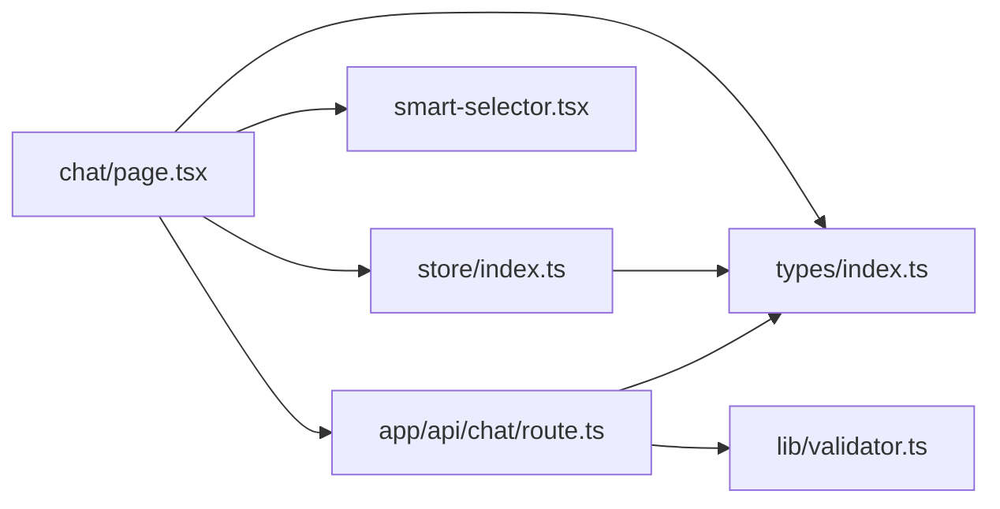

# 核心组件与状态交互

<cite>
**本文引用的文件**
- [chat/page.tsx](file://prd-generator/src/app/project/[id]/chat/page.tsx)
- [smart-selector.tsx](file://prd-generator/src/components/smart-selector.tsx)
- [index.ts](file://prd-generator/src/store/index.ts)
- [validator.ts](file://prd-generator/src/lib/validator.ts)
- [route.ts](file://prd-generator/src/app/api/chat/route.ts)
- [types/index.ts](file://prd-generator/src/types/index.ts)
- [generation-status-bar.tsx](file://prd-generator/src/components/generation-status-bar.tsx)
- [generating-indicator.tsx](file://prd-generator/src/components/generating-indicator.tsx)
- [selector-skeleton.tsx](file://prd-generator/src/components/selector-skeleton.tsx)
</cite>

## 目录
1. [引言](#引言)
2. [项目结构](#项目结构)
3. [核心组件](#核心组件)
4. [架构总览](#架构总览)
5. [详细组件分析](#详细组件分析)
6. [依赖分析](#依赖分析)
7. [性能考量](#性能考量)
8. [故障排查指南](#故障排查指南)
9. [结论](#结论)

## 引言
本文件聚焦于 /project/[id]/chat 页面中的核心UI组件与Zustand状态管理的交互机制，围绕以下目标展开：
- SmartSelector 如何通过 useChatStore 订阅 pendingSelectors 和 questionMeta，并依据 generationPhase 动态渲染“生成中”“交互式选择”“错误恢复”等状态。
- convertToSelectorData 如何将经后端校验的AI JSON转换为前端可用的选择器数据结构，并通过 setPendingSelectors 更新状态。
- handleSelectorChange 如何在受控模式下实现多选择器状态同步，并通过 selectionsMap 统一管理选择状态。
- 结合 sendMessage，阐述用户输入或选择提交后，消息如何通过 addMessage 存入项目会话历史，并触发新的AI请求。
- 分析 completeGeneration 与 setGenerationError 等状态变更函数如何驱动UI状态流转。

## 项目结构
该页面采用“客户端组件 + Zustand 状态管理 + 后端校验 + SSE流”的架构：
- 客户端页面负责渲染UI、收集用户输入、维护 selectionsMap、调用Zustand与API。
- Zustand store 提供按 projectId 隔离的聊天生成任务状态（generationPhase、pendingSelectors、questionMeta等）。
- 后端API负责调用第三方模型，聚合SSE流，使用Zod校验AI输出，返回结构化数据或错误信息。
- 前端收到结构化数据后，转换为选择器数据并更新store，驱动UI进入“交互式选择”状态。

图表来源
- [chat/page.tsx](file://prd-generator/src/app/project/[id]/chat/page.tsx#L1-L762)
- [smart-selector.tsx](file://prd-generator/src/components/smart-selector.tsx#L1-L225)
- [generation-status-bar.tsx](file://prd-generator/src/components/generation-status-bar.tsx#L1-L96)
- [generating-indicator.tsx](file://prd-generator/src/components/generating-indicator.tsx#L1-L100)
- [selector-skeleton.tsx](file://prd-generator/src/components/selector-skeleton.tsx#L1-L63)
- [index.ts](file://prd-generator/src/store/index.ts#L295-L530)
- [route.ts](file://prd-generator/src/app/api/chat/route.ts#L1-L426)
- [validator.ts](file://prd-generator/src/lib/validator.ts#L1-L274)

章节来源
- [chat/page.tsx](file://prd-generator/src/app/project/[id]/chat/page.tsx#L1-L762)
- [index.ts](file://prd-generator/src/store/index.ts#L295-L530)

## 核心组件
- Chat 页面（chat/page.tsx）
  - 订阅 useChatStore 中当前项目的任务状态（generationPhase、pendingSelectors、questionMeta、isStreaming等），并据此渲染生成指示器、状态栏、选择器表单与输入区。
  - 实现 convertToSelectorData 将后端校验后的AI JSON转换为前端 SelectorData[] 与 QuestionMeta。
  - 实现 handleSelectorChange 在受控模式下更新 selectionsMap；handleSubmitAll 统一提交所有选择。
  - 实现 sendMessage，将用户消息写入会话历史后，向 /api/chat 发起SSE请求，接收结构化数据并更新store与UI。
  - 调用 completeGeneration 与 setGenerationError 驱动UI状态流转。
- SmartSelector（smart-selector.tsx）
  - 支持受控与非受控两种模式，内部维护非受控模式下的本地状态；对外暴露 value/onChange 或 onSubmit。
  - 根据 selector.type 渲染 radio/checkbox/dropdown/text，并提供“建议选项”快捷按钮。
- Zustand Chat Store（store/index.ts）
  - 提供按 projectId 隔离的任务状态，包括 generationPhase、pendingSelectors、questionMeta、currentStep、stepIndex、isStreaming、error、canCancel 等。
  - 提供 startGeneration、advanceStep、setPendingSelectors、completeGeneration、cancelGeneration、setGenerationError、updateElapsedTime、resetGeneration、abortAndReset、getAbortSignal、clearTask 等方法。
- 校验器与API（lib/validator.ts、app/api/chat/route.ts）
  - validator.ts 提供 extractJSON、validateAIResponse、checkCompleteness、buildRetryPrompt、aggregateSSEStream 等能力。
  - route.ts 调用第三方模型，聚合SSE流，使用Zod校验AI输出，支持自动重试与错误回退，最终以SSE流返回结构化数据或错误信息。

章节来源
- [chat/page.tsx](file://prd-generator/src/app/project/[id]/chat/page.tsx#L1-L762)
- [smart-selector.tsx](file://prd-generator/src/components/smart-selector.tsx#L1-L225)
- [index.ts](file://prd-generator/src/store/index.ts#L295-L530)
- [validator.ts](file://prd-generator/src/lib/validator.ts#L1-L274)
- [route.ts](file://prd-generator/src/app/api/chat/route.ts#L1-L426)

## 架构总览
下面的序列图展示了用户输入或选择提交后，消息如何通过 addMessage 写入会话历史，并触发新的AI请求与状态更新。

图表来源
- [chat/page.tsx](file://prd-generator/src/app/project/[id]/chat/page.tsx#L225-L387)
- [index.ts](file://prd-generator/src/store/index.ts#L398-L431)
- [route.ts](file://prd-generator/src/app/api/chat/route.ts#L257-L426)
- [validator.ts](file://prd-generator/src/lib/validator.ts#L91-L147)

## 详细组件分析

### SmartSelector 组件与受控模式
- 受控模式
  - 通过 props.value 与 onChange 接收外部状态，内部不维护本地状态。
  - 根据 selector.type 渲染不同UI，支持 radio/checkbox/dropdown/text，并提供“建议选项”快捷按钮。
  - 在 onChange 中将外部回调传回的值数组透传给父组件，便于统一管理 selectionsMap。
- 非受控模式
  - 内部维护 internalValues/internalTextValue，并提供 onSubmit 回调。
- 与 Chat 页面协作
  - Chat 页面在 generationPhase 为 interactive 时，将 currentSelectors 逐个交给 SmartSelector 渲染。
  - SmartSelector 的 value 来自 selectionsMap[selector.id]，onChange 调用 handleSelectorChange 更新 selectionsMap。

图表来源
- [smart-selector.tsx](file://prd-generator/src/components/smart-selector.tsx#L1-L225)
- [chat/page.tsx](file://prd-generator/src/app/project/[id]/chat/page.tsx#L418-L441)

章节来源
- [smart-selector.tsx](file://prd-generator/src/components/smart-selector.tsx#L1-L225)
- [chat/page.tsx](file://prd-generator/src/app/project/[id]/chat/page.tsx#L418-L441)

### convertToSelectorData：AI JSON到前端选择器数据
- 输入：后端校验后的结构化AI响应（questions、meta）。
- 输出：selectors（SelectorData[]）、meta（QuestionMeta）。
- 作用：将 AI 返回的问题列表转换为前端可渲染的选择器数据，并剥离 meta 信息以便状态栏展示。

图表来源
- [chat/page.tsx](file://prd-generator/src/app/project/[id]/chat/page.tsx#L34-L55)
- [index.ts](file://prd-generator/src/store/index.ts#L398-L412)
- [validator.ts](file://prd-generator/src/lib/validator.ts#L91-L147)

章节来源
- [chat/page.tsx](file://prd-generator/src/app/project/[id]/chat/page.tsx#L34-L55)
- [index.ts](file://prd-generator/src/store/index.ts#L398-L412)
- [validator.ts](file://prd-generator/src/lib/validator.ts#L91-L147)

### handleSelectorChange：受控模式下的多选择器同步
- 逻辑：将 selectorId 与 values 映射到 selectionsMap，实现多选择器的统一状态管理。
- 与 SmartSelector 的配合：SmartSelector 的 onChange 将值数组传入，handleSelectorChange 更新 selectionsMap。
- 与 handleSubmitAll 的配合：handleSubmitAll 读取 selectionsMap，构建统一的用户选择摘要并调用 sendMessage。

图表来源
- [chat/page.tsx](file://prd-generator/src/app/project/[id]/chat/page.tsx#L418-L441)

章节来源
- [chat/page.tsx](file://prd-generator/src/app/project/[id]/chat/page.tsx#L418-L441)

### sendMessage：消息提交与AI请求触发
- 步骤
  - addMessage 写入用户消息到会话历史。
  - startGeneration 初始化生成任务（generationPhase=generating，isStreaming=true）。
  - fetch('/api/chat') 发送 messages、model、apiKey、customApiUrl。
  - 读取SSE流，解析后端返回的结构化数据或错误。
  - 校验通过：convertToSelectorData 转换，addMessage 写入AI消息，setPendingSelectors 与 completeGeneration。
  - 校验失败：addMessage 写入原始文本，setGenerationError。
- 关键点
  - 使用 AbortController 支持取消。
  - 使用 retryParams 在错误时重试。
  - 使用 addMessage 更新会话历史与项目元数据（questionCount、progress）。

图表来源
- [chat/page.tsx](file://prd-generator/src/app/project/[id]/chat/page.tsx#L225-L387)
- [index.ts](file://prd-generator/src/store/index.ts#L326-L348)
- [route.ts](file://prd-generator/src/app/api/chat/route.ts#L257-L426)
- [validator.ts](file://prd-generator/src/lib/validator.ts#L218-L274)

章节来源
- [chat/page.tsx](file://prd-generator/src/app/project/[id]/chat/page.tsx#L225-L387)
- [index.ts](file://prd-generator/src/store/index.ts#L326-L348)
- [route.ts](file://prd-generator/src/app/api/chat/route.ts#L257-L426)
- [validator.ts](file://prd-generator/src/lib/validator.ts#L218-L274)

### completeGeneration 与 setGenerationError：UI状态流转
- completeGeneration
  - 将 generationPhase 设为 interactive，停止 isStreaming，禁用 canCancel，准备进入“交互式选择”。
- setGenerationError
  - 将 generationPhase 设为 error，记录 error 文本，停止 isStreaming，禁用 canCancel，显示状态栏错误提示。
- UI联动
  - generationPhase 影响 Chat 页面的渲染分支：generating 显示 GeneratingIndicator 与骨架屏；interactive 显示状态栏与选择器表单；error 显示错误提示与重试按钮。

图表来源
- [index.ts](file://prd-generator/src/store/index.ts#L414-L431)
- [index.ts](file://prd-generator/src/store/index.ts#L458-L475)
- [chat/page.tsx](file://prd-generator/src/app/project/[id]/chat/page.tsx#L646-L723)
- [generation-status-bar.tsx](file://prd-generator/src/components/generation-status-bar.tsx#L1-L96)

章节来源
- [index.ts](file://prd-generator/src/store/index.ts#L414-L431)
- [index.ts](file://prd-generator/src/store/index.ts#L458-L475)
- [chat/page.tsx](file://prd-generator/src/app/project/[id]/chat/page.tsx#L646-L723)
- [generation-status-bar.tsx](file://prd-generator/src/components/generation-status-bar.tsx#L1-L96)

### 生成指示器与骨架屏
- GeneratingIndicator
  - 展示 generationPhase=generating 时的步骤进度、已用时间与取消按钮。
- SelectorSkeleton
  - 在 generationPhase=generating 时显示骨架屏，提升感知流畅度。

章节来源
- [generating-indicator.tsx](file://prd-generator/src/components/generating-indicator.tsx#L1-L100)
- [selector-skeleton.tsx](file://prd-generator/src/components/selector-skeleton.tsx#L1-L63)
- [chat/page.tsx](file://prd-generator/src/app/project/[id]/chat/page.tsx#L646-L661)

## 依赖分析
- 组件耦合
  - Chat 页面强依赖 useChatStore 的任务状态与方法；弱依赖 SmartSelector 的受控模式回调。
  - SmartSelector 仅依赖 SelectorData 类型与UI组件库，低耦合。
- 数据流向
  - 从用户输入到会话历史，再到AI请求与校验，再回到store与UI渲染，形成闭环。
- 外部依赖
  - 第三方模型API（deepseek/qwen/doubao/custom），通过 /api/chat 聚合与校验。
  - Zod Schema 校验AI输出格式，保障前端渲染安全。

图表来源
- [chat/page.tsx](file://prd-generator/src/app/project/[id]/chat/page.tsx#L1-L762)
- [index.ts](file://prd-generator/src/store/index.ts#L295-L530)
- [route.ts](file://prd-generator/src/app/api/chat/route.ts#L1-L426)
- [validator.ts](file://prd-generator/src/lib/validator.ts#L1-L274)
- [types/index.ts](file://prd-generator/src/types/index.ts#L1-L243)

章节来源
- [chat/page.tsx](file://prd-generator/src/app/project/[id]/chat/page.tsx#L1-L762)
- [index.ts](file://prd-generator/src/store/index.ts#L295-L530)
- [route.ts](file://prd-generator/src/app/api/chat/route.ts#L1-L426)
- [validator.ts](file://prd-generator/src/lib/validator.ts#L1-L274)
- [types/index.ts](file://prd-generator/src/types/index.ts#L1-L243)

## 性能考量
- SSE流聚合
  - 使用 aggregateSSEStream 逐步解码，避免一次性拼接大字符串带来的内存压力。
- 内容分块
  - store/index.ts 中 PRD生成任务使用 contentChunks 数组减少字符串拼接开销（虽非本页面直接使用，但体现了整体优化思路）。
- 防抖草稿保存
  - chat/page.tsx 对 selectionsMap 与 currentSelectors 的变化使用防抖保存草稿，降低数据库写入频率。
- 选择器渲染
  - 受控模式下统一渲染与提交，减少重复渲染与状态分散。

章节来源
- [validator.ts](file://prd-generator/src/lib/validator.ts#L218-L274)
- [index.ts](file://prd-generator/src/store/index.ts#L561-L636)
- [chat/page.tsx](file://prd-generator/src/app/project/[id]/chat/page.tsx#L389-L416)

## 故障排查指南
- API Key 未配置
  - 现象：sendMessage 提示请配置 API Key。
  - 处理：前往设置页配置对应模型的 API Key。
- AI 输出格式异常
  - 现象：setGenerationError 触发，状态栏显示错误并提供重试。
  - 处理：查看后端日志与 validationErrors，确认AI输出是否符合系统提示词要求。
- 请求被取消
  - 现象：AbortError，不显示错误。
  - 处理：属正常行为，无需额外处理。
- 会话历史未更新
  - 现象：addMessage 未生效。
  - 处理：检查 useProjectStore 的 addMessage 实现与数据库写入流程。

章节来源
- [chat/page.tsx](file://prd-generator/src/app/project/[id]/chat/page.tsx#L225-L387)
- [index.ts](file://prd-generator/src/store/index.ts#L142-L171)
- [route.ts](file://prd-generator/src/app/api/chat/route.ts#L257-L426)

## 结论
本页面通过“受控表单 + 结构化AI输出 + Zustand 状态机”的组合，实现了从“生成中”到“交互式选择”再到“错误恢复”的平滑状态流转。SmartSelector 以最小耦合的方式接入受控模式，selectionsMap 统一管理多选择器状态，sendMessage 串联会话历史与AI请求，completeGeneration 与 setGenerationError 则精准驱动UI状态切换。validator 与 route 的后端校验进一步提升了系统的鲁棒性与一致性。