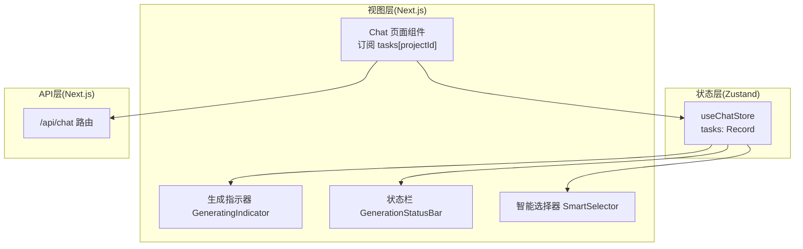
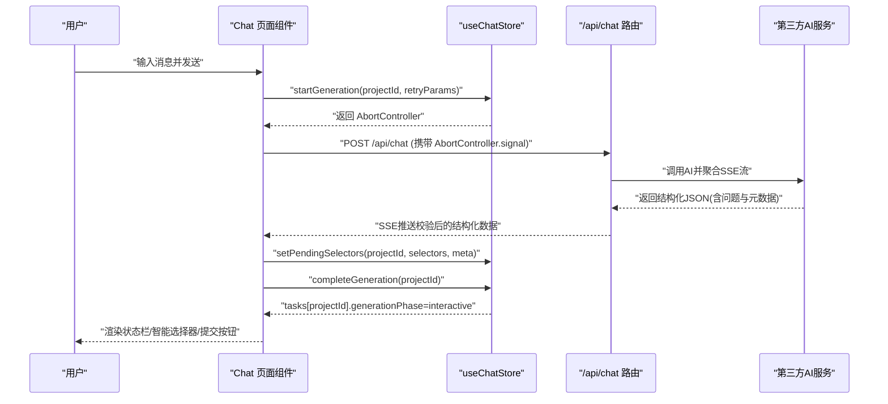
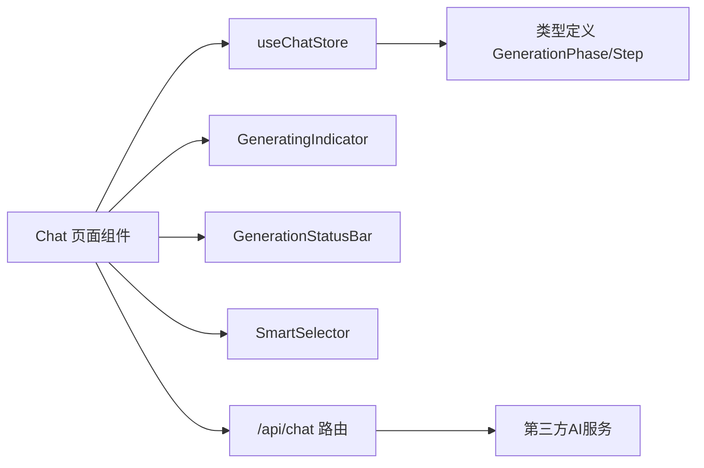

# 状态订阅与更新

<cite>
**本文引用的文件**
- [store/index.ts](file://prd-generator/src/store/index.ts)
- [types/index.ts](file://prd-generator/src/types/index.ts)
- [app/project/[id]/chat/page.tsx](file://prd-generator/src/app/project/[id]/chat/page.tsx)
- [components/generating-indicator.tsx](file://prd-generator/src/components/generating-indicator.tsx)
- [components/generation-status-bar.tsx](file://prd-generator/src/components/generation-status-bar.tsx)
- [components/smart-selector.tsx](file://prd-generator/src/components/smart-selector.tsx)
- [app/api/chat/route.ts](file://prd-generator/src/app/api/chat/route.ts)
</cite>

## 目录
1. [引言](#引言)
2. [项目结构](#项目结构)
3. [核心组件](#核心组件)
4. [架构总览](#架构总览)
5. [详细组件分析](#详细组件分析)
6. [依赖分析](#依赖分析)
7. [性能考虑](#性能考虑)
8. [故障排查指南](#故障排查指南)
9. [结论](#结论)

## 引言
本文件围绕 useChatStore 中的 tasks 对象如何通过 projectId 隔离不同项目的生成任务展开，系统性说明 chatTask 如何订阅特定项目的任务状态并驱动 UI 渲染；startGeneration 如何创建 AbortController 并初始化 ChatGenerationTask，通过 set 更新 Zustand 状态，触发所有订阅该状态的组件重新渲染；setPendingSelectors 如何将 AI 返回的校验后选择器数据写入 tasks；completeGeneration 与 setGenerationError 如何改变 generationPhase 以驱动 UI 状态流转；以及 abortAndReset 在组件卸载时的安全清理机制与状态生命周期管理。

## 项目结构
- 状态层：Zustand store 定义了 ChatStore，以 Record<string, ChatGenerationTask> 的 tasks 映射按 projectId 隔离任务状态。
- 视图层：Chat 页面组件通过 useChatStore 订阅 tasks[projectId]，将状态映射为 UI 属性，驱动生成指示器、状态栏、智能选择器等组件渲染。
- API 层：/api/chat 路由负责调用第三方 AI 服务，聚合流式响应并通过 SSE 返回校验后的结构化数据，前端据此更新 pendingSelectors 与 generationPhase。

图表来源
- [store/index.ts](file://prd-generator/src/store/index.ts#L295-L530)
- [app/project/[id]/chat/page.tsx](file://prd-generator/src/app/project/[id]/chat/page.tsx#L69-L102)
- [components/generating-indicator.tsx](file://prd-generator/src/components/generating-indicator.tsx#L1-L130)
- [components/generation-status-bar.tsx](file://prd-generator/src/components/generation-status-bar.tsx#L1-L124)
- [components/smart-selector.tsx](file://prd-generator/src/components/smart-selector.tsx#L1-L255)
- [app/api/chat/route.ts](file://prd-generator/src/app/api/chat/route.ts#L257-L426)

章节来源
- [store/index.ts](file://prd-generator/src/store/index.ts#L295-L530)
- [app/project/[id]/chat/page.tsx](file://prd-generator/src/app/project/[id]/chat/page.tsx#L69-L102)

## 核心组件
- ChatGenerationTask 数据结构：包含 projectId、generationPhase、currentStep、stepIndex、startTime、elapsedTime、pendingSelectors、questionMeta、canCancel、abortController、retryParams 等字段，用于完整描述一次生成任务的生命周期与状态。
- ChatStore 方法族：
  - startGeneration：创建 AbortController，初始化 ChatGenerationTask 并写入 tasks[projectId]。
  - setPendingSelectors：将校验后的选择器数据写入 tasks[projectId]。
  - completeGeneration：将 generationPhase 设为 interactive，结束可取消状态。
  - setGenerationError：将 generationPhase 设为 error，记录错误信息。
  - updateElapsedTime：在生成阶段按秒更新耗时。
  - resetGeneration/abortAndReset：在生成中时中断请求并重置任务为默认状态。
  - getAbortSignal：暴露 AbortSignal 供 fetch 请求使用。
- Chat 页面组件：
  - 订阅 tasks[projectId]，将状态映射为 isStreaming、generationPhase、currentStep、stepIndex、elapsedTime、pendingSelectors、questionMeta、canCancel、error、retryParams 等 UI 属性。
  - 在发送消息时调用 startGeneration，将 AbortController 传给 fetch 请求，实现可取消的流式生成。
  - 接收后端校验后的结构化数据，调用 setPendingSelectors 与 completeGeneration，驱动 UI 进入可交互状态。
  - 在组件卸载时调用 abortAndReset，确保进行中的请求被中断并清理状态。

章节来源
- [store/index.ts](file://prd-generator/src/store/index.ts#L259-L530)
- [types/index.ts](file://prd-generator/src/types/index.ts#L124-L171)
- [app/project/[id]/chat/page.tsx](file://prd-generator/src/app/project/[id]/chat/page.tsx#L69-L102)
- [app/project/[id]/chat/page.tsx](file://prd-generator/src/app/project/[id]/chat/page.tsx#L226-L387)

## 架构总览
下图展示从用户发起消息到 UI 渲染的关键流程，包括状态订阅、请求发起、后端校验、状态更新与 UI 刷新。

图表来源
- [app/project/[id]/chat/page.tsx](file://prd-generator/src/app/project/[id]/chat/page.tsx#L226-L387)
- [store/index.ts](file://prd-generator/src/store/index.ts#L326-L431)
- [app/api/chat/route.ts](file://prd-generator/src/app/api/chat/route.ts#L257-L426)

## 详细组件分析

### 1) tasks 与 projectId 隔离
- 结构设计：tasks 为 Record<string, ChatGenerationTask>，每个 projectId 对应一份独立的任务状态快照，互不影响。
- 默认值：getTask 若不存在对应 projectId，会返回 createDefaultChatTask(projectId)，保证首次访问不会产生空值。
- 生命周期：组件卸载或显式调用 abortAndReset 时，会中断进行中的请求并重置为默认状态，避免内存泄漏与悬挂请求。

章节来源
- [store/index.ts](file://prd-generator/src/store/index.ts#L295-L325)
- [store/index.ts](file://prd-generator/src/store/index.ts#L326-L348)
- [store/index.ts](file://prd-generator/src/store/index.ts#L506-L517)

### 2) chatTask 订阅与 UI 渲染
- 订阅方式：组件通过 useChatStore(state => state.tasks[projectId]) 订阅指定项目的任务状态。
- 映射属性：将 generationPhase/currentStep/stepIndex/elapsedTime/pendingSelectors/questionMeta/canCancel/error/retryParams 等映射为本地状态，驱动生成指示器、状态栏、智能选择器等 UI 组件。
- 渲染分支：根据 generationPhase 控制显示生成中、可交互、错误、超时等不同 UI 区域。

章节来源
- [app/project/[id]/chat/page.tsx](file://prd-generator/src/app/project/[id]/chat/page.tsx#L69-L102)
- [components/generating-indicator.tsx](file://prd-generator/src/components/generating-indicator.tsx#L1-L130)
- [components/generation-status-bar.tsx](file://prd-generator/src/components/generation-status-bar.tsx#L1-L124)
- [components/smart-selector.tsx](file://prd-generator/src/components/smart-selector.tsx#L1-L255)

### 3) startGeneration：创建 AbortController 与初始化任务
- 创建 AbortController：用于后续 fetch 请求的取消信号。
- 初始化任务：设置 generationPhase 为 generating、currentStep 为 understanding、stepIndex 为 0、startTime 为当前时间、isStreaming 为 true、pendingSelectors 为空等。
- 写入状态：通过 set 将任务写入 tasks[projectId]，触发订阅该状态的所有组件重新渲染。

章节来源
- [store/index.ts](file://prd-generator/src/store/index.ts#L326-L348)

### 4) setPendingSelectors：写入选项数据与元信息
- 作用：将后端校验后的选择器数组与问题元信息写入 tasks[projectId]，同时清空 pendingSelectors 以便 UI 进入可交互状态。
- 时机：在收到后端校验后的结构化数据后调用，随后通常调用 completeGeneration。

章节来源
- [store/index.ts](file://prd-generator/src/store/index.ts#L398-L412)
- [app/project/[id]/chat/page.tsx](file://prd-generator/src/app/project/[id]/chat/page.tsx#L318-L351)

### 5) completeGeneration 与 setGenerationError：驱动 UI 状态流转
- completeGeneration：将 generationPhase 设为 interactive，关闭可取消标志，停止流式状态，便于用户提交选择器答案。
- setGenerationError：将 generationPhase 设为 error，记录错误信息，UI 展示错误状态栏与重试入口。

章节来源
- [store/index.ts](file://prd-generator/src/store/index.ts#L414-L431)
- [store/index.ts](file://prd-generator/src/store/index.ts#L458-L475)
- [components/generation-status-bar.tsx](file://prd-generator/src/components/generation-status-bar.tsx#L69-L94)

### 6) 生成阶段推进与耗时统计
- advanceStep：按固定间隔推进 currentStep 与 stepIndex，配合 UI 的进度动画与步骤指示。
- updateElapsedTime：在 generationPhase 为 generating 且存在有效 startTime 时，每秒更新耗时，用于生成指示器的时间显示。

章节来源
- [store/index.ts](file://prd-generator/src/store/index.ts#L360-L396)
- [store/index.ts](file://prd-generator/src/store/index.ts#L477-L491)
- [app/project/[id]/chat/page.tsx](file://prd-generator/src/app/project/[id]/chat/page.tsx#L192-L223)

### 7) 安全清理：abortAndReset 与组件卸载
- abortAndReset：若任务处于 generationPhase 且存在 abortController，则先中断请求，再将 tasks[projectId] 重置为默认状态，避免悬挂请求与内存泄漏。
- 组件卸载：Chat 页面在 useEffect 返回值中调用 abortAndReset，确保用户离开页面或切换项目时，进行中的请求被安全中断并清理。

章节来源
- [store/index.ts](file://prd-generator/src/store/index.ts#L506-L517)
- [app/project/[id]/chat/page.tsx](file://prd-generator/src/app/project/[id]/chat/page.tsx#L111-L120)

### 8) fetch 请求与 AbortController 传递
- 发起请求：sendMessage 中调用 startGeneration 获取 AbortController，并将其 signal 传给 fetch。
- 取消行为：用户点击取消或组件卸载时，AbortController.abort() 被调用，fetch 抛出 AbortError，前端捕获并避免错误提示。

章节来源
- [app/project/[id]/chat/page.tsx](file://prd-generator/src/app/project/[id]/chat/page.tsx#L226-L262)
- [store/index.ts](file://prd-generator/src/store/index.ts#L519-L521)

### 9) 后端校验与结构化数据
- /api/chat 路由：聚合 AI 的 SSE 流，校验 JSON 格式，必要时自动重试，最终以 SSE 推送校验后的结构化数据（包含问题列表与元信息）。
- 前端消费：Chat 页面解析 SSE 数据，调用 setPendingSelectors 与 completeGeneration，驱动 UI 进入可交互状态。

章节来源
- [app/api/chat/route.ts](file://prd-generator/src/app/api/chat/route.ts#L257-L426)
- [app/project/[id]/chat/page.tsx](file://prd-generator/src/app/project/[id]/chat/page.tsx#L318-L351)

## 依赖分析
- 组件耦合：
  - Chat 页面组件强依赖 useChatStore 的 tasks[projectId] 订阅，弱依赖 UI 组件（生成指示器、状态栏、智能选择器）。
  - UI 组件之间低耦合，通过 props 传递状态与回调。
- 外部依赖：
  - fetch + AbortController 实现可取消的流式请求。
  - /api/chat 路由依赖第三方 AI 服务，负责聚合与校验响应。
- 潜在风险：
  - 未正确传递 AbortController.signal 或未在组件卸载时调用 abortAndReset，可能导致悬挂请求与内存泄漏。
  - 未处理 AbortError 导致错误提示弹窗，影响用户体验。

图表来源
- [app/project/[id]/chat/page.tsx](file://prd-generator/src/app/project/[id]/chat/page.tsx#L69-L102)
- [store/index.ts](file://prd-generator/src/store/index.ts#L259-L325)
- [types/index.ts](file://prd-generator/src/types/index.ts#L124-L171)
- [app/api/chat/route.ts](file://prd-generator/src/app/api/chat/route.ts#L257-L426)

章节来源
- [app/project/[id]/chat/page.tsx](file://prd-generator/src/app/project/[id]/chat/page.tsx#L69-L102)
- [store/index.ts](file://prd-generator/src/store/index.ts#L259-L325)
- [types/index.ts](file://prd-generator/src/types/index.ts#L124-L171)
- [app/api/chat/route.ts](file://prd-generator/src/app/api/chat/route.ts#L257-L426)

## 性能考虑
- 流式更新：通过 updateElapsedTime 与 advanceStep 的定时器，按秒更新耗时与步骤，避免频繁重渲染。
- 选择器状态：统一管理 selectionsMap，减少重复渲染与闭包捕获带来的性能损耗。
- 取消策略：AbortController.abort() 立即中断请求，避免无意义的网络与解析开销。
- UI 动画：生成指示器的进度动画采用平滑插值，避免高频率 setState 导致的卡顿。

[本节为通用指导，无需列出具体文件来源]

## 故障排查指南
- 生成未开始或无响应
  - 检查是否正确调用 startGeneration 并将 AbortController.signal 传给 fetch。
  - 确认 /api/chat 路由未抛出 4xx/5xx 错误。
- 生成中无法取消
  - 确认组件卸载时调用了 abortAndReset，或用户点击了取消按钮。
  - 检查 AbortController.abort() 是否被调用，以及前端是否捕获 AbortError。
- UI 不更新
  - 确认组件订阅的是正确的 projectId，且 useChatStore 的 set 调用成功。
  - 检查 generationPhase 是否被正确设置为 interactive 或 error。
- 选择器不显示
  - 确认 setPendingSelectors 已被调用，且 pendingSelectors 非空。
  - 检查 generationPhase 是否为 interactive。

章节来源
- [store/index.ts](file://prd-generator/src/store/index.ts#L326-L348)
- [store/index.ts](file://prd-generator/src/store/index.ts#L398-L412)
- [store/index.ts](file://prd-generator/src/store/index.ts#L414-L431)
- [store/index.ts](file://prd-generator/src/store/index.ts#L458-L475)
- [store/index.ts](file://prd-generator/src/store/index.ts#L506-L517)
- [app/project/[id]/chat/page.tsx](file://prd-generator/src/app/project/[id]/chat/page.tsx#L226-L387)

## 结论
通过以 projectId 为键的 tasks 映射，useChatStore 将不同项目的生成任务完全隔离，确保并发场景下的稳定性。Chat 页面组件通过订阅 tasks[projectId]，将 generationPhase、currentStep、elapsedTime、pendingSelectors 等状态映射为 UI，实现了流畅的生成体验。startGeneration 初始化任务并创建 AbortController，setPendingSelectors 与 completeGeneration/ setGenerationError 分别负责写入选择器数据与驱动 UI 状态流转。abortAndReset 在组件卸载时提供安全清理，避免资源泄漏。整体架构清晰、职责分离，具备良好的可维护性与扩展性。