# AI响应校验与重试机制

<cite>
**本文引用的文件**
- [chat/route.ts](file://prd-generator/src/app/api/chat/route.ts)
- [validator.ts](file://prd-generator/src/lib/validator.ts)
- [types/index.ts](file://prd-generator/src/types/index.ts)
- [generate-prd/route.ts](file://prd-generator/src/app/api/generate-prd/route.ts)
</cite>

## 目录
1. [引言](#引言)
2. [项目结构](#项目结构)
3. [核心组件](#核心组件)
4. [架构总览](#架构总览)
5. [详细组件分析](#详细组件分析)
6. [依赖分析](#依赖分析)
7. [性能考虑](#性能考虑)
8. [故障排查指南](#故障排查指南)
9. [结论](#结论)

## 引言
本文件聚焦于“AI响应的结构化校验与自动重试流程”，围绕以下关键目标展开：
- 解释 callAIAndAggregate 如何发起流式请求并聚合 SSE 响应内容；
- 说明 validateAIResponse 如何通过 extractJSON 从 AI 返回文本中提取 JSON（支持代码块包裹、裸 JSON、内嵌 JSON 三种格式），并使用 Zod Schema（AIResponseSchema）进行类型与结构校验，覆盖 questions 数组、meta.phase 枚举、progress 范围等；
- 描述当校验失败时，buildRetryPrompt 如何生成包含错误原因与正确格式示例的重试指令，并通过 requestMessages 追加到对话历史，实现最多两次自动重试；
- 讲解校验成功后，如何将 ValidatedAIResponse 数据通过 ReadableStream 以 SSE 流形式返回前端；
- 总结所有重试均失败时的降级处理策略。

## 项目结构
该功能主要分布在两个模块：
- 应用层 API：负责与外部模型服务通信、流式转发、以及触发校验与重试逻辑；
- 校验与聚合库：负责 JSON 提取、Zod 校验、SSE 聚合、重试提示构建。


图表来源
- [chat/route.ts](file://prd-generator/src/app/api/chat/route.ts#L215-L425)
- [validator.ts](file://prd-generator/src/lib/validator.ts#L55-L273)
- [types/index.ts](file://prd-generator/src/types/index.ts#L158-L171)

章节来源
- [chat/route.ts](file://prd-generator/src/app/api/chat/route.ts#L215-L425)
- [validator.ts](file://prd-generator/src/lib/validator.ts#L55-L273)
- [types/index.ts](file://prd-generator/src/types/index.ts#L158-L171)

## 核心组件
- callAIAndAggregate：封装外部模型调用，开启流式传输，使用聚合器读取并拼接 SSE 数据，返回完整文本。
- validateAIResponse：从文本中提取 JSON，解析并用 Zod Schema 校验；返回结构化校验结果。
- extractJSON：支持三种 JSON 提取方式（代码块包裹、裸 JSON、内嵌 JSON），并剥离非 JSON 文本。
- AIResponseSchema：定义 questions 数组长度、meta.phase 枚举、meta.progress 范围等约束。
- buildRetryPrompt：基于上一次校验错误生成重试提示词，附带正确格式示例。
- aggregateSSEStream：逐行解析 SSE，提取 choices[0].delta.content 并拼接为完整文本。
- 类型体系：AIQuestionsResponseV2、QuestionMeta、GenerationState 等，支撑前端消费结构化数据。

章节来源
- [chat/route.ts](file://prd-generator/src/app/api/chat/route.ts#L221-L255)
- [validator.ts](file://prd-generator/src/lib/validator.ts#L55-L147)
- [validator.ts](file://prd-generator/src/lib/validator.ts#L218-L273)
- [types/index.ts](file://prd-generator/src/types/index.ts#L158-L171)

## 架构总览
下图展示从客户端到外部模型、再到本地校验与重试的端到端流程。

```mermaid
sequenceDiagram
participant Client as "客户端"
participant Chat as "chat/route.ts"
participant Validator as "validator.ts"
participant Model as "外部模型API"
Client->>Chat : "POST /api/chat"
Chat->>Model : "发起流式请求"
Model-->>Chat : "SSE流 chunk"
Chat->>Validator : "aggregateSSEStream(reader)"
Validator-->>Chat : "完整文本"
Chat->>Validator : "validateAIResponse(text)"
alt 校验通过
Validator-->>Chat : "ValidatedAIResponse"
Chat-->>Client : "SSE返回结构化数据"
else 校验失败
Validator-->>Chat : "错误列表"
Chat->>Chat : "buildRetryPrompt(错误)"
Chat->>Model : "追加assistant+user重试消息"
Model-->>Chat : "新的SSE流"
Chat->>Validator : "再次validate"
end
```



图表来源
- [chat/route.ts](file://prd-generator/src/app/api/chat/route.ts#L221-L425)
- [validator.ts](file://prd-generator/src/lib/validator.ts#L55-L147)
- [validator.ts](file://prd-generator/src/lib/validator.ts#L218-L273)

## 详细组件分析

### callAIAndAggregate：发起流式请求并聚合SSE
- 触发外部模型 API，启用流式传输；
- 获取 ReadableStreamDefaultReader；
- 调用 aggregateSSEStream(reader) 聚合完整文本；
- 返回 { content, error? }。


图表来源
- [chat/route.ts](file://prd-generator/src/app/api/chat/route.ts#L221-L255)
- [validator.ts](file://prd-generator/src/lib/validator.ts#L218-L273)

章节来源
- [chat/route.ts](file://prd-generator/src/app/api/chat/route.ts#L221-L255)
- [validator.ts](file://prd-generator/src/lib/validator.ts#L218-L273)

### validateAIResponse：JSON提取与Zod校验
- extractJSON 支持三种 JSON 提取：
  - 代码块包裹（如 ```json ... ```）；
  - 裸 JSON（最外层对象）；
  - 内嵌 JSON（从文本中匹配包含 "questions" 和 "meta" 的 JSON 子串）。
- JSON.parse 成功后，使用 AIResponseSchema 校验：
  - questions：1~5 个；
  - meta.phase：basic、feature、technical、confirmation；
  - meta.progress：0~100；
  - 附加校验：至少一个问题包含“由AI推荐”类选项。
- 返回结构：valid、data、errors、rawContent。


图表来源
- [validator.ts](file://prd-generator/src/lib/validator.ts#L55-L147)

章节来源
- [validator.ts](file://prd-generator/src/lib/validator.ts#L55-L147)

### buildRetryPrompt：生成重试指令并追加到对话历史
- 基于上一次校验错误列表，生成压缩的重试提示词；
- 重试提示词包含：
  - 明确的 JSON 输出格式要求；
  - 正确的 JSON 示例（questions、meta 字段与取值）；
  - 错误原因汇总（最多三条）。
- 将 assistant（上次原始内容）与 user（重试提示）追加到 requestMessages，触发新一轮调用。


图表来源
- [chat/route.ts](file://prd-generator/src/app/api/chat/route.ts#L378-L387)
- [validator.ts](file://prd-generator/src/lib/validator.ts#L185-L216)

章节来源
- [chat/route.ts](file://prd-generator/src/app/api/chat/route.ts#L378-L387)
- [validator.ts](file://prd-generator/src/lib/validator.ts#L185-L216)

### 校验成功后的SSE返回与降级策略
- 校验成功：
  - 构造 validated: true 的对象，包含 data、textContent、retryCount；
  - 通过 ReadableStream 以 SSE 形式发送一条 data: 消息，随后发送 [DONE]，关闭流。
- 所有重试均失败：
  - 构造 validated: false 的对象，包含 rawContent、validationErrors、retryCount；
  - 通过 ReadableStream 以 SSE 形式发送一条 data: 消息，随后发送 [DONE]，关闭流。


图表来源
- [chat/route.ts](file://prd-generator/src/app/api/chat/route.ts#L336-L367)
- [chat/route.ts](file://prd-generator/src/app/api/chat/route.ts#L390-L416)

章节来源
- [chat/route.ts](file://prd-generator/src/app/api/chat/route.ts#L336-L367)
- [chat/route.ts](file://prd-generator/src/app/api/chat/route.ts#L390-L416)

### 类型与约束说明
- AIResponseSchema：
  - questions：1~5 个；
  - meta.phase：枚举 basic、feature、technical、confirmation；
  - meta.progress：数值 0~100；
  - 附加：至少一个问题包含“由AI推荐”类选项（仅警告，不影响通过）。
- 类型定义：
  - AIQuestionsResponseV2：questions 数组 + meta；
  - QuestionMeta：phase、progress、canGeneratePRD、suggestedNextTopic；
  - GenerationState：包含 retryCount，便于前端显示重试次数。

章节来源
- [validator.ts](file://prd-generator/src/lib/validator.ts#L8-L39)
- [validator.ts](file://prd-generator/src/lib/validator.ts#L132-L141)
- [types/index.ts](file://prd-generator/src/types/index.ts#L158-L171)

## 依赖分析
- 组件耦合：
  - chat/route.ts 依赖 validator.ts 的 extractJSON、validateAIResponse、buildRetryPrompt、aggregateSSEStream；
  - 类型定义来自 types/index.ts，供前端消费结构化数据。
- 外部依赖：
  - fetch 与 ReadableStream API；
  - TextEncoder/TextDecoder 用于 SSE 编解码；
  - Zod 用于强类型校验。


图表来源
- [chat/route.ts](file://prd-generator/src/app/api/chat/route.ts#L215-L425)
- [validator.ts](file://prd-generator/src/lib/validator.ts#L55-L273)
- [types/index.ts](file://prd-generator/src/types/index.ts#L158-L171)
- [generate-prd/route.ts](file://prd-generator/src/app/api/generate-prd/route.ts#L160-L244)

章节来源
- [chat/route.ts](file://prd-generator/src/app/api/chat/route.ts#L215-L425)
- [validator.ts](file://prd-generator/src/lib/validator.ts#L55-L273)
- [types/index.ts](file://prd-generator/src/types/index.ts#L158-L171)
- [generate-prd/route.ts](file://prd-generator/src/app/api/generate-prd/route.ts#L160-L244)

## 性能考虑
- 流式聚合：
  - 使用 TextDecoder({ stream: true }) 正确处理 UTF-8 多字节字符；
  - 分行缓冲避免一次性拼接导致内存峰值；
  - 仅提取 choices[0].delta.content，减少无关数据处理。
- 重试策略：
  - 最大重试次数为 2，避免无限循环；
  - 重试时追加 assistant+user 消息，提高模型理解上下文的一致性。
- 前端消费：
  - SSE 流式推送，前端可逐步渲染；
  - 降级路径返回原始内容与错误，便于调试与二次处理。

## 故障排查指南
- 常见错误与定位：
  - 未能提取到 JSON：检查模型输出是否包含 JSON 代码块或裸 JSON；
  - JSON 解析失败：确认输出中无多余字符或截断；
  - 结构不符：核对 questions 数量、meta.phase 取值、meta.progress 范围；
  - 重试无效：确认重试提示词是否被正确追加到对话历史。
- 日志与返回：
  - chat/route.ts 中对验证通过/失败、重试次数、最终降级均有日志输出；
  - 降级返回包含 rawContent 与 validationErrors，便于前端展示与二次处理。

章节来源
- [chat/route.ts](file://prd-generator/src/app/api/chat/route.ts#L336-L367)
- [chat/route.ts](file://prd-generator/src/app/api/chat/route.ts#L390-L416)
- [validator.ts](file://prd-generator/src/lib/validator.ts#L94-L147)

## 结论
该机制通过“流式请求 + 聚合 + 结构化校验 + 自动重试”的闭环，确保从外部模型返回的文本能够稳定地转换为结构化数据。extractJSON 与 Zod Schema 的组合提升了容错与一致性，buildRetryPrompt 则以最小代价引导模型修正输出。最终以 SSE 流的形式返回给前端，既保证实时性，又提供降级兜底，提升整体可用性与用户体验。