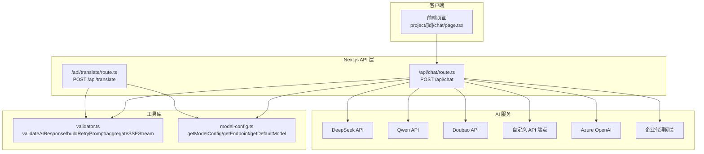
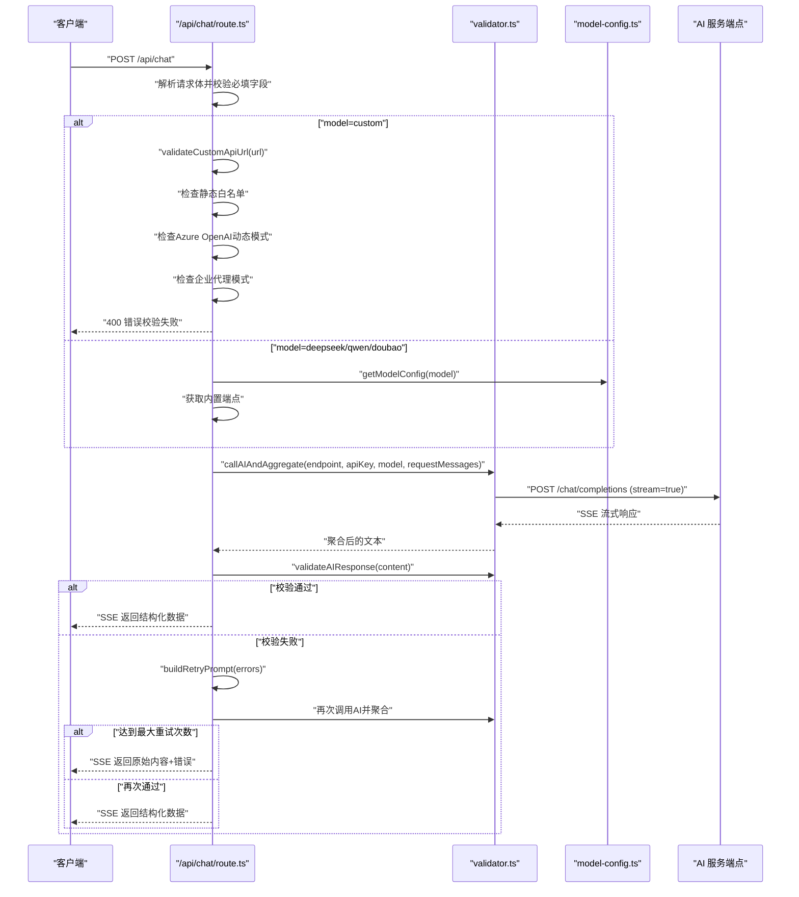
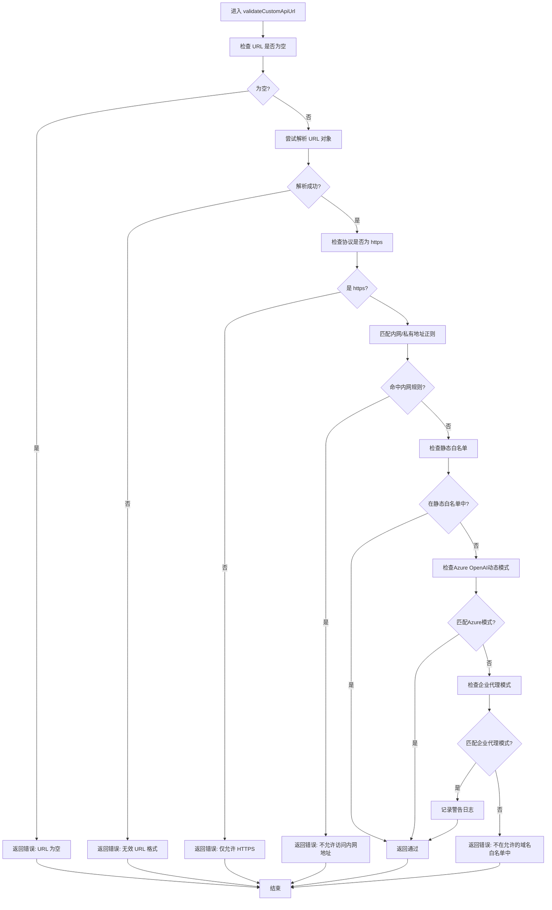
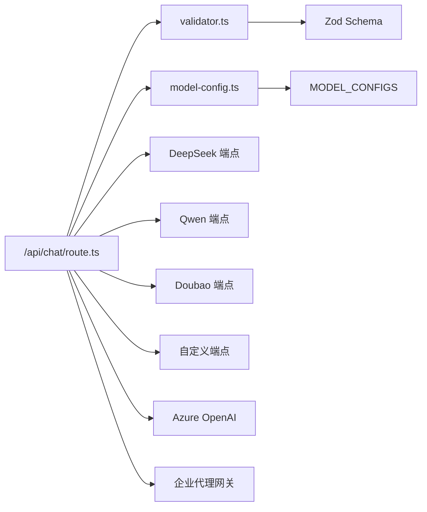

# API请求处理与安全校验

<cite>
**本文引用的文件**
- [route.ts](file://prd-generator/src/app/api/chat/route.ts)
- [validator.ts](file://prd-generator/src/lib/validator.ts)
- [model-config.ts](file://prd-generator/src/lib/model-config.ts)
- [translate/route.ts](file://prd-generator/src/app/api/translate/route.ts)
</cite>

## 更新摘要
**变更内容**
- 更新了自定义API URL校验机制，增加了对Azure OpenAI动态子域和企业代理模式的支持
- 扩展了域名白名单，包含更多主流AI服务提供商
- 详细说明了企业代理模式的警告机制
- 更新了架构总览和安全校验流程图以反映最新变化

## 目录
1. [简介](#简介)
2. [项目结构](#项目结构)
3. [核心组件](#核心组件)
4. [架构总览](#架构总览)
5. [详细组件分析](#详细组件分析)
6. [依赖分析](#依赖分析)
7. [性能考虑](#性能考虑)
8. [故障排查指南](#故障排查指南)
9. [结论](#结论)

## 简介
本文件围绕 `/api/chat` 的 POST 请求处理流程进行深入解析，重点覆盖：
- 如何通过 Next.js 的 NextRequest 解析请求体并校验必填字段（messages、model、apiKey）
- 根据 model 参数动态选择 AI 服务提供商（deepseek/qwen/doubao/custom）的 API 端点
- validateCustomApiUrl 函数的安全校验机制：HTTPS 强制、内网 IP 禁止、域名白名单、防止 SSRF
- 当校验失败时如何返回 400 错误响应
- requestMessages 如何将 SYSTEM_PROMPT 与用户对话历史合并，为 AI 调用准备输入数据

## 项目结构
该功能位于 Next.js 应用的 app API 层，核心文件如下：
- 聊天 API：/api/chat/route.ts
- 响应校验与流式聚合：/lib/validator.ts
- 模型配置管理：/lib/model-config.ts
- 翻译 API（参考实现）：/api/translate/route.ts

**图表来源**
- [route.ts](file://prd-generator/src/app/api/chat/route.ts#L1-L120)
- [validator.ts](file://prd-generator/src/lib/validator.ts#L1-L120)
- [model-config.ts](file://prd-generator/src/lib/model-config.ts#L1-L120)
- [translate/route.ts](file://prd-generator/src/app/api/translate/route.ts#L1-L120)

## 核心组件
- 请求解析与校验：在路由层解析 JSON 请求体，校验 apiKey、messages、model 等字段
- 动态端点选择：根据 model 选择内置端点或自定义端点
- 安全校验：validateCustomApiUrl 对自定义 URL 进行 HTTPS、内网、白名单三重校验
- 请求消息构建：将 SYSTEM_PROMPT 与用户历史合并为 requestMessages
- 流式响应与重试：调用 AI API 并聚合 SSE，失败时自动重试并构建重试提示词
- 响应校验：validateAIResponse 使用 Zod Schema 校验 JSON 结构，buildRetryPrompt 生成重试提示

**章节来源**
- [route.ts](file://prd-generator/src/app/api/chat/route.ts#L257-L426)
- [validator.ts](file://prd-generator/src/lib/validator.ts#L1-L147)

## 架构总览
下面以序列图展示 /api/chat 的关键调用链路。

**图表来源**
- [route.ts](file://prd-generator/src/app/api/chat/route.ts#L257-L426)
- [validator.ts](file://prd-generator/src/lib/validator.ts#L149-L274)
- [model-config.ts](file://prd-generator/src/lib/model-config.ts#L56-L68)

## 详细组件分析

### 请求解析与必填字段校验
- 使用 NextRequest.json() 解析请求体；解析失败直接返回 400
- 校验 apiKey 是否存在；缺失则返回 400
- 校验 messages 是否为数组；非数组返回 400
- 校验 model 是否合法；非法返回 400

**章节来源**
- [route.ts](file://prd-generator/src/app/api/chat/route.ts#L257-L307)

### 动态端点选择与自定义 URL 校验
- 内置端点映射：deepseek、qwen、doubao 映射到各自官方兼容端点
- model=custom 时，调用 validateCustomApiUrl 进行安全校验：
  - 必填性：空值返回错误
  - URL 解析：非法格式返回错误
  - 协议限制：仅允许 https
  - 内网禁止：localhost、127.x、10.x、172.16–172.31、192.168.x、0.x、169.254.x、IPv6::1、fc00:/fe80/ 等均拒绝
  - 域名白名单：仅允许预置域名及其子域
  - 不在白名单返回 400
- 校验通过后使用 customApiUrl 作为最终端点

**章节来源**
- [route.ts](file://prd-generator/src/app/api/chat/route.ts#L5-L12)
- [route.ts](file://prd-generator/src/app/api/chat/route.ts#L288-L307)
- [route.ts](file://prd-generator/src/app/api/chat/route.ts#L290-L307)

### validateCustomApiUrl 安全校验机制详解
- URL 对象解析：使用标准 URL 构造函数确保格式合法
- HTTPS 强制：协议必须为 https
- 内网 IP/域名禁止：通过正则逐项匹配 localhost、127.x、10.x、172.16–172.31、192.168.x、0.x、169.254.x、IPv6::1、fc00:/fe80/ 等
- 白名单校验：hostname 必须等于白名单域名或以白名单域名结尾
- 新增 Azure OpenAI 动态子域支持：通过正则 `^[a-z0-9-]+\.openai\.azure\.com$` 匹配自定义资源名
- 新增企业代理模式支持：通过正则匹配 `api.[a-z0-9-]+.corp.[a-z]+` 和 `llm.[a-z0-9-]+.[a-z]+` 等企业网关模式，匹配时发出警告但仍允许通过
- 失败返回 400，错误信息包含具体原因

**图表来源**
- [translate/route.ts](file://prd-generator/src/app/api/translate/route.ts#L74-L80)
- [translate/route.ts](file://prd-generator/src/app/api/translate/route.ts#L133-L142)

### requestMessages 合并与 SYSTEM_PROMPT
- requestMessages 由两部分组成：
  - 系统提示词：SYSTEM_PROMPT（纯 JSON 输出规则、对话阶段控制、完成判断等）
  - 用户对话历史：来自前端传入的 messages 数组
- 合并顺序为：system 在前，随后是用户历史消息
- 该结构用于后续 callAIAndAggregate 调用，作为模型输入

**章节来源**
- [route.ts](file://prd-generator/src/app/api/chat/route.ts#L91-L114)
- [route.ts](file://prd-generator/src/app/api/chat/route.ts#L309-L314)

### AI 调用与流式聚合
- callAIAndAggregate：
  - 以 POST 方式向端点发送 JSON 请求，启用流式响应
  - 使用 aggregateSSEStream 从 SSE 流中提取增量内容
  - 若 AI 返回非 2xx，返回 500 并附带错误信息
- validateAIResponse：
  - 从 AI 响应中提取 JSON（支持代码块包裹、裸 JSON、内嵌 JSON）
  - 使用 Zod Schema 校验 questions、meta 等字段
  - 返回结构化数据与原始文本内容，便于后续处理

**章节来源**
- [route.ts](file://prd-generator/src/app/api/chat/route.ts#L221-L256)
- [validator.ts](file://prd-generator/src/lib/validator.ts#L58-L147)
- [validator.ts](file://prd-generator/src/lib/validator.ts#L218-L274)

### 重试机制与错误回退
- 最大重试次数：MAX_RETRY_COUNT
- 校验失败时：
  - 使用 buildRetryPrompt 生成重试提示词
  - 将上次 AI 回复与重试提示词追加到 requestMessages
  - 重新调用 AI 并再次校验
- 所有重试失败：
  - 返回原始内容与错误列表，同时包含重试次数
  - 仍以 SSE 形式返回，便于前端统一处理

**章节来源**
- [route.ts](file://prd-generator/src/app/api/chat/route.ts#L315-L417)
- [validator.ts](file://prd-generator/src/lib/validator.ts#L189-L216)

### 前端触发与请求构造
- 前端页面通过 fetch('/api/chat') 触发请求
- 请求体包含：
  - messages：对话历史
  - model：默认模型（如 deepseek/qwen/doubao/custom）
  - apiKey：来自设置中的密钥
  - customApiUrl：当 model=custom 时提供
- 前端页面在 PRD 生成页也展示了类似的请求构造方式，便于对比

**章节来源**
- [page.tsx](file://prd-generator/src/app/project/[id]/chat/page.tsx#L312-L359)
- [generate-prd/route.ts](file://prd-generator/src/app/api/generate-prd/route.ts#L151-L175)

## 依赖分析
- 路由层依赖：
  - Next.js 的 NextRequest/NextResponse
  - validator.ts 中的 validateAIResponse、buildRetryPrompt、aggregateSSEStream
  - model-config.ts 中的 getModelConfig
- 工具库依赖：
  - Zod：用于结构化 JSON 校验
  - URL 构造函数：用于自定义 URL 安全校验
- 外部依赖：
  - 各 AI 服务端点（deepseek/qwen/doubao/custom）
  - Azure OpenAI 端点
  - 企业代理网关

**图表来源**
- [route.ts](file://prd-generator/src/app/api/chat/route.ts#L1-L120)
- [validator.ts](file://prd-generator/src/lib/validator.ts#L1-L40)
- [model-config.ts](file://prd-generator/src/lib/model-config.ts#L25-L49)

## 性能考虑
- 流式响应：通过 SSE 逐步返回增量内容，减少首屏等待
- 聚合策略：aggregateSSEStream 采用流式解码与缓冲区处理，避免一次性加载全部内容
- 重试策略：MAX_RETRY_COUNT 控制重试上限，避免无限循环
- 响应校验：Zod 校验在通过后才返回结构化数据，减少前端二次解析成本

[本节为通用性能讨论，无需列出具体文件来源]

## 故障排查指南
- 请求体解析失败（400）：检查请求头 Content-Type 与 JSON 格式
- 缺少 apiKey（400）：确认设置中已配置对应 provider 的密钥
- messages 非数组（400）：确保传入的是数组且包含合法的消息对象
- model 非法（400）：model 必须为 deepseek/qwen/doubao/custom 之一
- 自定义 URL 校验失败（400）：
  - 确保 URL 为 https
  - 确保域名在白名单中
  - 避免使用内网地址（127.0.0.1、192.168.x、localhost 等）
  - 对于 Azure OpenAI，确保格式为 `{resource-name}.openai.azure.com`
  - 对于企业代理，确保域名符合 `api.*.corp.*` 或 `llm.*.*` 模式
- AI 服务调用失败（500）：检查端点可达性、密钥有效性、网络代理
- 校验失败重试多次仍未通过：查看返回的 validationErrors，按提示修正内容格式

**章节来源**
- [route.ts](file://prd-generator/src/app/api/chat/route.ts#L257-L426)
- [validator.ts](file://prd-generator/src/lib/validator.ts#L91-L147)

## 结论
/api/chat 的 POST 请求处理流程具备完善的请求解析、安全校验、动态端点选择、流式响应与重试机制。validateCustomApiUrl 通过 HTTPS 强制、内网禁止与域名白名单三重保障，有效防范 SSRF 攻击。requestMessages 将 SYSTEM_PROMPT 与用户历史合并，为 AI 提供一致、可控的输入。整体设计兼顾安全性、可扩展性与易用性，适合在生产环境中稳定运行。新增的 Azure OpenAI 动态子域支持和企业代理模式处理，进一步增强了系统的灵活性和企业级适用性。