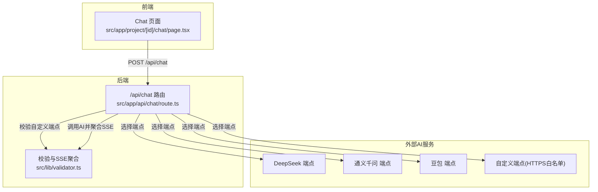
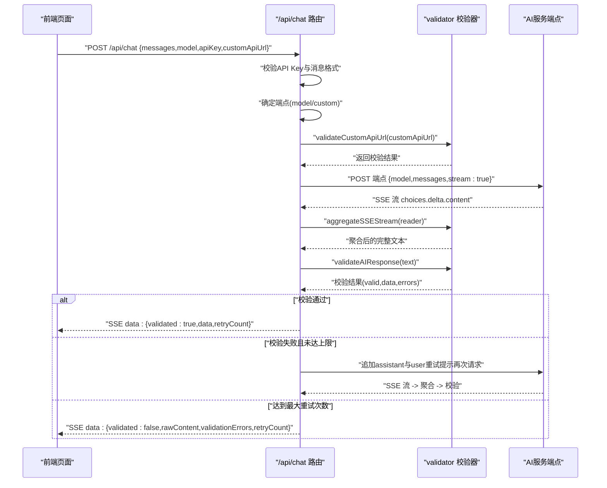
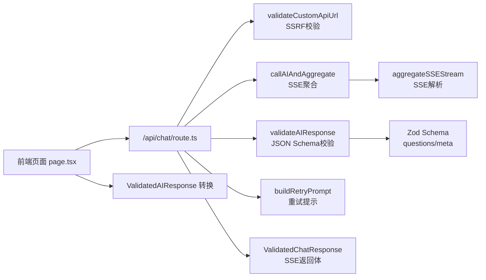

# 后端AI对话服务

<cite>
**本文引用的文件**
- [route.ts](file://prd-generator/src/app/api/chat/route.ts)
- [validator.ts](file://prd-generator/src/lib/validator.ts)
- [page.tsx](file://prd-generator/src/app/project/[id]/chat/page.tsx)
- [index.ts](file://prd-generator/src/types/index.ts)
</cite>

## 目录
1. [简介](#简介)
2. [项目结构](#项目结构)
3. [核心组件](#核心组件)
4. [架构总览](#架构总览)
5. [详细组件分析](#详细组件分析)
6. [依赖关系分析](#依赖关系分析)
7. [性能考量](#性能考量)
8. [故障排查指南](#故障排查指南)
9. [结论](#结论)

## 简介
本文件面向“/api/chat”后端路由的工作流程进行全面解析，覆盖以下关键点：
- 前端如何发送对话历史、模型配置与API Key
- validateCustomApiUrl如何校验自定义API端点的安全性（防SSRF）
- 根据model参数选择对应AI服务提供商端点
- callAIAndAggregate如何发起流式请求并聚合SSE响应
- validateAIResponse如何确保AI返回符合预设JSON Schema的结构化问题数据
- 校验失败时通过buildRetryPrompt生成纠正指令并自动重试（最多2次）
- SYSTEM_PROMPT中关于“纯JSON输出”“禁止开场白”“阶段控制”的规则如何保障输出规范性
- 校验成功后如何将结构化数据封装为ValidatedChatResponse并通过SSE流返回给前端

## 项目结构
后端路由位于Next.js App Router目录下，配合前端页面与类型定义共同构成端到端对话流程。

图表来源
- [route.ts](file://prd-generator/src/app/api/chat/route.ts#L1-L120)
- [validator.ts](file://prd-generator/src/lib/validator.ts#L1-L120)
- [page.tsx](file://prd-generator/src/app/project/[id]/chat/page.tsx#L226-L312)

章节来源
- [route.ts](file://prd-generator/src/app/api/chat/route.ts#L1-L120)
- [page.tsx](file://prd-generator/src/app/project/[id]/chat/page.tsx#L226-L312)

## 核心组件
- /api/chat 路由：负责接收请求、选择端点、调用AI、聚合SSE、校验响应、重试与SSE返回
- 校验器validator：提供validateAIResponse、buildRetryPrompt、aggregateSSEStream
- 类型定义：定义ValidatedAIResponse、ValidatedChatResponse等接口，确保前后端一致的数据契约

章节来源
- [route.ts](file://prd-generator/src/app/api/chat/route.ts#L1-L120)
- [validator.ts](file://prd-generator/src/lib/validator.ts#L1-L120)
- [index.ts](file://prd-generator/src/types/index.ts#L118-L171)

## 架构总览
后端采用“请求-校验-重试-返回”的闭环设计，前端通过SSE持续接收后端校验后的结构化数据。

图表来源
- [route.ts](file://prd-generator/src/app/api/chat/route.ts#L257-L425)
- [validator.ts](file://prd-generator/src/lib/validator.ts#L94-L147)
- [validator.ts](file://prd-generator/src/lib/validator.ts#L218-L273)

## 详细组件分析

### 1) 请求入口与参数校验
- 接收messages、model、apiKey、customApiUrl
- 校验apiKey是否存在
- 校验messages为数组
- 根据model选择端点：内置端点或自定义端点
- 若为custom，调用validateCustomApiUrl进行安全校验

章节来源
- [route.ts](file://prd-generator/src/app/api/chat/route.ts#L257-L308)

### 2) 自定义API端点安全校验（validateCustomApiUrl）
- 必填性与URL合法性校验
- 仅允许HTTPS协议
- 禁止内网地址（localhost/127/10/172.x/192.168/0/169.254/IPv6链路本地/唯一本地地址等）
- 白名单域名匹配（允许的第三方AI域名）

章节来源
- [route.ts](file://prd-generator/src/app/api/chat/route.ts#L31-L82)

### 3) 系统提示词与阶段控制（SYSTEM_PROMPT）
- 强制“纯JSON输出”，禁止任何开场白或解释性文字
- 规定问题生成原则（数量、类型、选项数量、AI推荐选项）
- 对话阶段控制（basic/feature/technical/confirmation）
- 完成判断条件（核心功能明确、目标用户定义、技术约束了解）
- JSON Schema规范与示例

章节来源
- [route.ts](file://prd-generator/src/app/api/chat/route.ts#L91-L214)

### 4) 调用AI并聚合SSE（callAIAndAggregate）
- 发起POST请求，启用stream:true
- 读取ReadableStream，使用TextDecoder以stream模式解码
- 按行解析SSE，提取choices.delta.content并拼接为完整文本
- 返回聚合后的字符串

章节来源
- [route.ts](file://prd-generator/src/app/api/chat/route.ts#L221-L255)
- [validator.ts](file://prd-generator/src/lib/validator.ts#L218-L273)

### 5) 响应校验与自动重试（validateAIResponse + buildRetryPrompt）
- validateAIResponse
  - 从文本中提取JSON（支持代码块、裸JSON、内嵌JSON）
  - JSON解析与Zod Schema校验
  - 额外建议性校验：至少一个问题包含“由AI推荐”
  - 返回valid/data/errors/rawContent
- buildRetryPrompt
  - 生成压缩的重试提示，包含期望JSON结构与错误原因
- 自动重试
  - 最大重试次数为2
  - 失败时将上次AI输出与重试提示加入消息历史，再次请求

章节来源
- [validator.ts](file://prd-generator/src/lib/validator.ts#L54-L147)
- [validator.ts](file://prd-generator/src/lib/validator.ts#L186-L216)
- [route.ts](file://prd-generator/src/app/api/chat/route.ts#L315-L387)

### 6) 成功与失败的SSE返回
- 成功：封装validated:true、data、textContent、retryCount，通过SSE发送一次data后发送[DONE]
- 失败：封装validated:false、rawContent、validationErrors、retryCount，通过SSE发送一次data后发送[DONE]
- 前端使用TextDecoder按行解析SSE，直到收到[DONE]结束

章节来源
- [route.ts](file://prd-generator/src/app/api/chat/route.ts#L336-L416)
- [page.tsx](file://prd-generator/src/app/project/[id]/chat/page.tsx#L269-L312)

### 7) 数据契约与类型定义
- ValidatedAIResponse：questions数组、meta对象
- ValidatedChatResponse：validated布尔值、data可选、textContent/rawContent可选、validationErrors可选、retryCount可选
- 前端将ValidatedAIResponse转换为SelectorData与QuestionMeta，驱动UI渲染

章节来源
- [index.ts](file://prd-generator/src/types/index.ts#L118-L171)
- [page.tsx](file://prd-generator/src/app/project/[id]/chat/page.tsx#L24-L56)

## 依赖关系分析

图表来源
- [route.ts](file://prd-generator/src/app/api/chat/route.ts#L1-L120)
- [validator.ts](file://prd-generator/src/lib/validator.ts#L1-L120)
- [page.tsx](file://prd-generator/src/app/project/[id]/chat/page.tsx#L24-L56)

章节来源
- [route.ts](file://prd-generator/src/app/api/chat/route.ts#L1-L120)
- [validator.ts](file://prd-generator/src/lib/validator.ts#L1-L120)
- [page.tsx](file://prd-generator/src/app/project/[id]/chat/page.tsx#L24-L56)

## 性能考量
- 流式聚合：使用TextDecoder的stream模式正确处理UTF-8多字节字符，避免内存峰值
- SSE解析：按行拆分缓冲区，逐行解析data字段，减少解析开销
- 重试策略：最多2次重试，避免无限循环；失败时返回原始内容与错误，便于前端展示
- 端点选择：内置端点与自定义端点分离，减少分支判断复杂度

[本节为通用性能建议，不直接分析具体文件]

## 故障排查指南
- 请求格式错误
  - 现象：返回400，错误为“请求格式错误”
  - 排查：确认请求体为合法JSON，包含messages、model、apiKey
- API Key缺失
  - 现象：返回400，错误为“请先配置 API Key”
  - 排查：前端设置中配置对应模型的API Key
- 消息格式错误
  - 现象：返回400，错误为“消息格式错误”
  - 排查：确保messages为数组
- 自定义端点校验失败
  - 现象：返回400，错误为URL合法性或白名单问题
  - 排查：确认为HTTPS、非内网地址、域名在白名单中
- AI服务调用失败
  - 现象：返回500，错误为“AI 服务调用失败: XXX”
  - 排查：检查端点可用性、API Key有效性、网络连通性
- 校验失败
  - 现象：SSE返回validated:false，包含validationErrors与rawContent
  - 排查：查看错误原因，必要时增加重试提示或调整SYSTEM_PROMPT
- 前端解析异常
  - 现象：前端报“AI 响应解析失败”
  - 排查：确认后端SSE格式正确，直至[DONE]结束

章节来源
- [route.ts](file://prd-generator/src/app/api/chat/route.ts#L257-L425)
- [page.tsx](file://prd-generator/src/app/project/[id]/chat/page.tsx#L269-L312)

## 结论
/api/chat后端路由通过严格的端点安全校验、系统提示词约束、结构化JSON Schema校验与自动重试机制，确保AI输出的稳定性与一致性。结合前端SSE流式消费，实现了从对话到结构化问题数据的可靠闭环。该设计既满足了跨平台AI服务的灵活性，又保证了输出质量与用户体验。