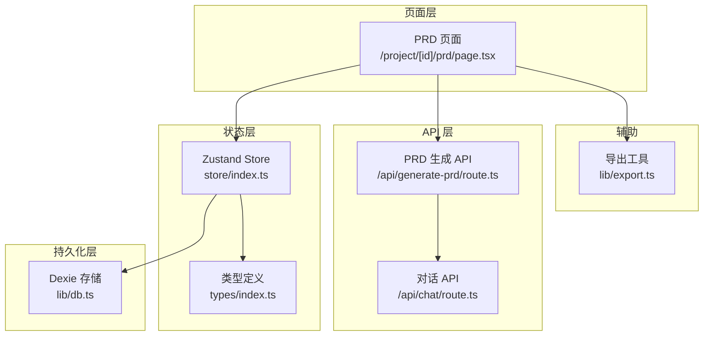
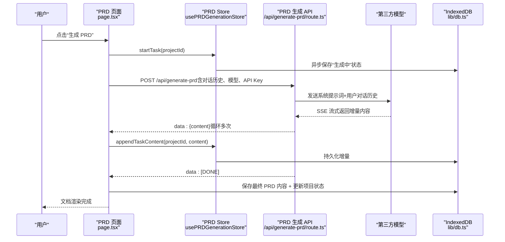
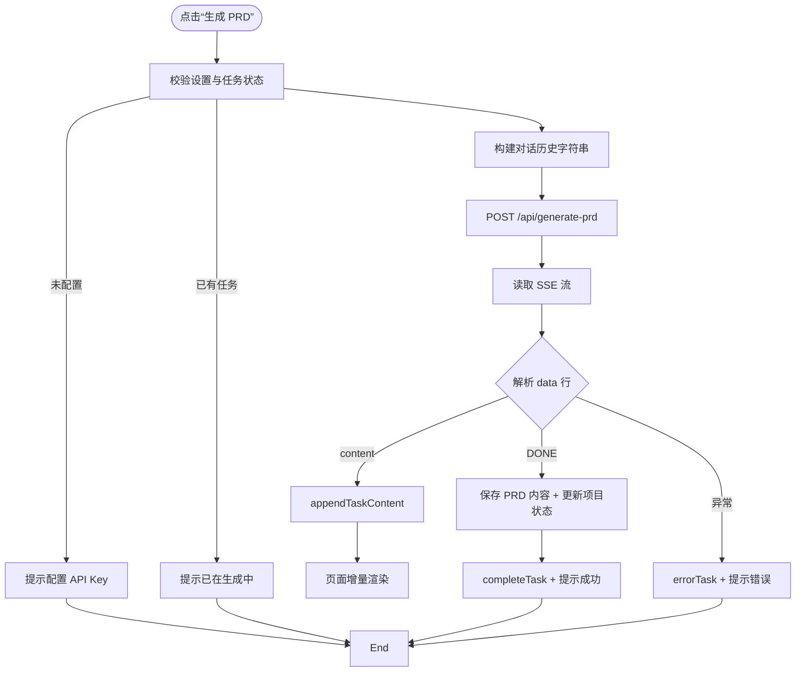
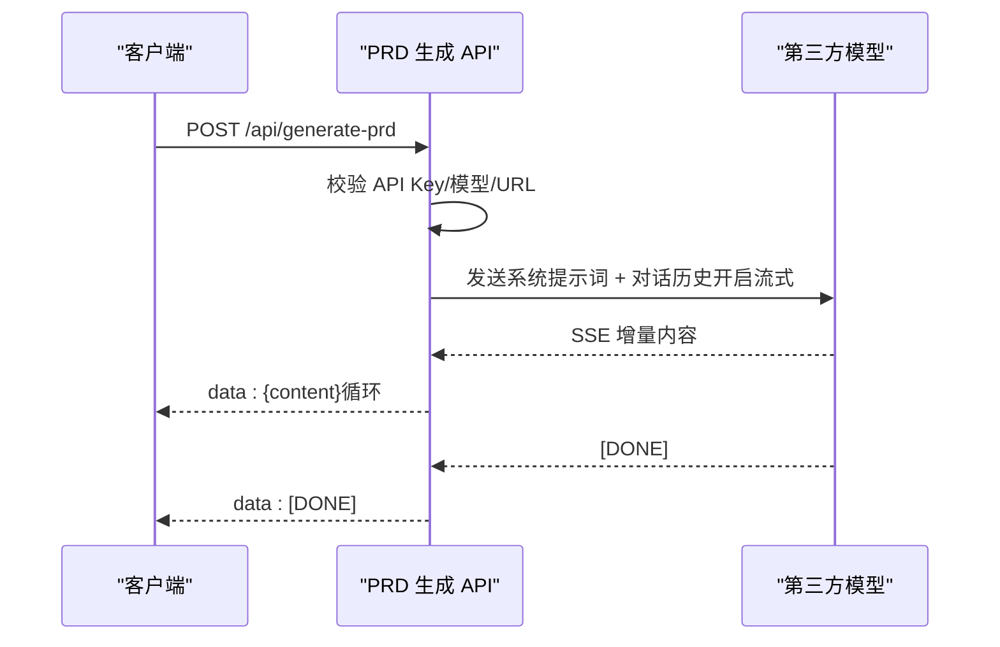
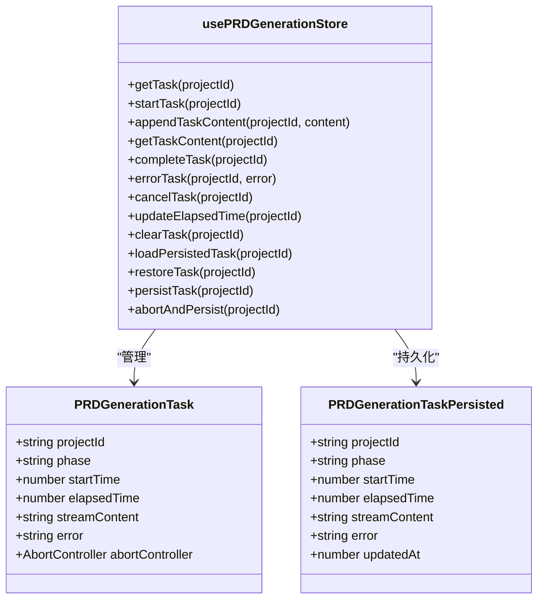
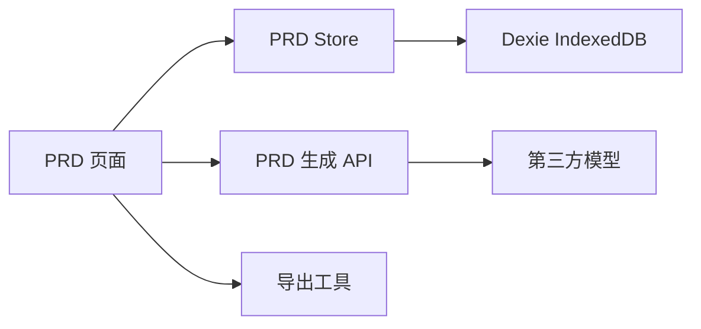

# PRD生成模块

<cite>
**本文引用的文件**
- [prd-generator/src/app/project/[id]/prd/page.tsx](file://prd-generator/src/app/project/[id]/prd/page.tsx)
- [prd-generator/src/app/api/generate-prd/route.ts](file://prd-generator/src/app/api/generate-prd/route.ts)
- [prd-generator/src/store/index.ts](file://prd-generator/src/store/index.ts)
- [prd-generator/src/types/index.ts](file://prd-generator/src/types/index.ts)
- [prd-generator/src/lib/db.ts](file://prd-generator/src/lib/db.ts)
- [prd-generator/src/app/api/chat/route.ts](file://prd-generator/src/app/api/chat/route.ts)
- [prd-generator/src/lib/export.ts](file://prd-generator/src/lib/export.ts)
</cite>

## 目录
1. [引言](#引言)
2. [项目结构](#项目结构)
3. [核心组件](#核心组件)
4. [架构总览](#架构总览)
5. [详细组件分析](#详细组件分析)
6. [依赖分析](#依赖分析)
7. [性能考虑](#性能考虑)
8. [故障排查指南](#故障排查指南)
9. [结论](#结论)

## 引言
本文件系统性阐述 PRD 文档生成模块的实现原理，围绕以下目标展开：
- 解释 /project/[id]/prd 页面如何整合对话历史并触发 PRD 生成流程
- 描述 usePRDGenerationStore 对生成任务的全生命周期管理（启动、流式接收、完成、错误处理）
- 分析 /api/generate-prd API 如何将用户输入转化为结构化 PRD 文档
- 结合 PRDGenerationTask 状态模型，解释流式内容缓冲、中断恢复和持久化机制
- 提供从点击“生成 PRD”按钮到文档完全渲染的端到端示例
- 讨论性能优化与用户体验考量

## 项目结构
PRD 生成模块位于 Next.js 应用的 App Router 路径下，采用“页面 + API 路由 + 状态管理 + 类型与持久化”的分层组织方式：
- 页面层：/project/[id]/prd/page.tsx 负责 UI、交互与任务状态联动
- API 层：/api/generate-prd/route.ts 负责将对话历史转为结构化 PRD 并以 SSE 流式输出
- 状态层：store/index.ts 提供 usePRDGenerationStore 与 useProjectStore/useSettingsStore
- 类型层：types/index.ts 定义 PRDGenerationTask、PRDGenerationTaskPersisted 等状态模型
- 持久化层：lib/db.ts 基于 Dexie 实现 IndexedDB 存储，支持 PRD 任务持久化
- 辅助：lib/export.ts 提供 Markdown 导出能力；/api/chat/route.ts 为对话生成提供参考

图表来源
- [prd-generator/src/app/project/[id]/prd/page.tsx](file://prd-generator/src/app/project/[id]/prd/page.tsx#L1-L792)
- [prd-generator/src/app/api/generate-prd/route.ts](file://prd-generator/src/app/api/generate-prd/route.ts#L1-L254)
- [prd-generator/src/store/index.ts](file://prd-generator/src/store/index.ts#L532-L853)
- [prd-generator/src/types/index.ts](file://prd-generator/src/types/index.ts#L194-L243)
- [prd-generator/src/lib/db.ts](file://prd-generator/src/lib/db.ts#L1-L210)
- [prd-generator/src/app/api/chat/route.ts](file://prd-generator/src/app/api/chat/route.ts#L1-L426)
- [prd-generator/src/lib/export.ts](file://prd-generator/src/lib/export.ts#L1-L18)

章节来源
- [prd-generator/src/app/project/[id]/prd/page.tsx](file://prd-generator/src/app/project/[id]/prd/page.tsx#L1-L120)
- [prd-generator/src/app/api/generate-prd/route.ts](file://prd-generator/src/app/api/generate-prd/route.ts#L1-L120)
- [prd-generator/src/store/index.ts](file://prd-generator/src/store/index.ts#L532-L620)
- [prd-generator/src/types/index.ts](file://prd-generator/src/types/index.ts#L194-L243)
- [prd-generator/src/lib/db.ts](file://prd-generator/src/lib/db.ts#L1-L80)

## 核心组件
- PRD 页面组件：负责加载项目与设置、监听任务状态、发起 PRD 生成、流式渲染与错误处理、导出文档
- PRD 生成 API：接收对话历史，调用第三方 AI 服务，以 SSE 流式返回增量内容
- PRD 生成 Store：维护 PRDGenerationTask 生命周期，提供流式内容缓冲、持久化、中断恢复
- 类型模型：PRDGenerationTask 与 PRDGenerationTaskPersisted，定义任务状态、时间、错误与内容
- 持久化 DB：基于 Dexie 的 IndexedDB 存储，支持 PRD 任务的生成中/错误/完成状态持久化
- 导出工具：将 PRD 内容导出为 Markdown 文件

章节来源
- [prd-generator/src/app/project/[id]/prd/page.tsx](file://prd-generator/src/app/project/[id]/prd/page.tsx#L180-L312)
- [prd-generator/src/app/api/generate-prd/route.ts](file://prd-generator/src/app/api/generate-prd/route.ts#L109-L254)
- [prd-generator/src/store/index.ts](file://prd-generator/src/store/index.ts#L532-L853)
- [prd-generator/src/types/index.ts](file://prd-generator/src/types/index.ts#L194-L243)
- [prd-generator/src/lib/db.ts](file://prd-generator/src/lib/db.ts#L168-L207)
- [prd-generator/src/lib/export.ts](file://prd-generator/src/lib/export.ts#L1-L18)

## 架构总览
PRD 生成模块遵循“页面驱动 + API 管道 + 状态持久化”的架构模式：
- 页面层通过 usePRDGenerationStore 启动任务，读取任务状态并渲染
- PRD 生成 API 将对话历史与系统提示词组合，调用第三方模型，以 SSE 流式返回增量内容
- Store 将流式增量写入 contentChunks 并合并为 streamContent，同时持久化任务状态
- 页面层在收到增量时即时渲染，完成后持久化 PRD 内容并更新项目状态

图表来源
- [prd-generator/src/app/project/[id]/prd/page.tsx](file://prd-generator/src/app/project/[id]/prd/page.tsx#L201-L311)
- [prd-generator/src/app/api/generate-prd/route.ts](file://prd-generator/src/app/api/generate-prd/route.ts#L109-L254)
- [prd-generator/src/store/index.ts](file://prd-generator/src/store/index.ts#L569-L727)
- [prd-generator/src/lib/db.ts](file://prd-generator/src/lib/db.ts#L168-L188)

## 详细组件分析

### PRD 页面：对话历史整合与生成触发
- 加载与恢复：组件挂载时加载项目与设置；若存在持久化的“生成中/错误”任务，优先恢复并提示重试
- 生成流程：
  - 校验设置与任务状态，避免重复启动
  - 构建对话历史字符串，调用 /api/generate-prd
  - 使用 ReadableStream 逐块读取响应，按行切分并解析 data: JSON，提取 content 进行增量追加
  - 完成后保存 PRD 内容、更新项目状态、完成任务并提示成功
- 错误处理：捕获 AbortError（用户取消）、网络错误与业务错误，分别提示并标记错误状态
- 计时与渲染：生成中自动计时，流式渲染骨架屏或增量内容，错误时展示重试入口

图表来源
- [prd-generator/src/app/project/[id]/prd/page.tsx](file://prd-generator/src/app/project/[id]/prd/page.tsx#L201-L311)

章节来源
- [prd-generator/src/app/project/[id]/prd/page.tsx](file://prd-generator/src/app/project/[id]/prd/page.tsx#L108-L146)
- [prd-generator/src/app/project/[id]/prd/page.tsx](file://prd-generator/src/app/project/[id]/prd/page.tsx#L188-L199)
- [prd-generator/src/app/project/[id]/prd/page.tsx](file://prd-generator/src/app/project/[id]/prd/page.tsx#L201-L311)

### PRD 生成 API：将输入转化为结构化 PRD
- 请求校验：校验 API Key、对话历史、模型与自定义 URL（HTTPS、域名白名单、禁止内网）
- 请求构建：将对话历史封装为系统提示词 + 用户消息，调用第三方模型，开启流式输出
- 响应转发：将第三方模型的增量内容按 SSE 格式透传给客户端，直到 [DONE]
- 错误处理：对网络错误与业务错误统一返回 JSON 错误体

图表来源
- [prd-generator/src/app/api/generate-prd/route.ts](file://prd-generator/src/app/api/generate-prd/route.ts#L109-L254)

章节来源
- [prd-generator/src/app/api/generate-prd/route.ts](file://prd-generator/src/app/api/generate-prd/route.ts#L1-L120)
- [prd-generator/src/app/api/generate-prd/route.ts](file://prd-generator/src/app/api/generate-prd/route.ts#L120-L200)
- [prd-generator/src/app/api/generate-prd/route.ts](file://prd-generator/src/app/api/generate-prd/route.ts#L200-L254)

### PRD 生成 Store：任务生命周期与持久化
- 任务状态模型：PRDGenerationTask（内存）与 PRDGenerationTaskPersisted（持久化），包含 phase、startTime、elapsedTime、streamContent、error
- 生命周期方法：
  - startTask：初始化任务、记录 startTime、异步持久化“生成中”
  - appendTaskContent：使用 contentChunks 数组缓存增量，避免频繁字符串拼接，再合并为 streamContent
  - updateElapsedTime：每秒更新已用时间
  - completeTask/errorTask/cancelTask：完成/错误/取消时更新内存状态并持久化
  - loadPersistedTask/restoreTask：从 IndexedDB 加载并恢复任务，修复竞态与中断标记
  - abortAndPersist：组件卸载时安全中断并保存“中断错误”状态

图表来源
- [prd-generator/src/types/index.ts](file://prd-generator/src/types/index.ts#L194-L243)
- [prd-generator/src/store/index.ts](file://prd-generator/src/store/index.ts#L532-L853)

章节来源
- [prd-generator/src/store/index.ts](file://prd-generator/src/store/index.ts#L569-L727)
- [prd-generator/src/store/index.ts](file://prd-generator/src/store/index.ts#L728-L853)
- [prd-generator/src/types/index.ts](file://prd-generator/src/types/index.ts#L194-L243)

### 持久化机制：流式内容缓冲、中断恢复与清理
- 流式内容缓冲：contentChunks 以数组形式累积增量，避免长字符串拼接带来的性能损耗
- 中断恢复：组件卸载或页面刷新时，abortAndPersist 将当前状态保存为“错误”，并在重新进入时恢复
- 任务清理：完成任务定期清理，生成中任务按需查询并修复状态
- 数据库结构：db.prdTasks 以 projectId 为主键，存储 phase、startTime、elapsedTime、streamContent、error、updatedAt

章节来源
- [prd-generator/src/store/index.ts](file://prd-generator/src/store/index.ts#L619-L644)
- [prd-generator/src/store/index.ts](file://prd-generator/src/store/index.ts#L804-L853)
- [prd-generator/src/lib/db.ts](file://prd-generator/src/lib/db.ts#L168-L207)

### 端到端示例：从点击“生成 PRD”到文档渲染
- 步骤概览
  - 用户在 PRD 页面点击“生成 PRD”
  - 页面校验设置与任务状态，构建对话历史字符串
  - 调用 /api/generate-prd，开始 SSE 流式接收
  - Store 将增量内容写入 contentChunks 并合并为 streamContent，同时持久化
  - 页面实时渲染增量内容；流结束后保存 PRD 内容、更新项目状态并完成任务
- 关键路径
  - 页面：generatePRD 调用 fetch + ReadableStream 读取 + appendTaskContent
  - API：/api/generate-prd 调用第三方模型 + SSE 转发
  - Store：appendTaskContent + persistTask + completeTask
  - DB：prdTasksDB.save/get/delete

章节来源
- [prd-generator/src/app/project/[id]/prd/page.tsx](file://prd-generator/src/app/project/[id]/prd/page.tsx#L201-L311)
- [prd-generator/src/app/api/generate-prd/route.ts](file://prd-generator/src/app/api/generate-prd/route.ts#L109-L254)
- [prd-generator/src/store/index.ts](file://prd-generator/src/store/index.ts#L569-L727)
- [prd-generator/src/lib/db.ts](file://prd-generator/src/lib/db.ts#L168-L188)

## 依赖分析
- 组件耦合
  - PRD 页面强依赖 usePRDGenerationStore 与 useProjectStore/useSettingsStore
  - PRD 生成 API 依赖第三方模型端点与安全校验逻辑
  - Store 依赖 Dexie DB 进行任务持久化
- 外部依赖
  - 第三方模型：deepseek/qwen/doubao/custom
  - 浏览器流式接口：ReadableStream/TextDecoder/AbortController
  - 文件导出：file-saver

图表来源
- [prd-generator/src/app/project/[id]/prd/page.tsx](file://prd-generator/src/app/project/[id]/prd/page.tsx#L1-L120)
- [prd-generator/src/app/api/generate-prd/route.ts](file://prd-generator/src/app/api/generate-prd/route.ts#L1-L120)
- [prd-generator/src/store/index.ts](file://prd-generator/src/store/index.ts#L532-L620)
- [prd-generator/src/lib/db.ts](file://prd-generator/src/lib/db.ts#L1-L80)
- [prd-generator/src/lib/export.ts](file://prd-generator/src/lib/export.ts#L1-L18)

章节来源
- [prd-generator/src/app/project/[id]/prd/page.tsx](file://prd-generator/src/app/project/[id]/prd/page.tsx#L1-L120)
- [prd-generator/src/app/api/generate-prd/route.ts](file://prd-generator/src/app/api/generate-prd/route.ts#L1-L120)
- [prd-generator/src/store/index.ts](file://prd-generator/src/store/index.ts#L532-L620)
- [prd-generator/src/lib/db.ts](file://prd-generator/src/lib/db.ts#L1-L80)

## 性能考虑
- 流式渲染与骨架屏：页面在生成中显示骨架屏，避免空白等待；增量内容到达即渲染，提升感知速度
- 内存缓冲优化：Store 使用 contentChunks 数组累积增量，减少字符串拼接开销，提高大文档渲染效率
- 计时与去抖：Store 每秒更新已用时间，避免频繁重渲染
- 中断与恢复：组件卸载时 abortAndPersist 保证中断状态可恢复，避免重复工作
- 导出与渲染：导出为 Markdown，避免复杂渲染开销；PRD 内容保存至 IndexedDB，下次进入可快速恢复

章节来源
- [prd-generator/src/app/project/[id]/prd/page.tsx](file://prd-generator/src/app/project/[id]/prd/page.tsx#L684-L788)
- [prd-generator/src/store/index.ts](file://prd-generator/src/store/index.ts#L619-L644)
- [prd-generator/src/lib/export.ts](file://prd-generator/src/lib/export.ts#L1-L18)

## 故障排查指南
- 常见错误与处理
  - API Key 未配置：页面提示配置后重试
  - 生成中重复点击：提示已在生成中
  - 网络/模型错误：捕获错误并标记任务为 error，页面展示重试入口
  - 中断恢复：检测到持久化“生成中”任务，自动恢复并提示重试
- 安全与合规
  - 自定义 URL 校验：HTTPS、域名白名单、禁止内网访问
  - 对话历史完整性：页面在生成前检查现有 PRD 内容，避免覆盖已完成成果
- 数据一致性
  - 任务状态与内容同步：完成/错误时持久化；清理策略按 phase 与时间窗口执行

章节来源
- [prd-generator/src/app/project/[id]/prd/page.tsx](file://prd-generator/src/app/project/[id]/prd/page.tsx#L201-L311)
- [prd-generator/src/app/api/generate-prd/route.ts](file://prd-generator/src/app/api/generate-prd/route.ts#L1-L120)
- [prd-generator/src/store/index.ts](file://prd-generator/src/store/index.ts#L741-L853)
- [prd-generator/src/lib/db.ts](file://prd-generator/src/lib/db.ts#L168-L207)

## 结论
PRD 生成模块通过“页面 + API + Store + DB”的协同，实现了从对话历史到结构化 PRD 的端到端自动化流程。其关键优势包括：
- 流式增量渲染与骨架屏体验优化
- 健壮的中断恢复与持久化机制
- 安全的自定义 API URL 校验
- 清晰的状态模型与生命周期管理

该模块为用户提供高效、可靠的 PRD 生成体验，同时具备良好的可扩展性与可维护性。