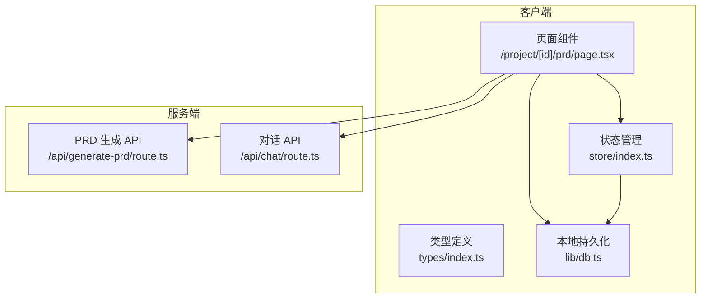
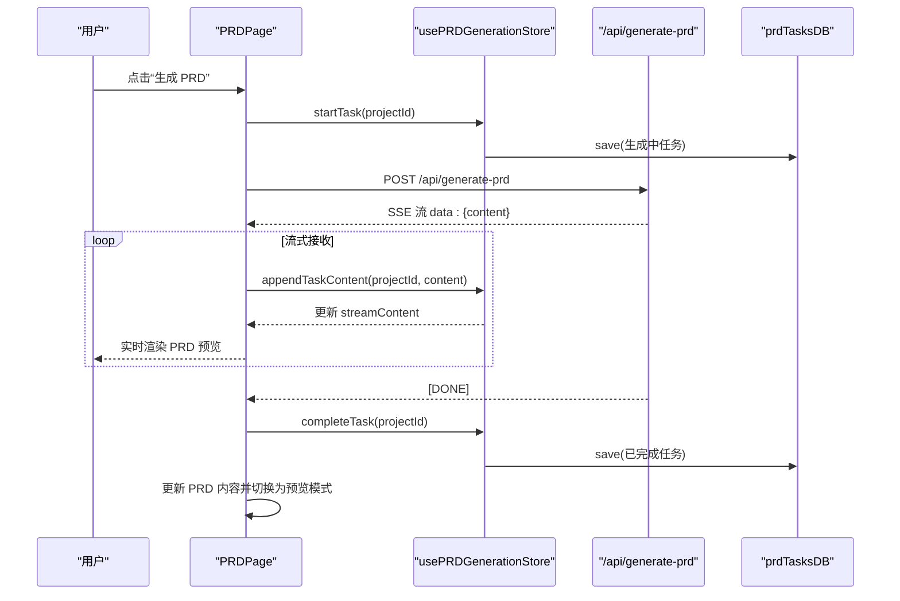
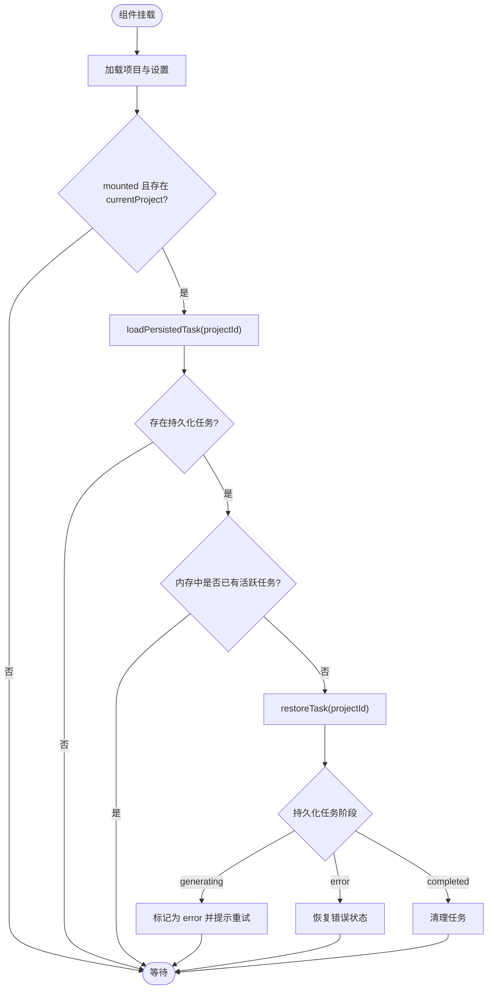
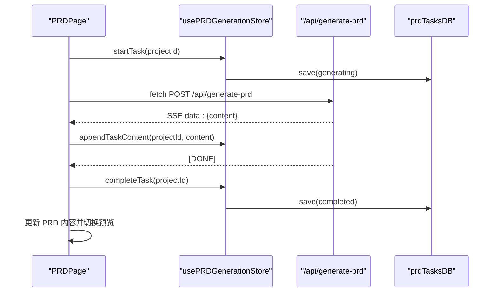
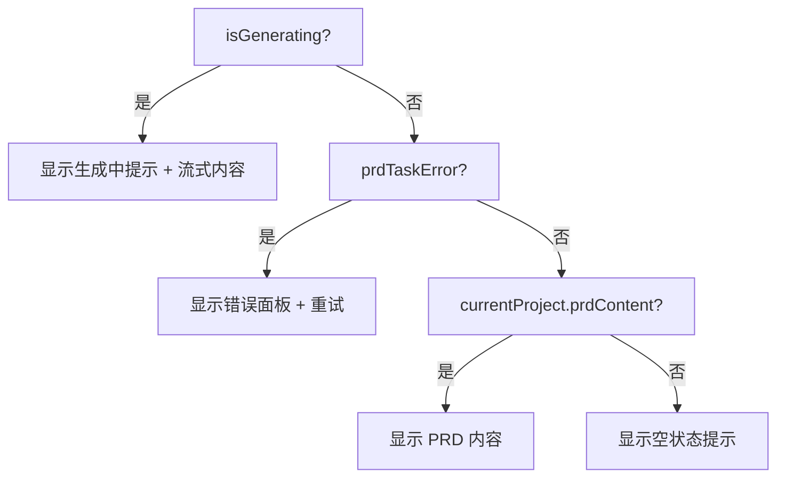
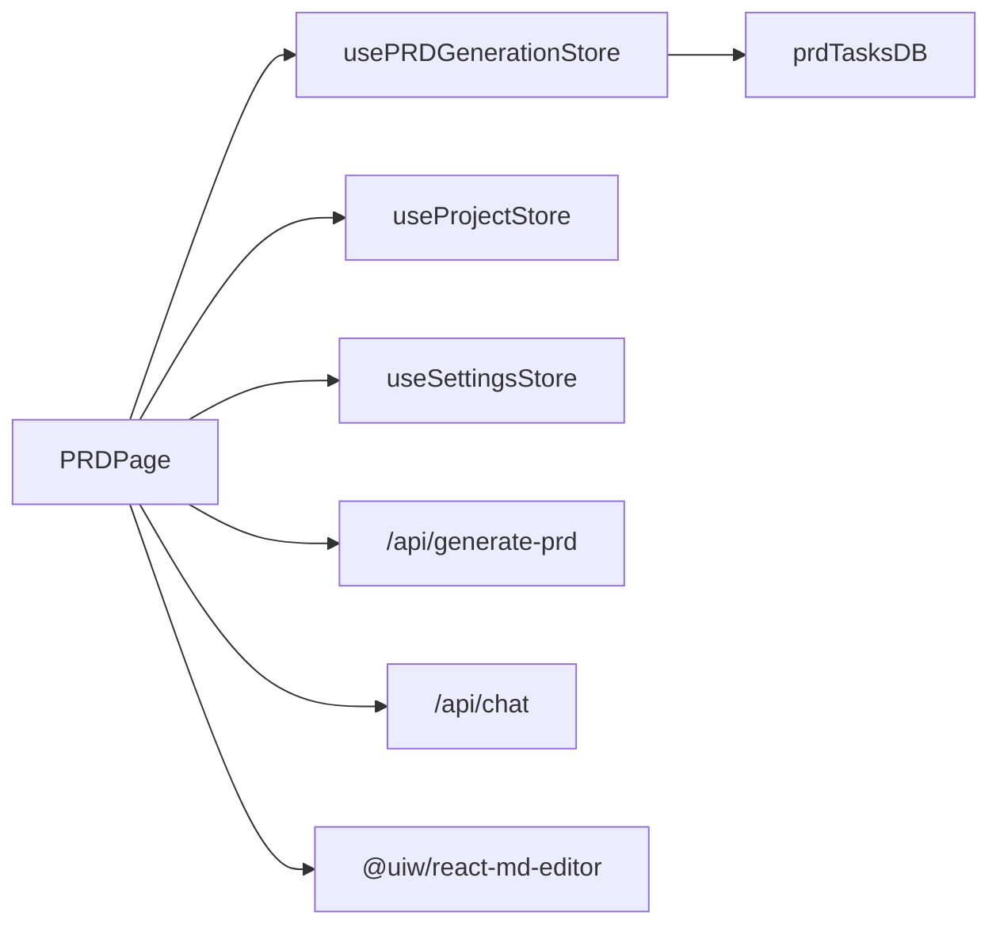

# 前端生成界面

<cite>
**本文引用的文件**
- [prd-generator/src/app/project/[id]/prd/page.tsx](file://prd-generator/src/app/project/[id]/prd/page.tsx)
- [prd-generator/src/store/index.ts](file://prd-generator/src/store/index.ts)
- [prd-generator/src/types/index.ts](file://prd-generator/src/types/index.ts)
- [prd-generator/src/lib/db.ts](file://prd-generator/src/lib/db.ts)
- [prd-generator/src/app/api/generate-prd/route.ts](file://prd-generator/src/app/api/generate-prd/route.ts)
- [prd-generator/src/app/api/chat/route.ts](file://prd-generator/src/app/api/chat/route.ts)
- [PRD.md](file://PRD.md)
</cite>

## 目录
1. [引言](#引言)
2. [项目结构](#项目结构)
3. [核心组件](#核心组件)
4. [架构总览](#架构总览)
5. [详细组件分析](#详细组件分析)
6. [依赖分析](#依赖分析)
7. [性能考虑](#性能考虑)
8. [故障排查指南](#故障排查指南)
9. [结论](#结论)
10. [附录](#附录)

## 引言
本文件系统性阐述 `/project/[id]/prd` 页面的实现原理，重点围绕以下目标展开：
- 如何通过 usePRDGenerationStore 集成 PRD 生成状态；
- 页面在加载时如何检查并恢复中断的生成任务（restoreTask）；
- 页面 UI 如何根据 isGenerating、prdTaskContent 等状态动态渲染“生成中”“错误”“空状态”等视图；
- generatePRD 函数如何整合对话历史并调用 /api/generate-prd API，以及流式响应内容如何通过 appendTaskContent 更新状态并实时渲染；
- 结合 MDEditor 组件，说明 PRD 内容的编辑与预览模式切换机制；
- 提供从点击“生成 PRD”按钮到文档完全渲染的端到端示例；
- 讨论移动端 Tab 切换和响应式布局的实现细节。

## 项目结构
该页面位于 Next.js App Router 的动态路由路径下，采用客户端组件模式，配合 Zustand 状态管理、Dexie 本地持久化与 Next.js API 路由实现端到端 PRD 生成体验。

图表来源
- [prd-generator/src/app/project/[id]/prd/page.tsx](file://prd-generator/src/app/project/[id]/prd/page.tsx#L1-L120)
- [prd-generator/src/store/index.ts](file://prd-generator/src/store/index.ts#L532-L800)
- [prd-generator/src/lib/db.ts](file://prd-generator/src/lib/db.ts#L168-L209)
- [prd-generator/src/app/api/generate-prd/route.ts](file://prd-generator/src/app/api/generate-prd/route.ts#L1-L120)
- [prd-generator/src/app/api/chat/route.ts](file://prd-generator/src/app/api/chat/route.ts#L1-L120)

章节来源
- [prd-generator/src/app/project/[id]/prd/page.tsx](file://prd-generator/src/app/project/[id]/prd/page.tsx#L1-L120)
- [prd-generator/src/store/index.ts](file://prd-generator/src/store/index.ts#L532-L800)
- [prd-generator/src/lib/db.ts](file://prd-generator/src/lib/db.ts#L168-L209)

## 核心组件
- 页面组件 PRDPage：负责加载项目、设置、监听任务状态、发起 PRD 生成、处理流式响应、渲染编辑/预览模式、处理移动端 Tab 切换与响应式布局。
- usePRDGenerationStore：维护 PRD 生成任务的内存状态与持久化，提供 startTask、appendTaskContent、completeTask、errorTask、restoreTask、loadPersistedTask 等方法。
- useProjectStore/useSettingsStore：分别负责项目数据与设置的读写，包括 PRD 内容更新与项目状态变更。
- API 路由 generate-prd：接收对话历史，调用第三方 AI 服务，返回 SSE 流式响应。
- MDEditor：动态导入的 Markdown 编辑器，支持编辑与预览双模式。

章节来源
- [prd-generator/src/app/project/[id]/prd/page.tsx](file://prd-generator/src/app/project/[id]/prd/page.tsx#L1-L120)
- [prd-generator/src/store/index.ts](file://prd-generator/src/store/index.ts#L532-L800)
- [prd-generator/src/types/index.ts](file://prd-generator/src/types/index.ts#L194-L243)
- [prd-generator/src/lib/db.ts](file://prd-generator/src/lib/db.ts#L168-L209)
- [prd-generator/src/app/api/generate-prd/route.ts](file://prd-generator/src/app/api/generate-prd/route.ts#L1-L120)

## 架构总览
PRD 页面的端到端流程如下：

图表来源
- [prd-generator/src/app/project/[id]/prd/page.tsx](file://prd-generator/src/app/project/[id]/prd/page.tsx#L200-L311)
- [prd-generator/src/store/index.ts](file://prd-generator/src/store/index.ts#L569-L727)
- [prd-generator/src/app/api/generate-prd/route.ts](file://prd-generator/src/app/api/generate-prd/route.ts#L186-L245)
- [prd-generator/src/lib/db.ts](file://prd-generator/src/lib/db.ts#L168-L188)

## 详细组件分析

### 1) 状态集成与任务恢复
- 页面在挂载后加载项目与设置，并在卸载时安全中断并保存进度（abortAndPersist）。
- 页面在 mounted 且存在 currentProject 后，检查是否存在持久化的中断任务（loadPersistedTask），若存在则调用 restoreTask 恢复到内存任务；同时避免与当前活跃任务发生竞态覆盖。
- 恢复策略：
  - 若持久化任务为“生成中”，将其标记为“错误”并提示重试；
  - 若为“错误”，直接恢复错误状态；
  - 若为“已完成”，则清理任务并保持现状。
- 任务计时：当 isGenerating 为真时，每秒更新一次 elapsedTime，用于 UI 展示。

图表来源
- [prd-generator/src/app/project/[id]/prd/page.tsx](file://prd-generator/src/app/project/[id]/prd/page.tsx#L107-L146)
- [prd-generator/src/store/index.ts](file://prd-generator/src/store/index.ts#L741-L800)
- [prd-generator/src/lib/db.ts](file://prd-generator/src/lib/db.ts#L168-L188)

章节来源
- [prd-generator/src/app/project/[id]/prd/page.tsx](file://prd-generator/src/app/project/[id]/prd/page.tsx#L107-L146)
- [prd-generator/src/store/index.ts](file://prd-generator/src/store/index.ts#L741-L800)
- [prd-generator/src/lib/db.ts](file://prd-generator/src/lib/db.ts#L168-L188)

### 2) PRD 生成流程与流式渲染
- generatePRD：
  - 校验设置与现有任务状态；
  - startTask 启动全局生成任务并持久化；
  - 整合 currentProject.conversation 为 conversationHistory；
  - 调用 /api/generate-prd，开启流式读取；
  - 使用 TextDecoder + SSE 分片缓冲逐行解析 data: JSON，提取 content 并通过 appendTaskContent 追加到任务流内容；
  - 流结束后，将完整内容写入项目 PRD 内容并设置项目状态为 generated，随后 completeTask 并持久化；
  - 异常时 errorTask 并持久化错误信息。
- appendTaskContent：
  - 使用 contentChunks 数组追加增量，避免频繁字符串拼接；
  - 合并后更新 streamContent，驱动 UI 实时渲染。

图表来源
- [prd-generator/src/app/project/[id]/prd/page.tsx](file://prd-generator/src/app/project/[id]/prd/page.tsx#L200-L311)
- [prd-generator/src/store/index.ts](file://prd-generator/src/store/index.ts#L569-L727)
- [prd-generator/src/app/api/generate-prd/route.ts](file://prd-generator/src/app/api/generate-prd/route.ts#L186-L245)

章节来源
- [prd-generator/src/app/project/[id]/prd/page.tsx](file://prd-generator/src/app/project/[id]/prd/page.tsx#L200-L311)
- [prd-generator/src/store/index.ts](file://prd-generator/src/store/index.ts#L569-L727)
- [prd-generator/src/app/api/generate-prd/route.ts](file://prd-generator/src/app/api/generate-prd/route.ts#L186-L245)

### 3) UI 动态渲染与状态分支
- isGenerating：来源于 prdTask.phase === 'generating'，用于控制 PRD 预览区的“生成中”视图；
- prdTaskContent：来自 appendTaskContent 合并后的增量内容，用于实时渲染；
- prdTaskError：当任务处于 error 阶段且当前项目无 PRD 内容时，显示错误面板并提供重试按钮；
- 空状态：当既非生成中也无错误且无内容时，显示“尚未生成 PRD”的提示；
- 正常内容：当存在持久化 PRD 内容时，优先展示。

图表来源
- [prd-generator/src/app/project/[id]/prd/page.tsx](file://prd-generator/src/app/project/[id]/prd/page.tsx#L473-L791)

章节来源
- [prd-generator/src/app/project/[id]/prd/page.tsx](file://prd-generator/src/app/project/[id]/prd/page.tsx#L473-L791)

### 4) 编辑与预览模式切换（MDEditor）
- 编辑模式 editMode：当为 true 时，右侧展示 MDEditor，value 绑定 prdContent，onChange 调用 handlePRDChange 更新项目 PRD 内容；
- 预览模式：渲染 ReactMarkdown，支持 GitHub 风格表格等；
- 编辑器高度自适应：通过 editorContainerRef 和窗口 resize 事件计算高度；
- 编辑器预览模式 preview="edit"，实现边写边看。

章节来源
- [prd-generator/src/app/project/[id]/prd/page.tsx](file://prd-generator/src/app/project/[id]/prd/page.tsx#L684-L705)
- [prd-generator/src/app/project/[id]/prd/page.tsx](file://prd-generator/src/app/project/[id]/prd/page.tsx#L706-L741)
- [prd-generator/src/app/project/[id]/prd/page.tsx](file://prd-generator/src/app/project/[id]/prd/page.tsx#L742-L785)

### 5) 移动端 Tab 切换与响应式布局
- 移动端 Tab：通过 mobileTab 状态在“对话区”和“PRD 文档”之间切换，隐藏/显示对应区域；
- 响应式布局：md:flex-row 控制左右分栏，md:flex 控制移动端单列显示；
- 顶部导航与导出按钮、设置入口均适配移动端尺寸。

章节来源
- [prd-generator/src/app/project/[id]/prd/page.tsx](file://prd-generator/src/app/project/[id]/prd/page.tsx#L521-L545)
- [prd-generator/src/app/project/[id]/prd/page.tsx](file://prd-generator/src/app/project/[id]/prd/page.tsx#L547-L788)

### 6) 自动化生成与 URL 参数
- 当 URL 参数 generate=true 且 currentProject 与 settings 就绪时，若无 PRD 内容且无生成中任务，则自动触发 generatePRD；
- 该机制可用于外部触发一键生成，避免用户手动点击。

章节来源
- [prd-generator/src/app/project/[id]/prd/page.tsx](file://prd-generator/src/app/project/[id]/prd/page.tsx#L188-L199)

## 依赖分析
- 组件耦合与内聚：
  - PRDPage 与 usePRDGenerationStore 高内聚，集中处理 PRD 生成生命周期；
  - PRDPage 与 useProjectStore/useSettingsStore 低耦合，仅在必要时读取/写入；
  - API 路由与页面通过 fetch 通信，边界清晰。
- 外部依赖：
  - @uiw/react-md-editor：动态导入，SSR 关闭；
  - react-markdown + remark-gfm：PRD 预览渲染；
  - sonner：Toast 提示；
  - Dexie：IndexedDB 封装，持久化项目与 PRD 任务。
- 潜在循环依赖：未发现直接循环；store 与 db 通过接口层隔离。

图表来源
- [prd-generator/src/app/project/[id]/prd/page.tsx](file://prd-generator/src/app/project/[id]/prd/page.tsx#L1-L120)
- [prd-generator/src/store/index.ts](file://prd-generator/src/store/index.ts#L532-L800)
- [prd-generator/src/lib/db.ts](file://prd-generator/src/lib/db.ts#L168-L209)

章节来源
- [prd-generator/src/app/project/[id]/prd/page.tsx](file://prd-generator/src/app/project/[id]/prd/page.tsx#L1-L120)
- [prd-generator/src/store/index.ts](file://prd-generator/src/store/index.ts#L532-L800)
- [prd-generator/src/lib/db.ts](file://prd-generator/src/lib/db.ts#L168-L209)

## 性能考虑
- 流式渲染优化：
  - appendTaskContent 使用 contentChunks 数组追加，减少字符串拼接开销；
  - SSE 分片缓冲避免跨 chunk 截断导致的解析错误。
- 计时器管理：
  - 仅在 isGenerating 时启动定时器，结束时及时清理，避免内存泄漏。
- 编辑器高度自适应：
  - 通过容器高度与窗口事件计算，避免不必要的重排。
- 动态导入：
  - MDEditor 动态导入并禁用 SSR，减少首屏体积与初次渲染压力。

章节来源
- [prd-generator/src/store/index.ts](file://prd-generator/src/store/index.ts#L619-L643)
- [prd-generator/src/app/project/[id]/prd/page.tsx](file://prd-generator/src/app/project/[id]/prd/page.tsx#L147-L167)
- [prd-generator/src/app/project/[id]/prd/page.tsx](file://prd-generator/src/app/project/[id]/prd/page.tsx#L176-L186)

## 故障排查指南
- 生成失败：
  - 检查 settings.defaultModel 与 apiKeys 是否配置；
  - 查看 PRD 任务错误状态 prdTaskError，必要时 clearTask 后重试；
  - 确认 /api/generate-prd 返回的错误信息。
- 任务中断恢复：
  - 若出现“生成过程中断，请重试”，说明持久化任务为 generating，需重新生成；
  - 恢复逻辑会避免覆盖当前活跃任务。
- 流式渲染异常：
  - 确认 API 返回的 SSE 行以 data: 开头，且 JSON 解析成功；
  - 检查 appendTaskContent 是否被调用，以及 contentChunks 是否正确合并。
- 编辑器不显示：
  - 确认 editMode 为 true 且 MDEditor 已动态导入；
  - 检查 editorHeight 是否正确计算。

章节来源
- [prd-generator/src/app/project/[id]/prd/page.tsx](file://prd-generator/src/app/project/[id]/prd/page.tsx#L298-L311)
- [prd-generator/src/store/index.ts](file://prd-generator/src/store/index.ts#L741-L800)
- [prd-generator/src/app/api/generate-prd/route.ts](file://prd-generator/src/app/api/generate-prd/route.ts#L186-L245)

## 结论
该页面通过 usePRDGenerationStore 将 PRD 生成状态与本地持久化紧密结合，实现了“生成中—错误—完成”的完整生命周期管理；通过流式响应与增量渲染，提供了流畅的实时预览体验；结合 MDEditor 的编辑/预览双模式与移动端 Tab 切换，兼顾了桌面与移动场景的可用性。整体架构清晰、职责分离明确，具备良好的扩展性与可维护性。

## 附录
- 端到端示例（从点击“生成 PRD”到文档渲染）：
  1) 用户点击“生成 PRD”；
  2) PRDPage 调用 generatePRD，startTask 并持久化；
  3) PRDPage 调用 /api/generate-prd，接收 SSE 流；
  4) PRDPage 每次收到 data: JSON 后 appendTaskContent，实时更新 PRD 预览；
  5) 流结束后 completeTask，持久化完成状态；
  6) PRDPage 更新项目 PRD 内容并切换为预览模式，完成渲染。

章节来源
- [prd-generator/src/app/project/[id]/prd/page.tsx](file://prd-generator/src/app/project/[id]/prd/page.tsx#L200-L311)
- [prd-generator/src/store/index.ts](file://prd-generator/src/store/index.ts#L569-L727)
- [prd-generator/src/app/api/generate-prd/route.ts](file://prd-generator/src/app/api/generate-prd/route.ts#L186-L245)