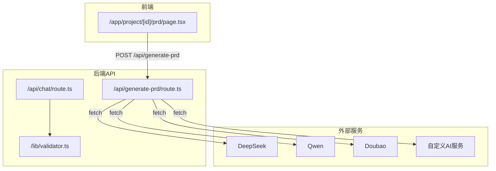
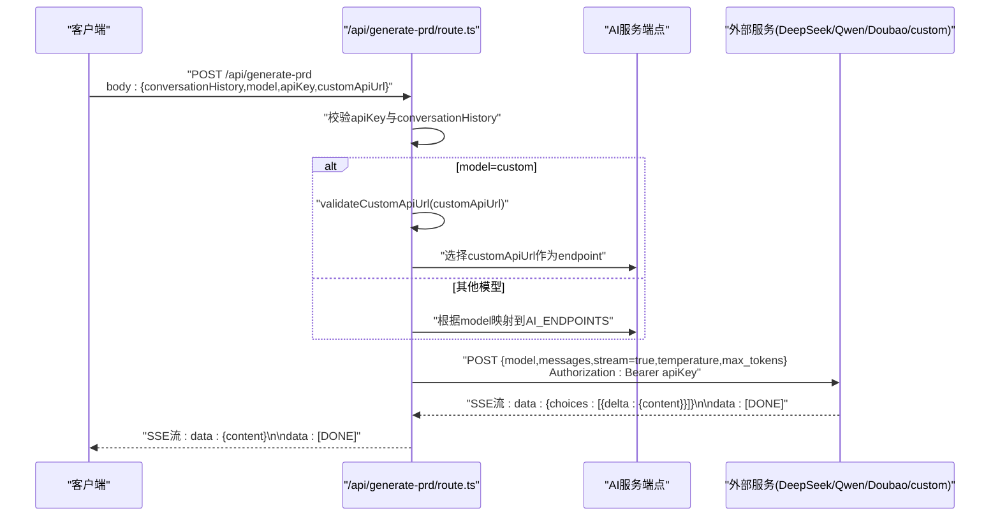
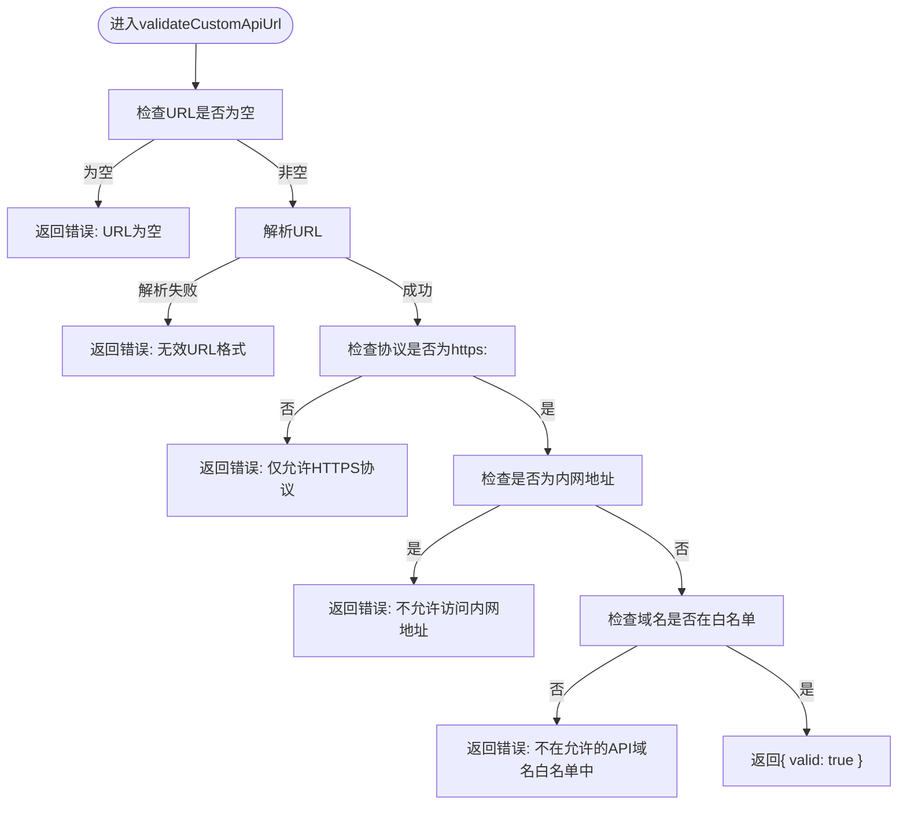
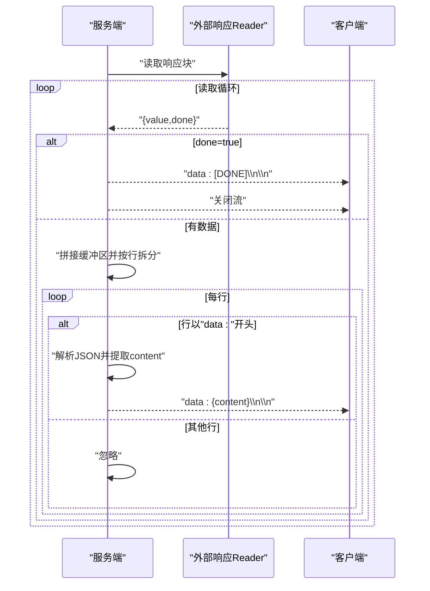
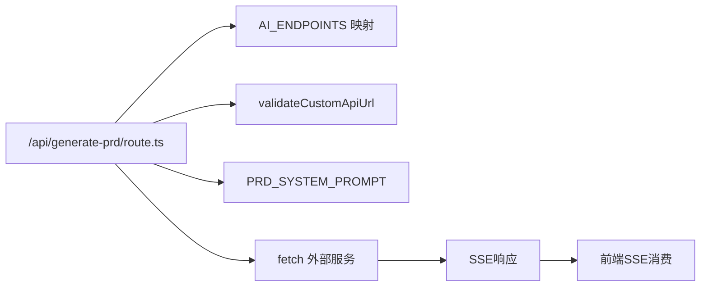

# 后端API端点

<cite>
**本文引用的文件**
- [route.ts](file://prd-generator/src/app/api/generate-prd/route.ts)
- [route.ts](file://prd-generator/src/app/api/chat/route.ts)
- [validator.ts](file://prd-generator/src/lib/validator.ts)
- [types/index.ts](file://prd-generator/src/types/index.ts)
- [page.tsx](file://prd-generator/src/app/project/[id]/prd/page.tsx)
- [PRD.md](file://PRD.md)
</cite>

## 目录
1. [简介](#简介)
2. [项目结构](#项目结构)
3. [核心组件](#核心组件)
4. [架构总览](#架构总览)
5. [详细组件分析](#详细组件分析)
6. [依赖分析](#依赖分析)
7. [性能考虑](#性能考虑)
8. [故障排查指南](#故障排查指南)
9. [结论](#结论)
10. [附录](#附录)

## 简介
本文件针对 `/api/generate-prd` API 端点进行完整技术文档化，覆盖以下关键主题：
- 请求参数接收与校验：conversationHistory、model、apiKey、customApiUrl
- 自定义API URL的安全校验逻辑 validateCustomApiUrl：HTTPS协议限制、内网地址禁止、域名白名单
- 模型选择与端点映射：DeepSeek、Qwen、Doubao、custom
- OpenAI兼容请求体构建：system提示词、消息数组、流式开启、温度与token上限
- 流式响应（SSE）实现：ReadableStream创建、SSE数据帧解析与转发
- PRD_SYSTEM_PROMPT系统提示词设计原则与输出质量影响
- 错误处理策略：网络错误、认证失败、流中断与服务端异常

## 项目结构
该API位于Next.js应用的App Router目录下，采用独立路由文件组织：
- 生成PRD端点：/api/generate-prd/route.ts
- 聊天端点（参考实现）：/api/chat/route.ts
- 校验与聚合工具：/lib/validator.ts
- 类型定义：/types/index.ts
- 前端消费SSE示例：/app/project/[id]/prd/page.tsx
- PRD设计文档：PRD.md

图表来源
- [route.ts](file://prd-generator/src/app/api/generate-prd/route.ts#L1-L254)
- [route.ts](file://prd-generator/src/app/api/chat/route.ts#L1-L426)
- [validator.ts](file://prd-generator/src/lib/validator.ts#L1-L274)
- [page.tsx](file://prd-generator/src/app/project/[id]/prd/page.tsx#L357-L397)

章节来源
- [route.ts](file://prd-generator/src/app/api/generate-prd/route.ts#L1-L254)
- [route.ts](file://prd-generator/src/app/api/chat/route.ts#L1-L426)
- [validator.ts](file://prd-generator/src/lib/validator.ts#L1-L274)
- [types/index.ts](file://prd-generator/src/types/index.ts#L1-L243)
- [page.tsx](file://prd-generator/src/app/project/[id]/prd/page.tsx#L357-L397)

## 核心组件
- /api/generate-prd/route.ts：负责接收请求、参数校验、端点选择、OpenAI兼容请求体构建、SSE流式转发
- /lib/validator.ts：提供AI响应校验、JSON提取、SSE聚合等工具（与聊天端点配合，PRD端点主要复用SSE聚合思路）
- /types/index.ts：定义AI模型配置、请求/响应类型，支撑端点参数契约
- /app/project/[id]/prd/page.tsx：前端消费SSE流，解析data帧并增量渲染

章节来源
- [route.ts](file://prd-generator/src/app/api/generate-prd/route.ts#L1-L254)
- [validator.ts](file://prd-generator/src/lib/validator.ts#L1-L274)
- [types/index.ts](file://prd-generator/src/types/index.ts#L1-L243)
- [page.tsx](file://prd-generator/src/app/project/[id]/prd/page.tsx#L357-L397)

## 架构总览
后端API端点接收前端请求，依据model参数选择对应AI服务端点或自定义URL，向外部服务发起OpenAI兼容的流式请求，再将外部服务的SSE响应以相同格式转发给客户端。安全校验贯穿自定义URL校验与HTTPS限制。

图表来源
- [route.ts](file://prd-generator/src/app/api/generate-prd/route.ts#L110-L253)
- [route.ts](file://prd-generator/src/app/api/chat/route.ts#L257-L425)

## 详细组件分析

### 参数接收与校验
- 必填参数
  - apiKey：若缺失，返回400错误“请先配置 API Key”
  - conversationHistory：若缺失，返回400错误“缺少对话历史数据”
- 可选参数
  - model：默认使用内置映射；支持custom
  - customApiUrl：仅当model=custom时生效，需通过validateCustomApiUrl校验

章节来源
- [route.ts](file://prd-generator/src/app/api/generate-prd/route.ts#L110-L159)

### 自定义API URL安全校验 validateCustomApiUrl
- 校验要点
  - 非空校验：空URL返回错误
  - URL格式校验：非法格式返回错误
  - 协议限制：仅允许HTTPS
  - 内网地址禁止：localhost、127.x、10.x、172.16–17.31、192.168.x、0.x、169.254.x、IPv6::1、fc00:/fe80:等均拒绝
  - 域名白名单：仅允许白名单域名或其子域
- 返回结构：{ valid: boolean, error?: string }

图表来源
- [route.ts](file://prd-generator/src/app/api/generate-prd/route.ts#L30-L81)

章节来源
- [route.ts](file://prd-generator/src/app/api/generate-prd/route.ts#L30-L81)

### 模型选择与端点映射
- 内置映射
  - deepseek -> https://api.deepseek.com/v1/chat/completions
  - qwen -> https://dashscope.aliyuncs.com/compatible-mode/v1/chat/completions
  - doubao -> https://ark.cn-beijing.volces.com/api/v3/chat/completions
  - custom -> 使用customApiUrl
- 默认模型名称
  - deepseek: deepseek-chat
  - qwen: qwen-turbo
  - doubao: doubao-pro-4k

章节来源
- [route.ts](file://prd-generator/src/app/api/generate-prd/route.ts#L4-L24)
- [route.ts](file://prd-generator/src/app/api/generate-prd/route.ts#L83-L89)

### OpenAI兼容请求体构建
- system提示词：PRD_SYSTEM_PROMPT，限定PRD结构、输出格式与面向工程师的建议
- messages构造：包含system与user消息，其中user消息包含conversationHistory上下文
- 请求头：Content-Type: application/json，Authorization: Bearer apiKey
- 请求体字段：model（默认模型或传入model）、messages、stream=true、temperature、max_tokens

章节来源
- [route.ts](file://prd-generator/src/app/api/generate-prd/route.ts#L90-L108)
- [route.ts](file://prd-generator/src/app/api/generate-prd/route.ts#L151-L175)

### 流式响应（SSE）实现
- 外部服务响应：fetch返回的ReadableStream
- 服务端SSE封装：创建ReadableStream，逐块读取外部响应，按行解析SSE帧
- 数据帧处理：过滤以"data: "开头的行，去除"data: "前缀，解析JSON，提取choices[0].delta.content
- 完整性标记：遇到"[DONE]"时，向客户端发送"data: [DONE]"帧
- 响应头：Content-Type: text/event-stream，Cache-Control: no-cache，Connection: keep-alive

图表来源
- [route.ts](file://prd-generator/src/app/api/generate-prd/route.ts#L186-L245)

章节来源
- [route.ts](file://prd-generator/src/app/api/generate-prd/route.ts#L186-L245)
- [page.tsx](file://prd-generator/src/app/project/[id]/prd/page.tsx#L357-L397)

### PRD_SYSTEM_PROMPT设计原则与影响
- 结构化要求：明确PRD八大部分（概述、功能、UI/UX、技术架构、数据模型、实现要点、竞品分析、优化建议）
- 输出约束：面向AI工程师，强调技术建议理由、数据模型清晰度、Markdown格式
- 影响：提升生成内容的结构性与工程可执行性，减少歧义与遗漏，增强下游消费一致性

章节来源
- [route.ts](file://prd-generator/src/app/api/generate-prd/route.ts#L90-L108)
- [PRD.md](file://PRD.md#L135-L183)

### 错误处理策略
- 参数错误
  - 缺少apiKey或conversationHistory：返回400及错误信息
- 端点选择错误
  - 无效model：返回400
  - 自定义URL校验失败：返回400
- 外部服务错误
  - 外部响应非ok：读取错误文本并返回对应HTTP状态码与错误信息
- 流式过程错误
  - 读取/解析异常：捕获并记录日志，关闭controller，保持SSE连接可用性
- 服务端异常
  - try/catch捕获：返回500及错误信息

章节来源
- [route.ts](file://prd-generator/src/app/api/generate-prd/route.ts#L110-L159)
- [route.ts](file://prd-generator/src/app/api/generate-prd/route.ts#L177-L184)
- [route.ts](file://prd-generator/src/app/api/generate-prd/route.ts#L230-L236)
- [route.ts](file://prd-generator/src/app/api/generate-prd/route.ts#L246-L253)

## 依赖分析
- 内部依赖
  - 与AI端点映射：AI_ENDPOINTS、DEFAULT_MODELS
  - 与安全校验：validateCustomApiUrl
  - 与系统提示词：PRD_SYSTEM_PROMPT
- 外部依赖
  - fetch：调用外部AI服务
  - ReadableStream：封装SSE流
- 前端依赖
  - 前端通过SSE消费/data: {content}帧，增量更新PRD内容

图表来源
- [route.ts](file://prd-generator/src/app/api/generate-prd/route.ts#L1-L254)
- [page.tsx](file://prd-generator/src/app/project/[id]/prd/page.tsx#L357-L397)

章节来源
- [route.ts](file://prd-generator/src/app/api/generate-prd/route.ts#L1-L254)
- [page.tsx](file://prd-generator/src/app/project/[id]/prd/page.tsx#L357-L397)

## 性能考虑
- 流式传输：启用stream=true，降低首字延迟，提升交互体验
- 温度与token上限：适度的temperature与合理max_tokens有助于平衡创造性与稳定性
- SSE解析：按行增量解析，避免一次性缓冲大量数据
- 前端消费：按data帧增量渲染，避免全量重绘

## 故障排查指南
- 400错误
  - 缺少apiKey或conversationHistory：检查请求体字段
  - 无效model：确认model值在内置映射或custom
  - 自定义URL校验失败：检查协议、内网地址与域名白名单
- 5xx错误
  - 外部服务不可达或认证失败：检查apiKey与网络连通性
  - 服务端异常：查看日志并确认try/catch分支
- SSE中断
  - 网络抖动：前端应具备重连与断点续传策略
  - 解析异常：忽略单行解析错误，继续消费后续帧

章节来源
- [route.ts](file://prd-generator/src/app/api/generate-prd/route.ts#L110-L159)
- [route.ts](file://prd-generator/src/app/api/generate-prd/route.ts#L177-L184)
- [route.ts](file://prd-generator/src/app/api/generate-prd/route.ts#L230-L236)
- [route.ts](file://prd-generator/src/app/api/generate-prd/route.ts#L246-L253)

## 结论
/api/generate-prd端点通过严格的参数校验、安全的自定义URL校验、OpenAI兼容的请求体构建以及稳健的SSE流式转发，实现了从对话历史到PRD文档的高效生成。PRD_SYSTEM_PROMPT的设计确保了输出结构化与工程可执行性。整体架构清晰、可扩展性强，便于接入更多AI服务提供商。

## 附录
- 类型定义参考
  - AI模型配置：AI_MODELS
  - 请求参数：ChatRequest（与PRD端点参数一致）
  - 响应类型：ChatResponse（与PRD端点SSE结构一致）

章节来源
- [types/index.ts](file://prd-generator/src/types/index.ts#L102-L118)
- [types/index.ts](file://prd-generator/src/types/index.ts#L111-L123)