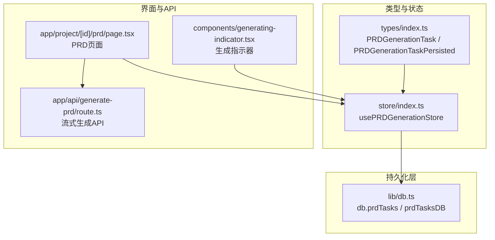
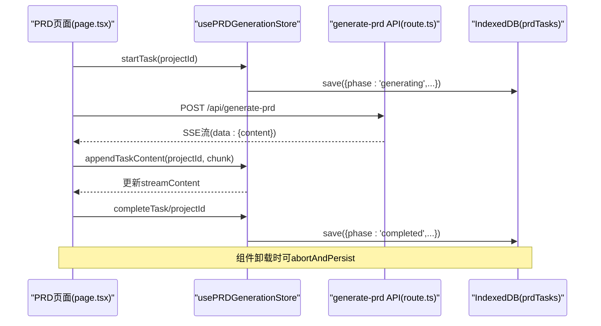
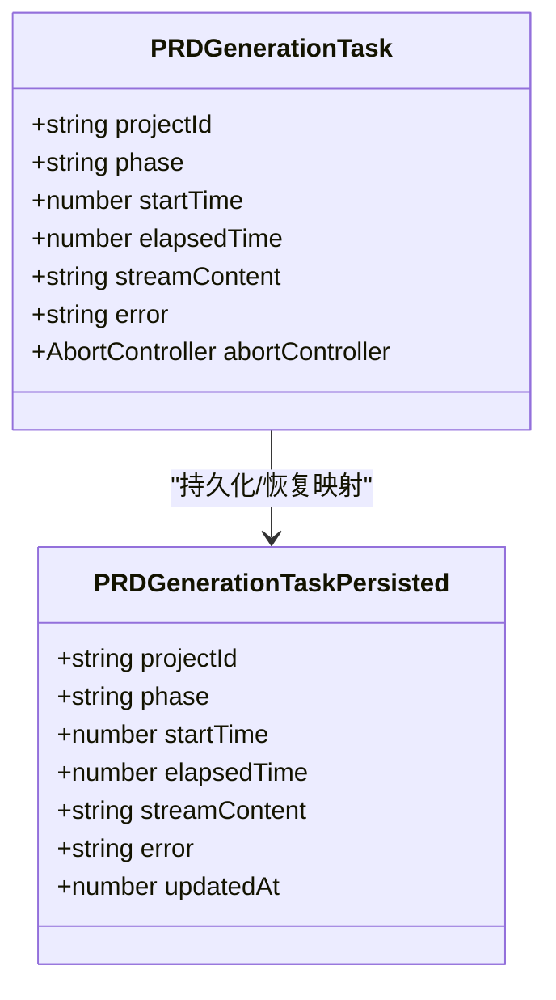
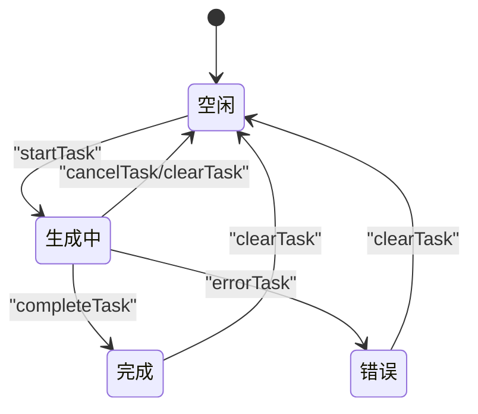
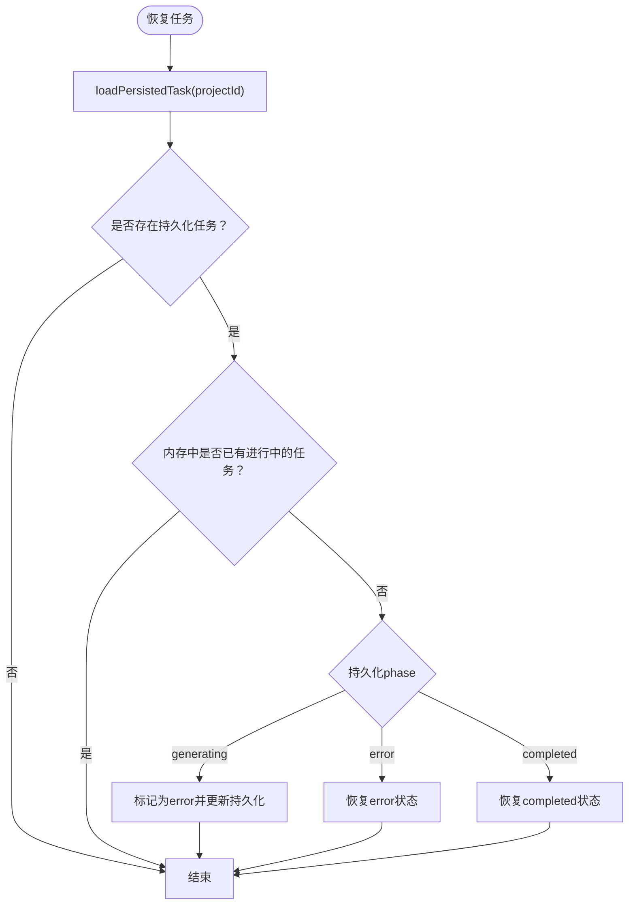
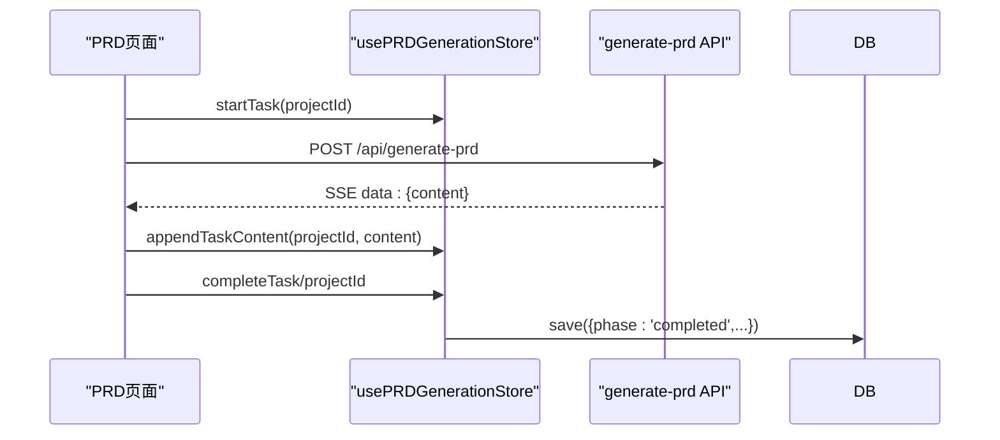
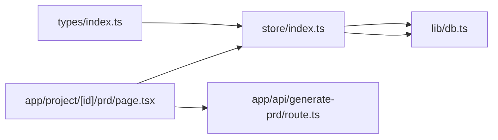

# PRD生成任务模型

<cite>
**本文引用的文件**
- [types/index.ts](file://prd-generator/src/types/index.ts)
- [store/index.ts](file://prd-generator/src/store/index.ts)
- [db.ts](file://prd-generator/src/lib/db.ts)
- [page.tsx](file://prd-generator/src/app/project/[id]/prd/page.tsx)
- [route.ts](file://prd-generator/src/app/api/generate-prd/route.ts)
- [generating-indicator.tsx](file://prd-generator/src/components/generating-indicator.tsx)
</cite>

## 目录
1. [引言](#引言)
2. [项目结构](#项目结构)
3. [核心组件](#核心组件)
4. [架构总览](#架构总览)
5. [详细组件分析](#详细组件分析)
6. [依赖分析](#依赖分析)
7. [性能考虑](#性能考虑)
8. [故障排查指南](#故障排查指南)
9. [结论](#结论)

## 引言
本文件聚焦于PRD生成任务模型，系统性解析PRDGenerationTask与PRDGenerationTaskPersisted两类类型定义及其在生成流程中的生命周期与状态机转换。同时结合usePRDGenerationStore的使用方式，说明该模型如何支撑UI状态渲染（如生成中提示、错误提示、内容展示），并阐明其与IndexedDB持久化结构之间的映射关系与序列化策略。

## 项目结构
围绕PRD生成任务模型的关键代码分布在以下位置：
- 类型定义：src/types/index.ts
- 状态管理：src/store/index.ts
- IndexedDB封装：src/lib/db.ts
- 页面组件与API对接：src/app/project/[id]/prd/page.tsx、src/app/api/generate-prd/route.ts
- 生成进度指示组件：src/components/generating-indicator.tsx

图表来源
- [types/index.ts](file://prd-generator/src/types/index.ts#L196-L223)
- [store/index.ts](file://prd-generator/src/store/index.ts#L532-L809)
- [db.ts](file://prd-generator/src/lib/db.ts#L1-L33)
- [page.tsx](file://prd-generator/src/app/project/[id]/prd/page.tsx#L1-L120)
- [route.ts](file://prd-generator/src/app/api/generate-prd/route.ts#L1-L120)
- [generating-indicator.tsx](file://prd-generator/src/components/generating-indicator.tsx#L1-L60)

章节来源
- [types/index.ts](file://prd-generator/src/types/index.ts#L196-L223)
- [store/index.ts](file://prd-generator/src/store/index.ts#L532-L809)
- [db.ts](file://prd-generator/src/lib/db.ts#L1-L33)
- [page.tsx](file://prd-generator/src/app/project/[id]/prd/page.tsx#L1-L120)
- [route.ts](file://prd-generator/src/app/api/generate-prd/route.ts#L1-L120)
- [generating-indicator.tsx](file://prd-generator/src/components/generating-indicator.tsx#L1-L60)

## 核心组件
- PRDGenerationTask（内存态，含AbortController）
  - 字段：projectId、phase（generating/completed/error）、startTime、elapsedTime、streamContent、error、abortController
  - 用途：运行时内存中的任务状态，承载流式内容与中断控制
- PRDGenerationTaskPersisted（持久化态，不含AbortController）
  - 字段：projectId、phase、startTime、elapsedTime、streamContent、error、updatedAt
  - 用途：IndexedDB持久化存储，用于跨会话恢复与清理

章节来源
- [types/index.ts](file://prd-generator/src/types/index.ts#L196-L223)

## 架构总览
PRD生成任务模型贯穿“类型定义—状态管理—持久化—UI渲染—API流式”的全链路。

图表来源
- [page.tsx](file://prd-generator/src/app/project/[id]/prd/page.tsx#L200-L311)
- [route.ts](file://prd-generator/src/app/api/generate-prd/route.ts#L186-L244)
- [store/index.ts](file://prd-generator/src/store/index.ts#L569-L695)
- [db.ts](file://prd-generator/src/lib/db.ts#L171-L188)

## 详细组件分析

### 类型定义与映射关系
- PRDGenerationTask（内存态）
  - 包含AbortController，便于在组件卸载或用户取消时中断流式生成
  - 适合在运行时快速更新streamContent与elapsedTime
- PRDGenerationTaskPersisted（持久化态）
  - 不包含AbortController，避免序列化问题
  - 增加updatedAt，便于清理策略与恢复逻辑
- 映射策略
  - 内存态与持久化态字段基本一致，差异在于AbortController与updatedAt
  - 持久化写入时统一追加updatedAt；恢复时根据phase决定是否标记为error

图表来源
- [types/index.ts](file://prd-generator/src/types/index.ts#L196-L223)

章节来源
- [types/index.ts](file://prd-generator/src/types/index.ts#L196-L223)

### 生命周期与状态机
- 状态集合：idle/generating/completed/error
- 转换路径
  - idle → generating：startTask
  - generating → completed：completeTask
  - generating → error：errorTask
  - generating → idle：cancelTask/clearTask
- 中断与恢复
  - 组件卸载时通过abortAndPersist安全中断并持久化
  - 页面挂载时通过restoreTask恢复中断任务，若持久化仍为generating则标记为error

图表来源
- [store/index.ts](file://prd-generator/src/store/index.ts#L569-L740)

章节来源
- [store/index.ts](file://prd-generator/src/store/index.ts#L569-L740)

### UI状态渲染支撑
- 生成中提示
  - 通过prdTask.phase === 'generating'与prdTask.elapsedTime驱动“生成中...已用时X秒”
  - 通过streamContent实时展示流式内容
- 错误提示
  - 通过prdTask.phase === 'error'与prdTask.error展示错误面板，提供重试入口
- 内容展示
  - 若处于生成中，则优先展示streamContent；否则展示项目持久化的prdContent
- 生成指示器组件
  - 生成指示器组件（非PRD任务模型）展示了生成步骤与进度动画，用于聊天生成流程；PRD生成流程主要由页面组件直接消费store状态

章节来源
- [page.tsx](file://prd-generator/src/app/project/[id]/prd/page.tsx#L649-L783)
- [generating-indicator.tsx](file://prd-generator/src/components/generating-indicator.tsx#L1-L130)

### 与IndexedDB持久化的映射与序列化策略
- 存储对象：db.prdTasks（索引：projectId, phase, updatedAt）
- 写入策略
  - startTask：异步保存phase='generating'
  - completeTask/errorTask：保存对应最终态
  - 每次save均追加updatedAt
- 读取与恢复
  - loadPersistedTask：按projectId读取
  - restoreTask：若持久化为generating，标记为error并更新持久化；其他状态直接恢复
- 清理策略
  - getIncomplete：查询未完成任务
  - cleanupCompleted：清理超过1天的completed任务

图表来源
- [store/index.ts](file://prd-generator/src/store/index.ts#L741-L809)
- [db.ts](file://prd-generator/src/lib/db.ts#L171-L209)

章节来源
- [store/index.ts](file://prd-generator/src/store/index.ts#L741-L809)
- [db.ts](file://prd-generator/src/lib/db.ts#L171-L209)

### API流式生成与store协作
- PRD页面发起POST /api/generate-prd，接收SSE流
- 每收到一个data:块，解析其中的content并调用appendTaskContent
- 完整完成后，调用completeTask并持久化
- 若发生错误（含AbortError），调用errorTask并持久化

图表来源
- [page.tsx](file://prd-generator/src/app/project/[id]/prd/page.tsx#L200-L311)
- [route.ts](file://prd-generator/src/app/api/generate-prd/route.ts#L186-L244)
- [store/index.ts](file://prd-generator/src/store/index.ts#L569-L695)

章节来源
- [page.tsx](file://prd-generator/src/app/project/[id]/prd/page.tsx#L200-L311)
- [route.ts](file://prd-generator/src/app/api/generate-prd/route.ts#L186-L244)
- [store/index.ts](file://prd-generator/src/store/index.ts#L569-L695)

## 依赖分析
- 类型依赖
  - PRDGenerationTask/PRDGenerationTaskPersisted来自types/index.ts
- 状态依赖
  - usePRDGenerationStore在store/index.ts中定义，依赖db.ts中的prdTasksDB
- UI依赖
  - PRD页面组件在page.tsx中消费store状态，渲染生成中/错误/内容
- API依赖
  - generate-prd/route.ts提供SSE流式输出，供页面解析并更新store

图表来源
- [types/index.ts](file://prd-generator/src/types/index.ts#L196-L223)
- [store/index.ts](file://prd-generator/src/store/index.ts#L532-L809)
- [db.ts](file://prd-generator/src/lib/db.ts#L1-L33)
- [page.tsx](file://prd-generator/src/app/project/[id]/prd/page.tsx#L1-L120)
- [route.ts](file://prd-generator/src/app/api/generate-prd/route.ts#L1-L120)

章节来源
- [types/index.ts](file://prd-generator/src/types/index.ts#L196-L223)
- [store/index.ts](file://prd-generator/src/store/index.ts#L532-L809)
- [db.ts](file://prd-generator/src/lib/db.ts#L1-L33)
- [page.tsx](file://prd-generator/src/app/project/[id]/prd/page.tsx#L1-L120)
- [route.ts](file://prd-generator/src/app/api/generate-prd/route.ts#L1-L120)

## 性能考虑
- 流式内容缓冲优化
  - store中采用contentChunks数组累积，减少频繁字符串拼接带来的性能损耗
- 计时器与状态更新
  - 仅在phase为generating时启动elapsedTime定时器，避免无意义的周期性更新
- 持久化写入
  - startTask时异步save，避免阻塞UI主线程
- 清理策略
  - 定期清理completed任务与过期chatDrafts，降低DB体积与查询压力

章节来源
- [store/index.ts](file://prd-generator/src/store/index.ts#L569-L740)
- [db.ts](file://prd-generator/src/lib/db.ts#L171-L209)

## 故障排查指南
- 生成中断恢复
  - 若内存中已有进行中任务，restoreTask不会覆盖；若持久化为generating，将标记为error并提示重试
- 取消与清理
  - cancelTask会中断并删除持久化记录；clearTask会清空内存与持久化
- 组件卸载安全中断
  - abortAndPersist在卸载时调用，确保生成过程被中断并持久化当前进度
- 错误处理
  - errorTask会将phase置为error并持久化；页面错误面板提供重试入口

章节来源
- [store/index.ts](file://prd-generator/src/store/index.ts#L697-L740)
- [page.tsx](file://prd-generator/src/app/project/[id]/prd/page.tsx#L298-L311)

## 结论
PRDGenerationTask与PRDGenerationTaskPersisted构成了PRD生成任务的双态模型：前者负责运行时的流式生成与中断控制，后者负责跨会话的持久化与恢复。二者通过usePRDGenerationStore与IndexedDB协同工作，配合页面组件的UI渲染，实现了从“生成中—完成/错误—恢复—展示”的完整生命周期闭环。该设计兼顾了用户体验（流式反馈、错误提示、恢复机制）与工程实践（类型安全、持久化、清理策略）。