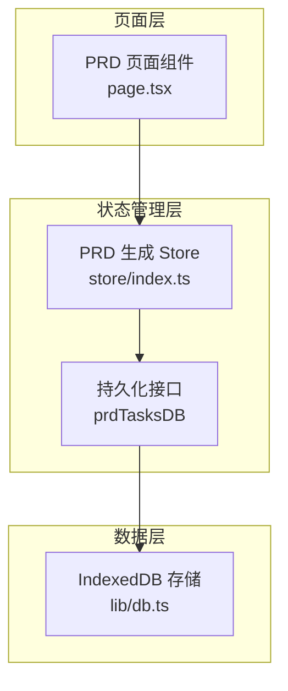
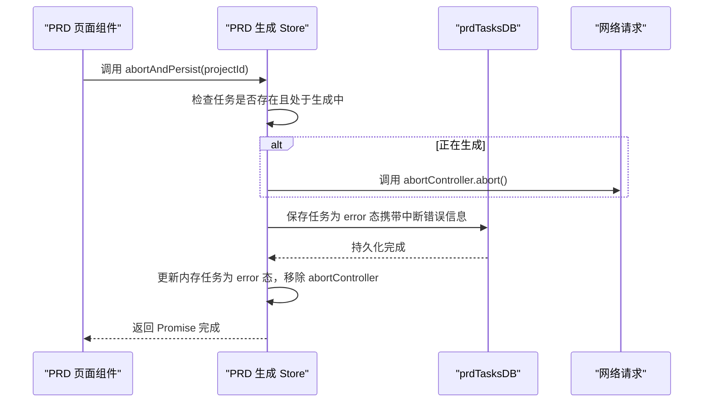
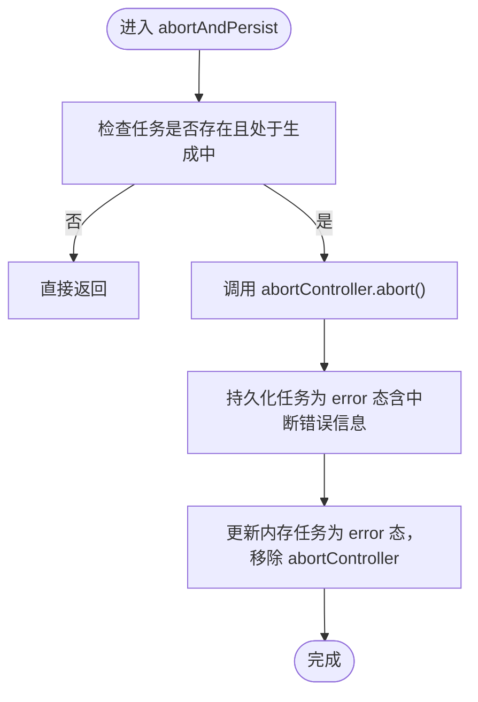

# 中断与持久化协调机制

<cite>
**本文引用的文件**
- [store/index.ts](file://prd-generator/src/store/index.ts)
- [app/project/[id]/prd/page.tsx](file://prd-generator/src/app/project/[id]/prd/page.tsx)
- [lib/db.ts](file://prd-generator/src/lib/db.ts)
- [types/index.ts](file://prd-generator/src/types/index.ts)
</cite>

## 目录
1. [引言](#引言)
2. [项目结构](#项目结构)
3. [核心组件](#核心组件)
4. [架构总览](#架构总览)
5. [详细组件分析](#详细组件分析)
6. [依赖分析](#依赖分析)
7. [性能考虑](#性能考虑)
8. [故障排查指南](#故障排查指南)
9. [结论](#结论)

## 引言
本文件聚焦于组件卸载或页面切换时，PRD 生成流程如何通过 abortAndPersist 方法协调 AbortController.abort() 与持久化（persistTask）调用，确保生成任务的资源释放与状态保存具备原子性，防止内存泄漏与状态不一致。我们将系统性解析该方法的执行顺序、异常处理、与 persistTask 的协作关系，以及对用户数据完整性保护策略，并结合实际使用场景说明其在提升应用稳定性与用户体验方面的作用。

## 项目结构
- 状态管理位于 store/index.ts，其中包含 PRD 生成 Store 的完整逻辑，包括任务生命周期、持久化与恢复、以及 abortAndPersist 的实现。
- 页面组件 app/project/[id]/prd/page.tsx 在组件卸载时触发 abortAndPersist，同时负责检查并恢复中断任务。
- 数据持久化通过 lib/db.ts 中的 prdTasksDB 实现，使用 IndexedDB（Dexie）进行本地存储。
- 类型定义位于 types/index.ts，明确 PRDGenerationTask 与 PRDGenerationTaskPersisted 的字段与生命周期。

图表来源
- [store/index.ts](file://prd-generator/src/store/index.ts#L556-L852)
- [app/project/[id]/prd/page.tsx](file://prd-generator/src/app/project/[id]/prd/page.tsx#L94-L145)
- [lib/db.ts](file://prd-generator/src/lib/db.ts#L169-L207)

章节来源
- [store/index.ts](file://prd-generator/src/store/index.ts#L556-L852)
- [app/project/[id]/prd/page.tsx](file://prd-generator/src/app/project/[id]/prd/page.tsx#L94-L145)
- [lib/db.ts](file://prd-generator/src/lib/db.ts#L169-L207)

## 核心组件
- PRD 生成 Store：提供任务生命周期管理、内容追加、完成/错误/取消、持久化与恢复、以及 abortAndPersist。
- PRD 页面组件：在卸载钩子中调用 abortAndPersist；在挂载时检查并恢复中断任务。
- 持久化接口 prdTasksDB：封装 IndexedDB 读写，提供 get/save/delete 等方法。
- 类型定义：PRDGenerationTask（内存态，含 AbortController）、PRDGenerationTaskPersisted（持久化态，不含 AbortController）。

章节来源
- [store/index.ts](file://prd-generator/src/store/index.ts#L556-L852)
- [types/index.ts](file://prd-generator/src/types/index.ts#L194-L223)

## 架构总览
abortAndPersist 的目标是在组件卸载或页面切换时：
- 原子性地中断网络请求（AbortController.abort）
- 将当前任务状态持久化为“错误”态（携带中断信息），以便后续恢复
- 更新内存状态，确保 UI 与状态一致

图表来源
- [store/index.ts](file://prd-generator/src/store/index.ts#L819-L851)
- [lib/db.ts](file://prd-generator/src/lib/db.ts#L169-L188)

## 详细组件分析

### abortAndPersist 方法的实现与原子性保障
- 条件判断：仅当任务存在且处于生成中时才中断请求，避免对非生成态任务产生副作用。
- 中断请求：调用 AbortController.abort()，使正在进行的 fetch/流式读取提前结束。
- 持久化：将当前任务状态保存为“错误”态，携带中断提示信息，确保即使进程退出也能恢复。
- 内存状态更新：将内存中的任务状态置为“错误”，并移除 abortController，避免悬挂引用导致内存泄漏。
- 原子性：先中断再持久化，最后更新内存状态，确保三者顺序一致，避免竞态条件。

图表来源
- [store/index.ts](file://prd-generator/src/store/index.ts#L819-L851)

章节来源
- [store/index.ts](file://prd-generator/src/store/index.ts#L819-L851)

### 与 persistTask 的协作关系
- persistTask：在常规流程中用于保存当前任务状态（如 startTask、appendTaskContent、completeTask、errorTask 等），确保中间态也能持久化。
- abortAndPersist：在异常路径（组件卸载/页面切换）中，将任务保存为“错误”态，便于后续恢复。
- 协作要点：
  - 两者均通过 prdTasksDB.save 写入相同的数据结构（PRDGenerationTaskPersisted），保持一致性。
  - abortAndPersist 会显式将 phase 设为 error 并附加中断错误信息，而 persistTask 通常保存当前真实状态。
  - 二者都更新内存状态，确保 UI 与状态一致。

章节来源
- [store/index.ts](file://prd-generator/src/store/index.ts#L601-L668)
- [store/index.ts](file://prd-generator/src/store/index.ts#L804-L817)
- [store/index.ts](file://prd-generator/src/store/index.ts#L819-L851)
- [lib/db.ts](file://prd-generator/src/lib/db.ts#L169-L188)
- [types/index.ts](file://prd-generator/src/types/index.ts#L214-L223)

### 异常处理与顺序保证
- 请求中断：AbortController.abort() 会在上游 fetch/read 中抛出 AbortError，调用方需捕获并区分处理。
- 持久化异常：prdTasksDB.save 为异步操作，若失败应有兜底策略（例如重试或日志上报），当前实现未显式重试，建议在上层调用处补充。
- 顺序保证：abort -> persist -> update memory，避免“先持久化后中断”导致丢失中断信号或“先更新内存后持久化”导致状态不一致。
- 竞态防护：页面卸载时，restoreTask 在挂载阶段再次检查是否存在新的生成任务，避免旧持久化覆盖新任务。

章节来源
- [app/project/[id]/prd/page.tsx](file://prd-generator/src/app/project/[id]/prd/page.tsx#L94-L145)
- [store/index.ts](file://prd-generator/src/store/index.ts#L819-L851)

### 用户数据完整性保护策略
- 中断错误提示：abortAndPersist 将错误信息设为“生成过程中断，请重试”，帮助用户理解状态并引导重试。
- 恢复机制：页面挂载时检查持久化任务，若为“生成中”或“错误”，则恢复内存状态并提示用户重试；若项目已有有效内容，则清理错误状态。
- 内容保留：持久化保存 streamContent，避免中断导致的进度丢失。
- 无悬挂引用：移除 abortController，避免内存泄漏。

章节来源
- [store/index.ts](file://prd-generator/src/store/index.ts#L819-L851)
- [app/project/[id]/prd/page.tsx](file://prd-generator/src/app/project/[id]/prd/page.tsx#L108-L145)

### 实际使用场景与用户体验
- 组件卸载/页面切换：用户快速切换路由或关闭标签页时，确保生成请求被中断且进度被保存，避免后台持续占用资源。
- 恢复体验：下次打开页面时自动提示并恢复中断任务，减少重复输入成本。
- 错误提示：明确的中断错误信息帮助用户理解当前状态，避免困惑。

章节来源
- [app/project/[id]/prd/page.tsx](file://prd-generator/src/app/project/[id]/prd/page.tsx#L94-L145)
- [store/index.ts](file://prd-generator/src/store/index.ts#L819-L851)

## 依赖分析
- PRD 页面组件依赖 PRD 生成 Store 的 abortAndPersist 与 loadPersistedTask/restoreTask。
- PRD 生成 Store 依赖 prdTasksDB 进行持久化。
- prdTasksDB 依赖 Dexie（IndexedDB）进行本地存储。
- 类型定义 PRDGenerationTask 与 PRDGenerationTaskPersisted 为持久化数据结构提供约束。

图表来源
- [app/project/[id]/prd/page.tsx](file://prd-generator/src/app/project/[id]/prd/page.tsx#L94-L145)
- [store/index.ts](file://prd-generator/src/store/index.ts#L556-L852)
- [lib/db.ts](file://prd-generator/src/lib/db.ts#L169-L207)
- [types/index.ts](file://prd-generator/src/types/index.ts#L194-L223)

章节来源
- [app/project/[id]/prd/page.tsx](file://prd-generator/src/app/project/[id]/prd/page.tsx#L94-L145)
- [store/index.ts](file://prd-generator/src/store/index.ts#L556-L852)
- [lib/db.ts](file://prd-generator/src/lib/db.ts#L169-L207)
- [types/index.ts](file://prd-generator/src/types/index.ts#L194-L223)

## 性能考虑
- 中断优先：在 abortAndPersist 中优先中断请求，避免长时间占用网络与渲染线程。
- 持久化异步：持久化为异步操作，避免阻塞主线程；可在上层增加重试与降级策略。
- 内存管理：移除 abortController，避免闭包持有导致的内存泄漏。
- UI 一致性：先持久化再更新内存状态，确保 UI 与持久化状态一致。

[本节为通用指导，无需列出具体文件来源]

## 故障排查指南
- 现象：组件卸载后仍能看到“生成中”状态
  - 排查：确认 abortAndPersist 是否被调用，以及内存状态是否更新为 error。
  - 参考：[store/index.ts](file://prd-generator/src/store/index.ts#L819-L851)
- 现象：恢复任务时被覆盖为错误态
  - 排查：检查挂载阶段的竞态检查逻辑，确保新的生成任务不会被旧持久化覆盖。
  - 参考：[app/project/[id]/prd/page.tsx](file://prd-generator/src/app/project/[id]/prd/page.tsx#L108-L145)
- 现象：持久化失败导致状态不同步
  - 排查：为 prdTasksDB.save 增加重试与日志；在调用 abortAndPersist 后等待持久化完成。
  - 参考：[lib/db.ts](file://prd-generator/src/lib/db.ts#L169-L188)
- 现象：AbortError 未被捕获导致 UI 异常
  - 排查：在发起请求的调用点捕获 AbortError 并清理任务。
  - 参考：[app/project/[id]/prd/page.tsx](file://prd-generator/src/app/project/[id]/prd/page.tsx#L298-L311)

章节来源
- [store/index.ts](file://prd-generator/src/store/index.ts#L819-L851)
- [app/project/[id]/prd/page.tsx](file://prd-generator/src/app/project/[id]/prd/page.tsx#L94-L145)
- [lib/db.ts](file://prd-generator/src/lib/db.ts#L169-L188)

## 结论
abortAndPersist 通过“中断请求—持久化—更新内存”的严格顺序，实现了生成任务在组件卸载或页面切换时的原子性协调。它与 persistTask 协同工作，既保证了资源释放与状态保存的一致性，又通过中断错误提示与恢复机制提升了用户体验。结合页面层的竞态防护与错误处理，整体方案有效降低了内存泄漏风险与状态不一致概率，增强了应用稳定性。