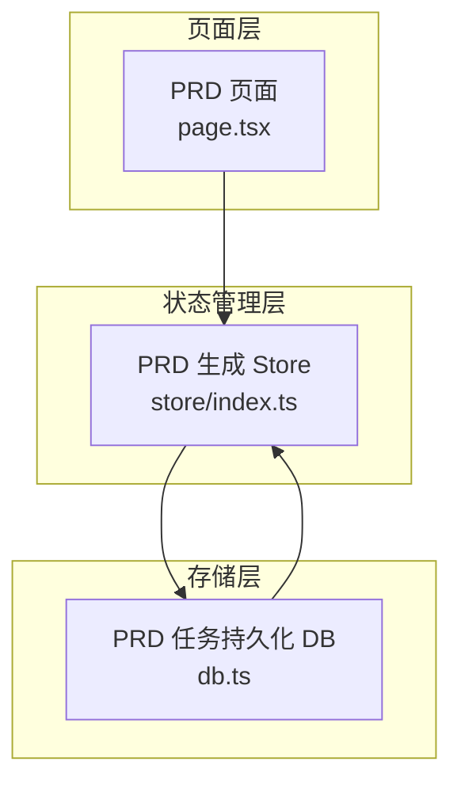
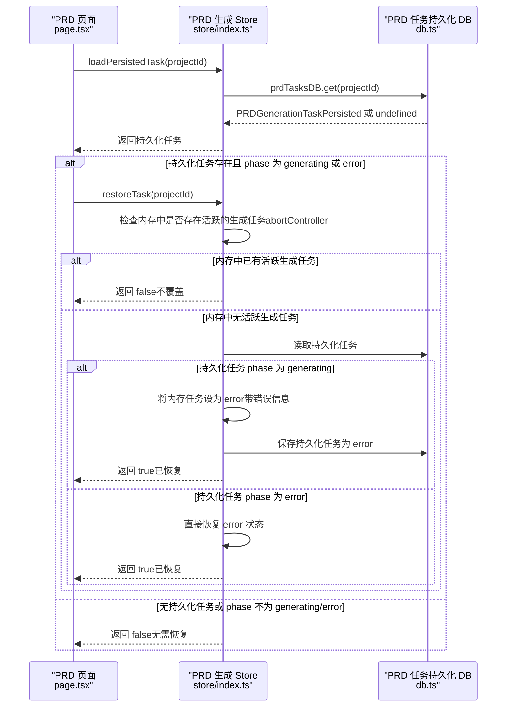
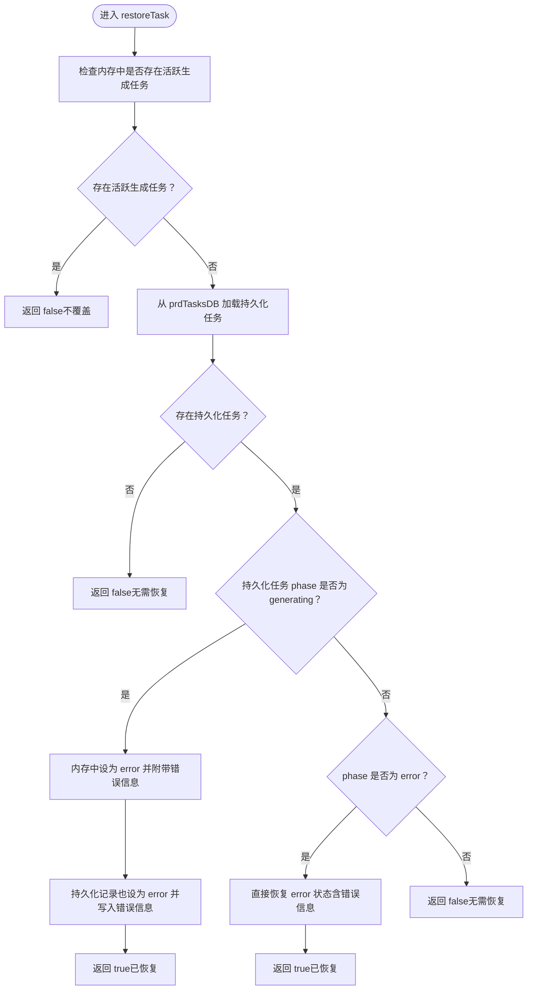
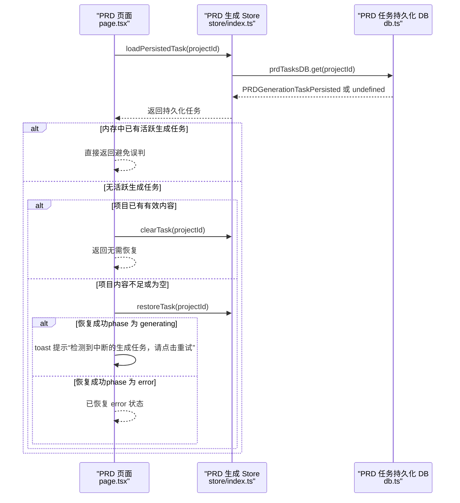
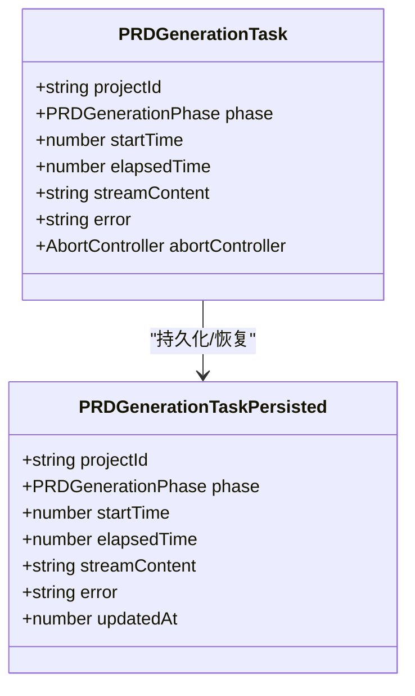
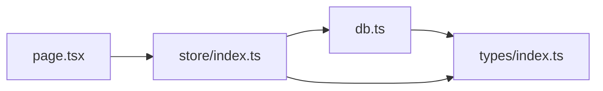

# 任务恢复机制

<cite>
**本文引用的文件**
- [db.ts](file://prd-generator/src/lib/db.ts)
- [store/index.ts](file://prd-generator/src/store/index.ts)
- [page.tsx](file://prd-generator/src/app/project/[id]/prd/page.tsx)
- [types/index.ts](file://prd-generator/src/types/index.ts)
- [route.ts](file://prd-generator/src/app/api/generate-prd/route.ts)
</cite>

## 目录
1. [引言](#引言)
2. [项目结构](#项目结构)
3. [核心组件](#核心组件)
4. [架构总览](#架构总览)
5. [详细组件分析](#详细组件分析)
6. [依赖分析](#依赖分析)
7. [性能考虑](#性能考虑)
8. [故障排查指南](#故障排查指南)
9. [结论](#结论)

## 引言
本文聚焦于PRD生成任务的“恢复机制”，围绕以下目标展开：
- 解释 restoreTask 方法如何实现生成任务的恢复，重点分析其竞态条件处理逻辑（通过检查内存中是否存在活跃的 abortController 来防止覆盖正在进行的生成任务）。
- 说明当从 prdTasksDB 加载到 phase 为 generating 的持久化记录时，如何将其状态安全地转换为 error 并通知用户。
- 结合 checkAndRestoreTask 函数在页面加载时的实际调用流程，解释其边界条件判断（如项目内容完整性验证）和用户体验优化策略。
- 提供代码示例路径，展示状态转换过程及错误提示机制。

## 项目结构
PRD生成任务恢复涉及三层协作：
- 存储层：使用 IndexedDB（Dexie）持久化 PRD 生成任务状态，键为 projectId。
- 状态管理层：Zustand store 维护内存中的 PRD 生成任务对象（含 AbortController），并提供恢复、持久化、错误标记等能力。
- 页面层：PRD 页面在挂载时执行检查与恢复流程，结合边界条件与用户提示，提升可用性。

图表来源
- [page.tsx](file://prd-generator/src/app/project/[id]/prd/page.tsx#L107-L145)
- [store/index.ts](file://prd-generator/src/store/index.ts#L561-L852)
- [db.ts](file://prd-generator/src/lib/db.ts#L169-L207)

章节来源
- [page.tsx](file://prd-generator/src/app/project/[id]/prd/page.tsx#L107-L145)
- [store/index.ts](file://prd-generator/src/store/index.ts#L561-L852)
- [db.ts](file://prd-generator/src/lib/db.ts#L169-L207)

## 核心组件
- PRD 任务持久化数据库接口：提供 get/save/delete/getIncomplete/cleanupCompleted 等方法，用于读写 prdTasks 表。
- PRD 生成 Store：维护内存任务对象（含 AbortController），提供 startTask、appendTaskContent、completeTask、errorTask、cancelTask、updateElapsedTime、clearTask、loadPersistedTask、restoreTask、persistTask、abortAndPersist 等方法。
- PRD 页面：在 mounted 且存在 currentProject 后，执行 checkAndRestoreTask，负责加载持久化任务并进行竞态与边界条件判断，同时触发用户提示。

章节来源
- [db.ts](file://prd-generator/src/lib/db.ts#L169-L207)
- [store/index.ts](file://prd-generator/src/store/index.ts#L561-L852)
- [page.tsx](file://prd-generator/src/app/project/[id]/prd/page.tsx#L107-L145)

## 架构总览
下面的序列图展示了页面加载时的任务恢复流程，以及与状态管理与持久化层的交互。

图表来源
- [page.tsx](file://prd-generator/src/app/project/[id]/prd/page.tsx#L107-L145)
- [store/index.ts](file://prd-generator/src/store/index.ts#L741-L802)
- [db.ts](file://prd-generator/src/lib/db.ts#L169-L183)

## 详细组件分析

### restoreTask 方法：竞态条件与状态转换
- 竞态条件处理
  - 在恢复前，先检查内存中是否存在 phase 为 generating 且 abortController 非空的任务。若存在，则直接返回 false，避免覆盖正在进行的生成任务。
  - 这一检查确保“内存中的活跃任务优先级高于持久化记录”，防止新旧任务互相覆盖。
- 从持久化加载与状态转换
  - 若持久化任务 phase 为 generating，restoreTask 会：
    - 在内存中将该任务的 phase 设为 error，并附带错误提示文案。
    - 同步更新持久化记录为 error，并写入相同的错误信息。
    - 返回 true，表示已安全地将中断任务标记为错误。
  - 若持久化任务 phase 为 error，则直接恢复内存任务的 error 状态（包括错误信息），返回 true。
  - 若无持久化任务或 phase 不为 generating/error，则返回 false。
- 错误提示机制
  - 页面层在恢复后，若检测到持久化任务 phase 为 generating，会通过 toast 提示用户“检测到中断的生成任务，请点击重试”。

图表来源
- [store/index.ts](file://prd-generator/src/store/index.ts#L746-L802)

章节来源
- [store/index.ts](file://prd-generator/src/store/index.ts#L746-L802)

### checkAndRestoreTask：页面加载时的调用流程与边界条件
- 调用时机与前置条件
  - 在 PRD 页面 mounted 且存在 currentProject 后，执行 checkAndRestoreTask。
  - 若内存中已有 phase 为 generating 的任务，则直接返回，避免误判为中断。
- 边界条件判断
  - 项目内容完整性验证：若 currentProject.prdContent 存在且长度超过阈值（示例中为 50 字符），则认为上次生成已成功，直接清空错误任务并返回，避免重复提示。
- 状态恢复与用户提示
  - 若持久化任务 phase 为 generating，restoreTask 会将内存任务标记为 error，并通过 toast 提示“检测到中断的生成任务，请点击重试”。
  - 页面层在渲染时，若存在错误且无已保存内容，会显示错误卡片，提供重试按钮。

图表来源
- [page.tsx](file://prd-generator/src/app/project/[id]/prd/page.tsx#L107-L145)
- [store/index.ts](file://prd-generator/src/store/index.ts#L741-L802)

章节来源
- [page.tsx](file://prd-generator/src/app/project/[id]/prd/page.tsx#L107-L145)

### 类型与状态模型
- PRDGenerationTask：内存任务对象，包含 phase、startTime、elapsedTime、streamContent、error、abortController。
- PRDGenerationTaskPersisted：持久化任务对象，不含 abortController，包含 updatedAt。
- PRDGenerationPhase：'idle' | 'generating' | 'completed' | 'error'。

图表来源
- [types/index.ts](file://prd-generator/src/types/index.ts#L196-L223)

章节来源
- [types/index.ts](file://prd-generator/src/types/index.ts#L196-L223)

### 错误提示与用户交互
- 页面层在渲染 PRD 内容区域时，若任务处于 error 且无已保存内容，会显示错误卡片，包含错误文案与重试按钮。
- 页面层在恢复 phase 为 generating 的持久化任务后，通过 toast 提示用户“检测到中断的生成任务，请点击重试”。

章节来源
- [page.tsx](file://prd-generator/src/app/project/[id]/prd/page.tsx#L743-L764)
- [page.tsx](file://prd-generator/src/app/project/[id]/prd/page.tsx#L136-L141)

## 依赖分析
- 页面层依赖状态管理层提供的 loadPersistedTask 与 restoreTask。
- 状态管理层依赖持久化层的 prdTasksDB 接口进行读写。
- 持久化层依赖 Dexie 对 IndexedDB 的封装，提供 prdTasks 表的 CRUD 与查询能力。

图表来源
- [page.tsx](file://prd-generator/src/app/project/[id]/prd/page.tsx#L107-L145)
- [store/index.ts](file://prd-generator/src/store/index.ts#L561-L852)
- [db.ts](file://prd-generator/src/lib/db.ts#L169-L207)
- [types/index.ts](file://prd-generator/src/types/index.ts#L196-L223)

章节来源
- [page.tsx](file://prd-generator/src/app/project/[id]/prd/page.tsx#L107-L145)
- [store/index.ts](file://prd-generator/src/store/index.ts#L561-L852)
- [db.ts](file://prd-generator/src/lib/db.ts#L169-L207)
- [types/index.ts](file://prd-generator/src/types/index.ts#L196-L223)

## 性能考虑
- 持久化异步化：startTask 中对 prdTasksDB.save 的调用采用异步方式，避免阻塞主流程。
- 内存与持久化分离：内存任务包含 AbortController，便于取消；持久化任务不含 AbortController，避免跨进程/跨会话的信号泄漏。
- 流式内容缓冲：PRD 生成 Store 使用数组缓存内容片段，减少字符串拼接开销，提高渲染性能。

章节来源
- [store/index.ts](file://prd-generator/src/store/index.ts#L569-L599)
- [store/index.ts](file://prd-generator/src/store/index.ts#L619-L643)

## 故障排查指南
- 现象：页面加载后未出现“中断任务”提示
  - 检查是否已在内存中启动了新的生成任务（activeTask?.phase === 'generating'）。若是，页面会直接返回，不会恢复。
  - 检查持久化任务是否存在且 phase 为 generating 或 error。
- 现象：恢复后仍显示错误卡片
  - 若 currentProject.prdContent 已有有效内容，checkAndRestoreTask 会清空错误任务并返回，避免重复提示。
- 现象：恢复后内存任务未变为 error
  - 确认 prdTasksDB.get 返回的持久化任务 phase 为 generating，且 restoreTask 已执行。
  - 确认持久化记录也被同步更新为 error。
- 现象：AbortController 未生效
  - 确认内存任务中 abortController 存在且未被提前释放。
  - 确认页面层在组件卸载时调用了 abortAndPersist，避免后台继续占用资源。

章节来源
- [page.tsx](file://prd-generator/src/app/project/[id]/prd/page.tsx#L107-L145)
- [store/index.ts](file://prd-generator/src/store/index.ts#L746-L802)
- [store/index.ts](file://prd-generator/src/store/index.ts#L819-L851)

## 结论
- restoreTask 通过“内存活跃任务优先”的竞态条件检查，确保不会覆盖正在进行的生成任务。
- 对于 phase 为 generating 的持久化记录，restoreTask 会将其安全地转换为 error，并同步更新持久化记录，配合页面层的 toast 提示，形成闭环的用户反馈。
- checkAndRestoreTask 在页面加载时承担边界条件判断与用户体验优化职责：在项目已有有效内容时避免误报，减少不必要的干扰；在检测到中断任务时及时提示用户重试。
- 整体架构清晰、职责分明：页面层负责时机与边界，状态管理层负责内存与持久化状态的协调，存储层负责可靠的数据持久化。