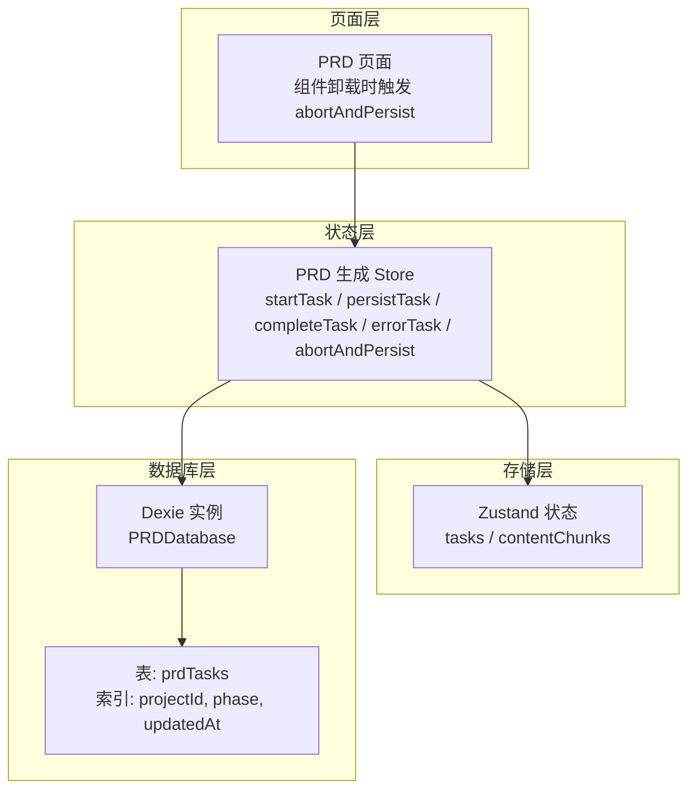
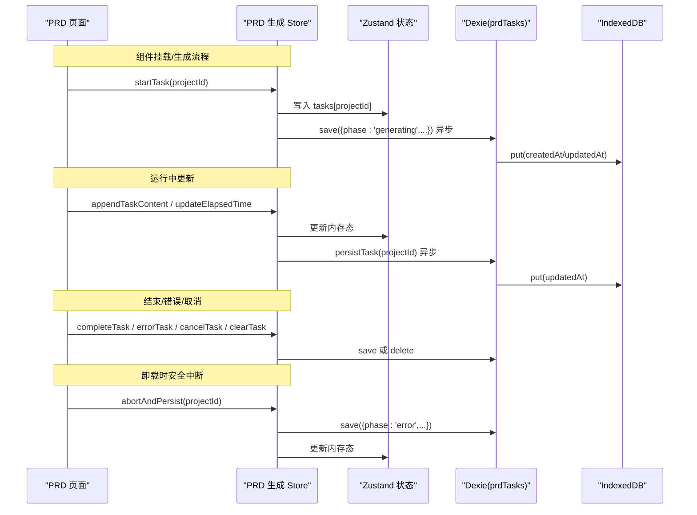
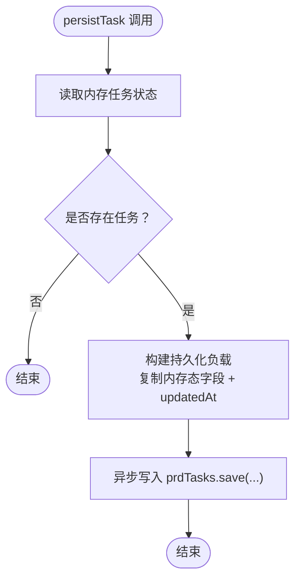
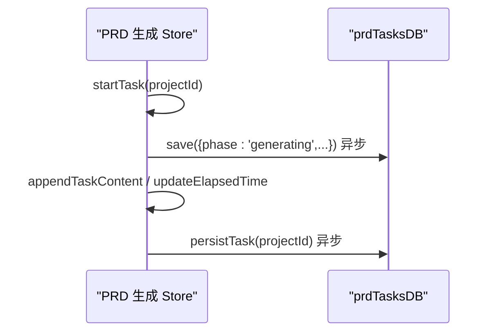
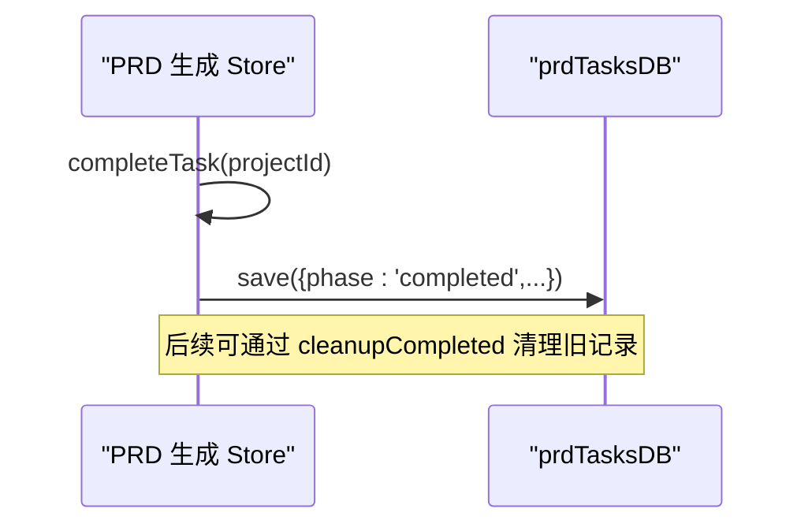
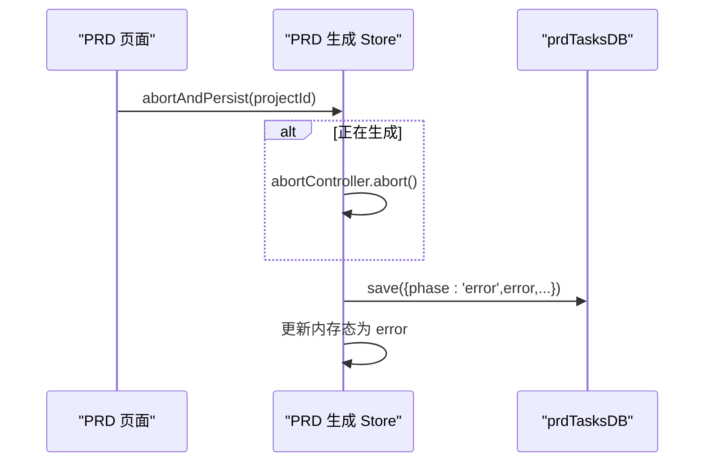
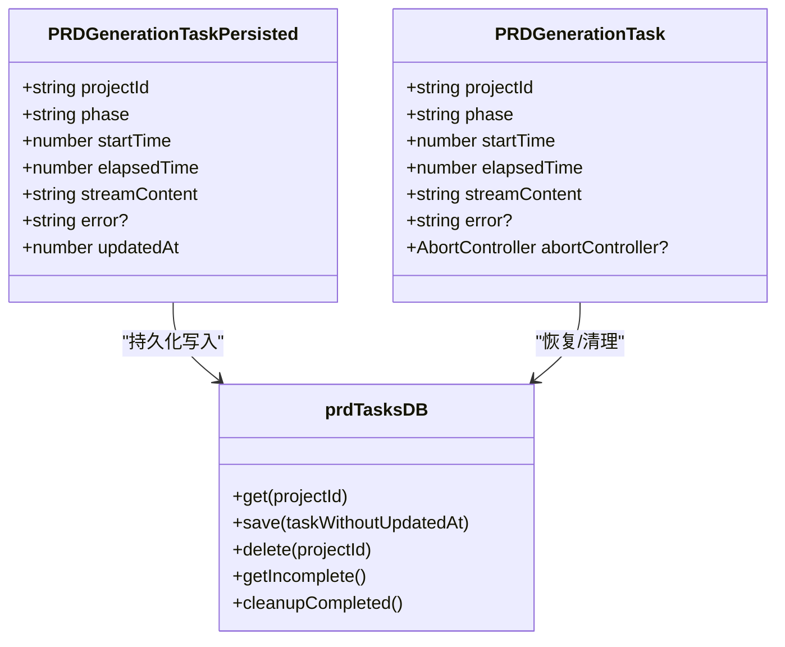

# 任务持久化实现细节

<cite>
**本文引用的文件**
- [db.ts](file://prd-generator/src/lib/db.ts)
- [store/index.ts](file://prd-generator/src/store/index.ts)
- [types/index.ts](file://prd-generator/src/types/index.ts)
- [app/project/[id]/prd/page.tsx](file://prd-generator/src/app/project/[id]/prd/page.tsx)
</cite>

## 目录
1. [简介](#简介)
2. [项目结构](#项目结构)
3. [核心组件](#核心组件)
4. [架构总览](#架构总览)
5. [详细组件分析](#详细组件分析)
6. [依赖关系分析](#依赖关系分析)
7. [性能考虑](#性能考虑)
8. [故障排查指南](#故障排查指南)
9. [结论](#结论)

## 简介
本文聚焦于 PRD 生成任务的持久化实现，系统性解析 `persistTask` 方法的内部细节与其与 `prdTasksDB` 数据库的交互流程，涵盖：
- 内存任务状态到持久化结构的数据转换
- 时间戳更新策略与一致性保障
- 异步持久化设计（非阻塞性、性能优化、失败处理）
- 与 `startTask`、`completeTask` 等方法的协同，确保任务生命周期内的数据一致

## 项目结构
围绕任务持久化的关键模块与文件：
- 类型定义：PRD 任务内存态与持久化态的字段差异
- 存储层：Zustand 状态管理与 IndexedDB 的桥接
- 数据库层：Dexie 封装的 prdTasks 表操作
- 页面层：PRD 页面在组件卸载时的安全中断与持久化

图表来源
- [store/index.ts](file://prd-generator/src/store/index.ts#L532-L853)
- [db.ts](file://prd-generator/src/lib/db.ts#L1-L33)
- [db.ts](file://prd-generator/src/lib/db.ts#L169-L209)
- [app/project/[id]/prd/page.tsx](file://prd-generator/src/app/project/[id]/prd/page.tsx#L94-L106)

章节来源
- [store/index.ts](file://prd-generator/src/store/index.ts#L532-L853)
- [db.ts](file://prd-generator/src/lib/db.ts#L1-L33)
- [db.ts](file://prd-generator/src/lib/db.ts#L169-L209)
- [types/index.ts](file://prd-generator/src/types/index.ts#L194-L224)
- [app/project/[id]/prd/page.tsx](file://prd-generator/src/app/project/[id]/prd/page.tsx#L94-L106)

## 核心组件
- PRD 任务类型与持久化态
  - 内存态：包含 AbortController，便于中断；持久化态不含 AbortController
  - 字段差异：内存态含 `abortController`，持久化态含 `updatedAt`
- 数据库表结构
  - prdTasks：主键为 `projectId`，索引包含 `phase` 和 `updatedAt`
- Store 中的持久化方法
  - startTask：初始化任务并异步持久化“生成中”状态
  - persistTask：按当前内存态写入持久化表
  - completeTask/errorTask/cancelTask/clearTask：完成/错误/取消/清理时的持久化与删除
  - abortAndPersist：组件卸载时的安全中断与持久化

章节来源
- [types/index.ts](file://prd-generator/src/types/index.ts#L194-L224)
- [db.ts](file://prd-generator/src/lib/db.ts#L1-L33)
- [db.ts](file://prd-generator/src/lib/db.ts#L169-L209)
- [store/index.ts](file://prd-generator/src/store/index.ts#L561-L853)

## 架构总览
下图展示从页面到数据库的端到端调用链，重点标注 `persistTask` 的调用点与数据流向。

图表来源
- [store/index.ts](file://prd-generator/src/store/index.ts#L569-L600)
- [store/index.ts](file://prd-generator/src/store/index.ts#L601-L637)
- [store/index.ts](file://prd-generator/src/store/index.ts#L645-L695)
- [store/index.ts](file://prd-generator/src/store/index.ts#L697-L739)
- [store/index.ts](file://prd-generator/src/store/index.ts#L804-L851)
- [db.ts](file://prd-generator/src/lib/db.ts#L169-L183)
- [app/project/[id]/prd/page.tsx](file://prd-generator/src/app/project/[id]/prd/page.tsx#L94-L106)

## 详细组件分析

### persistTask 方法实现细节
- 调用时机
  - 运行中通过 `appendTaskContent` 等更新内存态后，异步调用 `persistTask` 将当前内存态写入数据库
  - 组件卸载时由 `abortAndPersist` 触发，确保中断也能持久化
- 数据结构转换
  - 内存态字段：`projectId, phase, startTime, elapsedTime, streamContent, error?`
  - 持久化态字段：`projectId, phase, startTime, elapsedTime, streamContent, error?, updatedAt`
  - 转换策略：直接复制内存态字段，新增 `updatedAt` 为当前时间
- 时间戳更新
  - 持久化写入时统一设置 `updatedAt = Date.now()`，保证每次写入都反映最新变更
- 错误处理
  - `persistTask` 本身不抛出异常；若需健壮性，可在调用方捕获或在 store 层增加重试包装
- 非阻塞性与性能
  - 采用异步调用，避免阻塞 UI 更新
  - 通过批量写入（如 `bulkDelete`）与索引查询（`phase='generating'`）提升整体性能

图表来源
- [store/index.ts](file://prd-generator/src/store/index.ts#L804-L817)
- [db.ts](file://prd-generator/src/lib/db.ts#L175-L183)

章节来源
- [store/index.ts](file://prd-generator/src/store/index.ts#L804-L817)
- [db.ts](file://prd-generator/src/lib/db.ts#L175-L183)

### 与 startTask 的协作
- 初始化与首次持久化
  - `startTask` 创建内存任务并立即异步持久化“生成中”状态，确保即使页面刷新也能恢复
- 运行时更新
  - `appendTaskContent` 更新内存态后，调用 `persistTask` 持久化增量内容
- 计时器驱动
  - `updateElapsedTime` 每秒更新内存态的耗时，随后持久化

图表来源
- [store/index.ts](file://prd-generator/src/store/index.ts#L569-L600)
- [store/index.ts](file://prd-generator/src/store/index.ts#L601-L637)
- [store/index.ts](file://prd-generator/src/store/index.ts#L804-L817)

章节来源
- [store/index.ts](file://prd-generator/src/store/index.ts#L569-L600)
- [store/index.ts](file://prd-generator/src/store/index.ts#L601-L637)
- [store/index.ts](file://prd-generator/src/store/index.ts#L804-L817)

### 与 completeTask 的协作
- 完成状态持久化
  - `completeTask` 将内存态标记为“已完成”，随后持久化完整状态（含最终内容与耗时）
- 清理策略
  - `clearTask`/`cancelTask` 删除持久化记录，避免无用数据堆积

图表来源
- [store/index.ts](file://prd-generator/src/store/index.ts#L645-L668)
- [db.ts](file://prd-generator/src/lib/db.ts#L196-L206)

章节来源
- [store/index.ts](file://prd-generator/src/store/index.ts#L645-L668)
- [db.ts](file://prd-generator/src/lib/db.ts#L196-L206)

### 与 abortAndPersist 的协作（组件卸载）
- 设计目标
  - 在组件卸载时，若仍在生成，先中断请求，再将当前进度以“错误”态持久化，以便后续恢复
- 关键逻辑
  - 若内存态为“生成中”，中断请求
  - 持久化写入“错误”态并附带中断提示信息
  - 更新内存态为“错误”，移除 `abortController`

图表来源
- [store/index.ts](file://prd-generator/src/store/index.ts#L819-L851)
- [app/project/[id]/prd/page.tsx](file://prd-generator/src/app/project/[id]/prd/page.tsx#L94-L106)

章节来源
- [store/index.ts](file://prd-generator/src/store/index.ts#L819-L851)
- [app/project/[id]/prd/page.tsx](file://prd-generator/src/app/project/[id]/prd/page.tsx#L94-L106)

### 数据库交互与一致性保障
- 数据库结构
  - 表：prdTasks
  - 主键：projectId
  - 索引：phase, updatedAt
- 一致性策略
  - 每次写入均更新 updatedAt，便于按时间排序与清理
  - 通过 phase 字段区分“生成中/已完成/错误”，配合清理策略避免冗余
  - 在页面卸载时以“错误”态写入，避免与其他活跃任务冲突

章节来源
- [db.ts](file://prd-generator/src/lib/db.ts#L1-L33)
- [db.ts](file://prd-generator/src/lib/db.ts#L169-L209)

## 依赖关系分析
- 类型依赖
  - PRDGenerationTask（内存态）与 PRDGenerationTaskPersisted（持久化态）的字段映射关系清晰
- 组件耦合
  - PRD 页面在卸载时依赖 abortAndPersist，确保中断也能持久化
  - Store 内部对 prdTasksDB 的调用点分布于 start/append/persist/complete/error/cancel/clear 等路径
- 外部依赖
  - IndexedDB 通过 Dexie 提供封装，简化 CRUD 与事务

图表来源
- [types/index.ts](file://prd-generator/src/types/index.ts#L194-L224)
- [db.ts](file://prd-generator/src/lib/db.ts#L169-L209)

章节来源
- [types/index.ts](file://prd-generator/src/types/index.ts#L194-L224)
- [db.ts](file://prd-generator/src/lib/db.ts#L169-L209)

## 性能考虑
- 非阻塞性持久化
  - startTask 中对 prdTasksDB.save 的调用使用 `.catch(...)`，避免阻塞 UI
- 增量持久化
  - appendTaskContent 后调用 persistTask，仅持久化增量，降低写入频率
- 索引与清理
  - 通过 phase 与 updatedAt 建立索引，支持快速筛选与清理
  - cleanupCompleted 会定期删除过期已完成任务，保持数据库规模可控

章节来源
- [store/index.ts](file://prd-generator/src/store/index.ts#L569-L600)
- [store/index.ts](file://prd-generator/src/store/index.ts#L804-L817)
- [db.ts](file://prd-generator/src/lib/db.ts#L196-L206)

## 故障排查指南
- 现象：任务未恢复或恢复为错误态
  - 检查持久化记录的 phase 是否为 “generating”
  - 若为 “generating”，页面会在挂载时将其标记为 “error”，并提示重试
- 现象：持久化失败或写入卡顿
  - 确认 IndexedDB 可用且未被浏览器限制
  - 查看控制台是否有持久化调用异常（startTask/save/persistTask）
- 现象：组件卸载后未保存进度
  - 确认页面卸载钩子是否调用了 abortAndPersist
  - 检查内存态是否仍处于“生成中”

章节来源
- [store/index.ts](file://prd-generator/src/store/index.ts#L741-L802)
- [store/index.ts](file://prd-generator/src/store/index.ts#L819-L851)
- [app/project/[id]/prd/page.tsx](file://prd-generator/src/app/project/[id]/prd/page.tsx#L94-L106)

## 结论
- persistTask 通过“内存态到持久化态”的轻量转换，结合 updatedAt 的统一更新策略，实现了任务状态的可靠持久化
- 与 startTask/completeTask/errorTask/cancelTask/abortAndPersist 的协同，覆盖了任务生命周期的各个关键节点，确保数据一致性
- 异步持久化与索引清理策略共同保障了用户体验与系统性能