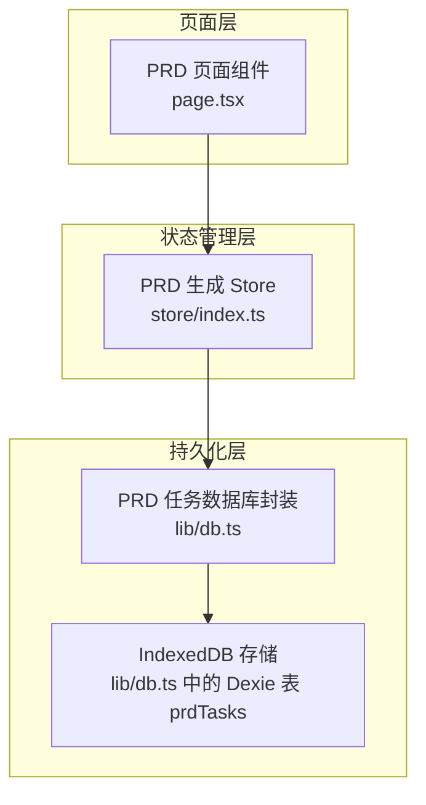
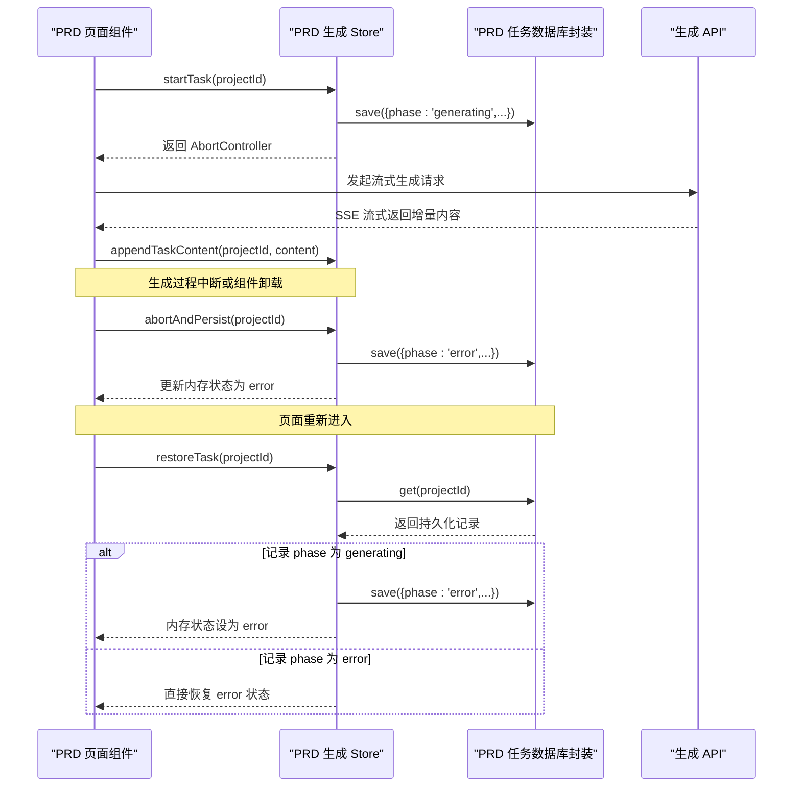
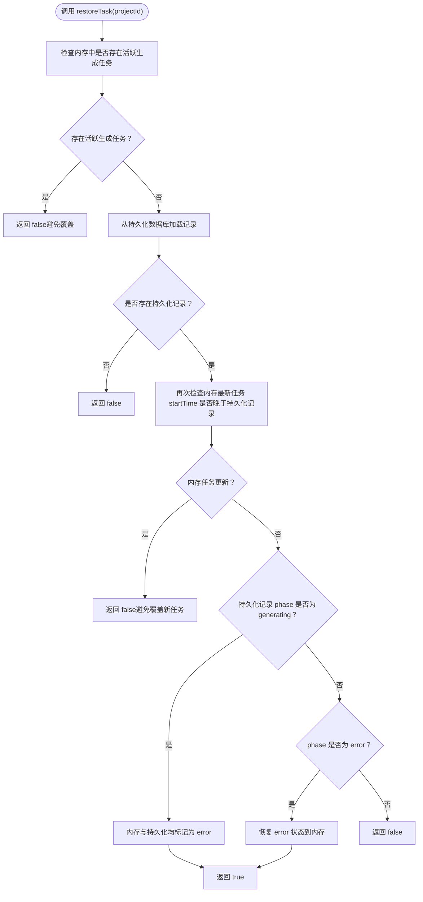
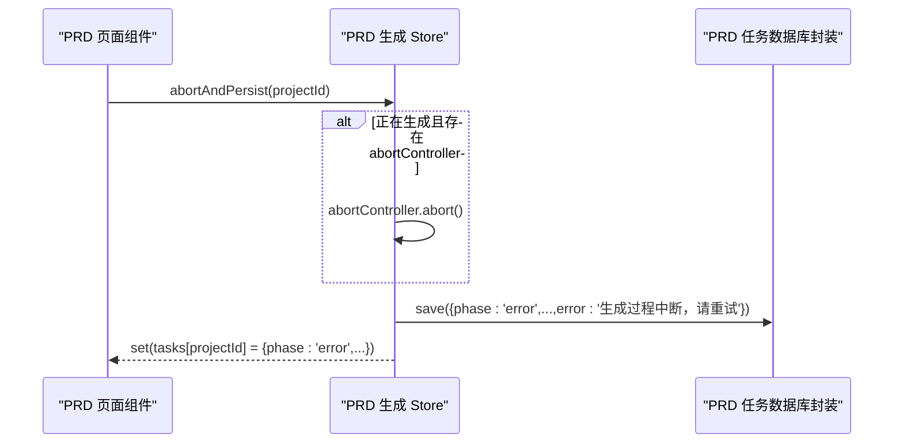
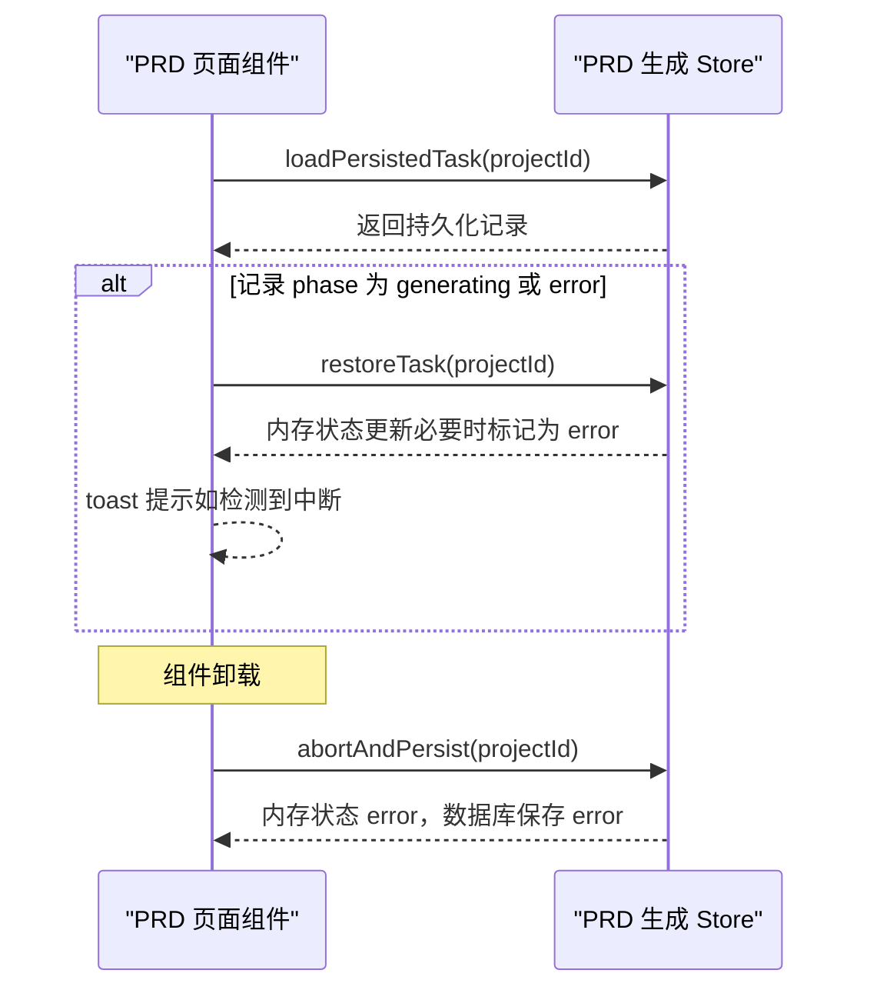
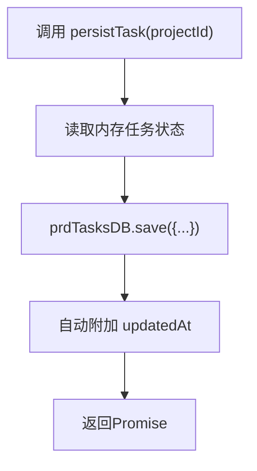
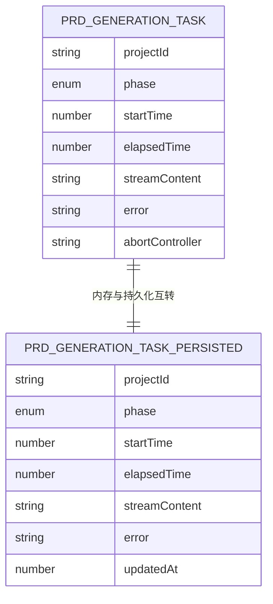
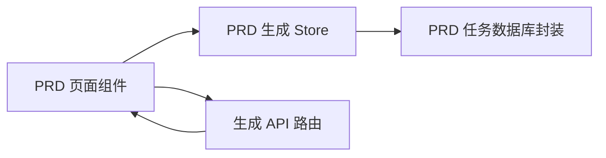

# 持久化与恢复机制

<cite>
**本文引用的文件**
- [store/index.ts](file://prd-generator/src/store/index.ts)
- [db.ts](file://prd-generator/src/lib/db.ts)
- [page.tsx](file://prd-generator/src/app/project/[id]/prd/page.tsx)
- [route.ts](file://prd-generator/src/app/api/generate-prd/route.ts)
- [index.ts](file://prd-generator/src/types/index.ts)
</cite>

## 目录
1. [引言](#引言)
2. [项目结构](#项目结构)
3. [核心组件](#核心组件)
4. [架构总览](#架构总览)
5. [详细组件分析](#详细组件分析)
6. [依赖分析](#依赖分析)
7. [性能考虑](#性能考虑)
8. [故障排查指南](#故障排查指南)
9. [结论](#结论)

## 引言
本文围绕 PRD 生成任务的“中断恢复与安全持久化”展开，重点解释两个关键方法：
- restoreTask：如何从持久化存储恢复中断任务，并通过内存活跃任务检查避免覆盖正在进行的生成任务；当从持久化数据库加载到 phase 为 generating 的记录时，如何将其状态安全地转换为 error 并通知用户。
- abortAndPersist：在组件卸载时如何协调 abortController.abort() 与 persistTask 的调用，确保资源释放与状态保存的原子性；同时说明 persistTask 与异步持久化调用的实现细节与错误处理策略。

## 项目结构
PRD 生成状态与持久化位于 Zustand Store 中，持久化数据库封装在独立模块中，页面组件负责生命周期钩子与用户交互。

图表来源
- [page.tsx](file://prd-generator/src/app/project/[id]/prd/page.tsx#L95-L105)
- [store/index.ts](file://prd-generator/src/store/index.ts#L561-L852)
- [db.ts](file://prd-generator/src/lib/db.ts#L169-L209)

章节来源
- [store/index.ts](file://prd-generator/src/store/index.ts#L561-L852)
- [db.ts](file://prd-generator/src/lib/db.ts#L169-L209)
- [page.tsx](file://prd-generator/src/app/project/[id]/prd/page.tsx#L95-L105)

## 核心组件
- PRD 生成 Store：维护任务内存状态、流式内容缓冲、持久化接口与恢复逻辑。
- PRD 任务持久化数据库封装：提供 get/save/delete/getIncomplete/cleanupCompleted 等方法。
- PRD 页面组件：在挂载时检查并恢复中断任务，在卸载时安全中断并保存进度。

章节来源
- [store/index.ts](file://prd-generator/src/store/index.ts#L532-L852)
- [db.ts](file://prd-generator/src/lib/db.ts#L169-L209)
- [page.tsx](file://prd-generator/src/app/project/[id]/prd/page.tsx#L107-L145)

## 架构总览
PRD 生成采用“内存状态 + IndexedDB 持久化”的双层设计：
- 内存状态：包含 AbortController，便于实时中断；流式内容以数组分片缓存，降低字符串拼接成本。
- 持久化状态：不含 AbortController，仅记录 phase、startTime、elapsedTime、streamContent、error、updatedAt 等字段。

图表来源
- [store/index.ts](file://prd-generator/src/store/index.ts#L569-L599)
- [store/index.ts](file://prd-generator/src/store/index.ts#L620-L636)
- [store/index.ts](file://prd-generator/src/store/index.ts#L819-L851)
- [store/index.ts](file://prd-generator/src/store/index.ts#L746-L801)
- [db.ts](file://prd-generator/src/lib/db.ts#L171-L183)
- [page.tsx](file://prd-generator/src/app/project/[id]/prd/page.tsx#L101-L105)

## 详细组件分析

### restoreTask：中断恢复与竞态防护
restoreTask 的职责是将持久化数据库中的任务恢复到内存状态，同时规避竞态条件与错误状态转换。

- 竞态条件处理
  - 在恢复前检查内存中是否存在活跃的生成任务（phase 为 generating 且 abortController 存在）。若存在，则直接返回 false，避免覆盖正在进行的生成任务。
  - 在加载持久化记录后，再次检查内存中的最新任务，若其 startTime 不小于持久化记录的 startTime，也返回 false，防止“旧记录覆盖新任务”。

- generating 状态的安全转换
  - 若从持久化数据库加载到 phase 为 generating 的记录，restoreTask 将内存状态设置为 error，并写入统一的错误提示；同时将持久化记录也更新为 error，保证数据库与内存一致。

- error 状态的直接恢复
  - 若持久化记录 phase 为 error，则直接将该记录恢复到内存状态。

- 返回值
  - 成功恢复返回 true，否则返回 false。

图表来源
- [store/index.ts](file://prd-generator/src/store/index.ts#L746-L801)

章节来源
- [store/index.ts](file://prd-generator/src/store/index.ts#L746-L801)

### abortAndPersist：组件卸载时的原子性中断与持久化
abortAndPersist 用于在组件卸载时，确保 AbortController.abort() 与持久化保存的原子性顺序，避免资源泄漏与状态不一致。

- 中断与保存顺序
  - 若当前任务处于 generating 且存在 abortController，则先调用 abortController.abort() 中断请求。
  - 立即以 error 状态保存当前进度到持久化数据库，写入统一的错误提示，确保用户下次进入页面能感知中断。
  - 最后更新内存状态为 error，并移除 abortController，避免后续误用。

- 与 persistTask 的关系
  - persistTask 是一个通用的“当前任务状态持久化”方法，通常在生成过程中定期调用以保持数据库与内存一致。
  - abortAndPersist 与 persistTask 的区别在于：abortAndPersist 是“强制中断+保存”，而 persistTask 是“无中断的常规保存”。两者都通过 prdTasksDB.save 实现持久化。

图表来源
- [store/index.ts](file://prd-generator/src/store/index.ts#L819-L851)
- [db.ts](file://prd-generator/src/lib/db.ts#L171-L183)

章节来源
- [store/index.ts](file://prd-generator/src/store/index.ts#L819-L851)
- [db.ts](file://prd-generator/src/lib/db.ts#L171-L183)

### 页面组件中的使用：挂载检查与卸载保护
- 挂载时检查并恢复
  - 组件挂载后，会检查当前项目是否已有 PRD 内容；若没有，则尝试从持久化数据库加载任务。
  - 通过 loadPersistedTask 与 restoreTask 的组合，对 generating 状态进行安全转换为 error，并向用户提示“检测到中断的生成任务，请点击重试”。
  - 为避免竞态覆盖，页面在执行恢复前，还会再次检查内存中是否存在新的生成任务（通过 ref 缓存 getTask），确保不会覆盖新任务。

- 卸载时保护
  - 组件卸载时，调用 abortAndPersist，确保即使用户快速切换页面或刷新，也能安全中断并保存进度，避免后台继续占用资源。

图表来源
- [page.tsx](file://prd-generator/src/app/project/[id]/prd/page.tsx#L107-L145)
- [store/index.ts](file://prd-generator/src/store/index.ts#L742-L744)
- [store/index.ts](file://prd-generator/src/store/index.ts#L746-L801)
- [store/index.ts](file://prd-generator/src/store/index.ts#L819-L851)

章节来源
- [page.tsx](file://prd-generator/src/app/project/[id]/prd/page.tsx#L107-L145)

### persistTask：异步持久化调用与错误处理
- 触发时机
  - startTask 在创建任务后会异步调用 prdTasksDB.save，不阻塞主线程。
  - 在生成过程中，可通过 persistTask 将当前内存状态写入数据库，保持一致性。

- 实现细节
  - persistTask 读取当前任务的 projectId、phase、startTime、elapsedTime、streamContent、error 等字段，调用 prdTasksDB.save。
  - save 方法会自动附加 updatedAt 时间戳，确保后续清理与查询可用。

- 错误处理
  - startTask 中对 prdTasksDB.save 的调用使用 .catch(console.error)，避免影响主流程。
  - 其他持久化路径（completeTask、errorTask、abortAndPersist、clearTask）均采用 await，确保异常能被上层捕获与处理。

图表来源
- [store/index.ts](file://prd-generator/src/store/index.ts#L569-L599)
- [store/index.ts](file://prd-generator/src/store/index.ts#L805-L817)
- [db.ts](file://prd-generator/src/lib/db.ts#L171-L183)

章节来源
- [store/index.ts](file://prd-generator/src/store/index.ts#L569-L599)
- [store/index.ts](file://prd-generator/src/store/index.ts#L805-L817)
- [db.ts](file://prd-generator/src/lib/db.ts#L171-L183)

### 类型与数据模型
- PRDGenerationTask：内存任务状态，包含 AbortController，便于中断。
- PRDGenerationTaskPersisted：持久化任务状态，不含 AbortController，便于跨会话恢复。
- 二者字段对齐，便于在内存与持久化之间互转。

图表来源
- [index.ts](file://prd-generator/src/types/index.ts#L203-L223)

章节来源
- [index.ts](file://prd-generator/src/types/index.ts#L203-L223)

## 依赖分析
- 页面组件依赖 PRD 生成 Store 的方法：startTask、appendTaskContent、completeTask、errorTask、clearTask、loadPersistedTask、restoreTask、abortAndPersist。
- PRD 生成 Store 依赖 prdTasksDB（lib/db.ts）进行持久化操作。
- 生成 API（/api/generate-prd）负责流式返回内容，页面通过 AbortController 中断请求。

图表来源
- [page.tsx](file://prd-generator/src/app/project/[id]/prd/page.tsx#L200-L311)
- [store/index.ts](file://prd-generator/src/store/index.ts#L561-L852)
- [route.ts](file://prd-generator/src/app/api/generate-prd/route.ts#L109-L253)

章节来源
- [page.tsx](file://prd-generator/src/app/project/[id]/prd/page.tsx#L200-L311)
- [store/index.ts](file://prd-generator/src/store/index.ts#L561-L852)
- [route.ts](file://prd-generator/src/app/api/generate-prd/route.ts#L109-L253)

## 性能考虑
- 流式内容缓冲：使用数组分片（contentChunks）减少字符串拼接开销，提升渲染性能。
- 异步持久化：startTask 中的持久化调用使用 .catch，避免阻塞主线程。
- 竞态防护：restoreTask 在恢复前进行双重检查（活跃任务与时间戳），避免覆盖新任务。
- 数据库清理：提供 getIncomplete 与 cleanupCompleted 接口，便于维护数据库规模。

章节来源
- [store/index.ts](file://prd-generator/src/store/index.ts#L620-L636)
- [store/index.ts](file://prd-generator/src/store/index.ts#L569-L599)
- [db.ts](file://prd-generator/src/lib/db.ts#L191-L206)

## 故障排查指南
- 生成中断后仍显示“生成中”
  - 检查 restoreTask 是否被正确调用，以及内存中是否仍有活跃任务导致恢复被跳过。
  - 确认持久化记录 phase 是否被正确更新为 error。

- 卸载后资源未释放
  - 确认 abortAndPersist 是否在组件卸载时被调用。
  - 检查 AbortController 是否在 errorTask/completeTask/clearTask 中被正确移除。

- 持久化失败或丢失
  - 查看 prdTasksDB.save 的调用链，确认异常被捕获或被上层 await。
  - 检查数据库版本迁移与索引是否正确。

- 重复恢复同一任务
  - 确认页面在执行恢复前，已通过 ref 缓存 getTask 并比较 startTime，避免覆盖新任务。

章节来源
- [page.tsx](file://prd-generator/src/app/project/[id]/prd/page.tsx#L107-L145)
- [store/index.ts](file://prd-generator/src/store/index.ts#L746-L801)
- [store/index.ts](file://prd-generator/src/store/index.ts#L819-L851)
- [db.ts](file://prd-generator/src/lib/db.ts#L171-L183)

## 结论
- restoreTask 通过“内存活跃任务检查 + startTime 比较 + generating 状态安全转换”三重保障，有效避免竞态覆盖与状态错乱。
- abortAndPersist 在组件卸载时确保“中断 + 持久化”的原子性，配合 persistTask 的异步持久化策略，形成完整的中断恢复闭环。
- 页面层通过 loadPersistedTask 与 restoreTask 的组合，为用户提供“中断即恢复”的可靠体验；同时在卸载时主动保护资源，提升整体稳定性与用户体验。