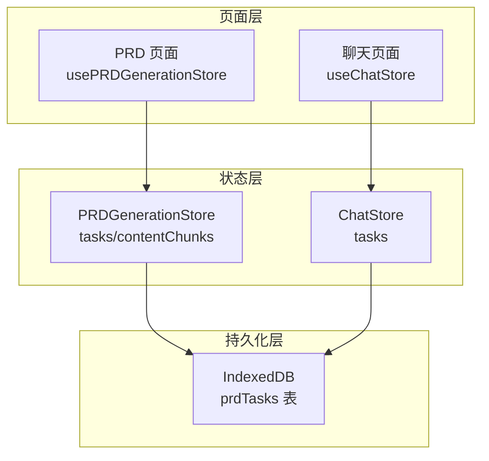
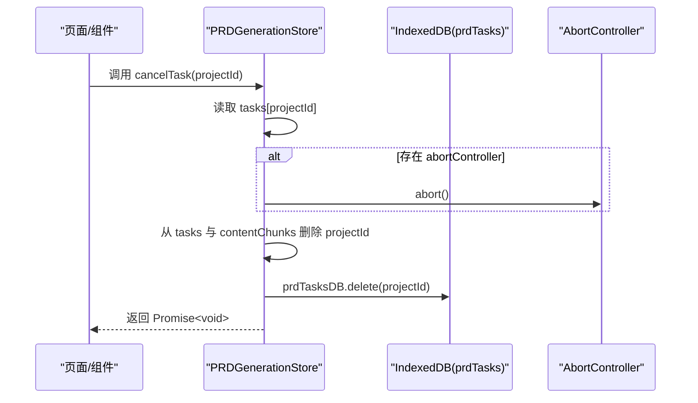
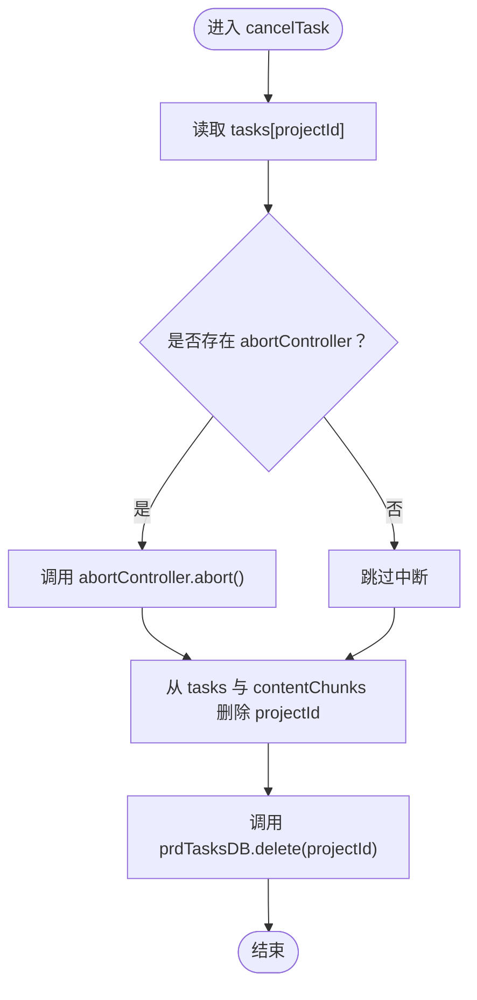
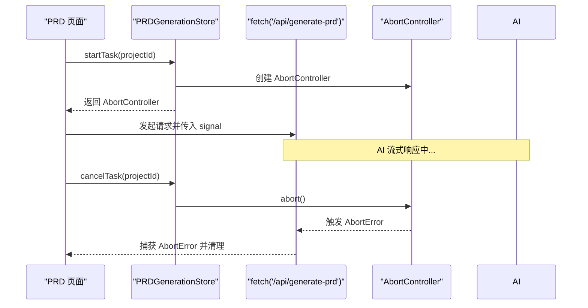
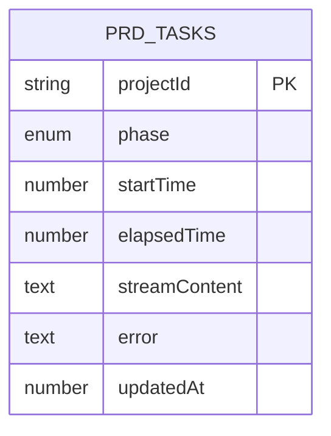
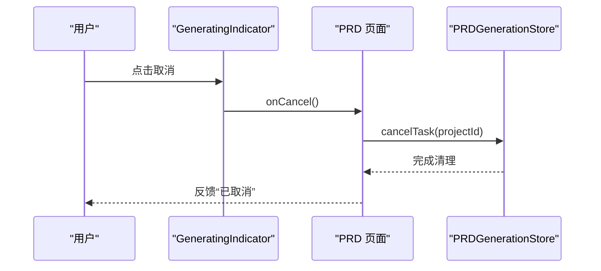
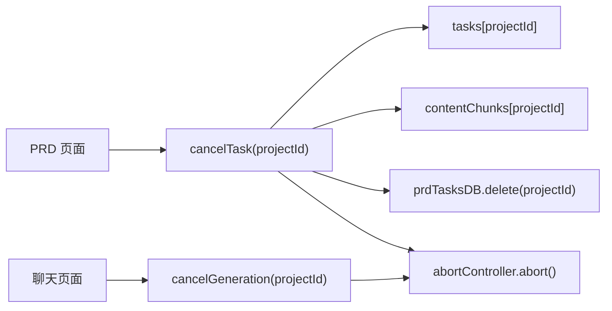

# 任务取消与资源清理

<cite>
**本文引用的文件**
- [store/index.ts](file://prd-generator/src/store/index.ts)
- [db.ts](file://prd-generator/src/lib/db.ts)
- [page.tsx（PRD 页面）](file://prd-generator/src/app/project/[id]/prd/page.tsx)
- [page.tsx（聊天页面）](file://prd-generator/src/app/project/[id]/chat/page.tsx)
- [generating-indicator.tsx](file://prd-generator/src/components/generating-indicator.tsx)
- [types/index.ts](file://prd-generator/src/types/index.ts)
</cite>

## 目录
1. [引言](#引言)
2. [项目结构](#项目结构)
3. [核心组件](#核心组件)
4. [架构总览](#架构总览)
5. [详细组件分析](#详细组件分析)
6. [依赖关系分析](#依赖关系分析)
7. [性能考量](#性能考量)
8. [故障排查指南](#故障排查指南)
9. [结论](#结论)

## 引言
本文围绕 PRD 生成流程中的 cancelTask 方法，系统性梳理其在三处关键位置的执行路径：Zustand store 内存状态清理、IndexedDB 持久化记录删除，以及通过 AbortController 中断正在进行的 AI 请求。同时结合用户主动取消与网络中断等场景，说明该方法在保持应用状态整洁、避免资源浪费方面的关键作用。

## 项目结构
- PRD 生成状态集中在全局 store 的 PRDGenerationStore 中，采用按 projectId 隔离的任务状态。
- IndexedDB 的 prdTasks 表用于持久化 PRD 生成任务，便于在中断后恢复或清理。
- 页面层通过 usePRDGenerationStore 调用 cancelTask；聊天页面通过 useChatStore 的 cancelGeneration 实现相同目的。

图表来源
- [store/index.ts](file://prd-generator/src/store/index.ts#L532-L852)
- [db.ts](file://prd-generator/src/lib/db.ts#L169-L209)
- [page.tsx（PRD 页面）](file://prd-generator/src/app/project/[id]/prd/page.tsx#L34-L120)
- [page.tsx（聊天页面）](file://prd-generator/src/app/project/[id]/chat/page.tsx#L57-L120)

章节来源
- [store/index.ts](file://prd-generator/src/store/index.ts#L532-L852)
- [db.ts](file://prd-generator/src/lib/db.ts#L169-L209)

## 核心组件
- PRDGenerationStore.cancelTask：负责安全取消 PRD 生成任务，清理内存与持久化记录。
- PRDGenerationStore.abortAndPersist：组件卸载时的安全中断与持久化，确保中断状态被记录。
- IndexedDB prdTasksDB.delete：删除指定 projectId 的持久化任务记录。
- AbortController.abort：中断 fetch 请求，防止资源浪费。

章节来源
- [store/index.ts](file://prd-generator/src/store/index.ts#L696-L711)
- [store/index.ts](file://prd-generator/src/store/index.ts#L819-L851)
- [db.ts](file://prd-generator/src/lib/db.ts#L185-L188)

## 架构总览
cancelTask 的完整流程如下：
1. 从 PRDGenerationStore.tasks 中读取目标任务。
2. 若存在 abortController，则调用 abort() 中断正在进行的请求。
3. 在 Zustand store 中从 tasks 和 contentChunks 两个记录中删除对应 projectId 的数据，释放内存。
4. 调用 prdTasksDB.delete 删除 IndexedDB 中的持久化任务记录，确保数据一致性。

图表来源
- [store/index.ts](file://prd-generator/src/store/index.ts#L696-L711)
- [db.ts](file://prd-generator/src/lib/db.ts#L185-L188)

## 详细组件分析

### PRDGenerationStore.cancelTask 方法
- 输入：projectId
- 行为：
  - 读取任务对象，若存在 abortController 则调用 abort()。
  - 从 tasks 与 contentChunks 两条记录中删除对应 projectId，实现内存清理。
  - 调用 prdTasksDB.delete 删除 IndexedDB 中的持久化任务记录。
- 返回：Promise<void>，异步删除持久化记录。

图表来源
- [store/index.ts](file://prd-generator/src/store/index.ts#L696-L711)
- [db.ts](file://prd-generator/src/lib/db.ts#L185-L188)

章节来源
- [store/index.ts](file://prd-generator/src/store/index.ts#L696-L711)

### 与 AbortController 的集成
- PRDGenerationStore.startTask 会在创建任务时生成 AbortController 并保存在任务对象中。
- fetch 请求在发起时将 abortController.signal 传入，以便在取消时中断请求。
- 聊天页面同样在 fetch 请求中使用 AbortController.signal，cancelGeneration 会中断聊天生成请求。

图表来源
- [store/index.ts](file://prd-generator/src/store/index.ts#L569-L599)
- [page.tsx（PRD 页面）](file://prd-generator/src/app/project/[id]/prd/page.tsx#L214-L311)

章节来源
- [store/index.ts](file://prd-generator/src/store/index.ts#L569-L599)
- [page.tsx（PRD 页面）](file://prd-generator/src/app/project/[id]/prd/page.tsx#L214-L311)

### IndexedDB 持久化与一致性
- prdTasksDB.save：保存任务状态（含 phase、startTime、elapsedTime、streamContent、error 等）。
- prdTasksDB.delete：删除指定 projectId 的持久化任务记录。
- PRDGenerationStore.completeTask/errorTask/abortAndPersist：在不同状态下写入或更新持久化记录，确保一致性。

图表来源
- [db.ts](file://prd-generator/src/lib/db.ts#L169-L209)
- [types/index.ts](file://prd-generator/src/types/index.ts#L214-L223)

章节来源
- [db.ts](file://prd-generator/src/lib/db.ts#L169-L209)
- [types/index.ts](file://prd-generator/src/types/index.ts#L214-L223)

### 用户交互与取消入口
- PRD 页面：生成指示器中提供取消按钮，点击后调用 cancelTask。
- 聊天页面：生成指示器中提供取消按钮，点击后调用 cancelGeneration（内部同样中断请求并清理状态）。

图表来源
- [generating-indicator.tsx](file://prd-generator/src/components/generating-indicator.tsx#L47-L70)
- [page.tsx（PRD 页面）](file://prd-generator/src/app/project/[id]/prd/page.tsx#L505-L510)

章节来源
- [generating-indicator.tsx](file://prd-generator/src/components/generating-indicator.tsx#L47-L70)
- [page.tsx（PRD 页面）](file://prd-generator/src/app/project/[id]/prd/page.tsx#L505-L510)

## 依赖关系分析
- PRDGenerationStore.cancelTask 依赖：
  - Zustand store 的 tasks 与 contentChunks 记录。
  - IndexedDB 的 prdTasks 表。
  - AbortController.abort 机制。
- 页面层通过 usePRDGenerationStore 调用 cancelTask；聊天页面通过 useChatStore 的 cancelGeneration 实现类似逻辑。

图表来源
- [store/index.ts](file://prd-generator/src/store/index.ts#L696-L711)
- [store/index.ts](file://prd-generator/src/store/index.ts#L433-L456)
- [page.tsx（PRD 页面）](file://prd-generator/src/app/project/[id]/prd/page.tsx#L505-L510)
- [page.tsx（聊天页面）](file://prd-generator/src/app/project/[id]/chat/page.tsx#L505-L510)

章节来源
- [store/index.ts](file://prd-generator/src/store/index.ts#L696-L711)
- [store/index.ts](file://prd-generator/src/store/index.ts#L433-L456)
- [page.tsx（PRD 页面）](file://prd-generator/src/app/project/[id]/prd/page.tsx#L505-L510)
- [page.tsx（聊天页面）](file://prd-generator/src/app/project/[id]/chat/page.tsx#L505-L510)

## 性能考量
- 中断请求避免资源浪费：AbortController.abort 能立即终止 fetch 流，减少带宽与服务器压力。
- 内存清理：删除 tasks 与 contentChunks 中的 projectId 数据，避免长期持有大块字符串与数组导致内存膨胀。
- 持久化一致性：删除 prdTasks 中的持久化记录，避免后续恢复逻辑误判或重复占用空间。
- 竞态防护：组件卸载时使用 abortAndPersist 将中断状态写入持久化，避免与新任务冲突。

章节来源
- [store/index.ts](file://prd-generator/src/store/index.ts#L819-L851)

## 故障排查指南
- 取消后仍出现请求仍在进行：
  - 检查是否正确传入 AbortController.signal 至 fetch。
  - 确认 cancelTask 是否在 UI 事件回调中被调用。
- 取消后内存未释放：
  - 确认 tasks 与 contentChunks 是否已删除对应 projectId。
  - 检查是否存在其他引用（例如局部状态或缓存）。
- 取消后持久化记录仍存在：
  - 确认 prdTasksDB.delete 是否被调用。
  - 检查 IndexedDB 中的 prdTasks 表是否包含该 projectId。
- 网络中断或超时：
  - 捕获 AbortError 并清理 UI 状态，必要时调用 abortAndPersist 保存中断状态。

章节来源
- [page.tsx（PRD 页面）](file://prd-generator/src/app/project/[id]/prd/page.tsx#L298-L311)
- [store/index.ts](file://prd-generator/src/store/index.ts#L819-L851)

## 结论
cancelTask 方法通过“中断请求 + 清理内存 + 删除持久化”的三段式策略，有效避免了资源浪费与状态污染。它在用户主动取消与网络中断等场景下，均能保证应用状态整洁、用户体验一致。配合 abortAndPersist 的卸载安全中断机制，进一步提升了系统的健壮性与一致性。