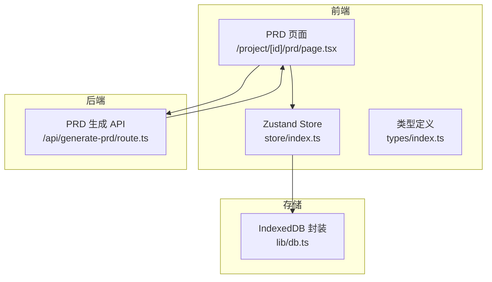
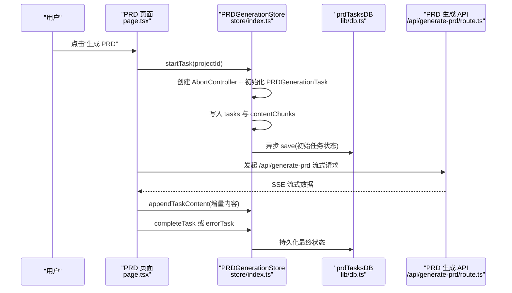
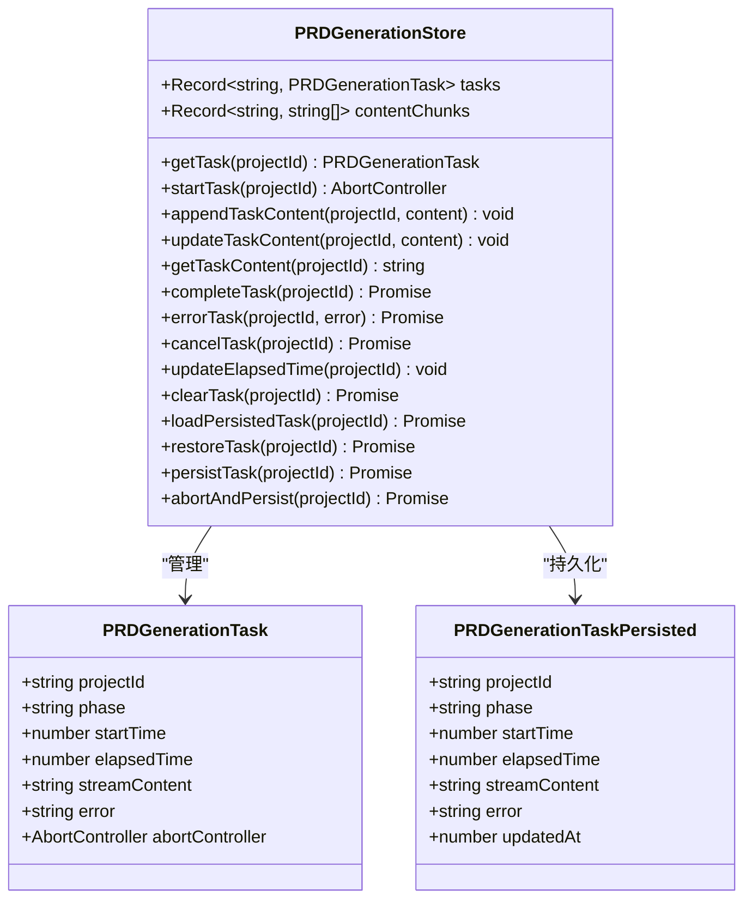
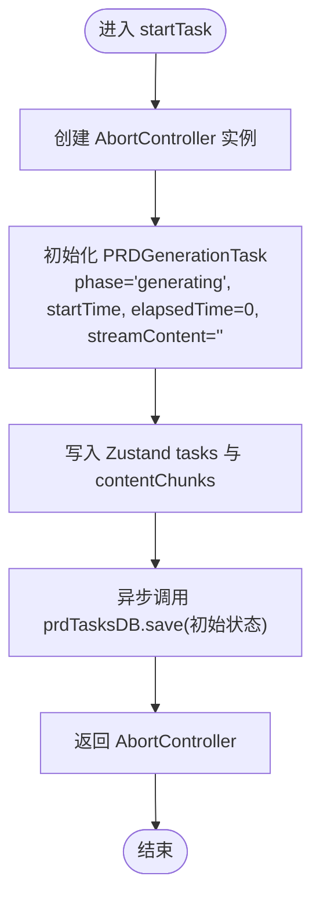
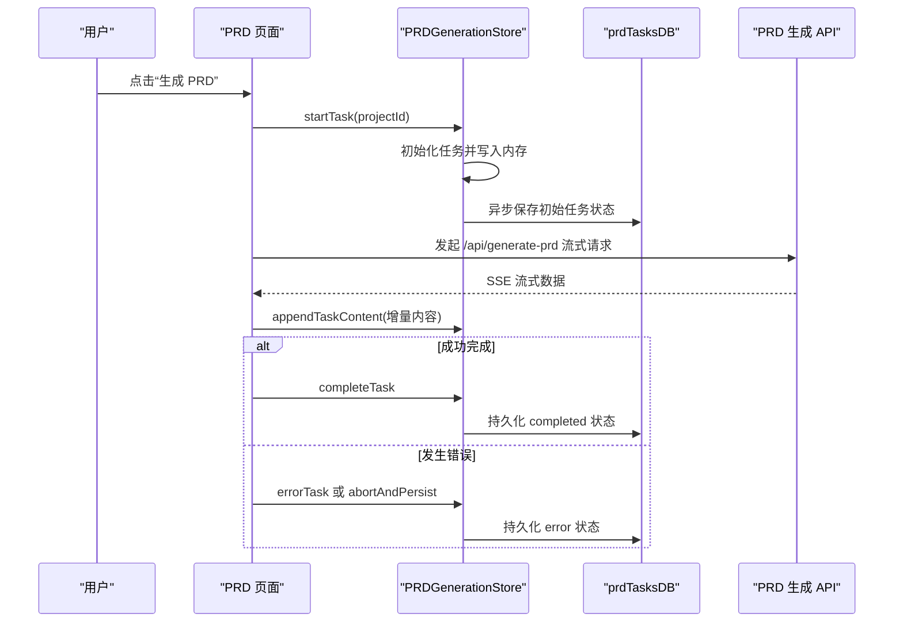
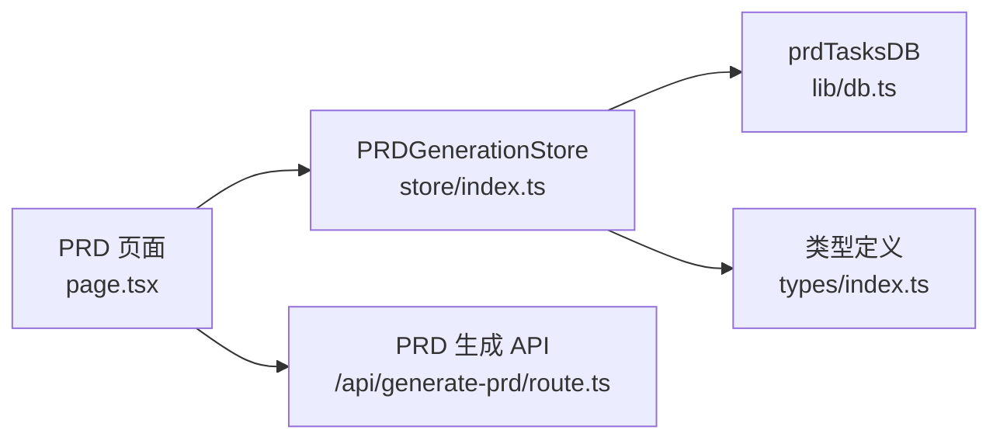

# 任务启动机制

<cite>
**本文引用的文件**
- [store/index.ts](file://prd-generator/src/store/index.ts)
- [db.ts](file://prd-generator/src/lib/db.ts)
- [types/index.ts](file://prd-generator/src/types/index.ts)
- [project/[id]/prd/page.tsx](file://prd-generator/src/app/project/[id]/prd/page.tsx)
- [api/generate-prd/route.ts](file://prd-generator/src/app/api/generate-prd/route.ts)
</cite>

## 目录
1. [引言](#引言)
2. [项目结构](#项目结构)
3. [核心组件](#核心组件)
4. [架构总览](#架构总览)
5. [详细组件分析](#详细组件分析)
6. [依赖分析](#依赖分析)
7. [性能考虑](#性能考虑)
8. [故障排查指南](#故障排查指南)
9. [结论](#结论)

## 引言
本文围绕 PRD 生成任务的启动流程展开，聚焦于 startTask 方法的实现细节，说明其如何：
- 创建 AbortController 实例以支持请求中断；
- 初始化 PRDGenerationTask 任务状态对象；
- 在内存中通过 Zustand 状态管理设置 tasks 和 contentChunks；
- 在 /project/[id]/prd/page.tsx 中由用户点击“生成 PRD”按钮触发；
- 异步调用 IndexedDB 存储层 prdTasksDB.save() 将初始任务状态持久化，从而实现生成中断后的状态恢复；
- 错误处理策略确保持久化失败不会阻塞主流程。

## 项目结构
- 前端页面：负责用户交互与流式渲染，位于 /project/[id]/prd/page.tsx；
- 状态管理：Zustand Store，包含 PRDGenerationStore，位于 store/index.ts；
- 数据持久化：IndexedDB 封装 prdTasksDB，位于 lib/db.ts；
- 类型定义：PRDGenerationTask、PRDGenerationTaskPersisted 等，位于 types/index.ts；
- 后端 API：/api/generate-prd/route.ts，提供流式生成 PRD 的服务。

图表来源
- [store/index.ts](file://prd-generator/src/store/index.ts#L532-L852)
- [db.ts](file://prd-generator/src/lib/db.ts#L169-L207)
- [types/index.ts](file://prd-generator/src/types/index.ts#L194-L223)
- [project/[id]/prd/page.tsx](file://prd-generator/src/app/project/[id]/prd/page.tsx#L200-L311)
- [api/generate-prd/route.ts](file://prd-generator/src/app/api/generate-prd/route.ts#L109-L253)

章节来源
- [store/index.ts](file://prd-generator/src/store/index.ts#L532-L852)
- [db.ts](file://prd-generator/src/lib/db.ts#L169-L207)
- [types/index.ts](file://prd-generator/src/types/index.ts#L194-L223)
- [project/[id]/prd/page.tsx](file://prd-generator/src/app/project/[id]/prd/page.tsx#L200-L311)
- [api/generate-prd/route.ts](file://prd-generator/src/app/api/generate-prd/route.ts#L109-L253)

## 核心组件
- PRDGenerationStore：提供 startTask、appendTaskContent、completeTask、errorTask、cancelTask、updateElapsedTime、clearTask、loadPersistedTask、restoreTask、persistTask、abortAndPersist 等方法，管理 PRD 生成任务的内存状态与持久化。
- prdTasksDB：封装 IndexedDB 的 prdTasks 表，提供 get/save/delete/getIncomplete/cleanupCompleted 等方法，用于任务状态的持久化与清理。
- PRDGenerationTask 与 PRDGenerationTaskPersisted：前者包含 AbortController，后者用于持久化存储，二者字段对应一致但不包含 AbortController。

章节来源
- [store/index.ts](file://prd-generator/src/store/index.ts#L532-L852)
- [db.ts](file://prd-generator/src/lib/db.ts#L169-L207)
- [types/index.ts](file://prd-generator/src/types/index.ts#L194-L223)

## 架构总览
startTask 的调用链路如下：
- 用户在 PRD 页面点击“生成 PRD”，触发 generatePRD；
- generatePRD 调用 startTask，得到 AbortController；
- startTask 初始化 PRDGenerationTask 并写入 Zustand tasks 与 contentChunks；
- startTask 异步调用 prdTasksDB.save，保存初始任务状态；
- 页面随后发起 /api/generate-prd 请求，接收流式数据，通过 appendTaskContent 追加到内存；
- 生成完成后，completeTask 将任务标记为 completed 并持久化最终状态；
- 若发生异常，errorTask 或 abortAndPersist 会将错误状态写回持久化层。

图表来源
- [project/[id]/prd/page.tsx](file://prd-generator/src/app/project/[id]/prd/page.tsx#L200-L311)
- [store/index.ts](file://prd-generator/src/store/index.ts#L569-L617)
- [db.ts](file://prd-generator/src/lib/db.ts#L169-L188)
- [api/generate-prd/route.ts](file://prd-generator/src/app/api/generate-prd/route.ts#L109-L253)

## 详细组件分析

### startTask 方法实现与调用时机
- 调用时机：用户在 PRD 页面点击“生成 PRD”按钮时，generatePRD 函数被调用；generatePRD 内部调用 startTask(projectId)。
- AbortController 创建：startTask 内部创建 AbortController 实例，并将其赋给新任务对象的 abortController 字段。
- 任务状态初始化：构造 PRDGenerationTask，设置 phase 为 generating，startTime 为当前时间，elapsedTime 为 0，streamContent 为空。
- 内存状态写入：将任务写入 Zustand 的 tasks 映射，并在 contentChunks 中为该项目初始化空数组，用于流式内容的分块缓存。
- 异步持久化：立即异步调用 prdTasksDB.save，保存初始任务状态（phase: generating，elapsedTime: 0，streamContent: ''），catch 捕获错误但不阻塞主流程。
- 返回值：返回 AbortController，供上层 fetch 请求使用。

章节来源
- [project/[id]/prd/page.tsx](file://prd-generator/src/app/project/[id]/prd/page.tsx#L200-L311)
- [store/index.ts](file://prd-generator/src/store/index.ts#L569-L599)
- [types/index.ts](file://prd-generator/src/types/index.ts#L194-L223)
- [db.ts](file://prd-generator/src/lib/db.ts#L169-L188)

### 内存状态结构与数据流
- tasks：按 projectId 索引的 PRDGenerationTask 映射，包含 phase、startTime、elapsedTime、streamContent、error、abortController 等字段。
- contentChunks：按 projectId 索引的字符串数组，用于流式内容分块缓存，避免频繁字符串拼接；getTaskContent 通过 join 合并为完整内容。
- appendTaskContent：将增量内容追加到 contentChunks，并同步更新 streamContent；updateTaskContent：替换整段内容并重置 chunks。

章节来源
- [store/index.ts](file://prd-generator/src/store/index.ts#L532-L643)

### IndexedDB 持久化与状态恢复
- prdTasksDB.save：保存任务状态，带 updatedAt 时间戳；get：按 projectId 查询；delete：删除任务记录；getIncomplete：查询未完成任务；cleanupCompleted：清理已完成任务。
- restoreTask：从持久化恢复任务；若持久化状态为 generating，则标记为 error 并更新持久化，提示“生成过程中断，请重试”；其他状态（如 error）直接恢复。
- abortAndPersist：组件卸载时的安全中断与保存，若正在生成则中断请求，保存 error 状态并更新内存。

章节来源
- [db.ts](file://prd-generator/src/lib/db.ts#L169-L207)
- [store/index.ts](file://prd-generator/src/store/index.ts#L741-L852)

### 错误处理策略与容错
- startTask 的异步持久化通过 .catch(console.error) 处理，确保即使持久化失败也不会阻塞主流程。
- generatePRD 的异常处理：捕获 AbortError（用户取消）时，清空任务并提示；其他错误统一走 errorTask 并持久化错误状态。
- 页面卸载时通过 abortAndPersist 保证中断进度被持久化，避免丢失。

章节来源
- [store/index.ts](file://prd-generator/src/store/index.ts#L569-L599)
- [project/[id]/prd/page.tsx](file://prd-generator/src/app/project/[id]/prd/page.tsx#L298-L311)
- [store/index.ts](file://prd-generator/src/store/index.ts#L819-L852)

### 类图：PRD 生成任务相关类型与 Store 方法

图表来源
- [types/index.ts](file://prd-generator/src/types/index.ts#L194-L223)
- [store/index.ts](file://prd-generator/src/store/index.ts#L532-L852)

### 流程图：startTask 的执行路径

图表来源
- [store/index.ts](file://prd-generator/src/store/index.ts#L569-L599)

### 序列图：用户点击“生成 PRD”的完整流程

图表来源
- [project/[id]/prd/page.tsx](file://prd-generator/src/app/project/[id]/prd/page.tsx#L200-L311)
- [store/index.ts](file://prd-generator/src/store/index.ts#L569-L617)
- [db.ts](file://prd-generator/src/lib/db.ts#L169-L188)
- [api/generate-prd/route.ts](file://prd-generator/src/app/api/generate-prd/route.ts#L109-L253)

## 依赖分析
- 组件耦合：
  - PRD 页面依赖 PRDGenerationStore 提供的方法与状态；
  - PRDGenerationStore 依赖 prdTasksDB 进行持久化；
  - PRDGenerationStore 依赖 AbortController 与 fetch 流式读取；
  - 类型定义 PRDGenerationTask 与 PRDGenerationTaskPersisted 为内存与持久化状态的契约。
- 外部依赖：
  - IndexedDB（Dexie）提供持久化能力；
  - Next.js API Route 提供流式生成服务；
  - 浏览器 Fetch API 与 AbortController 支持中断。

图表来源
- [project/[id]/prd/page.tsx](file://prd-generator/src/app/project/[id]/prd/page.tsx#L200-L311)
- [store/index.ts](file://prd-generator/src/store/index.ts#L532-L852)
- [db.ts](file://prd-generator/src/lib/db.ts#L169-L207)
- [types/index.ts](file://prd-generator/src/types/index.ts#L194-L223)
- [api/generate-prd/route.ts](file://prd-generator/src/app/api/generate-prd/route.ts#L109-L253)

## 性能考虑
- 流式内容分块：contentChunks 使用数组存储，避免频繁字符串拼接，降低内存与 CPU 开销。
- 异步持久化：startTask 的持久化调用采用 .catch，避免阻塞主线程。
- 计时器管理：仅在生成中时启动定时器更新 elapsedTime，退出时及时清理，防止资源泄漏。
- SSE 解析：使用 TextDecoder 与缓冲区避免跨 chunk 截断，提升解码稳定性。

章节来源
- [store/index.ts](file://prd-generator/src/store/index.ts#L619-L643)
- [store/index.ts](file://prd-generator/src/store/index.ts#L713-L727)
- [project/[id]/prd/page.tsx](file://prd-generator/src/app/project/[id]/prd/page.tsx#L148-L167)

## 故障排查指南
- 生成中断后无内容：
  - 检查 restoreTask 是否被调用，以及持久化状态是否为 generating；若是，会被标记为 error 并提示“生成过程中断，请重试”。
  - 确认 abortAndPersist 是否在组件卸载时被调用，避免中断进度丢失。
- 持久化失败导致 UI 不更新：
  - startTask 的 save 调用已 catch，不影响主流程；若需诊断，可在 catch 中增加日志上报。
- 取消生成后仍显示错误：
  - 确认 errorTask 是否被调用；若用户再次点击重试，应先 clearTask 清理错误状态再重新生成。
- 流式内容缺失：
  - 检查 appendTaskContent 是否被调用；确认 SSE 数据格式与解析逻辑是否正确。

章节来源
- [store/index.ts](file://prd-generator/src/store/index.ts#L741-L802)
- [store/index.ts](file://prd-generator/src/store/index.ts#L819-L852)
- [project/[id]/prd/page.tsx](file://prd-generator/src/app/project/[id]/prd/page.tsx#L298-L311)

## 结论
startTask 通过 AbortController、内存状态与 IndexedDB 持久化三者协同，实现了 PRD 生成任务的可靠启动与中断恢复。其异步持久化策略确保了用户体验的连续性，错误处理机制保障了主流程的稳定性。结合页面的流式渲染与计时器管理，整体方案在可用性与性能之间取得了良好平衡。