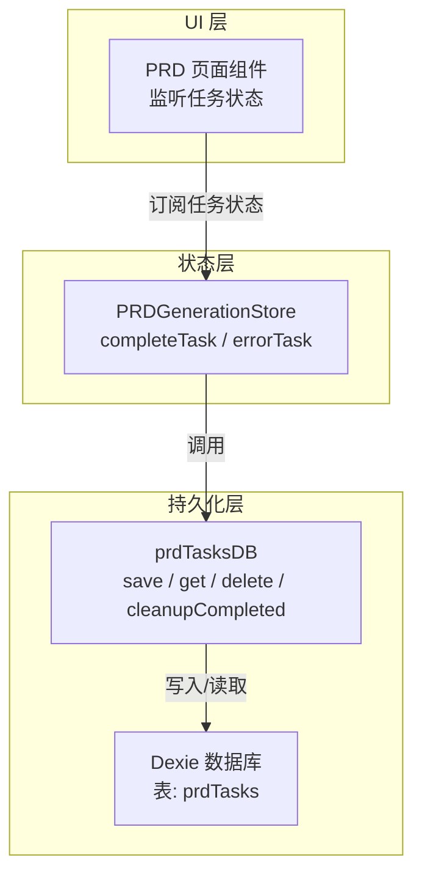
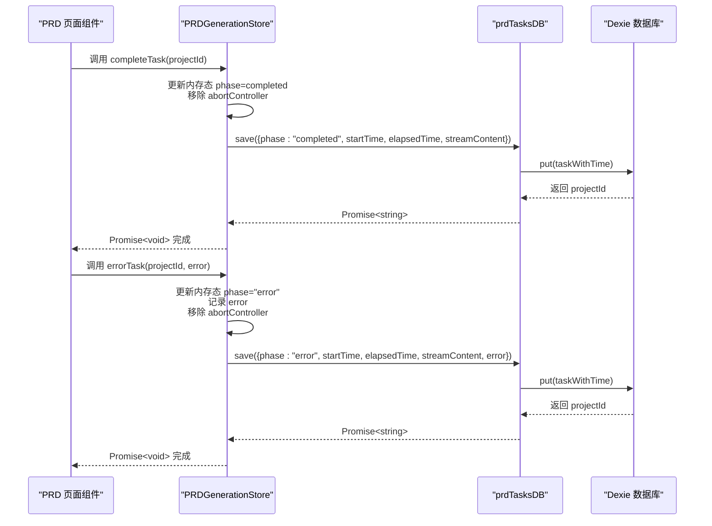
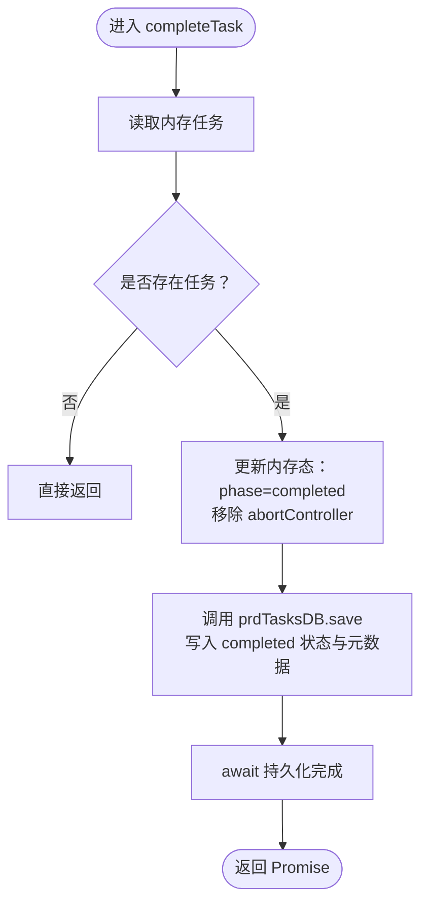
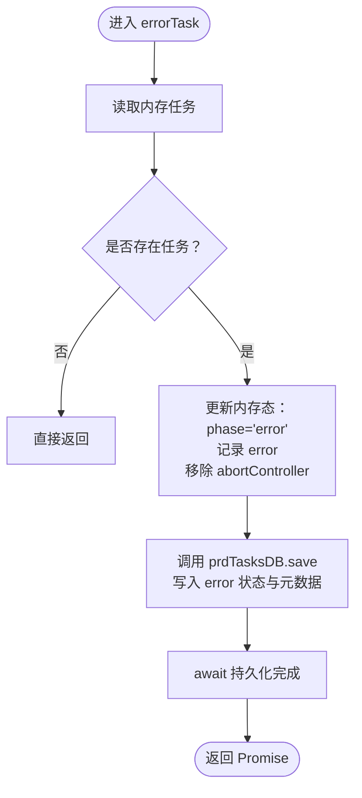
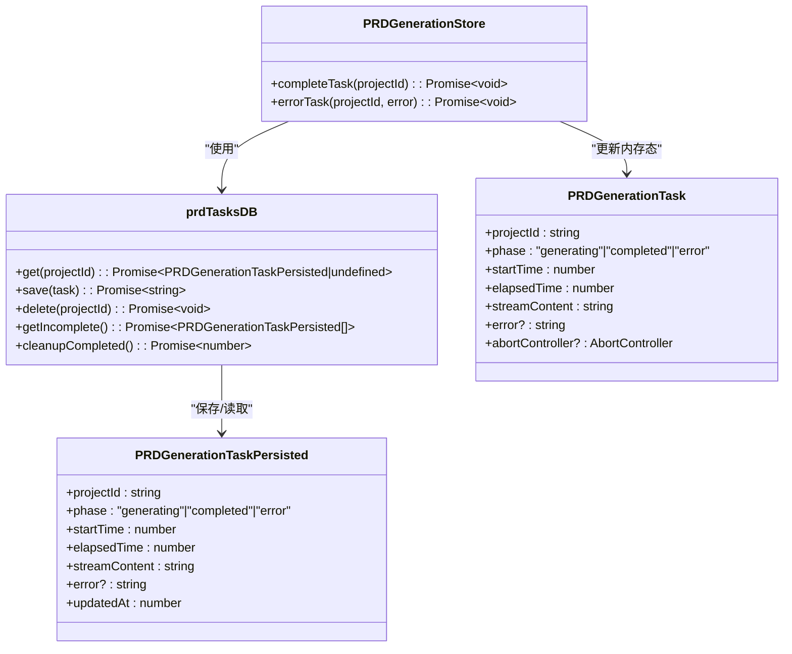

# 任务完成与错误处理

<cite>
**本文引用的文件**
- [store/index.ts](file://prd-generator/src/store/index.ts)
- [lib/db.ts](file://prd-generator/src/lib/db.ts)
- [types/index.ts](file://prd-generator/src/types/index.ts)
- [app/project/[id]/prd/page.tsx](file://prd-generator/src/app/project/[id]/prd/page.tsx)
</cite>

## 目录
1. [引言](#引言)
2. [项目结构](#项目结构)
3. [核心组件](#核心组件)
4. [架构总览](#架构总览)
5. [详细组件分析](#详细组件分析)
6. [依赖分析](#依赖分析)
7. [性能考虑](#性能考虑)
8. [故障排查指南](#故障排查指南)
9. [结论](#结论)

## 引言
本文聚焦于 PRD 生成流程中两个关键方法：completeTask 与 errorTask。前者负责将任务状态从“生成中”切换为“已完成”，清理与任务关联的 AbortController，并通过持久化层将最终的 PRD 内容与元数据（如耗时）写入数据库；后者负责在发生错误时记录错误信息并将任务标记为“错误”，同时确保错误状态也被持久化。两个方法均返回 Promise<void>，调用方可通过 await 等待持久化操作完成，从而保证 UI 与数据的一致性与可靠性。

## 项目结构
- 状态管理位于 store/index.ts，其中定义了 PRDGenerationStore，包含 completeTask 与 errorTask 两个异步方法。
- 数据持久化由 lib/db.ts 提供的 prdTasksDB 实现，负责读取、保存、删除与清理 PRD 任务记录。
- 类型定义位于 types/index.ts，明确 PRDGenerationTask 与 PRDGenerationTaskPersisted 的结构差异（内存态含 AbortController，持久化态不含）。

图表来源
- [store/index.ts](file://prd-generator/src/store/index.ts#L546-L695)
- [lib/db.ts](file://prd-generator/src/lib/db.ts#L169-L209)
- [types/index.ts](file://prd-generator/src/types/index.ts#L203-L223)

章节来源
- [store/index.ts](file://prd-generator/src/store/index.ts#L546-L695)
- [lib/db.ts](file://prd-generator/src/lib/db.ts#L169-L209)
- [types/index.ts](file://prd-generator/src/types/index.ts#L203-L223)

## 核心组件
- PRDGenerationStore.completeTask
  - 将内存态任务 phase 更新为 completed，并移除 abortController。
  - 调用 prdTasksDB.save，写入最终的 PRD 内容与耗时等元数据。
  - 返回 Promise<void>，调用方可 await 以等待持久化完成。
- PRDGenerationStore.errorTask
  - 将内存态任务 phase 更新为 error，并记录错误信息，移除 abortController。
  - 调用 prdTasksDB.save，写入错误状态与当前内容，便于后续恢复或展示。
  - 返回 Promise<void>，调用方可 await 以等待持久化完成。
- prdTasksDB.save
  - 接收 PRDGenerationTaskPersisted（不含 AbortController），自动注入 updatedAt 时间戳并写入数据库。
  - 返回 Promise<string>（projectId），用于确认写入成功。
- 类型差异
  - PRDGenerationTask：内存态，包含 abortController，用于取消请求。
  - PRDGenerationTaskPersisted：持久化态，不含 abortController，包含 updatedAt。

章节来源
- [store/index.ts](file://prd-generator/src/store/index.ts#L645-L695)
- [lib/db.ts](file://prd-generator/src/lib/db.ts#L171-L183)
- [types/index.ts](file://prd-generator/src/types/index.ts#L203-L223)

## 架构总览
completeTask 与 errorTask 的调用链路如下：

图表来源
- [store/index.ts](file://prd-generator/src/store/index.ts#L645-L695)
- [lib/db.ts](file://prd-generator/src/lib/db.ts#L171-L183)

## 详细组件分析

### completeTask 方法分析
- 内存态更新
  - 将任务 phase 切换为 completed。
  - 清理 abortController，避免残留的取消信号影响后续流程。
- 持久化写入
  - 调用 prdTasksDB.save，写入：
    - projectId
    - phase: completed
    - startTime
    - elapsedTime（秒）
    - streamContent（最终 PRD 内容）
- Promise 行为
  - 方法声明为 async，内部 await 了 prdTasksDB.save，返回 Promise<void>，调用方可 await 等待写入完成。

图表来源
- [store/index.ts](file://prd-generator/src/store/index.ts#L645-L668)

章节来源
- [store/index.ts](file://prd-generator/src/store/index.ts#L645-L668)

### errorTask 方法分析
- 内存态更新
  - 将任务 phase 切换为 error。
  - 记录传入的错误信息 error。
  - 清理 abortController。
- 持久化写入
  - 调用 prdTasksDB.save，写入：
    - projectId
    - phase: error
    - startTime
    - elapsedTime（秒）
    - streamContent（当前已生成内容）
    - error（错误信息）
- Promise 行为
  - 方法声明为 async，内部 await 了 prdTasksDB.save，返回 Promise<void>，调用方可 await 等待写入完成。

图表来源
- [store/index.ts](file://prd-generator/src/store/index.ts#L670-L695)

章节来源
- [store/index.ts](file://prd-generator/src/store/index.ts#L670-L695)

### 数据持久化流程与异常处理
- prdTasksDB.save
  - 接收 PRDGenerationTaskPersisted（不含 AbortController），自动注入 updatedAt。
  - 使用 Dexie 的 put 写入 prdTasks 表。
  - 返回 Promise<string>（projectId），表示写入成功。
- 异常处理策略
  - completeTask 与 errorTask 内部 await prdTasksDB.save，若底层写入失败，Promise 将被拒绝，调用方可基于 try/catch 处理。
  - UI 层可监听任务状态变化，结合错误信息进行提示与引导重试。
- 数据一致性
  - 两者均在内存态更新后才进行持久化，确保 UI 与数据库状态一致。
  - 若组件卸载或中断，另有 abortAndPersist 机制将当前状态保存为 error 并清理内存态，避免数据丢失。

章节来源
- [lib/db.ts](file://prd-generator/src/lib/db.ts#L171-L183)
- [store/index.ts](file://prd-generator/src/store/index.ts#L819-L851)

### 与 UI 的集成
- PRD 页面组件订阅任务状态，当 phase 为 error 时，若无已保存的 PRD 内容，则展示错误状态提示，引导用户重试。
- 组件卸载时调用 abortAndPersist，确保中断的生成任务被保存为 error 状态，避免数据丢失。

章节来源
- [app/project/[id]/prd/page.tsx](file://prd-generator/src/app/project/[id]/prd/page.tsx#L70-L145)
- [app/project/[id]/prd/page.tsx](file://prd-generator/src/app/project/[id]/prd/page.tsx#L743-L749)
- [store/index.ts](file://prd-generator/src/store/index.ts#L819-L851)

## 依赖分析
- PRDGenerationStore 依赖 prdTasksDB（持久化层）。
- prdTasksDB 依赖 Dexie 数据库实例与 prdTasks 表。
- 类型层通过 PRDGenerationTask 与 PRDGenerationTaskPersisted 明确内存态与持久化态的差异，避免误用 AbortController。

图表来源
- [store/index.ts](file://prd-generator/src/store/index.ts#L546-L695)
- [lib/db.ts](file://prd-generator/src/lib/db.ts#L169-L209)
- [types/index.ts](file://prd-generator/src/types/index.ts#L203-L223)

章节来源
- [store/index.ts](file://prd-generator/src/store/index.ts#L546-L695)
- [lib/db.ts](file://prd-generator/src/lib/db.ts#L169-L209)
- [types/index.ts](file://prd-generator/src/types/index.ts#L203-L223)

## 性能考虑
- 写入时机
  - completeTask 与 errorTask 在内存态更新后立即持久化，避免 UI 与数据库状态不同步。
- 数据体积
  - streamContent 为最终 PRD 内容，体量较大，建议在 UI 层仅在必要时渲染，避免一次性渲染导致卡顿。
- 并发与竞态
  - 两者均为异步方法，调用方应避免并发重复调用；若需重试，应在上层控制重试次数与节流。
- 清理策略
  - prdTasksDB.cleanupCompleted 提供定期清理已完成任务的能力，降低数据库膨胀风险。

章节来源
- [lib/db.ts](file://prd-generator/src/lib/db.ts#L195-L206)
- [store/index.ts](file://prd-generator/src/store/index.ts#L645-L695)

## 故障排查指南
- 现象：调用 completeTask 或 errorTask 后 UI 未更新
  - 检查是否 await 了 Promise<void>，或在调用处未处理异步逻辑。
  - 确认内存态 phase 是否已更新为 completed 或 error。
- 现象：数据库未写入或写入失败
  - 检查 prdTasksDB.save 的返回值与异常堆栈，确认 Dexie 写入是否成功。
  - 若出现网络或浏览器限制导致 IndexedDB 写入失败，可在上层增加重试与降级提示。
- 现象：错误状态未持久化
  - 确认 errorTask 是否传入了错误信息，并检查持久化写入是否 await。
- 现象：组件卸载导致任务中断
  - 使用 abortAndPersist 保存当前状态为 error，并清理内存态，避免数据丢失。

章节来源
- [store/index.ts](file://prd-generator/src/store/index.ts#L645-L695)
- [store/index.ts](file://prd-generator/src/store/index.ts#L819-L851)
- [lib/db.ts](file://prd-generator/src/lib/db.ts#L171-L183)

## 结论
completeTask 与 errorTask 通过“内存态更新 + 持久化写入”的双阶段设计，确保了 PRD 生成过程的状态一致性与可恢复性。二者均返回 Promise<void>，调用方可 await 等待持久化完成，从而在 UI 上获得准确反馈。配合 prdTasksDB 的 save/get/delete/cleanup 等能力，系统实现了从生成中、完成到错误的完整生命周期管理，并通过 abortAndPersist 保障了中断场景下的数据安全。