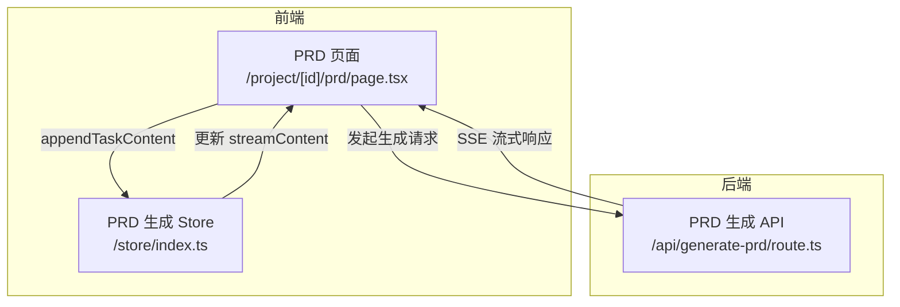
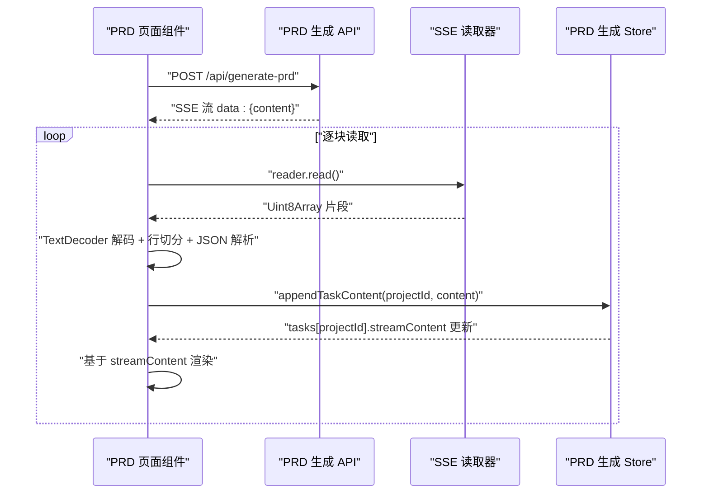
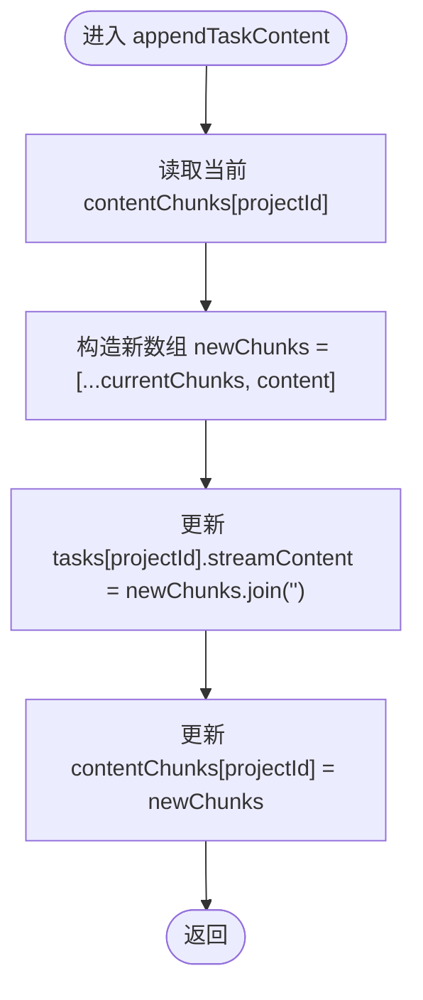
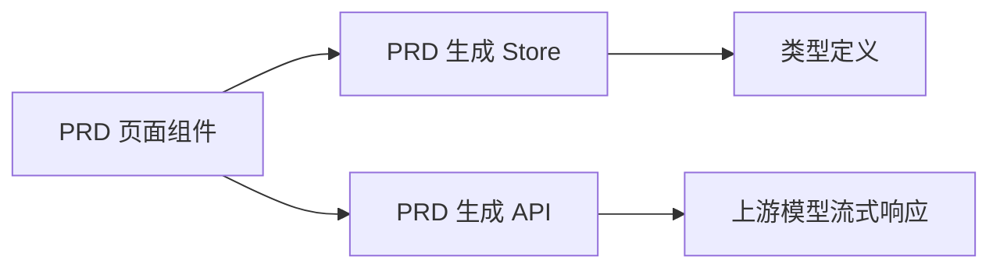

# 内容追加与性能优化

<cite>
**本文引用的文件**
- [prd/page.tsx](file://prd-generator/src/app/project/[id]/prd/page.tsx)
- [store/index.ts](file://prd-generator/src/store/index.ts)
- [types/index.ts](file://prd-generator/src/types/index.ts)
- [api/generate-prd/route.ts](file://prd-generator/src/app/api/generate-prd/route.ts)
</cite>

## 目录
1. [引言](#引言)
2. [项目结构](#项目结构)
3. [核心组件](#核心组件)
4. [架构总览](#架构总览)
5. [详细组件分析](#详细组件分析)
6. [依赖分析](#依赖分析)
7. [性能考量](#性能考量)
8. [故障排查指南](#故障排查指南)
9. [结论](#结论)

## 引言
本文件围绕 PRD 生成流程中的关键性能优化点展开，重点分析 appendTaskContent 方法如何通过 contentChunks 数组降低高频字符串拼接的开销，并解释其在处理大型 PRD 文档生成时的优势。同时结合 /project/[id]/prd/page.tsx 中的 SSE 事件监听器，说明该方法的调用频率与性能考量，以及与后端流式响应的协作机制。

## 项目结构
PRD 生成涉及前端页面、全局状态管理、类型定义与后端 API 四个层面：
- 前端页面负责接收 SSE 流、解析增量内容并调用状态管理接口
- 全局状态管理维护每个项目的生成任务与内容缓冲
- 类型定义明确任务状态与字段
- 后端 API 将上游模型的增量内容转换为标准 SSE 格式并逐块下发

图表来源
- [prd/page.tsx](file://prd-generator/src/app/project/[id]/prd/page.tsx#L201-L311)
- [store/index.ts](file://prd-generator/src/store/index.ts#L561-L769)
- [api/generate-prd/route.ts](file://prd-generator/src/app/api/generate-prd/route.ts#L186-L244)

章节来源
- [prd/page.tsx](file://prd-generator/src/app/project/[id]/prd/page.tsx#L201-L311)
- [store/index.ts](file://prd-generator/src/store/index.ts#L561-L769)
- [api/generate-prd/route.ts](file://prd-generator/src/app/api/generate-prd/route.ts#L186-L244)

## 核心组件
- PRD 页面组件：负责发起生成请求、读取 SSE 流、解析增量内容、调用 appendTaskContent 并渲染 streamContent
- PRD 生成 Store：维护每个项目的任务状态与 contentChunks 缓冲，提供 appendTaskContent、getTaskContent 等方法
- 类型定义：PRDGenerationTask、PRDGenerationTaskPersisted 等，明确 streamContent、phase、elapsedTime 等字段
- PRD 生成 API：将上游模型的增量内容封装为标准 SSE，逐块下发给前端

章节来源
- [types/index.ts](file://prd-generator/src/types/index.ts#L194-L224)
- [store/index.ts](file://prd-generator/src/store/index.ts#L532-L560)
- [store/index.ts](file://prd-generator/src/store/index.ts#L619-L643)
- [api/generate-prd/route.ts](file://prd-generator/src/app/api/generate-prd/route.ts#L186-L244)

## 架构总览
下图展示从前端发起生成请求到后端流式响应、再到前端状态更新与 UI 渲染的完整链路。

图表来源
- [prd/page.tsx](file://prd-generator/src/app/project/[id]/prd/page.tsx#L235-L296)
- [api/generate-prd/route.ts](file://prd-generator/src/app/api/generate-prd/route.ts#L186-L244)
- [store/index.ts](file://prd-generator/src/store/index.ts#L619-L637)

## 详细组件分析

### appendTaskContent 方法设计与性能优化
- 设计目标：在高频增量字符串拼接场景下，避免频繁创建中间字符串副本，降低内存分配与垃圾回收压力
- 实现思路：
  - 使用 contentChunks 数组缓存增量内容块，每次新增一个块
  - 通过 join('') 一次性合并数组为最终字符串，写入 tasks[projectId].streamContent
  - 这样将多次字符串拼接的成本集中在一次 join 操作上，显著减少中间态对象数量
- 关键路径：
  - 调用入口：PRD 页面组件在解析到 SSE 增量内容后调用 appendTaskContent
  - 状态更新：appendTaskContent 在一次原子性 set 中同时更新 tasks 与 contentChunks
  - 渲染触发：tasks[projectId].streamContent 变化驱动 UI 重新渲染

图表来源
- [store/index.ts](file://prd-generator/src/store/index.ts#L619-L637)

章节来源
- [store/index.ts](file://prd-generator/src/store/index.ts#L619-L637)

### contentChunks 数组的作用与生命周期
- 初始化：startTask 时为每个 projectId 初始化空数组
- 追加：appendTaskContent 将增量内容作为新元素推入数组
- 合并：每次 append 后通过 join('') 生成最终字符串
- 清理：cancelTask 或 clearTask 时删除对应 projectId 的条目，避免内存泄漏

章节来源
- [store/index.ts](file://prd-generator/src/store/index.ts#L569-L599)
- [store/index.ts](file://prd-generator/src/store/index.ts#L619-L637)
- [store/index.ts](file://prd-generator/src/store/index.ts#L697-L711)

### 与 PRD 页面组件的协作
- PRD 页面组件在 SSE 读取循环中逐块解析 data: {content}，并将 content 传入 appendTaskContent
- 页面组件通过 usePRDGenerationStore.tasks[projectId].streamContent 渲染实时内容
- 该模式确保 UI 响应与增量内容同步，避免因频繁 setState 导致的重复渲染

章节来源
- [prd/page.tsx](file://prd-generator/src/app/project/[id]/prd/page.tsx#L235-L296)

### 与后端 API 的对接
- 后端 API 将上游模型的增量内容逐块封装为 data: {content} 的 SSE 行
- 前端按行解析，过滤 [DONE] 标记，提取 content 字段
- 该协议简化了前端解析逻辑，保证增量内容的顺序性与完整性

章节来源
- [api/generate-prd/route.ts](file://prd-generator/src/app/api/generate-prd/route.ts#L186-L244)
- [prd/page.tsx](file://prd-generator/src/app/project/[id]/prd/page.tsx#L235-L296)

### 类型与状态模型
- PRDGenerationTask：包含 phase、startTime、elapsedTime、streamContent 等字段
- PRDGenerationTaskPersisted：持久化版本，不含 AbortController
- PRD 生成 Store：维护 tasks 与 contentChunks，提供 getTaskContent、appendTaskContent 等方法

章节来源
- [types/index.ts](file://prd-generator/src/types/index.ts#L194-L224)
- [store/index.ts](file://prd-generator/src/store/index.ts#L532-L560)
- [store/index.ts](file://prd-generator/src/store/index.ts#L639-L643)

## 依赖分析
- PRD 页面组件依赖 PRD 生成 Store 的 appendTaskContent 与 tasks[projectId].streamContent
- PRD 生成 Store 依赖 PRDGenerationTask 类型定义
- PRD 页面组件依赖后端 API 提供的 SSE 增量内容
- 后端 API 依赖上游模型的流式响应，并将其转换为统一的 SSE 协议

图表来源
- [prd/page.tsx](file://prd-generator/src/app/project/[id]/prd/page.tsx#L201-L311)
- [store/index.ts](file://prd-generator/src/store/index.ts#L532-L560)
- [types/index.ts](file://prd-generator/src/types/index.ts#L194-L224)
- [api/generate-prd/route.ts](file://prd-generator/src/app/api/generate-prd/route.ts#L186-L244)

## 性能考量
- 直接字符串拼接的代价
  - 在高频增量场景下，每次 appendTaskContent 调用都会产生新的字符串对象，导致大量中间态字符串与 GC 压力
  - 随着内容增长，字符串拼接的时间复杂度呈线性增长，且空间复杂度也相应上升
- appendTaskContent 的优化策略
  - 将增量内容以数组形式累积，仅在必要时进行一次 join('') 合并
  - 通过原子性 set 更新 tasks 与 contentChunks，减少不必要的中间渲染
- 大型 PRD 文档生成的优势
  - 增量渲染更平滑，UI 不会因频繁 setState 而抖动
  - 内存占用更可控，避免中间字符串堆积
  - 在长文本场景下，整体吞吐更高，延迟更低
- 调用频率与 SSE 事件监听器
  - PRD 页面组件在 SSE 循环中逐块解析并调用 appendTaskContent
  - 调用频率取决于上游模型的增量输出节奏；contentChunks 保证每次追加只做一次 join，避免高频拼接带来的性能瓶颈
- 与对话流式响应的对比
  - 对话区使用 appendStreamContent(content) 进行本地流式渲染，不涉及全局状态管理
  - PRD 生成区使用 appendTaskContent(projectId, content) 更新全局状态，便于持久化与跨组件共享

章节来源
- [prd/page.tsx](file://prd-generator/src/app/project/[id]/prd/page.tsx#L235-L296)
- [store/index.ts](file://prd-generator/src/store/index.ts#L619-L637)

## 故障排查指南
- SSE 解析异常
  - 现象：解析 data 行时抛错或忽略内容
  - 排查：确认后端是否按 data: JSON 的格式输出，且未遗漏 [DONE] 结束标记
- 内存泄漏
  - 现象：长时间生成后内存持续增长
  - 排查：确保在 cancelTask/clearTask 时清理 contentChunks 与 tasks 中对应条目
- 任务状态不一致
  - 现象：生成中断后状态未正确恢复
  - 排查：检查持久化存储与内存状态的同步逻辑，避免竞态覆盖

章节来源
- [store/index.ts](file://prd-generator/src/store/index.ts#L697-L711)
- [store/index.ts](file://prd-generator/src/store/index.ts#L742-L769)
- [api/generate-prd/route.ts](file://prd-generator/src/app/api/generate-prd/route.ts#L216-L234)

## 结论
appendTaskContent 通过 contentChunks 数组将高频字符串拼接优化为低频合并操作，显著降低了内存分配与 GC 压力，提升了大型 PRD 文档生成过程中的渲染流畅度与整体性能。配合后端统一的 SSE 增量协议与前端事件监听器，实现了稳定、可扩展的流式内容处理链路。对于需要处理长文本与高并发增量更新的场景，该设计具有良好的可迁移性与可维护性。