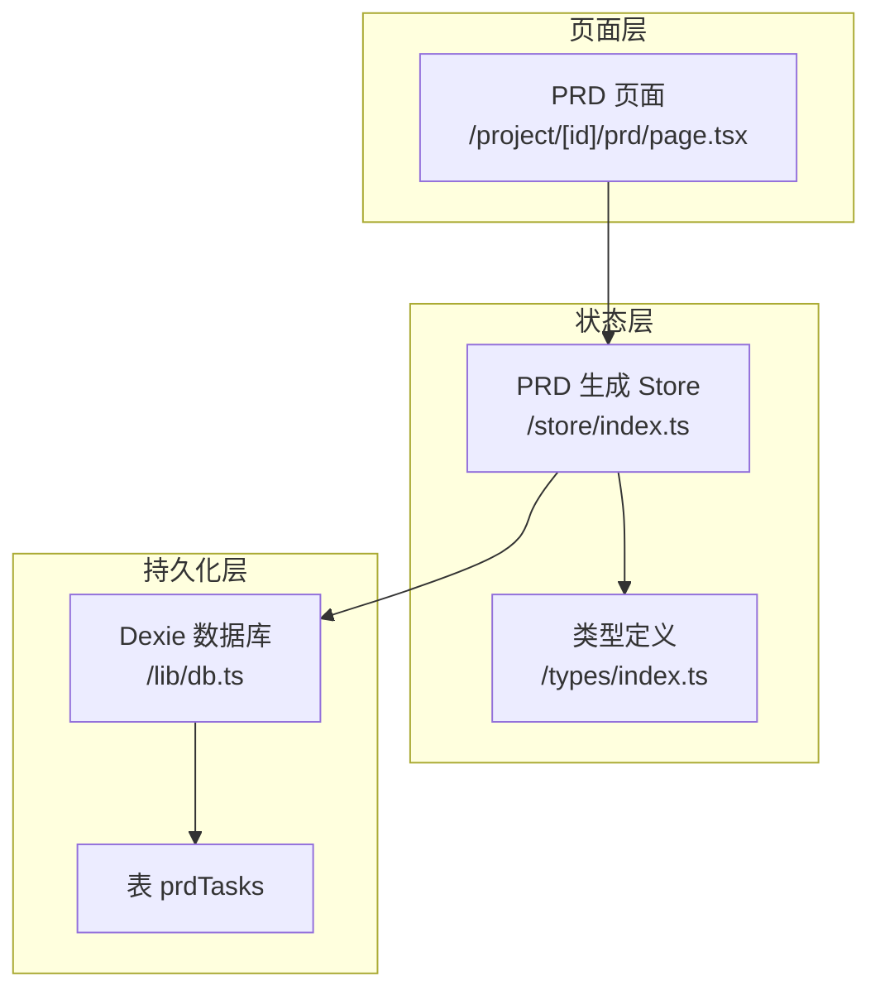
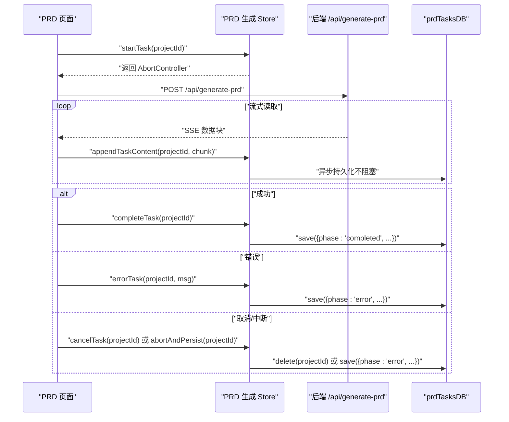
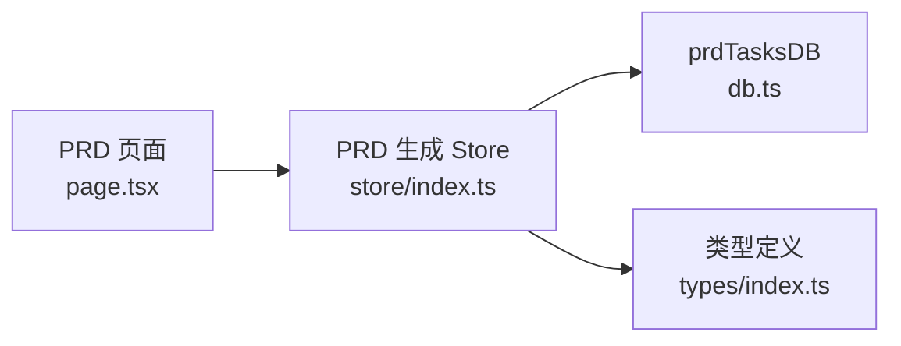

# 核心状态操作方法

<cite>
**本文引用的文件**
- [page.tsx](file://prd-generator/src/app/project/[id]/prd/page.tsx)
- [store/index.ts](file://prd-generator/src/store/index.ts)
- [db.ts](file://prd-generator/src/lib/db.ts)
- [types/index.ts](file://prd-generator/src/types/index.ts)
</cite>

## 目录
1. [引言](#引言)
2. [项目结构](#项目结构)
3. [核心组件](#核心组件)
4. [架构总览](#架构总览)
5. [详细组件分析](#详细组件分析)
6. [依赖关系分析](#依赖关系分析)
7. [性能考量](#性能考量)
8. [故障排查指南](#故障排查指南)
9. [结论](#结论)

## 引言
本文聚焦于 PRD 生成流程中的核心状态操作方法：startTask、appendTaskContent、completeTask、errorTask、cancelTask。我们将深入解析它们在内存状态与持久化存储之间的协作机制，以及在 /project/[id]/prd/page.tsx 中的调用时机与错误处理策略。重点包括：
- startTask 如何创建 AbortController 并初始化任务状态与 contentChunks 缓冲区
- appendTaskContent 如何通过数组 chunks 优化高频字符串拼接性能
- completeTask 与 errorTask 如何更新状态并同步持久化到 prdTasksDB
- cancelTask 如何安全中断请求并清理内存与持久化数据
- 在 PRD 页面中这些方法的调用顺序、错误分支与用户体验反馈

## 项目结构
PRD 页面与状态管理位于以下路径：
- 页面入口：/project/[id]/prd/page.tsx
- 状态管理：/store/index.ts（定义 PRD 生成 Store 的接口与方法）
- 数据库与持久化：/lib/db.ts（封装 prdTasks 表的 CRUD）
- 类型定义：/types/index.ts（PRDGenerationTask、PRDGenerationTaskPersisted 等）

图表来源
- [page.tsx](file://prd-generator/src/app/project/[id]/prd/page.tsx#L200-L311)
- [store/index.ts](file://prd-generator/src/store/index.ts#L532-L852)
- [db.ts](file://prd-generator/src/lib/db.ts#L169-L209)
- [types/index.ts](file://prd-generator/src/types/index.ts#L196-L224)

章节来源
- [page.tsx](file://prd-generator/src/app/project/[id]/prd/page.tsx#L200-L311)
- [store/index.ts](file://prd-generator/src/store/index.ts#L532-L852)
- [db.ts](file://prd-generator/src/lib/db.ts#L169-L209)
- [types/index.ts](file://prd-generator/src/types/index.ts#L196-L224)

## 核心组件
- PRDGenerationStore 接口与实现：定义任务状态 tasks 与流式内容缓冲 contentChunks，提供 startTask、appendTaskContent、completeTask、errorTask、cancelTask、clearTask、loadPersistedTask、restoreTask、persistTask、abortAndPersist 等方法。
- PRDGenerationTask 与 PRDGenerationTaskPersisted：前者含 AbortController，后者不含，用于内存与持久化之间的转换。
- prdTasksDB：对 prdTasks 表的读写封装，负责异步持久化。

章节来源
- [store/index.ts](file://prd-generator/src/store/index.ts#L532-L559)
- [types/index.ts](file://prd-generator/src/types/index.ts#L196-L224)
- [db.ts](file://prd-generator/src/lib/db.ts#L169-L209)

## 架构总览
PRD 生成的端到端流程如下：
- 页面发起生成请求，调用 startTask 创建任务并返回 AbortController
- 流式接收服务端数据，调用 appendTaskContent 将增量内容写入 contentChunks 并合并到 streamContent
- 成功完成后调用 completeTask，将 phase 更新为 completed 并持久化
- 发生错误时调用 errorTask，将 phase 更新为 error 并持久化
- 取消或组件卸载时调用 cancelTask 或 abortAndPersist，清理内存与持久化

图表来源
- [page.tsx](file://prd-generator/src/app/project/[id]/prd/page.tsx#L200-L311)
- [store/index.ts](file://prd-generator/src/store/index.ts#L569-L711)
- [db.ts](file://prd-generator/src/lib/db.ts#L169-L188)

## 详细组件分析

### startTask：创建 AbortController 并初始化任务状态与 contentChunks
- 创建 AbortController 并注入到任务对象
- 初始化任务字段：phase='generating'、startTime、elapsedTime、streamContent、abortController
- 在内存中写入 tasks[projectId]，同时初始化 contentChunks[projectId]=[]
- 异步持久化生成中状态（不阻塞 UI）
- 返回 AbortController，供页面 fetch 请求使用

调用时机与示例路径
- PRD 页面在发起生成请求前调用：[generatePRD 中的 startTask 调用](file://prd-generator/src/app/project/[id]/prd/page.tsx#L214-L216)

章节来源
- [store/index.ts](file://prd-generator/src/store/index.ts#L569-L599)
- [types/index.ts](file://prd-generator/src/types/index.ts#L196-L212)
- [page.tsx](file://prd-generator/src/app/project/[id]/prd/page.tsx#L214-L216)

### appendTaskContent：通过数组 chunks 优化高频字符串拼接
- 从 contentChunks[projectId] 读取当前 chunks，追加新内容形成 newChunks
- 在内存中将 tasks[projectId].streamContent 设为 newChunks.join('')，实现 O(n) 拼接
- 同步更新 contentChunks[projectId] 为 newChunks，便于后续快速合并
- 该策略避免频繁字符串拼接导致的性能损耗，适合高频流式增量

调用时机与示例路径
- PRD 页面在每次收到 SSE 数据块后调用：[appendTaskContent 调用](file://prd-generator/src/app/project/[id]/prd/page.tsx#L266-L283)

复杂度分析
- 单次 append：O(n)，n 为当前 chunks 长度；整体流式渲染时，多次 append 的总成本显著低于传统字符串拼接

章节来源
- [store/index.ts](file://prd-generator/src/store/index.ts#L620-L637)
- [page.tsx](file://prd-generator/src/app/project/[id]/prd/page.tsx#L246-L288)

### completeTask：更新状态并同步持久化
- 将任务 phase 更新为 'completed'，并移除 abortController
- 异步持久化保存：phase='completed'、startTime、elapsedTime、streamContent
- 该方法在 PRD 页面成功接收完全部流式数据后调用

调用时机与示例路径
- PRD 页面在流式接收完成后调用：[completeTask 调用](file://prd-generator/src/app/project/[id]/prd/page.tsx#L295-L296)

章节来源
- [store/index.ts](file://prd-generator/src/store/index.ts#L645-L668)
- [page.tsx](file://prd-generator/src/app/project/[id]/prd/page.tsx#L295-L296)

### errorTask：更新状态并同步持久化
- 将任务 phase 更新为 'error'，并移除 abortController
- 异步持久化保存：phase='error'、startTime、elapsedTime、streamContent、error
- PRD 页面在捕获异常时调用（区分取消与非取消错误）

调用时机与示例路径
- PRD 页面在 catch 分支中调用：[errorTask 调用](file://prd-generator/src/app/project/[id]/prd/page.tsx#L308-L309)

章节来源
- [store/index.ts](file://prd-generator/src/store/index.ts#L670-L695)
- [page.tsx](file://prd-generator/src/app/project/[id]/prd/page.tsx#L298-L311)

### cancelTask：安全中断请求并清理内存与持久化
- 若存在 abortController，则调用 abort() 中断请求
- 清理内存：删除 tasks[projectId] 与 contentChunks[projectId]
- 清理持久化：删除 prdTasks 表中对应记录
- 适用于用户主动取消或页面切换等场景

调用时机与示例路径
- PRD 页面在组件卸载时调用 abortAndPersist（内部会根据是否在生成中决定是否中断）：[abortAndPersist 调用](file://prd-generator/src/app/project/[id]/prd/page.tsx#L101-L105)
- abortAndPersist 的内部实现：[abortAndPersist 实现](file://prd-generator/src/store/index.ts#L819-L852)

章节来源
- [store/index.ts](file://prd-generator/src/store/index.ts#L697-L711)
- [store/index.ts](file://prd-generator/src/store/index.ts#L819-L852)
- [page.tsx](file://prd-generator/src/app/project/[id]/prd/page.tsx#L101-L105)

### PRD 页面中的调用时机与错误处理策略
- 生成前：检查是否存在进行中的任务，若无则调用 startTask 获取 AbortController
- 流式阶段：循环读取 SSE，逐块解析并调用 appendTaskContent 追加内容
- 成功：更新 PRD 内容与项目状态，调用 completeTask
- 错误：区分 AbortError（取消）与其它错误；取消时 clearTask，其它错误时调用 errorTask
- 中断：组件卸载时调用 abortAndPersist，确保在生成中时中断并持久化为错误状态

调用时机与示例路径
- 生成入口与流式处理：[generatePRD](file://prd-generator/src/app/project/[id]/prd/page.tsx#L200-L311)
- 卸载中断：[abortAndPersist 调用](file://prd-generator/src/app/project/[id]/prd/page.tsx#L101-L105)

章节来源
- [page.tsx](file://prd-generator/src/app/project/[id]/prd/page.tsx#L200-L311)
- [page.tsx](file://prd-generator/src/app/project/[id]/prd/page.tsx#L101-L105)

## 依赖关系分析
- PRD 页面依赖 PRD 生成 Store 提供的方法（startTask、appendTaskContent、completeTask、errorTask、abortAndPersist 等）
- Store 依赖 prdTasksDB 进行持久化
- 类型系统通过 PRDGenerationTask 与 PRDGenerationTaskPersisted 在内存与持久化之间传递状态

图表来源
- [page.tsx](file://prd-generator/src/app/project/[id]/prd/page.tsx#L200-L311)
- [store/index.ts](file://prd-generator/src/store/index.ts#L532-L852)
- [db.ts](file://prd-generator/src/lib/db.ts#L169-L209)
- [types/index.ts](file://prd-generator/src/types/index.ts#L196-L224)

## 性能考量
- 字符串拼接优化：通过 contentChunks 数组累积，最后 join 合并，避免频繁字符串拼接带来的性能损耗
- 异步持久化：startTask 与 completeTask/errorTask 的持久化均采用异步保存，不阻塞 UI
- 流式渲染：appendTaskContent 将增量内容写入内存，页面基于 prdTask.streamContent 实时渲染，提升交互体验

章节来源
- [store/index.ts](file://prd-generator/src/store/index.ts#L620-L637)
- [store/index.ts](file://prd-generator/src/store/index.ts#L591-L599)
- [store/index.ts](file://prd-generator/src/store/index.ts#L661-L668)
- [store/index.ts](file://prd-generator/src/store/index.ts#L687-L695)

## 故障排查指南
- 取消与中断
  - 若出现 AbortError，页面会视为取消并清理任务；确认是否在 PRD 页面中触发了取消或组件卸载
  - 参考：[generatePRD 中的取消分支](file://prd-generator/src/app/project/[id]/prd/page.tsx#L299-L304)
- 恢复中断任务
  - 页面卸载或刷新后，会尝试从 prdTasksDB 加载持久化任务；若为生成中状态，会标记为错误并提示重试
  - 参考：[abortAndPersist 与 restoreTask](file://prd-generator/src/store/index.ts#L819-L852)
- 持久化一致性
  - completeTask 与 errorTask 均会持久化当前状态；如发现状态不一致，检查 prdTasksDB 的保存是否成功
  - 参考：[completeTask 持久化](file://prd-generator/src/store/index.ts#L661-L668)、[errorTask 持久化](file://prd-generator/src/store/index.ts#L687-L695)
- 内存与持久化清理
  - cancelTask 会在内存与持久化中同时删除任务；如仍能看到旧任务，检查是否被其它地方引用
  - 参考：[cancelTask 实现](file://prd-generator/src/store/index.ts#L697-L711)

章节来源
- [page.tsx](file://prd-generator/src/app/project/[id]/prd/page.tsx#L298-L311)
- [store/index.ts](file://prd-generator/src/store/index.ts#L741-L802)
- [store/index.ts](file://prd-generator/src/store/index.ts#L661-L695)
- [store/index.ts](file://prd-generator/src/store/index.ts#L697-L711)

## 结论
- startTask 负责初始化任务与 AbortController，并建立 contentChunks 缓冲区，为后续流式处理奠定基础
- appendTaskContent 通过数组累积与 join 合并，有效降低字符串拼接成本
- completeTask 与 errorTask 在成功与失败场景下分别持久化最终状态，保证数据一致性
- cancelTask 与 abortAndPersist 提供了安全中断与清理能力，确保内存与持久化的一致性
- PRD 页面在生成流程中严格遵循“启动—流式—完成/错误—清理”的控制流，配合持久化恢复机制，提升了可用性与可靠性