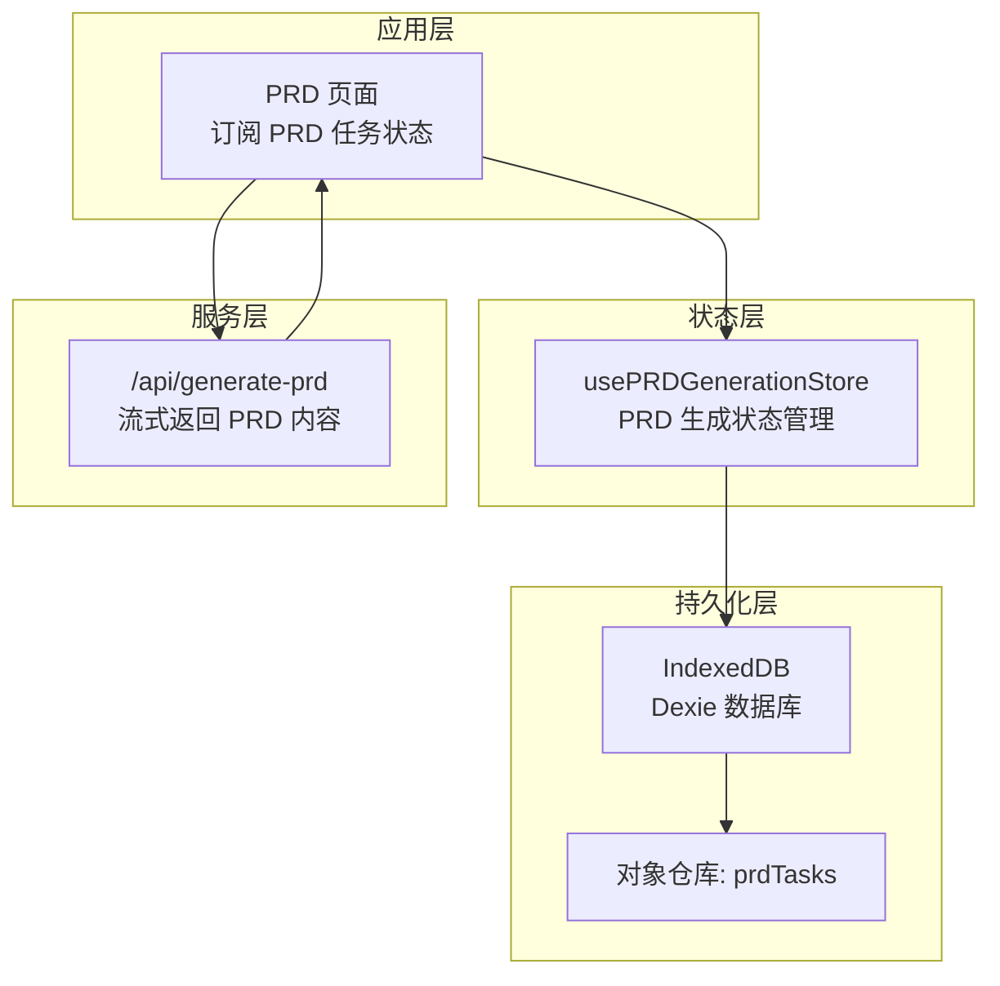
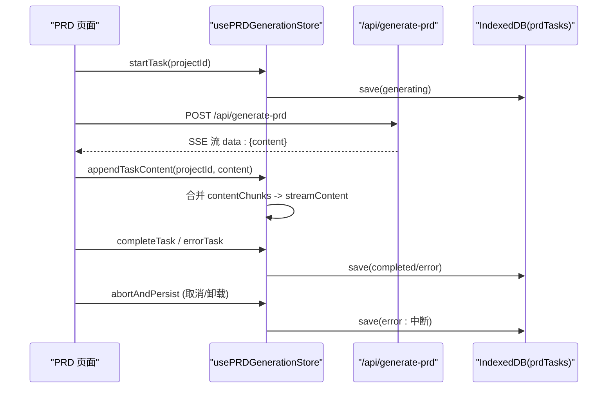
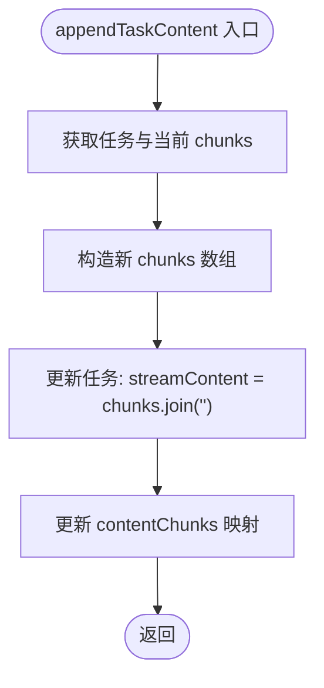
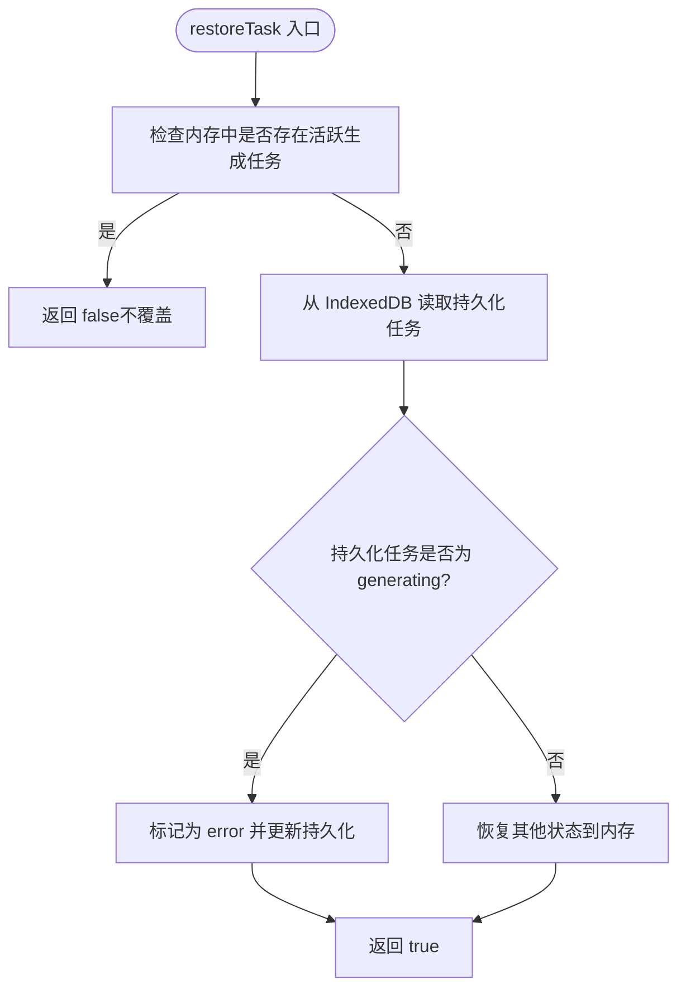
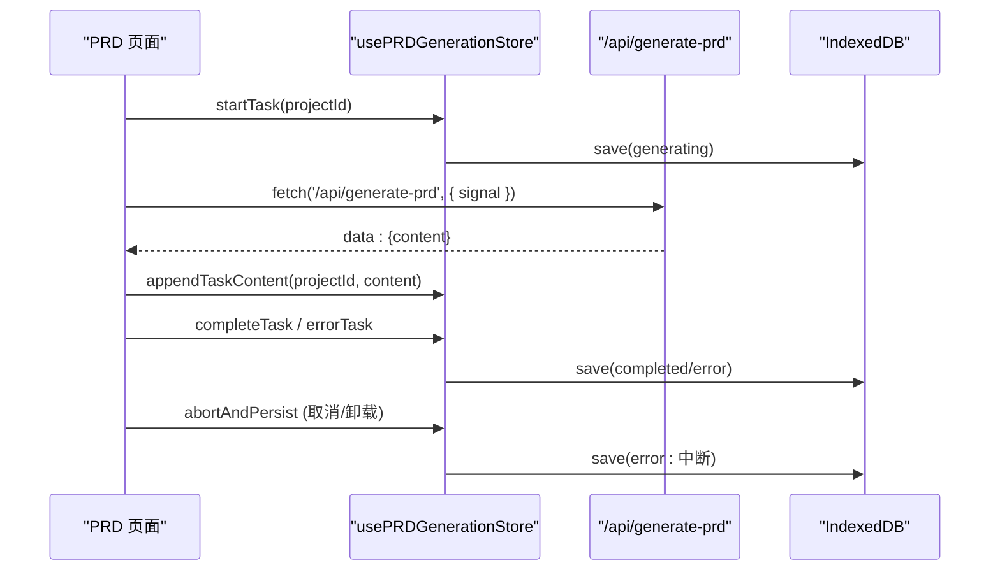
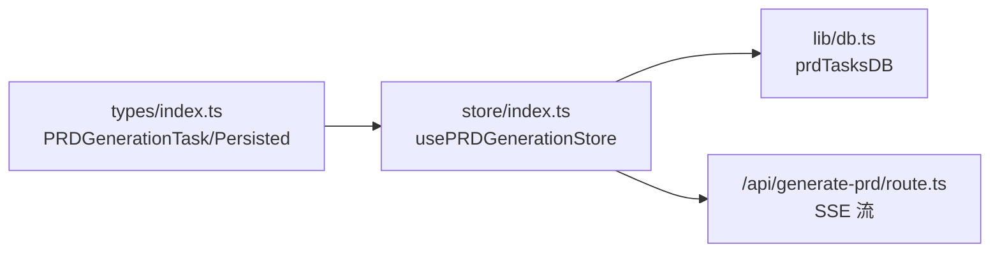

# 状态管理机制

<cite>
**本文引用的文件**
- [store/index.ts](file://prd-generator/src/store/index.ts)
- [types/index.ts](file://prd-generator/src/types/index.ts)
- [lib/db.ts](file://prd-generator/src/lib/db.ts)
- [app/project/[id]/prd/page.tsx](file://prd-generator/src/app/project/[id]/prd/page.tsx)
- [app/api/generate-prd/route.ts](file://prd-generator/src/app/api/generate-prd/route.ts)
</cite>

## 更新摘要
**变更内容**
- 修复了生成任务中断恢复的竞态条件问题，通过引入`generationStartedRef`防止恢复逻辑覆盖新任务
- 在恢复错误状态时清除`streamContent`和`contentChunks`以确保从干净状态重启
- 更新了`restoreTask`和`abortAndPersist`方法的实现逻辑

## 目录
1. [引言](#引言)
2. [项目结构](#项目结构)
3. [核心组件](#核心组件)
4. [架构总览](#架构总览)
5. [详细组件分析](#详细组件分析)
6. [依赖分析](#依赖分析)
7. [性能考量](#性能考量)
8. [故障排查指南](#故障排查指南)
9. [结论](#结论)

## 引言
本文围绕 PRD 生成状态管理器 usePRDGenerationStore 的设计与实现进行深入解析，重点阐述 PRDGenerationTask 状态模型字段、流式内容拼接优化、任务生命周期管理、中断恢复与安全持久化、计时器管理机制，以及在页面层如何通过订阅状态驱动 UI 更新，并讨论 IndexedDB 持久化的策略与时机。

## 项目结构
- 状态管理集中于 store/index.ts，采用 Zustand 的 create API 定义多个 Store（项目、设置、聊天、PRD 生成），其中 PRD 生成 Store 以 projectId 为维度隔离任务状态。
- 类型定义位于 types/index.ts，明确 PRDGenerationTask 与 PRDGenerationTaskPersisted 的字段与阶段枚举。
- 数据持久化通过 lib/db.ts 中的 Dexie 数据库封装 prdTasksDB，提供 get/save/delete/cleanup 等方法。
- 页面层 PRD 页面通过 usePRDGenerationStore 订阅任务状态，发起流式生成请求并在流式片段到达时追加内容。

图表来源
- [store/index.ts](file://prd-generator/src/store/index.ts#L532-L853)
- [lib/db.ts](file://prd-generator/src/lib/db.ts#L1-L210)
- [app/api/generate-prd/route.ts](file://prd-generator/src/app/api/generate-prd/route.ts#L1-L254)

章节来源
- [store/index.ts](file://prd-generator/src/store/index.ts#L532-L853)
- [types/index.ts](file://prd-generator/src/types/index.ts#L194-L224)
- [lib/db.ts](file://prd-generator/src/lib/db.ts#L1-L210)

## 核心组件
- PRDGenerationTask 状态模型（内存版）
  - 字段：projectId、phase、startTime、elapsedTime、streamContent、error、abortController
  - 作用：承载单个项目的 PRD 生成任务在内存中的状态，包括生成阶段、耗时统计、流式内容与错误信息，以及用于取消请求的 AbortController。
- PRDGenerationTaskPersisted（持久化版）
  - 字段：projectId、phase、startTime、elapsedTime、streamContent、error、updatedAt
  - 作用：用于 IndexedDB 的持久化存储，不包含 abortController，避免序列化问题。

章节来源
- [types/index.ts](file://prd-generator/src/types/index.ts#L194-L224)

## 架构总览
PRD 生成流程的关键路径：
- 页面触发 startTask，初始化任务并异步持久化生成中状态。
- 通过 /api/generate-prd 发起流式请求，服务端以 SSE 形式返回增量内容。
- 客户端收到增量内容后调用 appendTaskContent，将内容追加至 contentChunks 并合并到 streamContent。
- 生成完成后调用 completeTask，持久化完成状态；发生错误时调用 errorTask，持久化错误状态。
- 组件卸载或取消时调用 abortAndPersist，安全中断并持久化中断错误状态。

图表来源
- [store/index.ts](file://prd-generator/src/store/index.ts#L569-L853)
- [app/api/generate-prd/route.ts](file://prd-generator/src/app/api/generate-prd/route.ts#L1-L254)
- [lib/db.ts](file://prd-generator/src/lib/db.ts#L171-L209)

## 详细组件分析

### PRDGenerationTask 状态模型与字段语义
- projectId：任务归属的项目标识，用于按项目隔离状态。
- phase：任务阶段，包括 idle、generating、completed、error。
- startTime：任务开始时间戳，用于计算耗时。
- elapsedTime：以秒为单位的累计耗时，由 updateElapsedTime 定时更新。
- streamContent：当前已合并的流式内容，供 UI 展示。
- error：错误信息，当任务进入 error 阶段时记录。
- abortController：用于取消正在进行的请求，避免资源泄漏。

章节来源
- [types/index.ts](file://prd-generator/src/types/index.ts#L194-L224)
- [store/index.ts](file://prd-generator/src/store/index.ts#L569-L727)

### 流式内容拼接优化：contentChunks 数组
- 设计动机：频繁字符串拼接在大量增量内容下会产生显著性能开销，因此采用数组缓存增量片段，最终通过 join 合并。
- 实现要点：
  - 初始化：startTask 为每个 projectId 初始化空数组。
  - 追加：appendTaskContent 将新片段加入数组，并同时将数组 join 后写入 streamContent，保证 UI 可见性与性能平衡。
  - 获取：getTaskContent 直接对数组执行 join，避免重复拼接。
- 性能收益：减少字符串拼接次数，降低大文本场景下的内存分配与 GC 压力。

图表来源
- [store/index.ts](file://prd-generator/src/store/index.ts#L619-L643)

章节来源
- [store/index.ts](file://prd-generator/src/store/index.ts#L569-L727)

### 核心方法实现逻辑

#### startTask
- 作用：初始化 PRD 生成任务，设置 phase 为 generating，记录 startTime，创建 AbortController，并将任务与 contentChunks 初始化。
- 持久化：异步调用 prdTasksDB.save，写入生成中状态，不阻塞 UI。
- 注意：AbortController 仅存在于内存任务中，持久化版本不含该字段。

章节来源
- [store/index.ts](file://prd-generator/src/store/index.ts#L569-L599)

#### appendTaskContent
- 作用：接收增量内容，将其追加到 contentChunks，并同步更新 streamContent。
- 与 getTaskContent 的配合：getTaskContent 直接 join 数组，避免重复拼接。

章节来源
- [store/index.ts](file://prd-generator/src/store/index.ts#L619-L643)

#### getTaskContent
- 作用：按需合并数组为字符串，供 UI 渲染或导出使用。
- 复杂度：O(n)，n 为当前片段数量，但通常远小于直接字符串拼接的复杂度。

章节来源
- [store/index.ts](file://prd-generator/src/store/index.ts#L639-L643)

#### completeTask
- 作用：将任务标记为 completed，清除 abortController，随后持久化完成状态。
- 时机：在流式生成结束后调用，确保最终内容与耗时被持久化。

章节来源
- [store/index.ts](file://prd-generator/src/store/index.ts#L645-L668)

#### errorTask
- 作用：将任务标记为 error，记录错误信息，随后持久化错误状态。
- 用途：处理网络异常、服务端错误或客户端异常等情况。

章节来源
- [store/index.ts](file://prd-generator/src/store/index.ts#L669-L695)

#### cancelTask
- 作用：若存在 abortController 则 abort 请求，然后从内存 tasks 与 contentChunks 中删除对应条目，并删除 IndexedDB 中的持久化记录。
- 适用场景：用户主动取消或路由切换导致任务不再需要。

章节来源
- [store/index.ts](file://prd-generator/src/store/index.ts#L697-L711)

#### updateElapsedTime
- 作用：仅在 phase 为 generating 且存在有效 startTime 时，每秒更新一次 elapsedTime。
- 用途：为 UI 提供实时耗时展示。

章节来源
- [store/index.ts](file://prd-generator/src/store/index.ts#L713-L727)

#### clearTask
- 作用：清理内存与持久化记录，等价于取消并删除。
- 适用场景：任务不再需要或需要彻底清理。

章节来源
- [store/index.ts](file://prd-generator/src/store/index.ts#L729-L739)

#### loadPersistedTask / restoreTask
- loadPersistedTask：从 IndexedDB 读取持久化任务，用于初始化或恢复。
- restoreTask：从持久化恢复到内存，修复竞态条件：
  - 若内存中已有活跃生成任务（phase 为 generating 且 abortController 存在），则不覆盖，避免覆盖进行中的任务。
  - 若持久化任务为 generating，则将其标记为 error（因请求已中断），并更新持久化状态，提示用户重试。
  - 其他状态（如 error）直接恢复到内存。
  - **新增**：在恢复 error 状态时，清空 `streamContent` 和 `contentChunks`，确保从干净状态重启。

图表来源
- [store/index.ts](file://prd-generator/src/store/index.ts#L742-L802)

章节来源
- [store/index.ts](file://prd-generator/src/store/index.ts#L742-L802)

#### persistTask / abortAndPersist
- persistTask：将当前内存任务状态保存到 IndexedDB，用于中间状态持久化。
- abortAndPersist：在组件卸载或需要安全中断时调用：
  - 若任务处于 generating 且存在 abortController，则 abort 请求。
  - 将当前进度以 error 状态写入 IndexedDB，提示“生成过程中断，请重试”，并同步更新内存状态。
  - **更新**：现在保持 generating 状态，让恢复逻辑决定是否标记为 error。

章节来源
- [store/index.ts](file://prd-generator/src/store/index.ts#L805-L853)

### 与页面层的集成与 UI 驱动
- PRD 页面通过 usePRDGenerationStore 订阅 tasks[projectId]，读取 phase、elapsedTime、streamContent 等字段，驱动 UI 渲染与交互。
- 生成流程：
  - 用户点击“生成 PRD”，页面调用 startTask 启动任务。
  - 发起 /api/generate-prd 请求，服务端以 SSE 返回增量内容。
  - 客户端收到增量内容后调用 appendTaskContent，UI 即时展示流式内容。
  - 生成完成调用 completeTask，错误时调用 errorTask，UI 展示完成或错误状态。
  - 取消或卸载时调用 abortAndPersist，确保中断状态被持久化。
  - **新增**：使用 `generationStartedRef` 防止恢复逻辑覆盖新任务。

图表来源
- [app/project/[id]/prd/page.tsx](file://prd-generator/src/app/project/[id]/prd/page.tsx#L1-L311)
- [store/index.ts](file://prd-generator/src/store/index.ts#L569-L853)
- [app/api/generate-prd/route.ts](file://prd-generator/src/app/api/generate-prd/route.ts#L1-L254)

章节来源
- [app/project/[id]/prd/page.tsx](file://prd-generator/src/app/project/[id]/prd/page.tsx#L1-L311)

## 依赖分析
- 类型依赖：PRDGenerationTask 与 PRDGenerationTaskPersisted 定义了内存与持久化状态的字段差异，确保 abortController 不参与持久化。
- 数据库依赖：prdTasksDB 提供 get/save/delete/cleanup 方法，支持按 phase 查询与清理。
- API 依赖：/api/generate-prd 以 SSE 返回增量内容，客户端按片段处理并调用 appendTaskContent。

图表来源
- [types/index.ts](file://prd-generator/src/types/index.ts#L194-L224)
- [store/index.ts](file://prd-generator/src/store/index.ts#L532-L853)
- [lib/db.ts](file://prd-generator/src/lib/db.ts#L171-L209)
- [app/api/generate-prd/route.ts](file://prd-generator/src/app/api/generate-prd/route.ts#L1-L254)

章节来源
- [types/index.ts](file://prd-generator/src/types/index.ts#L194-L224)
- [lib/db.ts](file://prd-generator/src/lib/db.ts#L171-L209)

## 性能考量
- 流式内容拼接优化：采用 contentChunks 数组 + join 合并，避免频繁字符串拼接带来的性能损耗。
- 异步持久化：startTask 与 persistTask 采用异步保存，不阻塞主线程，提升交互流畅度。
- 计时器管理：仅在 generating 阶段启用定时器，避免无意义的周期性更新。
- 竞态修复：restoreTask 在内存已有活跃任务时不覆盖，防止覆盖进行中的任务。

章节来源
- [store/index.ts](file://prd-generator/src/store/index.ts#L569-L853)

## 故障排查指南
- 生成中断恢复
  - 现象：刷新页面或重新打开项目后，发现 PRD 生成任务处于 error 状态。
  - 排查：restoreTask 会将持久化中处于 generating 的任务标记为 error 并提示重试，确认是否为中断导致。
  - 处理：调用 restoreTask 成功后，重新发起生成。
- 安全中断与持久化
  - 现象：页面卸载或切换路由时，生成仍在进行。
  - 排查：abortAndPersist 会在内存中存在 abortController 且 phase 为 generating 时中断请求，并以 error 状态持久化。
  - 处理：下次进入页面后 restoreTask 会恢复错误状态，提示用户重试。
- 错误状态持久化
  - 现象：生成失败，UI 显示错误。
  - 排查：errorTask 会将错误信息持久化，便于后续恢复与诊断。
  - 处理：查看持久化错误信息，修正后重试。

章节来源
- [store/index.ts](file://prd-generator/src/store/index.ts#L742-L853)

## 结论
usePRDGenerationStore 通过内存任务与 IndexedDB 持久化双轨设计，实现了 PRD 生成任务的高效、可靠与可恢复。其关键特性包括：
- 以 contentChunks 优化流式内容拼接性能；
- 通过 startTask/appendTaskContent/completeTask/errorTask/cancelTask/clearTask 等方法完整覆盖任务生命周期；
- 通过 restoreTask/abortAndPersist 解决竞态与中断恢复问题；
- 通过 updateElapsedTime 提供实时耗时展示；
- 在 PRD 页面中通过订阅状态驱动 UI 更新，结合 SSE 流式响应实现即时反馈。