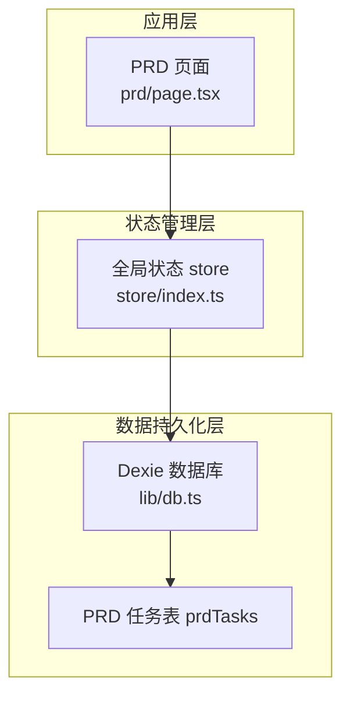
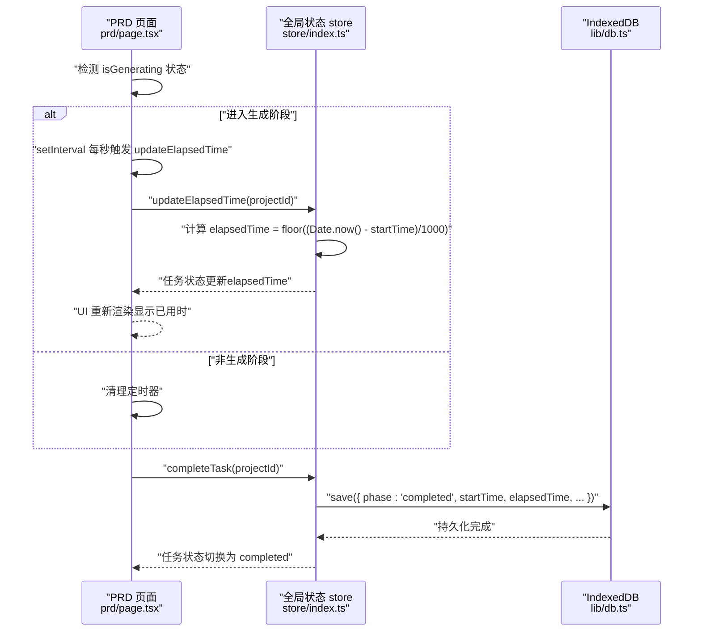
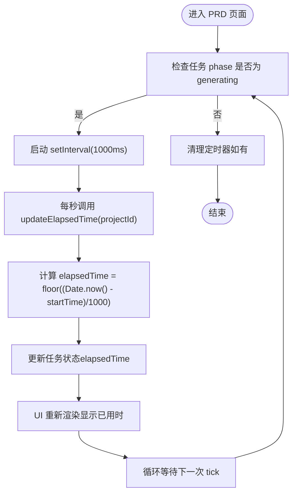
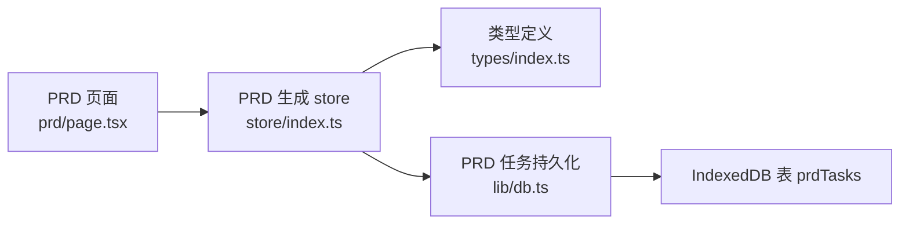

# 计时器管理机制

<cite>
**本文引用的文件**
- [prd/page.tsx](file://prd-generator/src/app/project/[id]/prd/page.tsx)
- [store/index.ts](file://prd-generator/src/store/index.ts)
- [types/index.ts](file://prd-generator/src/types/index.ts)
- [lib/db.ts](file://prd-generator/src/lib/db.ts)
</cite>

## 目录
1. [引言](#引言)
2. [项目结构](#项目结构)
3. [核心组件](#核心组件)
4. [架构总览](#架构总览)
5. [详细组件分析](#详细组件分析)
6. [依赖关系分析](#依赖关系分析)
7. [性能考量](#性能考量)
8. [故障排查指南](#故障排查指南)
9. [结论](#结论)

## 引言
本文聚焦于 PRD 页面中“updateElapsedTime”计时器管理机制的实现与生命周期，解释其如何通过 Date.now() 与 startTime 的差值计算任务已耗时（elapsedTime），并仅在 phase 为 generating 时更新状态；同时说明该方法在页面中如何由 useEffect 或 setInterval 周期性调用以驱动 UI 上的实时计时显示；最后结合 completeTask 中最终 elapsedTime 的持久化，梳理计时数据的完整生命周期。

## 项目结构
- PRD 页面位于应用路由的项目详情页中，负责展示与编辑 PRD 文档、控制生成流程与计时显示。
- 计时逻辑由全局状态管理 store 统一维护，PRD 页面通过订阅 store 中的任务状态来渲染 UI。
- 数据持久化采用 IndexedDB（Dexie）封装，PRD 任务状态在生成、错误、完成等阶段均会写入持久化存储。

图表来源
- [prd/page.tsx](file://prd-generator/src/app/project/[id]/prd/page.tsx#L147-L167)
- [store/index.ts](file://prd-generator/src/store/index.ts#L569-L727)
- [lib/db.ts](file://prd-generator/src/lib/db.ts#L1-L33)

章节来源
- [prd/page.tsx](file://prd-generator/src/app/project/[id]/prd/page.tsx#L1-L200)
- [store/index.ts](file://prd-generator/src/store/index.ts#L569-L727)
- [lib/db.ts](file://prd-generator/src/lib/db.ts#L1-L33)

## 核心组件
- PRD 页面中的计时器控制：在生成阶段启动/停止定时器，周期性调用 updateElapsedTime。
- 全局状态 store 中的 updateElapsedTime：根据 Date.now() 与 startTime 计算 elapsedTime 并更新任务状态。
- 完成阶段的持久化：completeTask 将最终 elapsedTime 写入 IndexedDB。

章节来源
- [prd/page.tsx](file://prd-generator/src/app/project/[id]/prd/page.tsx#L147-L167)
- [store/index.ts](file://prd-generator/src/store/index.ts#L713-L727)
- [store/index.ts](file://prd-generator/src/store/index.ts#L645-L668)

## 架构总览
下面的序列图展示了 PRD 页面中计时器从启动到完成的完整流程，以及最终持久化的过程。

图表来源
- [prd/page.tsx](file://prd-generator/src/app/project/[id]/prd/page.tsx#L147-L167)
- [store/index.ts](file://prd-generator/src/store/index.ts#L713-L727)
- [store/index.ts](file://prd-generator/src/store/index.ts#L645-L668)
- [lib/db.ts](file://prd-generator/src/lib/db.ts#L171-L183)

## 详细组件分析

### updateElapsedTime 方法的实现与调用
- 计算方式：elapsedTime = floor((Date.now() - startTime) / 1000)，单位为秒。
- 触发条件：仅当任务 phase 为 generating 时才更新，避免在非生成阶段产生无效状态变更。
- 调用方式：
  - PRD 页面通过 useEffect 监听 isGenerating，进入生成阶段时启动 setInterval，每秒调用 updateElapsedTime。
  - 页面卸载或退出生成阶段时清理定时器，防止内存泄漏与多余更新。

图表来源
- [prd/page.tsx](file://prd-generator/src/app/project/[id]/prd/page.tsx#L147-L167)
- [store/index.ts](file://prd-generator/src/store/index.ts#L713-L727)

章节来源
- [prd/page.tsx](file://prd-generator/src/app/project/[id]/prd/page.tsx#L147-L167)
- [store/index.ts](file://prd-generator/src/store/index.ts#L713-L727)

### 任务状态与 UI 实时显示
- PRD 页面从全局状态 store 中读取 prdTask，包括 phase、elapsedTime、streamContent 等字段。
- UI 在生成中状态显示“已用时 X 秒”，并随定时器每秒刷新。
- 该显示逻辑与计时器解耦，仅依赖 store 中的 elapsedTime 字段，保证渲染简洁高效。

章节来源
- [prd/page.tsx](file://prd-generator/src/app/project/[id]/prd/page.tsx#L88-L93)
- [prd/page.tsx](file://prd-generator/src/app/project/[id]/prd/page.tsx#L649-L711)

### 完成阶段的最终持久化
- completeTask 在任务完成后将 phase 切换为 completed，并将 startTime、elapsedTime、streamContent 等写入 IndexedDB。
- 这样即使页面关闭或刷新，elapsedTime 也能在后续恢复任务时保持一致。

章节来源
- [store/index.ts](file://prd-generator/src/store/index.ts#L645-L668)
- [lib/db.ts](file://prd-generator/src/lib/db.ts#L171-L183)

### 类型与数据结构支撑
- PRDGenerationTask 与 PRDGenerationTaskPersisted 定义了任务在内存与持久化层的字段，包括 startTime、elapsedTime、phase、streamContent 等。
- 这些类型确保了计时字段在不同阶段的一致性与可追踪性。

章节来源
- [types/index.ts](file://prd-generator/src/types/index.ts#L196-L223)

## 依赖关系分析
- PRD 页面依赖全局状态 store 的 PRDGenerationStore，通过 startTask、appendTaskContent、completeTask、updateElapsedTime 等方法协同工作。
- store 依赖 IndexedDB 封装 prdTasksDB，用于任务状态的持久化与恢复。
- 类型系统 types/index.ts 为 store 与页面提供强类型约束，避免字段错配。

图表来源
- [prd/page.tsx](file://prd-generator/src/app/project/[id]/prd/page.tsx#L1-L120)
- [store/index.ts](file://prd-generator/src/store/index.ts#L569-L727)
- [types/index.ts](file://prd-generator/src/types/index.ts#L196-L223)
- [lib/db.ts](file://prd-generator/src/lib/db.ts#L1-L33)

章节来源
- [prd/page.tsx](file://prd-generator/src/app/project/[id]/prd/page.tsx#L1-L120)
- [store/index.ts](file://prd-generator/src/store/index.ts#L569-L727)
- [types/index.ts](file://prd-generator/src/types/index.ts#L196-L223)
- [lib/db.ts](file://prd-generator/src/lib/db.ts#L1-L33)

## 性能考量
- 避免不必要的状态更新
  - updateElapsedTime 仅在 phase 为 generating 时执行，防止在非生成阶段产生无效渲染。
  - 页面通过 useEffect 仅在 isGenerating 变化时启动/清理定时器，避免重复创建定时器。
- 时间精度与开销
  - 每秒一次的定时器频率适中，对 UI 渲染与 CPU 占用影响较小。
  - elapsedTime 以秒为单位，避免毫秒级波动带来的频繁重渲染。
- 渲染解耦
  - UI 仅依赖 store 的 elapsedTime 字段，无需在每次 tick 中做复杂计算，降低渲染成本。
- 内存与资源释放
  - 页面卸载时清理定时器，防止内存泄漏与后台持续运行。

章节来源
- [prd/page.tsx](file://prd-generator/src/app/project/[id]/prd/page.tsx#L147-L167)
- [store/index.ts](file://prd-generator/src/store/index.ts#L713-L727)

## 故障排查指南
- 计时器未启动
  - 检查 PRD 页面是否正确监听 isGenerating，并在进入生成阶段时启动定时器。
  - 确认 updateElapsedTime 的依赖项（如 projectId）未变化导致定时器重建。
- 计时停滞
  - 确认任务 phase 仍为 generating，否则定时器会被清理。
  - 检查页面是否卸载或离开生成阶段。
- 计时异常
  - 确认 startTime 是否正确初始化（startTask 时设置为 Date.now()）。
  - 检查是否存在多处定时器同时运行的情况（应仅保留一个）。
- 持久化缺失
  - 完成阶段需调用 completeTask，确保最终 elapsedTime 被写入 IndexedDB。
  - 如任务被取消或错误，确认 errorTask 是否正确持久化。

章节来源
- [prd/page.tsx](file://prd-generator/src/app/project/[id]/prd/page.tsx#L147-L167)
- [store/index.ts](file://prd-generator/src/store/index.ts#L569-L727)
- [store/index.ts](file://prd-generator/src/store/index.ts#L645-L668)

## 结论
updateElapsedTime 的计时器管理机制通过“Date.now() 与 startTime 的差值”精确计算已用时，并在 phase 为 generating 时仅进行必要更新，配合 PRD 页面的 useEffect/setInterval 实现 UI 实时显示。完成阶段通过 completeTask 将最终 elapsedTime 持久化至 IndexedDB，形成从生成到完成的完整计时数据生命周期。该设计在保证用户体验的同时，兼顾了性能与可靠性。