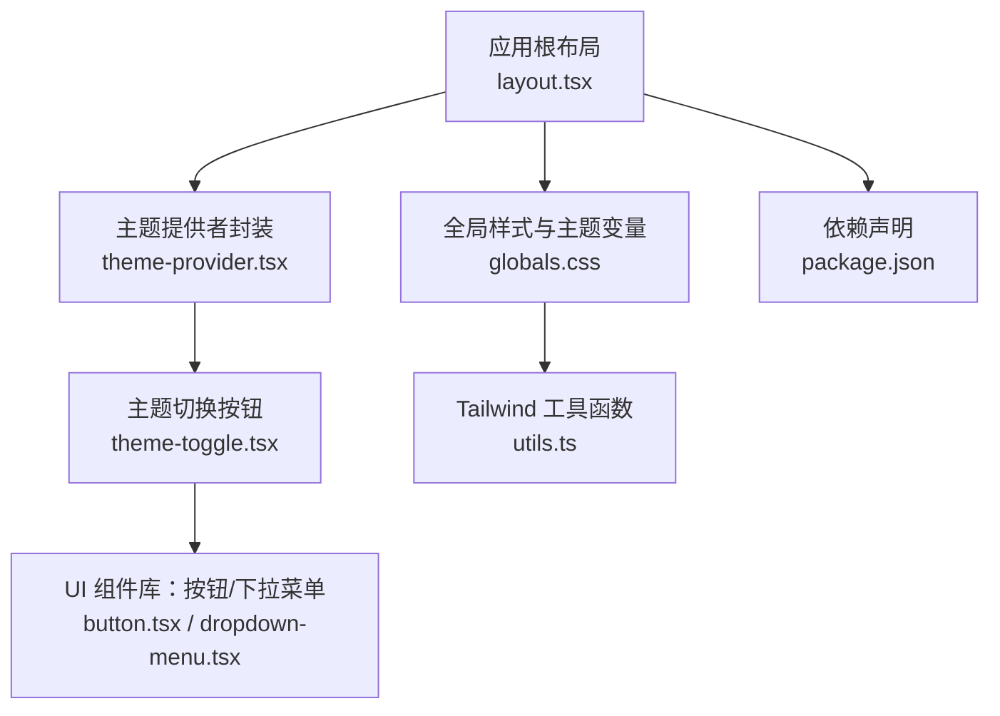
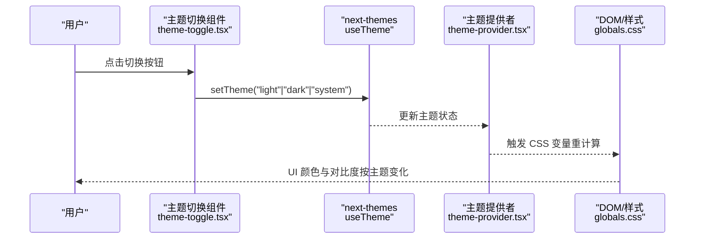
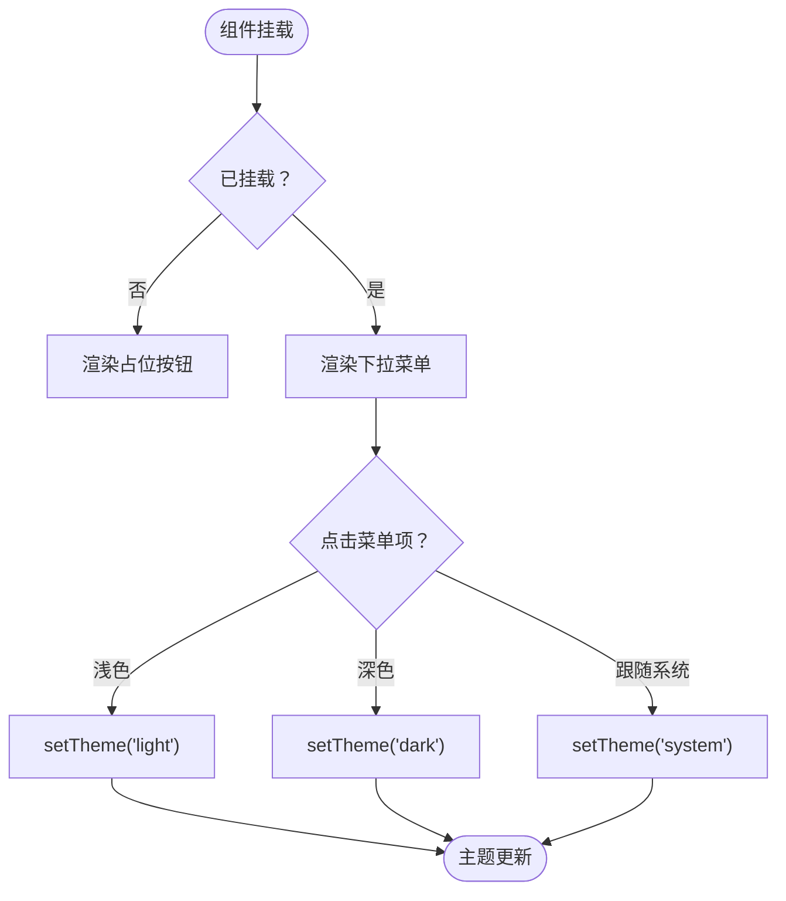
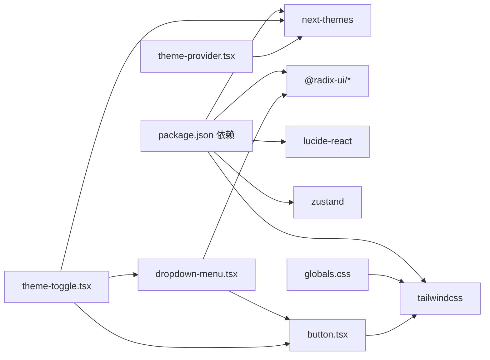

# 主题管理

<cite>
**本文引用的文件**
- [layout.tsx](file://prd-generator/src/app/layout.tsx)
- [theme-provider.tsx](file://prd-generator/src/components/theme-provider.tsx)
- [theme-toggle.tsx](file://prd-generator/src/components/theme-toggle.tsx)
- [globals.css](file://prd-generator/src/app/globals.css)
- [button.tsx](file://prd-generator/src/components/ui/button.tsx)
- [dropdown-menu.tsx](file://prd-generator/src/components/ui/dropdown-menu.tsx)
- [utils.ts](file://prd-generator/src/lib/utils.ts)
- [package.json](file://prd-generator/package.json)
</cite>

## 目录
1. [简介](#简介)
2. [项目结构](#项目结构)
3. [核心组件](#核心组件)
4. [架构总览](#架构总览)
5. [详细组件分析](#详细组件分析)
6. [依赖关系分析](#依赖关系分析)
7. [性能考量](#性能考量)
8. [故障排查指南](#故障排查指南)
9. [结论](#结论)

## 简介
本节介绍主题管理在应用中的定位与作用。PRD 生成工具通过“浅色/深色/跟随系统”三种主题模式，结合 TailwindCSS 的变量系统与 next-themes 提供的主题切换能力，为用户提供一致且可定制的视觉体验。主题切换不仅影响全局配色，还通过 UI 组件的变体与暗色适配，确保在不同模式下具备良好的对比度与可读性。

## 项目结构
主题管理涉及三层：
- 应用层：根布局注入主题提供者与全局样式。
- 组件层：主题切换入口组件，使用 UI 组件库实现下拉菜单与提示。
- 样式层：基于 oklch 的 CSS 变量主题，配合暗色伪类生效。

图表来源
- [layout.tsx](file://prd-generator/src/app/layout.tsx#L1-L45)
- [theme-provider.tsx](file://prd-generator/src/components/theme-provider.tsx#L1-L11)
- [theme-toggle.tsx](file://prd-generator/src/components/theme-toggle.tsx#L1-L67)
- [globals.css](file://prd-generator/src/app/globals.css#L1-L216)
- [button.tsx](file://prd-generator/src/components/ui/button.tsx#L1-L61)
- [dropdown-menu.tsx](file://prd-generator/src/components/ui/dropdown-menu.tsx#L1-L258)
- [utils.ts](file://prd-generator/src/lib/utils.ts#L1-L7)
- [package.json](file://prd-generator/package.json#L1-L85)

章节来源
- [layout.tsx](file://prd-generator/src/app/layout.tsx#L1-L45)
- [globals.css](file://prd-generator/src/app/globals.css#L1-L216)

## 核心组件
- 主题提供者封装：对 next-themes 的轻量封装，统一透传属性给子树。
- 主题切换入口：带 Tooltip 的下拉菜单，支持 light/dark/system 三态切换，并显示当前选中态。
- 全局样式：基于 oklch 的 CSS 变量主题，暗色伪类 .dark 下生效，覆盖背景、前景、卡片、弹出层等颜色。
- UI 组件：按钮与下拉菜单均使用 Tailwind 变体，自动适配主题变量，无需额外逻辑。

章节来源
- [theme-provider.tsx](file://prd-generator/src/components/theme-provider.tsx#L1-L11)
- [theme-toggle.tsx](file://prd-generator/src/components/theme-toggle.tsx#L1-L67)
- [globals.css](file://prd-generator/src/app/globals.css#L1-L216)
- [button.tsx](file://prd-generator/src/components/ui/button.tsx#L1-L61)
- [dropdown-menu.tsx](file://prd-generator/src/components/ui/dropdown-menu.tsx#L1-L258)

## 架构总览
主题系统采用“提供者 + 切换器 + 样式变量”的分层设计：
- 根布局注入 ThemeProvider，使整个应用树具备主题感知能力。
- ThemeToggle 通过 next-themes 的 useTheme hook 读取/写入当前主题，并渲染下拉菜单。
- 全局 CSS 定义了明/暗两套 oklch 变量，.dark 伪类触发暗色变量覆盖。
- UI 组件通过 Tailwind 变体与 CSS 变量联动，在不同主题下自动切换外观。

图表来源
- [theme-toggle.tsx](file://prd-generator/src/components/theme-toggle.tsx#L1-L67)
- [theme-provider.tsx](file://prd-generator/src/components/theme-provider.tsx#L1-L11)
- [globals.css](file://prd-generator/src/app/globals.css#L1-L216)

## 详细组件分析

### 主题提供者与根布局
- 根布局在 HTML 上启用主题切换与水合抑制，注入全局字体与通知组件，并包裹 ThemeProvider。
- ThemeProvider 将 next-themes 的 Provider 以最小封装形式暴露，便于后续扩展。

章节来源
- [layout.tsx](file://prd-generator/src/app/layout.tsx#L1-L45)
- [theme-provider.tsx](file://prd-generator/src/components/theme-provider.tsx#L1-L11)

### 主题切换组件
- 使用 next-themes 的 useTheme 读取当前主题与切换函数。
- 通过 Tooltip 与 DropdownMenu 实现“浅色/深色/跟随系统”三态切换，当前选中态以勾选图标标识。
- 首屏避免闪烁：在客户端挂载后再渲染真实按钮，首屏占位按钮仅用于尺寸稳定。

图表来源
- [theme-toggle.tsx](file://prd-generator/src/components/theme-toggle.tsx#L1-L67)

章节来源
- [theme-toggle.tsx](file://prd-generator/src/components/theme-toggle.tsx#L1-L67)

### 全局样式与主题变量
- 使用 oklch 定义主色与辅助色，明/暗两套变量分别在 :root 与 .dark 中定义。
- 通过 @theme inline 将 CSS 变量映射到 Tailwind 主题键，确保组件变体与样式一致。
- 暗色模式下背景/边框/输入/强调色等均进行反差优化，提升可读性。

章节来源
- [globals.css](file://prd-generator/src/app/globals.css#L1-L216)

### UI 组件与主题联动
- 按钮组件使用变体系统，根据主题变量自动切换前景/背景/悬停/焦点等状态。
- 下拉菜单组件同样依赖主题变量，保证在浅/深色下具有合适的对比度与阴影层次。
- 工具函数 cn 用于合并类名，确保 Tailwind 与变体类正确组合。

章节来源
- [button.tsx](file://prd-generator/src/components/ui/button.tsx#L1-L61)
- [dropdown-menu.tsx](file://prd-generator/src/components/ui/dropdown-menu.tsx#L1-L258)
- [utils.ts](file://prd-generator/src/lib/utils.ts#L1-L7)

## 依赖关系分析
- next-themes：提供主题状态管理与持久化能力，ThemeToggle 基于 useTheme 进行切换。
- TailwindCSS：通过 CSS 变量与 @theme 指令，将 oklch 主题映射到组件变体。
- UI 组件库：Radix UI 与自定义组件（如 Button、DropdownMenu）均依赖主题变量与 Tailwind 类。
- 样式工具：cn 用于类名合并，确保组件在不同主题下的类组合正确。

图表来源
- [package.json](file://prd-generator/package.json#L1-L85)
- [theme-toggle.tsx](file://prd-generator/src/components/theme-toggle.tsx#L1-L67)
- [theme-provider.tsx](file://prd-generator/src/components/theme-provider.tsx#L1-L11)
- [globals.css](file://prd-generator/src/app/globals.css#L1-L216)
- [button.tsx](file://prd-generator/src/components/ui/button.tsx#L1-L61)
- [dropdown-menu.tsx](file://prd-generator/src/components/ui/dropdown-menu.tsx#L1-L258)

章节来源
- [package.json](file://prd-generator/package.json#L1-L85)

## 性能考量
- 首屏渲染优化：ThemeToggle 在挂载前使用占位按钮，避免 SSR 与 CSR 之间尺寸抖动。
- 样式计算：oklch 变量集中定义，减少重复计算；暗色切换仅触发 CSS 变量重计算，成本低。
- 组件渲染：UI 组件使用变体类，主题切换不改变组件结构，仅变更样式类，渲染开销小。
- 存储策略：主题偏好由 next-themes 管理，无需额外持久化逻辑。

## 故障排查指南
- 切换无效
  - 检查根布局是否包裹 ThemeProvider。
  - 确认浏览器未禁用本地存储（主题偏好依赖存储）。
- 明/暗色切换不生效
  - 检查 .dark 伪类是否被正确应用（例如父级容器是否处于暗色上下文）。
  - 确认 CSS 变量未被页面其他样式覆盖。
- UI 组件颜色异常
  - 检查组件是否使用 Tailwind 变体而非硬编码颜色。
  - 确认 cn 工具函数正确合并类名，避免冲突类覆盖。

章节来源
- [layout.tsx](file://prd-generator/src/app/layout.tsx#L1-L45)
- [globals.css](file://prd-generator/src/app/globals.css#L1-L216)
- [button.tsx](file://prd-generator/src/components/ui/button.tsx#L1-L61)
- [dropdown-menu.tsx](file://prd-generator/src/components/ui/dropdown-menu.tsx#L1-L258)

## 结论
该主题管理方案以 next-themes 为核心，结合 oklch 主题变量与 Tailwind 变体系统，实现了简洁、可维护且高性能的主题切换。ThemeToggle 作为入口组件，通过下拉菜单与 Tooltip 提供直观的操作反馈；全局样式与 UI 组件协同工作，确保在浅色、深色与系统模式下均具备良好的视觉一致性与可用性。