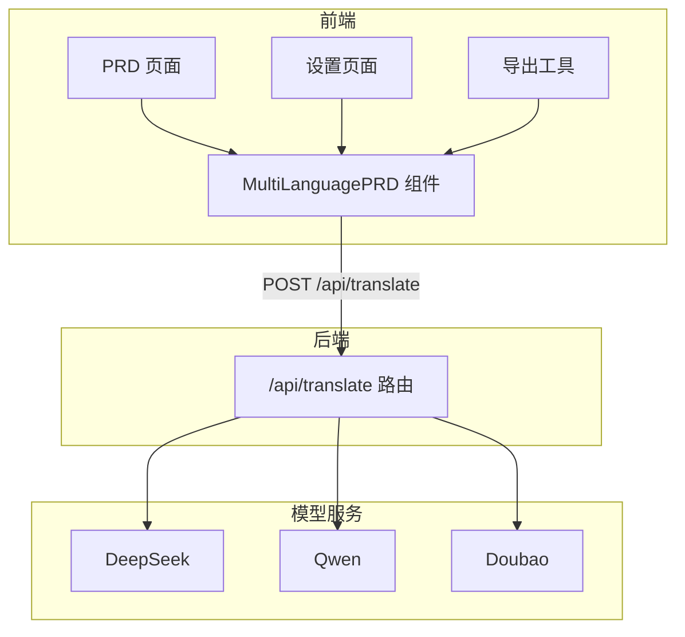
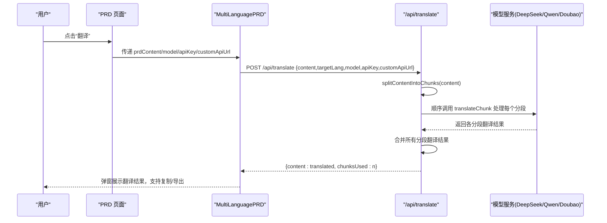
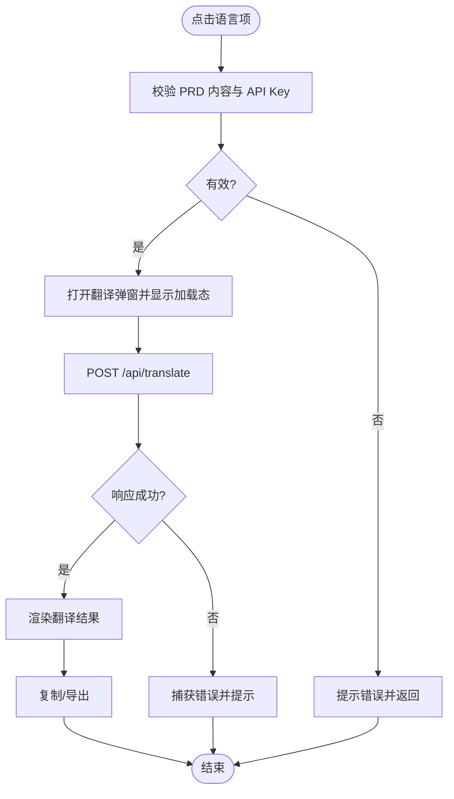
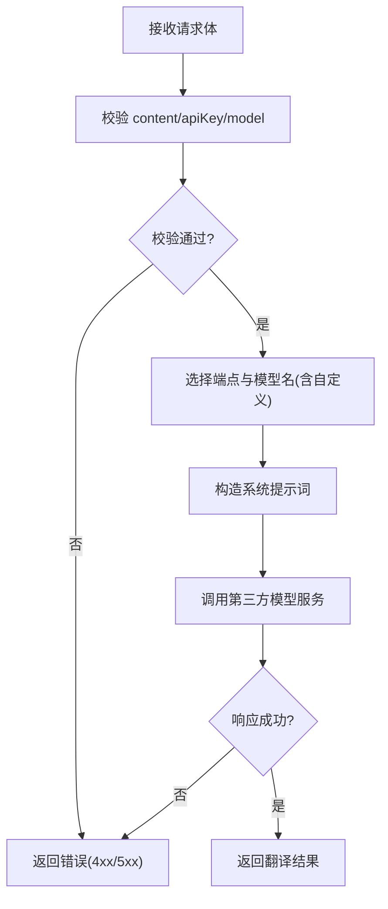
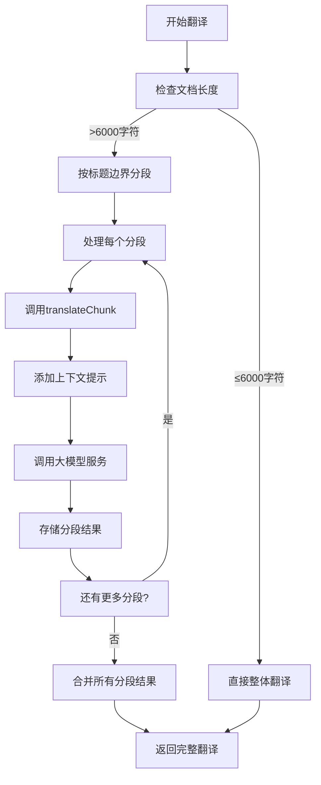
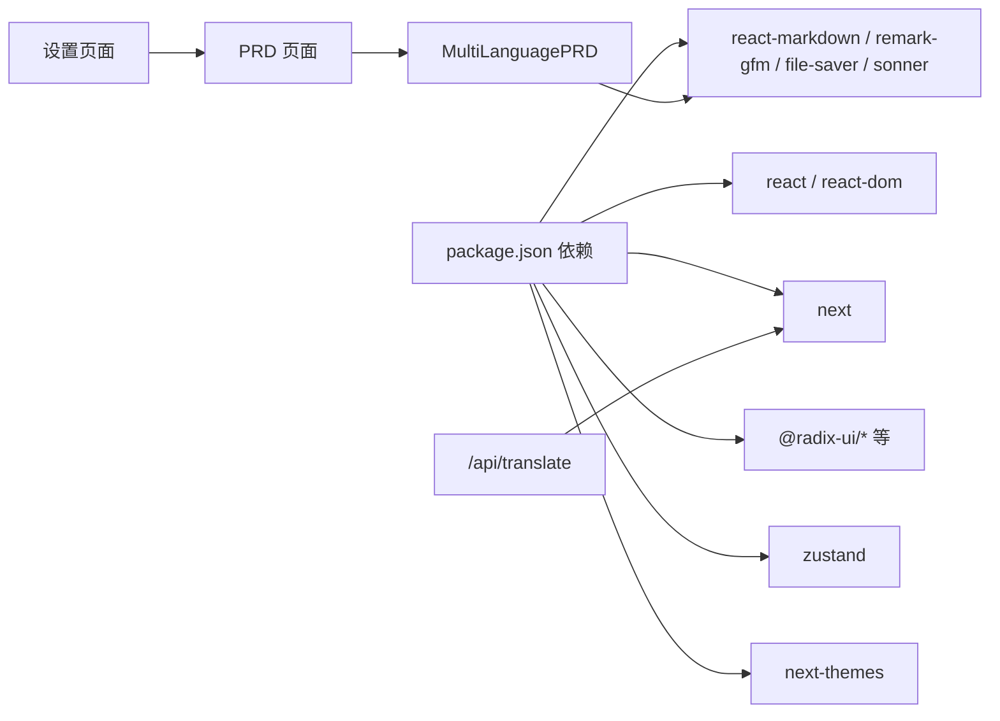

# 多语言翻译功能

<cite>
**本文引用的文件**
- [route.ts](file://prd-generator/src/app/api/translate/route.ts)
- [multi-language-prd.tsx](file://prd-generator/src/components/multi-language-prd.tsx)
- [page.tsx](file://prd-generator/src/app/project/[id]/prd/page.tsx)
- [page.tsx](file://prd-generator/src/app/settings/page.tsx)
- [index.ts](file://prd-generator/src/types/index.ts)
- [index.ts](file://prd-generator/src/store/index.ts)
- [export.ts](file://prd-generator/src/lib/export.ts)
- [package.json](file://prd-generator/package.json)
</cite>

## 更新摘要
**变更内容**
- 在“详细组件分析”部分新增“内容分段翻译机制”小节，详细说明按Markdown标题边界分割长文档的实现机制
- 更新“架构总览”序列图，反映分段翻译的工作流程
- 更新“性能考虑”部分，增加分段翻译对性能的影响分析
- 更新“故障排查指南”，增加与分段翻译相关的常见问题

## 目录
1. [简介](#简介)
2. [项目结构](#项目结构)
3. [核心组件](#核心组件)
4. [架构总览](#架构总览)
5. [详细组件分析](#详细组件分析)
6. [依赖关系分析](#依赖关系分析)
7. [性能考虑](#性能考虑)
8. [故障排查指南](#故障排查指南)
9. [结论](#结论)

## 简介
本功能允许用户将已生成的 PRD 文档一键翻译为多种目标语言，并在弹窗中以 Markdown 渲染展示翻译结果，同时支持复制与导出。翻译流程由前端组件发起请求，后端 API 路由对接多家大模型服务提供商，统一通过标准化的聊天补全接口完成翻译任务。**新增内容分段翻译机制，支持按Markdown标题边界分割长文档以保持上下文连贯性**。

## 项目结构
围绕“多语言翻译”的关键文件组织如下：
- 前端组件：多语言 PRD 展示组件负责触发翻译、展示结果与导出
- 后端路由：统一的翻译 API 路由，封装多家模型服务的端点与模型名称映射
- 设置页面：集中配置默认模型、API Key 与自定义 API 地址
- 类型与状态：定义模型配置、设置结构与全局状态管理
- 导出工具：提供复制到剪贴板与 Markdown 导出能力



图表来源
- [route.ts](file://prd-generator/src/app/api/translate/route.ts#L1-L92)
- [multi-language-prd.tsx](file://prd-generator/src/components/multi-language-prd.tsx#L1-L189)
- [page.tsx](file://prd-generator/src/app/project/[id]/prd/page.tsx#L640-L670)
- [page.tsx](file://prd-generator/src/app/settings/page.tsx#L100-L180)

章节来源
- [route.ts](file://prd-generator/src/app/api/translate/route.ts#L1-L92)
- [multi-language-prd.tsx](file://prd-generator/src/components/multi-language-prd.tsx#L1-L189)
- [page.tsx](file://prd-generator/src/app/project/[id]/prd/page.tsx#L640-L670)
- [page.tsx](file://prd-generator/src/app/settings/page.tsx#L100-L180)

## 核心组件
- 多语言 PRD 组件：提供语言下拉菜单、翻译触发、加载态、结果展示、复制与导出
- 翻译 API 路由：接收前端请求，根据模型标识选择对应端点与模型名，构造系统提示词并调用第三方模型服务
- 设置页面：维护默认模型、各模型 API Key、自定义 API URL
- 导出工具：提供复制到剪贴板与 Markdown 导出能力

章节来源
- [multi-language-prd.tsx](file://prd-generator/src/components/multi-language-prd.tsx#L1-L189)
- [route.ts](file://prd-generator/src/app/api/translate/route.ts#L1-L92)
- [page.tsx](file://prd-generator/src/app/settings/page.tsx#L100-L180)
- [export.ts](file://prd-generator/src/lib/export.ts#L1-L284)

## 架构总览
翻译工作流从 PRD 页面的“翻译”入口进入，组件收集当前 PRD 内容、项目名、默认模型、API Key 与自定义地址，向后端 /api/translate 发起请求；后端路由根据模型标识选择对应的服务端点与模型名称，构造系统提示词与用户内容，调用第三方模型服务，最终返回翻译后的 Markdown 文本，前端在弹窗中渲染并支持复制/导出。**对于长文档，系统会按Markdown标题边界自动分段处理，确保上下文连贯性**。



图表来源
- [page.tsx](file://prd-generator/src/app/project/[id]/prd/page.tsx#L640-L670)
- [multi-language-prd.tsx](file://prd-generator/src/components/multi-language-prd.tsx#L55-L97)
- [route.ts](file://prd-generator/src/app/api/translate/route.ts#L24-L92)

## 详细组件分析

### 多语言 PRD 组件（MultiLanguagePRD）
职责与行为
- 提供语言列表（英语、日语、韩语、德语、法语、西班牙语），点击后触发翻译
- 校验 PRD 内容与 API Key，必要时提示错误
- 调用 /api/translate 接口，显示加载态，渲染翻译结果
- 提供复制到剪贴板与导出 Markdown 的能力

关键交互流程
- 语言选择 -> 校验 -> 打开弹窗 -> 发起请求 -> 成功/失败处理 -> 关闭弹窗



图表来源
- [multi-language-prd.tsx](file://prd-generator/src/components/multi-language-prd.tsx#L55-L114)

章节来源
- [multi-language-prd.tsx](file://prd-generator/src/components/multi-language-prd.tsx#L1-L189)
- [export.ts](file://prd-generator/src/lib/export.ts#L1-L284)

### 翻译 API 路由（/api/translate）
职责与行为
- 解析请求体，校验内容与 API Key
- 根据模型标识选择服务端点与模型名称，支持自定义 API URL
- 构造系统提示词（保持 Markdown 格式、保留标题层级、保留技术内容原样、专业正式风格）
- 调用第三方模型服务，返回翻译结果

错误处理
- 缺少内容/Key、无效模型配置、上游服务异常均返回明确错误信息



图表来源
- [route.ts](file://prd-generator/src/app/api/translate/route.ts#L24-L92)

章节来源
- [route.ts](file://prd-generator/src/app/api/translate/route.ts#L1-L92)

### 内容分段翻译机制
**新增内容**

为解决长文档翻译时上下文丢失和模型token限制问题，系统实现了智能分段翻译机制。该机制优先在Markdown标题边界处分割文档，确保每个分段保持完整的语义结构。

#### 分段策略
- **标题边界优先**：在 `##` 或 `###` 级别标题处分割，保持文档结构完整性
- **长度限制**：单个分段不超过6000字符，避免超出模型处理能力
- **强制分割**：若内容超过9000字符（1.5倍限制），强制分割以防止内存溢出
- **短文档优化**：内容较短（≤6000字符）时不分段，直接整体翻译

#### 分段算法
```typescript
function splitContentIntoChunks(content: string): string[] {
  // 如果内容较短，不需要分段
  if (content.length <= CHUNK_SIZE) {
    return [content];
  }

  const chunks: string[] = [];
  const lines = content.split('\n');
  let currentChunk = '';
  
  for (const line of lines) {
    // 检查是否为标题行（## 或 ### 级别）
    const isHeading = /^#{1,3}\s/.test(line);
    
    // 如果当前块加上新行会超过限制，且是在标题处，则分割
    if (currentChunk.length + line.length > CHUNK_SIZE && isHeading && currentChunk.trim()) {
      chunks.push(currentChunk.trim());
      currentChunk = '';
    }
    
    currentChunk += line + '\n';
    
    // 如果当前块已经超过限制很多，强制分割
    if (currentChunk.length > CHUNK_SIZE * 1.5) {
      chunks.push(currentChunk.trim());
      currentChunk = '';
    }
  }
  
  if (currentChunk.trim()) {
    chunks.push(currentChunk.trim());
  }
  
  return chunks;
}
```

#### 分段翻译流程
1. **分段处理**：调用 `splitContentIntoChunks` 将长文档按标题边界分割
2. **顺序翻译**：逐个调用 `translateChunk` 翻译每个分段
3. **上下文提示**：为每个分段添加上下文提示（"这是文档第 X/Y 部分，请保持翻译风格一致"）
4. **结果合并**：将所有分段翻译结果用两个换行符连接



**Section sources**
- [route.ts](file://prd-generator/src/app/api/translate/route.ts#L162-L199)
- [route.ts](file://prd-generator/src/app/api/translate/route.ts#L201-L260)
- [route.ts](file://prd-generator/src/app/api/translate/route.ts#L317-L344)

### 设置页面（模型与 API Key）
职责与行为
- 选择默认模型（DeepSeek、Qwen、Doubao、自定义）
- 配置各模型 API Key，支持明文/隐藏切换
- 配置自定义 API URL（可选）
- 保存设置并写入本地存储

与翻译的关系
- 多语言 PRD 组件会读取默认模型、API Key 与自定义 URL，作为翻译请求参数的一部分

章节来源
- [page.tsx](file://prd-generator/src/app/settings/page.tsx#L100-L180)
- [index.ts](file://prd-generator/src/types/index.ts#L112-L125)

### 类型与状态（模型配置与全局状态）
- 模型配置：定义可用模型列表、是否需要 API Key 等
- 设置结构：包含默认模型、API Key 映射、自定义 API URL、导出偏好等
- 全局状态：PRD 生成任务状态、聊天任务状态、项目状态等（与翻译功能协同）

章节来源
- [index.ts](file://prd-generator/src/types/index.ts#L112-L125)
- [index.ts](file://prd-generator/src/types/index.ts#L92-L109)
- [index.ts](file://prd-generator/src/store/index.ts#L1-L208)

## 依赖关系分析
- 前端组件依赖
  - MultiLanguagePRD 依赖 react-markdown、remark-gfm、sonner、UI 组件库
  - 导出工具依赖 file-saver、DOM Clipboard API
- 后端路由依赖
  - Next.js Server Runtime（NextResponse）
  - 第三方模型服务（DeepSeek/Qwen/Doubao）
- 运行时依赖
  - Next.js 16、React 19、TailwindCSS、Zustand 等



图表来源
- [package.json](file://prd-generator/package.json#L15-L57)
- [multi-language-prd.tsx](file://prd-generator/src/components/multi-language-prd.tsx#L1-L189)
- [route.ts](file://prd-generator/src/app/api/translate/route.ts#L1-L92)
- [page.tsx](file://prd-generator/src/app/project/[id]/prd/page.tsx#L640-L670)
- [page.tsx](file://prd-generator/src/app/settings/page.tsx#L100-L180)

章节来源
- [package.json](file://prd-generator/package.json#L15-L57)

## 性能考虑
- 前端渲染
  - 使用 react-markdown + remark-gfm 渲染 Markdown，建议控制内容大小，避免超长文本导致渲染卡顿
  - 弹窗内使用 ScrollArea 控制滚动区域，提升交互体验
- 网络与并发
  - 单次翻译请求为一次性 IO，避免重复触发相同语言翻译
  - 若需批量翻译，可在 UI 上增加节流/防抖策略
- 存储与缓存
  - 翻译结果不会持久化，每次翻译均需重新请求
  - 如需缓存，可在应用层引入本地缓存策略（例如 IndexedDB 或内存缓存）
- **分段翻译影响**
  - **优点**：支持超长文档翻译，保持上下文连贯性，降低单次请求成本
  - **缺点**：增加网络请求次数（n次），总耗时为各分段耗时之和，可能影响用户体验
  - **优化建议**：对于特别长的文档，可考虑在前端显示分段翻译进度，或提供"快速翻译"（牺牲质量）和"精确翻译"（分段处理）两种模式

## 故障排查指南
常见问题与定位
- “没有 PRD 内容可翻译”
  - 检查 PRD 页面是否已生成内容，或 MultiLanguagePRD 是否传入了 prdContent
- “请先配置 API Key”
  - 在设置页面为默认模型填写 API Key，或选择“自定义”并填写自定义 API Key
- “无效的模型配置”
  - 确认 model 参数是否为 deepseek/qwen/doubao/custom 之一
- “API 请求失败”
  - 检查网络连通性、自定义 API URL 是否正确、第三方服务状态
  - 查看后端日志与响应状态码
- “翻译失败”
  - 检查上游模型服务是否返回合法 JSON；若出现跨域或代理问题，确认自定义 API URL 配置
- **“分段翻译失败”**
  - 检查某一分段是否因内容过长或格式问题导致翻译失败
  - 查看日志中的具体分段编号（"翻译第 X 部分失败"）
  - 考虑手动将文档按章节分割后分别翻译
- **“翻译结果不连贯”**
  - 检查文档是否在非标题处被强制分割（内容超过9000字符）
  - 考虑调整文档结构，增加更多二级/三级标题以优化分段

定位路径
- 前端调用路径：PRD 页面 -> MultiLanguagePRD -> /api/translate
- 后端处理路径：/api/translate -> 选择端点与模型名 -> 调用第三方模型服务 -> 返回翻译结果

章节来源
- [multi-language-prd.tsx](file://prd-generator/src/components/multi-language-prd.tsx#L55-L97)
- [route.ts](file://prd-generator/src/app/api/translate/route.ts#L24-L92)
- [page.tsx](file://prd-generator/src/app/project/[id]/prd/page.tsx#L640-L670)

## 结论
多语言翻译功能通过“前端组件 + 后端路由 + 多模型服务”的组合实现，具备良好的扩展性与易用性。前端负责交互与结果展示，后端负责统一接入多家模型服务并标准化输出。**新增的内容分段翻译机制有效解决了长文档翻译的上下文连贯性问题，通过按Markdown标题边界智能分割，确保了技术文档的专业性和结构完整性**。建议在生产环境中：
- 在设置页面完善默认模型与 API Key 的配置与校验
- 对翻译请求增加必要的节流与错误重试机制
- 对超长 PRD 文档进行分段翻译或拆分处理，以降低单次请求成本与风险
- 考虑为用户提供分段翻译进度反馈，提升用户体验