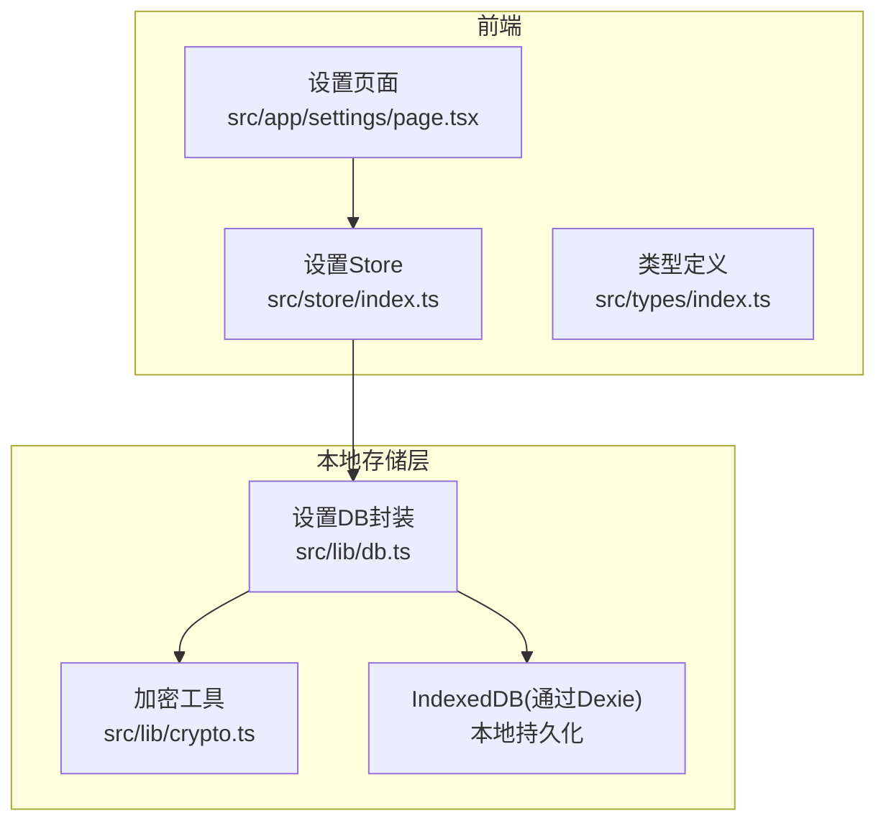
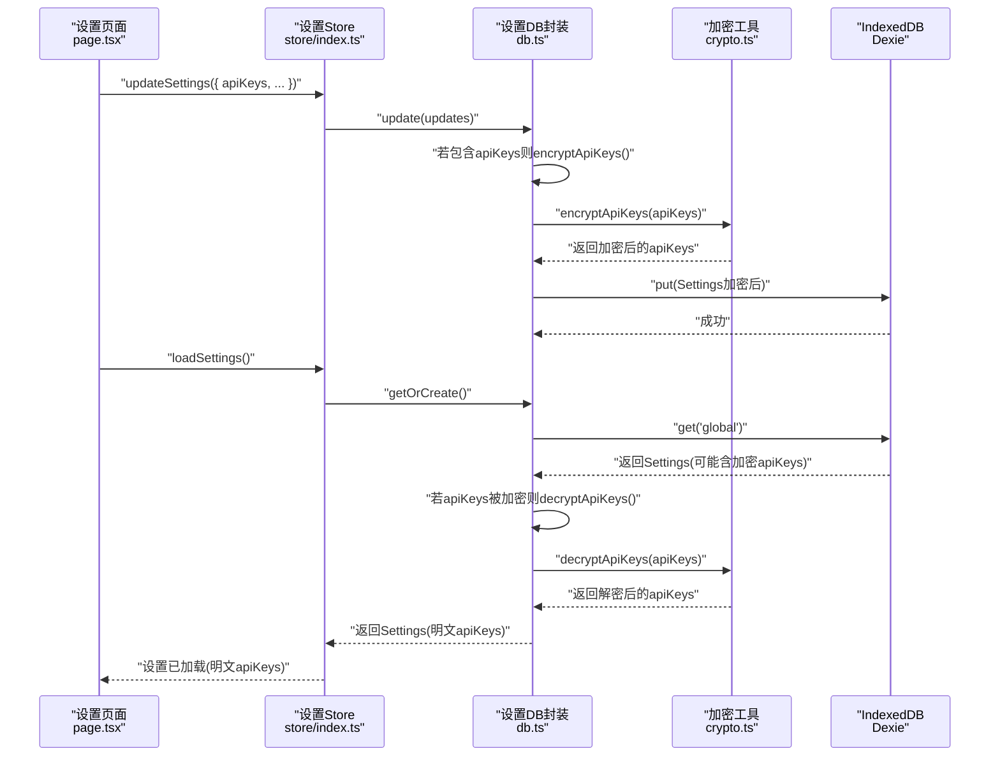
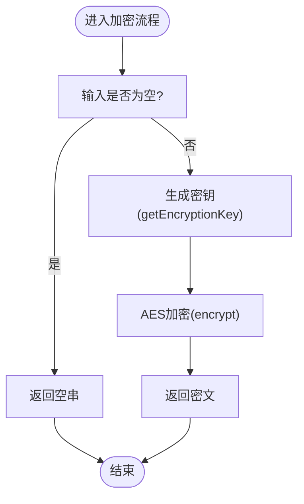
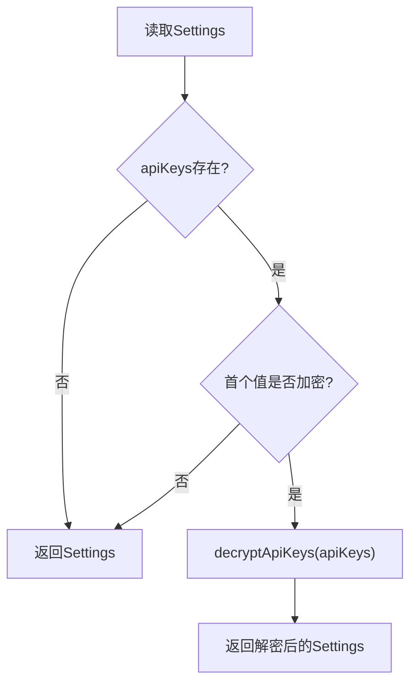
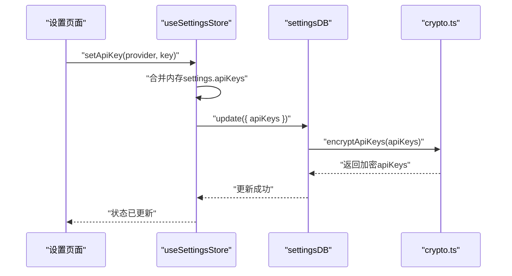
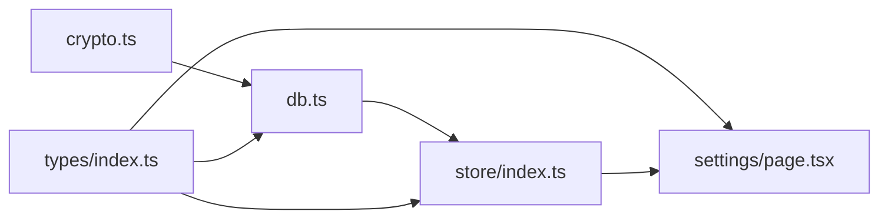

# 安全与加密模块

<cite>
**本文引用的文件**
- [crypto.ts](file://prd-generator/src/lib/crypto.ts)
- [db.ts](file://prd-generator/src/lib/db.ts)
- [index.ts](file://prd-generator/src/store/index.ts)
- [index.ts](file://prd-generator/src/types/index.ts)
- [page.tsx](file://prd-generator/src/app/settings/page.tsx)
- [package.json](file://prd-generator/package.json)
</cite>

## 目录
1. [简介](#简介)
2. [项目结构](#项目结构)
3. [核心组件](#核心组件)
4. [架构总览](#架构总览)
5. [详细组件分析](#详细组件分析)
6. [依赖分析](#依赖分析)
7. [性能考量](#性能考量)
8. [故障排查指南](#故障排查指南)
9. [结论](#结论)
10. [附录](#附录)

## 简介
本文件聚焦于API密钥的安全存储机制，系统性说明以下内容：
- 如何利用crypto-js对敏感配置（如AI服务API Key）进行加密存储
- 加密密钥的生成、存储与访问控制策略
- useSettingsStore如何安全地处理密钥的读写操作，确保明文密钥仅在内存中存在
- 结合Settings类型定义，阐述加密字段的序列化与反序列化流程
- 防止XSS攻击和数据泄露的安全最佳实践
- 加密算法选择与性能权衡

## 项目结构
围绕“安全与加密”的关键文件分布如下：
- 加密与密钥生成：src/lib/crypto.ts
- 设置持久化与加解密：src/lib/db.ts
- 设置状态管理：src/store/index.ts
- 类型定义（含Settings与ApiKeyConfig）：src/types/index.ts
- 设置页面（输入与展示API Key）：src/app/settings/page.tsx
- 依赖声明：package.json

图表来源
- [page.tsx](file://prd-generator/src/app/settings/page.tsx#L1-L120)
- [index.ts](file://prd-generator/src/store/index.ts#L210-L259)
- [db.ts](file://prd-generator/src/lib/db.ts#L75-L137)
- [crypto.ts](file://prd-generator/src/lib/crypto.ts#L1-L107)

章节来源
- [page.tsx](file://prd-generator/src/app/settings/page.tsx#L1-L120)
- [index.ts](file://prd-generator/src/store/index.ts#L210-L259)
- [db.ts](file://prd-generator/src/lib/db.ts#L75-L137)
- [crypto.ts](file://prd-generator/src/lib/crypto.ts#L1-L107)

## 核心组件
- 加密工具（crypto.ts）
  - 提供基于crypto-js的AES对称加密/解密
  - 通过设备指纹生成固定长度密钥
  - 提供API Keys对象的批量加解密与简单加密判定
- 设置DB封装（db.ts）
  - 对Settings进行加密封存与解密读取
  - 在保存/更新时自动加密apiKeys；在读取时自动解密
- 设置Store（store/index.ts）
  - 提供loadSettings/updateSettings/setApiKey/getApiKey等接口
  - 保证明文密钥仅存在于内存中，不直接暴露到持久化层
- 类型定义（types/index.ts）
  - 定义Settings与ApiKeyConfig，明确apiKeys字段结构
- 设置页面（app/settings/page.tsx）
  - 负责收集用户输入的API Key，调用Store进行保存

章节来源
- [crypto.ts](file://prd-generator/src/lib/crypto.ts#L1-L107)
- [db.ts](file://prd-generator/src/lib/db.ts#L75-L137)
- [index.ts](file://prd-generator/src/store/index.ts#L210-L259)
- [index.ts](file://prd-generator/src/types/index.ts#L75-L93)
- [page.tsx](file://prd-generator/src/app/settings/page.tsx#L1-L120)

## 架构总览
下面的序列图展示了从设置页面到本地存储的完整流程，强调“明文仅在内存中存在”的安全策略。

图表来源
- [page.tsx](file://prd-generator/src/app/settings/page.tsx#L45-L70)
- [index.ts](file://prd-generator/src/store/index.ts#L236-L242)
- [db.ts](file://prd-generator/src/lib/db.ts#L75-L137)
- [crypto.ts](file://prd-generator/src/lib/crypto.ts#L73-L106)

## 详细组件分析

### 加密工具（crypto.ts）
- 密钥生成策略
  - 在浏览器环境，使用固定盐值与若干浏览器指纹特征拼接后经SHA256生成固定长度密钥
  - 在服务端/无浏览器环境，直接使用固定盐值作为密钥
- 加解密流程
  - encrypt：对明文字符串进行AES加密，返回字符串
  - decrypt：对密文字符串进行AES解密，返回明文
  - encryptApiKeys/decryptApiKeys：对Record<string,string>类型的apiKeys进行批量加解密
  - isEncrypted：简单判定字符串是否为加密格式（基于CryptoJS的特征前缀）
- 安全要点
  - 该实现采用对称加密，密钥来源于设备指纹，不具备跨设备一致性
  - 未使用Web Crypto API，而是使用crypto-js；因此不支持浏览器原生密钥导入/导出
  - 未实现随机盐或初始化向量（IV），属于静态密钥方案

图表来源
- [crypto.ts](file://prd-generator/src/lib/crypto.ts#L12-L47)

章节来源
- [crypto.ts](file://prd-generator/src/lib/crypto.ts#L1-L107)

### 设置DB封装（db.ts）
- get()/getOrCreate()
  - 读取Settings；若发现apiKeys字段被加密，则调用decryptApiKeys进行解密
- save()/update()
  - 保存或更新Settings时，若包含apiKeys，则先调用encryptApiKeys进行加密
- isEncrypted()
  - 用于判断字符串是否已被加密，避免重复加密

图表来源
- [db.ts](file://prd-generator/src/lib/db.ts#L75-L108)

章节来源
- [db.ts](file://prd-generator/src/lib/db.ts#L75-L137)

### 设置Store（store/index.ts）
- loadSettings()
  - 调用settingsDB.getOrCreate()，确保返回的Settings中apiKeys为明文
- updateSettings()
  - 将传入的更新合并到当前settings，随后调用settingsDB.update，内部自动加密apiKeys
- setApiKey()/getApiKey()
  - setApiKey：在内存中合并新的apiKeys，调用settingsDB.update，内部自动加密
  - getApiKey：从内存settings中读取，不直接访问持久化层

图表来源
- [index.ts](file://prd-generator/src/store/index.ts#L244-L251)
- [db.ts](file://prd-generator/src/lib/db.ts#L100-L120)
- [crypto.ts](file://prd-generator/src/lib/crypto.ts#L73-L96)

章节来源
- [index.ts](file://prd-generator/src/store/index.ts#L210-L259)
- [db.ts](file://prd-generator/src/lib/db.ts#L75-L137)

### 类型定义（types/index.ts）
- Settings
  - 包含id、apiKeys、defaultModel、customApiUrl、exportPreferences
- ApiKeyConfig
  - Record<string, string>，键为provider，值为对应的API Key
- 作用
  - 明确apiKeys字段结构，使加密/解密流程在类型层面可追踪

章节来源
- [index.ts](file://prd-generator/src/types/index.ts#L75-L93)

### 设置页面（app/settings/page.tsx）
- 行为
  - 从useSettingsStore读取settings，渲染各Provider的API Key输入框
  - 保存时调用updateSettings，将apiKeys合并后一次性写入
- 安全注意
  - 输入框支持显隐切换，避免屏幕共享/他人窥视
  - 明文仅存在于组件状态与Store内存中，不直接暴露到持久化层

章节来源
- [page.tsx](file://prd-generator/src/app/settings/page.tsx#L1-L120)
- [page.tsx](file://prd-generator/src/app/settings/page.tsx#L210-L304)

## 依赖分析
- 外部依赖
  - crypto-js：提供AES加密/解密与SHA256摘要
  - dexie：封装IndexedDB，提供ORM式操作
  - zustand：轻量状态管理
- 内部依赖
  - crypto.ts被db.ts引入，用于apiKeys的加解密
  - db.ts被store/index.ts引入，用于Settings的持久化
  - types/index.ts被上述模块共同引用，确保类型一致

图表来源
- [package.json](file://prd-generator/package.json#L15-L46)
- [crypto.ts](file://prd-generator/src/lib/crypto.ts#L1-L107)
- [db.ts](file://prd-generator/src/lib/db.ts#L1-L20)
- [index.ts](file://prd-generator/src/store/index.ts#L1-L20)
- [index.ts](file://prd-generator/src/types/index.ts#L75-L93)

章节来源
- [package.json](file://prd-generator/package.json#L15-L46)

## 性能考量
- 加密性能
  - AES加密/解密在现代浏览器中开销较小，但在大量API Key或频繁更新时仍需关注
  - 批量加解密（encryptApiKeys/decryptApiKeys）通过遍历对象实现，复杂度O(n)
- I/O与存储
  - Dexie写入IndexedDB为异步I/O，整体延迟主要受网络与磁盘影响
- 内存占用
  - 明文API Key仅存在于内存中，避免了重复解密带来的额外内存压力
- 算法选择
  - 采用对称加密（AES）与固定盐值+浏览器指纹生成密钥，兼顾易用性与安全性
  - 若需更强的跨设备一致性与更强的抗篡改能力，可考虑引入随机IV与更复杂的密钥派生方案

[本节为通用性能讨论，不直接分析具体文件]

## 故障排查指南
- 常见问题
  - 加密/解密失败：检查输入是否为空；查看控制台错误日志
  - 重复加密：确认isEncrypted判定逻辑，避免对已加密字符串再次加密
  - 读取不到明文：确认loadSettings流程是否执行了decryptApiKeys
- 定位路径
  - 加密/解密入口：[crypto.ts](file://prd-generator/src/lib/crypto.ts#L36-L66)
  - 加密判定：[crypto.ts](file://prd-generator/src/lib/crypto.ts#L102-L106)
  - 读取与解密：[db.ts](file://prd-generator/src/lib/db.ts#L75-L108)
  - 写入与加密：[db.ts](file://prd-generator/src/lib/db.ts#L90-L120)
  - Store读写：[index.ts](file://prd-generator/src/store/index.ts#L225-L251)

章节来源
- [crypto.ts](file://prd-generator/src/lib/crypto.ts#L36-L66)
- [crypto.ts](file://prd-generator/src/lib/crypto.ts#L102-L106)
- [db.ts](file://prd-generator/src/lib/db.ts#L75-L120)
- [index.ts](file://prd-generator/src/store/index.ts#L225-L251)

## 结论
- 本项目采用crypto-js实现对API Key的对称加密存储，结合设备指纹生成固定密钥，确保明文仅在内存中存在
- 通过db.ts的加解密封装与store/index.ts的状态管理，形成“明文只在内存、密文入库”的安全闭环
- 若需进一步提升安全性与跨设备一致性，建议引入随机IV、Web Crypto API或硬件密钥支持，并完善密钥轮换与审计机制

[本节为总结性内容，不直接分析具体文件]

## 附录

### 安全最佳实践清单
- XSS防护
  - 输入过滤与转义：对用户输入进行严格校验与转义，避免直接插入DOM
  - 内容安全策略（CSP）：限制脚本执行来源，禁止内联脚本
  - 隐藏敏感信息：使用密码输入框与显隐切换，避免屏幕共享泄露
- 数据最小化
  - 仅存储必要的API Key，定期清理无效或过期的密钥
- 访问控制
  - 限制设置页面的访问范围，必要时增加二次验证
- 日志与审计
  - 避免记录明文API Key；如需审计，记录脱敏后的摘要信息
- 算法与密钥管理
  - 优先使用Web Crypto API或具备随机IV的加密方案
  - 考虑引入密钥轮换与定期重置机制

[本节为通用安全建议，不直接分析具体文件]