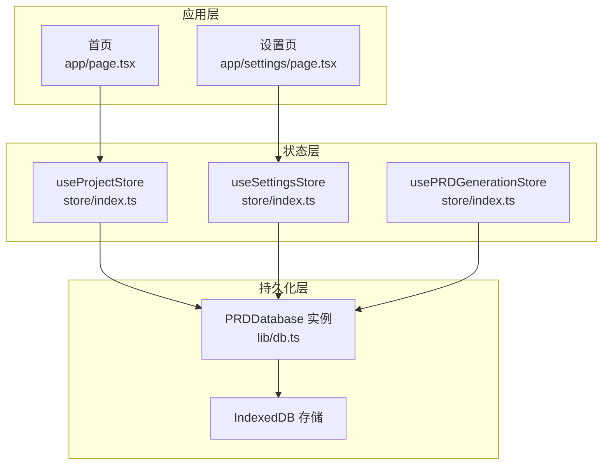
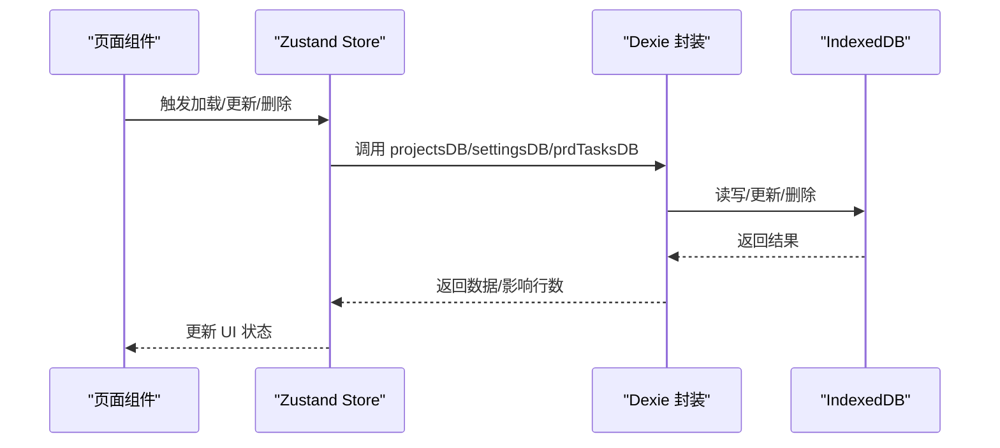
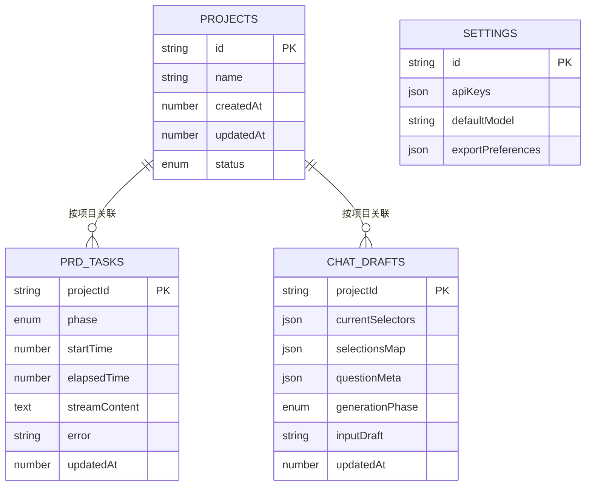
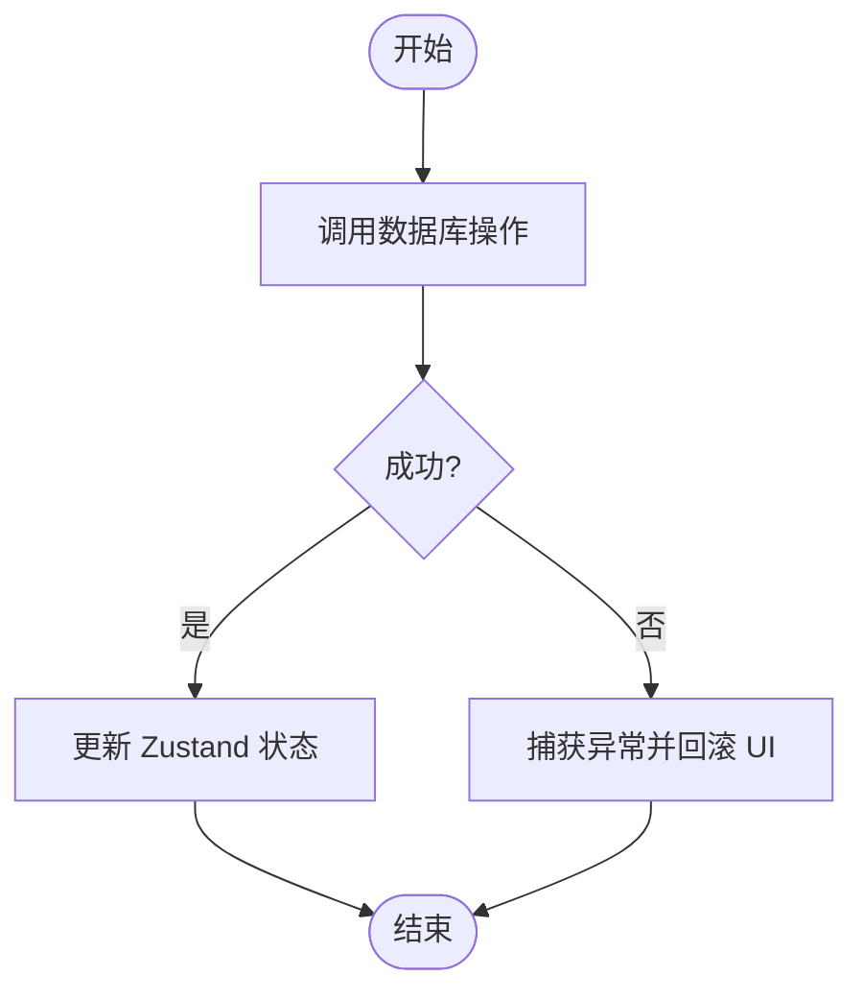
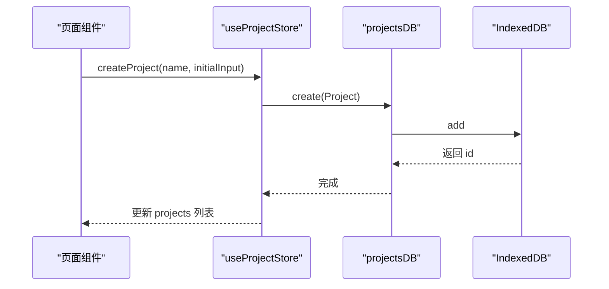
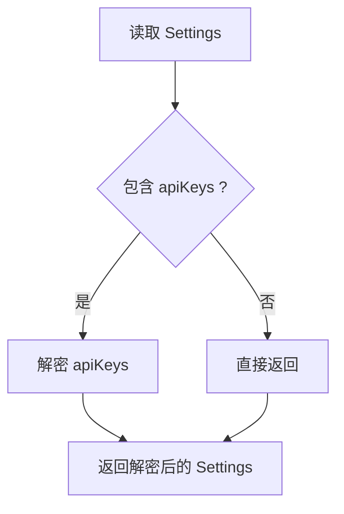
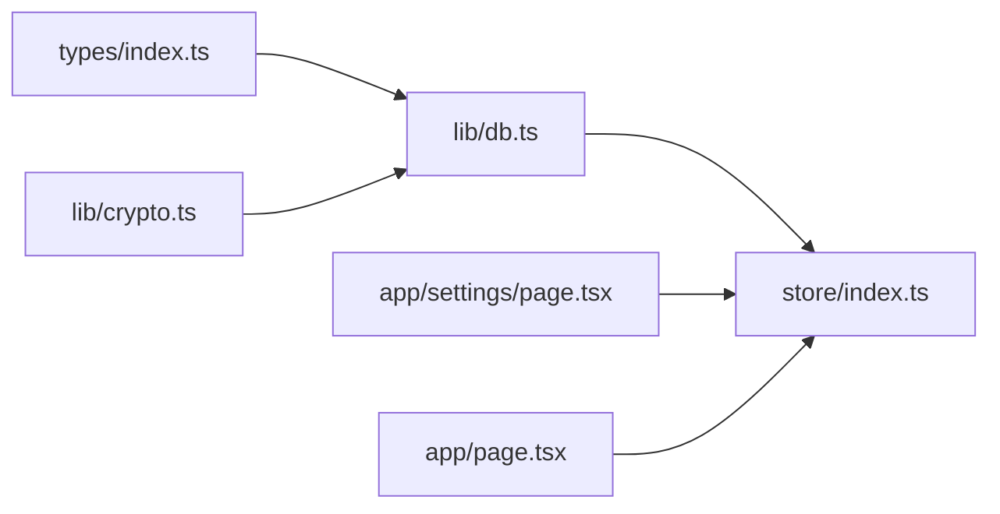

# 数据持久化模块

<cite>
**本文引用的文件**
- [db.ts](file://prd-generator/src/lib/db.ts)
- [index.ts](file://prd-generator/src/store/index.ts)
- [index.ts](file://prd-generator/src/types/index.ts)
- [crypto.ts](file://prd-generator/src/lib/crypto.ts)
- [page.tsx](file://prd-generator/src/app/settings/page.tsx)
- [page.tsx](file://prd-generator/src/app/page.tsx)
</cite>

## 目录
1. [简介](#简介)
2. [项目结构](#项目结构)
3. [核心组件](#核心组件)
4. [架构总览](#架构总览)
5. [详细组件分析](#详细组件分析)
6. [依赖关系分析](#依赖关系分析)
7. [性能考量](#性能考量)
8. [故障排查指南](#故障排查指南)
9. [结论](#结论)
10. [附录](#附录)

## 简介
本文件系统性文档化基于 Dexie.js 的本地数据持久化架构，重点覆盖以下方面：
- 三个数据库实例与对象存储设计：projectsDB、settingsDB、prdTasksDB
- Schema 定义与字段语义：Project、Settings、PRDGenerationTaskPersisted、ChatDraft
- 版本迁移与索引策略
- 事务处理与错误恢复
- 应用状态（Zustand Store）与本地数据库的同步策略
- 数据库初始化、查询优化与存储限制应对的最佳实践

## 项目结构
该模块采用“库层（lib）+ 状态层（store）+ 类型层（types）”的分层组织方式：
- lib/db.ts：封装 Dexie 数据库实例与 CRUD 封装，暴露 projectsDB、settingsDB、chatDraftsDB、prdTasksDB
- lib/crypto.ts：提供对敏感数据（如 API Keys）的加解密与加密判定
- store/index.ts：Zustand 状态管理，负责与数据库交互并维护 UI 层所需的状态
- types/index.ts：定义 Project、Settings、PRDGenerationTaskPersisted、ChatDraft 等类型
- app/settings/page.tsx 与 app/page.tsx：页面入口，触发状态加载与展示

图表来源
- [db.ts](file://prd-generator/src/lib/db.ts#L1-L33)
- [index.ts](file://prd-generator/src/store/index.ts#L1-L216)
- [page.tsx](file://prd-generator/src/app/settings/page.tsx#L1-L60)
- [page.tsx](file://prd-generator/src/app/page.tsx#L1-L38)

章节来源
- [db.ts](file://prd-generator/src/lib/db.ts#L1-L33)
- [index.ts](file://prd-generator/src/store/index.ts#L1-L216)
- [index.ts](file://prd-generator/src/types/index.ts#L62-L243)
- [crypto.ts](file://prd-generator/src/lib/crypto.ts#L1-L107)
- [page.tsx](file://prd-generator/src/app/settings/page.tsx#L1-L60)
- [page.tsx](file://prd-generator/src/app/page.tsx#L1-L38)

## 核心组件
- PRDDatabase（Dexie 实例）：集中定义数据库名称与版本迁移，声明 projects、settings、chatDrafts、prdTasks 四个对象存储及其主键/索引
- projectsDB：封装 Project 的增删改查与搜索
- settingsDB：封装 Settings 的读取、保存、更新；自动处理 API Keys 的加解密
- chatDraftsDB：封装 ChatDraft 的读取、保存、删除与过期清理
- prdTasksDB：封装 PRDGenerationTaskPersisted 的读取、保存、删除、未完成任务筛选与已完成任务清理

章节来源
- [db.ts](file://prd-generator/src/lib/db.ts#L1-L33)
- [db.ts](file://prd-generator/src/lib/db.ts#L35-L209)

## 架构总览
下图展示了数据库、状态层与页面之间的交互关系，以及持久化任务的生命周期。

图表来源
- [index.ts](file://prd-generator/src/store/index.ts#L38-L208)
- [index.ts](file://prd-generator/src/store/index.ts#L210-L258)
- [index.ts](file://prd-generator/src/store/index.ts#L532-L780)
- [db.ts](file://prd-generator/src/lib/db.ts#L35-L209)

## 详细组件分析

### 数据库与 Schema 设计
- 数据库名称：PRDGeneratorDB
- 对象存储与索引：
  - projects：主键 id，索引 name、createdAt、updatedAt、status
  - settings：主键 id（固定 global），用于全局设置
  - chatDrafts：主键 projectId，索引 updatedAt
  - prdTasks：主键 projectId，索引 phase、updatedAt

版本迁移：
- 版本1：初始结构包含 projects 与 settings
- 版本2：新增 chatDrafts 与 prdTasks，并建立相应索引

图表来源
- [db.ts](file://prd-generator/src/lib/db.ts#L15-L28)
- [index.ts](file://prd-generator/src/types/index.ts#L62-L110)
- [index.ts](file://prd-generator/src/types/index.ts#L214-L243)

章节来源
- [db.ts](file://prd-generator/src/lib/db.ts#L15-L28)
- [index.ts](file://prd-generator/src/types/index.ts#L62-L110)
- [index.ts](file://prd-generator/src/types/index.ts#L214-L243)

### 事务处理与错误恢复
- 事务处理：Dexie 的每个 CRUD 操作均在内部事务中执行，保证单次调用的原子性。对于批量操作（如 bulkDelete），Dexie 提供批量删除能力，减少多次往返。
- 错误恢复：
  - Store 中对数据库调用进行 try/catch 包裹，捕获异常并回滚 UI 状态，避免脏数据进入 UI
  - settingsDB 在保存/更新时自动加密 API Keys；若读取到已加密数据会自动解密，确保 UI 层始终看到明文
  - prdTasksDB 在恢复中断任务时，若持久化状态为“生成中”，会将其标记为“错误”，并提示用户重试，同时更新持久化状态，避免状态漂移

图表来源
- [index.ts](file://prd-generator/src/store/index.ts#L51-L60)
- [index.ts](file://prd-generator/src/store/index.ts#L86-L115)
- [db.ts](file://prd-generator/src/lib/db.ts#L75-L137)
- [index.ts](file://prd-generator/src/store/index.ts#L746-L780)

章节来源
- [index.ts](file://prd-generator/src/store/index.ts#L51-L60)
- [index.ts](file://prd-generator/src/store/index.ts#L86-L115)
- [db.ts](file://prd-generator/src/lib/db.ts#L75-L137)
- [index.ts](file://prd-generator/src/store/index.ts#L746-L780)

### 应用状态与数据库同步策略
- 项目列表与当前项目：
  - loadProjects：从 projectsDB.getAll 拉取并按 updatedAt 倒序排序，设置 isLoading=false
  - createProject：生成新 Project 并调用 projectsDB.create，随后仅更新 projects 列表（currentProjectId 从列表派生）
  - loadProject：根据 id 从 projectsDB.getById 获取，若存在则更新列表或追加到列表，再设置 currentProjectId
  - updateProject/deleteProject：调用数据库后仅更新 projects 列表，currentProject 自动派生
  - addMessage/updatePRDContent/setProjectStatus：先更新数据库，再仅更新 projects 列表，保持 UI 最小化重渲染
- 设置：
  - loadSettings：调用 settingsDB.getOrCreate，确保返回解密后的 Settings
  - updateSettings/setApiKey：合并更新，调用 settingsDB.update，Store 仅更新内存状态
- PRD 生成任务：
  - startTask：创建任务并异步持久化（save），不阻塞 UI
  - appendTaskContent：使用数组缓存 chunks，减少字符串拼接开销
  - completeTask/errorTask/cancelTask/clearTask：完成后持久化对应状态，或删除持久化记录
  - restoreTask：从持久化恢复任务，若内存中已有活跃任务则跳过覆盖；若持久化为“生成中”，标记为“错误”

图表来源
- [index.ts](file://prd-generator/src/store/index.ts#L62-L83)
- [db.ts](file://prd-generator/src/lib/db.ts#L46-L49)

章节来源
- [index.ts](file://prd-generator/src/store/index.ts#L38-L208)
- [index.ts](file://prd-generator/src/store/index.ts#L532-L780)
- [db.ts](file://prd-generator/src/lib/db.ts#L35-L209)

### 加密与安全
- settingsDB 在保存/更新 Settings 时，若包含 apiKeys，则调用 encryptApiKeys 进行加密；在 get/getOrCreate 时自动解密，确保 UI 层始终看到明文
- 加密算法基于 CryptoJS AES，密钥通过设备指纹组合生成，提升本地存储的安全性

图表来源
- [db.ts](file://prd-generator/src/lib/db.ts#L75-L137)
- [crypto.ts](file://prd-generator/src/lib/crypto.ts#L68-L107)

章节来源
- [db.ts](file://prd-generator/src/lib/db.ts#L75-L137)
- [crypto.ts](file://prd-generator/src/lib/crypto.ts#L1-L107)

### 查询优化与存储限制应对
- 查询优化：
  - projectsDB.getAll 使用 orderBy('updatedAt').reverse().toArray，按最近更新排序，减少 UI 排序成本
  - prdTasksDB.getIncomplete 使用 where('phase').equals('generating')，利用索引快速筛选未完成任务
  - prdTasksDB.cleanupCompleted 先筛选再批量删除，降低删除成本
- 存储限制应对：
  - chatDraftsDB.cleanupOld：定期清理 7 天前的草稿
  - prdTasksDB.cleanupCompleted：定期清理 1 天前已完成的任务
  - 通过 contentChunks 缓存流式内容片段，减少字符串拼接开销，间接降低内存占用

章节来源
- [db.ts](file://prd-generator/src/lib/db.ts#L35-L209)

## 依赖关系分析
- lib/db.ts 依赖 Dexie 与类型定义，导出 db 实例与 CRUD 封装
- store/index.ts 依赖 db.ts 与 types/index.ts，负责状态同步与业务逻辑编排
- lib/crypto.ts 为 db.ts 的辅助模块，提供加解密能力
- 页面组件通过 store 访问数据库，形成“UI -> Store -> DB -> IndexedDB”的链路

图表来源
- [index.ts](file://prd-generator/src/types/index.ts#L62-L243)
- [db.ts](file://prd-generator/src/lib/db.ts#L1-L33)
- [crypto.ts](file://prd-generator/src/lib/crypto.ts#L1-L107)
- [index.ts](file://prd-generator/src/store/index.ts#L1-L216)
- [page.tsx](file://prd-generator/src/app/settings/page.tsx#L1-L60)
- [page.tsx](file://prd-generator/src/app/page.tsx#L1-L38)

章节来源
- [index.ts](file://prd-generator/src/types/index.ts#L62-L243)
- [db.ts](file://prd-generator/src/lib/db.ts#L1-L33)
- [crypto.ts](file://prd-generator/src/lib/crypto.ts#L1-L107)
- [index.ts](file://prd-generator/src/store/index.ts#L1-L216)
- [page.tsx](file://prd-generator/src/app/settings/page.tsx#L1-L60)
- [page.tsx](file://prd-generator/src/app/page.tsx#L1-L38)

## 性能考量
- 读取路径：优先使用索引查询（如 prdTasksDB.getIncomplete），避免全表扫描
- 写入路径：批量删除（bulkDelete）与异步持久化（startTask/save）降低阻塞
- 内存优化：PRD 生成内容采用 chunks 缓存，减少字符串拼接与大对象复制
- UI 同步：Store 仅更新 projects 列表，currentProjectId 从列表派生，减少状态冗余

## 故障排查指南
- 无法加载项目/设置：
  - 检查 Store 的 loadProjects/loadSettings 是否抛错并回滚 isLoading
  - 确认 db.ts 的 getAll/get 是否返回数据
- API Keys 显示为空：
  - 检查 settingsDB.get/getOrCreate 是否正确解密
  - 确认 isEncrypted 判定逻辑与加密流程一致
- PRD 任务恢复异常：
  - 若内存中已有活跃任务，restoreTask 不会覆盖
  - 若持久化状态为“生成中”，会被标记为“错误”，需提示用户重试
- 存储空间不足或性能下降：
  - 定期运行 cleanupOld/cleanupCompleted 清理过期数据
  - 控制 PRD 内容大小，避免长时间流式生成导致内存膨胀

章节来源
- [index.ts](file://prd-generator/src/store/index.ts#L51-L60)
- [index.ts](file://prd-generator/src/store/index.ts#L86-L115)
- [db.ts](file://prd-generator/src/lib/db.ts#L75-L137)
- [index.ts](file://prd-generator/src/store/index.ts#L746-L780)
- [db.ts](file://prd-generator/src/lib/db.ts#L161-L209)

## 结论
该持久化模块以 Dexie 为核心，结合 Zustand 状态管理，实现了清晰的数据层职责划分与高效的 UI 同步策略。通过版本迁移、索引与批量操作优化，兼顾了功能扩展与性能表现；通过加密与错误恢复机制，提升了安全性与可用性。建议在后续迭代中持续监控存储使用情况，完善清理策略与异常上报。

## 附录
- 数据库初始化：PRDDatabase 在构造函数中定义数据库名与版本迁移，无需显式 open 调用，Dexie 会在首次访问时自动打开
- 最佳实践清单：
  - 使用索引字段进行过滤与排序
  - 对批量删除使用 bulkDelete
  - 对敏感字段（如 API Keys）统一走加密/解密流程
  - 定期清理过期草稿与已完成任务
  - 在 UI 层仅维护最小必要状态，避免重复渲染